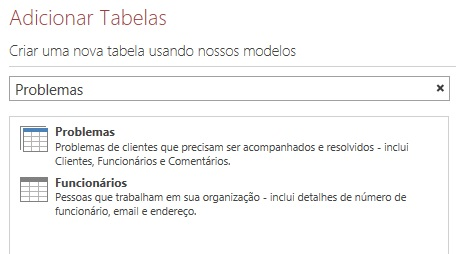
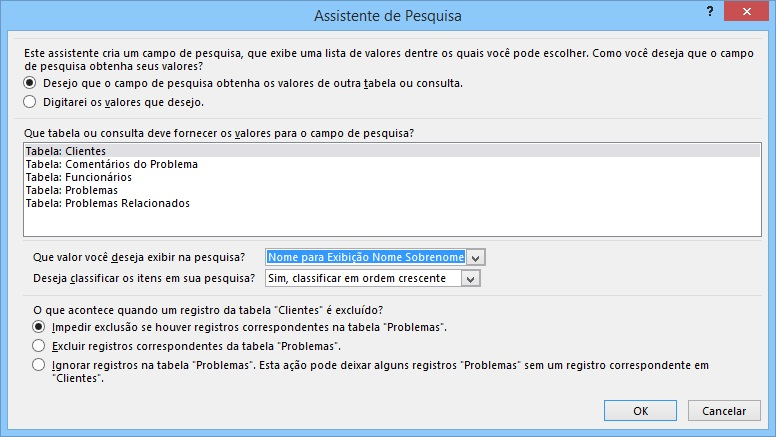
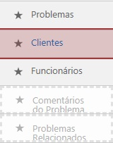
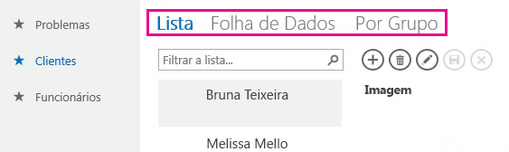
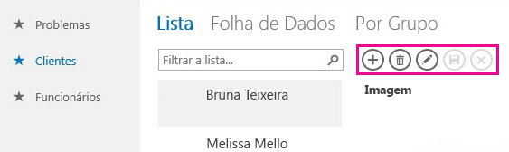
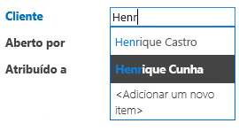
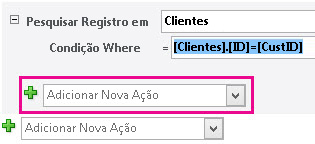
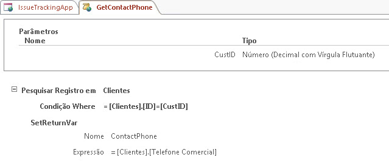
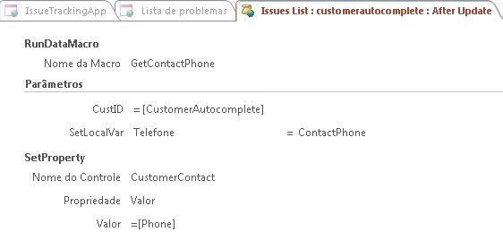
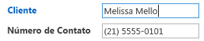

# Criar e personalizar um aplicativo Web no AccessCreate and customize a web app in Access

> [!IMPORTANT]
> A Microsoft não recomenda mais criar e usar aplicativos Web do Access no SharePoint. Como alternativa, use o [Microsoft PowerApps](https://powerapps.microsoft.com/pt-BR/) para criar soluções de negócios sem código para a Web e dispositivos móveis.Microsoft no longer recommends creating and using Access web apps in SharePoint. As an alternative, consider using [Microsoft PowerApps](https://powerapps.microsoft.com/pt-BR/) to build no-code business solutions for the web and mobile devices. 
  
Access 2013 apresenta um novo modelo de aplicativo, que permite aos especialistas da área criar de forma rápida os aplicativos baseados na Web. Acompanha Access um conjunto de modelos que podem ser usados para promover a criação de aplicativos.Access 2013 features a new application model that enables subject matter experts to quickly create web-based applications. Included with Access are a set of templates that you can use to jump start creating your application.

## Pré-requisitos para a criação de um aplicativo no Access 2013Prerequisites for building an app with Access 2013

Para acompanhar as etapas deste exemplo, será necessário:To follow the steps in this example, you need the following:
  
- AccessAccess
    
- Um ambiente de desenvolvimento do SharePointA SharePoint development environment
    
Para obter mais informações sobre como configurar o ambiente de desenvolvimento do SharePoint, confira [Configurar um ambiente de desenvolvimento geral para o SharePoint](https://docs.microsoft.com/sharepoint/dev/general-development/set-up-a-general-development-environment-for-sharepoint).For more information about setting up your SharePoint development environment, see [Set up a general development environment for SharePoint](https://docs.microsoft.com/sharepoint/dev/general-development/set-up-a-general-development-environment-for-sharepoint). 
  
Para saber mais sobre como obter o Access e o SharePoint, confira [Downloads](https://msdn.microsoft.com/office/apps/fp123627).For more information about obtaining Access and SharePoint, see [Downloads](https://msdn.microsoft.com/office/apps/fp123627).

## Criar o aplicativoCreate the app

Imagine que você deseja criar um Access aplicativo que acompanha problemas em sua empresa. Antes de começar a criar as tabelas e vista do zero, você deve procurar um modelo de esquema que atenda às suas necessidades.Suppose you want to create an Access app that tracks issues for your business. Before you start creating the tables and view from scratch, you should search for a schema template that meets your needs.
  
### Para criar o aplicativo de acompanhamento de problemasTo create the issue tracking app

1. Abra o Access e escolha a opção **Aplicativo da Web personalizado**.Open Access and choose **Custom web app**.
    
2. Digite um nome e um local da Web para o aplicativo. É possível também escolher um local na lista **Locais** e escolher **Criar**.Enter a name and the web location for your app. You can also choose a location from the **Locations** list and choose **Create**.
    
3. Digite **Problemas** na caixa **O que deseja acompanhar?** e pressione ENTER.Type **Issues** into the **What would you like to track?** box and then press ENTER. 
    
   Uma lista de modelos que podem ser úteis para o acompanhamento de problemas é exibida na Figura 1.A list of templates that might be useful for tracking issues is displayed in Figure 1.
    
   **Figura 1. Modelos que correspondem à pesquisa de problemas****Figure 1. Templates that match the search for issues**

   
  
4. Escolha **Problemas**.Choose **Issues**.
    
O Access cria um conjunto de tabelas e de modos de exibição.Access creates a set of tables and views.
  
## Explorar o aplicativoExplore the app

Para compreender se o esquema e os modos de exibição atendem às suas necessidades, será necessário testá-los.To understand whether the schema and views meet your needs, you should examine them.
  
As tabelas criadas por meio da seleção do esquema Problemas serão exibidas no Painel Bloco. As tabelas Problemas, Clientes e Funcionários são o objeto principal do aplicativo. A tabela Problemas armazena informações sobre cada problema. Cada problema é aberto e atribuído por um funcionário em nome de um cliente. As tabelas Problemas Relacionados e Comentários do Problema desempenham um papel de suporte no aplicativo. A tabela Problemas Relacionados permite a vinculação de um problema a outro. A tabela Comentários do Problema armazena vários comentários para um único problema.The tables created by selecting the Issues schema are displayed in the Tile Pane. The Issues, Customer, and Employees tables are the main focus of the app. The Issues table stores information about each issue. Each issue is opened by and assigned to an employee on behalf of a customer. The Related Issues and Issue Comments tables play a supporting role in the app. The Related Issues table enables you to link one issue to another. The Issue Comments table stores multiple comments for a single issue.
  
Em um banco de dados de área de trabalho do Access (.accdb), os relacionamentos entre tabelas são gerenciados na janela **Relacionamentos**. Access 2013 Os aplicativos gerenciam os relacionamentos usando campos para definir o tipo de dados de **Pesquisa**. Teste os relacionamentos da tabela Problemas ao clicar com o botão direito de mouse no bloco **Problemas** e selecione **Editar Tabela**.In an Access desktop (.accdb) database, the relationships between tables are managed in the **Relationships** window. Access 2013 apps manage relationships by using fields set to the **Lookup** data type. Let's examine the relationships for the Issues table by right-clicking the **Issues** tile and selecting **Edit Table**.
  
O campo **Cliente** está relacionado à tabela **Clientes**. Para testar os relacionamentos, selecione o campo **Cliente** e, em seguida, **Modificar Pesquisas**. O **Assistente de pesquisa** é exibido como na Figura 2.The **Customer** field is related to the **Customers** table. To examine the relationship, select the **Customer** field and then select **Modify Lookups**. The **Lookup Wizard** is displayed, as shown in Figure 2. 
  
**Figura 2. O assistente de pesquisa exibindo a relação da tabela Clientes****Figure 2. Lookup Wizard displaying the relationship to the Customers table**

  
A caixa de diálogo do assistente de pesquisa mostra que o campo **Cliente** está associado à tabela **Clientes** e para retornar ao campo **Nome para Exibição Nome Sobrenome** na tabela **Clientes**.The Lookup Wizard dialog box shows that the **Customer** field is linked to the **Customers** table and to return the **Display Name First Last** field from the **Customers** table. 
  
Os campos **Aberto por**, **Atribuído por** e **Alterado por** estão relacionados à tabela **Funcionários**. Diversos outros campos também são definidos para o tipo de dados de **Pesquisa**. Nesses casos, o tipo de dados de pesquisa é usado para determinar os valores específicos a serem permitidos no campo.The **Opened By**, **Assigned To**, and **Changed By** fields are related to the **Employees** table. Several other fields are also set to the **Lookup** data type. In these cases, the Lookup data type is used to specify the specific values to allow for in the field. 
  
Feche a tabela **Problemas** e teste o Painel Bloco. Os três blocos superiores, para as tabelas **Problemas**, **Clientes** e **Funcionários** são exibidos de forma diferente em relação aos dois blocos inferiores, para as tabelas **Problemas Relacionados** e **Comentários do Problema**, como mostrado na Figura 3.Close the **Issues** table and examine the Tile Pane. The top three tiles, for the **Issues**, **Customers**, and **Employees** tables, are displayed differently than the bottom two tiles for the **Related Issues** and **Issue Comments** table, as shown in Figure 3. 
  
**Figura 3. Painel Bloco para o esquema Problemas****Figure 3. Tile Pane for the Issues schema**

  
As tabelas **Problemas Relacionados** e **Comentários do Problema** estarão desativadas, pois devem ser ocultadas do usuário no navegador da Web.The **Related Issues** and **Issue Comments** tables are dimmed because they are to be hidden from the user in the web browser. 
  
Use o aplicativo para acompanhar alguns problemas. Para isso, clique em **Iniciar aplicativo** para abri-lo no navegador da Web.Let's use the app to track some issues. To do this, click **Launch App** to open the app in your web browser. 
  
O aplicativo vai abrir a exibição **Lista de Problemas** da tabela Problemas. Antes de adicionar um problema, convém adicionar alguns clientes e funcionários. Clique no bloco **Clientes** para começar a adicioná-los.The app opens the **Issues List** view of the Issues table. Before adding an issue, it would be a good idea to add some customers and employees. Click the **Customers** tile to start adding customers. 
  
Use o Seletor de Modo de Exibição para escolher um entre os três disponíveis para a tabela **Clientes**, rotulados como **Lista**, **Folha de Dados** e **Grupos**, como mostrado na Figura 4.Use the View Selector to choose one of three views available for the **Customers** table, labeled **List**, **Datasheet**, and **Groups** as shown in Figure 4. 
  
**Figura 4. Seletor de Modo de Exibição****Figure 4. View Selector**

  
Escolher **Lista** vai ativar o modo de exibição de **Lista de Clientes**, que é um modo de exibição de Detalhes da Lista. Detalhes da Lista é um dos modos de exibição Access gerados automaticamente quando você criar uma tabela. A principal característica que distingue o modo de exibição Detalhes da Lista é o painel de Lista exibido ao lado esquerdo da exibição. Esse painel é usado para filtrar e para navegar entre os registros no modo de exibição. Em um Access banco de dados de área de trabalho, implementar um modo de exibição de lista pesquisável exige um código escrito personalizado.Choosing **List** activates the **Customers List** view, which is a List Details view. List Details is one of the views Access automatically generates when you create a table. The main feature that distinguishes a List Details view is the list pane that appears on the left side of the view. The list pane is used to filter and navigate the records contained in the view. In an Access desktop database, implementing a searchable list view would require writing custom code. 
  
Escolher a **Folha de Dados** abrirá o modo de exibição **Folha de Dados de Clientes**. A Folha de Dados é outro tipo de visualização que o Access gera automaticamente quando cria uma tabela. Os modos de exibição de Folha de Dados são úteis para quem considerar mais fácil inserir, classificar e filtrar dados, como se o fizesse em uma planilha.Choosing **Datasheet** opens the **Customers Datasheet** view. Datasheet is the other kind of view Access automatically generates when you create a table. Datasheet views are useful for those who find it easier to enter, sort, and filter data in a spreadsheet-like manner. 
  
Escolher Grupos abrirá o Modo de Exibição de Resumo. Esse recurso pode ser usado para agrupar registros baseados em um campo e, opcionalmente, poderá calcular uma soma ou uma média.Choosing Groups opens a Summary view. Summary views can be used to group records based on a field and optionally calculate a sum or average.
  
À medida que adicionar clientes, use a Barra de Ações para adicionar, editar, salvar e excluir registros, além de cancelar edições. A Barra de Ações é uma barra de ferramentas personalizável, exibida na parte superior dos modos de exibição, como mostrado na Figura 5.As you're adding customers, use the Action Bar to add records, edit records, save records, delete records, and cancel edits. The Action Bar is a customizable toolbar that appears at the top of each view, as shown in Figure 5.
  
**Figura 5. Barra de Ações****Figure 5. Action Bar**

  
Ao adicionar alguns clientes e funcionários, abra o modo de exibição Lista de Problemas e comece a adicionar problemas. À medida que você digitar o nome de um cliente na caixa Cliente, serão exibidos um ou mais nomes de clientes, como mostrado na Figura 6.Once you've added some customers and employees open the Issues List view and start adding an issue. As you type the name of a customer into the into the Customer box, one or more of the customer names will appear, as shown in Figure 6.
  
**Figura 6. Controle de Preenchimento Automático****Figure 6. AutoComplete control**

  
A caixa Cliente é um controle de preenchimento automático. Esse controle exibe uma lista de registros que correspondem ao que você estiver digitando dentro da caixa. Isso ajuda a garantir a precisão da entrada de dados.The Customer box is an AutoComplete control. The AutoComplete control displays a list of records that match what you're typing into the box. This helps ensure the accuracy of data entry.
  
## Personalizar o aplicativoCustomize the app

Agora que você está familiarizado com o aplicativo, observe que o modo de exibição Lista de Problemas não inclui as informações de contato dos clientes. Personalize o aplicativo para adicionar o telefone comercial do cliente à tabela Problemas, à medida que o problema for criado.Now that you've taken a tour of the app, you notice that the Issues List view doesn't contain contact information for the customer. Let's customize the app to add the customer's work phone to the Issues table as the issue is being created.
  
### Para adicionar um campo à tabela ProblemasTo add a field to the Issues table

1. Abra o aplicativo no Access.Open the app in Access.
    
2. Selecione o bloco **Problemas**, escolha o ícone **Configurações/Ações** e selecione **Editar Tabela**.Choose the **Issues** tile, choose the **Settings/Action** icon, and then choose **Edit Table**.
    
3. Digite o **Número de Contato** na primeira célula em branco, na coluna **Nome do Campo**.Enter **Contact Number** in the first blank cell in the **Field Name** column. 
    
4. Escolha **Texto Curto** na coluna **Tipo de Dados**.Choose **Short Text** in the **Data Type** column. 
    
5. Escolha **Salvar**.Choose **Save**.
    
6. Feche a tabela Problemas.Close the Issues table.
    
Agora que você já tem um campo para armazenar o número de telefone, crie uma macro de dados para pesquisar as informações do contato.Now that we have field in which to store the phone number, let's create a data macro to look up the contact information.
  
### Como criar a macro de dados para pesquisar informações de contatoTo create the data macro to look up contact information

1. No grupo **Criar**, selecione **Avançado** e escolha **Macro de Dados**.In the **Create** group, choose **Advanced**, and then choose **Data Macro**.
    
2. Escolha **Criar Parâmetro**.Choose **Create Parameter**.
    
3. Na caixa **Nome**, digite **CustID**. Na lista suspensa **Tipo**, escolha **Número (Decimal Flutuante).**In the **Name** box, enter **CustID**. In the **Type** dropdown, choose **Number (Floating Decimal).**
    
4. Na lista suspensa **Adicionar Nova Ação**, escolha **LookupRecord**.From the **Add New Action** dropdown, choose **LookupRecord**. 
    
5. Na lista suspensa **Pesquisar Novo Registro em**, escolha **Clientes**.In the **Look Up A Record In** dropdown, choose **Customers**. 
    
6. Na caixa **Condição Where**, digite **[Clientes].[ID]=[CustID]**.In the **Where Condition** box, enter **[Customers].[ID]=[CustID]**. 
    
7. Escolha **SetReturnVar** na lista suspensa **Adicionar Nova Ação**.Choose **SetReturnVar** from the **Add New Action** dropdown. 
    
    > [!NOTE]
    > Serão exibidas duas listas suspensas **Adicionar Nova Ação**, uma dentro do bloco **LookupRecord** e outra fora **dele**. É necessário escolher a lista suspensa **Adicionar Nova Ação** dentro do bloco **LookupRecord**, como descrito na Figura 7.You'll see two **Add New Action** dropdowns, one within the **LookupRecord** block, and another outside the **LookupRecord** block. You should choose the **Add New Action** dropdown within the **LookupRecord** block, as shown in Figure 7. 
  
   **Figura 7. Lista suspensa Adicionar Nova Ação****Figure 7. Add New Action dropdown**

   
  
8. Na caixa **Nome**, digite **ContactPhone**.In the **Name** box, enter **ContactPhone**. 
    
9. Na caixa **Expressão**, digite **[Clientes].[Telefone Comercial]**.In the **Expression** box, enter **[Customers].[Work Phone]**. 
    
10. Selecione **Salvar**. Digite **GetContactPhone** na caixa **Nome da Macro** e clique em **OK**.Choose **Save**. Enter **GetContactPhone** in the **Macro Name** box and then choose **OK**.
    
    A macro deverá ser semelhante à macro exibida na Figura 8.The macro should resemble the macro shown in Figure 8.
    
    **Figura 8. Macro de dados GetContactPhone****Figure 8. GetContactPhone data macro**

    
  
11. Feche o Modo Design da macro.Close macro Design View.
    
Agora você está pronto para adicionar o campo **Número de Contato** ao formulário Lista de Problemas.Now we're ready to add the **Contact Number** field to the Issues List form. 
  
### Para adicionar o campo Número de Contato ao formulário Lista de ProblemasTo add the Contact Number field to the Issues List form

1. Selecione a tabela **Problemas**. Desse modo, o formulário Lista de Problemas será selecionado.Choose the **Issues** table. This chooses the Issues list form. 
    
2. No Seletor de Modo de Exibição, selecione **Lista**, clique no ícone **Configurações/Ações** e escolha **Editar**.In the View selector, choose **List**, choose the **Settings/Action** icon, and then choose **Edit**.
    
3. Arraste o campo **Número de Contato** do painel **Lista do Campo** para o local do formulário no qual deseja que o número de contato seja exibido.Drag the **Contact Number** field form the **Field List** pane to the location on the form where you want the contact number to be displayed. 
    
4. Selecione a caixa de texto **Número de Contato** e clique em **Dados**.Choose the **Contact Number** text box, and then click **Data**. 
    
5. Na caixa **Nome do Controle**, digite **CustomerContact** e feche o menu pop-up **Dados**.In the **Control Name** box, enter **CustomerContact** and then close the **Data** popup. 
    
6. Escolha **Salvar**.Choose **Save**.
    
Agora é necessário escrever uma macro de interface do usuário (UI), que copiará o campo **Telefone Comercial**, da tabela **Clientes** para o campo **Telefone de Contato** da tabela **Problemas**. O evento **After Update** do controle **CustomerAutocomplete** é um bom local para a macro.Now we should write a user interface (UI) macro that copies the **Work Phone** field from the **Customers** table into the **Contact Phone** field of the **Issues** table. The **After Update** event of the **CustomerAutocomplete** control is a good location for the macro. 
  
### Para criar uma macro AfterUpdateTo create the AfterUpdate macro

1. Escolha o controle **CustomerAutocomplete**, selecione o botão **Ações** e clique em **Após Atualização**.Choose the **CustomerAutocomplete** control, choose the **Actions** button, and then choose **After Update**. 
    
    Uma macro em branco será aberta no Modo Design de macro.A blank macro is opened in macro Design View.
    
2. Na lista suspensa **Adicionar Nova Ação**, escolha **RunDataMacro**.From the **Add New Action** dropdown, choose **RunDataMacro**. 
    
3. Na lista suspensa **Nome da macro**, escolha **GetContactPhone**.In the **Macro Name** dropdown, choose **GetContactPhone**. 
    
4. Na caixa **CustID**, digite **[CustomerAutocomplete]**.In the **CustID** box, enter **[CustomerAutocomplete]**. 
    
5. Na caixa **SetLocalVar**, digite **Phone**.In the **SetLocalVar** box, enter **Phone**. 
    
    Quando você escolhe a macro de dados GetContactPhone criada anteriormente, o Access preenche automaticamente no nome do parâmetro e retorna variáveis para a macro.When you chose the GetContactPhone data macro that was created earlier, Access automatically filled in the parameter name and return variable for the macro.
    
    O número de telefone do cliente será armazenado em uma variável chamada Telefone.The phone number for the customer is stored in a variable named Phone.
    
6. A partir da lista suspensa **Adicionar Nova Ação**, escolha **SetProperty**.From the **Add New Action** dropdown, choose **SetProperty**. 
    
7. Na caixa **Nome do Controle**, digite **CustomerContact**.In the **Control Name** box, enter **CustomerContact**. 
    
8. Na lista suspensa **Propriedades**, escolha **Valor**.In the **Property** dropdown, choose **Value**. 
    
9. Na caixa **Valor**, digite **=[Phone]**.In the **Value** box, enter **=[Phone]**. 
    
10. Escolha **Salvar**.Choose **Save**.
    
    A macro deverá ser semelhante à macro exibida na Figura 9.The macro should resemble the macro shown in Figure 9.
    
    **Figura 9. Macro Após Atualização****Figure 9. After Update macro**

    
  
11. Feche o Modo Design da macro.Close macro Design View.
    
12. Feche o modo de exibição Lista de Problemas. Escolha **Sim**, quando for solicitado que você salve as alterações.Close the Issues List view. Choose **Yes** when you are prompted to save your changes. 
    
Agora estamos prontos para testar a personalização.Now we're ready to text the customization. Clique em **Iniciar Aplicativo** para abrir o aplicativo no navegador da web e adicionar um problema novo.Click **Launch App** to open the app in your web browser and then add a new issue. A caixa **Número de Contato** será atualizada automaticamente depois que o nome do cliente for digitado, como mostra a Figura 10.The **Contact Number** box updates automatically after the customer name is entered,  as shown in Figure 10. 
  
**Figura 10. O modo de exibição Problemas atualizado com o número de telefone****Figure 10. Issues view updated with phone number**

  
## ConclusãoConclusion

Usar um dos modelos de esquema que acompanham o é uma boa maneira de promover a criação de um Access aplicativo da Web. Os modos de exibição criados automaticamente por você contêm funcionalidades avançadas que exigem a implementação de código personalizado em um banco de dados de área de trabalho do Access.Using one of the schema templates included with is a good way to jump start the creation of an Access web app. The views that are automatically created for you contain advanced functionally that requires custom code to implement in a Access desktop database. 
  
## Confira tambémSee also

- [Novidades para os desenvolvedores do Access 2013What's new for Access 2013 developers](https://msdn.microsoft.com/library/df778f51-d65e-4c30-b618-65003ceb39b3%28Office.15%29.aspx) 
- [Referência de aplicativo Web personalizado do AccessAccess custom web app reference](access-custom-web-app-reference.md)
  

