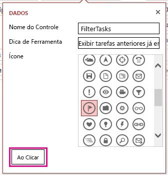
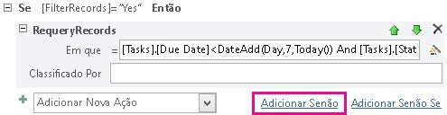

# <a name="filter-a-view-by-using-a-macro-in-an-access-app"></a>Filtrar um modo de exibição usando uma macro em um aplicativo do Access

Saiba como filtrar um modo de exibição em um aplicativo do Access usando a ação de macro RepetirConsultaDeRegistros e uma macro de dados.
  
> [!IMPORTANT]
> A Microsoft não recomenda mais criar e usar aplicativos Web do Access no SharePoint. Como alternativa, use o [Microsoft PowerApps](https://powerapps.microsoft.com/pt-BR/) para criar soluções de negócios sem código para a Web e dispositivos móveis. 

O modo de exibição padrão de listas em um aplicativo do Access permite filtrar os problemas dos valores contidos nos campos. Pode haver casos em que você queira filtrar um modo de exibição com base em um conjunto de condições ao invés de corresponder com um valor. Para isso é necessário criar uma macro. Este artigo mostra como criar uma macro que filtra o modo de exibição para exibir as tarefas em atraso ou que devem ser finalizadas nos próximos 7 dias.
  
## <a name="prerequisites-for-building-an-app-with-access"></a>Pré-requisitos para a criação de um aplicativo no Access
<a name="Access2013FilterViewByUsingMacro_Prerequisites"> </a>

Para acompanhar as etapas deste exemplo, é necessário:
  
- Access 2013
- Um ambiente de desenvolvimento do SharePoint 2013
    
> [!NOTE]
> Para obter mais informações sobre como configurar o ambiente de desenvolvimento do SharePoint, consulte [Configurar um ambiente de desenvolvimento geral para o SharePoint 2013](https://msdn.microsoft.com/library/08e4e4e1-d960-43fa-85df-f3c279ed6927%28Office.15%29.aspx). Para obter mais informações sobre como obter Access 2013 e SharePoint 2013, consulte [Downloads](https://msdn.microsoft.com/office/apps/fp123627). 
  
## <a name="create-the-app"></a>Criar o aplicativo
<a name="Access2013FilterViewByUsingMacro_CreateApp"> </a>

Imagine que você deseja criar um aplicativo do Access que acompanha as tarefas em sua empresa. Antes de começar a criar as tabelas e visualizações, você deve procurar um modelo de esquema.
  
### <a name="to-create-the-task-tracking-app"></a>Para criar o aplicativo de acompanhamento de tarefas

1. Abra o Access e escolha a opção **Aplicativo Web personalizado**.
    
2. Digite um nome e um local da Web para o aplicativo. É possível também escolher um local na lista **Locais** e escolher **Criar**.
    
3. Digite **tarefas** na caixa **Pesquisar** e pressione ENTER. 
    
    Uma lista de modelos que podem ser úteis para o acompanhamento de tarefas é exibida na Figura 1.
    
   **Figura 1. Modelos que correspondem à pesquisa por “tarefas”**

   
  
4. Escolha **Tarefas**.
    
O Access cria um conjunto de tabelas e visualizações.
  
Insira vários exemplos de tarefas e de funcionários em seu aplicativo. Para isso, escolha **Iniciar Aplicativo** para abri-lo no navegador da Web. Insira um valor no campo **Data de Conclusão** para cada tarefa. Retorne ao Access quando terminar. 
  
## <a name="plan-the-customizations"></a>Planejar as personalizações
<a name="Access2013FilterViewByUsingMacro_PlanCustomizations"> </a>

Agora você tem um aplicativo com várias tarefas. O modo de exibição padrão permite pesquisar as tarefas usando itens armazenados nos campos exibidos no modo de exibição. Por exemplo, você pode pesquisar por problemas de alta prioridade ou em andamento. Vamos supor que você queira priorizar seu trabalho exibindo as questões ativas que têm conclusão na próxima semana. Para isso, você deve criar uma macro de interface do usuário.
  
O comando de macro de interface do usuário que você pode usar para filtrar o modo de exibição é [Ação de Macro RepetirConsultaDeRegistros (aplicativo Web personalizado do Access)](requeryrecords-macro-action-access-custom-web-app.md). A ação de macro **RepetirConsultaDeRegistros** filtra o modo de exibição com base no argumento *Where*, que é fornecido em forma de uma cláusula WHERE do SQL. Para filtrar o modo de exibição, você deve fornecer vários fatos em um formato específico para filtrar o modo de exibição. 
  
Os fatos relevantes são:
  
- Um ou mais campos a comparar
    
- Como se referir à data de hoje
    
- Como se referir a um determinado dia em relação à data de hoje
    
- Como determinar quais tarefas estão em andamento
    
O campo **Data de Conclusão** fornece informações sobre quando uma tarefa deve ser concluída. O campo **Status** fornece informações sobre o estado de cada tarefa. Para fazer referência a um campo em uma macro, use o formato **[*NomeTabela*].[*NomeCampo*]**. Use **[Tarefas].[Data de Conclusão]** para se referir ao campo **Data de Conclusão** e **[Tarefas].[Status]** para se referir ao campo **Status**. 
  
A [Função Hoje (aplicativo Web personalizado do Access)](today-function-access-custom-web-app.md) retorna a data de hoje. A [Função SomData (aplicativo Web personalizado do Access)](dateadd-function-access-custom-web-app.md) pode ser usada para calcular uma data que está um determinado número de dias após a data especificada. 
  
O campo **Status** contém vários valores possíveis. O valor **Concluído** indica que a tarefa não está mais ativa. 
  
Essas informações podem ser combinadas na seguinte cláusula WHERE do SQL.
  
```sql
[Tasks].[Due Date]<DateAdd(Day,7,Today()) AND [Tasks].[Status]<>"Completed"
```

A cláusula WHERE do SQL é usada na macro para filtrar o modo de exibição, a fim de mostrar os problemas ativos que vencem nos próximos 7 dias ou que estejam atrasados.
  
Para executar a macro de interface do usuário, ela deve estar conectada a um item ou um evento que ocorra no modo de exibição. A **Barra de Ações** é um lugar conveniente para adicionar um comando personalizado ao modo de exibição. A **Barra de Ações** é uma barra de ferramentas personalizável, exibida na parte superior dos modos de exibição. Por padrão, a **Barra de Ações** contém botões para adicionar, editar, salvar, excluir e cancelar edições. Você pode adicionar botões que realizam ações personalizadas, como a filtragem do modo de exibição. 
  
Se o modo de exibição contiver registros que atendam aos critérios especificados, então **RepetirConsultaDeRegistros** filtra o modo de exibição. No entanto, se o modo de exibição não contiver registros que atendam aos critérios, então, um novo registro em branco será exibido. Se você não quiser que um registro em branco seja exibido caso não haja tarefas atrasadas para a próxima semana, então é necessário encontrar um método para verificar as tarefas antes de chamar a ação de macro **RepetirConsultaDeRegistros**. Para isso, crie uma macro de dados para verificar se há registros que atendem aos critérios. 
  
A macro da interface do usuário chamará uma macro de dados, que tentará encontrar uma tarefa a vencer na próxima semana. Se a macro de dados localizar a tarefa, então personalize o aplicativo.
  
## <a name="customize-the-app"></a>Personalizar o aplicativo
<a name="Access2013FilterViewByUsingMacro_CustomizeApp"> </a>

Agora que você determinou as personalizações, é hora de implementá-las. Primeiro é necessário criar as macros de dados. Algumas macros de dados são anexadas diretamente a tabelas. No entanto, esta macro de dados é autônoma.
  
### <a name="to-create-the-data-macro"></a>Para criar macros de dados

1. Abra o aplicativo no Access.
    
2. No grupo **Criar**, selecione **Avançado** e depois **Macro de Dados**.
    
    Uma macro de dados em branco será aberta no Modo Design de macro.
    
3. Na caixa de listagem **Adicionar Nova Ação**, escolha **PesquisarRegistro**.
    
4. Na caixa de listagem **Procurar Registro Em**, escolha **Tarefas**.
    
5. Na caixa **Condição Where**, digite **[Tarefas].[Data de Conclusão]\<SomData(Dia,7,Hoje()) E [Tarefas].[Status]\<\>"Concluído"**. 
    
6. Escolha **DefinirVardeRetorno** na caixa de listagem **Adicionar Nova Ação**. 
    
    > [!NOTE]
    > Serão exibidas duas caixas de listagem **Adicionar Nova Ação**, uma dentro do bloco **PesquisarRegistro** e outra fora **dele**. É necessário escolher a caixa de listagem **Adicionar Nova Ação** dentro do bloco **PesquisarRegistro**, como mostrado na Figura 1. 
  
   **Figura 1. Caixa de listagem Adicionar Nova Ação**

   
  
7. Na caixa **Nome**, digite **TarefaEncontrada**. 
    
8. Na caixa **Expressão**, digite **"Sim"**. 
    
9. Escolha **Salvar**. Digite **TarefaConclusãoPróxima** na caixa **Nome da Macro** e clique em **OK**.
    
    A macro deve ser semelhante à macro exibida na Figura 2.
    
   **Figura 2. Macro de dados TarefaConclusãoPróxima**

   
  
10. Feche o Modo Design da macro.
    
Agora estamos prontos para adicionar um botão personalizado à Barra de Ações.
  
### <a name="to-add-a-custom-button-to-the-action-bar"></a>Adicionar um botão personalizado à barra de ações

1. Escolha a tabela **Tarefas**. Isso escolhe o formulário Lista de Tarefas. 
    
2. No Seletor de Modo de Exibição, selecione **Lista**, clique no ícone **Configurações/Ações** e escolha **Editar**.
    
    O modo de exibição abre no modo Design.
    
3. Agora estamos prontos para adicionar um botão personalizado à Barra de Ações. Para isso, escolha **Adicionar ação personalizada** como mostrado na Figura 3. 
    
   **Figura 3. Botão Adicionar ação personalizada**

   
  
    A nova ação é exibida como um botão com um ícone de estrela, como mostrado na Figura 4.
    
   **Figure 4. Novo botão da Barra de Ações**

   
  
4. Escolha o botão personalizado da Barra de Ações e, em seguida, selecione o ícone **Dados**. 
    
    A caixa de diálogo **Dados** é exibida. 
    
5. Na caixa **Nome do Controle**, digite **FiltrarTarefas**. 
    
6. Na caixa **Dica de ferramenta**, digite **Exibir tarefas vencidas ou a vencer na próxima semana**. 
    
Agora estamos prontos para criar a macro de interface do usuário que filtrará o modo de exibição.
  
### <a name="to-create-the-ui-macro-to-filter-the-view"></a>Para criar a macro de interface do usuário para filtrar o modo de exibição

1. Na caixa de diálogo **Dados**, escolha **Ao Clicar** como mostrado na Figura 5. 
    
   **Figura 5. Caixa de diálogo Dados**

   
  
    Uma macro de interface do usuário em branco será exibida no Modo Design de macro.
    
2. Na caixa de listagem **Adicionar Nova Ação**, escolha **ExecutarMacrodeDados**. 
    
3. Na caixa Nome da Macro, digite **TarefaConclusãoPróxima**. 
    
    Na caixa **DefinirVarLocal**, digite **FiltrarRegistros**. 
    
    A ação **ExecutarMacrodeDados** chama a macro de dados **TarefaConclusãoPróxima** criada anteriormente e armazena o resultado em uma variável chamada **FiltrarRegistros**. 
    
4. Na caixa de listagem **Adicionar Nova Ação**, escolha **Se**. 
    
5. Na caixa **Se**, digite **[FiltrarRegistros]="Sim"**. 
    
6. Na caixa de listagem **Adicionar Nova Ação**, escolha **RepetirConsultaDeRegistros**. 
    
    > [!NOTE]
    > Serão exibidas duas caixas de listagem **Adicionar Nova Ação**, uma dentro do bloco **Se** e outra fora **dele**. É necessário escolher a caixa de listagem **Adicionar Nova Ação** dentro do bloco **Se**, como mostrado na Figura 6. 
  
   **Figura 6. Caixa de listagem Adicionar Nova Ação**

   
  
7. Na caixa **Where**, digite **[Tarefas].[Data de Conclusão]\<SomData(Dia,7,Hoje()) E [Tarefas].[Status]\<\>"Concluído"**. 
    
8. Na caixa **Classificar por**, digite **[Data de Conclusão]**. 
    
9. Escolha o link **Adicionar Senão** exibido no lado direito da caixa **Adicionar Nova Ação**, como mostrado na Figura 7. 
    
   **Figura 7. Link Adicionar Senão**

   
  
    A cláusula Senão é adicionada ao bloco Se.
    
10. Na caixa de listagem **Adicionar Nova Ação**, escolha **CaixadeMensagem**. 
    
11. Na caixa **Mensagem**, digite **Não há tarefas vencidas ou a vencer nos próximos sete dias!**. 
    
12. Escolha **Salvar**.
    
    A macro deve ser semelhante à macro exibida na Figura 8.
    
    **Figura 8. Macro de interface do usuário para filtrar o modo de exibição**

    
  
13. Feche o Modo Design da macro.
    
Neste ponto, já criamos a macro de interface do usuário que filtra o modo de exibição de Lista de Tarefas para exibir as tarefas urgentes. Não seria educado sair do modo de exibição em um estado filtrado sem fornecer um método para remover o filtro. Para fazer isso, adicione outro botão da Barra de Ações e Macro de interface do usuário.
  
### <a name="to-add-an-action-bar-button-to-remove-the-filter"></a>Para adicionar um botão da Barra de Ações para remover o filtro

1. Escolha **Adicionar ação personalizada**.
    
    A nova ação é exibida como um botão com um ícone de estrela
    
2. Escolha o botão personalizado da Barra de Ações e, em seguida, selecione o ícone **Dados**. 
    
    A caixa de diálogo **Dados** é exibida. 
    
3. Na caixa **Nome do Controle**, digite **RemoverFiltro**. 
    
4. Na caixa **Dica de ferramenta**, digite **Remover todos os filtros aplicados ao modo de exibição**. 
    
Agora estamos prontos para criar a macro de interface do usuário que removerá o formulário de filtro do modo de exibição.
  
### <a name="to-create-the-ui-macro-to-remove-the-filter-from-the-view"></a>Para criar a macro de interface do usuário para remover o filtro do modo de exibição

1. Na caixa de diálogo **Dados**, escolha **Ao clicar**.
    
    Uma macro de interface do usuário em branco será exibida no Modo Design de macro.
    
2. Na caixa de listagem **Adicionar Nova Ação**, escolha **RepetirConsultaDeRegistros**. 
    
    Neste momento, deixaremos as caixas **Onde** e **Classificar por** em branco. Em seguida, a ação **RepetirConsultaDeRegistros** é chamada sem nenhum parâmetro, todos os filtros são removidos do modo de exibição. 
    
3. Escolha **Salvar**.
    
4. Feche o Modo Design da macro.
    
5. Feche o modo de exibição de Lista de Tarefas. Escolha **Sim** quando for solicitado a salvar suas alterações. 
    
Agora estamos prontos para testar a personalização. Escolha **Iniciar aplicativo** para abrir o aplicativo no seu navegador da Web e, em seguida, escolha o botão personalizado da Barra de Ações FiltrarTarefas. Qualquer tarefa vencida ou a vencer nos próximos 7 dias será exibida. É exibida uma mensagem se o aplicativo não contiver tarefas urgentes. 
  
## <a name="conclusion"></a>Conclusão

É possível usar a ação de macro **RepetirConsultaDeRegistros** em uma macro de interface do usuário para filtrar o modo de exibição com base nos critérios que você escolher. Dependendo do comportamento desejado, talvez você queira criar uma macro de dados para verificar se um registro atende aos critérios antes de usar a ação de macro **RepetirConsultaDeRegistros**. 
  
## <a name="see-also"></a>Confira também

- [Novidades para os desenvolvedores do Access 2013](https://msdn.microsoft.com/library/df778f51-d65e-4c30-b618-65003ceb39b3%28Office.15%29.aspx)
    

