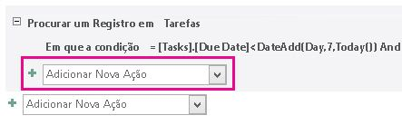
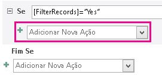

# <a name="filter-a-view-by-using-a-macro-in-an-access-app"></a>Filtrar um modo de exibição usando uma macro em um aplicativo do Access

Saiba como filtrar um modo de exibição em um aplicativo do Access usando a ação de macro RequeryRecords e uma macro de dados.
  
> [!IMPORTANT]
> A Microsoft não recomenda mais criar e usar aplicativos Web do Access no SharePoint. Como alternativa, use o [Microsoft PowerApps](https://powerapps.microsoft.com/en-us/) para criar soluções de negócios sem código para a Web e dispositivos móveis. 

O modo de exibição de lista padrão em um aplicativo de acesso permite filtrar os problemas nos valores que estão contidos nos campos. Pode haver instâncias onde você deseja filtrar um modo de exibição com base em um conjunto de condições, em vez de por um valor de correspondência. Para fazer isso, você deve criar uma macro. Este artigo mostra como criar uma macro que filtrar um modo de exibição para exibir tarefas que passaram vencidas ou de vencimento nos próximos sete dias.
  
## <a name="prerequisites-for-building-an-app-with-access"></a>Pré-requisitos para a criação de um aplicativo com o Access
<a name="Access2013FilterViewByUsingMacro_Prerequisites"> </a>

Para executar as etapas neste exemplo, você precisa:
  
- Access 2013
- Um ambiente de desenvolvimento do SharePoint 2013
    
> [!NOTE]
> Para obter mais informações sobre como configurar o ambiente de desenvolvimento do SharePoint, consulte [Configurar um ambiente de desenvolvimento geral para o SharePoint 2013](http://msdn.microsoft.com/library/08e4e4e1-d960-43fa-85df-f3c279ed6927%28Office.15%29.aspx). > Para obter mais informações sobre como adquirir o Access 2013 e SharePoint 2013, consulte os [Downloads](http://msdn.microsoft.com/en-US/office/apps/fp123627). 
  
## <a name="create-the-app"></a>Criar o aplicativo
<a name="Access2013FilterViewByUsingMacro_CreateApp"> </a>

Suponha que você deseja criar um aplicativo de acesso que rastreia as tarefas para a sua empresa. Antes de começar a criar as tabelas e modo de exibição, você deve procurar um modelo de esquema.
  
### <a name="to-create-the-task-tracking-app"></a>Para criar a aplicativo de controle de tarefa

1. Abra o Access e escolha a opção **Aplicativo da Web personalizado**.
    
2. Digite um nome e um local da Web para o aplicativo. É possível também escolher um local na lista **Locais** e escolher **Criar**.
    
3. Digite **tarefas** na caixa **Pesquisar** e pressione ENTER. 
    
    Uma lista de modelos que podem ser úteis para controle de tarefas é exibida na Figura 1.
    
   **Figura 1. Modelos que correspondem a pesquisa para tarefas**

   
  
4. Escolha **tarefas**.
    
O Access cria um conjunto de tabelas e de modos de exibição.
  
Insira várias tarefas de amostra e os funcionários em seu aplicativo. Para fazer isso, escolha **O aplicativo de início** para abrir o aplicativo no seu navegador da web. Insira um valor no campo de **Data de conclusão** de cada tarefa. Volte para o Access quando terminar. 
  
## <a name="plan-the-customizations"></a>Planejar as personalizações
<a name="Access2013FilterViewByUsingMacro_PlanCustomizations"> </a>

Agora você tem um aplicativo que contém várias tarefas. O modo de exibição padrão habilita a procura por quaisquer tarefas que usam os itens que são armazenados nos campos exibidos no modo de exibição. Por exemplo, você pode pesquisar para problemas de alta prioridade ou em andamento. Suponha que você deseja priorizar o seu trabalho exibindo questões ativas devem ser concluídas na semana seguinte. Para fazer isso, você deve criar uma macro (UI) da interface de usuário.
  
O comando de macro da interface do usuário que você pode usar para filtrar a exibição é a [Ação de Macro RequeryRecords (aplicativo da web personalizado do Access)](requeryrecords-macro-action-access-custom-web-app.md). A ação de macro **RequeryRecords** filtra o modo de exibição com base no argumento *onde* , que é fornecido na forma de uma cláusula SQL WHERE. Para filtrar o modo de exibição, você deve fornecer vários fatos em um formato específico para filtrar a exibição. 
  
Fatos relevantes são:
  
- O campo ou campos para comparar
    
- Como se referir a data de hoje
    
- Como se referir a um determinado dia em relação à data de hoje
    
- Como determinar qual nas tarefas estejam em andamento
    
O campo **Data de vencimento** fornece informações sobre quando é devida uma tarefa. O campo **Status** fornece informações de status sobre cada tarefa. Para se referir a um campo em uma macro, use o formato **[*TableName*]. [ *FieldName*]**. Uso **[tarefas]. [ Data de conclusão]** para referir-se o campo de **Data de conclusão** e **[tarefas]. [ Status]** para referir-se o campo **Status** . 
  
A função de [Função hoje (aplicativo da web personalizado do Access)](today-function-access-custom-web-app.md) retorna a data de hoje. A função de [Função DateAdd (aplicativo da web personalizado do Access)](dateadd-function-access-custom-web-app.md) pode ser usada para calcular uma data que seja um determinado número de dias após uma data especificada. 
  
O campo **Status** contém vários valores possíveis. Um valor **concluído** indica que a tarefa não está mais ativa. 
  
Esses fatos podem ser combinados na seguinte cláusula SQL WHERE.
  
```sql
[Tasks].[Due Date]<DateAdd(Day,7,Today()) AND [Tasks].[Status]<>"Completed"
```

Essa cláusula SQL WHERE é usada na macro para filtrar a exibição para exibir as questões ativas que devem ser concluídas nos próximos sete dias ou vencidas.
  
Para executar a macro da interface do usuário, ele precisa ser conectado a um item ou um evento que ocorre no modo de exibição. A **Barra de ação** é um local conveniente para adicionar um comando personalizado ao modo de exibição. A **Barra de ação** é uma barra de ferramentas personalizável que aparece na parte superior de cada modo de exibição. Por padrão, a **Barra de ação** contém botões para adicionar, editar, salvar, excluir e Cancelar edições. Você pode adicionar botões que executam ações personalizadas, como o modo de exibição de filtragem. 
  
Se o modo de exibição contém registros que atendam aos critérios especificados, **RequeryRecords** filtra o modo de exibição. No entanto, se o modo de exibição não contiver registros que atendam aos critérios, que um novo registro em branco será exibido. Se você não desejar que um registro em branco a ser exibido se não há tarefas devem ser concluídas na próxima semana, você deve encontrar um método para verificar as tarefas antes de chamar a ação de macro **RequeryRecords** . Para fazer isso, crie uma macro de dados para verificar se há registros que atendam aos critérios. 
  
A macro UI chamará a macro de dados, que tenta localizar uma tarefa vencer na próxima semana. Se a macro de dados localiza a tarefa e personalizar o aplicativo.
  
## <a name="customize-the-app"></a>Personalizar o aplicativo
<a name="Access2013FilterViewByUsingMacro_CustomizeApp"> </a>

Agora que você determinou as personalizações, implementá-las. A macro de dados deve ser criada pela primeira vez. Algumas macros de dados são conectadas diretamente a tabelas. No entanto, essa macro de dados é uma macro de dados autônoma.
  
### <a name="to-create-the-data-macro"></a>Para criar a macro de dados

1. Abra o aplicativo no Access.
    
2. No grupo **Criar**, selecione **Avançado** e escolha **Macro de Dados**.
    
    Uma macro de dados em branco é aberta no modo de Design da macro.
    
3. Na caixa de listagem **Adicionar nova ação** , selecione **Pesquisarregistro**.
    
4. Na caixa de listagem **Procurar backup de um registro em** , escolha **tarefas**.
    
5. Na caixa **Condição Where** , insira **[tarefas]. [ Data de conclusão]\<DateAdd(Day,7,Today()) e [tarefas]. [Status] \< \>"Concluída"**. 
    
6. Escolha **SetReturnVar** na caixa de listagem **Adicionar nova ação** . 
    
    > [!NOTE]
    > Você verá duas caixas de listagem **Adicionar nova ação** , um dentro do bloco de **Pesquisarregistro** e outro fora do bloco de **Pesquisarregistro** . Você deve escolher a caixa de listagem **Adicionar nova ação** dentro do bloco **Pesquisarregistro** , conforme mostrado na Figura 1. 
  
   **Figura 1. Adicionar caixa de listagem nova ação**

   
  
7. Na caixa **nome** , digite **TaskFound**. 
    
8. Na caixa **expressão** , insira **"Sim"**. 
    
9. Escolha **Salvar**. Digite **TasksDueSoon** na caixa **Nome da Macro** e escolha **Okey**.
    
    A macro deve se parecer com a macro mostrada na Figura 2.
    
   **Figura 2. Macro de dados TasksDueSoon**

   ![Macro de dados TasksDueSoon] (media/odc_Access2013_FilterFormByUsingMacro_Figure02.jpg "Macro de dados TasksDueSoon")
  
10. Feche o Modo Design da macro.
    
Agora, estamos prontos para adicionar um botão personalizado à barra de ação.
  
### <a name="to-add-a-custom-button-to-the-action-bar"></a>Para adicionar um botão personalizado à barra de ação

1. Escolha a tabela de **tarefas** . Isso escolherá o formulário de lista de tarefas. 
    
2. No Seletor de Modo de Exibição, selecione **Lista**, clique no ícone **Configurações/Ações** e escolha **Editar**.
    
    O modo de exibição é aberto no modo de Design.
    
3. Agora, estamos prontos para adicionar um botão personalizado à barra de ação. Para fazer isso, escolha **Adicionar de ação personalizada** , conforme mostrado na Figura 3. 
    
   **Figura 3. Adicionar botão de ação personalizada**

   ![Botão Adicionar ação personalizada] (media/odc_Access2013_FilterFormByUsingMacro_Figure03.jpg "Botão Adicionar ação personalizada")
  
    A nova ação é exibida como um botão com um ícone de estrela, conforme mostrado na Figura 4.
    
   **Figura 4. Novo botão de barra de ação**

   ![Botão da barra de ação New] (media/odc_Access2013_FilterFormByUsingMacro_Figure04.jpg "Botão da barra de ação New")
  
4. Escolha o botão da barra de ação personalizada e, em seguida, escolha o ícone de **dados** . 
    
    A caixa de diálogo de **dados** é exibida. 
    
5. Na caixa **Nome do controle** , digite **FilterTasks**. 
    
6. Na caixa **Dica de ferramenta** , insira a **exibição das tarefas antigas de vencimento ou de vencimento na próxima semana**. 
    
Agora, estamos prontos para criar a macro de interface do usuário que filtrará o modo de exibição.
  
### <a name="to-create-the-ui-macro-to-filter-the-view"></a>Para criar a macro UI para filtrar a exibição

1. Na caixa de diálogo **dados** , escolha **Na clique** conforme mostrado na Figura 5. 
    
   **Figura 5. Caixa de diálogo de dados**

   ![Caixa de diálogo de dados] (media/odc_Access2013_FilterFormByUsingMacro_Figure05.jpg "Caixa de diálogo de dados")
  
    Uma macro UI em branco é aberta no modo de Design da macro.
    
2. Na caixa de listagem **Adicionar nova ação** , selecione **ExecutarMacrodeDados**. 
    
3. Na caixa Nome da Macro, digite **TasksDueSoon**. 
    
    Na caixa **DefinirVarLocal** , insira **FilterRecords**. 
    
    A ação **ExecutarMacrodeDados** chama a macro de dados **TasksDueSoon** criados anteriormente e armazena seu resultado em uma variável denominada **FilterRecords**. 
    
4. Na caixa da lista **Adicionar nova ação** , selecione **Se**. 
    
5. Na caixa de ferramentas **se** , insira **[FilterRecords] = "Yes"**. 
    
6. Na caixa de listagem **Adicionar nova ação** , selecione **RequeryRecords**. 
    
    > [!NOTE]
    > Você verá duas caixas de listagem **Adicionar nova ação** , um dentro do bloco **Se** e outro fora do bloco **se** . Você deve escolher a caixa de listagem **Adicionar nova ação** dentro do bloco **Se** , conforme mostrado na Figura 6. 
  
   **Figura 6. Adicionar caixa de listagem nova ação**

   
  
7. Na caixa **onde** , insira **[tarefas]. [ Data de conclusão]\<DateAdd(Day,7,Today()) e [tarefas]. [Status] \< \>"Concluída"**. 
    
8. Na caixa **Order By** , insira **[Data de conclusão]**. 
    
9. Escolha o link **Adicionar Else** que aparece à direita da caixa **Adicionar nova ação** , conforme mostrado na Figura 7. 
    
   **Figura 7. Adicionar link Else**

   ![Adicione outro link] (media/odc_Access2013_FilterFormByUsingMacro_Figure07.jpg "Adicione outro link")
  
    Uma cláusula Else é adicionada à se bloco.
    
10. Na caixa de listagem **Adicionar nova ação** , selecione **MessageBox**. 
    
11. Na caixa de **mensagem** , digite **sem tarefas estão atrasadas ou vencimento em próximos sete dias!**. 
    
12. Escolha **Salvar**.
    
    A macro deverá ser semelhante à macro exibida na Figura 8.
    
    **Figura 8. Macro UI para filtrar a exibição**

    ![Macro UI para filtrar a exibição] (media/odc_Access2013_FilterFormByUsingMacro_Figure08.jpg "Macro UI para filtrar a exibição")
  
13. Feche o Modo Design da macro.
    
Neste ponto, criamos a macro da interface do usuário que filtra o modo de exibição de lista de tarefas para exibir as tarefas urgentes. Ele não seria recomendável deixar o modo de exibição em um estado filtrado sem fornecer um método para remover o filtro. Para fazer isso, adicione outro botão da barra de ação e Macro da interface do usuário.
  
### <a name="to-add-an-action-bar-button-to-remove-the-filter"></a>Para adicionar um botão da barra de ação para remover o filtro

1. Escolha **Adicionar de ação personalizada**.
    
    A nova ação é exibida como um botão com um ícone de estrela
    
2. Escolha o botão da barra de ação personalizado e, em seguida, escolha o ícone de **dados** . 
    
    A caixa de diálogo de **dados** é exibida. 
    
3. Na caixa **Nome do controle** , digite **RemoveFilter**. 
    
4. Na caixa **Dica de ferramenta** , digite **Remover todos os filtros aplicados ao modo de exibição**. 
    
Agora, estamos prontos para criar a macro de interface do usuário que removerá o modo de exibição do formulário de filtro.
  
### <a name="to-create-the-ui-macro-to-remove-the-filter-from-the-view"></a>Para criar a macro de interface do usuário para remover o filtro da exibição

1. Na caixa de diálogo **dados** , escolha **Na clique**.
    
    Uma macro UI em branco é aberta no modo de Design da macro.
    
2. Na caixa de listagem **Adicionar nova ação** , selecione **RequeryRecords**. 
    
    Neste momento, podemos vai deixe as caixas **Where** e **Order By** vazio. Em seguida, a ação **RequeryRecords** é chamada sem nenhum parâmetro, todos os filtros são removidos da exibição. 
    
3. Escolha **Salvar**.
    
4. Feche o Modo Design da macro.
    
5. Feche o modo de exibição de lista de tarefas. Escolha **Sim**, quando for solicitado a salvar as alterações. 
    
Agora, estamos prontos para a personalização de texto. Escolha **O aplicativo de início** para abrir o aplicativo no seu navegador da web e escolha o botão da barra de ação FilterTasks personalizado. Quaisquer tarefas antigas vencimento ou vencimento em próximos sete dias são exibidas. Uma mensagem é exibida se o aplicativo não contém urgentes tarefas. 
  
## <a name="conclusion"></a>Conclusão

Você pode usar a ação de macro **RequeryRecords** em uma macro UI para filtrar a exibição com base nos critérios que você escolher. Dependendo de comportamento que você deseja, convém criar uma macro de dados para verificar se um registro atende aos critérios antes de usar a ação de macro **RequeryRecords** . 
  
## <a name="see-also"></a>Confira também

- [Novidades para os desenvolvedores do Access 2013](http://msdn.microsoft.com/library/df778f51-d65e-4c30-b618-65003ceb39b3%28Office.15%29.aspx)
    

