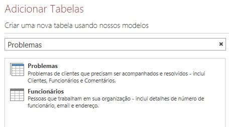
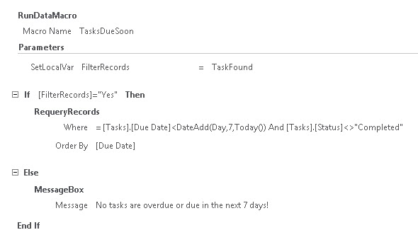

# <a name="filter-a-view-by-using-a-macro-in-an-access-app"></a><span data-ttu-id="a907e-103">Filtrar um modo de exibição usando uma macro em um aplicativo do Access</span><span class="sxs-lookup"><span data-stu-id="a907e-103">Filter a view by using a macro in an Access app</span></span>

<span data-ttu-id="a907e-104">Saiba como filtrar um modo de exibição em um aplicativo do Access usando a ação de macro RepetirConsultaDeRegistros e uma macro de dados.</span><span class="sxs-lookup"><span data-stu-id="a907e-104">Learn how to filter a view in an Access app by using the RequeryRecords macro action and a data macro.</span></span>
  
> [!IMPORTANT]
> <span data-ttu-id="a907e-p101">A Microsoft não recomenda mais criar e usar aplicativos Web do Access no SharePoint. Como alternativa, use o [Microsoft PowerApps](https://powerapps.microsoft.com/pt-BR/) para criar soluções de negócios sem código para a Web e dispositivos móveis.</span><span class="sxs-lookup"><span data-stu-id="a907e-p101">Microsoft no longer recommends creating and using Access web apps in SharePoint. As an alternative, consider using [Microsoft PowerApps](https://powerapps.microsoft.com/pt-BR/) to build no-code business solutions for the web and mobile devices.</span></span> 

<span data-ttu-id="a907e-107">O modo de exibição padrão de listas em um aplicativo do Access permite filtrar os problemas dos valores contidos nos campos.</span><span class="sxs-lookup"><span data-stu-id="a907e-107">The default list view in an Access app enables you to filter the issues on values that are contained in the fields.</span></span> <span data-ttu-id="a907e-108">Pode haver casos em que você queira filtrar um modo de exibição com base em um conjunto de condições ao invés de corresponder com um valor.</span><span class="sxs-lookup"><span data-stu-id="a907e-108">There may be instances where you'd like to filter a view based on a set of conditions instead of by matching a value.</span></span> <span data-ttu-id="a907e-109">Para isso é necessário criar uma macro.</span><span class="sxs-lookup"><span data-stu-id="a907e-109">To do that you must create a macro.</span></span> <span data-ttu-id="a907e-110">Este artigo mostra como criar uma macro que filtra o modo de exibição para exibir as tarefas em atraso ou que devem ser finalizadas nos próximos 7 dias.</span><span class="sxs-lookup"><span data-stu-id="a907e-110">This article shows you how to create a macro that filter a view to display tasks that are past due or due in the next 7 days.</span></span>
  
## <a name="prerequisites-for-building-an-app-with-access"></a><span data-ttu-id="a907e-111">Pré-requisitos para a criação de um aplicativo no Access</span><span class="sxs-lookup"><span data-stu-id="a907e-111">Prerequisites for building an app with Access 2013</span></span>
<span data-ttu-id="a907e-112"><a name="Access2013FilterViewByUsingMacro_Prerequisites"> </a></span><span class="sxs-lookup"><span data-stu-id="a907e-112"></span></span>

<span data-ttu-id="a907e-113">Para acompanhar as etapas deste exemplo, é necessário:</span><span class="sxs-lookup"><span data-stu-id="a907e-113">To follow the steps in this example, you need the following:</span></span>
  
- <span data-ttu-id="a907e-114">Access 2013</span><span class="sxs-lookup"><span data-stu-id="a907e-114">Access 2013</span></span>
- <span data-ttu-id="a907e-115">Um ambiente de desenvolvimento do SharePoint 2013</span><span class="sxs-lookup"><span data-stu-id="a907e-115">A SharePoint 2013 development environment</span></span>
    
> [!NOTE]
> <span data-ttu-id="a907e-116">Para obter mais informações sobre como configurar o ambiente de desenvolvimento do SharePoint, consulte [Configurar um ambiente de desenvolvimento geral para o SharePoint 2013](https://msdn.microsoft.com/library/08e4e4e1-d960-43fa-85df-f3c279ed6927%28Office.15%29.aspx).</span><span class="sxs-lookup"><span data-stu-id="a907e-116">For more information about setting up your SharePoint development environment, see [Set up a general development environment for SharePoint 2013](https://msdn.microsoft.com/library/08e4e4e1-d960-43fa-85df-f3c279ed6927%28Office.15%29.aspx).</span></span> <span data-ttu-id="a907e-117">Para obter mais informações sobre como obter Access 2013 e SharePoint 2013, consulte [Downloads](https://msdn.microsoft.com/office/apps/fp123627).</span><span class="sxs-lookup"><span data-stu-id="a907e-117">For more information about obtaining Access 2013 and SharePoint 2013, see [Downloads](https://msdn.microsoft.com/office/apps/fp123627).</span></span> 
  
## <a name="create-the-app"></a><span data-ttu-id="a907e-118">Criar o aplicativo</span><span class="sxs-lookup"><span data-stu-id="a907e-118">Create the app</span></span>
<span data-ttu-id="a907e-119"><a name="Access2013FilterViewByUsingMacro_CreateApp"> </a></span><span class="sxs-lookup"><span data-stu-id="a907e-119"></span></span>

<span data-ttu-id="a907e-120">Imagine que você deseja criar um aplicativo do Access que acompanha as tarefas em sua empresa.</span><span class="sxs-lookup"><span data-stu-id="a907e-120">Suppose you want to create an Access app that tracks issues for your business.</span></span> <span data-ttu-id="a907e-121">Antes de começar a criar as tabelas e visualizações, você deve procurar um modelo de esquema.</span><span class="sxs-lookup"><span data-stu-id="a907e-121">Before you start creating the tables and view from scratch, you should search for a schema template that meets your needs.</span></span>
  
### <a name="to-create-the-task-tracking-app"></a><span data-ttu-id="a907e-122">Para criar o aplicativo de acompanhamento de tarefas</span><span class="sxs-lookup"><span data-stu-id="a907e-122">To create the issue tracking app</span></span>

1. <span data-ttu-id="a907e-123">Abra o Access e escolha a opção **Aplicativo Web personalizado**.</span><span class="sxs-lookup"><span data-stu-id="a907e-123">Open Access and choose **Custom web app**.</span></span>
    
2. <span data-ttu-id="a907e-p105">Digite um nome e um local da Web para o aplicativo. É possível também escolher um local na lista **Locais** e escolher **Criar**.</span><span class="sxs-lookup"><span data-stu-id="a907e-p105">Enter a name and the web location for your app. You can also choose a location from the **Locations** list and choose **Create**.</span></span>
    
3. <span data-ttu-id="a907e-126">Digite **tarefas** na caixa **Pesquisar** e pressione ENTER.</span><span class="sxs-lookup"><span data-stu-id="a907e-126">Type **tasks** into the **Search** box and then press ENTER.</span></span> 
    
    <span data-ttu-id="a907e-127">Uma lista de modelos que podem ser úteis para o acompanhamento de tarefas é exibida na Figura 1.</span><span class="sxs-lookup"><span data-stu-id="a907e-127">A list of templates that might be useful for tracking issues is displayed in Figure 1.</span></span>
    
   <span data-ttu-id="a907e-128">**Figura 1. Modelos que correspondem à pesquisa por “tarefas”**</span><span class="sxs-lookup"><span data-stu-id="a907e-128">**Figure 1. Templates that match the search for issues**</span></span>

   <span data-ttu-id="a907e-129"></span><span class="sxs-lookup"><span data-stu-id="a907e-129"></span></span>
  
4. <span data-ttu-id="a907e-130">Escolha **Tarefas**.</span><span class="sxs-lookup"><span data-stu-id="a907e-130">Choose **Tasks**.</span></span>
    
<span data-ttu-id="a907e-131">O Access cria um conjunto de tabelas e visualizações.</span><span class="sxs-lookup"><span data-stu-id="a907e-131">Access creates a set of tables and views.</span></span>
  
<span data-ttu-id="a907e-132">Insira vários exemplos de tarefas e de funcionários em seu aplicativo.</span><span class="sxs-lookup"><span data-stu-id="a907e-132">Enter several sample tasks and employees in your app.</span></span> <span data-ttu-id="a907e-133">Para isso, escolha **Iniciar Aplicativo** para abri-lo no navegador da Web.</span><span class="sxs-lookup"><span data-stu-id="a907e-133">To do this, click **Launch App** to open the app in your web browser.</span></span> <span data-ttu-id="a907e-134">Insira um valor no campo **Data de Conclusão** para cada tarefa.</span><span class="sxs-lookup"><span data-stu-id="a907e-134">Enter a value in the **Due Date** field for each task.</span></span> <span data-ttu-id="a907e-135">Retorne ao Access quando terminar.</span><span class="sxs-lookup"><span data-stu-id="a907e-135">Return to Access when you're done.</span></span> 
  
## <a name="plan-the-customizations"></a><span data-ttu-id="a907e-136">Planejar as personalizações</span><span class="sxs-lookup"><span data-stu-id="a907e-136">Plan the customizations</span></span>
<span data-ttu-id="a907e-137"><a name="Access2013FilterViewByUsingMacro_PlanCustomizations"> </a></span><span class="sxs-lookup"><span data-stu-id="a907e-137"></span></span>

<span data-ttu-id="a907e-138">Agora você tem um aplicativo com várias tarefas.</span><span class="sxs-lookup"><span data-stu-id="a907e-138">You now have an app that contains several tasks.</span></span> <span data-ttu-id="a907e-139">O modo de exibição padrão permite pesquisar as tarefas usando itens armazenados nos campos exibidos no modo de exibição.</span><span class="sxs-lookup"><span data-stu-id="a907e-139">The default view enables you to search for any tasks using items that are stored in the fields displayed in the view.</span></span> <span data-ttu-id="a907e-140">Por exemplo, você pode pesquisar por problemas de alta prioridade ou em andamento.</span><span class="sxs-lookup"><span data-stu-id="a907e-140">For example, you can search for high-priority issues or issues in progress.</span></span> <span data-ttu-id="a907e-141">Vamos supor que você queira priorizar seu trabalho exibindo as questões ativas que têm conclusão na próxima semana.</span><span class="sxs-lookup"><span data-stu-id="a907e-141">Suppose you want to prioritize your work by displaying active issues that are due in the coming week.</span></span> <span data-ttu-id="a907e-142">Para isso, você deve criar uma macro de interface do usuário.</span><span class="sxs-lookup"><span data-stu-id="a907e-142">To do this, you should create a user interface (UI) macro.</span></span>
  
<span data-ttu-id="a907e-143">O comando de macro de interface do usuário que você pode usar para filtrar o modo de exibição é [Ação de Macro RepetirConsultaDeRegistros (aplicativo Web personalizado do Access)](requeryrecords-macro-action-access-custom-web-app.md).</span><span class="sxs-lookup"><span data-stu-id="a907e-143">The UI macro command that you can use to filter the view is the [RequeryRecords Macro Action (Access custom web app)](requeryrecords-macro-action-access-custom-web-app.md).</span></span> <span data-ttu-id="a907e-144">A ação de macro **RepetirConsultaDeRegistros** filtra o modo de exibição com base no argumento *Where*, que é fornecido em forma de uma cláusula WHERE do SQL.</span><span class="sxs-lookup"><span data-stu-id="a907e-144">The **RequeryRecords** macro action filters the view based on the  *Where*  argument, which is provided in the form of a SQL WHERE clause.</span></span> <span data-ttu-id="a907e-145">Para filtrar o modo de exibição, você deve fornecer vários fatos em um formato específico para filtrar o modo de exibição.</span><span class="sxs-lookup"><span data-stu-id="a907e-145">To filter the view, you must supply several facts in a specific format to filter the view.</span></span> 
  
<span data-ttu-id="a907e-146">Os fatos relevantes são:</span><span class="sxs-lookup"><span data-stu-id="a907e-146">The relevant facts are:</span></span>
  
- <span data-ttu-id="a907e-147">Um ou mais campos a comparar</span><span class="sxs-lookup"><span data-stu-id="a907e-147">The field or fields to compare</span></span>
    
- <span data-ttu-id="a907e-148">Como se referir à data de hoje</span><span class="sxs-lookup"><span data-stu-id="a907e-148">How to refer to today's date</span></span>
    
- <span data-ttu-id="a907e-149">Como se referir a um determinado dia em relação à data de hoje</span><span class="sxs-lookup"><span data-stu-id="a907e-149">How to refer to a particular day relative to today's date</span></span>
    
- <span data-ttu-id="a907e-150">Como determinar quais tarefas estão em andamento</span><span class="sxs-lookup"><span data-stu-id="a907e-150">How to determine which on tasks are in progress</span></span>
    
<span data-ttu-id="a907e-151">O campo **Data de Conclusão** fornece informações sobre quando uma tarefa deve ser concluída.</span><span class="sxs-lookup"><span data-stu-id="a907e-151">The **Due Date** field provides information about when a task is due.</span></span> <span data-ttu-id="a907e-152">O campo **Status** fornece informações sobre o estado de cada tarefa.</span><span class="sxs-lookup"><span data-stu-id="a907e-152">The **Status** field provides status information about each task.</span></span> <span data-ttu-id="a907e-153">Para fazer referência a um campo em uma macro, use o formato **[*NomeTabela*].[*NomeCampo*]**.</span><span class="sxs-lookup"><span data-stu-id="a907e-153">To refer to a field in a macro, use the format **[*TableName*].[*FieldName*]**.</span></span> <span data-ttu-id="a907e-154">Use **[Tarefas].[Data de Conclusão]** para se referir ao campo **Data de Conclusão** e **[Tarefas].[Status]** para se referir ao campo **Status**.</span><span class="sxs-lookup"><span data-stu-id="a907e-154">Use **[Tasks].[Due Date]** to refer to the **Due Date** field and **[Tasks].[Status]** to refer to the **Status** field.</span></span> 
  
<span data-ttu-id="a907e-155">A [Função Hoje (aplicativo Web personalizado do Access)](today-function-access-custom-web-app.md) retorna a data de hoje.</span><span class="sxs-lookup"><span data-stu-id="a907e-155">The [Today Function (Access custom web app)](today-function-access-custom-web-app.md) function returns today's date.</span></span> <span data-ttu-id="a907e-156">A [Função SomData (aplicativo Web personalizado do Access)](dateadd-function-access-custom-web-app.md) pode ser usada para calcular uma data que está um determinado número de dias após a data especificada.</span><span class="sxs-lookup"><span data-stu-id="a907e-156">The [DateAdd Function (Access custom web app)](dateadd-function-access-custom-web-app.md) function can be used to calculate a date that's a certain number of days after a specified date.</span></span> 
  
<span data-ttu-id="a907e-157">O campo **Status** contém vários valores possíveis.</span><span class="sxs-lookup"><span data-stu-id="a907e-157">The **Status** field contains several possible values.</span></span> <span data-ttu-id="a907e-158">O valor **Concluído** indica que a tarefa não está mais ativa.</span><span class="sxs-lookup"><span data-stu-id="a907e-158">A value of **Completed** indicates that the task is no longer active.</span></span> 
  
<span data-ttu-id="a907e-159">Essas informações podem ser combinadas na seguinte cláusula WHERE do SQL.</span><span class="sxs-lookup"><span data-stu-id="a907e-159">These facts can be combined into the following SQL WHERE clause.</span></span>
  
```sql
[Tasks].[Due Date]<DateAdd(Day,7,Today()) AND [Tasks].[Status]<>"Completed"
```

<span data-ttu-id="a907e-160">A cláusula WHERE do SQL é usada na macro para filtrar o modo de exibição, a fim de mostrar os problemas ativos que vencem nos próximos 7 dias ou que estejam atrasados.</span><span class="sxs-lookup"><span data-stu-id="a907e-160">This SQL WHERE clause is used in the macro to filter the view to display active issues that are due in the next 7 days or are past due.</span></span>
  
<span data-ttu-id="a907e-161">Para executar a macro de interface do usuário, ela deve estar conectada a um item ou um evento que ocorra no modo de exibição.</span><span class="sxs-lookup"><span data-stu-id="a907e-161">To run the UI macro, it must be attached to an item or an event that occurs in the view.</span></span> <span data-ttu-id="a907e-162">A **Barra de Ações** é um lugar conveniente para adicionar um comando personalizado ao modo de exibição.</span><span class="sxs-lookup"><span data-stu-id="a907e-162">The **Action Bar** is a convenient place to add a custom command to the view.</span></span> <span data-ttu-id="a907e-163">A **Barra de Ações** é uma barra de ferramentas personalizável, exibida na parte superior dos modos de exibição.</span><span class="sxs-lookup"><span data-stu-id="a907e-163">The Action Bar is a customizable toolbar that appears at the top of each view, as shown in Figure 5.</span></span> <span data-ttu-id="a907e-164">Por padrão, a **Barra de Ações** contém botões para adicionar, editar, salvar, excluir e cancelar edições.</span><span class="sxs-lookup"><span data-stu-id="a907e-164">By default, the **Action Bar** contains buttons to add, edit, save, delete, and cancel edits.</span></span> <span data-ttu-id="a907e-165">Você pode adicionar botões que realizam ações personalizadas, como a filtragem do modo de exibição.</span><span class="sxs-lookup"><span data-stu-id="a907e-165">You can add buttons that perform custom actions, such as filtering the view.</span></span> 
  
<span data-ttu-id="a907e-166">Se o modo de exibição contiver registros que atendam aos critérios especificados, então **RepetirConsultaDeRegistros** filtra o modo de exibição.</span><span class="sxs-lookup"><span data-stu-id="a907e-166">If the view contains records that meet the specified criteria, then **RequeryRecords** filters the view.</span></span> <span data-ttu-id="a907e-167">No entanto, se o modo de exibição não contiver registros que atendam aos critérios, então, um novo registro em branco será exibido.</span><span class="sxs-lookup"><span data-stu-id="a907e-167">However, if the view doesn't contain any records that meet the criteria, than a new, blank record is displayed.</span></span> <span data-ttu-id="a907e-168">Se você não quiser que um registro em branco seja exibido caso não haja tarefas atrasadas para a próxima semana, então é necessário encontrar um método para verificar as tarefas antes de chamar a ação de macro **RepetirConsultaDeRegistros**.</span><span class="sxs-lookup"><span data-stu-id="a907e-168">If you don't want a blank record to be displayed if no tasks are due in the next week, then you must find a method to check the tasks before you call the **RequeryRecords** macro action.</span></span> <span data-ttu-id="a907e-169">Para isso, crie uma macro de dados para verificar se há registros que atendem aos critérios.</span><span class="sxs-lookup"><span data-stu-id="a907e-169">To do this, create a data macro to check for records that meet the criteria.</span></span> 
  
<span data-ttu-id="a907e-170">A macro da interface do usuário chamará uma macro de dados, que tentará encontrar uma tarefa a vencer na próxima semana.</span><span class="sxs-lookup"><span data-stu-id="a907e-170">The UI macro will call the data macro, which will try to find a task that's due in the next week.</span></span> <span data-ttu-id="a907e-171">Se a macro de dados localizar a tarefa, então personalize o aplicativo.</span><span class="sxs-lookup"><span data-stu-id="a907e-171">If the data macro finds the task then customize the app.</span></span>
  
## <a name="customize-the-app"></a><span data-ttu-id="a907e-172">Personalizar o aplicativo</span><span class="sxs-lookup"><span data-stu-id="a907e-172">Customize the app</span></span>
<span data-ttu-id="a907e-173"><a name="Access2013FilterViewByUsingMacro_CustomizeApp"> </a></span><span class="sxs-lookup"><span data-stu-id="a907e-173"></span></span>

<span data-ttu-id="a907e-174">Agora que você determinou as personalizações, é hora de implementá-las.</span><span class="sxs-lookup"><span data-stu-id="a907e-174">Now that you've determined the customizations, implement them.</span></span> <span data-ttu-id="a907e-175">Primeiro é necessário criar as macros de dados.</span><span class="sxs-lookup"><span data-stu-id="a907e-175">The data macro should be created first.</span></span> <span data-ttu-id="a907e-176">Algumas macros de dados são anexadas diretamente a tabelas.</span><span class="sxs-lookup"><span data-stu-id="a907e-176">Some data macros are attached directly to tables.</span></span> <span data-ttu-id="a907e-177">No entanto, esta macro de dados é autônoma.</span><span class="sxs-lookup"><span data-stu-id="a907e-177">However, this data macro is a stand-alone data macro.</span></span>
  
### <a name="to-create-the-data-macro"></a><span data-ttu-id="a907e-178">Para criar macros de dados</span><span class="sxs-lookup"><span data-stu-id="a907e-178">To create the AfterUpdate macro</span></span>

1. <span data-ttu-id="a907e-179">Abra o aplicativo no Access.</span><span class="sxs-lookup"><span data-stu-id="a907e-179">Open the app in Access.</span></span>
    
2. <span data-ttu-id="a907e-180">No grupo **Criar**, selecione **Avançado** e depois **Macro de Dados**.</span><span class="sxs-lookup"><span data-stu-id="a907e-180">In the **Create** group, choose **Advanced**, and then choose **Data Macro**.</span></span>
    
    <span data-ttu-id="a907e-181">Uma macro de dados em branco será aberta no Modo Design de macro.</span><span class="sxs-lookup"><span data-stu-id="a907e-181">A blank macro is opened in macro Design View.</span></span>
    
3. <span data-ttu-id="a907e-182">Na caixa de listagem **Adicionar Nova Ação**, escolha **PesquisarRegistro**.</span><span class="sxs-lookup"><span data-stu-id="a907e-182">From the **Add New Action** dropdown, choose **LookupRecord**.</span></span>
    
4. <span data-ttu-id="a907e-183">Na caixa de listagem **Procurar Registro Em**, escolha **Tarefas**.</span><span class="sxs-lookup"><span data-stu-id="a907e-183">In the **Look Up A Record In** dropdown, choose **Customers**.</span></span>
    
5. <span data-ttu-id="a907e-184">Na caixa **Condição Where**, digite **[Tarefas].[Data de Conclusão]\<SomData(Dia,7,Hoje()) E [Tarefas].[Status]\<\>"Concluído"**.</span><span class="sxs-lookup"><span data-stu-id="a907e-184">In the **Where Condition** box, enter **[Tasks].[Due Date]\<DateAdd(Day,7,Today()) AND [Tasks].[Status]\<\>"Completed"**.</span></span> 
    
6. <span data-ttu-id="a907e-185">Escolha **DefinirVardeRetorno** na caixa de listagem **Adicionar Nova Ação**.</span><span class="sxs-lookup"><span data-stu-id="a907e-185">Choose **SetReturnVar** from the **Add New Action** dropdown.</span></span> 
    
    > [!NOTE]
    > <span data-ttu-id="a907e-186">Serão exibidas duas caixas de listagem **Adicionar Nova Ação**, uma dentro do bloco **PesquisarRegistro** e outra fora **dele**.</span><span class="sxs-lookup"><span data-stu-id="a907e-186">You'll see two **Add New Action** dropdowns, one within the **LookupRecord** block, and another outside the **LookupRecord** block.</span></span> <span data-ttu-id="a907e-187">É necessário escolher a caixa de listagem **Adicionar Nova Ação** dentro do bloco **PesquisarRegistro**, como mostrado na Figura 1.</span><span class="sxs-lookup"><span data-stu-id="a907e-187">You should choose the **Add New Action** dropdown within the **LookupRecord** block, as shown in Figure 7.</span></span> 
  
   <span data-ttu-id="a907e-188">**Figura 1. Caixa de listagem Adicionar Nova Ação**</span><span class="sxs-lookup"><span data-stu-id="a907e-188">**Figure 1. Add New Action list box**</span></span>

   <span data-ttu-id="a907e-189"></span><span class="sxs-lookup"><span data-stu-id="a907e-189"></span></span>
  
7. <span data-ttu-id="a907e-190">Na caixa **Nome**, digite **TarefaEncontrada**.</span><span class="sxs-lookup"><span data-stu-id="a907e-190">In the **Name** box, enter **ContactPhone**.</span></span> 
    
8. <span data-ttu-id="a907e-191">Na caixa **Expressão**, digite **"Sim"**.</span><span class="sxs-lookup"><span data-stu-id="a907e-191">In the **Expression** box, enter **[Customers].[Work Phone]**.</span></span> 
    
9. <span data-ttu-id="a907e-192">Escolha **Salvar**.</span><span class="sxs-lookup"><span data-stu-id="a907e-192">Choose **Save**.</span></span> <span data-ttu-id="a907e-193">Digite **TarefaConclusãoPróxima** na caixa **Nome da Macro** e clique em **OK**.</span><span class="sxs-lookup"><span data-stu-id="a907e-193">Enter **GetContactPhone** in the **Macro Name** box and then choose **OK**.</span></span>
    
    <span data-ttu-id="a907e-194">A macro deve ser semelhante à macro exibida na Figura 2.</span><span class="sxs-lookup"><span data-stu-id="a907e-194">The macro should resemble the macro shown in Figure 9.</span></span>
    
   <span data-ttu-id="a907e-195">**Figura 2. Macro de dados TarefaConclusãoPróxima**</span><span class="sxs-lookup"><span data-stu-id="a907e-195">**Figure 2. TasksDueSoon data macro**</span></span>

   <span data-ttu-id="a907e-196"></span><span class="sxs-lookup"><span data-stu-id="a907e-196"></span></span>
  
10. <span data-ttu-id="a907e-197">Feche o Modo Design da macro.</span><span class="sxs-lookup"><span data-stu-id="a907e-197">Close macro Design View.</span></span>
    
<span data-ttu-id="a907e-198">Agora estamos prontos para adicionar um botão personalizado à Barra de Ações.</span><span class="sxs-lookup"><span data-stu-id="a907e-198">Now, we're ready to add a custom button to the Action Bar.</span></span>
  
### <a name="to-add-a-custom-button-to-the-action-bar"></a><span data-ttu-id="a907e-199">Adicionar um botão personalizado à barra de ações</span><span class="sxs-lookup"><span data-stu-id="a907e-199">To add a custom button to the Action Bar</span></span>

1. <span data-ttu-id="a907e-200">Escolha a tabela **Tarefas**.</span><span class="sxs-lookup"><span data-stu-id="a907e-200">Choose the **Issues** table.</span></span> <span data-ttu-id="a907e-201">Isso escolhe o formulário Lista de Tarefas.</span><span class="sxs-lookup"><span data-stu-id="a907e-201">This chooses the Tasks List form.</span></span> 
    
2. <span data-ttu-id="a907e-202">No Seletor de Modo de Exibição, selecione **Lista**, clique no ícone **Configurações/Ações** e escolha **Editar**.</span><span class="sxs-lookup"><span data-stu-id="a907e-202">In the View selector, choose **List**, choose the **Settings/Action** icon, and then choose **Edit**.</span></span>
    
    <span data-ttu-id="a907e-203">O modo de exibição abre no modo Design.</span><span class="sxs-lookup"><span data-stu-id="a907e-203">The view is opened in Design View.</span></span>
    
3. <span data-ttu-id="a907e-204">Agora estamos prontos para adicionar um botão personalizado à Barra de Ações.</span><span class="sxs-lookup"><span data-stu-id="a907e-204">Now, we're ready to add a custom button to the Action Bar.</span></span> <span data-ttu-id="a907e-205">Para isso, escolha **Adicionar ação personalizada** como mostrado na Figura 3.</span><span class="sxs-lookup"><span data-stu-id="a907e-205">To do this, choose **Add custom action** as shown in Figure 3.</span></span> 
    
   <span data-ttu-id="a907e-206">**Figura 3. Botão Adicionar ação personalizada**</span><span class="sxs-lookup"><span data-stu-id="a907e-206">**Figure 3. Add custom action button**</span></span>

   <span data-ttu-id="a907e-207"></span><span class="sxs-lookup"><span data-stu-id="a907e-207"></span></span>
  
    <span data-ttu-id="a907e-208">A nova ação é exibida como um botão com um ícone de estrela, como mostrado na Figura 4.</span><span class="sxs-lookup"><span data-stu-id="a907e-208">The new action is displayed as a button with a star icon as shown in Figure 4.</span></span>
    
   <span data-ttu-id="a907e-209">**Figure 4. Novo botão da Barra de Ações**</span><span class="sxs-lookup"><span data-stu-id="a907e-209">**Figure 4. New Action Bar button**</span></span>

   <span data-ttu-id="a907e-210"></span><span class="sxs-lookup"><span data-stu-id="a907e-210"></span></span>
  
4. <span data-ttu-id="a907e-211">Escolha o botão personalizado da Barra de Ações e, em seguida, selecione o ícone **Dados**.</span><span class="sxs-lookup"><span data-stu-id="a907e-211">Choose the custom Action Bar Button, and then choose the **Data** icon.</span></span> 
    
    <span data-ttu-id="a907e-212">A caixa de diálogo **Dados** é exibida.</span><span class="sxs-lookup"><span data-stu-id="a907e-212">The **Export** dialog box appears.</span></span> 
    
5. <span data-ttu-id="a907e-213">Na caixa **Nome do Controle**, digite **FiltrarTarefas**.</span><span class="sxs-lookup"><span data-stu-id="a907e-213">In the **Control Name** box, enter **CustomerContact**.</span></span> 
    
6. <span data-ttu-id="a907e-214">Na caixa **Dica de ferramenta**, digite **Exibir tarefas vencidas ou a vencer na próxima semana**.</span><span class="sxs-lookup"><span data-stu-id="a907e-214">In the **Tooltip** box, enter **Display tasks past due or due in the next week**.</span></span> 
    
<span data-ttu-id="a907e-215">Agora estamos prontos para criar a macro de interface do usuário que filtrará o modo de exibição.</span><span class="sxs-lookup"><span data-stu-id="a907e-215">Now, we're ready to create the UI macro that will filter the view.</span></span>
  
### <a name="to-create-the-ui-macro-to-filter-the-view"></a><span data-ttu-id="a907e-216">Para criar a macro de interface do usuário para filtrar o modo de exibição</span><span class="sxs-lookup"><span data-stu-id="a907e-216">To create the UI macro to filter the view</span></span>

1. <span data-ttu-id="a907e-217">Na caixa de diálogo **Dados**, escolha **Ao Clicar** como mostrado na Figura 5.</span><span class="sxs-lookup"><span data-stu-id="a907e-217">In the **Data** dialog box, choose **On Click** as shown in Figure 5.</span></span> 
    
   <span data-ttu-id="a907e-218">**Figura 5. Caixa de diálogo Dados**</span><span class="sxs-lookup"><span data-stu-id="a907e-218">**Figure 5. Data dialog box**</span></span>

   <span data-ttu-id="a907e-219"></span><span class="sxs-lookup"><span data-stu-id="a907e-219"></span></span>
  
    <span data-ttu-id="a907e-220">Uma macro de interface do usuário em branco será exibida no Modo Design de macro.</span><span class="sxs-lookup"><span data-stu-id="a907e-220">A blank macro is opened in macro Design View.</span></span>
    
2. <span data-ttu-id="a907e-221">Na caixa de listagem **Adicionar Nova Ação**, escolha **ExecutarMacrodeDados**.</span><span class="sxs-lookup"><span data-stu-id="a907e-221">From the **Add New Action** dropdown, choose **RunDataMacro**.</span></span> 
    
3. <span data-ttu-id="a907e-222">Na caixa Nome da Macro, digite **TarefaConclusãoPróxima**.</span><span class="sxs-lookup"><span data-stu-id="a907e-222">In the Name box, enter ContactPhone.</span></span> 
    
    <span data-ttu-id="a907e-223">Na caixa **DefinirVarLocal**, digite **FiltrarRegistros**.</span><span class="sxs-lookup"><span data-stu-id="a907e-223">In the **SetLocalVar** box, enter **Phone**.</span></span> 
    
    <span data-ttu-id="a907e-224">A ação **ExecutarMacrodeDados** chama a macro de dados **TarefaConclusãoPróxima** criada anteriormente e armazena o resultado em uma variável chamada **FiltrarRegistros**.</span><span class="sxs-lookup"><span data-stu-id="a907e-224">The **RunDataMacro** action calls the **TasksDueSoon** data macro we created earlier and stores its result in a variable named **FilterRecords**.</span></span> 
    
4. <span data-ttu-id="a907e-225">Na caixa de listagem **Adicionar Nova Ação**, escolha **Se**.</span><span class="sxs-lookup"><span data-stu-id="a907e-225">From the **Add New Action** list box, choose **If**.</span></span> 
    
5. <span data-ttu-id="a907e-226">Na caixa **Se**, digite **[FiltrarRegistros]="Sim"**.</span><span class="sxs-lookup"><span data-stu-id="a907e-226">In the **If** box, enter **[FilterRecords]="Yes"**.</span></span> 
    
6. <span data-ttu-id="a907e-227">Na caixa de listagem **Adicionar Nova Ação**, escolha **RepetirConsultaDeRegistros**.</span><span class="sxs-lookup"><span data-stu-id="a907e-227">From the **Add New Action** list box, choose **RequeryRecords**.</span></span> 
    
    > [!NOTE]
    > <span data-ttu-id="a907e-228">Serão exibidas duas caixas de listagem **Adicionar Nova Ação**, uma dentro do bloco **Se** e outra fora **dele**.</span><span class="sxs-lookup"><span data-stu-id="a907e-228">You'll see two **Add New Action** dropdowns, one within the **LookupRecord** block, and another outside the **LookupRecord** block.</span></span> <span data-ttu-id="a907e-229">É necessário escolher a caixa de listagem **Adicionar Nova Ação** dentro do bloco **Se**, como mostrado na Figura 6.</span><span class="sxs-lookup"><span data-stu-id="a907e-229">You should choose the **Add New Action** dropdown within the **LookupRecord** block, as shown in Figure 7.</span></span> 
  
   <span data-ttu-id="a907e-230">**Figura 6. Caixa de listagem Adicionar Nova Ação**</span><span class="sxs-lookup"><span data-stu-id="a907e-230">**Figure 6. Add New Action list box**</span></span>

   <span data-ttu-id="a907e-231"></span><span class="sxs-lookup"><span data-stu-id="a907e-231"></span></span>
  
7. <span data-ttu-id="a907e-232">Na caixa **Where**, digite **[Tarefas].[Data de Conclusão]\<SomData(Dia,7,Hoje()) E [Tarefas].[Status]\<\>"Concluído"**.</span><span class="sxs-lookup"><span data-stu-id="a907e-232">In the **Where** box, enter **[Tasks].[Due Date]\<DateAdd(Day,7,Today()) AND [Tasks].[Status]\<\>"Completed"**.</span></span> 
    
8. <span data-ttu-id="a907e-233">Na caixa **Classificar por**, digite **[Data de Conclusão]**.</span><span class="sxs-lookup"><span data-stu-id="a907e-233">In the **Order By** box, enter **[Due Date]**.</span></span> 
    
9. <span data-ttu-id="a907e-234">Escolha o link **Adicionar Senão** exibido no lado direito da caixa **Adicionar Nova Ação**, como mostrado na Figura 7.</span><span class="sxs-lookup"><span data-stu-id="a907e-234">Choose the **Add Else** link that appears to the right side of the **Add New Action** box as shown in Figure 7.</span></span> 
    
   <span data-ttu-id="a907e-235">**Figura 7. Link Adicionar Senão**</span><span class="sxs-lookup"><span data-stu-id="a907e-235">**Figure 7. Add Patients link**</span></span>

   <span data-ttu-id="a907e-236"></span><span class="sxs-lookup"><span data-stu-id="a907e-236"></span></span>
  
    <span data-ttu-id="a907e-237">A cláusula Senão é adicionada ao bloco Se.</span><span class="sxs-lookup"><span data-stu-id="a907e-237">An Else clause is added to the If block.</span></span>
    
10. <span data-ttu-id="a907e-238">Na caixa de listagem **Adicionar Nova Ação**, escolha **CaixadeMensagem**.</span><span class="sxs-lookup"><span data-stu-id="a907e-238">From the **Add New Action** list box, choose **MessageBox**.</span></span> 
    
11. <span data-ttu-id="a907e-239">Na caixa **Mensagem**, digite **Não há tarefas vencidas ou a vencer nos próximos sete dias!**.</span><span class="sxs-lookup"><span data-stu-id="a907e-239">In the **Message** box, enter **No tasks are overdue or due in the next 7 days!**.</span></span> 
    
12. <span data-ttu-id="a907e-240">Escolha **Salvar**.</span><span class="sxs-lookup"><span data-stu-id="a907e-240">Choose **Save**.</span></span>
    
    <span data-ttu-id="a907e-241">A macro deve ser semelhante à macro exibida na Figura 8.</span><span class="sxs-lookup"><span data-stu-id="a907e-241">The macro should resemble the macro shown in Figure 8.</span></span>
    
    <span data-ttu-id="a907e-242">**Figura 8. Macro de interface do usuário para filtrar o modo de exibição**</span><span class="sxs-lookup"><span data-stu-id="a907e-242">**UI macro to filter the view**</span></span>

    <span data-ttu-id="a907e-243"></span><span class="sxs-lookup"><span data-stu-id="a907e-243"></span></span>
  
13. <span data-ttu-id="a907e-244">Feche o Modo Design da macro.</span><span class="sxs-lookup"><span data-stu-id="a907e-244">Close macro Design View.</span></span>
    
<span data-ttu-id="a907e-245">Neste ponto, já criamos a macro de interface do usuário que filtra o modo de exibição de Lista de Tarefas para exibir as tarefas urgentes.</span><span class="sxs-lookup"><span data-stu-id="a907e-245">At this point, we've created the UI macro that filters the Tasks List view to display the urgent tasks.</span></span> <span data-ttu-id="a907e-246">Não seria educado sair do modo de exibição em um estado filtrado sem fornecer um método para remover o filtro.</span><span class="sxs-lookup"><span data-stu-id="a907e-246">It wouldn't be polite to leave the view in a filtered state without providing a method to remove the filter.</span></span> <span data-ttu-id="a907e-247">Para fazer isso, adicione outro botão da Barra de Ações e Macro de interface do usuário.</span><span class="sxs-lookup"><span data-stu-id="a907e-247">To do this, add another Action Bar button and UI Macro.</span></span>
  
### <a name="to-add-an-action-bar-button-to-remove-the-filter"></a><span data-ttu-id="a907e-248">Para adicionar um botão da Barra de Ações para remover o filtro</span><span class="sxs-lookup"><span data-stu-id="a907e-248">To add an Action Bar Button to remove the filter</span></span>

1. <span data-ttu-id="a907e-249">Escolha **Adicionar ação personalizada**.</span><span class="sxs-lookup"><span data-stu-id="a907e-249">Choose **Add custom action**.</span></span>
    
    <span data-ttu-id="a907e-250">A nova ação é exibida como um botão com um ícone de estrela</span><span class="sxs-lookup"><span data-stu-id="a907e-250">The new action is displayed as a button with a star icon</span></span>
    
2. <span data-ttu-id="a907e-251">Escolha o botão personalizado da Barra de Ações e, em seguida, selecione o ícone **Dados**.</span><span class="sxs-lookup"><span data-stu-id="a907e-251">Choose the custom Action Bar button, and then choose the **Data** icon.</span></span> 
    
    <span data-ttu-id="a907e-252">A caixa de diálogo **Dados** é exibida.</span><span class="sxs-lookup"><span data-stu-id="a907e-252">The **Export** dialog box appears.</span></span> 
    
3. <span data-ttu-id="a907e-253">Na caixa **Nome do Controle**, digite **RemoverFiltro**.</span><span class="sxs-lookup"><span data-stu-id="a907e-253">In the **Control Name** box, enter **CustomerContact**.</span></span> 
    
4. <span data-ttu-id="a907e-254">Na caixa **Dica de ferramenta**, digite **Remover todos os filtros aplicados ao modo de exibição**.</span><span class="sxs-lookup"><span data-stu-id="a907e-254">In the **Tooltip** box, enter **Remove all filter applied to the view**.</span></span> 
    
<span data-ttu-id="a907e-255">Agora estamos prontos para criar a macro de interface do usuário que removerá o formulário de filtro do modo de exibição.</span><span class="sxs-lookup"><span data-stu-id="a907e-255">Now, we're ready to create the UI macro that will remove the filter form the view.</span></span>
  
### <a name="to-create-the-ui-macro-to-remove-the-filter-from-the-view"></a><span data-ttu-id="a907e-256">Para criar a macro de interface do usuário para remover o filtro do modo de exibição</span><span class="sxs-lookup"><span data-stu-id="a907e-256">To create the UI macro to remove the filter from the view</span></span>

1. <span data-ttu-id="a907e-257">Na caixa de diálogo **Dados**, escolha **Ao clicar**.</span><span class="sxs-lookup"><span data-stu-id="a907e-257">In the **Data** dialog box, choose **On Click**.</span></span>
    
    <span data-ttu-id="a907e-258">Uma macro de interface do usuário em branco será exibida no Modo Design de macro.</span><span class="sxs-lookup"><span data-stu-id="a907e-258">A blank macro is opened in macro Design View.</span></span>
    
2. <span data-ttu-id="a907e-259">Na caixa de listagem **Adicionar Nova Ação**, escolha **RepetirConsultaDeRegistros**.</span><span class="sxs-lookup"><span data-stu-id="a907e-259">From the **Add New Action** list box, choose **RequeryRecords**.</span></span> 
    
    <span data-ttu-id="a907e-260">Neste momento, deixaremos as caixas **Onde** e **Classificar por** em branco.</span><span class="sxs-lookup"><span data-stu-id="a907e-260">This time, we'll leave the **Where** and **Order By** boxes empty.</span></span> <span data-ttu-id="a907e-261">Em seguida, a ação **RepetirConsultaDeRegistros** é chamada sem nenhum parâmetro, todos os filtros são removidos do modo de exibição.</span><span class="sxs-lookup"><span data-stu-id="a907e-261">Then the **RequeryRecords** action is called without any parameters, all filters are removed from the view.</span></span> 
    
3. <span data-ttu-id="a907e-262">Escolha **Salvar**.</span><span class="sxs-lookup"><span data-stu-id="a907e-262">Choose **Save**.</span></span>
    
4. <span data-ttu-id="a907e-263">Feche o Modo Design da macro.</span><span class="sxs-lookup"><span data-stu-id="a907e-263">Close macro Design View.</span></span>
    
5. <span data-ttu-id="a907e-264">Feche o modo de exibição de Lista de Tarefas.</span><span class="sxs-lookup"><span data-stu-id="a907e-264">Close the Issues List view.</span></span> <span data-ttu-id="a907e-265">Escolha **Sim** quando for solicitado a salvar suas alterações.</span><span class="sxs-lookup"><span data-stu-id="a907e-265">Choose **Yes** when you are prompted to save your changes.</span></span> 
    
<span data-ttu-id="a907e-266">Agora estamos prontos para testar a personalização.</span><span class="sxs-lookup"><span data-stu-id="a907e-266">Now we're ready to text the customization.</span></span> <span data-ttu-id="a907e-267">Escolha **Iniciar aplicativo** para abrir o aplicativo no seu navegador da Web e, em seguida, escolha o botão personalizado da Barra de Ações FiltrarTarefas.</span><span class="sxs-lookup"><span data-stu-id="a907e-267">Choose **Launch App** to open the app in your web browser and then choose the custom FilterTasks Action Bar button.</span></span> <span data-ttu-id="a907e-268">Qualquer tarefa vencida ou a vencer nos próximos 7 dias será exibida.</span><span class="sxs-lookup"><span data-stu-id="a907e-268">Any tasks past due or due in the next 7 days are displayed.</span></span> <span data-ttu-id="a907e-269">É exibida uma mensagem se o aplicativo não contiver tarefas urgentes.</span><span class="sxs-lookup"><span data-stu-id="a907e-269">A message is displayed if the app contains no urgent tasks.</span></span> 
  
## <a name="conclusion"></a><span data-ttu-id="a907e-270">Conclusão</span><span class="sxs-lookup"><span data-stu-id="a907e-270">Conclusion</span></span>

<span data-ttu-id="a907e-271">É possível usar a ação de macro **RepetirConsultaDeRegistros** em uma macro de interface do usuário para filtrar o modo de exibição com base nos critérios que você escolher.</span><span class="sxs-lookup"><span data-stu-id="a907e-271">You can use the **RequeryRecords** macro action in a UI macro to filter the view based on the criteria that you choose.</span></span> <span data-ttu-id="a907e-272">Dependendo do comportamento desejado, talvez você queira criar uma macro de dados para verificar se um registro atende aos critérios antes de usar a ação de macro **RepetirConsultaDeRegistros**.</span><span class="sxs-lookup"><span data-stu-id="a907e-272">Depending on the behavior that you want, you may want to create a data macro to verify that a record meets the criteria before you use the **RequeryRecords** macro action.</span></span> 
  
## <a name="see-also"></a><span data-ttu-id="a907e-273">Confira também</span><span class="sxs-lookup"><span data-stu-id="a907e-273">See also</span></span>

- [<span data-ttu-id="a907e-274">Novidades para os desenvolvedores do Access 2013</span><span class="sxs-lookup"><span data-stu-id="a907e-274">What's new for Access 2013 developers</span></span>](https://msdn.microsoft.com/library/df778f51-d65e-4c30-b618-65003ceb39b3%28Office.15%29.aspx)
    

