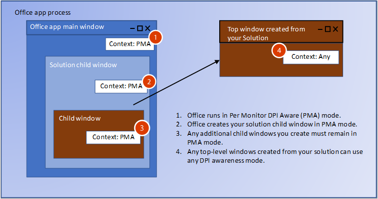

# <a name="handle-high-dpi-and-dpi-scaling-in-your-office-solution"></a>Lidar com a sua solução do Office de alta escala DPI e DPI

Várias configurações e exibição agora suportam altas resoluções DPI (pontos por polegada) e pode conectar a vários monitores com tamanhos diferentes e densidades pixel. Isso exige aplicativos para ajustar quando o usuário move o aplicativo a um monitor com um DPI diferente ou altera o nível de zoom. Aplicativos que não dão suporte para conjunto de escala DPI podem funcionar em monitores com baixo DPI, mas ficarão ampliadas e desfocadas quando exibida em um monitor com alto DPI. 

Aplicativos do Office 2016, como o Word e Excel foram atualizados para responder às alterações em fator de escala. No entanto, sua solução do Office também deve responder às alterações para mostrar corretamente quando o DPI é alterado. Este artigo descreve como o Office tem suporte para DPI dinâmico e as medidas que você pode tomar para garantir a melhor experiência de sua solução de extensibilidade do identificador Office DPI de dimensionamento de visualização. 

## <a name="dpi-scaling-symptoms-in-your-solution"></a>Sintomas de dimensionamento DPI em sua solução

Windows aplica DPI para dimensionar quando um aplicativo é movido de uma exibição para outra exibição com um DPI diferente. Isso ocorre em cenários como arrastar um aplicativo para outro monitor diferente ou encaixar seu laptop. Se a sua solução do Office é afetada negativamente por escala DPI, você verá uma ou mais dos seguintes sintomas:

- As janelas mostram no local errado ou tiver dimensionamento incorreto.
- Elementos como rótulos e botões são exibidos no lugar errado na janela da solução.
- Fontes e imagens aparecem muito pequenos, muito grandes ou no local errado.

Os seguintes tipos de soluções do Office podem ser afetados por conjunto de escala DPI:

- Suplementos VSTO
- Painéis de Tarefas Personalizados
- Suplementos COM
- Controles ActiveX
- Extensões de faixa de opções
- Servidores OLE
- Suplementos do Office web

## <a name="windows-dpi-awareness-modes"></a>Modos de percepção DPI do Windows

Neste artigo vamos nos referir aos modos de percepção DPI é compatível com Windows. Cada modo de percepção DPI é compatível com diferentes recursos, conforme descrito na tabela a seguir. Esta é uma descrição simplificada de modos para explicar como soluções do Office compatíveis. Confira mais informações sobre os modos de percepção DPI [desenvolvimento de aplicativos de área de trabalho do alto DPI no Windows](https://docs.microsoft.com/windows/desktop/hidpi/high-dpi-desktop-application-development-on-windows).

|Modo  |Descrição  |Quando alterações DPI  |
|---------|---------|---------|
|DPI desconhecido |  Aplicativo sempre renderizado como se estivesse em uma exibição com valor de 96 DPI. |  Aplicativo é bitmap alongado para o tamanho esperado em exibir primário e secundário.    |
|DPI ciente do sistema |  Aplicativo detecta DPI do monitor principal conectado ao fazer logon do Windows, mas não pode responder as alterações DPI. Para obter mais informações, consulte a seção [Configurar o Windows para corrigir aplicativos borrados](#configure-windows-to-fix-blurry-apps) neste artigo.  | O Aplicativo é bitmap alongado quando movidas para uma nova exibição com um DPI diferente.    |
|Por Monitor DPI ciente |  O Aplicativo é capaz de redesenho próprio corretamente quando o DPI é alterado.  |   O Windows enviará notificações DPI para janelas de nível superior do aplicativo para que possa reemitir quando o DPI for alterado.     |
|Por Monitor v2 |  O Aplicativo é capaz de redesenho próprio corretamente quando o DPI é alterado.  |   O Windows enviará notificações DPI ao nível superior e janelas de criança para que o aplicativo possa reemitir quando o DPI for alterado. |

## <a name="how-office-supports-dpi-scaling"></a>Como o Office dá suporte de escala DPI

O fator mais importante em determinar como sua solução do Office pode lidar com conjunto de escala DPI é se a solução for uma janela de nível superior ou em uma janela de criança. A imagem seguinte mostra alguns exemplos de soluções do Office executando como nível superior ou janelas de criança, e o modo de percepção DPI, eles usarão no Windows (1803) de atualização de abril de 2018 e versões posteriores.


Nesta imagem:
- A janela de nível superior VSTO/COM está por Monitor DPI ciente.
- A janela de criança de controle ActiveX é DPI de sistema ciente.
- A janela de nível superior do Office está por Monitor DPI ciente.
- A janela de criança do painel de tarefas personalizado é DPI do sistema ciente.

## <a name="managing-thread-dpi-context"></a>Gerenciar o contexto DPI da conversa

Quando inicia o aplicativo do Office host, sua conversa principal é executada no contexto ciente Per DPI Monitor. Quando o código de solução cria conversas ou recebe chamadas do Office, você precisa gerenciar contexto DPI conversa.

### <a name="creating-new-threads-with-the-correct-dpi-context"></a>Criar novas conversas com o contexto DPI correto

Se a sua solução cria conversas adicionais, o Office forçará as conversas no contexto ciente Per DPI Monitor. Se o código espera um contexto diferente, você precisa usar a função [SetThreadDpiAwarenessContext](https://docs.microsoft.com/windows/desktop/api/winuser/nf-winuser-setthreaddpiawarenesscontext) para definir a percepção de conversa esperada DPI. 

### <a name="build-a-context-block-for-incoming-thread-calls"></a>Criar um bloco de contexto conversa para chamadas de entrada


Sua solução interagirá com seu aplicativo do Office host, assim você terá chamadas de entrada para sua solução do Office como retornos de evento. Quando o Office chamada sua solução, tem um bloco de contexto que força o contexto de conversa a ser sistema no contexto ciente DPI. Você deve alterar o contexto de conversa para corresponder a percepção DPI da janela. Você pode implementar um bloco de contexto semelhante para alternar o contexto de conversa para chamadas de entrada. Use a função [SetThreadDpiAwarenessContext](https://docs.microsoft.com/windows/desktop/api/winuser/nf-winuser-setthreaddpiawarenesscontext) para alterar o contexto de acordo com o contexto da janela. 

> [!NOTE]
> O bloco do contexto deverá restaurar o contexto de conversa DPI original antes de chamar outros componentes fora do seu código solução.

#### <a name="managed-code-context-block"></a>Gerenciamento de bloco de contexto de código

O código de exemplo a seguir mostra como criar seu próprio bloco de contexto.

```csharp
public struct DPI_AWARENESS_CONTEXT
        {
            private IntPtr value;

            private DPI_AWARENESS_CONTEXT(IntPtr value)
            {
                this.value = value;
            }

            public static implicit operator DPI_AWARENESS_CONTEXT(IntPtr value)
            {
                return new DPI_AWARENESS_CONTEXT(value);
            }

            public static implicit operator IntPtr(DPI_AWARENESS_CONTEXT context)
            {
                return context.value;
            }

            public static bool operator ==(IntPtr context1, DPI_AWARENESS_CONTEXT context2)
            {
                return AreDpiAwarenessContextsEqual(context1, context2);
            }

            public static bool operator !=(IntPtr context1, DPI_AWARENESS_CONTEXT context2)
            {
                return !AreDpiAwarenessContextsEqual(context1, context2);
            }

            public override bool Equals(object obj)
            {
                return base.Equals(obj);
            }

            public override int GetHashCode()
            {
                return base.GetHashCode();
            }
        }

        private static DPI_AWARENESS_CONTEXT DPI_AWARENESS_CONTEXT_HANDLE = IntPtr.Zero;

        public static readonly DPI_AWARENESS_CONTEXT DPI_AWARENESS_CONTEXT_INVALID = IntPtr.Zero;
        public static readonly DPI_AWARENESS_CONTEXT DPI_AWARENESS_CONTEXT_UNAWARE = new IntPtr(-1);
        public static readonly DPI_AWARENESS_CONTEXT DPI_AWARENESS_CONTEXT_SYSTEM_AWARE = new IntPtr(-2);
        public static readonly DPI_AWARENESS_CONTEXT DPI_AWARENESS_CONTEXT_PER_MONITOR_AWARE = new IntPtr(-3);
        public static readonly DPI_AWARENESS_CONTEXT DPI_AWARENESS_CONTEXT_PER_MONITOR_AWARE_V2 = new IntPtr(-4);

        public static DPI_AWARENESS_CONTEXT[] DpiAwarenessContexts =
        {
            DPI_AWARENESS_CONTEXT_UNAWARE,
            DPI_AWARENESS_CONTEXT_SYSTEM_AWARE,
            DPI_AWARENESS_CONTEXT_PER_MONITOR_AWARE,
            DPI_AWARENESS_CONTEXT_PER_MONITOR_AWARE_V2
        };

class DPIContextBlock : IDisposable
    {
        private DPI_AWARENESS_CONTEXT resetContext;
        private bool disposed = false;

        public DPIContextBlock(DPI_AWARENESS_CONTEXT contextSwitchTo)
        {
            resetContext = SetThreadDpiAwarenessContext(contextSwitchTo);
         }

        public void Dispose()
        {
            Dispose(true);
            GC.SuppressFinalize(this);
        }

        protected virtual void Dispose(bool disposing)
        {
            if (!disposed)
            {
                if (disposing)
                {
                    SetThreadDpiAwarenessContext(resetContext);
                }
            }
            disposed = true;
        }
    }
```

#### <a name="native-code-context-block"></a>Bloco do contexto de código nativo

```cpp
#include <winuser.h>
/* DpiAwarenessContextBlock can be used to simplify setting and resetting the DPI_AWARENESS_CONTEXT of
the current thread.  When the object is constructed, the DPI_AWARENESS_CONTEXT is set, and when the object is
destructed, the DPI awareness context is reverted to the previous awareness context at construct time.

This object allows us to write code such as:

// Thread state is currently DPI_AWARENESS_SYSTEM_AWARE
if (condition)
{
DpiAwarenessContextBlock perMonitorAware(DPI_AWARENESS_PER_MONITOR_AWARE);
... // Create a top-level hwnd with the current thread state, DPI_AWARENESS_PER_MONITOR_AWARE
}
// Thread state automatically returns to DPI_AWARENESS_SYSTEM_AWARE

*/
class DpiAwarenessContextBlock
{
public:
      DpiAwarenessContextBlock(DPI_AWARENESS_CONTEXT dpiContext) noexcept;
      ~DpiAwarenessContextBlock();

      // Copy and move are not to be used with these context objects
      DpiAwarenessContextBlock(const DpiAwarenessContextBlock&) = delete;
      DpiAwarenessContextBlock(DpiAwarenessContextBlock&&) = delete;

private:
      DPI_AWARENESS_CONTEXT m_contextReversalType;
      bool m_doContextSwitch;
};

inline DpiAwarenessContextBlock::DpiAwarenessContextBlock(DPI_AWARENESS_CONTEXT dpiContext) noexcept
{
      m_contextReversalType = SetThreadDpiAwarenessContext(dpiContext);
}

inline DpiAwarenessContextBlock::~DpiAwarenessContextBlock()
{
      SetThreadDpiAwarenessContext(m_contextReversalType);
}
```

<h2 id="top-level-window-management">Gerenciamento de nível superior de janelas</h2>

Ao iniciarem aplicativos do Office, uma chamada é feita para [SetThreadDpiAwarenessContext](https://docs.microsoft.com/windows/desktop/api/winuser/nf-winuser-setthreaddpiawarenesscontext) como DPI_AWARENESS_CONTEXT_PER_MONITOR_AWARE. Nesse contexto as alterações DPI serão enviadas ao HWND todas as janelas de nível superior no processo que estejam em execução de acordo com o Monitor DPI ciente. Janelas de nível superior são janelas do aplicativo do Office e as janelas de nível superior adicionais criadas pela sua solução. Quando um aplicativo do Office é movido para uma nova exibição, será notificado para que ele dinamicamente dimensione e desenhe corretamente o DPI da tela de nova. Sua solução do Office pode criar janelas de nível superior que estão em qualquer modo de reconhecimento de DPI. As janelas de nível superior podem também responder às alterações DPI ouvir a mensagem do Windows para as alterações.

Se você criar janelas de criança que são como pais para a janela de nível superior, você pode configurá-los de qualquer modo de reconhecimento de DPI. No entanto, se você usar o modo ciente por DPI Monitor, as janelas de criança não receberão notificações de alteração DPI.  Confira mais informações sobre modos de percepção Windows DPI [desenvolvimento de aplicativos de área de trabalho DPI alto no Windows](https://docs.microsoft.com/windows/desktop/hidpi/high-dpi-desktop-application-development-on-windows).

## <a name="child-window-management"></a>Gerenciamento de janelas

Ao trabalhar com controles ActiveX e painéis de tarefas personalizados, o Office cria a solução janelas de criança. Criar janelas adicionais janelas de criança, mas você precisa considerar janela pais DPI ciente. Office será executado no modo de percepção Per DPI Monitor, que significa que qualquer janelas de criança em sua solução não receberá notificações de alteração DPI. Apenas per modo Monitor v2 oferece suporte ao envio DPI para altera para janelas de criança (o Office não tem suporte por Monitor v2). No entanto, para controles ActiveX, há uma solução alternativa. Para saber mais, confira a [controles ActiveX](#activex-controls) seção neste artigo.

> [!NOTE]
> Se sua janela de criança cria uma janela de nível superior, você pode usar qualquer modo de percepção DPI da nova janela de nível superior. Para saber mais sobre o gerenciamento de janelas de nível superior, confira a seção deste artigo [gerenciamento de janelas de nível superior](#top-level-window-management).

Você verá dois modos DPI diferentes aplicados a janela de criança, dependendo de qual versão do Windows 10 Office está em execução.

### <a name="office-dpi-behavior-on-windows-fall-creators-update-1709"></a>Comportamento DPI do Office no Windows Fall Creators Update (1709)

Como os aplicativos do Office usam o modo de percepção por Monitor, janelas filho da solução também serão criadas no modo de percepção Per DPI Monitor. Isso significa que o Windows espera que a sua solução de atualização quando um novo DPI de desenho.  Como a janela não é possível receber notificações de alteração DPI, interface do usuário da solução pode estar incorreto. 



### <a name="office-dpi-behavior-on-windows-april-2018-update-1803"></a>Comportamento DPI do Office no Windows (1803) de atualização de abril de 2018

Com o Windows atualização de abril de 2018 (1803) e versões posteriores, DPI Office o comportamento de hospedagem usa DPI mista escala para alguns cenários. Isso permite que o sistema as janelas DPI cientes para ser os pais de definir por Monitor DPI cientes nas janelas do Office. Isso ajuda a garantir a melhor compatibilidade quando o DPI é alterado quando os janelas estão bitmap alongada. As janelas ainda podem ficar desfocadas de bitmap alongas.


Quando você cria um novo janelas filho, certifique-se de que elas correspondam às reconhecimento DPI da janela de seus pais. Você pode usar a função [GetWindowDpiAwarenessContext](https://docs.microsoft.com/windows/desktop/api/winuser/nf-winuser-getwindowdpiawarenesscontext) para obter o reconhecimento de DPI da janela pai. Para saber mais sobre DPI consistência de percepção, confira a seção "Forçada redefinição de reconhecimento DPI todo o processo" [desenvolvimento de aplicativos de área de trabalho DPI alto no Windows](https://docs.microsoft.com/windows/desktop/hidpi/high-dpi-desktop-application-development-on-windows#related-topics).

> [!NOTE]
> Você não pode depender reconhecimento de DPI o processo de como ela pode retornar [PROCESS_SYSTEM_DPI_AWARE](https://docs.microsoft.com/windows/desktop/api/shellscalingapi/ne-shellscalingapi-process_dpi_awareness) mesmo quando estiver o contexto de reconhecimento de conversa principal DPI aplicativo [DPI_AWARENESS_CONTEXT_PER_MONITOR_AWARE](https://docs.microsoft.com/windows/desktop/hidpi/dpi-awareness-context). Use a função [GetThreadDpiAwarenessContext](https://docs.microsoft.com/windows/desktop/api/winuser/nf-winuser-getthreaddpiawarenesscontext) Obtenha o contexto de reconhecimento de conversa DPI.

## <a name="office-and-windows-dpi-compatibility-settings"></a>Configurações de compatibilidade do Office e Windows DPI

Quando os usuários encontrarem suplementos ou soluções que estão sendo processados corretamente, algumas configurações de compatibilidade podem ajuda a corrigir o problema.

<h3 id="office-compatibility">Configurar o Office para otimizar para fins de compatibilidade</h3>

O Office tem uma configuração para otimizar para fins de compatibilidade quando mover para diferentes DPI escala em diferentes telas. O modo de compatibilidade desabilita os recursos de escala DPI para que todo o conteúdo no Office bitmap alongada quando movidas para uma exibição de uso de escala DPI diferentes. 

O modo de compatibilidade força que o Office seja executado em modo Sistema DPI ciente. Isso faz com que janelas do aplicativo para esticar bitmap e pode ter um efeito de uma aparência desfocado. Sua solução do Office não pode controlar essa configuração, como o usuário escolhe-lo. Usar o modo de exibição de compatibilidade resolve a maioria dos problemas de desenho. Para saber mais, confira [suporte do Office para alta definição exibe](https://support.office.com/en-us/article/office-support-for-high-definition-displays-6720ca0e-be59-41f6-b629-1369f549279d). 

### <a name="configure-windows-to-fix-blurry-apps"></a>Configurar o Windows para corrigir imagens desfocados aplicativos

Windows 10 (versão 1803) e tem uma configuração para corrigir aplicativos para que não estejam desfocados mais tarde. Esta é outra configuração para fazer se a sua solução não processa corretamente. Sua solução do Office não pode controlar essa configuração, como o usuário escolhe-lo. Para saber mais, confira [corrigir aplicativos que aparecem desfocados no Windows 10](https://support.microsoft.com/en-us/help/4091364/windows-10-fix-blurry-apps).

## <a name="how-to-support-dpi-scaling-in-your-solution"></a>Como suporte a DPI sua solução de escala

Algumas soluções, podem receber e responder às alterações DPI. Alguns têm para solucionar esse problema se eles não podem receber notificações. A tabela a seguir lista os detalhes para cada tipo de solução.

<table>
    <thead>
        <tr>
            <th>Tipo de solução</th>
            <th>Tipo de janela</th>
            <th>Pode responder a escala DPI</th>
            <th>Mais detalhes</th>
        </tr>
    </thead>
<tbody>
    <tr>
        <td rowspan="2"><a href="#vsto-add-ins">Suplementos VSTO</a></td>
        <td>Superior e seus descendentes</td>
        <td>Sim</td>
        <td>Ver <a href="#vsto-add-ins">orientações suplemento VSTO</a>.</td>
    </tr>
<tr>
        <td>Pais de filho na janela do Office</td>
        <td>Não</td>
        <td>Ver <a href="#office-compatibility">configurar o Office para otimizar a compatibilidade</a>.</td>
</tr>
    <tr>
        <td rowspan="2"><a href="#custom-task-panes">painel de tarefas personalizado</a></td>
        <td>Superior e seus descendentes</td>
        <td>Sim</td>
        <td>Ver <a href="#top-level-window-management">orientações de nível superior janela</a>.</td>
    </tr>
<tr>
        <td>Pais de filho na janela do Office</td>
        <td>Não</td>
        <td>Ver <a href="#office-compatibility">configurar o Office para otimizar a compatibilidade</a>.</td>
</tr>
    <tr>
        <td rowspan="2"><a href="#com-add-ins">suplemento de COM</a></td>
        <td>Superior e seus descendentes</td>
        <td>Sim</td>
        <td>Ver <a href="#com-add-ins">Orientação de suplementos de COM</a>.</td>
    </tr>
<tr>
        <td>Pais de filho na janela do Office</td>
        <td>Não</td>
        <td>Ver <a href="#office-compatibility">configurar o Office para otimizar a compatibilidade</a>.</td>
</tr>
    <tr>
        <td rowspan="2"><a href="#activex-controls">Controle ActiveX</a></td>
        <td>Superior e seus descendentes</td>
        <td>Sim</td>
        <td>Ver <a href="#activex-controls">orientações de controle ActiveX</a>.</td>
    </tr>
    <tr>
        <td>Pais de filho na janela do Office</td>
        <td>Sim</td>
    </tr>
    <tr>
        <td><a href="#web-add-ins">Suplemento da Web</a></td>
        <td>N/D</td>
        <td>Sim</td>
        <td>Ver <a href="#web-add-ins">Orientações do suplemento Office</a>.</td>
    </tr>
    <tr>
        <td><a href="#ribbon-extensibility">Extensão da faixa de opções</a></td>
        <td>NA</td>
        <td>NA</td>
        <td>Ver <a href="#ribbon-extensibility">Orientações de extensão da faixa de opções</a>.</td>
    </tr>
    <tr>
        <td><a href="#ole">Cliente ou servidor OLE</a></td>
        <td>NA</td>
        <td>NA</td>
        <td>Ver <a href="#ole">diretrizes do cliente/servidor OLE</a>.</td>
    </tr>
</tbody>
</table>

<h3 id="vsto-add-ins">Suplemento VSTO</h3>

O suplemento VSTO cria janelas filho que são pais de todas as janelas Office, verifique se corresponderem reconhecimento DPI da janela de seus pais. Você pode usar a função [GetWindowdpiAwarenessContext](https://docs.microsoft.com/windows/desktop/api/winuser/nf-winuser-getwindowdpiawarenesscontext) para receber reconhecimento DPI da janela dos pais. Suas janelas filho não receberão notificações de alteração da DPI. Se a sua solução não processa corretamente, os usuários precisarão instalar o Office no modo de compatibilidade.

Para as janelas de nível superior que o suplemento VSTO cria, você pode configurá-los de qualquer modo de reconhecimento de DPI. O código de exemplo a seguir mostra como configurar o reconhecimento DPI desejado e como responder às alterações DPI. Você também precisará ajustar o app.config, conforme descrito no artigo [suporte a DPI alto nos formulários do Windows](https://docs.microsoft.com/dotnet/framework/winforms/high-dpi-support-in-windows-forms). 

```csharp
using System;
using System.Diagnostics;
using System.Drawing;
using System.Runtime.InteropServices;
using System.Windows.Forms;

namespace SharedModule
{
    // DpiAwareWindowsForm
    // For any top level winform you create, derive from the DpiWindowsForm class
    // if you are creating Windows Forms with the Dpi Awareness Context set to 
    // DPI_AWARENESS_CONTEXT_PER_MONITOR_AWARE or DPI_AWARENESS_CONTEXT_PER_MONITOR_AWARE_V2
    //
    // For example, if you Window form class is defined as:
    //    public partial class TopLevelWinForm : Form
    //
    // update to:
    //    public partial class TopLevelWinForm : DpiAwareWindowsForm
    //
    // When showing the form, call SetThreadDpiAwarenessContext() or use a context block to
    // to set the desired Dpi Awareness Context.
    //
    // For example, here is code to show a Windows Form using a context block as Per Monitor Aware v2.
    //
    //    DPIContextBlock context = new DPIContextBlock(DPI_AWARENESS_CONTEXT_PER_MONITOR_AWARE_V2);
    //    TopLevelWinForm frm = new TopLevelWinForm();
    //    frm.Show();
    //
    public partial class DpiAwareWindowsForm : Form
    {
        private SizeF m_newDpi = SizeF.Empty;
        private SizeF m_oldDpi = SizeF.Empty;

        public DpiAwareWindowsForm()
        {
            this.HandleCreated += new EventHandler((sender, args) =>
            {
                m_oldDpi = m_newDpi = DPIHelper.GetDpiForWindowSizeF(this.Handle);
            });
        }

        public void OnDpiChangedEvent(RECT newRect)
        {
            this.SuspendLayout();

            // Resize form
            this.Width = newRect.Width;
            this.Height = newRect.Height;

            // Resize controls and set font sizes
            ScaleAllChildControls(this.Controls, m_oldDpi.Width, m_newDpi.Width);
            this.ResumeLayout(true);
        }

        // Additional changes may be needed for controls that set Anchor or Dock properties 
        private void ScaleAllChildControls(Control.ControlCollection controls, float oldDpi, float newDpi)
        {
            float scaleFactorChange = newDpi / oldDpi;

            foreach (Control control in controls)
            {
                control.Top = (int)(control.Top * scaleFactorChange);
                control.Left = (int)(control.Left * scaleFactorChange);
                control.Width = (int)(control.Width * scaleFactorChange);
                control.Height = (int)(control.Height * scaleFactorChange);
                control.Font = ScaleFont(control.Font, oldDpi, newDpi);
            }
        }

        private Font ScaleFont(Font font, float oldDpi, float newDpi)
        {
            float fontSizePx = 0.0f;
            float fontSizePt = 0.0f;

            fontSizePx = font.SizeInPoints / 72 * oldDpi;
            fontSizePt = fontSizePx * (newDpi / oldDpi) * 72 / oldDpi;

            return new Font(font.Name, fontSizePt, font.Style, GraphicsUnit.Point);
        }

        protected override void WndProc(ref Message m)
        {
            switch ((DPIHelper.WinMessages)m.Msg)
            {
                case DPIHelper.WinMessages.WM_DPICHANGED:
                    // Marshal the value in the lParam into a Rect.
                    RECT newDisplayRect = (RECT)Marshal.PtrToStructure(m.LParam, typeof(RECT));

                    // Remember current DPI and calculate current from WParam.
                    // Both X and Y are the same on Windows for Dpi.
                    m_oldDpi = m_newDpi;

                    m_newDpi.Width = (float)(m.WParam.ToInt32() >> 16);
                    m_newDpi.Height = (float)(m.WParam.ToInt32() & 0x0000FFFF);

                    // DPI should be the same for both width and height on Windows devices.
                    Debug.Assert(m_newDpi.Height == m_newDpi.Width);

                    if (m_oldDpi.Width != m_newDpi.Width)
                    {
                        OnDpiChangedEvent(newDisplayRect);
                    }
                    base.DefWndProc(ref m);
                    break;
                default:
                    base.WndProc(ref m);
                    break;
            }
        }
    }
}
```

<h3 id="custom-task-panes">Painéis de Tarefas Personalizados</h3>

Um painel de tarefas personalizados é criado como uma janela de filho pelo Office. Ao executar a atualização do Windows Fall Creators (1709), seu painel de tarefas será executado usando o mesmo modo reconhecimento DPI como o Office. Ao executar o Windows (1803) de atualização de abril de 2018 e mais tarde, painel de tarefas será executada usando o modo de percepção DPI sistema. 

Como painéis de tarefas personalizados são janelas filhos, elas não podem receber notificações de DPI. Se ele estiver desenhando incorretamente, o usuário será preciso usar [modo de compatibilidade do Office DPI](https://support.office.com/en-us/article/office-support-for-high-definition-displays-6720ca0e-be59-41f6-b629-1369f549279d).
Se o painel de tarefas cria janelas de nível superior, essas janelas podem ser executadas em qualquer modo de percepção DPI e receber notificações de alteração DPI. Para saber mais, confira a seção deste artigo [gerenciamento de nível superior de janelas](#top-level-window-management).

<h3 id="com-add-ins">Suplemento COM</h3>

O suplemento que cria janelas de nível superior podem receber notificações de DPI. Você deverá criar um [bloquear contexto](#build-a-context-block-for-incoming-thread-calls) para definir o reconhecimento DPI desejado para a janela da conversa, em seguida, criar sua janela. Há muito a manipulação notificações DPI corretamente, portanto, não deixe de ler [desenvolvimento de aplicativos de área de trabalho DPI alto no Windows](https://docs.microsoft.com/windows/desktop/hidpi/high-dpi-desktop-application-development-on-windows#related-topics) para obter mais detalhes.

As [WM_DPICHANGED](https://docs.microsoft.com/windows/desktop/hidpi/wm-dpichanged) mensagem é enviada quando DPI uma janela foi alterado.  Código não gerenciado, esta mensagem é tratada o [procedimento janela](https://docs.microsoft.com/windows/desktop/winmsg/using-window-procedures) para o HWND.  Exemplo DPI alterar identificador código pode ser encontrado na WM_DPICHANGED artigo. 

O suplemento que mostra janela filho que são pais de uma janela do Office não podem receber notificações de DPI. Se ele estiver desenhando incorretamente, o usuário será preciso usar [modo de compatibilidade do Office DPI](https://support.office.com/article/office-support-for-high-definition-displays-6720ca0e-be59-41f6-b629-1369f549279d).

<h3 id="activex-controls">Controles ActiveX</h3>

Como suporte a controles ActiveX de escala DPI depende se o controle é com janela ou sem janelas.

#### <a name="windowed-activex-controls"></a>Controles ActiveX em janelas

Controles ActiveX em janelas recebem uma mensagem WM_SIZE sempre que no controle será redimensionado.  Quando este evento é disparado, o código de manipulador de eventos pode ligar para o [GetDpiForWindow](https://docs.microsoft.com/windows/desktop/api/winuser/nf-winuser-getdpiforwindow) função usar HWND do controle para obter a DPI calcular as diferenças de fator de escala e ajustar conforme necessário. 

O exemplo a seguir permite um controle ActiveX com base MFC para responder a **OnSize** evento. 

```cpp
void ChangeWindowFontDPI(HWND hWnd, UINT dpi) 
{ 
LOGFONT fontInfo1 = { 0 }; 
// Calculate the font height based on the DPI. 
fontInfo1.lfHeight = -MulDiv(DESIRED_HEIGHT, dpi, 72); 
fontInfo1.lfQuality = CLEARTYPE_QUALITY; 
wcscpy_s(fontInfo1.lfFaceName, DESIRED_FONT_NAME); 
 
::SendMessage(hWnd, WM_SETFONT, (WPARAM)::CreateFontIndirectW(&fontInfo1), TRUE); 
} 
 
BOOL CALLBACK CMainDialog::EnumChildProc(HWND hWnd, LPARAM lParam) 
{ 
CMainDialog* _this = (CMainDialog*) lParam; 
if (_this != nullptr) 
{ 
// Calculate the scale factor difference between the old and new DPI changes. 
double scale = (((double) _this->m_newDPI) /  
   (((double) _this->m_currentDPI) / 100.0)) / 100; 
 
RECT rect = {}; 
::GetWindowRect(hWnd, &rect); 
 
POINT pt = { rect.left, rect.top }; 
::ScreenToClient(::GetParent(hWnd), &pt); 
 
// Adjust the window based on the scale changes. 
::MoveWindow(hWnd, 
pt.x * scale, 
pt.y * scale, 
(rect.right - rect.left) * scale, 
(rect.bottom - rect.top) * scale, 
TRUE); 
 
ChangeWindowFontDPI(hWnd, _this->m_newDPI); 
return TRUE; 
} 
return FALSE; 
} 
 
void CMainDialog::OnSize(UINT nType, int cx, int cy) 
{ 
CDialog::OnSize(nType, cx, cy); 
 
// Get the new DPI and enumerate the child windows that will use that value. 
m_currentDPI = ::GetDpiForWindow(this->GetSafeHwnd()); 
::EnumChildWindows(this->GetSafeHwnd(), EnumChildProc, (LPARAM)this); 
} 
```

#### <a name="windowless-activex-controls"></a>Sem janela controles ActiveX

Sem janela de controles ActiveX, não há garantia tem um HWND.  Quando um controle ActiveX é inserido em uma tela de documento, ele é inserido no modo de design.  Em aplicativos do Office, hospedagem contêiner retornará 0 para ligar para hDC -> GetWindow() na: OnDraw evento quando o controle está no modo design.  Não é possível recuperar uma DPI confiável nesse caso. 

No entanto, quando o controle no modo de tempo de execução Office retornará HWND onde o controle é desenhar.  Nesse caso, o desenvolvedor de controle pode ligar [GetDpiForWindow](https://docs.microsoft.com/windows/desktop/api/winuser/nf-winuser-getdpiforwindow) e a atual fontes DPI e escala, controles e assim por diante. 

<h3 id="ribbon-extensibility">Extensibilidade da faixa de opções personalizada</h3>

Os retornos de chamadas do Office para controles de faixa de opções personalizada estará em um reconhecimento de conversa DPI do sistema ciente DPI.  Se a sua solução estiver esperando um reconhecimento de conversa DPI diferentes, você deve implementar um bloco de contexto para configurar o reconhecimento de conversa conforme o esperado. Para saber mais, confira [criar um bloco contexto](#build-a-context-block-for-incoming-thread-calls).

<h3 id="ole">Servidores e clientes OLE</h3>

Quando um servidor OLE estiver hospedado em um contêiner de cliente OLE, você no momento não poderá fornecer informações de DPI atuais, nem tem suportadas. Isso pode causar problemas como algumas combinações de pais para janela filho de modos misturado não têm suporte a arquitetura atual do Windows. Se o Word ou Excel detectar que há vários monitores com escalas de DPI diferentes, não serão compatíveis ativação in-loco. Seu servidor OLE será ativado fora do local. Se você estiver tendo problemas com as interações de servidor OLE, o usuário será preciso usar [modo de compatibilidade do Office DPI](https://support.office.com/article/office-support-for-high-definition-displays-6720ca0e-be59-41f6-b629-1369f549279d).

<h3 id="web-add-ins">Suplemento do Office Web</h3>

Suplementos do Office criados usando a API JavaScript do Office executam no controle do navegador. Você pode lidar com conjunto de escala DPI usando as mesmas técnicas usadas em qualquer design do aplicativo web. Muitos recursos online estão disponíveis para ajudar a criar uma página da web para telas de alta resolução.

## <a name="verify-that-your-solution-supports-dpi-scaling"></a>Verificar se a sua solução dá suporte a DPI escala

Depois de atualizar o aplicativo para dar suporte a escala DPI, você deve validar suas alterações em um ambiente combinado DPI. Valide que o código de interface do usuário responde adequadamente a alterações DPI das janelas de sua solução são movidos de uma exibição para outro que tenha valores DPI diferentes. Confira mais informações sobre testes de técnicas de escala DPI [desenvolvimento de aplicativos de área de trabalho DPI alto no Windows](https://docs.microsoft.com/windows/desktop/hidpi/high-dpi-desktop-application-development-on-windows#related-topics).

Você também pode encontrar essas técnicas adicionais úteis:

- Com um laptop, você poderá definir o monitor principal para um monitor externo e desencaixar laptop. Isso forçará o monitor principal para alterar para exibição laptop.
- Use Abrir fonte [WinSpy + + ferramenta](https://github.com/BissetJ/winspy/releases) para ajudar a depurar. Você pode usá-lo para ver a configuração de percepção DPI de qualquer janela.
- Você pode usar área de trabalho remota para testar a vários monitores em um computador remoto selecionando Usar meus monitores para uma sessão remota na guia Exibir, conforme mostrado na captura de tela a seguir.


## <a name="see-also"></a>Confira também

### <a name="articles"></a>Artigos

- O [desenvolvimento de um aplicativo WPF de reconhecimento de DPI por monitor](https://docs.microsoft.com/windows/desktop/hidpi/declaring-managed-apps-dpi-aware) fornece uma visão geral e um guia para escrever aplicativos da área de trabalho Win32. Muitas das mesmas técnicas descritas neste artigo se aplicará a soluções de extensibilidade do Office.
- 
  [Escala de DPI mista e APIs de DPI](https://docs.microsoft.com/windows/desktop/hidpi/high-dpi-improvements-for-desktop-applications) tem uma lista de APIs relacionados para DPI.
- [Desenvolvedor guia: visualização por Monitor DPI - WPF ](https://github.com/Microsoft/WPF-Samples/blob/master/PerMonitorDPI/Developer%20Guide%20-%20Per%20Monitor%20DPI%20-%20WPF%20Preview.docx) abrange o guia de desenvolvimento de aplicativos WPF para criar reconhecimento de DPI WPF aplicativos.
- [Suporte do Office para alta definição exibe](https://support.office.com/article/Office-support-for-high-definition-displays-6720ca0e-be59-41f6-b629-1369f549279d) fornecer informações sobre como um usuário pode configurar o Office para otimizar para fins de compatibilidade se a sua solução do Office não tem suporte corretamente quando há alterações da DPI.
- [Exibir as alterações de dimensionamento para a atualização de aniversário do Windows 10](https://blogs.technet.microsoft.com/askcore/2016/08/16/display-scaling-changes-for-the-windows-10-anniversary-update/) é apresentar a uma postagem de blog sobre alterações com a atualização de aniversário do Windows 10. 
- [Alça DPI_AWARENESS_CONTEXT](https://docs.microsoft.com/windows/desktop/hidpi/dpi-awareness-context) dispõe sobre valores DPI_AWARENESS_CONTEXT e definições de programação.
- [Desenvolvimento de aplicativos de área de trabalho DPI alto no Windows](https://docs.microsoft.com/windows/desktop/hidpi/high-dpi-desktop-application-development-on-windows#testing-your-changes) inclui informações sobre testes da seção de testar suas alterações.

### <a name="code-samples"></a>Exemplos de código

- [Exemplo de DPI percepção por janela](https://github.com/Microsoft/Windows-classic-samples/tree/master/Samples/DPIAwarenessPerWindow)
- [Exemplo DPI dinâmico](https://github.com/Microsoft/Windows-classic-samples/tree/master/Samples/DynamicDPI)
- [Exemplo de WPF cientes por Monitor](https://github.com/Microsoft/Windows-classic-samples/tree/master/Samples/PerMonitorDPIAware)
