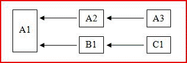

# Recálculo multithreaded no ExcelMultithreaded recalculation in Excel

**Aplica-se a**: Excel 2013 | Office 2013 | Visual Studio**Applies to**: Excel 2013 | Office 2013 | Visual Studio 
  
O Microsoft Office Excel 2007 foi a primeira versão do Excel a usar o MTR (recálculo multithread) de planilhas.Microsoft Office Excel 2007 was the first version of Excel to use multithreaded recalculation (MTR) of worksheets. Você pode configurar o Excel para usar até 1.024 threads simultâneos ao recalcular, independentemente do número de processadores ou núcleos de processador no computador.You can configure Excel to use up to 1024 concurrent threads when recalculating, regardless of the number of processors or processor cores on the computer. 
  
> [!NOTE]
> Há uma sobrecarga do sistema operacional associada a cada thread. Portanto, você não deve configurar o Excel para usar mais threads do que o número necessário.There is an operating system overhead associated with each thread, so you should not configure Excel to use more threads than you need. 
  
Se o computador tiver vários processadores ou núcleos de processador, o sistema operacional será responsável pela alocação dos threads para os processadores da maneira mais eficiente.If the computer has multiple processors or processor cores, the operating system takes responsibility for allocating the threads to the processors in the most efficient way.
  
## Visão geral do MTR do ExcelExcel MTR overview

O Excel tenta identificar partes da cadeia de cálculo que podem ser recalculadas ao mesmo tempo em threads diferentes.Excel tries to identify parts of the calculation chain that can be recalculated concurrently on different threads. A árvore muito simples a seguir (em que x ← y significa que y só depende de x) mostra um exemplo disso.The following very simple tree (where x ← y means y only depends on x) shows an example of this.
  
**Figura 1. Cálculo simultâneo em diferentes threads****Calculating concurrently on different threads**

  
Após o cálculo de A1, A2 e A3 podem ser calculados em um thread, enquanto B1 e C1 podem ser calculados em outro, presumindo que as células sejam thread-safe.After A1 is calculated, A2 and then A3 can be calculated on one thread, while B1 and then C1 can be calculated on another, assuming all the cells are thread safe. 
  
> [!NOTE]
> O termo célula thread-safe significa uma célula que contém apenas funções thread-safe.The term thread-safe cell means a cell that only contains thread-safe functions. O que é ou não thread-safe é detalhado em [O que é ou não considerado thread-safe pelo Excel](#xl2007xllsdk_threadsafe).What is and is not thread-safe is detailed [What Is and Is Not Considered Thread Safe by Excel](#xl2007xllsdk_threadsafe). 
  
A maioria das pastas de trabalho contém árvores de dependência bem mais complexas do que esse exemplo.Most practical workbooks contain far more complex dependency trees than this example. Além disso, o momento do recálculo de uma célula não pode ser conhecido até um cálculo ser feito e pode variar muito, dependendo dos argumentos das funções.Moreover, the recalculation time of a cell cannot be known until a calculation is done and can vary greatly depending on the functions' arguments. Para obter os melhores resultados, o Excel tenta melhorar a ordem de cálculo em cada cálculo até que nenhuma otimização seja mais possível.To obtain the best results, Excel tries to improve the calculation order on every calculation until no further optimization is possible.
  
O Excel usa um único thread principal para executar o seguinte:Excel uses a single main thread to run or execute the following:
  
- Comandos internosBuilt-in commands
    
- Comandos XLLXLL commands
    
- Funções da interface do Gerenciador de Suplementos XLL (função **xlAutoOpen** e assim por diante)XLL Add-in Manager interface functions (**xlAutoOpen** function, and so on) 
    
- Comandos definidos pelo usuário (muitas vezes chamados de macros) do Microsoft VBA (Visual Basic for Applications)Microsoft Visual Basic for Applications (VBA) user-defined commands (often referred to as macros)
    
- Funções definidas pelo usuário do VBAVBA user-defined functions
    
- Funções de planilha thread-unsafe internas (confira a próxima seção para obter uma lista)Built-in thread-unsafe worksheet functions (see the next section for a list)
    
- Funções e comandos definidos pelo usuário de planilha de macro XLMXLM macro sheet user-defined commands and functions
    
- Funções e comandos de suplemento COMCOM add-in commands and functions
    
- Funções e operadores em expressões de formatação condicionalFunctions and operators within conditional formatting expressions
    
- Funções e operadores em definições de nome definido usadas em fórmulas de planilhaFunctions and operators within defined name definitions used in worksheet formulas
    
- A avaliação forçada de uma expressão na caixa de edição de fórmula usando a tecla **F9**The forced evaluation of an expression in the formula-edit box using the **F9** key 
    
Todas as fórmulas de planilha, independentemente de as funções serem thread-safe ou não, são avaliadas no thread principal, a menos que o Excel esteja configurado para usar mais de um thread.All worksheet formulas, regardless of whether the functions are thread safe or not, are evaluated on the main thread unless Excel is configured to use more than one thread. Quando o usuário especifica que mais de um thread deve ser usado, os threads adicionais são usados para células thread-safe.When the user specifies that more than one thread should be used, the additional threads are used for thread-safe cells. O thread principal ainda pode ser usado para células thread-safe quando isso faz sentido do ponto de vista do balanceamento de carga.Note that the main thread may still be used for thread-safe cells when it makes sense from a load-balancing point of view.
  
Vale ressaltar que o Excel não executa mais de um comando de cada vez. Portanto, você não precisa adotar as mesmas precauções necessárias ao escrever funções thread-safe, como o uso de memória thread-local e seções críticas.It is worth restating that Excel does not run more than one command at once, so you do not need to employ the same precautions as when you are writing thread-safe functions, such as the use of thread-local memory and critical sections.
  
## O que é ou não considerado thread-safe pelo ExcelWhat is and is not considered thread safe by Excel

O Excel considera apenas o seguinte como thread-safe:Excel only considers the following as thread safe:
  
- Todos os operadores unários e binários no Excel.All unary and binary operators in Excel.
    
- Quase todas as funções de planilha internas, a partir do Excel 2007 (confira a lista de exceções)Almost all built-in worksheet functions starting in Excel 2007 (see exceptions list)
    
- Funções de suplemento XLL registradas explicitamente como thread-safe.XLL add-in functions that have been explicitly registered as thread-safe.
    
As funções de planilha internas que não são thread-safe são:The built-in worksheet functions that are not thread safe are:
  
- **FONÉTICA****Phonetic**
    
- **CÉL** quando o argumento "formato" ou "endereço" é usado**CELL** when either the "format" or "address" argument is used 
    
- **INDIRETO****INDIRECT**
    
- **INFODADOSTABELADINÂMICA****GetPivotData**
    
- **MEMBROCUBO****CUBEMEMBER**
    
- **VALORCUBO****CUBEVALUE**
    
- **PROPRIEDADEMEMBROCUBO****CUBEMEMBERPROPERTY**
    
- **CONJUNTOCUBO****CUBESET**
    
- **MEMBROCLASSIFICADOCUBO****CUBERANKEDMEMBER**
    
- **MEMBROKPICUBO****CUBEKPIMEMBER**
    
- **CONTAGEMCONJUNTOCUBO****CUBESETCOUNT**
    
- **ENDEREÇO** quando o quinto parâmetro (nome_da_planilha) é fornecido**ADDRESS** where the fifth parameter (the sheet_name) is given 
    
- Qualquer função de banco de dados (**BDSOMA**, **BDMÉDIA** e assim por diante) que se refere a uma tabela dinâmicaAny database function (**DSUM**, **DAVERAGE**, and so on) that refers to a pivot table
    
- **TIPO.ERRO****ErrorType**
    
- **HIPERLINK****Hyperlink**
    
Em termos explícitos, os seguintes itens são considerados não seguros:To be explicit, the following are considered to be unsafe:
  
- Funções definidas pelo usuário do VBAVBA user-defined functions
    
- Funções definidas pelo usuário de suplemento COMCOM add-in user-defined functions
    
- Funções definidas pelo usuário de planilha de macro XLMXLM macro-sheet user-defined functions
    
- Funções de suplementos XLL não explicitamente registradas como thread-safeXLL add-in functions not explicitly registered as thread safe
    
As implicações são que as operações e funções a seguir não são thread-safe e falham se são chamadas de uma função XLL registrada como thread-safe:The implications are that the following operations and functions are not thread-safe, and fail if they are called from an XLL function registered as thread safe:
  
- Chamadas para funções de informações XLM; por exemplo, **xlfGetCell** (**OBTER.CÉLULA**).Calls to XLM information functions, for example, **xlfGetCell** (**GET.CELL**).
    
- Chamadas para **xlfSetName** (**DEF.NOME**) para definir ou excluir nomes internos XLL.Calls to **xlfSetName** (**SET.NAME**) to define or delete XLL-internal names.
    
- Chamadas para funções definidas pelo usuário thread-unsafe usando **xlUDF**.Calls to thread-unsafe user-defined functions using **xlUDF**.
    
- Chamadas para a função [xlfEvaluate](xlfevaluate.md) para expressões que contenham funções thread-unsafe ou que contenham nomes definidos cujas definições contenham funções thread-unsafe.Calls to the [xlfEvaluate](xlfevaluate.md) function for expressions that contain thread-unsafe functions or that contain defined names whose definitions contain thread-unsafe functions. 
    
- Chamadas para a função [xlAbort](xlabort.md) para limpar uma condição de interrupção.Calls to the [xlAbort](xlabort.md) function to clear a break condition. 
    
- Chamadas para a função [xlCoerce](xlcoerce.md) para obter o valor de uma referência de célula não calculada.Calls to the [xlCoerce](xlcoerce.md) function to get the value of an uncalculated cell reference. 
    
> [!NOTE]
> Funções de planilha XLL não podem chamar comandos da API de C, por exemplo, **xlcSave**, independentemente de terem sido registradas como thread-safe ou não.XLL worksheet functions are not permitted to call C API commands, for example, **xlcSave**, regardless of whether they have been registered as thread safe or not. 
  
Considerando que funções XLL declaradas como thread-safe não podem chamar funções de informações XLM ou referenciar células não calculadas, o Excel não permite que funções XLL registradas como equivalentes de planilha de macro também sejam registradas como thread-safe.Given that XLL functions declared as thread safe cannot call XLM information functions or reference uncalculated cells, Excel does not permit XLL functions that are registered as macro sheet equivalents to also be registered as thread safe. Portanto, a tentativa de obter o valor de uma referência de célula não calculada usando **xlCoerce** falha com um erro **xlretUncalced**.Therefore attempting to get the value of an uncalculated cell reference using **xlCoerce** fails with an **xlretUncalced** error. A chamada de uma função de informações XLM falha com um erro **xlretFailed**.Calling an XLM information function fails with an **xlretFailed** error. Os outros pontos listados anteriormente falham com um código de erro introduzido na API de C do Excel: **xlretNotThreadSafe**.The other points listed previously fail with an error code introduced in the Excel C API: **xlretNotThreadSafe**. 
  
Todas as funções de retorno de chamada somente de API de C são thread-safe:The C API-only call-back functions are all thread safe:
  
- **xlCoerce** (exceto se a coerção de referências de célula não calculada falhar)**xlCoerce** (except although coercion of uncalculated cell references fails) 
    
- **xlFree****xlFree**
    
- **xlStack****xlStack**
    
- **xlSheetId****xlSheetId**
    
- **xlSheetNm****xlSheetNm**
    
- **xlAbort** (exceto quando usada para limpar uma condição de interrupção)**xlAbort** (except when used to clear a break condition) 
    
- **xlGetInst****xlGetInst**
    
- **xlGetHwnd****xlGetHwnd**
    
- **xlGetBinaryName****xlGetBinaryName**
    
- **xlDefineBinaryName****xlDefineBinaryName**
    
A única exceção é a função **xlSet** que, de qualquer forma, é um equivalente de comando e, portanto, não pode ser chamada de nenhuma função de planilha.The one exception is the **xlSet** function, which is, in any case, a command-equivalent and so cannot be called from any worksheet function. 
  
Uma função de planilha XLL pode ser registrada no Excel como thread-safe.An XLL worksheet function can be registered with Excel as thread safe. Isso informa ao Excel que a função pode ser chamada com segurança e simultaneamente em vários threads, embora você deva verificar se esse realmente é o caso.This tells Excel that the function can be called safely and simultaneously on multiple threads, although you must make sure this is really the case. Você poderá possivelmente desestabilizar o Excel se uma função registrada como thread-safe se comportar de forma não segura.You can possibly destabilize Excel if a function registered as thread safe then behaves unsafely.
  
## Registrar funções XLL como thread-safeRegistering XLL functions as thread safe

As regras que um desenvolvedor deve cumprir ao escrever funções thread-safe são:The rules that a developer must obey when writing thread-safe functions are as follows:
  
- Não chamar recursos em outras DLLs que possam não ser thread-safe.Do not call resources in other DLLs that may not be thread safe.
    
- Não fazer chamadas thread-unsafe por meio da API de C ou COM.Do not make any thread-unsafe calls via the C API or COM.
    
- Proteger os recursos que podem ser usados simultaneamente por mais de um thread usando seções críticas.Protect resources that could be used simultaneously by more than one thread using critical sections.
    
- Usar memória local de thread para armazenamento específico de thread e substituir variáveis estáticas em funções por variáveis locais de thread.Use thread-local memory for thread-specific storage, and replace static variables within functions with thread-local variables.
    
O Excel impõe uma restrição adicional: funções thread-safe não podem ser registradas como equivalentes de planilha de macro e, assim, não podem chamar funções de informações XLM nem obter os valores de células não recalculadas.Excel imposes an additional restriction: thread-safe functions cannot be registered as macro-sheet equivalents, and therefore cannot call XLM information functions or get the values of un-recalculated cells.
  
## Contenção de memóriaMemory contention

Sistemas multi-threaded devem resolver dois problemas fundamentais:Multithreaded systems must address two fundamental issues:
  
- Como proteger a memória que deve ser lida ou gravada por mais de um thread.How to protect memory that must be read from, or written to, by more than one thread.
    
- Como criar e acessar a memória que é associada e, assim, privada para o thread de execução.How to create and access memory that is associated with, and so private to, the executing thread.
    
O sistema operacional Windows e o SDK (Software Development Kit) do Windows oferecem ferramentas para ambos os itens: seções críticas e a API de TLS (armazenamento local de thread), respectivamente.The Windows operating system and Windows Software Development Kit (SDK) provide tools for both of these: critical sections and the thread-local storage (TLS) API respectively. Saiba mais em [Gerenciamento de Memória no Excel](memory-management-in-excel.md).For more information, see [Memory Management in Excel](memory-management-in-excel.md).
  
O primeiro problema pode ocorrer, por exemplo, quando duas funções de planilha (ou duas instâncias de execução simultânea da mesma função) precisam acessar ou modificar uma variável global em um projeto de DLL.The first issue can arise, for example, when two worksheet functions (or two simultaneously running instances of the same function) need to access or modify a global variable in a DLL project. Essa variável global pode estar oculta em uma instância globalmente acessível de um objeto de classe.Remember that such a global variable might be hidden in a globally accessible instance of a class object.
  
O segundo problema pode ocorrer, por exemplo, quando uma função de planilha declara uma variável estática ou um objeto no código do corpo da função.The second issue can arise, for example, when a worksheet function declares a static variable or object within the function body code. O compilador de C/C++ apenas cria uma única cópia que todos os threads usam.The C/C++ compiler only creates a single copy that all threads use. Isso significa que uma instância da função pode alterar o valor, enquanto outra em um thread diferente pode supor que o valor é o que estava definido antes.This means one instance of the function could change the value, while another on a different thread might be assuming the value is what it previously set.
  
## Exemplos de aplicações de MTRExample applications of MTR

Qualquer XLL que exporta funções de planilha pode aproveitar o MTR (recálculo multi-threaded) no Excel, desde que essas funções não precisem executar ações thread-unsafe.Any XLL that exports worksheet functions can take advantage of multithreaded recalculation (MTR) in Excel provided that those functions do not need to perform thread-unsafe actions. Isso habilita o Excel a recalcular pastas de trabalho que dependem delas o mais reapidamente possível e, portanto, desejável, seja qual for o aplicativo.This enables Excel to recalculate workbooks that depend on them as quickly as possible and is therefore desirable whatever the application.
  
Especificamente, o MTR tem enorme impacto em relação ao tempo de recálculo de pastas de trabalho que chamam UDFs (funções definidas pelo usuário) que, por sua vez, chamam processos externos para obter o resultado desejado.Specifically, MTR has an enormous impact on the recalculation time of workbooks that call user-defined functions (UDFs) that themselves call external processes to obtain the desired result. Em particular, considere uma UDF que chama um servidor remoto que pode processar várias solicitações ao mesmo tempo e uma pasta de trabalho que contém muitas chamadas para essa função.In particular, consider a UDF that calls a remote server that can process many requests simultaneously and a workbook containing many calls to that function. Se o recálculo da pasta de trabalho for single-threaded, cada chamada à UDF e, assim, ao servidor remoto, deverá ser concluída para que a chamada seguinte possa ser feita.If recalculation of the workbook is single-threaded, each call to the UDF, and so to the remote server, must complete before the next one can be made. Isso desperdiça a capacidade do servidor de processar várias chamadas ao mesmo tempo.This wastes the server's ability to process many calls at once. Se o recálculo da pasta de trabalho for multi-threaded, o Excel poderá fazer várias chamadas ao mesmo tempo ou em sequência rápida.If recalculation of the workbook is multithreaded, Excel can make multiple calls at the same time or in rapid succession.
  
Se o Excel estiver configurado para usar o mesmo número de threads que o servidor (vamos chamar isso de N) e a topologia da árvore de dependência da pasta de trabalho o permitir, o tempo total de recálculo poderá ser reduzido para algo próximo de 1/N do tempo de cálculo single-threaded.If Excel is configured to use the same number of threads as the server—call it N—and the topology of the dependency tree of the workbook permits it, the total recalculation time could be reduced to something approaching 1/N of the single-threaded calculation time. Isso pode ocorrer até mesmo quando o computador cliente (em que a pasta de trabalho está sendo executada) tem apenas um processador, especialmente quando o tempo necessário para fazer a chamada ao servidor é pequeno em relação ao tempo necessário para o servidor processar a chamada.This may be true even where the client computer (on which the workbook is running) only has one processor, especially where the time taken to make the call to the server is small relative to the time it takes the server to process the call. 
  
Há sobrecarga do sistema operacional para cada thread adicional.There is operating system overhead for each additional thread. Portanto, pode ser necessário testar um pouco para que determinada pasta de trabalho, servidor e computador cliente encontrem o número ideal de threads que o Excel deve ser instruído a usar.Therefore some experimentation might be required for a given workbook and a given server and client computer to find the optimum number of threads Excel should be told to use. 
  
Por exemplo, considere um computador com processador único que esteja executando o Excel e uma pasta de trabalho que contenha 1.000 células.For example, consider a single-processor computer that is running Excel and a workbook that contains 1,000 cells. Ele chama uma UDF que, por sua vez, chama um ou mais servidores remotos.It calls a UDF, which in turn calls one or more remote servers. Suponha que as 1.000 células não dependam umas das outras. Portanto, o Excel não precisa esperar até que uma chamada seja concluída antes de chamar a próxima.Assume that the 1,000 cells do not depend upon each other, so that Excel does not have to wait for one call to complete before calling the next. É possível ter alguma flexibilidade para essa restrição sem afetar esse exemplo. Se os servidores podem processar 100 solicitações simultaneamente, e o Excel está configurado para usar 100 threads, o tempo de execução pode ser reduzido para apenas 1/100 disso, em que apenas um thread é usado.(Some relaxation of this constraint is possible without affecting this example.) If the servers can process 100 requests simultaneously, and Excel is configured to use 100 threads, the execution time can be reduced to as little as 1/100th of that where only one thread is used. A sobrecarga que ocorre quando o Excel aloca chamadas para cada thread e o sistema operacional gerencia 100 threads significa que, na prática, a redução não será tão elevada.The overhead that is associated with Excel allocating calls to each thread and the operating system managing 100 threads means that, in practice, the reduction will not be quite this great. Também existe a suposição implícita de que o servidor é bem dimensionado e, se for solicitado a processar 100 tarefas ao mesmo tempo, isso não afetará os tempos de conclusão de tarefas individuais significativamente.There is also an implicit assumption here that the server scales well, and asking it to process 100 tasks concurrently will not affect individual task completion times significantly.
  
Uma aplicação prática em que essa técnica pode oferecer uma vantagem importante refere-se aos métodos Monte Carlo, bem como a outras tarefas com grande volume de números, que podem ser divididas em subtarefas menores que podem ser delegadas a servidores.One practical application in which this technique can have an important benefit is that of Monte-Carlo methods, as well as other numerically intensive tasks that can be split into smaller sub-tasks that can be farmed out to servers.
  
## Considerações sobre os Serviços do ExcelExcel Services considerations

Os Serviços do Excel dão suporte ao carregamento, ao cálculo e à renderização de planilhas do Excel em um servidor.Excel Services supports the loading, calculating, and rendering of Excel spreadsheets on a server. Os usuários podem acessar e interagir com as planilhas usando ferramentas de navegador padrão.Users can then access and interact with the spreadsheets by using standard browser tools.
  
UDFs dos Serviços do Excel são criadas usando o código gerenciado do Microsoft .NET Framework e disponibilizados por meio de um assembly do .NET.Excel Services UDFs are created using Microsoft .NET Framework managed code and made available though a .NET assembly. XLLs não têm suporte nos Serviços do Excel.XLLs are not supported by Excel Services. Um recurso de UDF de servidor de código gerenciado pode chamar um XLL para acessar sua funcionalidade, para que o usuário possa ter a mesma funcionalidade com uma pasta de trabalho carregada servidor no servidor que obteria com uma pasta de trabalho carregada no cliente.A managed code server UDF resource can call into an XLL to access its functionality, so that the user can have the same functionality with a server-loaded workbook as with a client-loaded workbook.
  
Para disponibilizar as funções XLL dessa maneira, elas devem ser encapsuladas em um assembly do .NET que converta argumentos e retorne valores dos tipos de dados nativos para os tipos de dados gerenciados do .NET Framework e chame as funções XLL.To make an XLL's functions available in this way, they must therefore be wrapped in a .NET assembly that converts arguments and return values from the native data types to the .NET Framework managed data types, and that calls the XLL functions. O wrapper do .NET deve exportar uma UDF de servidor para cada função XLL que é acessada.The .NET wrapper would export one server UDF for each XLL function being accessed. Um requisito adicional é que as funções XLL chamadas dessa maneira devem ser thread-safe.An additional requirement is that any XLL functions called in this way must be thread safe. Como as funções XLL não são registradas como ocorre no cliente Excel, o servidor e o wrapper do .NET não têm nenhuma maneira de impor que elas sejam thread-safe.Because the XLL functions are not registered in the way that they are with client Excel, the server and the .NET wrapper have no way of enforcing that they are thread safe. É responsabilidade do desenvolvedor de XLL garantir isso.It is the responsibility of the XLL developer to ensure this.
  
## Confira tambémSee also

- [Recálculo do ExcelExcel recalculation](excel-recalculation.md)  
- [Gerenciamento de Memória no ExcelMemory Management in Excel](memory-management-in-excel.md) 
- [Acessar o código de XLL no ExcelAccessing XLL code in Excel](accessing-xll-code-in-excel.md)  
- [Conceitos de programação do ExcelExcel Programming Concepts](excel-programming-concepts.md)  
- [Excel XLL SDK API Function ReferenceExcel XLL SDK API Function Reference](excel-xll-sdk-api-function-reference.md)

