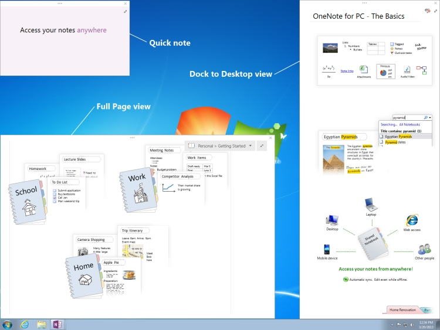

# <a name="window-interfaces-onenote"></a><span data-ttu-id="e528d-104">Interfaces de janela (OneNote)</span><span class="sxs-lookup"><span data-stu-id="e528d-104">Window interfaces (OneNote)</span></span>

<span data-ttu-id="e528d-105">As interfaces de **janela** e **janelas** são que objetos de API do OneNote 2013 que permite que os usuários trabalhem com janelas do OneNote.</span><span class="sxs-lookup"><span data-stu-id="e528d-105">The **Window** and **Windows** interfaces are OneNote 2013 API objects that enables users to work with OneNote windows.</span></span> <span data-ttu-id="e528d-106">Esses objetos permitem aos usuários enumerar toda o conjunto de janelas do OneNote e modificar determinadas propriedades de janela.</span><span class="sxs-lookup"><span data-stu-id="e528d-106">These objects allow users to enumerate through the set of OneNote windows and modify certain window properties.</span></span> 
  
## <a name="onenote-window-views"></a><span data-ttu-id="e528d-107">OneNote window views</span><span class="sxs-lookup"><span data-stu-id="e528d-107">OneNote window views</span></span>

<span data-ttu-id="e528d-108">A lista a seguir mostra os modos de exibição de quatro que você pode usar para janelas do OneNote:</span><span class="sxs-lookup"><span data-stu-id="e528d-108">The following list shows the four view modes that you can use for OneNote windows:</span></span> 
  
- <span data-ttu-id="e528d-109">Modo de exibição normal — exibe a janela do OneNote padrão no qual os painéis de navegação do bloco de anotações e página estão visíveis.</span><span class="sxs-lookup"><span data-stu-id="e528d-109">Normal view—Displays the default OneNote window in which the Notebook and Page navigation panes are visible.</span></span>
    
- <span data-ttu-id="e528d-110">Total de modo de exibição de página — exibe uma mínima interface do usuário (UI) exibir na qual os painéis de bloco de anotações e a página não são exibidos.</span><span class="sxs-lookup"><span data-stu-id="e528d-110">Full Page view—Displays a minimal user-interface (UI) view in which the Notebook and Page panes are not displayed.</span></span>
    
- <span data-ttu-id="e528d-111">Anotação rápida — exibe uma pequena janela que permite que os usuários façam anotações curtas.</span><span class="sxs-lookup"><span data-stu-id="e528d-111">Quick note—Displays a small window that allows users to take short notes.</span></span> <span data-ttu-id="e528d-112">Notas Rápidas geralmente podem ser acessadas por meio do ícone do OneNote na área de notificação do Windows, mas você também pode acessá-los por meio da guia **Exibir** no OneNote.</span><span class="sxs-lookup"><span data-stu-id="e528d-112">You would usually access quick notes through the OneNote icon in the Windows notification area, but you can also access them through the **View** tab in OneNote.</span></span> 
    
- <span data-ttu-id="e528d-113">Encaixa à área de trabalho — exibe uma janela do OneNote que é possível encaixar para qualquer lado da área de trabalho (semelhante à barra de tarefas).</span><span class="sxs-lookup"><span data-stu-id="e528d-113">Dock to Desktop—Displays a OneNote window that you can dock to any side of the desktop (similar to the taskbar).</span></span> <span data-ttu-id="e528d-114">Este modo de exibição reduz o tamanho da área de trabalho para se ajustar na janela.</span><span class="sxs-lookup"><span data-stu-id="e528d-114">This view reduces the size of the desktop to fit the window.</span></span> <span data-ttu-id="e528d-115">É possível encaixar apenas uma janela a qualquer momento, e a janela é sempre visível sem bloqueio da área de trabalho.</span><span class="sxs-lookup"><span data-stu-id="e528d-115">You can dock only one window at any time, and the window is always visible without blocking the desktop.</span></span> 
    
<span data-ttu-id="e528d-116">A figura a seguir mostra qual a exibição de página inteira, encaixar na exibição da área de trabalho, e notas rápidas se parecem na área de trabalho.</span><span class="sxs-lookup"><span data-stu-id="e528d-116">The following figure shows what the Full Page view, Dock to Desktop view, and quick notes look like on your desktop.</span></span>
  
<span data-ttu-id="e528d-117">**OneNote views**</span><span class="sxs-lookup"><span data-stu-id="e528d-117">**OneNote views**</span></span>

<span data-ttu-id="e528d-118">![Exibições de janela do OneNote] (media/ON15Con_views.jpg "Exibições de janela do OneNote")</span><span class="sxs-lookup"><span data-stu-id="e528d-118"></span></span>
  
## <a name="interfaces"></a><span data-ttu-id="e528d-119">Interfaces</span><span class="sxs-lookup"><span data-stu-id="e528d-119">Interfaces</span></span>

<span data-ttu-id="e528d-120">Esta seção lista as interfaces e os membros que você pode usar para modificar as janelas do OneNote programaticamente.</span><span class="sxs-lookup"><span data-stu-id="e528d-120">This section lists the interfaces and members that you can use to modify OneNote windows programmatically.</span></span>
  
### <a name="windows-interface"></a><span data-ttu-id="e528d-121">Interface do Windows</span><span class="sxs-lookup"><span data-stu-id="e528d-121">Windows interface</span></span>

<span data-ttu-id="e528d-122">A interface do **Windows** permite que o usuário acesse o conjunto de janelas do OneNote abertas.</span><span class="sxs-lookup"><span data-stu-id="e528d-122">The **Windows** interface allows the user to access the set of opened OneNote windows.</span></span> <span data-ttu-id="e528d-123">É uma propriedade da classe do OneNote **aplicativo** , acessada por meio de **Application**.</span><span class="sxs-lookup"><span data-stu-id="e528d-123">It is a property of the OneNote **Application** class, accessed through **Application.Windows**.</span></span> <span data-ttu-id="e528d-124">Isso retorna o conjunto enumerado de janelas do OneNote.</span><span class="sxs-lookup"><span data-stu-id="e528d-124">This returns the enumerated set of OneNote windows.</span></span> 
  
<span data-ttu-id="e528d-125">**Properties**</span><span class="sxs-lookup"><span data-stu-id="e528d-125">**Properties**</span></span>

|<span data-ttu-id="e528d-126">**Nome**</span><span class="sxs-lookup"><span data-stu-id="e528d-126">**Name**</span></span>|<span data-ttu-id="e528d-127">**Type**</span><span class="sxs-lookup"><span data-stu-id="e528d-127">**Type**</span></span>|<span data-ttu-id="e528d-128">**Descrição**</span><span class="sxs-lookup"><span data-stu-id="e528d-128">**Description**</span></span>|
|:-----|:-----|:-----|
|<span data-ttu-id="e528d-129">**Count**</span><span class="sxs-lookup"><span data-stu-id="e528d-129">**Count**</span></span> <br/> |<span data-ttu-id="e528d-130">ULong</span><span class="sxs-lookup"><span data-stu-id="e528d-130">ulong</span></span>  <br/> |<span data-ttu-id="e528d-131">Obtém o número de objetos **Window** no conjunto de **Windows** .</span><span class="sxs-lookup"><span data-stu-id="e528d-131">Gets the number of **Window** objects in the **Windows** set.</span></span>  <br/> |
|<span data-ttu-id="e528d-132">**CurrentWindow**</span><span class="sxs-lookup"><span data-stu-id="e528d-132">**CurrentWindow**</span></span> <br/> |<span data-ttu-id="e528d-133">**Window**</span><span class="sxs-lookup"><span data-stu-id="e528d-133">**Window**</span></span> <br/> |<span data-ttu-id="e528d-134">Obtém o objeto de **janela** da janela ativa do OneNote.</span><span class="sxs-lookup"><span data-stu-id="e528d-134">Gets the **Window** object of the active OneNote window.</span></span>  <br/> |
|<span data-ttu-id="e528d-135">**Items**</span><span class="sxs-lookup"><span data-stu-id="e528d-135">**Items**</span></span> <br/> |<span data-ttu-id="e528d-136">**Window**</span><span class="sxs-lookup"><span data-stu-id="e528d-136">**Window**</span></span> <br/> |<span data-ttu-id="e528d-137">Retorna o objeto de **janela** que corresponde ao valor de índice passado.</span><span class="sxs-lookup"><span data-stu-id="e528d-137">Returns the **Window** object that corresponds to the index value passed.</span></span> <span data-ttu-id="e528d-138">Essa propriedade não pode ser acessada diretamente.</span><span class="sxs-lookup"><span data-stu-id="e528d-138">This property cannot be accessed directly.</span></span> <span data-ttu-id="e528d-139">Para retornar um objeto **Window** , use **Windows [índice (uint)]**.</span><span class="sxs-lookup"><span data-stu-id="e528d-139">To return a **Window** object, use **Windows [(uint) index]**.</span></span>  <br/> |
   
### <a name="window-interface"></a><span data-ttu-id="e528d-140">Interface da janela</span><span class="sxs-lookup"><span data-stu-id="e528d-140">Window interface</span></span>

<span data-ttu-id="e528d-141">A interface de **janela** permite que o usuário acesse determinadas propriedades de cada janela.</span><span class="sxs-lookup"><span data-stu-id="e528d-141">The **Window** interface allows the user to access certain properties of each window.</span></span> <span data-ttu-id="e528d-142">Cada janela OneNote pode ser acessada pela enumeração por meio da propriedade **Windows** da classe **Application** .</span><span class="sxs-lookup"><span data-stu-id="e528d-142">Each OneNote window can be accessed by enumerating through the **Windows** property of the **Application** class.</span></span> 
  
<span data-ttu-id="e528d-143">**Properties**</span><span class="sxs-lookup"><span data-stu-id="e528d-143">**Properties**</span></span>

|<span data-ttu-id="e528d-144">**Nome**</span><span class="sxs-lookup"><span data-stu-id="e528d-144">**Name**</span></span>|<span data-ttu-id="e528d-145">**Type**</span><span class="sxs-lookup"><span data-stu-id="e528d-145">**Type**</span></span>|<span data-ttu-id="e528d-146">**Descrição**</span><span class="sxs-lookup"><span data-stu-id="e528d-146">**Description**</span></span>|
|:-----|:-----|:-----|
|<span data-ttu-id="e528d-147">**Active**</span><span class="sxs-lookup"><span data-stu-id="e528d-147">**Active**</span></span> <br/> |<span data-ttu-id="e528d-148">bool</span><span class="sxs-lookup"><span data-stu-id="e528d-148">bool</span></span>  <br/> |<span data-ttu-id="e528d-149">Obtém ou define um valor que indica se a janela é a janela ativa do OneNote.</span><span class="sxs-lookup"><span data-stu-id="e528d-149">Gets or sets a value that indicates whether the window is the active OneNote window.</span></span>  <br/> |
|<span data-ttu-id="e528d-150">**Application**</span><span class="sxs-lookup"><span data-stu-id="e528d-150">**Application**</span></span> <br/> |<span data-ttu-id="e528d-151">**Application**</span><span class="sxs-lookup"><span data-stu-id="e528d-151">**Application**</span></span> <br/> |<span data-ttu-id="e528d-152">Obtém o objeto de **aplicativo** do OneNote que está associado à janela.</span><span class="sxs-lookup"><span data-stu-id="e528d-152">Gets the OneNote **Application** object that is associated with the window.</span></span>  <br/> |
|<span data-ttu-id="e528d-153">**CurrentPageId**</span><span class="sxs-lookup"><span data-stu-id="e528d-153">**CurrentPageId**</span></span> <br/> |<span data-ttu-id="e528d-154">string</span><span class="sxs-lookup"><span data-stu-id="e528d-154">string</span></span>  <br/> |<span data-ttu-id="e528d-155">Obtém a ID de objeto do OneNote page ativo da janela.</span><span class="sxs-lookup"><span data-stu-id="e528d-155">Gets the object ID of the active OneNote page of the window.</span></span>  <br/> |
|<span data-ttu-id="e528d-156">**CurrentSectionId**</span><span class="sxs-lookup"><span data-stu-id="e528d-156">**CurrentSectionId**</span></span> <br/> |<span data-ttu-id="e528d-157">string</span><span class="sxs-lookup"><span data-stu-id="e528d-157">string</span></span>  <br/> |<span data-ttu-id="e528d-158">Obtém a ID de objeto da seção OneNote ativa da janela.</span><span class="sxs-lookup"><span data-stu-id="e528d-158">Gets the object ID of the active OneNote section of the window.</span></span>  <br/> |
|<span data-ttu-id="e528d-159">**CurrentSectionGroupId**</span><span class="sxs-lookup"><span data-stu-id="e528d-159">**CurrentSectionGroupId**</span></span> <br/> |<span data-ttu-id="e528d-160">string</span><span class="sxs-lookup"><span data-stu-id="e528d-160">string</span></span>  <br/> |<span data-ttu-id="e528d-161">Obtém a ID de objeto do grupo de seção do OneNote ativo da janela.</span><span class="sxs-lookup"><span data-stu-id="e528d-161">Gets the object ID of the active OneNote section group of the window.</span></span>  <br/> |
|<span data-ttu-id="e528d-162">**CurrentNotebookId**</span><span class="sxs-lookup"><span data-stu-id="e528d-162">**CurrentNotebookId**</span></span> <br/> |<span data-ttu-id="e528d-163">string</span><span class="sxs-lookup"><span data-stu-id="e528d-163">string</span></span>  <br/> |<span data-ttu-id="e528d-164">Obtém a ID de objeto do bloco de anotações do OneNote ativo da janela.</span><span class="sxs-lookup"><span data-stu-id="e528d-164">Gets the object ID of the active OneNote notebook of the window.</span></span>  <br/> |
|<span data-ttu-id="e528d-165">**DockedLocation**</span><span class="sxs-lookup"><span data-stu-id="e528d-165">**DockedLocation**</span></span> <br/> |<span data-ttu-id="e528d-166">**DockedLocation**</span><span class="sxs-lookup"><span data-stu-id="e528d-166">**DockedLocation**</span></span> <br/> |<span data-ttu-id="e528d-167">Obtém ou define o local ancorado da janela do OneNote.</span><span class="sxs-lookup"><span data-stu-id="e528d-167">Gets or sets the docked location of the OneNote window.</span></span>  <br/> |
|<span data-ttu-id="e528d-168">**FullPageView**</span><span class="sxs-lookup"><span data-stu-id="e528d-168">**FullPageView**</span></span> <br/> |<span data-ttu-id="e528d-169">bool</span><span class="sxs-lookup"><span data-stu-id="e528d-169">bool</span></span>  <br/> |<span data-ttu-id="e528d-170">Obtém ou define um valor que indica se a janela está no modo de exibição de página inteira (exibição de UI mínima).</span><span class="sxs-lookup"><span data-stu-id="e528d-170">Gets or sets a value that indicates whether the window is in Full Page view (minimal UI view).</span></span>  <br/> |
|<span data-ttu-id="e528d-171">**Anotação rápida**</span><span class="sxs-lookup"><span data-stu-id="e528d-171">**SideNote**</span></span> <br/> |<span data-ttu-id="e528d-172">bool</span><span class="sxs-lookup"><span data-stu-id="e528d-172">bool</span></span>  <br/> |<span data-ttu-id="e528d-173">Obtém ou define um valor que indica se a janela é uma janela de anotação rápida.</span><span class="sxs-lookup"><span data-stu-id="e528d-173">Gets or sets a value that indicates whether the window is a quick note window.</span></span>  <br/> |
|<span data-ttu-id="e528d-174">**WindowHandle**</span><span class="sxs-lookup"><span data-stu-id="e528d-174">**WindowHandle**</span></span> <br/> |<span data-ttu-id="e528d-175">ULong</span><span class="sxs-lookup"><span data-stu-id="e528d-175">ulong</span></span>  <br/> |<span data-ttu-id="e528d-176">Obtém a identificação da alça da janela do OneNote.</span><span class="sxs-lookup"><span data-stu-id="e528d-176">Gets the handle ID of the OneNote window.</span></span>  <br/> |
   
<span data-ttu-id="e528d-177">**Métodos**</span><span class="sxs-lookup"><span data-stu-id="e528d-177">**Methods**</span></span>
  
<span data-ttu-id="e528d-178">Você pode usar os seguintes métodos da interface da **janela** para navegar para os objetos especificados na janela do OneNote ou URLs especificadas.</span><span class="sxs-lookup"><span data-stu-id="e528d-178">You can use the following methods of the **Window** interface to navigate to specified objects in the OneNote window or to specified URLs.</span></span> 
  
<span data-ttu-id="e528d-179">**NavigateTo**</span><span class="sxs-lookup"><span data-stu-id="e528d-179">**NavigateTo**</span></span>

|||
|:-----|:-----|
|<span data-ttu-id="e528d-180">**Descrição**</span><span class="sxs-lookup"><span data-stu-id="e528d-180">**Description**</span></span> <br/> |<span data-ttu-id="e528d-181">Navega para o objeto especificado na janela do OneNote.</span><span class="sxs-lookup"><span data-stu-id="e528d-181">Navigates to the specified object in the OneNote window.</span></span> <span data-ttu-id="e528d-182">Por exemplo, você pode navegar para os elementos de estrutura de tópicos dentro de páginas, páginas e seções.</span><span class="sxs-lookup"><span data-stu-id="e528d-182">For example, you can navigate to sections, pages, and outline elements within pages.</span></span>  <br/> |
|<span data-ttu-id="e528d-183">**Sintaxe**</span><span class="sxs-lookup"><span data-stu-id="e528d-183">**Syntax**</span></span> <br/> | <span data-ttu-id="e528d-184">`HRESULT NavigateTo(`           ` [in]BSTR bstrHierarchyObjectID, `           ` [in]BSTR bstrObjectID); `</span><span class="sxs-lookup"><span data-stu-id="e528d-184"></span></span> <br/> |
|<span data-ttu-id="e528d-185">**Parameters**</span><span class="sxs-lookup"><span data-stu-id="e528d-185">**Parameters**</span></span> <br/> | <span data-ttu-id="e528d-186">_bstrHierarchyObjectID_— a hierarquia do OneNote ID do objeto que você deseja navegar.</span><span class="sxs-lookup"><span data-stu-id="e528d-186">_bstrHierarchyObjectID_—The hierarchy OneNote ID of the object you want to navigate to.</span></span> <span data-ttu-id="e528d-187">A ID de objeto pode fazer referência a um notebook OneNote, seção, grupo de seção ou página.</span><span class="sxs-lookup"><span data-stu-id="e528d-187">The object ID can reference a OneNote notebook, section, section group, or page.</span></span>  <br/>  <span data-ttu-id="e528d-188">_bstrObjectID_— o ID do OneNote do objeto específico para navegar até dentro de uma página do OneNote.</span><span class="sxs-lookup"><span data-stu-id="e528d-188">_bstrObjectID_—The OneNote ID of the specific object to navigate to within a OneNote page.</span></span> <span data-ttu-id="e528d-189">Se não quiser que o usuário navegar para um objeto específico em uma página, esse parâmetro for definido como null.</span><span class="sxs-lookup"><span data-stu-id="e528d-189">If the user does not want to navigate to a specific object on a page, this parameter is set to null.</span></span>  <br/> |
   
<span data-ttu-id="e528d-190">**NavigateToUrl**</span><span class="sxs-lookup"><span data-stu-id="e528d-190">**NavigateToUrl**</span></span>

|||
|:-----|:-----|
|<span data-ttu-id="e528d-191">**Descrição**</span><span class="sxs-lookup"><span data-stu-id="e528d-191">**Description**</span></span> <br/> |<span data-ttu-id="e528d-192">Se passar um link do OneNote (onenote: / /), abre a janela do OneNote para o local correspondente no OneNote.</span><span class="sxs-lookup"><span data-stu-id="e528d-192">If passed a OneNote link (onenote://), opens the OneNote window to the corresponding location in OneNote.</span></span> <span data-ttu-id="e528d-193">No entanto, se o link é um link externo, como http:// ou file://, será exibida uma caixa de diálogo segurança.</span><span class="sxs-lookup"><span data-stu-id="e528d-193">However, if the link is an external link, such as http:// or file://, a security dialog box will appear.</span></span> <span data-ttu-id="e528d-194">Após a demissão, OneNote tenta abrir o link e é retornado um erro de HResult.hrObjectDoesNotExist.</span><span class="sxs-lookup"><span data-stu-id="e528d-194">Upon dismissal, OneNote attempts to open up the link and an HResult.hrObjectDoesNotExist error is returned.</span></span>  <br/> |
|<span data-ttu-id="e528d-195">**Sintaxe**</span><span class="sxs-lookup"><span data-stu-id="e528d-195">**Syntax**</span></span> <br/> | <span data-ttu-id="e528d-196">`HRESULT NavigateToUrl (`           ` [in]BSTR bstrUrl); `</span><span class="sxs-lookup"><span data-stu-id="e528d-196"></span></span> <br/> |
|<span data-ttu-id="e528d-197">**Parameters**</span><span class="sxs-lookup"><span data-stu-id="e528d-197">**Parameters**</span></span> <br/> | <span data-ttu-id="e528d-198">_bstrUrl_— o URL para navegar até.</span><span class="sxs-lookup"><span data-stu-id="e528d-198">_bstrUrl_—The URL to navigate to.</span></span>  <br/> |
   
<span data-ttu-id="e528d-199">**SetDockedLocation**</span><span class="sxs-lookup"><span data-stu-id="e528d-199">**SetDockedLocation**</span></span>

|||
|:-----|:-----|
|<span data-ttu-id="e528d-200">**Descrição**</span><span class="sxs-lookup"><span data-stu-id="e528d-200">**Description**</span></span> <br/> |<span data-ttu-id="e528d-201">Encaixa a janela para o local especificado pelo **dockLocation** e o monitor em **ptMonitor**.</span><span class="sxs-lookup"><span data-stu-id="e528d-201">Docks the window to the location specified by **dockLocation** and the monitor at **ptMonitor**.</span></span>  <br/> |
|<span data-ttu-id="e528d-202">**Sintaxe**</span><span class="sxs-lookup"><span data-stu-id="e528d-202">**Syntax**</span></span> <br/> | <span data-ttu-id="e528d-203">`HRESULT SetDockedLocation`(           `[in] DockLocation dockLocation,`           `[in] POINT ptMonitor);`</span><span class="sxs-lookup"><span data-stu-id="e528d-203"></span></span> <br/> |
|<span data-ttu-id="e528d-204">**Parameters**</span><span class="sxs-lookup"><span data-stu-id="e528d-204">**Parameters**</span></span> <br/> | <span data-ttu-id="e528d-205">_dockLocation_ - indica a localização ancorada de uma janela do OneNote 2013.</span><span class="sxs-lookup"><span data-stu-id="e528d-205">_dockLocation_ - Indicates the docked location of a OneNote 2013 window.</span></span>  <br/>  <span data-ttu-id="e528d-206">_ptMonitor_ - indica (opcional) em x, coordenadas y que monitorar a janela deve ser encaixado.</span><span class="sxs-lookup"><span data-stu-id="e528d-206">_ptMonitor_ - (Optional) Indicates in x,y co-ordinates which monitor the window should be docked to.</span></span>  <br/> |
   
## <a name="example"></a><span data-ttu-id="e528d-207">Exemplo</span><span class="sxs-lookup"><span data-stu-id="e528d-207">Example</span></span>

<span data-ttu-id="e528d-208">O código a seguir itera-se as janelas do OneNote para encontrar uma janela encaixada.</span><span class="sxs-lookup"><span data-stu-id="e528d-208">The following code iterates through the OneNote windows to find a docked window.</span></span> <span data-ttu-id="e528d-209">Se nenhuma janela encaixada existir, o exemplo encaixa a janela ativa.</span><span class="sxs-lookup"><span data-stu-id="e528d-209">If no docked window exists, the example docks the active window.</span></span> <span data-ttu-id="e528d-210">Se nenhuma janela ativa existir, o código cria uma nova janela encaixada.</span><span class="sxs-lookup"><span data-stu-id="e528d-210">If no active window exists, the code creates a new docked window.</span></span>
  
```cs
using System;
using System.Diagnostics;
using Microsoft.Office.Interop.OneNote;
namespace SampleWND
{
    class DockOneNoteWindow
    {
        static void Main(string[] args)
        {
            Microsoft.Office.Interop.OneNote.Application app = new Microsoft.Office.Interop.OneNote.Application();
            // Search through all OneNote windows for a docked window and activate it.
            bool foundDockedWND = false;
            for (int i = 0; i < app.Windows.Count; i++)
            {
                if (app.Windows[(uint) i].DockedLocation != DockLocation.dlNone)
                {
                    foundDockedWND = true;
                    app.Windows[(uint) i].Active = true;
                }
            }
            
            // If no docked window exists, dock the active window.
            if (!foundDockedWND && (app.Windows.Count > 0))
                app.Windows.CurrentWindow.DockedLocation = DockLocation.dlDefault;
            // If no active window exists, create a new docked window.
            if (app.Windows.Count < 1)
            {
                Process oneProc = new Process();
                oneProc.StartInfo.FileName = "onenote.exe";
                oneProc.StartInfo.Arguments = "/docked";
                oneProc.Start();
            }
        }
    }
}

```

## <a name="see-also"></a><span data-ttu-id="e528d-211">Confira também</span><span class="sxs-lookup"><span data-stu-id="e528d-211">See also</span></span>

- [<span data-ttu-id="e528d-212">Referência do desenvolvedor do OneNote</span><span class="sxs-lookup"><span data-stu-id="e528d-212">OneNote developer reference</span></span>](onenote-developer-reference.md)

