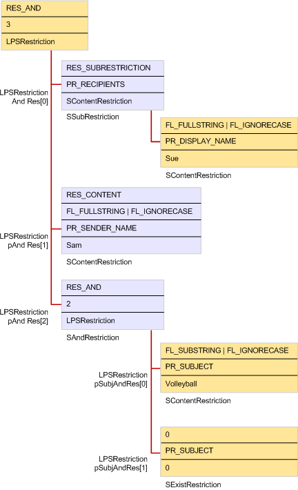

# Criar uma restriçãoBuilding a restriction

**Aplica-se a**: Outlook 2013 | Outlook 2016**Applies to**: Outlook 2013 | Outlook 2016 
  
Para criar uma restrição, um aplicativo cliente cria uma hierarquia de uma ou mais estruturas de restrição de vários tipos e passa um ponteiro para a hierarquia para o método [IMAPITable:: Restrict](imapitable-restrict.md) ou [IMAPITable:: FindRow](imapitable-findrow.md) .To build a restriction, a client application creates a hierarchy of one or more restriction structures of various types and passes a pointer to the hierarchy to the [IMAPITable::Restrict](imapitable-restrict.md) or [IMAPITable::FindRow](imapitable-findrow.md) method. A ilustração a seguir e o exemplo de código no [Exemplo de código de restrição](sample-restriction-code.md) demonstram como uma restrição típica é implementada com estruturas de restrição vinculados de diferentes tipos.The illustration that follows and the code sample in [Sample Restriction Code](sample-restriction-code.md) demonstrate how a typical restriction is implemented with linked restriction structures of different types. 

Neste exemplo, um usuário de um aplicativo cliente está tentando localizar todas as mensagens que contêm a palavra "voleibol" na linha de assunto e eram enviadas para Sue de Sam.In this example, a user of a client application is trying to find all messages that contain the word "volleyball" in the subject line and were sent to Sue from Sam. Primeiro, uma estrutura [SRestriction](srestriction.md) genérica é alocada.First, a generic [SRestriction](srestriction.md) structure is allocated. Essa estrutura torna-se a base para outras chamadas para a função [MAPIAllocateMore](mapiallocatemore.md) criar estruturas [SRestriction](srestriction.md) e [SPropValue](spropvalue.md) vinculadas que podem ser liberadas com uma única chamada para [MAPIFreeBuffer](mapifreebuffer.md).This structure becomes the basis for other calls to the [MAPIAllocateMore](mapiallocatemore.md) function to create linked [SRestriction](srestriction.md) and [SPropValue](spropvalue.md) structures that can be freed with a single call to [MAPIFreeBuffer](mapifreebuffer.md). Como os critérios a ser aplicado ao conjunto de mensagens está em três partes, a estrutura de restrição de nível superior é uma restrição de **AND** .Because the criteria to apply to the set of messages is in three parts, the top level restriction structure is an **AND** restriction. Membro de **cRes** da estrutura [SAndRestriction](sandrestriction.md) for definido como 3 para indicar as três restrições para avaliar e sua lista de membros **lpRes** estiver definida como uma matriz de três do membro de estruturas **SRestriction** .The [SAndRestriction](sandrestriction.md) structure's **cRes** member is set to 3 to indicate the three restrictions to evaluate and its **lpRes** member is set to a three member array of **SRestriction** structures. 
  
Para pesquisar mensagens que são enviadas para um destinatário específico, é necessário pesquisar a tabela de destinatários para cada mensagem em vez da mensagem em si.To search for messages that are sent to a particular recipient, it is necessary to search the recipient table for each message rather than the message itself. Uma restrição subobjeto é usada para executar a pesquisa de destinatário de tabela.A subobject restriction is used to perform the recipient table search. Portanto, o primeiro membro dos pontos de matriz em uma estrutura de [SSubRestriction](ssubrestriction.md) com seu membro **ulSubObject** definido como **PR_MESSAGE_RECIPIENTS** ([PidTagMessageRecipients](pidtagmessagerecipients-canonical-property.md)).Therefore, the first member of the array points to an [SSubRestriction](ssubrestriction.md) structure with its **ulSubObject** member set to **PR_MESSAGE_RECIPIENTS** ([PidTagMessageRecipients](pidtagmessagerecipients-canonical-property.md)). Em seguida, para especificar o que procurar na tabela de destinatário, uma restrição de conteúdo é usada.Then, to specify what to look for in the recipient table, a content restriction is used. 
  
Os membros de segundo e terceiro da matriz são mais simples.The second and third members of the array are more straightforward. Se ambas apontarem para estruturas de restrição de conteúdo, um para pesquisar por mensagens que tenham uma propriedade **PR_SENDER_NAME** ([PidTagSenderName](pidtagsendername-canonical-property.md)) definida como "Sam" e outro que tenha uma propriedade **PR_SUBJECT** ([PidTagSubject](pidtagsubject-canonical-property.md)) definida como" voleibol."They both point to content restriction structures, one to search for messages that have a **PR_SENDER_NAME** ([PidTagSenderName](pidtagsendername-canonical-property.md)) property set to "Sam" and another that has a **PR_SUBJECT** ([PidTagSubject](pidtagsubject-canonical-property.md)) property set to "volleyball."
  
**Restriction implementation****Restriction implementation**
  
![Implementação de restrição] (media/amapi_61.gif "Implementação de restrição")
  
## Confira tambémSee also

- [Tabelas MAPIMAPI Tables](mapi-tables.md)

