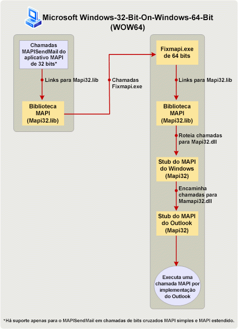

# Compilando aplicativos MAPI em plataformas de 32 bits e 64 bitsBuilding MAPI applications on 32-bit and 64-bit platforms

**Aplica-se a**: Outlook 2013 | Outlook 2016**Applies to**: Outlook 2013 | Outlook 2016 
  
Este tópico descreve as ações que os desenvolvedores MAPI devem ser adotada para alterar e reconstruir aplicativos MAPI de 32 bits para ser executado em uma plataforma de 64 bits e aplicativos de 64 bits sejam executados em uma plataforma de 32 bits.This topic describes the actions that MAPI developers should take to change and rebuild 32-bit MAPI applications to run on a 64-bit platform, and 64-bit applications to run on a 32-bit platform. Neste tópico, uma plataforma de 64 bits é um computador instalado com o Windows de 64 bits e de 64 bits Microsoft Outlook e uma plataforma de 32 bits é um computador instalado com um Outlook de 32 bits e Windows de 32 bits ou 64 bits.In this topic, a 64-bit platform is a computer installed with 64-bit Microsoft Outlook and 64-bit Windows, and a 32-bit platform is a computer installed with a 32-bit Outlook and 32-bit or 64-bit Windows. 
  
## Sistema operacional e suporte para o Outlook de 64 bits do OfficeOperating system and Office support for 64-bit Outlook

> [!NOTE]
> O número de bits de termo refere-se a distinção entre a associado compatibilidade de aplicativos e arquiteturas de processador de 32 bits e 64 bits.The term bitness refers to the distinction between 32-bit and 64-bit processor architectures and the associated compatibility of applications. Neste tópico, bitness é usado para se qualificar a versão do Windows, Microsoft Office, Outlook, ou um aplicativo de MAPI criado de acordo com uma arquitetura de processador de 32 bits ou 64 bits de um computador e, possivelmente, outros aplicativos que são executados no computador.In this topic, bitness is used to qualify the version of Windows, Microsoft Office, Outlook, or a MAPI application built to suit a 32-bit or 64-bit processor architecture of a computer, and possibly other applications that run on that computer. 
  
Iniciando no Microsoft Office 2010, Outlook está disponível como um aplicativo de 64 bits e de 32 bits.Starting in Microsoft Office 2010, Outlook is available as a 32-bit and a 64-bit application. No mesmo computador, o número de bits do Outlook depende do sistema operacional Windows (x86 ou x64) e do Microsoft Office, o número de bits se Office já estiver instalado no computador.On the same computer, the bitness of Outlook depends on the bitness of the Windows operating system (x86 or x64), and of Microsoft Office, if Office is already installed on that computer. Estes são alguns dos fatores que determinam a viabilidade da instalação de 32 bits ou uma versão de 64 bits do Outlook:The following are some of the factors that determine the feasibility of installing a 32-bit or a 64-bit version of Outlook:
  
- Office de 32 bits (e Outlook de 32 bits) podem ser instalado em uma versão de 32 bits ou 64 bits do sistema operacional Windows.32-bit Office (and 32-bit Outlook) can be installed on a 32-bit or 64-bit version of the Windows operating system. Office de 64 bits (e Outlook de 64 bits) podem ser instalado somente em um sistema operacional de 64 bits.64-bit Office (and 64-bit Outlook) can be installed only on a 64-bit operating system.
    
- A instalação padrão do Office em uma versão de 64 bits do sistema operacional Windows é o Office de 32 bits.The default installation of Office on a 64-bit version of the Windows operating system is 32-bit Office.
    
- O número de bits de uma versão instalada do Outlook é sempre o mesmo que o número de bits do Office, se o Office for instalado no mesmo computador.The bitness of an installed version of Outlook is always the same as the bitness of Office, if Office is installed on the same computer. Em outras palavras, uma versão de 32 bits do Outlook não pode ser instalada no mesmo computador que já tenha as versões de 64 bits dos outros aplicativos do Office instalados, como 64-bit Microsoft Word ou no Microsoft Excel de 64 bits.In other words, a 32-bit version of Outlook cannot be installed on the same computer that already has 64-bit versions of other Office applications installed, such as 64-bit Microsoft Word or 64-bit Microsoft Excel. Da mesma forma, uma versão de 64 bits do Outlook não pode ser instalada no mesmo computador que já tenha as versões de 32 bits de outros aplicativos do Office instalados.Similarly, a 64-bit version of Outlook cannot be installed on the same computer that already has 32-bit versions of other Office applications installed.
    
## Preparando aplicativos MAPI para plataformas de 32 bits e 64 bitsPreparing MAPI applications for 32-bit and 64-bit platforms

Aplicativos MAPI incluem aplicativos autônomos, como Microsoft Communicator e MFCMAPI e provedores de serviço, como o catálogo de endereços, armazenam e provedores de transporte.MAPI applications include standalone applications such as Microsoft Communicator and MFCMAPI, and service providers such as address book, store, and transport providers. Para a função e método MAPI chamadas para trabalhar em um aplicativo de MAPI (com exceção de uma Simple MAPI função, MAPISendMail), o número de bits do aplicativo MAPI devem ser o mesmo que o número de bits do subsistema de MAPI no computador que o aplicativo está programado para Execute em.For MAPI method and function calls to work in a MAPI application (with the exception of one Simple MAPI function, MAPISendMail), the bitness of the MAPI application must be the same as the bitness of the MAPI subsystem on the computer that the application is targeted to run on. O número de bits do subsistema de MAPI, por sua vez, é determinado por e sempre o mesmo que o número de bits da versão instalada do Outlook.The bitness of the MAPI subsystem, in turn, is determined by and always the same as the bitness of the installed version of Outlook. A tabela a seguir resume as ações necessárias para preparar aplicativos MAPI para executar nos computadores de destino configurados com o Office e janelas de vários bitness.The following table summarizes the necessary actions to prepare MAPI applications to run on targeted computers configured with Office and Windows of various bitness.
  
|Número de bits do aplicativo de MAPIBitness of MAPI application|Número de bits do Outlook no computador de destinoBitness of Outlook on targeted computer|Número de bits do Windows no computador de destinoBitness of Windows on targeted computer|Ação necessária para habilitar o aplicativo seja executado no computador de destinoNecessary action to enable application to run on targeted computer|
|:-----|:-----|:-----|:-----|
|32 bits32-bit    |32 bits32-bit    |32 bits ou 64 bits32-bit or 64-bit    |Nenhuma ação específica é necessária.No specific action is necessary.    |
|32 bits32-bit    |64 bits64-bit    |64 bits64-bit    |Recrie o aplicativo como um aplicativo de 64 bits.Rebuild the application as a 64-bit application. Caso contrário, todas as chamadas de método e a função MAPI (exceto para **MAPISendMail**) falhará.Otherwise, all MAPI method and function calls (except for **MAPISendMail**) will fail.    |
|64 bits64-bit    |64 bits64-bit    |64 bits64-bit    |Nenhuma ação específica é necessária.No specific action is necessary.    |
|64 bits64-bit    |32 bits32-bit    |32 bits ou 64 bits32-bit or 64-bit    |Recrie o aplicativo como um aplicativo de 32 bits.Rebuild the application as a 32-bit application. Caso contrário, todas as chamadas de método e a função MAPI (exceto para **MAPISendMail**) falhará.Otherwise, all MAPI method and function calls (except for **MAPISendMail**) will fail.    |
   
Ainda mais as seções a seguir explicam cada cenário.The following sections further explain each scenario. Para cenários que exigem a recriação do aplicativo de MAPI, consulte o [Link para funções de MAPI](how-to-link-to-mapi-functions.md) para obter informações adicionais sobre vinculando a e chamar funções de MAPI.For scenarios that require rebuilding the MAPI application, see [Link to MAPI Functions](how-to-link-to-mapi-functions.md) for additional information regarding linking to and calling MAPI functions. 
  
### aplicativo de MAPI de 32 bits e o Outlook de 32 bits32-bit MAPI application and 32-bit Outlook

Aplicativos MAPI compilados por um subsistema MAPI de 32 bits que está disponível em versões de 32 bits do Outlook, incluindo as versões anteriores ao Microsoft Outlook 2013, continuem a ter suporte em computadores instalados com o Outlook de 32 bits e um Windows de 32 bits ou 64 bits Sistema Operacional.MAPI applications compiled for a 32-bit MAPI subsystem that is available in 32-bit versions of Outlook, including those versions prior to Microsoft Outlook 2013, continue to be supported on computers installed with 32-bit Outlook and a 32-bit or 64-bit Windows operating system. Não há nenhuma ação específica necessárias para os desenvolvedores de aplicativos.There is no specific action necessary for the application developers.
  
### aplicativo de MAPI de 32 bits e 64 bits Outlook32-bit MAPI application and 64-bit Outlook

aplicativos MAPI de 32 bits não são suportados para executar em um computador instalado com o Outlook de 64 bits e Windows de 64 bits.32-bit MAPI applications are not supported to run on a computer installed with 64-bit Outlook and 64-bit Windows. O desenvolvedor do aplicativo deve atualizar e recriar o aplicativo como um aplicativo de 64 bits para a plataforma de 64 bits.The application developer must update and rebuild the application as a 64-bit application for the 64-bit platform. Isso acontece porque um aplicativo de 32 bits não é possível carregar um arquivo de Msmapi32 de 64 bits.This is because a 32-bit application cannot load a 64-bit Msmapi32.dll file. Há um pequeno número de alterações de API que os desenvolvedores de aplicativos devem incorporar para criar seu código com êxito para um ambiente de 64 bits.There are a small number of API changes that application developers must incorporate to build their code successfully for a 64-bit environment. Arquivos de cabeçalho MAPI foram atualizados com essas alterações para oferecer suporte a plataforma de 64 bits.MAPI header files have been updated with these changes to support the 64-bit platform. Você pode baixar esses arquivos de cabeçalho em [Outlook 2010: arquivos de cabeçalho de MAPI](https://www.microsoft.com/downloads/details.aspx?FamilyID=f8d01fc8-f7b5-4228-baa3-817488a66db1).You can download these header files at [Outlook 2010: MAPI Header Files](https://www.microsoft.com/downloads/details.aspx?FamilyID=f8d01fc8-f7b5-4228-baa3-817488a66db1). Os desenvolvedores podem usar esse mesmo conjunto de arquivos de cabeçalho MAPI para criar aplicativos de MAPI de 32 bits e 64 bits.Developers can use this same set of MAPI header files to build both 32-bit and 64-bit MAPI applications.
  
### aplicativo de MAPI de 64 bits e 64 bits Outlook64-bit MAPI application and 64-bit Outlook

aplicativos MAPI de 64 bits são suportados em computadores instalados com o Outlook de 64 bits e Windows de 64 bits.64-bit MAPI applications are supported on computers installed with 64-bit Outlook and 64-bit Windows. Não há nenhuma ação específica necessárias para os desenvolvedores de aplicativos.There is no specific action necessary for the application developers.
  
### Outlook de 32 bits e de aplicativo de MAPI de 64 bits64-bit MAPI application and 32-bit Outlook

aplicativos MAPI de 64 bits não são suportados para executar em um computador instalado com o Outlook de 32 bits e Windows de 32 bits ou 64 bits.64-bit MAPI applications are not supported to run on a computer installed with 32-bit Outlook and 32-bit or 64-bit Windows. O desenvolvedor do aplicativo deve atualizar e recriar o aplicativo como um aplicativo de 32 bits para funcionar com o Outlook de 32 bits.The application developer must update and rebuild the application as a 32-bit application to work with 32-bit Outlook. Use os arquivos de cabeçalho MAPI atualizados, o que pode ser baixado em [Outlook 2010: arquivos de cabeçalho de MAPI](https://www.microsoft.com/downloads/details.aspx?FamilyID=f8d01fc8-f7b5-4228-baa3-817488a66db1).Use the updated MAPI header files, which you can download at [Outlook 2010: MAPI Header Files](https://www.microsoft.com/downloads/details.aspx?FamilyID=f8d01fc8-f7b5-4228-baa3-817488a66db1). Os desenvolvedores podem usar esse mesmo conjunto de arquivos de cabeçalho MAPI para criar aplicativos de MAPI de 32 bits e 64 bits.Developers can use this same set of MAPI header files to build both 32-bit and 64-bit MAPI applications.
  
### Exceção: MAPISendMailException: MAPISendMail

Em geral, não deve executar um aplicativo de MAPI de 32 bits de 64 bits plataforma (Outlook de 64 bits no Windows de 64 bits) sem primeiro sendo recriada como um aplicativo de 64 bits e um aplicativo de MAPI de 64 bits não precisará executar em um computador instalado com o Outlook de 32 bits e 32 bits ou 64 bits Windows sem primeiro sejam recriados como um aplicativo de 32 bits.In general, a 32-bit MAPI application must not run on a 64-bit platform (64-bit Outlook on 64-bit Windows) without first being rebuilt as a 64-bit application, and a 64-bit MAPI application must not run on a computer installed with 32-bit Outlook and 32-bit or 64-bit Windows without first being rebuilt as a 32-bit application. Figura 1 mostra uma caixa de diálogo alerta que seria exibida se uma dessas situações ocorrerá.Figure 1 shows an alert dialog box that would be displayed if either of these scenarios occurs.
  
**Figura 1. Mensagem de erro de MAPI de cross-bitness a maioria das chamadas.****Figure 1. Error message for most cross-bitness MAPI calls.**

![Mensagem de erro para chamadas MAPI mais cross-bitness] (media/738905fb-57ae-4af7-b54b-a1676c80d3c3.JPG "Mensagem de erro para chamadas MAPI mais cross-bitness")
  
No entanto, uma chamada de função entre todos os MAPI simples e MAPI elementos, **MAPISendMail**, seria bem-sucedida em um cenário de Windows-64-bit-on-Windows-32-bit (WOW32) ou o Windows-32-bit-on-Windows-64-bit (WOW64) e não for resultar em alerta acima.However, one function call among all Simple MAPI and MAPI elements, **MAPISendMail**, would succeed in a Windows-32-bit-on-Windows-64-bit (WOW64) or Windows-64-bit-on-Windows-32-bit (WOW32) scenario and would not result in the above alert. Este cenário WOW64 só se aplica ao Windows 7.This WOW64 scenario only applies to Windows 7. 

Figura 2 mostra um cenário de WOW64 no qual um aplicativo de MAPI de 32 bits chama **MAPISendMail** em um computador instalado com o Windows 7 de 64 bits.Figure 2 shows a WOW64 scenario in which a 32-bit MAPI application calls **MAPISendMail** on a computer installed with 64-bit Windows 7. Neste cenário, a biblioteca MAPI faz uma chamada COM para iniciar um aplicativo de Fixmapi de 64 bits.In this scenario, the MAPI library makes a COM call to launch a 64-bit Fixmapi application. O aplicativo Fixmapi implicitamente vincula a biblioteca MAPI, que roteia a chamada de função para o fragmento de código do MAPI do Windows, que por sua vez, encaminha a chamada para o fragmento de código de MAPI do Outlook, permitindo que a chamada de função **MAPISendMail** ter sucesso.The Fixmapi application implicitly links to the MAPI library, which routes the function call to the Windows MAPI stub, which in turn forwards the call to the Outlook MAPI stub, enabling the **MAPISendMail** function call to succeed. 
  
**Figura 2. Processando MAPISendMail em um cenário de WOW64.****Figure 2. Processing MAPISendMail in a WOW64 scenario.**

![Processamento MAPISendMail em um cenário de WOW64] (media/346ba974-4844-4b64-9dd1-d0f829ab99b3.gif "Processamento MAPISendMail em um cenário de WOW64")
  
## Confira tambémSee also

- [Link para funções MAPILink to MAPI Functions](how-to-link-to-mapi-functions.md)

