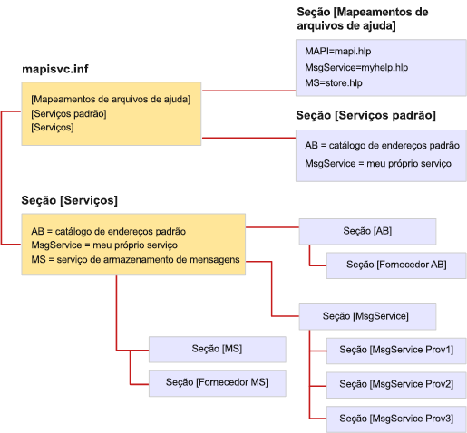

# Formato de arquivo de MapiSvc.infFile format of MapiSvc.inf

**Aplica-se a**: Outlook 2013 | Outlook 2016**Applies to**: Outlook 2013 | Outlook 2016 
  
O arquivo MapiSvc.inf atua como o banco de dados central para informações de configuração do serviço de mensagem do MAPI.The MapiSvc.inf file acts as the central database for MAPI message service configuration information. MapiSvc.inf contém informações sobre cada um dos serviços de mensagem instalados na estação de trabalho, informações sobre os provedores de serviços que pertencem a cada serviço de mensagens e informações sobre o subsistema do MAPI.MapiSvc.inf contains information about each of the message services installed on the workstation, information about the service providers that belong to each message service, and information about the MAPI subsystem. MapiSvc.inf é a principal fonte de informações para perfis.MapiSvc.inf is the primary source of information for profiles. Ou seja, quando um novo perfil está sendo criado ou um existente é modificado, informações relevantes para cada serviço de mensagem ou provedor de serviços são copiadas do MapiSvc.inf.That is, when a new profile is being built or an existing one modified, relevant information for each message service or service provider is copied from MapiSvc.inf. 
  
MapiSvc.inf é dividido em seções hierárquicas vinculadas:MapiSvc.inf is divided into linked hierarchical sections:
  
1. Seção contendo informações que se aplicam a todos os perfis.Section containing information that applies to all profiles. Esta seção tem três partes:This section has three parts:
    
   - A seção **[Services]** fornece links para cada uma das seções subsequentes do serviço de mensagens.**[Services]** section, providing links to each of the subsequent message service sections. 
    
   - A seção **[Help File Mappings]** contém informações sobre arquivos .HLP fornecidos pelos serviços de mensagens.**[Help File Mappings]** section, containing information about .HLP files provided by message services. 
    
   - A seção **[Default Services]** lista os serviços de mensagens que compõem uma instalação padrão.**[Default Services]** section, listing message services that make up a default installation. 
    
2. Seção contendo informações que se aplicam a serviços de mensagens individuais.Section containing information that applies to individual message services. As entradas nessas seções fornecem links para seções subsequentes de provedores de serviços.Entries in these sections provide links to subsequent service provider sections.
    
3. Seção contendo informações que se aplicam a provedores de serviços individuais em um serviço de mensagens.Section containing information that applies to individual service providers in a message service.
    
A ilustração a seguir mostra a organização de um arquivo MapiSvc.inf comum.The following illustration shows the organization of a typical MapiSvc.inf file. Há três serviços de mensagens: AB, MsgService e MS.There are three message services: AB, MsgService, and MS. O nome no lado direito do sinal de igual para cada serviço de mensagem é o nome de exibição do serviço.The name on the right hand side of the equal sign for each message service is the service's display name. Cada serviço de mensagens tem sua própria seção em outro local no arquivo e está vinculada a uma ou mais seções do provedor de serviços.Each message service has its own section elsewhere in the file that is linked to one or more service provider sections. Há uma seção de provedor de serviços para cada provedor de serviços que pertence ao serviço de mensagens.There is one service provider section for every service provider that belongs to the message service. Os serviços de mensagens AB e MS são serviços de provedores únicos, enquanto três provedores de serviços pertencem ao serviço MsgService.The AB and MS message services are single provider services whereas three service providers belong to the MsgService service.
  
**MapiSvc.inf file organization****MapiSvc.inf file organization**
  

  
O MAPI fornece uma versão esquelética do arquivo MapiSvc.inf que contém as entradas para o subsistema do MAPI.MAPI provides a skeletal version of the MapiSvc.inf file that contains the entries for the MAPI subsystem. Cada implementador de serviços de mensagens adiciona entradas que são apropriadas para seu serviço e para os provedores de serviços que pertencem ao seu serviço.Each message service implementer adds entries that are appropriate both for their service and the service providers that belong to their service. Algumas entradas são necessárias, outras são opcionais.Some of the entries are required while others are optional. Por exemplo, o MAPI exige que você especifique o nome e o caminho de cada um dos provedores de serviço em seu serviço de mensagem.For example, MAPI requires that you specify the name and path of each of the service providers in your message service. Sem essas informações, eles não poderão ser carregados.Without this information, they cannot be loaded.
  
Você pode adicionar informações obrigatórias e opcionais à seção do serviço de mensagens e/ou às seções do provedor de serviços.You can add required and optional information in either the section for your message service and/or to the service provider sections. O local onde você coloca as informações que descrevem seu serviço de mensagens depende do número de provedores de serviços no serviço.Where you put the information describing your message service depends on the number of service providers in the service. Como essas informações se aplicam a cada provedor de serviços no serviço, você deve torná-las acessíveis a todos os provedores.Because this information applies to each service provider in the service, you must make it accessible to all providers. Armazene-as na seção do serviço de mensagens, na opção preferida ou em todas as seções do provedor de serviços.Store it either in the message service section, the preferred option, or in all of the service provider sections. Armazene informações apenas uma vez para evitar a replicação desnecessária e a necessidade de manter várias cópias sincronizadas.Store information once to avoid unnecessary replication and the need to keep multiple copies synchronized.
  
Se o serviço de mensagens for um único provedor, armazene todas as informações do serviço de mensagens na seção do provedor de serviços, e não na seção do serviço.If your message service is a single provider service, store all of the message service information in the section for the service provider rather than in the section for the service. Acessar a seção do provedor de serviços é mais rápido e mais direto do que acessar a seção do serviço de mensagens.Accessing the service provider section is faster and more direct than accessing the message service section. 
  
Armazene somente dados públicos de configuração no arquivo MapiSvc.inf.Store only public configuration data in the MapiSvc.inf file. As informações privadas ou que exigem proteção extra, como senhas ou outras credenciais, não devem ser incluídas nesse arquivo.Information that is private or requires extra protection, such as passwords or other credentials, should not be included in this file. Em vez disso, opte por não armazenar informações desse tipo ou mantê-las no perfil como propriedades seguras.Instead, opt either not to store information of this type at all or keep it in the profile as secure properties. As propriedades seguras possuem recursos de proteção integrados, como criptografia.Secure properties have built-in protection features such as encryption.
  

