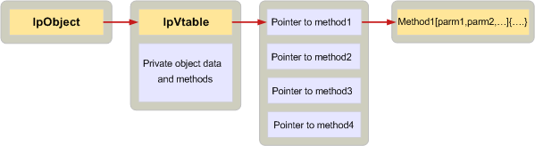

# <a name="implementing-objects-in-c"></a><span data-ttu-id="49b5d-103">Implementando objetos em C</span><span class="sxs-lookup"><span data-stu-id="49b5d-103">Implementing objects in C</span></span>

<span data-ttu-id="49b5d-104">**Aplica-se a**: Outlook</span><span class="sxs-lookup"><span data-stu-id="49b5d-104">**Applies to**: Outlook</span></span> 
  
<span data-ttu-id="49b5d-105">Aplicativos cliente e provedores de serviços escritas em C definem os objetos MAPI criando uma estrutura de dados e uma matriz de ponteiros de função ordenada conhecido como uma tabela de função virtual, ou vtable.</span><span class="sxs-lookup"><span data-stu-id="49b5d-105">Client applications and service providers written in C define MAPI objects by creating a data structure and an array of ordered function pointers known as a virtual function table, or vtable.</span></span> <span data-ttu-id="49b5d-106">Um ponteiro para o vtable deve ser o primeiro membro da estrutura de dados.</span><span class="sxs-lookup"><span data-stu-id="49b5d-106">A pointer to the vtable must be the first member of the data structure.</span></span>
  
<span data-ttu-id="49b5d-107">O vtable em si, não há um ponteiro para cada método em cada interface suportado pelo objeto.</span><span class="sxs-lookup"><span data-stu-id="49b5d-107">In the vtable itself, there is one pointer for every method in each interface supported by the object.</span></span> <span data-ttu-id="49b5d-108">A ordem dos ponteiros deve seguir a ordem dos métodos na interface especificação publicado no arquivo de cabeçalho Mapidefs.h.</span><span class="sxs-lookup"><span data-stu-id="49b5d-108">The order of the pointers must follow the order of the methods in the interface specification published in the Mapidefs.h header file.</span></span> <span data-ttu-id="49b5d-109">Cada ponteiro de função no vtable é definido como o endereço da implementação do método.</span><span class="sxs-lookup"><span data-stu-id="49b5d-109">Each function pointer in the vtable is set to the address of the actual implementation of the method.</span></span> <span data-ttu-id="49b5d-110">No C++, o compilador automaticamente configura o vtable.</span><span class="sxs-lookup"><span data-stu-id="49b5d-110">In C++, the compiler automatically sets up the vtable.</span></span> <span data-ttu-id="49b5d-111">Na opção C, ele não faz.</span><span class="sxs-lookup"><span data-stu-id="49b5d-111">In C, it does not.</span></span> 
  
<span data-ttu-id="49b5d-112">A ilustração a seguir mostra como isso funciona.</span><span class="sxs-lookup"><span data-stu-id="49b5d-112">The following illustration shows how this works.</span></span> <span data-ttu-id="49b5d-113">A caixa na extrema esquerda representa um cliente que precisa usar um objeto de provedor de serviço.</span><span class="sxs-lookup"><span data-stu-id="49b5d-113">The box on the far left represents a client that needs to use a service provider object.</span></span> <span data-ttu-id="49b5d-114">Através da sessão, o cliente obtém um ponteiro para o objeto, **lpObject**.</span><span class="sxs-lookup"><span data-stu-id="49b5d-114">Through the session, the client obtains a pointer to the object, **lpObject**.</span></span> <span data-ttu-id="49b5d-115">O vtable aparece primeiro no objeto seguido por métodos e dados particulares.</span><span class="sxs-lookup"><span data-stu-id="49b5d-115">The vtable appears first in the object followed by private data and methods.</span></span> <span data-ttu-id="49b5d-116">O ponteiro vtable aponta para o vtable real, que contém ponteiros para cada uma das implementações dos métodos na interface do.</span><span class="sxs-lookup"><span data-stu-id="49b5d-116">The vtable pointer points to the actual vtable, which contains pointers to each of the implementations of the methods in the interface.</span></span> 
  
<span data-ttu-id="49b5d-117">**Object implementation**</span><span class="sxs-lookup"><span data-stu-id="49b5d-117">**Object implementation**</span></span>
  
<span data-ttu-id="49b5d-118">![Implementação de objeto] (media/amapi_42.gif "Implementação de objeto")</span><span class="sxs-lookup"><span data-stu-id="49b5d-118"></span></span>
  
<span data-ttu-id="49b5d-119">O exemplo de código a seguir mostra como um provedor de serviços de C pode definir um objeto simples de status.</span><span class="sxs-lookup"><span data-stu-id="49b5d-119">The following code example shows how a C service provider can define a simple status object.</span></span> <span data-ttu-id="49b5d-120">O primeiro membro for o ponteiro vtable; o restante do objeto é composto de membros de dados.</span><span class="sxs-lookup"><span data-stu-id="49b5d-120">The first member is the vtable pointer; the rest of the object is made up of data members.</span></span> 
  
```C
typedef struct _MYSTATUSOBJECT
{
    const STATUS_Vtbl FAR *lpVtbl;
    ULONG              cRef;
    ANOTHEROBJ        *pObj;
    LPMAPIPROP         lpProp;
    LPFREEBUFFER       lpFreeBuf;
} MYSTATUSOBJECT, *LPMYSTATUSOBJ;
 
```

<span data-ttu-id="49b5d-121">Como este objeto é um objeto de status, o vtable inclui ponteiros para implementações de cada um dos métodos no [IMAPIStatus: IMAPIProp](imapistatusimapiprop.md) interface, bem como ponteiros para implementações de cada um dos métodos nas interfaces base — **IUnknown **e **IMAPIProp**.</span><span class="sxs-lookup"><span data-stu-id="49b5d-121">Because this object is a status object, the vtable includes pointers to implementations of each of the methods in the [IMAPIStatus : IMAPIProp](imapistatusimapiprop.md) interface, as well as pointers to implementations of each of the methods in the base interfaces — **IUnknown** and **IMAPIProp**.</span></span> <span data-ttu-id="49b5d-122">A ordem dos métodos no vtable corresponde a ordem especificada como definido no arquivo de cabeçalho Mapidefs.h.</span><span class="sxs-lookup"><span data-stu-id="49b5d-122">The order of methods in the vtable matches the specified order as defined in the Mapidefs.h header file.</span></span>
  
```js
static const MYOBJECT_Vtbl vtblSTATUS =
{
    STATUS_QueryInterface,
    STATUS_AddRef,
    STATUS_Release,
    STATUS_GetLastError,
    STATUS_SaveChanges,
    STATUS_GetProps,
    STATUS_GetPropList,
    STATUS_OpenProperty,
    STATUS_SetProps,
    STATUS_DeleteProps,
    STATUS_CopyTo,
    STATUS_CopyProps,
    STATUS_GetNamesFromIDs,
    STATUS_GetIDsFromNames,
    STATUS_ValidateState,
    STATUS_SettingsDialog,
    STATUS_ChangePassword,
    STATUS_FlushQueues
};
 
```

<span data-ttu-id="49b5d-123">Clientes e provedores de serviços escritas em C usam objetos indiretamente por meio do vtable e adicione um ponteiro de objeto como o primeiro parâmetro em cada chamada.</span><span class="sxs-lookup"><span data-stu-id="49b5d-123">Clients and service providers written in C use objects indirectly through the vtable and add an object pointer as the first parameter in every call.</span></span> <span data-ttu-id="49b5d-124">Cada chamada para um método de interface MAPI requer um ponteiro para o objeto sendo chamado como seu primeiro parâmetro.</span><span class="sxs-lookup"><span data-stu-id="49b5d-124">Every call to a MAPI interface method requires a pointer to the object being called as its first parameter.</span></span> <span data-ttu-id="49b5d-125">C++ define um ponteiro especial conhecido como o ponteiro **this** para essa finalidade.</span><span class="sxs-lookup"><span data-stu-id="49b5d-125">C++ defines a special pointer known as the **this** pointer for this purpose.</span></span> <span data-ttu-id="49b5d-126">O compilador C++ adiciona implicitamente o ponteiro **this** como o primeiro parâmetro para cada chamada de método.</span><span class="sxs-lookup"><span data-stu-id="49b5d-126">The C++ compiler implicitly adds the **this** pointer as the first parameter to every method call.</span></span> <span data-ttu-id="49b5d-127">No C não há nenhuma dessas ponteiro; ela deve ser explicitamente adicionada.</span><span class="sxs-lookup"><span data-stu-id="49b5d-127">In C there is no such pointer; it must be explicitly added.</span></span> 
  
<span data-ttu-id="49b5d-128">O código a seguir demonstra como um cliente pode fazer uma chamada para uma instância do MYSTATUSOBJECT:</span><span class="sxs-lookup"><span data-stu-id="49b5d-128">The following code demonstrates how a client can make a call to an instance of MYSTATUSOBJECT:</span></span>
  
```C
lpMyObj->lpVtbl->ValidateState(lpMyObj, ulUIParam, ulFlags);
 
```

## <a name="see-also"></a><span data-ttu-id="49b5d-129">Confira também</span><span class="sxs-lookup"><span data-stu-id="49b5d-129">See also</span></span>

- [<span data-ttu-id="49b5d-130">Implementar objetos MAPI</span><span class="sxs-lookup"><span data-stu-id="49b5d-130">Implementing MAPI Objects</span></span>](implementing-mapi-objects.md)

