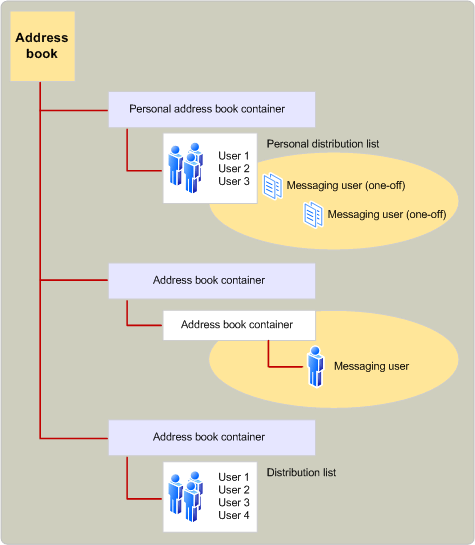

# Visão geral do provedor de agenda de endereços MAPIMAPI address book provider overview
  
**Aplica-se a**: Outlook 2013 | Outlook 2016**Applies to**: Outlook 2013 | Outlook 2016 
  
Os provedores de agendas lidam com o acesso às informações do diretório.Address book providers handle access to directory information. As informações de diretório consistem em dados para dois tipos de destinatários de mensagens: usuários de mensagens individuais e grupos de usuários de mensagens que normalmente são abordados juntos em listas de distribuição.Directory information consists of data for two types of message recipients: individual messaging users and groups of messaging users who are commonly addressed together in distribution lists. Dependendo do tipo de destinatário e do provedor do livro de endereços, há uma ampla variedade de informações que podem ser disponibilizadas.Depending on the type of recipient and the address book provider, there is a wide range of information that can be made available. Por exemplo, todos os provedores de agendas armazenam o nome, o endereço e o tipo de endereço de um destinatário.For example, all address book providers store a recipient's name, address, and address type.
  
Cada provedor de agendas organiza esses dados usando um ou mais contêineres.Each address book provider organizes this data by using one or more containers. O número e a estrutura dos contêineres dependem da implementação do provedor de agendas.The number and structure of the containers depends on the address book provider's implementation. Por exemplo, um provedor de livro de endereços pode usar um único contêiner para reter todas as informações, outro pode usar um contêiner de nível superior que contém subcontentores e um terceiro pode usar vários contêineres de nível superior, cada um mantendo subcontainers.For example, one address book provider might use a single container to hold all of the information, another might use one top-level container that holds subcontainers, and a third might use several top-level containers, each holding subcontainers. Uma hierarquia de contêineres de um livro de endereços pode ser muito profunda; não há limite para o número de subcontainers que podem ser usados.An address book container hierarchy can be quite deep; there is no limit to the number of subcontainers that can be used.
  
A ilustração a seguir mostra uma organização típica do livro de endereços MAPI.The following illustration shows a typical MAPI address book organization.
  
**Address book organization****Address book organization**
  

  
MAPI integrates all the information supplied by the installed address book providers into a single address book, presenting a unified view to the client application.MAPI integrates all the information supplied by the installed address book providers into a single address book, presenting a unified view to the client application. A lista integrada mostra os contêineres de nível superior exibidos por cada um dos provedores de agendas instalados.The integrated list shows the top-level containers displayed by each of the installed address book providers. A maioria dos provedores de livro de endereços expõe apenas alguns contêineres (normalmente um a três) no nível superior para inclusão no nível superior do livro de endereços integrado MAPI.Most address book providers expose only a few containers (typically one to three) at the top level for inclusion in the top level of the MAPI integrated address book. Por exemplo, um provedor de agendas pode disponibilizar "Todos os Usuários" e "Usuários Locais" como dois contêineres no nível superior.For example, an address book provider might make available "All Users" and "Local Users" as two containers at the top level.
  
Os usuários de aplicativos cliente podem exibir o conteúdo dos contêineres do livro de endereços e, em alguns casos, modificar o conteúdo.The users of client applications can view the contents of address book containers and, in some cases, modify the contents. Os contêineres de agenda podem ser criados com níveis de acesso diferentes, dependendo do provedor de agendas.Address book containers can be created with different access levels, depending on the address book provider. 
  
## Confira tambémSee also

- [Recursos e arquitetura MAPIMAPI Features and Architecture](mapi-features-and-architecture.md)

