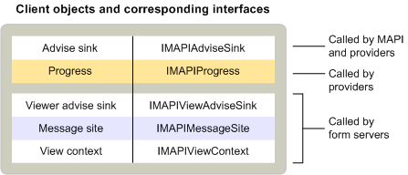

# Objetos de cliente MAPIMAPI client objects
  
**Aplica-se a**: Outlook 2013 | Outlook 2016**Applies to**: Outlook 2013 | Outlook 2016 
  
Aplicativos cliente de mensagens padrão implementam apenas um objeto — um evento de aconselhá-los.Standard messaging client applications implement only one object — an advise sink. Os sinks de aviso herdam da interface [IMAPIAdviseSink : IUnknown](imapiadvisesinkiunknown.md) e são usados por MAPI e provedores de serviços para notificação de eventos.Advise sinks inherit from the [IMAPIAdviseSink : IUnknown](imapiadvisesinkiunknown.md) interface and are used by MAPI and service providers for event notification. Alguns clientes também implementam objetos de progresso para dar suporte à exibição de caixas de diálogo de progresso.Some clients also implement progress objects to support the display of progress dialog boxes. 
  
Clientes mais complexos que suportam formulários personalizados implementam outro objeto sink de consultoria e alguns outros objetos, como o objeto de site de mensagem que herda da interface [IMAPIMessageSite : IUnknown](imapimessagesiteiunknown.md) e o objeto de contexto de exibição que herda do [IMAPIViewContext : interface IUnknown.](imapiviewcontextiunknown.md)More complex clients that support custom forms implement another advise sink object and a few other objects, such as the message site object that inherits from the [IMAPIMessageSite : IUnknown](imapimessagesiteiunknown.md) interface and the view context object that inherits from the [IMAPIViewContext : IUnknown](imapiviewcontextiunknown.md) interface. O objeto sink de atribuição adicional herda da [interface IMAPIViewAdviseSink : IUnknown.](imapiviewadvisesinkiunknown.md)The additional advise sink object inherits from the [IMAPIViewAdviseSink : IUnknown](imapiviewadvisesinkiunknown.md) interface. 
  
A tabela a seguir resume os objetos MAPI implementados por clientes de mensagens padrão e por clientes que suportam a exibição de formulários personalizados.The following table summarizes the MAPI objects implemented by standard messaging clients and by clients that support the viewing of custom forms.
  
|**Objeto Client****Client object**|**Descrição****Description**|
|:-----|:-----|
|Aconselhá-oAdvise sink    |Fornece uma função de retorno de chamada para eventos que ocorrem no armazenamento de mensagens, no address book ou na sessão.Provides a callback function for events that occur in the message store, address book, or the session.    |
|Site de mensagensMessage site    |Manipula a manipulação de objetos de formulário.Handles the manipulation of form objects.    |
|ProgressProgress    |Exibe uma caixa de diálogo para mostrar o progresso de uma operação.Displays a dialog box to show the progress of an operation.    |
|View advise sinkView advise sink    |Fornece funções de retorno de chamada para eventos que ocorrem em um formulário.Provides callback functions for events that occur in a form.    |
|Exibir contextoView context    |Oferece suporte a comandos para imprimir e salvar formulários e para navegar entre formulários.Supports commands for printing and saving forms and for navigating between forms.    |
   
A ilustração a seguir mostra a relação entre esses diferentes objetos de cliente, as interfaces das quais eles herdam e os componentes MAPI que os utilizam.The following illustration shows the relationship between these different client objects, the interfaces from which they inherit, and the MAPI components that use them. 
  

  
Os clientes usam muito mais objetos do que implementam.Clients use many more objects than they implement. Todos os clientes usam um objeto session para obter acesso a uma ampla variedade de objetos e objetos do provedor de serviços que o MAPI implementa.All clients use a session object to gain access to a wide variety of service provider objects and objects that MAPI implements. Os clientes interagem com provedores de serviços indiretamente, por meio da sessão, do livro de endereços ou dos objetos de status que o MAPI fornece, ou diretamente por meio de uma variedade de objetos implementados por determinados provedores de serviços.Clients interact with service providers either indirectly, through the session, the address book, or the status objects that MAPI supplies, or directly through a variety of objects that particular service providers implement. Para fazer contato direto com provedores de listas de endereços, os clientes usam contêineres de listas de endereços, usuários de mensagens e listas de distribuição.To make direct contact with address book providers, clients use address book containers, messaging users, and distribution lists. Para acessar um provedor de armazenamento de mensagens diretamente, os clientes usam o objeto, pastas, mensagens e anexos do armazenamento de mensagens.To access a message store provider directly, clients use the message store object, folders, messages, and attachments. Quando os provedores de serviços suportam um objeto de status, os clientes podem usar o objeto de status para monitorar o estado do provedor de serviços.When service providers support a status object, clients can use the status object to monitor the service provider's state.
  
Os clientes que suportam a configuração do provedor de serviços e do serviço de mensagens usam três objetos que o MAPI implementa: o objeto de administração do serviço de mensagens, o objeto de administração de perfil e o objeto de administração do provedor.Clients that support service provider and message service configuration use three objects that MAPI implements: the message service administration object, profile administration object, and provider administration object. Os clientes que exibem formulários personalizados usam vários objetos de formulário implementados por um provedor de biblioteca de formulários ou por um servidor de formulários.Clients that display custom forms use several form objects that a form library provider or a form server implements.
  
## Confira tambémSee also

- [IMAPIMessageSite : IUnknownIMAPIMessageSite : IUnknown](imapimessagesiteiunknown.md) 
- [IMAPIViewContext : IUnknownIMAPIViewContext : IUnknown](imapiviewcontextiunknown.md)  
- [IMAPIViewAdviseSink : IUnknownIMAPIViewAdviseSink : IUnknown](imapiviewadvisesinkiunknown.md)
- [Visão geral de objetos e interface MAPIMAPI Object and Interface Overview](mapi-object-and-interface-overview.md)

