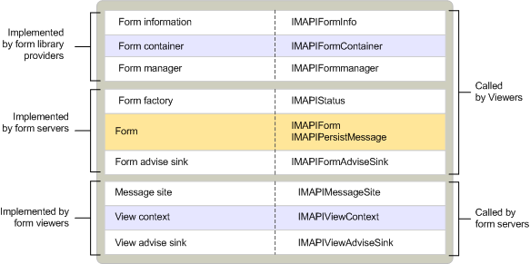

# Objetos de formulário personalizados MAPIMAPI custom form objects
  
**Aplica-se a**: Outlook 2013 | Outlook 2016**Applies to**: Outlook 2013 | Outlook 2016 
  
Os objetos de formulários personalizados são implementados por três componentes diferentes:Objects for custom forms are implemented by three different components:
  
- Um servidor de formulários.A form server.
    
- Um provedor de biblioteca de formulários.A form library provider.
    
- Um visualizador de formulários.A form viewer.
    
Um servidor de formulário é semelhante em funcionalidade a um aplicativo de objeto de documento composto OLE.A form server is similar in functionality to an OLE compound document object application. É um componente executável que implementa o formulário; Ele controla sua exibição e as operações que um usuário pode executar.It is an executable component that implements the form; it controls its display and the operations that a user can perform. MAPI inicia um servidor de formulário quando um usuário deseja exibir uma mensagem junto com uma classe de mensagem exibida usando um formulário suportado pelo servidor de formulário.MAPI starts a form server upon request when a user wants to view a message together with a message class that is displayed by using a form supported by the form server. Os servidores de formulário implementam três objetos: um objeto de fábrica de formulários que se assemelha à fábrica de classe OLE padrão, um coletor de aviso de formulário para lidar com eventos específicos do formulário e o próprio formulário.Form servers implement three objects: a form factory object that resembles the standard OLE class factory, a form advise sink for handling form-specific events, and the form itself. 
  
Um provedor de biblioteca de formulários fornece acesso para clientes para o conjunto de propriedades de um formulário, para seu contêiner e para o objeto que vincula mensagens de uma classe específica ao servidor que pode abrir o formulário para essa classe.A form library provider supplies access for clients to a form's property set, to its container, and to the object that links messages of a specific class to the server that can open the form for that class. Os provedores de biblioteca de formulários implementam três objetos: um objeto de informações de formulário, um contêiner de formulários e um gerente de formulário para vincular uma mensagem ao servidor de formulário apropriado com base na classe da mensagem.Form library providers implement three objects: a form information object, a form container, and a form manager for binding a message to the appropriate form server based on the message's class.
  
Um visualizador de formulários é um componente incluído em clientes que dão suporte à exibição de formulários personalizados em seus visualizadores de pastas.A form viewer is a component that is included in clients that support the display of custom forms in their folder viewers. Os visualizadores de formulários não são componentes MAPI independentes, como os provedores de biblioteca de formulários e os servidores de formulário.Form viewers are not independent MAPI components, as are form library providers and form servers. Os visualizadores de formulários iniciam os servidores de formulário e fornecem contexto para eles.Form viewers start form servers and provide context for them. Os visualizadores de formulários implementam três objetos: um site de mensagens, um contexto de exibição e um coletor de aviso para lidar com eventos específicos de exibição.Form viewers implement three objects: a message site, a view context, and an advise sink for handling view-specific events.
  
A tabela a seguir descreve todos os objetos de formulário personalizados.The following table describes all of the custom form objects. 
  
|**Objeto Form****Form object**|**Descrição****Description**|
|:-----|:-----|
|FormulárioForm    |Controla a exibição e a operação de um formulário personalizado para exibir mensagens de uma classe específica.Controls the display and operation of a custom form for viewing messages of a specific class.    |
|Coletor de aviso de formulárioForm advise sink    |Lida com notificações do Visualizador de formulários.Handles notifications from the form viewer.    |
|Fábrica de formuláriosForm factory    |Cria uma instância de um formulário e permite que o servidor permaneça na memória.Creates an instance of a form and allows its server to remain in memory.    |
|Contêiner de formuláriosForm container    |Contém informações de formulário.Contains form information.    |
|Informações do formulárioForm information    |Contém mensagens e outros contêineres de mensagem.Contains messages and other message containers.    |
|Gerente de formulárioForm manager    |Fornece acesso a uma visão integrada de informações de formulários personalizados relacionadas a todos os formulários instalados.Provides access to an integrated view of custom form information that is related to all of the installed forms. Também corresponde a classes de mensagem com identificadores de classe de formulário correspondentes.Also matches message classes with corresponding form class identifiers.    |
|Site de mensagensMessage site    |Manipula a manipulação de objetos Form de dentro do cliente e fornece acesso a um objeto Gerenciador de formulários.Handles the manipulation of form objects from inside the client, and provides access to a form manager object.    |
|Contexto de exibiçãoView context    |Dá suporte a comandos de formulário para a ativação de mensagens próximas e anteriores e para salvar ou imprimir.Supports form commands for activating next and previous messages and for saving or printing.    |
|Exibir coletor de avisosView advise sink    |Lida com notificações do servidor de formulários.Handles notifications from the form server.    |
   
A ilustração a seguir mostra a relação entre os componentes de formulário personalizados, os objetos e as interfaces que eles implementam e os componentes que são usuários dos objetos.The following illustration shows the relationship between custom form components, the objects and interfaces that they implement, and the components that are users of the objects. Observe que, diferentemente da maioria dos outros objetos MAPI, o objeto Form implementa duas interfaces que não estão relacionadas pela herança direta.Notice that, unlike most other MAPI objects, the form object implements two interfaces that are not related by direct inheritance. Quando um objeto expõe várias interfaces independentes, um usuário do objeto que tem um ponteiro para uma das interfaces pode recuperar um ponteiro para qualquer uma das outras interfaces.When an object exposes multiple independent interfaces, a user of the object that has a pointer to one of the interfaces can retrieve a pointer to any of the other interfaces. Essa capacidade de navegar entre implementações de interface de um objeto é um recurso do método [IUnknown:: QueryInterface](https://msdn.microsoft.com/library/54d5ff80-18db-43f2-b636-f93ac053146d%28Office.15%29.aspx) .This ability to navigate between an object's interface implementations is a feature of the [IUnknown::QueryInterface](https://msdn.microsoft.com/library/54d5ff80-18db-43f2-b636-f93ac053146d%28Office.15%29.aspx) method. 
  
**Custom form components****Custom form components**
  
![Componentes de formulário personalizados] (media/amapi_67.gif "Componentes de formulário personalizados")
  
## Confira tambémSee also

- [Visão geral de interface e objeto MAPIMAPI Object and Interface Overview](mapi-object-and-interface-overview.md)

