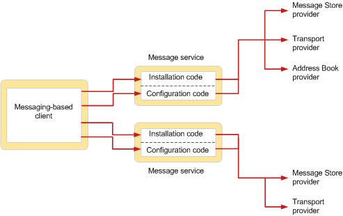

# Visão geral do serviço de mensagem MAPIMAPI message service overview
  
**Aplica-se a**: Outlook**Applies to**: Outlook 
  
Um serviço de mensagem define um grupo de provedores de serviço relacionado, normalmente os provedores de serviços que funcionam com o mesmo sistema de mensagens.A message service defines a group of related service providers, typically service providers that work with the same messaging system. Enquanto os provedores de serviços de executam o trabalho de comunicação entre sistemas de mensagens e o subsistema MAPI, serviços de mensagem realizar o trabalho de interface entre o usuário e os provedores de serviços que funcionam com um sistema de mensagens comuns.Whereas service providers perform the work of communicating between messaging systems and the MAPI subsystem, message services perform the work of interfacing between the user and service providers that work with a common messaging system.  
  
Serviços de mensagens existem para facilitar a instalação e configuração dos provedores de serviços para os usuários.Message services exist to make the installation and configuration of service providers easier for users. Usuários nunca diretamente instalar ou configurar um provedor de serviços; o serviço de mensagem completamente trata a instalação e configuração de cada um dos provedores de serviços que pertencem ao serviço.Users never directly install or configure a service provider; the message service completely handles the installation and configuration of each of the service providers that belong to the service. Devido a esse recurso, os usuários não precisará estar familiarizado com os requisitos de configuração de provedor de serviço específico.Because of this feature, users do not need to be familiar with specific service provider configuration requirements. 
  
A figura a seguir mostra a relação entre dois serviços de mensagem e de um aplicativo cliente baseado em mensagens.The following figure shows the relationship between a messaging-based client application and two message services.
  
**Message service installation and configuration****Message service installation and configuration**
  
![Configuração e instalação do serviço de mensagem] (media/amapi_44.gif "Configuração e instalação do serviço de mensagem")
  
O usuário chama o código de instalação de cada serviço de mensagem para adicionar o serviço e seus provedores de serviço a um perfil.The user invokes the installation code of each message service to add the service and its service providers to a profile. Em um dos serviços de mensagem mostrados na figura, há três provedores de serviços; o outro serviço de mensagem, há dois provedores de serviço.In one of the message services shown in the figure, there are three service providers; in the other message service, there are two service providers. Em algum momento posterior após a instalação for concluída, geralmente no momento do logon, os provedores de serviços em cada serviço de mensagem são configurados.At some later time after installation is complete, typically at logon time, the service providers in each message service are configured. O código de configuração de cada serviço de mensagem lida com a configuração dos provedores no serviço.The configuration code in each message service handles the configuration of the providers in the service.
  
Quando um serviço de mensagem é instalado, o seu programa de instalação copia os arquivos necessários da origem de instalação no disco local do usuário e atualiza um arquivo de configuração, Mapisvc.When a message service is installed, its installation program copies necessary files from the installation source to the user's local disk and updates a configuration file, Mapisvc.inf. O arquivo Mapisvc contém definições de configuração para todos os serviços de mensagens e provedores de serviços que podem ser instalados no computador.The Mapisvc.inf file contains configuration settings for all of the message services and service providers that can be installed on the computer. Ele é organizado nas seções hierárquicas, com links entre cada seção em cada nível.It is organized in hierarchical sections, with links between each section at each level. Seção de nível superior contém informações relevantes para o subsistema MAPI, como uma lista de todos os serviços de mensagens disponível e para a instalação da Ajuda online.The section at the top level contains information that is relevant for the MAPI subsystem, such as a list of all available message services, and for the online Help installation. O próximo nível tem seções para cada serviço de mensagem, com informações como o nome do arquivo DLL do serviço de mensagem e o nome da sua função de ponto de entrada de configuração.The next level has sections for each message service, with information such as the DLL file name of the message service and the name of its configuration entry point function. O terceiro nível tem seções com dados de configuração para cada provedor de serviço no serviço de mensagem.The third level has sections with configuration data for each service provider in the message service. 
  
Para lidar com a configuração, um serviço de mensagem implementa uma função de ponto de entrada que seja compatível com um protótipo definido por MAPI e uma caixa de diálogo tabulada conhecido como uma folha de propriedades.To handle configuration, a message service implements an entry point function that complies with a prototype defined by MAPI, and a tabbed dialog box known as a property sheet. MAPI chama a função do ponto de entrada para solicitações de cliente de serviço relacionados ao gerenciamento de perfil e o gerenciamento dos provedores de serviço no serviço de mensagem.MAPI calls the entry point function to service client requests that relate to profile management and the management of service providers in the message service. Folhas de propriedade são usadas para exibir e alterar propriedades de configuração de provedor de serviço e de serviço de mensagem.Property sheets are used for viewing and changing message service and service provider configuration properties. 
  
## Confira tambémSee also

- [Arquitetura e os recursos MAPIMAPI Features and Architecture](mapi-features-and-architecture.md)

