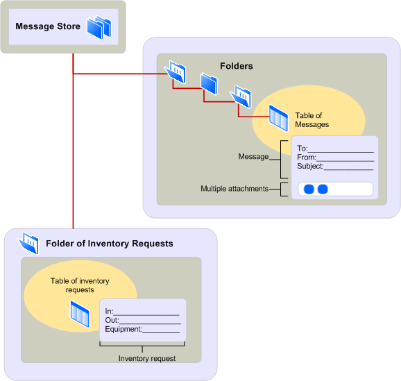

# Visão geral do provedor de armazenamento de mensagem MAPIMAPI message store provider overview
  
**Aplica-se a**: Outlook 2013 | Outlook 2016**Applies to**: Outlook 2013 | Outlook 2016 
  
Provedores de armazenamento de mensagem lidar com o armazenamento e a recuperação de mensagens e outras informações para os usuários de aplicativos do cliente.Message store providers handle the storage and retrieval of messages and other information for the users of client applications. As informações da mensagem são organizadas por meio de um sistema hierárquico conhecido como um armazenamento de mensagens.The message information is organized by using a hierarchical system known as a message store. O armazenamento de mensagens é implementado em vários níveis, com chamadas pastas que contêm mensagens de diferentes tipos de contêineres.The message store is implemented in multiple levels, with containers called folders holding messages of different types. Não há nenhum limite no número de níveis em um armazenamento de mensagem. pastas podem conter muitas subpastas.There is no limit to the number of levels in a message store; folders can contain many subfolders. 
  
A ilustração a seguir mostra a arquitetura de armazenamento de mensagem hierárquico.The following illustration shows the hierarchical message store architecture.
  
**Message store architecture****Message store architecture**
  
![Arquitetura de armazenamento de mensagens] (media/amapi_03.gif "Arquitetura de armazenamento de mensagens")
  
A figura mostra duas pastas, um com uma subpasta.The figure shows two folders, one with a subfolder. Os usuários do aplicativo cliente podem acessar um modo de exibição de resumo das mensagens contidos em cada pasta ou visualizá-las individualmente com um formulário.Client application users can access a summary view of the messages contained in each folder or view them individually with a form. Se o cliente exibe um formulário personalizado que fornece um desenvolvedor de formulário ou um formulário padrão que fornece MAPI depende do tipo ou classe da mensagem.Whether the client displays a standard form that MAPI supplies or a custom form that a form developer supplies depends on the type, or class, of the message. A primeira pasta contém mensagens de nota e usa o formulário de anotação padrão de MAPI.The first folder contains note messages and uses the MAPI standard note form. A segunda pasta contém mensagens de solicitação de inventário e usa um formulário personalizado do estoque.The second folder contains inventory request messages and uses a custom inventory form. As informações em ambos os formulários representam as propriedades da mensagem.The information on both forms represents the properties of the message.
  
Você pode usar os dados do repositório de mensagens de várias maneiras.You can use message store data in a variety of ways. Além de usar os dados para email tradicional, você pode usar pastas como um fórum de discussão pública, como um repositório para documentos de referência, ou como um contêiner para caixa postal, calendário, contatos ou tarefas, por exemplo.In addition to using data for traditional electronic mail, you can use folders as a forum for public discussion, as a repository for reference documents, or as a container for voice mail, calendar, contacts, or tasks, for example. Um repositório de mensagem única pode conter vários tipos de informações.A single message store can hold many types of information. Vários clientes podem instalar o mesmo armazenamento de mensagens.Multiple clients can install the same message store. Isso faz com que o compartilhamento de dados de forma fácil e rápida.This makes the sharing of data easy and fast. 
  
Pastas do repositório de mensagens permitem que você deve classificar e filtrar mensagens e personalize a exibição de mensagem em uma interface de usuário.Message store folders enable you to sort and filter messages and to customize the message display in a user interface. Links para mensagens filtradas são mantidos nas pastas especiais chamadas de pastas de resultados de pesquisa.Links to filtered messages are held in special folders called search-results folders. O usuário de um aplicativo cliente insere os critérios de filtragem, que MAPI se refere a como uma restrição, e os critérios é aplicado às mensagens armazenadas em pastas de um ou mais.The user of a client application enters filtering criteria, which MAPI refers to as a restriction, and the criteria is applied to the messages stored in one or more folders. Por exemplo, um usuário talvez queira exibir somente as mensagens que lidam com um assunto específico e com datas de chegada que são mais recentes do que a última semana.For example, a user might want to view only those messages that deal with a particular subject and have arrival dates that are more recent than last week. Referências para as mensagens que correspondem aos critérios estão listadas na pasta de pesquisa e as mensagens reais permanecem em suas pastas regulares.References to the messages that match the criteria are listed in the search folder, and the real messages remain in their regular folders.
  
As mensagens são as unidades de dados que são transferidos de um usuário ou aplicativo para outro usuário ou aplicativo.Messages are the units of data that are transferred from one user or application to another user or application. Cada mensagem contém alguns texto da mensagem, com formatação simples ou complexa e informações de envelope de mensagem que são usadas para a transmissão.Every message contains some message text, with simple or complex formatting, and message envelope information that is used for transmission. Algumas mensagens incluem um ou mais anexos ou dados adicionais relacionadas a e transportados com uma mensagem na forma de um arquivo, outra mensagem ou um objeto OLE.Some messages include one or more attachments, or additional data related to and transported with a message in the form of a file, another message, or an OLE object. 
  
Dependendo da mensagem o provedor de armazenamento, um usuário pode salvar uma nova mensagem sendo gravada além às mensagens que foram enviadas ou recebidas.Depending on the message store provider, a user can save a new message currently being written in addition to messages that have been sent or received. As mensagens podem ser copiadas ou movidas de uma pasta para outro, com cada cópia se tornando uma mensagem separada que pode ser copiada, excluída ou modificada individualmente.Messages can be copied or moved from one folder to another with each copy becoming a separate message that can be copied, deleted, or modified individually. Outro recurso que algumas mensagem armazenar provedores enable é a capacidade de alterar uma mensagem depois que ela foi recebida e armazená-lo novamente em sua pasta.Another feature that some message store providers enable is the ability to change a message after it has been received and to store it back in its folder. Um usuário pode tirar proveito desse recurso para girar uma mensagem de fax chegou cabeça para baixo.A user might take advantage of this feature for rotating a fax message that arrived upside down. O usuário pode armazenar o modo de exibição correto na pasta para exibir posteriormente.The user can store the correct view in the folder for later viewing. 
  
## Confira tambémSee also

- [Arquitetura e os recursos MAPIMAPI Features and Architecture](mapi-features-and-architecture.md)

