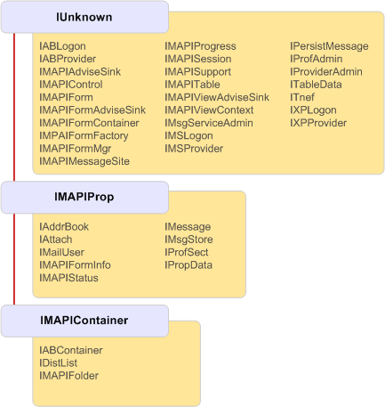

# Hierarquia de herança de objeto MAPIMAPI object inheritance hierarchy

**Aplica-se a**: Outlook**Applies to**: Outlook 
  
Todas as interfaces implementadas por objetos MAPI basicamente herdem [IUnknown](http://msdn.microsoft.com/library/33f1d79a-33fc-4ce5-a372-e08bda378332%28Office.15%29.aspx), a interface OLE que permite a comunicação entre objetos.All interfaces implemented by MAPI objects ultimately inherit from [IUnknown](http://msdn.microsoft.com/library/33f1d79a-33fc-4ce5-a372-e08bda378332%28Office.15%29.aspx), the OLE interface that enables objects to communicate. A maioria das interfaces herde diretamente **IUnknown**, mas algumas herdarem de uma das duas interfaces de base: [IMAPIProp: IUnknown](imapipropiunknown.md) ou [IMAPIContainer: IMAPIProp](imapicontainerimapiprop.md).Most interfaces directly inherit from **IUnknown**, but some inherit from one of two other base interfaces: [IMAPIProp : IUnknown](imapipropiunknown.md) or [IMAPIContainer : IMAPIProp](imapicontainerimapiprop.md). A ilustração a seguir mostra a hierarquia de herança completa em MAPI.The following illustration shows the complete inheritance hierarchy in MAPI.
  
**MAPI inheritance hierarchy****MAPI inheritance hierarchy**
  
![Hierarquia de herança de MAPI] (media/amapi_06.gif "Hierarquia de herança de MAPI")
  
## Confira tambémSee also

- [IMAPIProp : IUnknownIMAPIProp : IUnknown](imapipropiunknown.md) 
- [IMAPIContainer : IMAPIPropIMAPIContainer : IMAPIProp](imapicontainerimapiprop.md)
- [Objeto MAPI e visão geral da InterfaceMAPI Object and Interface Overview](mapi-object-and-interface-overview.md)

