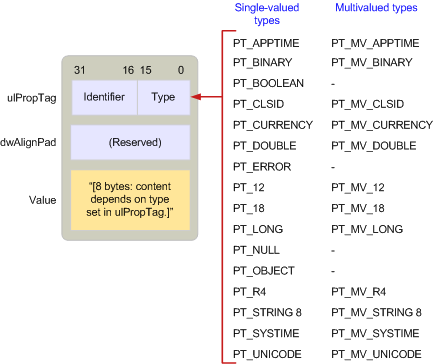

# Visão geral do tipo de propriedade MAPIMAPI property type overview
  
**Aplica-se a**: Outlook 2013 | Outlook 2016**Applies to**: Outlook 2013 | Outlook 2016 
  
Tipos de propriedade são constantes definidas pelo MAPI no MAPIDEFS. Arquivo de cabeçalho H que indicam o tipo de dados de um valor de propriedade.Property types are constants defined by MAPI in the MAPIDEFS.H header file that indicate the underlying data type of a property value. Todas as propriedades, se eles são definidos por MAPI, pelos aplicativos cliente ou por provedores de serviço, usam um desses tipos.All properties, whether they are defined by MAPI, by client applications, or by service providers, use one of these types. 
  
Tipos de propriedade siga uma convenção de nomenclatura semelhante à usada para marcas de propriedade.Property types follow a similar naming convention to the one used for property tags. Muitos tipos de propriedade tem uma versão de valor único e vários valores.Many property types have both a single-value and multiple-value version. Propriedades de valores única contenham um valor de seu tipo como um inteiro único ou uma cadeia de caracteres.Single valued properties contain one value of its type such as a single integer or character string. A constante usada para representar uma propriedade de valor único tem duas partes: o prefixo PT_ e uma cadeia de caracteres que descreve o tipo real, como LONG ou STRING8.The constant used to represent a single value property has two parts: the prefix PT_ and a string describing the actual type, such as LONG or STRING8. 
  
Propriedades de valores múltiplos contém mais de um valor de seu tipo.Multiple-value properties contain more than one value of its type. Ao contrário de matrizes de variante OLE, cada valor em uma propriedade de valores múltiplos é do mesmo tipo.Unlike OLE variant arrays, every value in a multivalued property is of the same type. A constante usada para representar vários valores de propriedades é criada, combinando o sinalizador MV_FLAG com a constante correspondente de valor único que representa o tipo de base.The constant used to represent multivalued properties is created by combining the MV_FLAG flag with the corresponding single value constant representing the base type. Existem três partes: o prefixo PT_ seguido MV_ seguido por uma cadeia de caracteres que descreve o tipo.There are three parts: the prefix PT_ followed by MV_ followed by a string that describes the type. Por exemplo, o tipo de uma propriedade que contenham inteiros vários é PT_MV_LONG e para várias cadeias de caracteres é PT_MV_STRING8.For example, the type for a property containing multiple integers is PT_MV_LONG and for multiple character strings is PT_MV_STRING8.
  
A ilustração a seguir mostra a estrutura de uma estrutura de [SPropValue](spropvalue.md) para descrever um inteiro de valores múltiplos, uma propriedade do tipo PT_MV_LONG.The following illustration shows the structure of an [SPropValue](spropvalue.md) structure to describe a multiple-value integer, a property of type PT_MV_LONG. O membro **Value** é expandido para incluir uma contagem do número de valores inteiros na propriedade e um ponteiro para uma matriz desses valores.The **Value** member is expanded to include a count of the number of integer values in the property and a pointer to an array of those values. 
  
**Multiple-value properties****Multiple-value properties**
  
![Propriedades de valores múltiplos] (media/amapi_12.gif "Propriedades de valores múltiplos")
  
Embora o suporte para vários valores propriedades é opcional, MAPI recomenda clientes e provedores de serviços de suportem a ambos os tipos de propriedades porque fazendo afirmativo permite maior interação entre componentes compatível com MAPI.Although support for multiple-value properties is optional, MAPI recommends that clients and service providers support both types of properties because doing so enables greater interaction between MAPI-compliant components.
  
A ilustração a seguir lista todas as constantes de tipo de propriedade diferentes, mostrando onde elas são armazenadas em uma estrutura **SPropValue** .The following illustration lists all of the different property type constants, showing where they are stored in an **SPropValue** structure. O tamanho do membro **valor** depende do tipo específico.The size of the **Value** member is dependent on the particular type. Observe que nem todos os tipos de valor único têm equivalentes de valores múltiplos.Notice that not all of the single-value types have multiple-value equivalents. 
  
**Property type constants****Property type constants**
  
![Constantes de tipo de propriedade] (media/amapi_11.gif "Constantes de tipo de propriedade")
  
Trabalhando com uma propriedade de provedores de serviços e de clientes necessário seguir duas etapas:Clients and service providers working with a property need to follow two steps:
  
1. Determine se a propriedade está disponível ou indisponível.Determine if the property is available or unavailable.
    
2. Se estiver disponível, recupere o valor da propriedade.If available, retrieve the property's value.
    
Em alguns casos, um provedor de cliente ou serviço só precisa verificar a existência de uma propriedade; outras vezes é necessário verificar se há um valor específico.Sometimes a client or service provider need only check for the existence of a property; other times it is necessary to check for a specific value. Por exemplo, provedores de transporte tem três diferentes cursos de ação para processamento de **PR\_SEND_RICH_INFO** propriedade ([PidTagSendRichInfo](pidtagsendrichinfo-canonical-property.md)), um valor Boolean que indica se ou não uma mensagem deve ser transmitida com texto formatado.For example, transport providers have three different courses of action for processing the **PR\_SEND_RICH_INFO** ([PidTagSendRichInfo](pidtagsendrichinfo-canonical-property.md)) property, a Boolean value that indicates whether or not a message should be transmitted with formatted text. Se **PR\_SEND_RICH_INFO** é definido como TRUE, o provedor de transporte transmite o texto formatado.If **PR\_SEND_RICH_INFO** is set to TRUE, the transport provider transmits the formatted text. Se ele for definido como FALSE, o texto formatado é descartado antes da transmissão.If it is set to FALSE, the formatted text is discarded before transmission. Se **PR_SEND_RICH_INFO** não estiver disponível, o provedor de transporte segue seu curso padrão de ação, qualquer isto é para o provedor específico.If **PR_SEND_RICH_INFO** is unavailable, the transport provider follows its default course of action, whatever that is for the particular provider. 
  
MAPI define um tipo de propriedade especial, PT_UNSPECIFIED, que um provedor de cliente ou serviço pode usar para recuperar uma propriedade quando o tipo de propriedade é desconhecido. Para recuperar uma propriedade sem um conhecimento avançado de seu tipo, um provedor de cliente ou serviço chama um método do objeto [IMAPIProp::GetProps](imapiprop-getprops.md) e passa uma marca de propriedade formada pelo identificador da propriedade e o tipo de propriedade PT_UNSPECIFIED.MAPI defines a special property type, PT_UNSPECIFIED, that a client or service provider can use to retrieve a property when the property type is unknown.To retrieve a property without advance knowledge of its type, a client or service provider calls an object's [IMAPIProp::GetProps](imapiprop-getprops.md) method and passes a property tag made up of the property's identifier and the PT_UNSPECIFIED property type. **GetProps** retorna uma estrutura de [SPropValue](spropvalue.md) para a propriedade, substituindo PT_UNSPECIFIED com o tipo apropriado.**GetProps** returns an [SPropValue](spropvalue.md) structure for the property, replacing PT_UNSPECIFIED with the appropriate type. Provedores de serviços de implementação **GetProps** são necessárias para dar suporte a PT_UNSPECIFIED.Service providers implementing **GetProps** are required to support PT_UNSPECIFIED. 
  
Alguns objetos MAPI suportam a propriedades que são os próprios objetos.Some MAPI objects support properties that are themselves objects. Propriedades de objeto têm o tipo PT_OBJECT.Object properties have the type PT_OBJECT. Em vez de usar **IMAPIProp::GetProps** para acessar essas propriedades, os clientes e os provedores de serviço geralmente usuário ambos o método [IMAPIProp::OpenProperty](imapiprop-openproperty.md) , especificando a interface adequada para o access ou um método no objeto dando suporte à propriedade.Instead of using **IMAPIProp::GetProps** to access these properties, clients and service providers typically user either the [IMAPIProp::OpenProperty](imapiprop-openproperty.md) method, specifying the appropriate interface for access, or a method on the object supporting the property. 
  
Porque acessando o valor da propriedade de um objeto envolve usando uma das interfaces do objeto, **GetProps** é inadequado.Because accessing the value of an object property involves using one of the interfaces for the object, **GetProps** is inappropriate. Com **GetProps**, o chamador acessa um valor de propriedade por meio de uma estrutura **SPropValue** .With **GetProps**, the caller accesses a property's value through an **SPropValue** structure. Com **IMAPIProp::OpenProperty**, o chamador recupera um ponteiro para uma interface que pode acessar o objeto.With **IMAPIProp::OpenProperty**, the caller retrieves a pointer to an interface that can access the object. **OpenProperty** sempre pode ser usado para recuperar uma propriedade de objeto.**OpenProperty** can always be used to retrieve an object property. Outra opção, chamando um método no objeto, não está disponível com a propriedade de cada objeto.The other option, calling a method on the object, is not available with every object property. 
  
Por exemplo, cada pasta dá suporte a duas tabelas, uma tabela de hierarquia e uma tabela de conteúdo.For example, every folder supports two tables, a hierarchy table and a contents table. Nestas tabelas são propriedades da pasta; suas marcas de propriedade são **PR_CONTAINER_HIERARCHY** ([PidTagContainerHierarchy](pidtagcontainerhierarchy-canonical-property.md)) e **PR_CONTAINER_CONTENTS** ([PidTagContainerContents](pidtagcontainercontents-canonical-property.md)).These tables are properties of the folder; their property tags are **PR_CONTAINER_HIERARCHY** ([PidTagContainerHierarchy](pidtagcontainerhierarchy-canonical-property.md)) and **PR_CONTAINER_CONTENTS** ([PidTagContainerContents](pidtagcontainercontents-canonical-property.md)). Tabelas são objetos que exigem a interface **IMAPITable** para acesso.Tables are objects that require the **IMAPITable** interface for access. Um cliente pode chamar o método de [IMAPIContainer::GetHierarchyTable](imapicontainer-gethierarchytable.md) da pasta para acessar a tabela de hierarquia, o método de [IMAPIContainer::GetContentsTable](imapicontainer-getcontentstable.md) da pasta para acessar a tabela de conteúdo, ou a pasta [IMAPIProp::OpenProperty ](imapiprop-openproperty.md)método para acessar qualquer uma das tabelas.A client can call the folder's [IMAPIContainer::GetHierarchyTable](imapicontainer-gethierarchytable.md) method to access the hierarchy table, the folder's [IMAPIContainer::GetContentsTable](imapicontainer-getcontentstable.md) method to access the contents table, or the folder's [IMAPIProp::OpenProperty](imapiprop-openproperty.md) method to access either table. Para chamar **OpenProperty**, um cliente passa a marca de propriedade para a propriedade, como o primeiro parâmetro e um identificador de interface para a interface a ser usada para acesso como o segundo parâmetro.To call **OpenProperty**, a client passes the property tag for the property as the first parameter and an interface identifier for the interface to be used for access as the second parameter. Esses parâmetros seria **PR_CONTAINER_HIERARCHY** ou **PR_CONTAINER_CONTENTS** e **IID_IMAPITable**.These parameters would be **PR_CONTAINER_HIERARCHY** or **PR_CONTAINER_CONTENTS** and **IID_IMAPITable**.
  
Para obter uma lista completa dos tipos de valor único e vários valores de propriedade, consulte [Tipos de propriedade](property-types.md).For a complete list of the single-value and multiple-value property types, see [Property Types](property-types.md). 
  
## Confira tambémSee also

- [Visão geral da propriedade MAPIMAPI Property Overview](mapi-property-overview.md)

