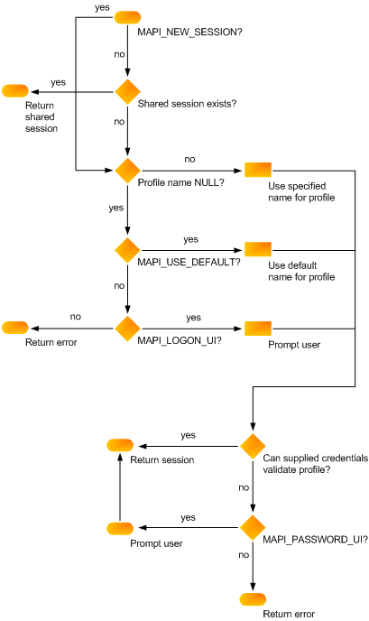

# Sessões MAPIMAPI sessions

**Aplica-se a**: Outlook 2013 | Outlook 2016**Applies to**: Outlook 2013 | Outlook 2016 
  
Antes do aplicativo cliente pode chamar um sistema de mensagens subjacente, ele precisa estabelecer uma sessão ou conexão, com o subsistema MAPI.Before the client application can call an underlying messaging system, it must establish a session, or connection, with the MAPI subsystem.
  
Sessões são iniciadas quando um usuário faz logon, um processo que acessa um perfil válido e valida o sistema de mensagens e as credenciais do serviço de mensagem.Sessions are initiated when a user logs on, a process that accesses a valid profile and validates the messaging system and the message service credentials. Em seguida, o processo garante que todos os serviços de mensagem do perfil estão configurados corretamente.Then, the process ensures that all of the profile's message services are correctly configured. A interface de cliente que você usa determina a chamada de logon.The client interface you use determines the logon call. Clientes MAPI chamar a função de [MAPILogonEx](mapilogonex.md) .MAPI clients call the [MAPILogonEx](mapilogonex.md) function. 
  
Configuração do serviço de mensagens é uma das partes mais importantes do processo de logon.Message service configuration is one of the most important parts of the logon process. O perfil é a origem inicial das informações de configuração.The profile is the initial source for configuration information. Se informações sobre um serviço de mensagem específica estiverem ausentes, o processo de logon tenta solicitar ao usuário para fornecer a ele.If information for a particular message service is missing, the logon process tries to prompt the user to supply it. Isso nem sempre é bem-sucedida por dois motivos: primeiro, solicitando que o usuário requer a exibição de uma caixa de diálogo.This is not always successful for two reasons: First, prompting the user requires the display of a dialog box. É possível para que os clientes não permitir a exibição de uma interface do usuário, passando um sinalizador na chamada de logon.It is possible for clients to disallow the display of a user interface by passing a flag into the logon call. Em segundo lugar, o usuário pode cancelar a caixa de diálogo antes que as informações necessárias podem ser adicionadas.Second, the user could cancel the dialog box before the needed information can be added.
  
Quando um processo de logon falha uma vez, o usuário é informado sobre a falha e tem a chance de repetição ou corrigir a condição de erro.When a logon process fails one time, the user is informed of the failure and given the chance to retry or correct the error condition. Mais uma vez, uma interface de usuário será exibida, se o cliente permite e o usuário será solicitado a inserir quaisquer dados estão faltando.Once again, a user interface will be displayed, if the client allows it, and the user will be prompted to enter whatever data is missing. Se esse segundo try for bem sucedida, MAPI desabilita todos os provedores de serviço no serviço de mensagem para a duração da sessão.If this second try is unsuccessful, MAPI disables all service providers in the message service for the duration of the session. Na verdade, o serviço de mensagem inteira está desabilitado.In effect, the whole message service is disabled. Isso significa que nenhum dos provedores de serviço no serviço de mensagem pode trabalhar.This means that none of the service providers in the message service can work. Isso é feito porque se um provedor de falha de logon, os outros provedores geralmente também falharem.This is done because if one provider fails logon, the other providers usually also fail. O processo de logon pode falhar devido a um caminho inválido para um recurso necessário, uma versão incompatível do MAPI, um servidor de mensagens não está disponível ou corrupção de dados.The logon process can fail due to an invalid path for a necessary resource, an incompatible version of MAPI, an unavailable messaging server, or data corruption. 
  
Os clientes podem especificar um dos dois tipos de sessões seja estabelecida na chamada logon: uma sessão individual ou uma sessão compartilhada.Clients can specify one of two types of sessions to be established in the logon call: an individual session or a shared session. Sessões individuais são conexões particulares; Há um relacionamento individual entre um aplicativo cliente e a sessão está usando.Individual sessions are private connections; there is a one-to-one relationship between a client application and the session it is using. Como consequência, aplicativos de cliente que compartilham uma sessão também compartilham um perfil.As a consequence, client applications that share a session also share a profile. Sessões compartilhadas são estabelecidas uma vez, mas podem ser usadas por outros aplicativos cliente que precisam usá-los.Shared sessions are established once but can be used by other client applications that need to use them. O perfil e as credenciais são especificadas somente com o logon inicial.The profile and credentials are specified only with the initial logon. 
  
Os clientes podem fazer logon várias vezes como o mesmo usuário ou vários usuários.Clients can log on multiple times as the same user or as multiple users. MAPI não impede a isso.MAPI does not prevent this. Alguns provedores de serviços, no entanto, podem não ser tão flexíveis, retornando o valor de erro MAPI_E_SESSION_LIMIT em tentativas de logon subsequentes.Some service providers, however, might not be as flexible, returning the error value MAPI_E_SESSION_LIMIT on subsequent logon attempts. Provedores de serviços com limitações de hardware subjacente podem ser necessária para impor um limite de sessão.Service providers with underlying hardware limitations can be required to enforce a session limit.
  
As chamadas de função para o estabelecimento de uma sessão tem uma coleção de parâmetros e os sinalizadores que controlam como a sessão é criada.The function calls for establishing a session have a collection of flags and parameters that control how the session is created. O cliente especifica um nome de perfil opcional e um identificador de janela que atua como a janela pai para as caixas de diálogo que são exibidos.The client specifies an optional profile name and a window handle that acts as the parent window for any dialog boxes that are displayed. Os sinalizadores incluem MAPI_NEW_SESSION, que solicita que uma nova sessão individual (em vez de uma sessão compartilhada) ser estabelecida, e o sinalizador de interface do usuário MAPI_LOGON_UI.The flags include MAPI_NEW_SESSION, which requests that a new, individual session (rather than a shared session) be established, and the MAPI_LOGON_UI user interface flag. O sinalizador de interface do usuário é definido como solicitar uma caixa de diálogo de logon.The user interface flag is set to request a logon dialog box.
  
A ilustração a seguir mostra como esses parâmetros e os sinalizadores vários estabelecem uma sessão MAPI.The following illustration shows how these various parameters and flags establish a MAPI session.
  
**MAPI session flowchart****MAPI session flowchart**
  
![Fluxograma de sessão MAPI] (media/amapi_47.gif "Fluxograma de sessão MAPI")
  
Para obter informações sobre como lidar com sessões de dentro de um aplicativo cliente, consulte [Manipulação de sessão MAPI](mapi-session-handling.md)For information about handling sessions from within a client application, see [MAPI Session Handling](mapi-session-handling.md)
  
## Confira tambémSee also

- [MAPILogonExMAPILogonEx](mapilogonex.md)  
- [IMAPISession : IUnknownIMAPISession : IUnknown](imapisessioniunknown.md)
- [Tratamento de sessão MAPIMAPI Session Handling](mapi-session-handling.md)  
- [Vis�o geral da programa��o MAPIMAPI Programming Overview](mapi-programming-overview.md)

