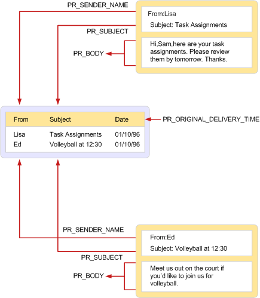

# Tabelas MAPIMAPI tables
  
**Aplica-se a**: Outlook**Applies to**: Outlook 
  
Uma tabela MAPI é um objeto MAPI que é usado para exibir um conjunto de propriedades que pertencem a outros objetos MAPI de um determinado tipo.A MAPI table is a MAPI object that is used to view a collection of properties belonging to other MAPI objects of a particular type. Tabelas MAPI são estruturadas em um formato de linha e coluna, com cada linha representa um objeto e cada coluna que representa uma propriedade do objeto.MAPI tables are structured in a row and column format with each row representing an object and each column representing a property of the object. Uma das propriedades geralmente são incluídas em cada linha é a propriedade **PR_ENTRYID** ([PidTagEntryId](pidtagentryid-canonical-property.md)), um identificador que pode ser usado para abrir e modificar o objeto.One of the properties usually included in each row is the **PR_ENTRYID** ([PidTagEntryId](pidtagentryid-canonical-property.md)) property, an identifier that can be used to open and modify the object. 
  
Como linhas contêm valores de propriedade, recuperando uma linha de uma tabela é semelhante a obtenção de um conjunto de propriedades diretamente do objeto que representa a linha.Because rows contain property values, retrieving a row from a table is similar to getting a set of properties directly from the object that the row represents. As duas operações resultam na recuperação de uma matriz de valores de propriedade.Both operations result in the retrieval of a property value array. A principal diferença é no tratamento de tempo propriedades de cadeia de caracteres e binário.The main difference is in the handling of long string and binary properties. Para inclusão em uma tabela, alguns implementadores de tabela truncam essas propriedades para 255 bytes.For inclusion in a table, some table implementers truncate these properties to 255 bytes. Quando for recuperada diretamente do objeto, o valor completo está sempre disponível.When retrieved directly from the object, the full value is always available.
  
Tabelas são implementadas por provedores de armazenamento de mensagens e o catálogo de endereços e MAPI, dependendo do tipo de tabela e os objetos dentro dela.Tables are implemented by address book and message store providers and by MAPI, depending on the type of table and the objects within it. Um provedor de armazenamento de mensagem implementa pastas e uma tabela de conteúdo para cada pasta que inclui informações sobre as mensagens na pasta.A message store provider implements folders and a contents table for each folder that includes information about the messages in the folder. Um provedor de catálogo de endereços implementa contêineres do catálogo de endereços e uma tabela de hierarquia que mostra a sua organização.An address book provider implements address book containers and a hierarchy table that shows their organization. MAPI implementa várias tabelas diferentes, algumas para uso por aplicativos do cliente, alguns para uso por provedores de serviços e alguns para uso por ambos.MAPI implements several different tables, some for use by client applications, some for use by service providers, and some for use by both. A tabela de status é exclusiva MAPI basicamente fornece a tabela, mas as linhas são compostas de contribuições de todos os tipos de provedores de serviço, além de MAPI.The status table is unique in that MAPI ultimately supplies the table, but the rows are comprised of contributions from all types of service providers in addition to MAPI. 
  
A ilustração a seguir mostra um dos usos frequentes de uma tabela no MAPI: para exibir o conteúdo de uma pasta.The following illustration shows one of the frequent uses of a table in MAPI: to display the contents of a folder. No lado direito é uma exibição de duas mensagens podem aparecer em um aplicativo cliente de mensagens típico.On the right is a display of two messages as might appear in a typical messaging client application. A exibição contém quatro partes de informações sobre cada mensagem: o remetente, destinatário, o assunto e o texto da mensagem.The display contains four pieces of information about each message: the sender, the recipient, the subject, and the message text. Cada informação corresponde a uma propriedade da mensagem.Each piece of information corresponds to a property of the message.
  
No lado esquerdo é uma exibição da tabela conteúdo que inclui estas duas mensagens.On the left is a view of the contents table that includes these two messages. Enquanto a tabela de conteúdo pode ter dez linhas porque a pasta tem dez mensagens, com cada linha que contém mais de três colunas de muitas, este modo de exibição específico é limitado apenas duas linhas e três colunas.Whereas the contents table may have ten rows because the folder has ten messages, with each row containing many more than three columns, this particular view is limited to only two rows and three columns.
  
A tabela a seguir mostra as propriedades que compõem a coluna definido para o modo de exibição de tabela.The following table shows the properties that make up the column set for the table view.
  
|**Propriedade****Property**|**Descrição****Description**|
|:-----|:-----|
|**PR_SENDER_NAME** ([PidTagSenderName](pidtagsendername-canonical-property.md))**PR_SENDER_NAME** ([PidTagSenderName](pidtagsendername-canonical-property.md))    |Nome do remetenteSender name    |
|**PR_ORIGINAL_DELIVERY_TIME** ([PidTagOriginalDeliveryTime](pidtagoriginaldeliverytime-canonical-property.md))**PR_ORIGINAL_DELIVERY_TIME** ([PidTagOriginalDeliveryTime](pidtagoriginaldeliverytime-canonical-property.md))    |Data e hora em que a mensagem foi enviadaDate and time when the message was sent    |
|**PR_SUBJECT** ([PidTagSubject](pidtagsubject-canonical-property.md))**PR_SUBJECT** ([PidTagSubject](pidtagsubject-canonical-property.md))    |Linha de assunto da mensagemMessage subject line    |
   
Observe que o conjunto de propriedades exibidas na mensagem não são o mesmo que o conjunto de colunas exibidas na tabela.Notice that the set of properties displayed in the message are not the same as the set of columns displayed in the table. O implementador da tabela, neste caso uma mensagem repositório provedor, um padrão de suprimentos definido de colunas em uma ordem padrão.The implementer of the table, in this case a message store provider, supplies a default set of columns in a default order. O cliente pode modificar este conjunto de coluna, solicitando colunas adicionais ou rejeição padrão aqueles e pedir que eles ser solicitados de uma forma específica.The client can modify this column set, requesting additional columns or rejecting default ones, and ask that they be ordered in a specific way. O cliente também pode ordenar as linhas, classificando-os de acordo com o valor de uma ou mais colunas.The client can also order the rows, sorting them according to the value of one or more columns.
  
**Using a table to display folder contents****Using a table to display folder contents**
  
![Usando uma tabela para exibir o conteúdo da pasta] (media/amapi_54.gif "Usando uma tabela para exibir o conteúdo da pasta")
  
Há duas interfaces para trabalhar com tabelas:There are two interfaces for working with tables:
  
- [IMAPITable: IUnknown](imapitableiunknown.md) dá clientes e provedores de serviços de um modo de exibição somente leitura dos dados subjacentes da tabela, permitindo que eles exibir e alterar apenas a apresentação.[IMAPITable : IUnknown](imapitableiunknown.md) gives clients and service providers a read-only view of the underlying data of the table, allowing them to view and change only the presentation. Vários usuários podem acessar os mesmos dados depois **IMAPITable**.Multiple users can access the same data concurrently with **IMAPITable**. **IMAPITable** é implementada por MAPI e por provedores de serviços.**IMAPITable** is implemented by MAPI and by service providers. 
    
- [ITableData: IUnknown](itabledataiunknown.md) dá aos clientes e provedores de serviços de leitura/gravação acesso aos dados subjacentes da tabela, permitindo que eles façam alterações permanentes.[ITableData : IUnknown](itabledataiunknown.md) gives clients and service providers read/write access to the underlying data of the table, allowing them to make permanent changes. **IMAPITable** é implementada por MAPI e é usado principalmente pelos provedores de serviço que acessá-lo ao chamar a função [CreateTable](createtable.md) .**IMAPITable** is implemented by MAPI and used primarily by service providers who access it by calling the [CreateTable](createtable.md) function. A implementação de **ITableData** contém todos os dados da tabela e quaisquer associados restrições na memória, tornando-o inadequados para usam com tabelas muito grandes.The **ITableData** implementation holds all the data for the table and any associated restrictions in memory, making it unsuitable for use with very large tables. Compostos restrições e operações complexas, como categorização não são suportados.Compound restrictions and complex operations such as categorization are unsupported. 
    
## Confira tambémSee also

- [Conceitos MAPIMAPI Concepts](mapi-concepts.md)

