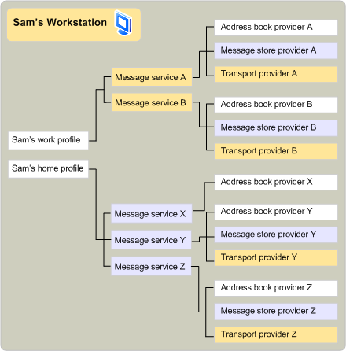

# Perfis e serviços de mensagensMessage services and profiles
  
**Aplica-se a**: Outlook 2013 | Outlook 2016**Applies to**: Outlook 2013 | Outlook 2016 
  
Alguns usuários exigem os serviços de vários sistemas de mensagens, cada um com um ou mais provedores de serviços.Some users require the services of several messaging systems, each with one or more service providers. Como é complicado instalar e configurar cada um desses provedores de serviços individualmente, e como um servidor de mensagens geralmente requer um grupo de provedores relacionados para expor toda sua funcionalidade, o MAPI inclui o conceito de um serviço de mensagens.Because it is cumbersome to install and configure each of these service providers individually, and because a messaging server usually requires a group of related providers to expose all its functionality, MAPI includes the concept of a message service. Os serviços de mensagens ajudam os usuários a instalar e configurar seus provedores de serviços.Message services help users install and configure their service providers.
  
Para criar um serviço de mensagens, um desenvolvedor grava um programa de ponto de entrada de serviço de mensagem para lidar com a configuração de cada provedor no serviço e um programa de configuração para fazer o seguinte:To create a message service, a developer writes a message-service entry point program to handle the configuration of each provider in the service and a setup program to do the following:
  
- Instale cada provedor no serviço.Install each provider in the service.
    
- Criar entradas de registro e arquivo de inicialização.Create registry and initialization file entries.
    
- Crie entradas no arquivo de configuração MAPI, MAPISVC. inf.Create entries in the MAPI configuration file, Mapisvc.inf.
    
O arquivo MAPISVC. inf contém informações relacionadas à configuração de todos os serviços de mensagens e provedores de serviços instalados no computador.The Mapisvc.inf file contains information that relates to the configuration of all message services and service providers installed on the computer. Ele é organizado em seções hierárquicas, com cada nível vinculado ao próximo.It is organized in hierarchical sections, with each level linked to the next. Na parte superior há três seções que contêm o seguinte:At the top are three sections that contain the following: 
  
- Uma lista de arquivos de ajuda do serviço de mensagens.A list of message service Help files.
    
- Uma lista dos serviços de mensagens mais importantes, ou padrão.A list of the most important, or default, message services.
    
- Uma lista de todos os serviços no computador.A list of all the services on the computer.
    
O próximo nível contém seções para cada serviço de mensagens e o último nível contém seções para cada provedor de serviços em um serviço.The next level contains sections for each message service, and the last level contains sections for each service provider in a service. MAPI requer que os desenvolvedores de provedores de serviços e serviços de mensagens adicionem determinadas entradas a MAPISVC. inf; os desenvolvedores podem adicionar outras entradas por conta própria.MAPI requires that developers of service providers and message services add certain entries to Mapisvc.inf; developers can add other entries at their own discretion. A maioria das informações no MAPISVC. inf acaba em um ou mais perfis, uma coleção de informações de configuração para o conjunto de serviços de mensagem preferencial de um usuário.Most of the information in Mapisvc.inf ends up in one or more profiles, a collection of configuration information for a user's preferred set of message services. Como um computador pode ter vários usuários e um único usuário pode ter vários conjuntos de preferências, muitos perfis podem existir em um computador.Because a computer can have multiple users and a single user can have multiple sets of preferences, many profiles can exist on a computer. Cada perfil descreve um conjunto diferente de serviços de mensagens.Each profile describes a different set of message services. Ter vários perfis permite que um usuário trabalhe, por exemplo, em casa com um conjunto de serviços de mensagem e no escritório com um conjunto diferente.Having multiple profiles enables a user to work, for example, at home with one set of message services and at the office with a different set.
  
Os perfis são criados na instalação do serviço de mensagens ou no tempo de logon por um aplicativo cliente que fornece suporte à configuração.Profiles are created at message service installation or logon time by a client application that provides configuration support. MAPI fornece dois aplicativos cliente: um item do painel de controle e o assistente de perfil.MAPI provides two such client applications: a Control Panel item and the Profile Wizard. O item do painel de controle é um aplicativo de configuração de serviço completo com o qual os usuários podem criar, excluir, editar e copiar perfis, bem como fazer modificações nas entradas de um perfil.The Control Panel item is a full-service configuration application with which users can create, delete, edit, and copy profiles, as well as make modifications to the entries in a profile. O assistente de perfil é um aplicativo simples projetado para tornar a adição de um serviço de mensagens a um perfil o mais fácil possível.The Profile Wizard is a simple application designed to make adding a message service to a profile as easy as possible. O assistente de perfil consiste em uma série de caixas de diálogo, chamadas páginas de propriedades, que solicitam ao usuário o processo de instalação e configuração de um serviço.The Profile Wizard consists of a series of dialog boxes, called property pages, that prompt the user through the process of installing and configuring a service. O usuário é solicitado apenas por valores para as configurações mais críticas; todas as outras configurações herdam valores padrão.The user is prompted only for values for the most critical settings; all other settings inherit default values. Depois que o perfil tiver sido criado, os usuários não poderão fazer alterações.Once the profile has been created, users are not allowed to make changes. 
  
Enquanto o item do painel de controle é sempre chamado pelo painel de controle, há uma variedade de cenários que podem fazer com que o assistente de perfil seja chamado.Whereas the Control Panel item is always invoked through the Control Panel, there are a variety of scenarios that can cause the Profile Wizard to be called. Os aplicativos cliente podem chamar o assistente de perfil para criar um perfil padrão em tempo de logon quando ainda não tiver sido criado.Client applications can call the Profile Wizard to create a default profile at logon time when one has not yet been created. Em vez de reimplementar o código para adicionar um perfil, o item do painel de controle ou outro aplicativo cliente pode depender da funcionalidade já existente no assistente de perfil.Rather than reimplementing code to add a profile, the Control Panel item or another client application can rely on the functionality already in the Profile Wizard. Um serviço de mensagens, em sua função de ponto de entrada, pode chamar o assistente de perfil quando o serviço precisa ser adicionado ao perfil padrão.A message service, in its entry point function, can call the Profile Wizard when the service needs to be added to the default profile. Os serviços de mensagens que usam o assistente de perfil devem escrever uma função de ponto de entrada extra e um procedimento de caixa de diálogo padrão do Windows.Message services that use the Profile Wizard must write an extra entry point function and a standard Windows dialog box procedure. O assistente de perfil chama a função de ponto de entrada para recuperar a caixa de diálogo de configuração do serviço enquanto o procedimento da caixa de diálogo manipula as mensagens que são geradas quando essa caixa de diálogo está em uso.The Profile Wizard calls the entry point function to retrieve the service's configuration dialog box while the dialog box procedure handles the messages that are generated when this dialog box is in use. 
  
Os perfis são organizados de forma semelhante ao arquivo MAPISVC. inf.Profiles are organized in a similar way to the Mapisvc.inf file. Os perfis têm seções hierárquicas vinculadas; os provedores de serviços possuem seções no nível mais baixo, as seções de serviços de mensagens no nível intermediário e o MAPI possui seções no nível mais alto.Profiles have linked hierarchical sections; service providers own sections in the lowest level, message services own sections in the middle level, and MAPI owns sections in the highest level. Cada seção é identificada com um identificador exclusivo conhecido como [MAPIUID](mapiuid.md).Each section is identified with a unique identifier known as a [MAPIUID](mapiuid.md). As seções MAPI contêm informações internas para MAPI, como os identificadores de todas as seções de perfil de serviço de mensagens e links para cada uma das outras seções.The MAPI sections contain information internal to MAPI, such as the identifiers of all of the message service profile sections and links to each of the other sections. Cada seção de serviço de mensagens armazena links para suas seções de provedor e cada seção de provedor armazena um link para sua seção de serviço.Each message service section stores links to its provider sections, and each provider section stores a link to its service section. 
  
A ilustração a seguir mostra o conteúdo de dois perfis típicos.The following illustration shows the contents of two typical profiles. O Sam tem dois perfis no computador, um para uso doméstico e um para uso do Office.Sam has two profiles on his computer, one for home use and one for office use. O perfil inicial contém três serviços de mensagens.The home profile contains three message services. Message Service X é um serviço de provedor único para gerenciamento de catálogo de endereços.Message Service X is a single provider service for address book management. Os serviços de mensagem Y e Z têm três provedores — um provedor de catálogo de endereços, um provedor de repositório de mensagens e um provedor de transporte.Message Services Y and Z have three providers — an address book provider, a message store provider, and a transport provider. O perfil de trabalho do Sam contém dois serviços de mensagens diferentes, cada um com um provedor de catálogo de endereços, um provedor de repositório de mensagens e um provedor de transporte.Sam's Work Profile contains two different message services, each of which has an address book provider, a message store provider, and a transport provider. 
  
**Profile example****Profile example**
  
![Exemplo de perfil] (media/amapi_56.gif "Exemplo de perfil")
  
A ilustração a seguir mostra um perfil que inclui dois serviços de mensagens.The following illustration shows a profile that includes two message services. O código para instalar e configurar os provedores de serviço que pertencem ao serviço de mensagens residem na mesma DLL que o código para os provedores.The code for installing and configuring the service providers that belong to the message service resides in the same DLL as the code for the providers. Este código lê as informações do perfil no momento do logon para configurar os provedores de serviço e solicita ao usuário, se possível e necessário, para obter informações ausentes.This code reads information from the profile at logon time to configure the service providers, and it prompts the user, if possible and necessary, for missing information. As solicitações de um cliente para exibir ou alterar as definições de configuração de qualquer um dos provedores também são tratadas por esse código comum.Requests from a client to view or change configuration settings for any of the providers are also handled by this common code.
  
**Installing and configuring service providers****Installing and configuring service providers**
  
![Instalando e configurando provedores de serviços] (media/amapi_55.gif "Instalando e configurando provedores de serviços")
  
## Confira tambémSee also

- [MAPIUIDMAPIUID](mapiuid.md)
- [Vis�o geral da programa��o MAPIMAPI Programming Overview](mapi-programming-overview.md)

