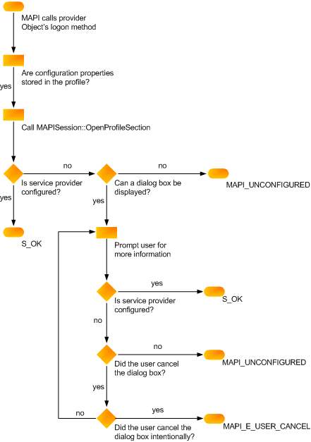

# Verificar a configuração do provedor de serviçosVerifying service provider configuration
  
**Aplica-se a**: Outlook 2013 | Outlook 2016**Applies to**: Outlook 2013 | Outlook 2016 
  
O método de logon ([IABProvider::Logon](iabprovider-logon.md), [IMSProvider::Logon](imsprovider-logon.md)ou [IXPProvider::TransportLogon](ixpprovider-transportlogon.md)) deve verificar a configuração do provedor.Your logon method ([IABProvider::Logon](iabprovider-logon.md), [IMSProvider::Logon](imsprovider-logon.md), or [IXPProvider::TransportLogon](ixpprovider-transportlogon.md)) must verify your provider's configuration. Isso envolve a verificação de que todas as propriedades necessárias para a operação completa estão definidas corretamente.This involves checking that all of the properties needed for full operation are set correctly. Cada provedor requer um número diferente de propriedades; depende do provedor e do grau de interação do usuário que você permite.Every provider requires a different number of properties; configuration depends on your provider and the degree of user interaction you allow. Alguns provedores de serviços mantêm todas as propriedades necessárias no perfil.Some service providers keep all of the necessary properties in the profile. 

Outros provedores de serviços mantêm um conjunto parcial de propriedades no perfil e solicitam valores ausentes ao usuário.Other service providers keep a partial set of properties in the profile and prompt the user for missing values. Ainda assim, outros provedores não armazenam propriedades no perfil, confiando no usuário para fornecer todas as informações necessárias para a configuração.Still other providers do not store properties in the profile at all, relying on the user to supply all of the information needed for configuration.
  
### Para recuperar propriedades armazenadas no perfilTo retrieve properties stored in the profile
  
1. Chame [IMAPISupport::OpenProfileSection](imapisupport-openprofilesection.md), passando [o MAPIUID](mapiuid.md) do seu provedor como um parâmetro de entrada.Call [IMAPISupport::OpenProfileSection](imapisupport-openprofilesection.md), passing the [MAPIUID](mapiuid.md) of your provider as an input parameter. 
    
2. Chame os métodos [IMAPIProp::GetProps](imapiprop-getprops.md) ou [IMAPIProp::GetPropList](imapiprop-getproplist.md) da seção de perfil para recuperar propriedades individuais ou uma lista de propriedades.Call the profile section's [IMAPIProp::GetProps](imapiprop-getprops.md) or [IMAPIProp::GetPropList](imapiprop-getproplist.md) methods to retrieve individual properties or a property list. 
    
### Para definir propriedades de informações do usuárioTo set properties from user information
  
Exibir uma folha de propriedades, se MAPI não tiver definido um sinalizador proibindo a exibição.Display a property sheet, if MAPI has not set a flag prohibiting the display. Os sinalizadores a seguir indicam que uma interface do usuário não pode ser apresentada.The following flags indicate that a user interface cannot be presented.
  
|**Flag****Flag**|**Provedor de serviços****Service provider**|
|:-----|:-----|
|AB_NO_DIALOGAB_NO_DIALOG    |Provedor de agendasAddress book provider    |
|LOGON_NO_DIALOGLOGON_NO_DIALOG    |Provedor de transporteTransport provider    |
|MDB_NO_DIALOGMDB_NO_DIALOG    |Provedor de armazenamento de mensagensMessage store provider    |
   
Se o provedor não armazenar todas as suas propriedades de configuração no perfil, exigindo interação do usuário, e o MAPI passar um dos sinalizadores de supressão da caixa de diálogo para o método de logon, retorne MAPI_E_UNCONFIGURED.If your provider does not store all of its configuration properties in the profile, requiring user interaction, and MAPI passes one of the dialog box suppression flags to your logon method, return MAPI_E_UNCONFIGURED. Também retornará esse erro quando o sinalizador de supressão de caixa de diálogo não estiver definido, mas o usuário não fornecerá todas as informações necessárias.Also return this error when the dialog suppression flag is not set, but the user does not supply all of the required information.
  
Quando o provedor de serviços falha no método de logon com MAPI_E_UNCONFIGURED, o MAPI chama sua função de ponto de entrada novamente.When your service provider fails its logon method with MAPI_E_UNCONFIGURED, MAPI calls your entry point function again. Se as informações não puderem ser localizadas com a segunda chamada, a sessão poderá ser encerrada, dependendo da importância do provedor de serviços.If the information cannot be located with the second call, the session might terminate, depending on how important your service provider is. 
  
A ilustração a seguir mostra a lógica necessária para a configuração no método de logon do provedor de serviços.The following illustration shows the logic required for configuration in your service provider logon method. 
  
**Configuration verification flowchart****Configuration verification flowchart**
  

  
## Confira tambémSee also

- [Implementando o logon do provedor de serviçosImplementing Service Provider Logon](implementing-service-provider-logon.md)

