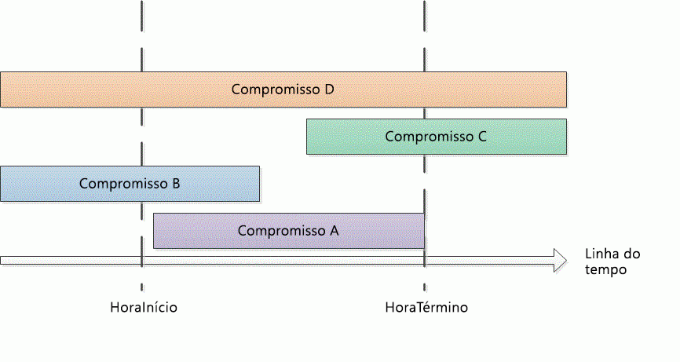

# <a name="search-and-obtain-appointments-in-a-time-range"></a><span data-ttu-id="937ab-102">Pesquisar e obter compromissos em um intervalo de tempo</span><span class="sxs-lookup"><span data-stu-id="937ab-102">Search and obtain appointments in a time range</span></span>

<span data-ttu-id="937ab-103">Este exemplo mostra compromissos em um intervalo de tempo específico no calendário padrão do Microsoft Outlook.</span><span class="sxs-lookup"><span data-stu-id="937ab-103">This example returns appointments in a specific time range in the default Microsoft Outlook calendar.</span></span>

## <a name="example"></a><span data-ttu-id="937ab-104">Exemplo</span><span class="sxs-lookup"><span data-stu-id="937ab-104">Example</span></span>

<span data-ttu-id="937ab-105">Este exemplo de código contém dois métodos: DemoAppointmentsInRange e GetAppointmentsInRange.</span><span class="sxs-lookup"><span data-stu-id="937ab-105">This code example contains two methods: DemoAppointmentsInRange and GetAppointmentsInRange.</span></span> <span data-ttu-id="937ab-106">DemoAppointmentsInRange obtém o calendário padrão para o perfil do Outlook conectado no momento, com um intervalo de datas de cinco dias a partir da meia-noite</span><span class="sxs-lookup"><span data-stu-id="937ab-106">DemoAppointmentsInRange obtains the default calendar for the current signed-in Outlook profile, sets a date range of 5 days from 12:00 A.M.</span></span> <span data-ttu-id="937ab-107">Hoje, o GetAppointmentsInRange é chamado para obter compromissos que estão nesse intervalo de tempo e exibe o assunto e o início de cada um dos compromissos retornados.</span><span class="sxs-lookup"><span data-stu-id="937ab-107">today, calls GetAppointmentsInRange to obtain appointments that fall in that time range, and displays the subject and start time of each of the returned appointments.</span></span>

<span data-ttu-id="937ab-108">O GetAppointmentsInRange aceita uma pasta do Outlook e os valores de início e término **DateTime** do intervalo de tempo como parâmetros de entrada.</span><span class="sxs-lookup"><span data-stu-id="937ab-108">GetAppointmentsInRange accepts an Outlook folder, and the start and end **DateTime** values of the time range as input parameters.</span></span> <span data-ttu-id="937ab-109">Este método emprega o método [Restrict(String)](https://msdn.microsoft.com/library/bb612531\(v=office.15\)) e uma cadeia de caracteres filtrada no formato Jet que apresenta compromisso que começam e terminam em um período de tempo específico.</span><span class="sxs-lookup"><span data-stu-id="937ab-109">This method uses the [Restrict(String)](https://msdn.microsoft.com/library/bb612531\(v=office.15\)) method and a string filter in Jet format that returns appointments that start and end within the specified time range.</span></span> <span data-ttu-id="937ab-110">Presumindo que \[Início\] e \[Final\] são as horas de início e hora de término de um compromisso e que, a hora de início e hora de término são o tempo de início e fim em um intervalo de tempo especificado, o GetAppointmentsInRange configura um filtro que procura  compromissos`[Start]>=startTime`, e `[End]<=endTime`.</span><span class="sxs-lookup"><span data-stu-id="937ab-110">Assuming \[Start\] and \[End\] are the start time and end time of an appointment, and startTime and endTime are the beginning and end time of the specified time range, GetAppointmentsInRange sets up a filter  that looks for appointments with `[Start]>=startTime`, and `[End]<=endTime`.</span></span> <span data-ttu-id="937ab-111">O código a seguir mostra o filtro Jet em C\#.</span><span class="sxs-lookup"><span data-stu-id="937ab-111">The following code shows the Jet filter in C\#.</span></span>

```csharp
string filter = "[Start] >= '"
    + startTime.ToString("g")
    + "' AND [End] <= '"
    + endTime.ToString("g") + "'";
```

<span data-ttu-id="937ab-112">Antes de chamar o método **Items.Restrict** Procurar compromissos, o GetAppointmentsInRange faz duas outras coisas para incluir compromissos recorrentes no intervalo de tempo especificado:</span><span class="sxs-lookup"><span data-stu-id="937ab-112">Before calling the **Items.Restrict** method to search for appointments, GetAppointmentsInRange does two other things to include recurring appointments that occur in the specified time range:</span></span>

- <span data-ttu-id="937ab-113">Defina a propriedade [IncludeRecurrences](https://msdn.microsoft.com/library/bb646522\(v=office.15\)) do conjunto de[itens](https://msdn.microsoft.com/library/bb645287\(v=office.15\)).</span><span class="sxs-lookup"><span data-stu-id="937ab-113">Sets the [IncludeRecurrences](https://msdn.microsoft.com/library/bb646522\(v=office.15\)) property of the [Items](https://msdn.microsoft.com/library/bb645287\(v=office.15\)) collection.</span></span>

- <span data-ttu-id="937ab-114">Tipos de itens de compromisso na pasta Calendário determinados pela propriedade [iniciar](https://msdn.microsoft.com/library/bb647263\(v=office.15\)).</span><span class="sxs-lookup"><span data-stu-id="937ab-114">Sorts the appointment items in the given calendar folder by the [Start](https://msdn.microsoft.com/library/bb647263\(v=office.15\)) property.</span></span>

<span data-ttu-id="937ab-115">Como alternativa, se você também estiver interessado em compromissos que se sobreponham parcialmente ou completamente ao intervalo de tempo especificado, você deve especificar um filtro diferente para retornar tipos adicionais de compromissos (como mostrado na Figura 1):</span><span class="sxs-lookup"><span data-stu-id="937ab-115">Alternatively, if you are also interested in appointments that overlap partially or entirely with the specified time range, you would specify a different filter to return additional types of appointments (as shown in Figure 1):</span></span>

- <span data-ttu-id="937ab-116">Compromissos que iniciam e terminam dentro do intervalo de tempo especificado (por exemplo, compromisso A):</span><span class="sxs-lookup"><span data-stu-id="937ab-116">Appointments that start and end within the specified time range (for example, appointment A):</span></span><br/><br/>`[Start]>=startTime and [End]<=endTime`

- <span data-ttu-id="937ab-117">Compromissos começam antes do intervalo de tempo especificado, mas terminam dentro do intervalo de tempo (por exemplo, compromisso B):</span><span class="sxs-lookup"><span data-stu-id="937ab-117">Appointments that start before the specified time range but end within the time range (for example, appointment B):</span></span><br/><br/>`[Start]<startTime and [End]<=endTime`

- <span data-ttu-id="937ab-118">Compromissos que iniciam dentro do intervalo de tempo especificado, mas terminam após o intervalo de tempo (por exemplo, compromisso C):</span><span class="sxs-lookup"><span data-stu-id="937ab-118">Appointments that start within the specified time range but end after the time range (for example, appointment C):</span></span><br/><br/>`[Start]>=startTime and [End]>endTime`

- <span data-ttu-id="937ab-119">Compromissos que começam antes do intervalo de tempo especificado e terminam após o intervalo de tempo (por exemplo, compromisso D):</span><span class="sxs-lookup"><span data-stu-id="937ab-119">Appointments that start before the specified time range and end after the time range (for example, appointment D):</span></span><br/><br/>`[Start]<startTime and [End]>endTime`

<span data-ttu-id="937ab-120">**Figura 1. Tipos de compromissos que ocorrem em um intervalo de tempo ou se sobrepõem a esse intervalo de tempo**</span><span class="sxs-lookup"><span data-stu-id="937ab-120">**Figure 1. Types of appointments that occur within a time range, or overlap with that time range**</span></span>


 

<span data-ttu-id="937ab-122">Como em qualquer intervalo de tempo `startTime<=endTime`, um filtro com `[Start]<=endTime` e `[End]>=startTime` captura os tipos de compromissos no intervalo de tempo anteriores.</span><span class="sxs-lookup"><span data-stu-id="937ab-122">Because in any time range `startTime<=endTime`, a filter with `[Start]<=endTime` and `[End]>=startTime` would capture the preceding types of appointments in that time range.</span></span>

<span data-ttu-id="937ab-123">Em C\#, você pode expressar o filtro Jet da seguinte maneira.</span><span class="sxs-lookup"><span data-stu-id="937ab-123">In C\#, you can express the Jet filter as follows.</span></span>

```csharp
string filter = "[Start] <= '"
    + endTime.ToString("g")
    + "' AND [End] >= '"
    + startTime.ToString("g") + "'";
```

<span data-ttu-id="937ab-124">O código a seguir mostra o exemplo completo.</span><span class="sxs-lookup"><span data-stu-id="937ab-124">The following code shows the complete example.</span></span> <span data-ttu-id="937ab-125">Se usar o Visual Studio para testar este exemplo de código, adicione primeiro uma referência ao componente da biblioteca de objetos do Microsoft Outlook 15.0 e especifique a variável do Outlook quando importar o namespace **Microsoft.Office.Interop.Outlook**.</span><span class="sxs-lookup"><span data-stu-id="937ab-125">If you use Visual Studio to test this code example, you must first add a reference to the Microsoft Outlook 15.0 Object Library component and specify the Outlook variable when you import the **Microsoft.Office.Interop.Outlook** namespace.</span></span> <span data-ttu-id="937ab-126">A instrução **Imports** ou **using** não deve vir diretamente antes de funções no exemplo de código, mas deve ser adicionada antes da declaração Class pública.</span><span class="sxs-lookup"><span data-stu-id="937ab-126">The **Imports** or **using** statement must not occur directly before the functions in the code example but must be added before the public Class declaration.</span></span> <span data-ttu-id="937ab-127">As linhas de código seguintes mostram como fazer a importação e a tarefa no Visual Basic e C\#.</span><span class="sxs-lookup"><span data-stu-id="937ab-127">The following lines of code show how to do the import and assignment in Visual Basic and C\#.</span></span>

```vb
Imports Outlook = Microsoft.Office.Interop.Outlook
```


```csharp
using Outlook = Microsoft.Office.Interop.Outlook;
```


```csharp
private void DemoAppointmentsInRange()
{
    Outlook.Folder calFolder =
        Application.Session.GetDefaultFolder(
        Outlook.OlDefaultFolders.olFolderCalendar)
        as Outlook.Folder;
    DateTime start = DateTime.Now;
    DateTime end = start.AddDays(5);
    Outlook.Items rangeAppts = GetAppointmentsInRange(calFolder, start, end);
    if (rangeAppts != null)
    {
        foreach (Outlook.AppointmentItem appt in rangeAppts)
        {
            Debug.WriteLine("Subject: " + appt.Subject 
                + " Start: " + appt.Start.ToString("g"));
        }
    }
}

/// <summary>
/// Get recurring appointments in date range.
/// </summary>
/// <param name="folder"></param>
/// <param name="startTime"></param>
/// <param name="endTime"></param>
/// <returns>Outlook.Items</returns>
private Outlook.Items GetAppointmentsInRange(
    Outlook.Folder folder, DateTime startTime, DateTime endTime)
{
    string filter = "[Start] >= '"
        + startTime.ToString("g")
        + "' AND [End] <= '"
        + endTime.ToString("g") + "'";
    Debug.WriteLine(filter);
    try
    {
        Outlook.Items calItems = folder.Items;
        calItems.IncludeRecurrences = true;
        calItems.Sort("[Start]", Type.Missing);
        Outlook.Items restrictItems = calItems.Restrict(filter);
        if (restrictItems.Count > 0)
        {
            return restrictItems;
        }
        else
        {
            return null;
        }
    }
    catch { return null; }
}
```

## <a name="see-also"></a><span data-ttu-id="937ab-128">Confira também</span><span class="sxs-lookup"><span data-stu-id="937ab-128">See also</span></span>

- [<span data-ttu-id="937ab-129">Pesquisar e filtrar</span><span class="sxs-lookup"><span data-stu-id="937ab-129">Search and filter</span></span>](search-and-filter.md)

