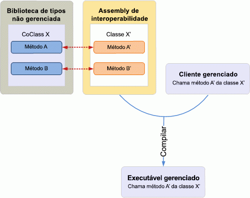
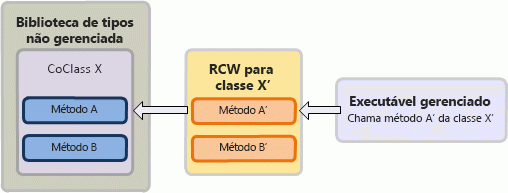

# Introdução à interoperabilidade entre COM e .NETIntroduction to interoperability between COM and .NET

O desenvolvimento de COM (Component Object Model) e .NET tem sistemas de tipo amplamente diferentes e mecanismos para gerenciamento de tempo de vida de objetos, criação e herança de interfaces.The Component Object Model (COM) and .NET development have vastly different type systems and mechanisms for object lifetime management, interface creation, and interface inheritance. 

Por exemplo, um tipo **Variant** no COM é um tipo de dados **System.Object** no .NET Framework.For example, a **Variant** type in COM is a **System.Object** data type in the .NET Framework. Para criar um objeto, um cliente COM chama [CoCreateInstance](https://docs.microsoft.com/windows/desktop/api/combaseapi/nf-combaseapi-cocreateinstance), ao passo que um cliente gerenciado pode usar palavras-chave como "new" ou "New", que são integradas em uma linguagem de programação gerenciada.To create an object, a COM client calls [CoCreateInstance](https://docs.microsoft.com/windows/desktop/api/combaseapi/nf-combaseapi-cocreateinstance), whereas a managed client can use keywords such as new or New that are built in to a managed programming language. 

Embora COM não ofereça suporte à herança clássica e um cliente COM gerencie uma contagem de referências internas fornecida por [IUnknown](https://docs.microsoft.com/windows/desktop/api/unknwn/nn-unknwn-iunknown) para liberar uma coclasse, um cliente gerenciado depende do coletor de lixo de CLR (Common Language Runtime) fornecido pelo .NET Framework para liberar um objeto.While COM does not support classical inheritance and a COM client manages an internal reference count provided by [IUnknown](https://docs.microsoft.com/windows/desktop/api/unknwn/nn-unknwn-iunknown) to free a coclass, a managed client relies on the common language runtime (CLR) garbage collector provided by the .NET Framework to free an object. 

Dadas essas diferenças entre o desenvolvimento de COM e .NET, desenvolver um cliente gerenciado em um modelo de objeto COM requer um mecanismo que resolva essas diferenças.Given such differences between COM and .NET development, developing a managed client on a COM object model requires a mechanism that resolves these differences. O RCW (Runtime Callable Wrapper) é um mecanismo que promove a comunicação transparente entre COM e o modelo de programação gerenciado.The Runtime Callable Wrapper (RCW) is a mechanism that promotes transparent communication between COM and the managed programming model.

Este tópico fornece uma descrição de alto nível de como o RCW facilita a comunicação entre COM e o modelo de programação gerenciado.This topic gives a high-level description of how the RCW facilitates communication between COM and the managed programming model. Observe que, embora este tópico use o Visual Studio para ilustrar o mecanismo RCW, você pode usar um assembly de interoperabilidade fora do Visual Studio para desenvolver um cliente gerenciado.Note that even though this topic uses Visual Studio to illustrate the RCW mechanism, you can use an interop assembly outside of Visual Studio to develop a managed client.

## Promover a interoperabilidade: assembly de interoperabilidade e RCWFacilitating interoperability: the Interop Assembly and RCW

### Tempo de compilaçãoCompile time

Um assembly de interoperabilidade define interfaces gerenciadas que mapeiam para uma biblioteca de tipos baseada no COM e com as quais um cliente gerenciado pode interagir.An interop assembly defines managed interfaces that map to a COM-based type library and that a managed client can interact with. Para usar um assembly de interoperabilidade no Visual Studio, primeiro adicione uma referência para o componente COM correspondente.To use an interop assembly in Visual Studio, first add a reference to the corresponding COM component. O Visual Studio gerará automaticamente uma cópia local do assembly de interoperabilidade.Visual Studio will automatically generate a local copy of the interop assembly. O assembly de interoperabilidade contém um namespace, sob o qual há uma interface equivalente gerenciada de cada objeto COM no modelo de objeto COM.The interop assembly contains one namespace, under which there is a managed equivalent interface of each COM object in the COM object model. 

A Figura 1 ilustra um cliente gerenciado que deseja usar uma biblioteca de tipos COM que define a coclasse X. O cliente gerenciado chama X, que é a interface equivalente gerenciada para a coclasse X, conforme definido no assembly de interoperabilidade.Figure 1 illustrates a managed client that wants to use a COM type library that defines coclass X. The managed client calls class X, which is the managed equivalent interface for coclass X, as defined in the interop assembly. No tempo de compilação, o projeto gerenciado é compilado com informações sobre a classe X do assembly de interoperabilidade.At compile time, the managed project is compiled with information about class X from the interop assembly.

**Figura 1. Um aplicativo gerenciado compilado com um assembly de interoperabilidade que interopera com uma biblioteca de tipos não gerenciada****Figure 1. A managed application compiled with an interop assembly that interoperates with an unmanaged type library**

  
Em geral, desde que você defina uma referência a uma biblioteca de tipos, o Visual Studio gera uma cópia de um assembly de interoperabilidade para essa biblioteca de tipos.In general, as long as you set a reference to a type library, Visual Studio generates a copy of an interop assembly for that type library. Pode existir inúmeros assemblies de interoperabilidade para descrever o mesmo tipo COM.Any number of interop assemblies can exist to describe the same COM type. No entanto, uma biblioteca de tipos pode ter apenas um PIA (Assembly de Interoperabilidade Primário), que é o assembly de interoperabilidade publicado pela biblioteca de tipos.However, a type library can have only one Primary Interop Assembly (PIA), which is the interop assembly published by the type library. Ao contrário de outros assemblies de interoperabilidade, o PIA não é gerado sempre que você adiciona uma referência no Visual Studio.Unlike other interop assemblies, the PIA is not generated every time you add a reference in Visual Studio. Em vez disso, você instala o PIA no cache de assembly global (GAC) apenas uma vez em um computador.Instead, you install the PIA to the global assembly cache (GAC) just once on a computer. Quando você adiciona uma referência à biblioteca de tipos, o Visual Studio carrega o PIA automaticamente.When you add a reference to the type library, Visual Studio automatically loads the PIA.

Para programar uma solução gerenciada para o Outlook, você deve usar o PIA do Outlook.To program a managed solution for Outlook, you should use the Outlook PIA. Para incorporar informações do PIA do Outlook em um suplemento gerenciado, primeiro você deve instalar o PIA do Outlook no GAC.To incorporate information from the Outlook PIA into a managed add-in, first you must install the Outlook PIA in the GAC. Se você estiver usando o Visual Studio para criar o projeto gerenciado, depois de adicionar uma referência à biblioteca de tipos do Outlook, o Visual Studio carregará o PIA.If you are using Visual Studio to create the managed project, after adding a reference to the Outlook type library, Visual Studio loads the PIA. No navegador de objetos, sob o namespace Microsoft.Office.Interop.Outlook, você pode ver interfaces gerenciadas com nomes correspondentes a objetos no modelo de objeto do Outlook.In the object browser, under the namespace Microsoft.Office.Interop.Outlook, you can see managed interfaces that have names corresponding to objects in the Outlook object model. Por exemplo, a interface de Conta corresponde ao objeto **Conta** no modelo de objeto do Outlook.For example, the Account interface corresponds to the **Account** object in the Outlook object model. Ao compilar o projeto gerenciado, essas informações serão incorporadas no seu executável.When you compile the managed project, this information is incorporated in your executable.

### Tempo de execuçãoRun time

No tempo de execução, com as informações fornecidas por um assembly de interoperabilidade, o CLR do .NET Framework cria um RCW para cada coclasse com que o cliente gerenciado interage.At run time, with the information provided by an interop assembly, the .NET Framework CLR creates an RCW for each coclass the managed client interacts with. Observe que o tempo de execução cria apenas um RCW para cada coclasse, independentemente de quantas interfaces o cliente obteve da coclasse.Note that the runtime creates only one RCW for each coclass, regardless of how many interfaces the client has obtained from the coclass. O RCW é um tipo de classe do .NET Framework que encapsula a coclasse COM.The RCW is a .NET Framework class type that wraps around the COM coclass. O RCW controla as instâncias da coclasse e lança referências a ela apenas quando o cliente já não precisa mais do RCW.The RCW keeps track of the instances of the coclass and releases references to them only when the client no longer needs the RCW. Dessa forma, um cliente gerenciado não precisa gerenciar o tempo de vida de um objeto da forma que um cliente não gerenciado faria com COM.This way, a managed client does not have to manage the lifetime of an object the way an unmanaged client would under COM.

A Figura 2 ilustra um RCW interceptando uma chamada de API de um cliente gerenciado no tempo de execução, e usando as informações do assembly de interoperabilidade, mapeando de forma transparente a chamada à API correspondente na coclasse COM.Figure 2 illustrates an RCW intercepting an API call from a managed client at run time, and using information from the interop assembly, transparently mapping the call to the corresponding API in the COM coclass. O processo a seguir descreve como isso acontece:The following process describes how this happens:

1.  O cliente gerenciado chama um método "A" da classe "X", conforme definido no assembly de interoperabilidade de uma biblioteca de tipos COM.The managed client calls method A' of class X' as defined in the interop assembly for a COM type library.

2.  Se ainda não existir um RCW para a classe "X", o tempo de execução do .NET Framework usa as informações do assembly de interoperabilidade e cria um RCW para a classe "X".If an RCW does not yet exist for class X', the .NET Framework runtime uses information from the interop assembly and creates an RCW for class X'.

3.  O RCW intercepta a chamada para o método "A", converte os argumentos nos tipos COM correspondentes e invoca o método A da coclasse X conforme definido na biblioteca de tipos COM.The RCW intercepts the call to method A', translates the arguments into corresponding COM types, and invokes method A of coclass X as defined in the COM type library.

**Figura 2. Um RCW intercepta uma chamada de um arquivo executável gerenciado e mapeia a coclasse para uma biblioteca de tipos não gerenciada****Figure 2. An RCW intercepts a call from a managed executable and maps it to a coclass in an unmanaged type library**

  

## Confira tambémSee also

- [Por que usar o PIA do OutlookWhy use the Outlook PIA](why-use-the-outlook-pia.md)
- [Instalar e referenciar o PIA do OutlookInstalling and referencing the Outlook PIA](installing-and-referencing-the-outlook-pia.md)

