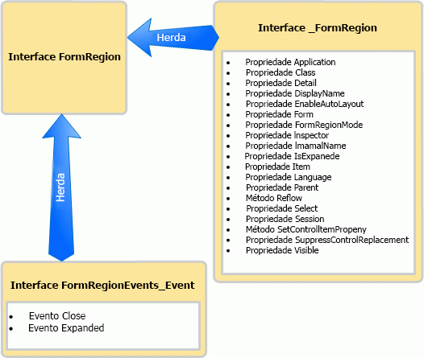

# <a name="methods-and-properties-in-the-outlook-pia"></a><span data-ttu-id="8eea4-102">Métodos e propriedade no Outlook PIA</span><span class="sxs-lookup"><span data-stu-id="8eea4-102">Methods and properties in the Outlook PIA</span></span>

<span data-ttu-id="8eea4-103">Este tópico descreve como acessar métodos e propriedades de um objeto em código gerenciado usando a Assembly de Interoperabilidade Primário do Outlook (PIA).</span><span class="sxs-lookup"><span data-stu-id="8eea4-103">This topic describes how to access methods and properties of an object in managed code by using the Outlook Primary Interop Assembly (PIA).</span></span>

## <a name="where-helper-objects-come-from"></a><span data-ttu-id="8eea4-104">De onde vêm os objetos auxiliares</span><span class="sxs-lookup"><span data-stu-id="8eea4-104">Where Helper objects come from</span></span>

<span data-ttu-id="8eea4-105">Para criar o Outlook PIA, o Outlook usa o Importador de Bibliotecas de Tipos (TLBIMP) no .NET Framework para converter definições de tipos da biblioteca de tipos COM em definições equivalentes em um assembly de tempo de execução em linguagem comum (CLR).</span><span class="sxs-lookup"><span data-stu-id="8eea4-105">To create the Outlook PIA, Outlook uses the Type Library Importer (TLBIMP) in the .NET Framework to convert type definitions in the COM type library into equivalent definitions in a common language runtime (CLR) assembly.</span></span> <span data-ttu-id="8eea4-106">No COM, um objeto é, de fato, uma co-classe que consiste no seguinte:</span><span class="sxs-lookup"><span data-stu-id="8eea4-106">In COM, an object is actually a coclass that consists of the following:</span></span>

- <span data-ttu-id="8eea4-107">A interface primária (por exemplo, a interface [ \_FormRegion](https://msdn.microsoft.com/library/bb645761\(v=office.15\))).</span><span class="sxs-lookup"><span data-stu-id="8eea4-107">The primary interface (for example, the [\_FormRegion](https://msdn.microsoft.com/library/bb645761\(v=office.15\)) interface).</span></span>

- <span data-ttu-id="8eea4-108">A interface de eventos(por exemplo, a interface [FormRegionEvents](https://msdn.microsoft.com/library/bb611940\(v=office.15\))).</span><span class="sxs-lookup"><span data-stu-id="8eea4-108">The event interface (for example, the [FormRegionEvents](https://msdn.microsoft.com/library/bb611940\(v=office.15\)) interface).</span></span>

<span data-ttu-id="8eea4-109">O TLBIMP importa a interface primária e a interface de eventos para cada objeto e cria uma quantidade de interfaces, representantes e classes, entre os quais os seguintes:</span><span class="sxs-lookup"><span data-stu-id="8eea4-109">TLBIMP imports the primary interface and the event interface for each object and creates a number of interfaces, delegates, and classes, among which are the following:</span></span>

- <span data-ttu-id="8eea4-110">A interface de eventos .NET (por exemplo, a interface [FormRegionEvents\_Event](https://msdn.microsoft.com/library/bb647619\(v=office.15\))).</span><span class="sxs-lookup"><span data-stu-id="8eea4-110">The .NET event interface (for example, the [FormRegionEvents\_Event](https://msdn.microsoft.com/library/bb647619\(v=office.15\)) interface).</span></span>

- <span data-ttu-id="8eea4-111">A classe .NET (por exemplo, a classe [FormRegionClass](https://msdn.microsoft.com/library/bb624204\(v=office.15\))).</span><span class="sxs-lookup"><span data-stu-id="8eea4-111">The .NET class (for example, the [FormRegionClass](https://msdn.microsoft.com/library/bb624204\(v=office.15\)) class).</span></span>

- <span data-ttu-id="8eea4-112">A interface .NET (por exemplo, a interface [FormRegion](https://msdn.microsoft.com/library/bb652633\(v=office.15\))).</span><span class="sxs-lookup"><span data-stu-id="8eea4-112">The .NET interface (for example, the [FormRegion](https://msdn.microsoft.com/library/bb652633\(v=office.15\)) interface).</span></span>

## <a name="what-the-helper-objects-are-for"></a><span data-ttu-id="8eea4-113">Para que servem os objetos auxiliares</span><span class="sxs-lookup"><span data-stu-id="8eea4-113">What the Helper objects are for</span></span>

<span data-ttu-id="8eea4-114">Continuando a usar o objeto **FormRegion** como exemplo, a lista a seguir examina o que contêm cada uma das interfaces e classes listadas anteriormente.</span><span class="sxs-lookup"><span data-stu-id="8eea4-114">Continuing to use the **FormRegion** object as an example, the following list examines what each interface and class listed earlier contains.</span></span>

- <span data-ttu-id="8eea4-115">A interface \_FormRegion define todos os métodos e propriedades de FormRegion.</span><span class="sxs-lookup"><span data-stu-id="8eea4-115">The \_FormRegion interface defines all the methods and properties of FormRegion.</span></span> <span data-ttu-id="8eea4-116">Normalmente, você não usa esta interface em código, exceto na condição descrita abaixo.</span><span class="sxs-lookup"><span data-stu-id="8eea4-116">Typically you do not use this interface in code, except for a condition discussed below.</span></span>

- <span data-ttu-id="8eea4-117">A interface **FormRegionEvents** define métodos de mapeamento para eventos de FormRegion.</span><span class="sxs-lookup"><span data-stu-id="8eea4-117">The **FormRegionEvents** interface defines methods mapping to events of FormRegion.</span></span> <span data-ttu-id="8eea4-118">Não use essa interface com código.</span><span class="sxs-lookup"><span data-stu-id="8eea4-118">You do not use this interface in code.</span></span>

- <span data-ttu-id="8eea4-119">O TLBIMP também processa a interface **FormRegionEvents** para criar a interface **FormRegionEvents**\_Event que define todos os eventos de FormRegion.</span><span class="sxs-lookup"><span data-stu-id="8eea4-119">TLBIMP further processes the **FormRegionEvents** interface to create the **FormRegionEvents**\_Event interface that defines all the events of FormRegion.</span></span> <span data-ttu-id="8eea4-120">Normalmente, você não usa esta interface em código, exceto na condição descrita abaixo.</span><span class="sxs-lookup"><span data-stu-id="8eea4-120">Typically you do not use this interface in code, except for a condition discussed below.</span></span>

- <span data-ttu-id="8eea4-121">A classe FormRegionClass define todos os membros de métodos, propriedades e eventos de FormRegion.</span><span class="sxs-lookup"><span data-stu-id="8eea4-121">The FormRegionClass class defines all the method, property, and event members of FormRegion.</span></span> <span data-ttu-id="8eea4-122">Esta é a classe à qual a interface FormRegion é atribuída para associar-se com os bastidores, de modo que você possa escrever um código para criar uma instância da interface FormRegion.</span><span class="sxs-lookup"><span data-stu-id="8eea4-122">This is the class that the FormRegion interface is attributed to associate with behind the scenes so that you can write code to create an instance of the FormRegion interface.</span></span> <span data-ttu-id="8eea4-123">Porém, você não deve usar essa interface diretamente em código.</span><span class="sxs-lookup"><span data-stu-id="8eea4-123">However, you do not use this interface directly in code.</span></span>

- <span data-ttu-id="8eea4-124">A interface FormRegion herda a interface \_FormRegion interface e a interface**FormRegionEvents**\_Event.</span><span class="sxs-lookup"><span data-stu-id="8eea4-124">The FormRegion interface inherits the \_FormRegion interface and the **FormRegionEvents**\_Event interface.</span></span> <span data-ttu-id="8eea4-125">A Figura 1 ilustra esta relação de herança.</span><span class="sxs-lookup"><span data-stu-id="8eea4-125">Figure 1 illustrates this inheritance relationship.</span></span>
    
  <span data-ttu-id="8eea4-126">**Figura 1. A interface FormRegion herda métodos e propriedades da interface \_FormRegion e herda eventos da interface FormRegionEvents\_Event**</span><span class="sxs-lookup"><span data-stu-id="8eea4-126">**Figure 1. The FormRegion interface inherits methods and properties from the \_FormRegion interface, and inherits events from the FormRegionEvents\_Event interface**</span></span>

  
    
  <span data-ttu-id="8eea4-128">Normalmente, FormRegion é a única interface que você usa em código gerenciado para acessar o objeto e os membros de método, propriedade e evento do objeto **FormRegion**.</span><span class="sxs-lookup"><span data-stu-id="8eea4-128">Typically, FormRegion is the one interface you use in managed code to access the object and the method, property, and event members of the **FormRegion** object.</span></span>

<span data-ttu-id="8eea4-129">Usando o objeto **Application** como outro exemplo, você acessa o objeto **Application**, métodos, propriedade e eventos através da interface [Application](https://msdn.microsoft.com/library/bb646615\(v=office.15\)).</span><span class="sxs-lookup"><span data-stu-id="8eea4-129">Using the **Application** object as another example, you access the **Application** object, methods, properties, and events through the [Application](https://msdn.microsoft.com/library/bb646615\(v=office.15\)) interface.</span></span> <span data-ttu-id="8eea4-130">Entretanto, existem três exceções nas quais você deve usar uma interface diferente ou, dependendo da linguagem, você desejaria usar uma interface diferente:</span><span class="sxs-lookup"><span data-stu-id="8eea4-130">There are however three exceptions where you must use a different interface, or depending on the language, you would want to use a different interface:</span></span>

- <span data-ttu-id="8eea4-131">Quando você acessa um método que compartilha o mesmo nome de um evento, uma prática recomendada é converter a interface primária para chamar o método.</span><span class="sxs-lookup"><span data-stu-id="8eea4-131">When you access a method that shares the same name as an event, a good practice is to cast to the primary interface to call the method.</span></span> <span data-ttu-id="8eea4-132">Por exemplo, o objeto **Application** tem um método [Quit](https://msdn.microsoft.com/library/bb646614\(v=office.15\)) e um evento[Quit](https://msdn.microsoft.com/library/bb622595\(v=office.15\)).</span><span class="sxs-lookup"><span data-stu-id="8eea4-132">For example, the **Application** object has a [Quit](https://msdn.microsoft.com/library/bb646614\(v=office.15\)) method and a [Quit](https://msdn.microsoft.com/library/bb622595\(v=office.15\)) event.</span></span> <span data-ttu-id="8eea4-133">No Visual Basic .NET, você pode acessar o método Quit através da interface Application.</span><span class="sxs-lookup"><span data-stu-id="8eea4-133">In Visual Basic .NET, you can access the Quit method through the Application interface.</span></span> <span data-ttu-id="8eea4-134">Em C\#, é possível evitar um aviso do compilador ao converter o método Quit para a interface primária, como mostrado na seguinte amostra de código:</span><span class="sxs-lookup"><span data-stu-id="8eea4-134">In C\#, you can avoid a compiler warning by casting the Quit method to the primary interface, as shown in the following code sample:</span></span>
    
   ```csharp
      void DemoApp()
      {
          Outlook.Application myApp = new Outlook.Application();
          // Other application code here
          ((Outlook._Application)myApp).Quit();
      }
   ```

- <span data-ttu-id="8eea4-135">Quando você acessa um evento que compartilha o mesmo nome de um método daquele objeto, você deve converter a interface de eventos apropriada para conectar-se com o evento.</span><span class="sxs-lookup"><span data-stu-id="8eea4-135">When you access an event that shares the same name as a method of that object, you must cast to the appropriate event interface to connect to the event.</span></span> <span data-ttu-id="8eea4-136">Semelhante ao exemplo acima, para se conectar ao evento Quit, converta para a interface [ApplicationEvents\_11\_Event](https://msdn.microsoft.com/library/bb622725\(v=office.15\)).</span><span class="sxs-lookup"><span data-stu-id="8eea4-136">Similar to the example above, to connect to the Quit event, you cast to the [ApplicationEvents\_11\_Event](https://msdn.microsoft.com/library/bb622725\(v=office.15\)) interface.</span></span>

- <span data-ttu-id="8eea4-137">Quando você se conectar a uma versão anterior de um evento foi estendida posteriormente em uma versão posterior do Outlook, você deve se conectar à versão do evento na interface anterior.</span><span class="sxs-lookup"><span data-stu-id="8eea4-137">When you connect to an earlier version of an event that has been subsequently extended in a later version of Outlook, you must connect to the version of the event in the earlier interface.</span></span> <span data-ttu-id="8eea4-138">Por exemplo, se você deseja se conectar à versão do evento Quit para o objeto **Application** implementado para Outlook 2002 em vez da versão mais recente, conecte-se ao evento [Quit](https://msdn.microsoft.com/library/bb609660\(v=office.15\)) definido para a interface[ApplicationEvents\_10\_Event](https://msdn.microsoft.com/library/bb610098\(v=office.15\)) em vez do evento definido na interface ApplicationEvents\_11\_Event.</span><span class="sxs-lookup"><span data-stu-id="8eea4-138">For example, if you want to connect to the version of the Quit event for the **Application** object implemented for Outlook 2002 instead of the latest version, connect to the [Quit](https://msdn.microsoft.com/library/bb609660\(v=office.15\)) event defined in the [ApplicationEvents\_10\_Event](https://msdn.microsoft.com/library/bb610098\(v=office.15\)) interface, instead of the Quit event defined in the ApplicationEvents\_11\_Event interface.</span></span>

## <a name="see-also"></a><span data-ttu-id="8eea4-139">Confira também</span><span class="sxs-lookup"><span data-stu-id="8eea4-139">See also</span></span>

- [<span data-ttu-id="8eea4-140">Associar o Outlook PIA ao modelo de objeto</span><span class="sxs-lookup"><span data-stu-id="8eea4-140">Relating the Outlook PIA with the object model</span></span>](relating-the-outlook-pia-with-the-object-model.md)
- [<span data-ttu-id="8eea4-141">Objetos no Outlook PIA</span><span class="sxs-lookup"><span data-stu-id="8eea4-141">Objects in the Outlook PIA</span></span>](objects-in-the-outlook-pia.md)
- [<span data-ttu-id="8eea4-142">Eventos no Outlook PIA</span><span class="sxs-lookup"><span data-stu-id="8eea4-142">Events in the Outlook PIA</span></span>](events-in-the-outlook-pia.md)

