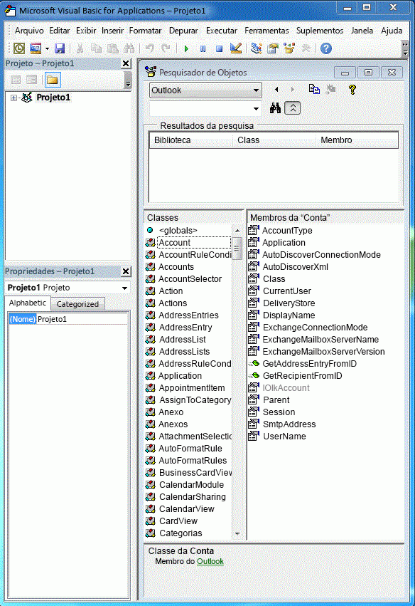
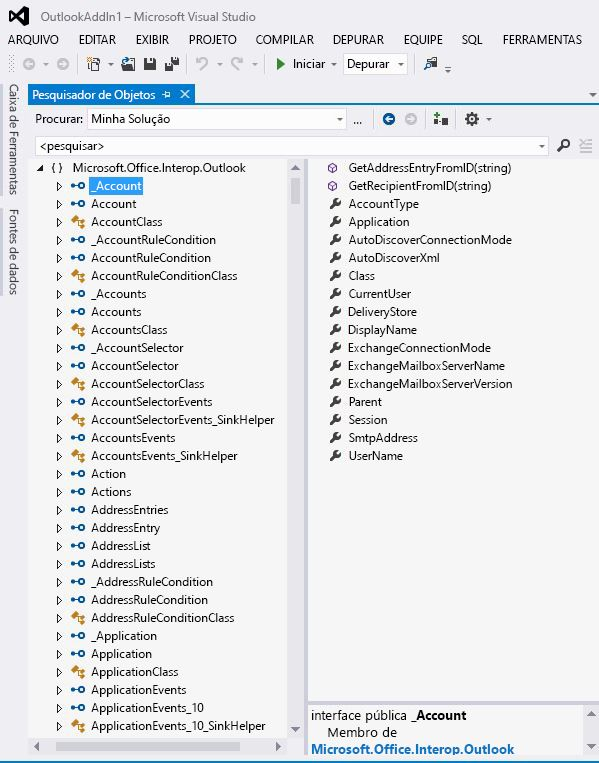

# Associar o Outlook PIA ao modelo de objetoRelating the Outlook PIA with the object model

O Outlook Primary Interop Assembly (Montagem Interoperacional Principal - PIA) é uma montagem interoperacional oficialmente publicada pelo Outlook que define uma interface gerenciada para suplementos gerenciados para interagir com o modelo de objeto do Outlook baseado em COM.The Outlook Primary Interop Assembly (PIA) is an interop assembly officially published by Outlook defining a managed interface for managed add-ins to interact with the COM-based Outlook object model. A [Introdução à interoperabilidade entre COM e .NET](introduction-to-interoperability-between-com-and-net.md) descreve tecnicamente como uma montagem interoperacional suporta uma programação de cliente gerenciado contra uma biblioteca de tipos baseada em COM.[Introduction to interoperability between COM and .NET](introduction-to-interoperability-between-com-and-net.md) describes technically how an interop assembly supports a managed client programming against a COM-based type library. Este tópico fornece uma visão geral de como os objetos e membros no modelo de objeto do Outlook baseado em COM são mapeados para as interfaces e classes gerenciadas correspondentes na PIA.This topic gives an overview of how objects and members in the COM-based Outlook object model are mapped to corresponding managed interfaces and classes in the PIA.

## Objetos auxiliaresHelper objects

Quando você compara os objetos da biblioteca de tipos do Outlook listada no pesquisador de objetos do Visual Basic Editor, como na Figura 1, com os objetos da PIA listados no pesquisador de objetos do Visual Studio, como na Figura 2, você pode se sentir sobrecarregado pelo grande número de objetos auxiliares extras que existem na PIA.When you compare the objects of the Outlook type library listed in the object browser of the Visual Basic Editor, as in Figure 1, with the objects of the PIA listed in the object browser of Visual Studio, as in Figure 2, you might be overwhelmed by the large number of extra helper objects that exist in the PIA. Você pode notar que alguns objetos, como o objeto **Action**, mapeiam-se com uma interface, a interface [Action](https://msdn.microsoft.com/library/bb646971\(v=office.15\)), mas outros objetos, como o objeto **Account**, não se mapeiam necessariamente com uma interface correspondente exata na PIA.You might notice that some objects, such as the **Action** object, maps to one interface, the [Action](https://msdn.microsoft.com/library/bb646971\(v=office.15\)) interface, but other objects, like the **Account** object, do not necessarily map to exactly one corresponding interface in the PIA.

**Figura 1. Pesquisador de objetos mostrando os objetos na biblioteca de tipos do Outlook baseada em COM****Figure 1. Object browser showing objects in the COM-based Outlook type library**

**Figura 2. Pesquisador de objetos mostrando objetos no Outlook****Figure 2. Object browser showing objects in Outlook**

Entre essas interfaces, muitas delas têm nomes que começam com um caractere de sublinhado ('\_') seguido pelo nome do objeto.Among these interfaces, many of them have names that begin with an underscore ('\_') followed by an object name. Por exemplo, o objeto **Account** mapeia-se com uma interface pública\_Account e com uma classe pública Account no pesquisador de objetos do Visual Studio.For example, the **Account** object maps to a public interface \_Account and a public class Account in the Visual Studio object browser. Na verdade, embora não seja mostrado explicitamente no pesquisador de objetos do Visual Studio, o objeto **Account** é mapeado com duas interfaces e uma classe na PIA: uma interface [\_Account](https://msdn.microsoft.com/library/bb609471\(v=office.15\)), uma co-classe [Account](https://msdn.microsoft.com/library/bb645103\(v=office.15\)) e uma classe [AccountClass](https://msdn.microsoft.com/library/bb645768\(v=office.15\)).In fact, though not shown explicitly in the Visual Studio object browser, the **Account** object is mapped to two interfaces and one class in the PIA: an [\_Account](https://msdn.microsoft.com/library/bb609471\(v=office.15\)) interface, an [Account](https://msdn.microsoft.com/library/bb645103\(v=office.15\)) coclass, and an [AccountClass](https://msdn.microsoft.com/library/bb645768\(v=office.15\)) class. 

Para mais informações sobre esses interfaces, co-classe e classes, de onde elas vêm e como os objetos são mapeados a partir da biblioteca de tipos para a PIA, confira [Objetos no Outlook PIA](objects-in-the-outlook-pia.md).For more information about these interfaces, coclasses and classes, where they come from, and how objects are mapped from the type library to the PIA, see [Objects in the Outlook PIA](objects-in-the-outlook-pia.md).

## Interfaces de eventos separadosSeparate event interfaces

Se você examinar os objetos que têm eventos, os eventos na PIA não são agrupados juntos com outro método e membros de propriedade daquele objeto, mas são agrupados para formar suas próprias interfaces, manipuladores de eventos e classes.If you examine objects that have events, events in the PIA are not grouped together with other method and property members of that object, but are grouped to form their own interfaces, event handlers, and classes. 

Para mais informações sobre como métodos e propriedades são mapeados a partir da biblioteca de tipos para o PIA, confira [Métodos e propriedades no Outlook PIA](methods-and-properties-in-the-outlook-pia.md).For more information about how methods and properties are mapped from the type library to the PIA, see [Methods and properties in the Outlook PIA](methods-and-properties-in-the-outlook-pia.md). Para mais informações sobre interfaces de eventos, representantes e classes, confira [Eventos no Outlook PIA](events-in-the-outlook-pia.md).For more information about event interfaces, delegates, and classes, see [Events in the Outlook PIA](events-in-the-outlook-pia.md).

## Objetos ocultos e preteridosHidden and deprecated objects

O PIA também contém objetos, membros e enumerações que foram preteridos e marcados opcionalmente como ocultos no modelo de objeto COM.The PIA also contains objects, members, and enumerations that have been deprecated and optionally marked as hidden in the COM object model. A maioria desses objetos, membros e enumerações é exposta na PIA.Most of these objects, members, and enumerations are exposed in the PIA. No entanto, eles são expostos para a completude da PIA; não são mais destinados a serem usados por desenvolvedores de soluções e, portanto, são minimamente documentados.However, they are exposed for the completeness of the PIA; they are no longer intended to be used by solution developers and are therefore minimally documented. Algumas exceções existem, como os objetos \*\* \_DocSiteControl\*\* e \*\* \_RecipientControl\*\*, que estão ocultos na biblioteca de tipos, mas são expostos como objetos de primeira classe na referência da PIA.A few exceptions exist such as the **\_DocSiteControl** and **\_RecipientControl** objects, which are hidden in the type library but are exposed and documented as first class objects in the PIA reference. 

Para saber mais sobre o objeto \*\* \_DocSiteControl\*\*, confira [ \_DDocSiteControl](https://msdn.microsoft.com/library/bb609520\(v=office.15\)).For more information about the **\_DocSiteControl** object, see [\_DDocSiteControl](https://msdn.microsoft.com/library/bb609520\(v=office.15\)). Para saber mais sobre o objeto \*\* \_RecipientControl\*\*, confira [ \_DRecipientControl](https://msdn.microsoft.com/library/bb609501\(v=office.15\)).For more information about the **\_RecipientControl** object, see [\_DRecipientControl](https://msdn.microsoft.com/library/bb609501\(v=office.15\)).

