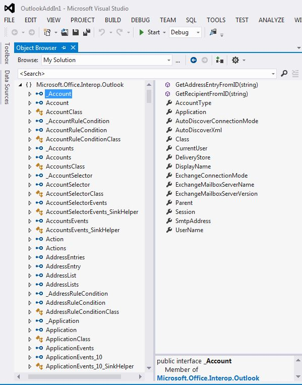

# Associar o Outlook PIA ao modelo de objeto

O Outlook Primary Interop Assembly (Montagem Interoperacional Principal - PIA) é uma montagem interoperacional oficialmente publicada pelo Outlook que define uma interface gerenciada para suplementos gerenciados para interagir com o modelo de objeto do Outlook baseado em COM. A [Introdução à interoperabilidade entre COM e .NET](introduction-to-interoperability-between-com-and-net.md) descreve tecnicamente como uma montagem interoperacional suporta uma programação de cliente gerenciado contra uma biblioteca de tipos baseada em COM. Este tópico fornece uma visão geral de como os objetos e membros no modelo de objeto do Outlook baseado em COM são mapeados para as interfaces e classes gerenciadas correspondentes na PIA.

## Objetos auxiliares

Quando você compara os objetos da biblioteca de tipos do Outlook listada no pesquisador de objetos do Visual Basic Editor, como na Figura 1, com os objetos da PIA listados no pesquisador de objetos do Visual Studio, como na Figura 2, você pode se sentir sobrecarregado pelo grande número de objetos auxiliares extras que existem na PIA. Você pode notar que alguns objetos, como o objeto **Action**, mapeiam-se com uma interface, a interface [Action](https://msdn.microsoft.com/library/bb646971\(v=office.15\)), mas outros objetos, como o objeto **Account**, não se mapeiam necessariamente com uma interface correspondente exata na PIA.

**Figura 1. Pesquisador de objetos mostrando os objetos na biblioteca de tipos do Outlook baseada em COM**

**Figura 2. Pesquisador de objetos mostrando objetos no Outlook**

Entre essas interfaces, muitas delas têm nomes que começam com um caractere de sublinhado ('\_') seguido pelo nome do objeto. Por exemplo, o objeto **Account** mapeia-se com uma interface pública\_Account e com uma classe pública Account no pesquisador de objetos do Visual Studio. Na verdade, embora não seja mostrado explicitamente no pesquisador de objetos do Visual Studio, o objeto **Account** é mapeado com duas interfaces e uma classe na PIA: uma interface [\_Account](https://msdn.microsoft.com/library/bb609471\(v=office.15\)), uma co-classe [Account](https://msdn.microsoft.com/library/bb645103\(v=office.15\)) e uma classe [AccountClass](https://msdn.microsoft.com/library/bb645768\(v=office.15\)). 

Para mais informações sobre esses interfaces, co-classe e classes, de onde elas vêm e como os objetos são mapeados a partir da biblioteca de tipos para a PIA, confira [Objetos no Outlook PIA](objects-in-the-outlook-pia.md).

## Interfaces de eventos separados

Se você examinar os objetos que têm eventos, os eventos na PIA não são agrupados juntos com outro método e membros de propriedade daquele objeto, mas são agrupados para formar suas próprias interfaces, manipuladores de eventos e classes. 

Para mais informações sobre como métodos e propriedades são mapeados a partir da biblioteca de tipos para o PIA, confira [Métodos e propriedades no Outlook PIA](methods-and-properties-in-the-outlook-pia.md). Para mais informações sobre interfaces de eventos, representantes e classes, confira [Eventos no Outlook PIA](events-in-the-outlook-pia.md).

## Objetos ocultos e preteridos

O PIA também contém objetos, membros e enumerações que foram preteridos e marcados opcionalmente como ocultos no modelo de objeto COM. A maioria desses objetos, membros e enumerações é exposta na PIA. No entanto, eles são expostos para a completude da PIA; não são mais destinados a serem usados por desenvolvedores de soluções e, portanto, são minimamente documentados. Algumas exceções existem, como os objetos ** \_DocSiteControl** e ** \_RecipientControl**, que estão ocultos na biblioteca de tipos, mas são expostos como objetos de primeira classe na referência da PIA. 

Para saber mais sobre o objeto ** \_DocSiteControl**, confira [ \_DDocSiteControl](https://msdn.microsoft.com/library/bb609520\(v=office.15\)). Para saber mais sobre o objeto ** \_RecipientControl**, confira [ \_DRecipientControl](https://msdn.microsoft.com/library/bb609501\(v=office.15\)).

