# Escolher uma API ou tecnologia para desenvolver soluções para o OutlookSelecting an API or technology for developing solutions for Outlook

Este artigo descreve as APIs e tecnologias que você pode usar para estender o Outlook 2013 e o Outlook 2016 e ajuda você a se decidir pela API ou a tecnologia apropriada para seu cenário.This article describes the APIs and technologies that you can use to extend Outlook 2013 and Outlook 2016, and helps you decide the appropriate API or technology for your scenario.
  
A Microsoft oferece suporte a várias APIs e tecnologias que estendem o Outlook:Microsoft supports various APIs and technologies that extend Outlook: 
  
- Starting in Office 2013, the apps for Office platform opens up opportunities to extend Outlook functionality across Outlook clients on the desktop, tablet and smart phone. The platform includes a JavaScript API for Office and a schema for app manifests.Starting in Office 2013, the apps for Office platform opens up opportunities to extend Outlook functionality across Outlook clients on the desktop, tablet and smart phone. The platform includes a JavaScript API for Office and a schema for app manifests.
    
- The object model, the corresponding Outlook Primary Interop Assembly (PIA), and the Messaging API (MAPI) have been the most commonly used APIs in Outlook solutions.The object model, the corresponding Outlook Primary Interop Assembly (PIA), and the Messaging API (MAPI) have been the most commonly used APIs in Outlook solutions.
    
- The auxiliary APIs complement MAPI in a few scenarios.The auxiliary APIs complement MAPI in a few scenarios.
    
- Outlook Social Connector (OSC) provider extensibility and the Weather Bar extensibility serve specific scenarios of their niche markets.Outlook Social Connector (OSC) provider extensibility and the Weather Bar extensibility serve specific scenarios of their niche markets.
    
This article explains the selection criteria for the Suplementos do Office platform, the object model, PIA, and MAPI. Note that Suplementos do Office use the JavaScript API for Office and do not call into the object model, and vice versa. Solutions that use the other APIs can use one or more APIs. For example, a COM add-in written in C++ can use the object model, MAPI, and auxiliary APIs in the same solution.This article explains the selection criteria for the Office Add-ins platform, the object model, PIA, and MAPI. Note that Office Add-ins use the JavaScript API for Office and do not call into the object model, and vice versa. Solutions that use the other APIs can use one or more APIs. For example, a COM add-in written in C++ can use the object model, MAPI, and auxiliary APIs in the same solution.
  
To get the most benefit from this article, you should be familiar with Outlook at the user level and have general software development knowledge. However, you do not need to have a comprehensive understanding of the features that these APIs or technologies support. The article helps answer the following questions:To get the most benefit from this article, you should be familiar with Outlook at the user level and have general software development knowledge. However, you do not need to have a comprehensive understanding of the features that these APIs or technologies support. The article helps answer the following questions:
  
- If you have only an idea about the goals of your solution, the target market, and available resources, what other criteria should you consider to select an API?If you have only an idea about the goals of your solution, the target market, and available resources, what other criteria should you consider to select an API?
    
- Why would you consider Suplementos do Office, and when would you choose to create apps as opposed to add-ins?Why would you consider Office Add-ins, and when would you choose to create apps as opposed to add-ins?
    
- If your solution has to run on earlier versions of Outlook, including Outlook 2003, how does that affect your API choice?If your solution has to run on earlier versions of Outlook, including Outlook 2003, how does that affect your API choice?
    
- If your solution has to iterate through Outlook folders that contain thousands of items, and you need to be able to modify those items, which API would work best?If your solution has to iterate through Outlook folders that contain thousands of items, and you need to be able to modify those items, which API would work best?
    
- If your solution relies heavily on Outlook business logic and interacts with other Office applications, is the Outlook object model the best choice?If your solution relies heavily on Outlook business logic and interacts with other Office applications, is the Outlook object model the best choice?
    
- What do the object model and MAPI allow you to extend in Outlook?What do the object model and MAPI allow you to extend in Outlook?
    
- Se for possível usar o modelo de objeto ou o MAPI para realizar sua tarefa, como você deverá decidir qual API usar?If you can use either the object model or MAPI to achieve your task, how should you decide which API to use?

## Critérios de avaliação objetivaObjective evaluation criteria

This section describes criteria that you can use to compare the Suplementos do Office platform, object model, PIA, and MAPI to determine which better meets your needs. Different criteria can be more or less important, depending on your projects and available resources.This section describes criteria that you can use to compare the Office Add-ins platform, object model, PIA, and MAPI to determine which better meets your needs. Different criteria can be more or less important, depending on your projects and available resources.
  
The tables in this section define evaluation criteria in the following categories:The tables in this section define evaluation criteria in the following categories:
  
- Functional criteriaDescribes the things you can and cannot do with the technology.Functional criteria—Describes the things you can and cannot do with the technology.
    
- Development criteriaDescribes the development tools or information you need to use the technologyDevelopment criteria—Describes the development tools or information you need to use the technology
    
- Security criteriaDescribes the security and permissions issues related to the technology.Security criteria—Describes the security and permissions issues related to the technology.
    
- Deployment criteriaDescribes the recommended deployment and distribution methods for the technology.Deployment criteria—Describes the recommended deployment and distribution methods for the technology.

### Critérios de avaliação objetiva para os aplicativos da plataforma OfficeObjective evaluation criteria for the apps for Office platform

Starting in Office 2013, developers can use the Suplementos do Office platform to extend web services and content into the context of Office rich and web clients. An Suplemento do Office is a web page that is developed using common web technologies, hosted inside an Office client application (such as Outlook), and can run on-premises or in the cloud. Of the few types of Suplementos do Office, the type that Outlook supports is called mail apps. While the object model, PIA, and MAPI are often used to automate Outlook at an application level, you can use the JavaScript API for Office to interact at an item level with the content and properties of an email message, meeting request, or appointment. You can publish mail apps to the Office Store or an internal Exchange catalog.Starting in Office 2013, developers can use the Office Add-ins platform to extend web services and content into the context of Office rich and web clients. An Office Add-in is a web page that is developed using common web technologies, hosted inside an Office client application (such as Outlook), and can run on-premises or in the cloud. Of the few types of Office Add-ins, the type that Outlook supports is called mail apps. While the object model, PIA, and MAPI are often used to automate Outlook at an application level, you can use the JavaScript API for Office to interact at an item level with the content and properties of an email message, meeting request, or appointment. You can publish mail apps to the Office Store or an internal Exchange catalog. 
  
End users and administrators can install mail apps on an Exchange mailbox, and use mail apps in the Outlook rich client as well as Outlook Web App. As a developer, you can choose to make your mail app available on only the desktop, or also on the tablet or smart phone. Figure 1 shows an example of a YouTube mail app, which is described in detail in [Exemplo: Criar um aplicativo de email para exibir vídeos do YouTube no Outlook](https://code.msdn.microsoft.com/office/Mail-apps-for-Outlook-01c9248f). The YouTube mail app allows end users select a URL for a YouTube video and watch the video within Outlook or Outlook Web App, on the desktop or tablet.End users and administrators can install mail apps on an Exchange mailbox, and use mail apps in the Outlook rich client as well as Outlook Web App. As a developer, you can choose to make your mail app available on only the desktop, or also on the tablet or smart phone. Figure 1 shows an example of a YouTube mail app, which is described in detail in [Sample: Create a mail add-in to view YouTube videos in Outlook](https://code.msdn.microsoft.com/office/Mail-apps-for-Outlook-01c9248f). The YouTube mail app allows end users select a URL for a YouTube video and watch the video within Outlook or Outlook Web App, on the desktop or tablet.
  
**Figure 1. YouTube mail app is active for the selected message, which contains a URL to a video on YouTube.com****Figure 1. YouTube mail app is active for the selected message, which contains a URL to a video on YouTube.com**

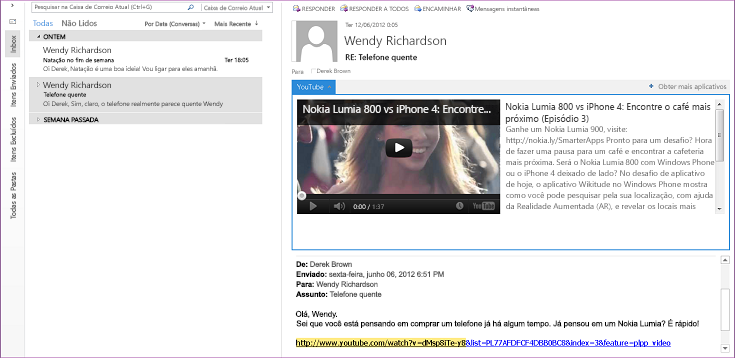
  
After a user installs a mail app, the app is available for use in the app bar when the current context matches the activation conditions that the app specifies. A mail apps allows you to specify rules about the currently selected item that activate a mail app only if certain conditions are met. For example, the YouTube mail app that lets you play a YouTube video within Outlook is relevant only when the selected Outlook item contains a URL to a video on YouTube.com. In this case, you would specify that the app should be active only when the selected message contains such a URL.After a user installs a mail app, the app is available for use in the app bar when the current context matches the activation conditions that the app specifies. A mail apps allows you to specify rules about the currently selected item that activate a mail app only if certain conditions are met. For example, the YouTube mail app that lets you play a YouTube video within Outlook is relevant only when the selected Outlook item contains a URL to a video on YouTube.com. In this case, you would specify that the app should be active only when the selected message contains such a URL.
  
The following tables show the evaluation criteria for the Suplementos do Office platform.The following tables show the evaluation criteria for the Office Add-ins platform.
  
#### Functional criteriaFunctional criteria

|**Criteria****Criteria**|**Mail apps support in apps for Office platform****Mail apps support in apps for Office platform**|
|:-----|:-----|
|Application domainApplication domain    |The scope of activity of a mail app is virtually any supported message or appointment item in the user's Exchange mailbox that the user has selected and that satisfies the activation conditions. The permissions of a mail app determine its access to the properties and specific entities (such as an email address or telephone number) that exist for that item. For example, a mail app requesting the **read/write mailbox** permission can read and write all the properties of any item in the user's mailbox; create, read, and write to any folder or item; and send an item from that mailbox.  The scope of activity of a mail app is virtually any supported message or appointment item in the user's Exchange mailbox that the user has selected and that satisfies the activation conditions. The permissions of a mail app determine its access to the properties and specific entities (such as an email address or telephone number) that exist for that item. For example, a mail app requesting the **read/write mailbox** permission can read and write all the properties of any item in the user's mailbox; create, read, and write to any folder or item; and send an item from that mailbox.    |
|Major objectsMajor objects    |The JavaScript API for Office provides a few objects at the top level that are shared by all the types of Suplementos do Office: [Office](https://msdn.microsoft.com/library/c490b13d-ee52-4291-af5d-f4a5a11d3af0%28Office.15%29.aspx), [Context](https://msdn.microsoft.com/library/662883d5-b86f-4bdc-99f0-9ee9129ed16c%28Office.15%29.aspx), and [AysncResult](https://msdn.microsoft.com/library/540c114f-0398-425c-baf3-7363f2f6bc47%28Office.15%29.aspx). The next level in the API that is applicable and specific to mail apps includes the [Mailbox](https://msdn.microsoft.com/library/a3880d3b-8a09-4cf9-9274-f2682cb3b769%28Office.15%29.aspx), [Item](https://msdn.microsoft.com/library/ad288df1-3ca2-474c-bea4-c51f46e6fc43%28Office.15%29.aspx), and [UserProfile](https://msdn.microsoft.com/library/6d0a36ec-0d5c-40e3-9f6f-9a7fcf0ac3d8%28Office.15%29.aspx) objects, which support accessing information about the user and the item currently selected in the user's mailbox. At the data level, the [CustomProperties](https://msdn.microsoft.com/library/95a69bd6-c4dc-429a-8b27-e2b68f74f3e3%28Office.15%29.aspx) and [RoamingSettings](https://msdn.microsoft.com/library/cf21bb08-7274-4ad6-ae9e-b2c12f92abc9%28Office.15%29.aspx) objects support persisting properties set up by the mail app for the selected item and for the user's mailbox, respectively. Item-level objects include the [Appointment](https://msdn.microsoft.com/library/08ebffff-eb52-4e21-9d4e-8f79e426f992%28Office.15%29.aspx) and [Message](https://msdn.microsoft.com/library/909ad9eb-a1bc-4caa-b51e-fd59a02b9569%28Office.15%29.aspx) objects that inherit from **Item**, and the [MeetingRequest](https://msdn.microsoft.com/library/c658fa3d-1138-4a67-9a4b-c9edd11f8385%28Office.15%29.aspx) object that inherits from **Message**. These represent the types of Outlook items that support mail apps: calendar items of appointments and meetings, and message items such as email messages, meeting requests, responses, and cancellations. Beyond this level in the API are item-level properties (such as [Appointment.subject](https://msdn.microsoft.com/library/ffa6812c-34b8-4b0a-8f92-22c3580c8379%28Office.15%29.aspx)) as well as objects and properties that support certain known [Entities](https://msdn.microsoft.com/library/1a06c8d1-dafe-46f4-967e-dd9b1d5b20e9%28Office.15%29.aspx) objects (for example [Contact](https://msdn.microsoft.com/library/2604b44c-7b79-47f0-ac3e-7d99bc9e6751%28Office.15%29.aspx), [MeetingSuggestion](https://msdn.microsoft.com/library/9726fbff-0f4f-4b70-8deb-effc14607d4e%28Office.15%29.aspx), [PhoneNumber](https://msdn.microsoft.com/library/cc86426a-2730-4774-9067-0611e5c8e9c1%28Office.15%29.aspx), and [TaskSuggestion](https://msdn.microsoft.com/library/16b0c3d6-adf4-4a88-ad09-4bb5565816b1%28Office.15%29.aspx)).  The JavaScript API for Office provides a few objects at the top level that are shared by all the types of Office Add-ins: [Office](https://msdn.microsoft.com/library/c490b13d-ee52-4291-af5d-f4a5a11d3af0%28Office.15%29.aspx), [Context](https://msdn.microsoft.com/library/662883d5-b86f-4bdc-99f0-9ee9129ed16c%28Office.15%29.aspx), and [AysncResult](https://msdn.microsoft.com/library/540c114f-0398-425c-baf3-7363f2f6bc47%28Office.15%29.aspx). The next level in the API that is applicable and specific to mail apps includes the [Mailbox](https://msdn.microsoft.com/library/a3880d3b-8a09-4cf9-9274-f2682cb3b769%28Office.15%29.aspx), [Item](https://msdn.microsoft.com/library/ad288df1-3ca2-474c-bea4-c51f46e6fc43%28Office.15%29.aspx), and [UserProfile](https://msdn.microsoft.com/library/6d0a36ec-0d5c-40e3-9f6f-9a7fcf0ac3d8%28Office.15%29.aspx) objects, which support accessing information about the user and the item currently selected in the user's mailbox. At the data level, the [CustomProperties](https://msdn.microsoft.com/library/95a69bd6-c4dc-429a-8b27-e2b68f74f3e3%28Office.15%29.aspx) and [RoamingSettings](https://msdn.microsoft.com/library/cf21bb08-7274-4ad6-ae9e-b2c12f92abc9%28Office.15%29.aspx) objects support persisting properties set up by the mail app for the selected item and for the user's mailbox, respectively. Item-level objects include the [Appointment](https://msdn.microsoft.com/library/08ebffff-eb52-4e21-9d4e-8f79e426f992%28Office.15%29.aspx) and [Message](https://msdn.microsoft.com/library/909ad9eb-a1bc-4caa-b51e-fd59a02b9569%28Office.15%29.aspx) objects that inherit from **Item**, and the [MeetingRequest](https://msdn.microsoft.com/library/c658fa3d-1138-4a67-9a4b-c9edd11f8385%28Office.15%29.aspx) object that inherits from **Message**. These represent the types of Outlook items that support mail apps: calendar items of appointments and meetings, and message items such as email messages, meeting requests, responses, and cancellations. Beyond this level in the API are item-level properties (such as [Appointment.subject](https://msdn.microsoft.com/library/ffa6812c-34b8-4b0a-8f92-22c3580c8379%28Office.15%29.aspx)) as well as objects and properties that support certain known [Entities](https://msdn.microsoft.com/library/1a06c8d1-dafe-46f4-967e-dd9b1d5b20e9%28Office.15%29.aspx) objects (for example [Contact](https://msdn.microsoft.com/library/2604b44c-7b79-47f0-ac3e-7d99bc9e6751%28Office.15%29.aspx), [MeetingSuggestion](https://msdn.microsoft.com/library/9726fbff-0f4f-4b70-8deb-effc14607d4e%28Office.15%29.aspx), [PhoneNumber](https://msdn.microsoft.com/library/cc86426a-2730-4774-9067-0611e5c8e9c1%28Office.15%29.aspx), and [TaskSuggestion](https://msdn.microsoft.com/library/16b0c3d6-adf4-4a88-ad09-4bb5565816b1%28Office.15%29.aspx)).    See [Visão geral dos recursos e a arquitetura de suplementos do Outlook](https://msdn.microsoft.com/library/2cd5641b-492b-4431-8388-7fc589163e9c%28Office.15%29.aspx) for a summary of the features supported for mail apps.See [Overview of Outlook add-ins architecture and features](https://msdn.microsoft.com/library/2cd5641b-492b-4431-8388-7fc589163e9c%28Office.15%29.aspx) for a summary of the features supported for mail apps.    |
|Data-access modelData-access model    |The JavaScript API for Office represents the following features as a hierarchical set of objects: the app's runtime environment, user's mailbox and profile, and data about an item.The JavaScript API for Office represents the following features as a hierarchical set of objects: the app's runtime environment, user's mailbox and profile, and data about an item.    |
|Threading modelsThreading models    |Each mail app executes in its own process separate from the Outlook process.Each mail app executes in its own process separate from the Outlook process.    |
|Application architecturesApplication architectures    |In Outlook, a mail app is a set of HTML and JavaScript web pages hosted as a separate process inside a web browser control which, in turn, is hosted inside an app runtime process that provides security and performance isolation.In Outlook, a mail app is a set of HTML and JavaScript web pages hosted as a separate process inside a web browser control which, in turn, is hosted inside an app runtime process that provides security and performance isolation.    |
|Remote usageRemote usage    |Mail apps use the JavaScript API for Office to access data about the current user, mailbox, and selected item stored on the corresponding Exchange Server. Provided that they have the appropriate permissions and use the appropriate technique for cross-domain access, mail apps can also call Exchange Web Services and other third-party web services to extend their functionality.Mail apps use the JavaScript API for Office to access data about the current user, mailbox, and selected item stored on the corresponding Exchange Server. Provided that they have the appropriate permissions and use the appropriate technique for cross-domain access, mail apps can also call Exchange Web Services and other third-party web services to extend their functionality.    |
|TransaçõesTransactions    |The JavaScript API for Office does not support transactions.The JavaScript API for Office does not support transactions.    |
|DisponibilidadeAvailability    |The JavaScript API for Office is available for mailboxes on Exchange Server 2013, starting in Outlook 2013.The JavaScript API for Office is available for mailboxes on Exchange Server 2013, starting in Outlook 2013.    |
   
#### Development criteriaDevelopment criteria

|**Criteria****Criteria**|**Mail apps support in apps for Office platform****Mail apps support in apps for Office platform**|
|:-----|:-----|
|Languages and toolsLanguages and tools    |You can implement mail apps using any common web technology, including HTML5, JavaScript, CSS3, XML, and REST APIs. You can use your preferred web development tool. Alternatively, using Napa, Visual Studio 2012, or a later version of these tools provides conveniences that save you time in development.You can implement mail apps using any common web technology, including HTML5, JavaScript, CSS3, XML, and REST APIs. You can use your preferred web development tool. Alternatively, using Napa, Visual Studio 2012, or a later version of these tools provides conveniences that save you time in development.    |
|Managed implementationManaged implementation    |Where appropriate in your scenario, you can use managed .aspx pages to implement server-side code for your mail apps.Where appropriate in your scenario, you can use managed .aspx pages to implement server-side code for your mail apps.    |
|ScriptableScriptable    |The JavaScript API for Office is directly used in scripts.The JavaScript API for Office is directly used in scripts.    |
|Test and debug toolsTest and debug tools    |You can use any web development tools you prefer. Napa and Visual Studio provide an integrated development environment that facilitates app testing and debugging. [Solucionar problemas de ativação do suplemento do Outlook](https://msdn.microsoft.com/library/da5b56c9-7fd1-4556-8c0e-f489c4c9e9b6%28Office.15%29.aspx) and [Exemplo: Depurar propriedades de itens do Outlook](https://code.msdn.microsoft.com/office/Mail-apps-for-Outlook-faca78cd) provide further help in troubleshooting and debugging mail apps.  You can use any web development tools you prefer. Napa and Visual Studio provide an integrated development environment that facilitates app testing and debugging. [Troubleshoot Outlook add-in activation](https://msdn.microsoft.com/library/da5b56c9-7fd1-4556-8c0e-f489c4c9e9b6%28Office.15%29.aspx) and [Sample: Debug properties of Outlook items](https://code.msdn.microsoft.com/office/Mail-apps-for-Outlook-faca78cd) provide further help in troubleshooting and debugging mail apps.    |
|Expert availabilityExpert availability    |Programmers who have the required level of web development expertise for Suplementos do Office are relatively easy to find. The platform is intended for both professional and non-professional developers.Programmers who have the required level of web development expertise for Office Add-ins are relatively easy to find. The platform is intended for both professional and non-professional developers.    |
|Informações disponíveis:Available information    |Information about developing and posting Suplementos do Office is available at [Build apps for Office and SharePoint](https://msdn.microsoft.com/office/apps/fp160950.aspx). Specific documentation for mail apps is available at [Suplementos do Outlook](https://msdn.microsoft.com/library/71e64bc9-e347-4f5d-8948-0a47b5dd93e6%28Office.15%29.aspx).  Information about developing and posting Office Add-ins is available at [Build apps for Office and SharePoint](https://msdn.microsoft.com/office/apps/fp160950.aspx). Specific documentation for mail apps is available at [Outlook add-ins](https://msdn.microsoft.com/library/71e64bc9-e347-4f5d-8948-0a47b5dd93e6%28Office.15%29.aspx).    |
|Developer and deployment licensingDeveloper and deployment licensing    |Refer to [Licenciar seu Office e SharePoint complementos](https://msdn.microsoft.com/library/3e0e8ff6-66d6-44ff-b0c2-59108ebd9181%28Office.15%29.aspx) for information about the app license framework for Suplementos do Office.Refer to [License your Office and SharePoint Add-ins](https://msdn.microsoft.com/library/3e0e8ff6-66d6-44ff-b0c2-59108ebd9181%28Office.15%29.aspx) for information about the app license framework for Office Add-ins.    |
   
#### Security criteriaSecurity criteria

|**Criteria****Criteria**|**Mail apps support in apps for Office platform****Mail apps support in apps for Office platform**|
|:-----|:-----|
|Design-time permissionsDesign-time permissions    |No special permissions are required to develop mail apps.No special permissions are required to develop mail apps.    |
|Setup permissionsSetup permissions    |By default, end users and administrators can install low-trust mail apps that require **restricted** or **read item** permission, and administrators can install high-trust mail apps that require **read/write mailbox** permission.By default, end users and administrators can install low-trust mail apps that require **restricted** or **read item** permission, and administrators can install high-trust mail apps that require **read/write mailbox** permission.    |
|Run-time permissionsRun-time permissions    |Mail apps request a specific level of permission that is based on a three-tier permissions model: **restricted**, **read item**, and **read/write mailbox**.Mail apps request a specific level of permission that is based on a three-tier permissions model: **restricted**, **read item**, and **read/write mailbox**.    |
|Built-in security featuresBuilt-in security features    | The Suplementos do Office runtime provides the following benefits to prevent an app from damaging the end user's environment:The Office Add-ins runtime provides the following benefits to prevent an app from damaging the end user's environment:     Isolates the process that the app runs in.Isolates the process that the app runs in.     Doesn't involve .dll or .exe replacement or ActiveX components.Doesn't involve .dll or .exe replacement or ActiveX components.     Makes apps easy to install or uninstall by the end user.Makes apps easy to install or uninstall by the end user.     The administrator and end users have control over the mail apps that are made available and whether to grant the requested permission before installing a mail app.The administrator and end users have control over the mail apps that are made available and whether to grant the requested permission before installing a mail app.     In the case of rich clients, governs the use of memory and CPU to prevent denial of service malicious attacks.In the case of rich clients, governs the use of memory and CPU to prevent denial of service malicious attacks.    |
|Security monitoring featuresSecurity monitoring features    | For mail apps, the following resources are monitored:For mail apps, the following resources are monitored:     CPU core usage.CPU core usage.     Memory usage.Memory usage.     Number of crashes.Number of crashes.     Length of time blocking an application.Length of time blocking an application.     Regular expression response time.Regular expression response time.     Number of times re-evaluating regular expressions.Number of times re-evaluating regular expressions.     Administrators can override default settings that govern the resource usage.Administrators can override default settings that govern the resource usage.    |
   
#### Deployment criteriaDeployment criteria

|**Criteria****Criteria**|**Mail apps support in apps for Office platform****Mail apps support in apps for Office platform**|
|:-----|:-----|
|Requisitos de plataforma do servidorServer platform requirements    |The user's mailbox for which a mail app is installed must be on Exchange Server 2013 or a later version.The user's mailbox for which a mail app is installed must be on Exchange Server 2013 or a later version.    |
|Client platform requirementsClient platform requirements    |For a mail app to run on the Outlook rich client, Outlook 2013 and Internet Explorer 9, or a later version of these applications, must be installed on the local computer.For a mail app to run on the Outlook rich client, Outlook 2013 and Internet Explorer 9, or a later version of these applications, must be installed on the local computer.    |
|Métodos de implantaçãoDeployment methods    |You can publish mail apps to the Office Store or to an Exchange catalog that makes the app available to users on that Exchange Server. Administrators or users can then choose to install a mail app from the Office Store or Exchange catalog, by using either the Exchange Admin Center (EAC) or by running remote Windows PowerShell cmdlets. You can access the EAC from the Outlook Backstage view or Outlook Web App, or by directly signing into the EAC for your mailbox.  You can publish mail apps to the Office Store or to an Exchange catalog that makes the app available to users on that Exchange Server. Administrators or users can then choose to install a mail app from the Office Store or Exchange catalog, by using either the Exchange Admin Center (EAC) or by running remote Windows PowerShell cmdlets. You can access the EAC from the Outlook Backstage view or Outlook Web App, or by directly signing into the EAC for your mailbox.    Para obter mais informações, consulte [Implantar e instalar suplementos do Outlook para teste](https://msdn.microsoft.com/library/d6eea4c4-bb21-4f24-bcba-1eccbb4e12dd%28Office.15%29.aspx).For more information, see [Deploy and install Outlook add-ins for testing](https://msdn.microsoft.com/library/d6eea4c4-bb21-4f24-bcba-1eccbb4e12dd%28Office.15%29.aspx).    |
|Deployment notesDeployment notes    |Once you install a mail app on Outlook or Outlook Web App, the mail app is available for that mailbox on both Outlook clients.Once you install a mail app on Outlook or Outlook Web App, the mail app is available for that mailbox on both Outlook clients.    |

### Critérios de avaliação objetiva para o modelo de objeto e PIAObjective evaluation criteria for the object model and PIA

Solutions that run on the client computer can use the Outlook object model or PIA to programmatically access Outlook items, such as contacts, messages, calendar items, meeting requests, and tasks. Unlike MAPI, the Outlook object model and PIA can provide event notifications for Outlook user-interface changes, such as changing the current folder or displaying an Outlook inspector.Solutions that run on the client computer can use the Outlook object model or PIA to programmatically access Outlook items, such as contacts, messages, calendar items, meeting requests, and tasks. Unlike MAPI, the Outlook object model and PIA can provide event notifications for Outlook user-interface changes, such as changing the current folder or displaying an Outlook inspector.
  
> [!NOTE]
> For a solution to access data that is stored in a Microsoft Exchange mailbox or a personal folders (.pst) file, Outlook must be installed and configured on the client computer on which the application is running.For a solution to access data that is stored in a Microsoft Exchange mailbox or a personal folders (.pst) file, Outlook must be installed and configured on the client computer on which the application is running. > The Outlook object model and PIA support the same functionality to extend Outlook.> The Outlook object model and PIA support the same functionality to extend Outlook. The PIA defines managed interfaces that map to the COM-based object model and that a managed solution can interact with.The PIA defines managed interfaces that map to the COM-based object model and that a managed solution can interact with. In the remaining discussions in this section, most of the functional, security, and deployment criteria apply to the object model and the PIA in the same way.In the remaining discussions in this section, most of the functional, security, and deployment criteria apply to the object model and the PIA in the same way. Para obter mais informações sobre como o PIA facilita a interoperabilidade entre o COM e o .NET Framework, confira [Introdução à interoperabilidade entre COM e .NET](https://msdn.microsoft.com/library/6b2d099a-ec6f-4099-aaf6-e61003fe5a32%28Office.15%29.aspx) e [Arquitetura do PIA do Outlook](https://msdn.microsoft.com/library/89577d14-e6e2-4270-8e72-b0adba378667%28Office.15%29.aspx).For more information about how the PIA facilitates interoperability between COM and the .NET Framework, see [Introduction to interoperability between COM and .NET](https://msdn.microsoft.com/library/6b2d099a-ec6f-4099-aaf6-e61003fe5a32%28Office.15%29.aspx) and [Architecture of the Outlook PIA](https://msdn.microsoft.com/library/89577d14-e6e2-4270-8e72-b0adba378667%28Office.15%29.aspx). 
  
As tabelas a seguir mostram os critérios de avaliação para o PIA e o modelo de objeto do Outlook.The following tables show evaluation criteria for the Outlook object model and PIA.
  
#### Functional criteriaFunctional criteria

|**Criteria****Criteria**|**Outlook object model or PIA****Outlook object model or PIA**|
|:-----|:-----|
|Application domainApplication domain    |Add-ins or standalone applications that use the Outlook object model or PIA typically handle user-specific messages, customize the Outlook user interface, or create custom item types for specialized solutions such as customer relationship management (CRM) solutions that integrate with Outlook. The Outlook object model or PIA is sometimes used for message processing in an informal workflow process, especially where application development on the Microsoft Exchange Server is not permitted. Unlike browser-based clients, cached-mode operation allows Outlook solutions to work when the user is offline or disconnected from the corporate network.Add-ins or standalone applications that use the Outlook object model or PIA typically handle user-specific messages, customize the Outlook user interface, or create custom item types for specialized solutions such as customer relationship management (CRM) solutions that integrate with Outlook. The Outlook object model or PIA is sometimes used for message processing in an informal workflow process, especially where application development on the Microsoft Exchange Server is not permitted. Unlike browser-based clients, cached-mode operation allows Outlook solutions to work when the user is offline or disconnected from the corporate network.    |
|Major objectsMajor objects    |The top-level object in the Outlook object model and PIA is the Outlook [Application](https://msdn.microsoft.com/library/797003e7-ecd1-eccb-eaaf-32d6ddde8348%28Office.15%29.aspx) object. [Explorers](https://msdn.microsoft.com/library/8398532a-1fad-7390-6778-109ac5e6c67c%28Office.15%29.aspx), [Conversation](https://msdn.microsoft.com/library/2705d38a-ebc0-e5a7-208b-ffe1f5446b1b%28Office.15%29.aspx), [Inspectors](https://msdn.microsoft.com/library/b65475d6-a212-fc96-459d-47390dfe5ee5%28Office.15%29.aspx), [Views](https://msdn.microsoft.com/library/5dd7edc2-12a2-f4c2-d158-8053d80e8dc9%28Office.15%29.aspx), [NavigationPane](https://msdn.microsoft.com/library/b6538c72-6115-99fc-c926-e0532a747823%28Office.15%29.aspx), [SolutionsModule](https://msdn.microsoft.com/library/4597765e-a95d-bf07-2ac4-103218ebc696%28Office.15%29.aspx), [FormRegion](https://msdn.microsoft.com/library/3a0b83eb-4076-9cb3-86a9-68f9e44df89f%28Office.15%29.aspx), and related objects represent elements of the Outlook user interface. The [NameSpace](https://msdn.microsoft.com/library/f0dcaa19-07f5-5d42-a3bf-2e42b7885644%28Office.15%29.aspx), [Stores](https://msdn.microsoft.com/library/8915a8e4-9c22-21d5-c492-051d393ce5f7%28Office.15%29.aspx), [Folders](https://msdn.microsoft.com/library/0c814c3c-74fc-414c-982d-a0097fcb35c2%28Office.15%29.aspx), [Accounts](https://msdn.microsoft.com/library/2510b7d7-5062-8ea3-dda4-b544d2882a2b%28Office.15%29.aspx), [AccountSelector](https://msdn.microsoft.com/library/846f176e-5680-a214-7624-75f3a524c989%28Office.15%29.aspx), [AddressEntries](https://msdn.microsoft.com/library/db91b717-07c6-d1f2-c545-b766ee1f0c6b%28Office.15%29.aspx), [ExchangeUser](https://msdn.microsoft.com/library/6ec117d1-7fdb-aa36-b567-1242f8238df0%28Office.15%29.aspx), and related objects support extending Outlook sessions, profiles, user accounts, message stores, and folders. At the data level, a number of item-level objects, such as [MailItem](https://msdn.microsoft.com/library/14197346-05d2-0250-fa4c-4a6b07daf25f%28Office.15%29.aspx), [AppointmentItem](https://msdn.microsoft.com/library/204a409d-654e-27aa-643a-8344c631b82d%28Office.15%29.aspx), [ContactItem](https://msdn.microsoft.com/library/8e32093c-a678-f1fd-3f35-c2d8994d166f%28Office.15%29.aspx), and [TaskItem](https://msdn.microsoft.com/library/5df8cfa5-5460-a5a1-a130-ba5bca1a0091%28Office.15%29.aspx), represent the built-in Outlook item types. The [PropertyAccessor](https://msdn.microsoft.com/library/2fc91e13-703c-3ec9-9066-ffee7144306c%28Office.15%29.aspx), [Table](https://msdn.microsoft.com/library/0affaafd-93fe-227a-acee-e09a86cadc20%28Office.15%29.aspx), [Search](https://msdn.microsoft.com/library/226a5d49-3caf-90dd-725c-265404d1939f%28Office.15%29.aspx), [ItemProperties](https://msdn.microsoft.com/library/34a110ed-6617-72da-1e98-a9773c705b40%28Office.15%29.aspx), [UserDefinedProperties](https://msdn.microsoft.com/library/196e5d4c-22be-02d3-95e0-3ea7594c2e4b%28Office.15%29.aspx), [Attachments](https://msdn.microsoft.com/library/4cc96a5f-a822-8ad5-6f61-e996bee8ba22%28Office.15%29.aspx), [Categories](https://msdn.microsoft.com/library/319efa26-269d-9f2f-c8ec-33082e80a9e2%28Office.15%29.aspx), [Recipients](https://msdn.microsoft.com/library/774f56b7-4de8-9584-60cd-4fbf361f4c85%28Office.15%29.aspx), [RecurrencePattern](https://msdn.microsoft.com/library/36c098f7-59fb-879a-5173-ed0260d13fa4%28Office.15%29.aspx), [Reminders](https://msdn.microsoft.com/library/66b94251-7fe4-886b-7c29-7feac4440dee%28Office.15%29.aspx), [Rules](https://msdn.microsoft.com/library/dd41b4de-bf5f-5532-46c9-394a5d078bec%28Office.15%29.aspx), and related objects support customizing and manipulating item-level objects.  The top-level object in the Outlook object model and PIA is the Outlook [Application](https://msdn.microsoft.com/library/797003e7-ecd1-eccb-eaaf-32d6ddde8348%28Office.15%29.aspx) object. [Explorers](https://msdn.microsoft.com/library/8398532a-1fad-7390-6778-109ac5e6c67c%28Office.15%29.aspx), [Conversation](https://msdn.microsoft.com/library/2705d38a-ebc0-e5a7-208b-ffe1f5446b1b%28Office.15%29.aspx), [Inspectors](https://msdn.microsoft.com/library/b65475d6-a212-fc96-459d-47390dfe5ee5%28Office.15%29.aspx), [Views](https://msdn.microsoft.com/library/5dd7edc2-12a2-f4c2-d158-8053d80e8dc9%28Office.15%29.aspx), [NavigationPane](https://msdn.microsoft.com/library/b6538c72-6115-99fc-c926-e0532a747823%28Office.15%29.aspx), [SolutionsModule](https://msdn.microsoft.com/library/4597765e-a95d-bf07-2ac4-103218ebc696%28Office.15%29.aspx), [FormRegion](https://msdn.microsoft.com/library/3a0b83eb-4076-9cb3-86a9-68f9e44df89f%28Office.15%29.aspx), and related objects represent elements of the Outlook user interface. The [NameSpace](https://msdn.microsoft.com/library/f0dcaa19-07f5-5d42-a3bf-2e42b7885644%28Office.15%29.aspx), [Stores](https://msdn.microsoft.com/library/8915a8e4-9c22-21d5-c492-051d393ce5f7%28Office.15%29.aspx), [Folders](https://msdn.microsoft.com/library/0c814c3c-74fc-414c-982d-a0097fcb35c2%28Office.15%29.aspx), [Accounts](https://msdn.microsoft.com/library/2510b7d7-5062-8ea3-dda4-b544d2882a2b%28Office.15%29.aspx), [AccountSelector](https://msdn.microsoft.com/library/846f176e-5680-a214-7624-75f3a524c989%28Office.15%29.aspx), [AddressEntries](https://msdn.microsoft.com/library/db91b717-07c6-d1f2-c545-b766ee1f0c6b%28Office.15%29.aspx), [ExchangeUser](https://msdn.microsoft.com/library/6ec117d1-7fdb-aa36-b567-1242f8238df0%28Office.15%29.aspx), and related objects support extending Outlook sessions, profiles, user accounts, message stores, and folders. At the data level, a number of item-level objects, such as [MailItem](https://msdn.microsoft.com/library/14197346-05d2-0250-fa4c-4a6b07daf25f%28Office.15%29.aspx), [AppointmentItem](https://msdn.microsoft.com/library/204a409d-654e-27aa-643a-8344c631b82d%28Office.15%29.aspx), [ContactItem](https://msdn.microsoft.com/library/8e32093c-a678-f1fd-3f35-c2d8994d166f%28Office.15%29.aspx), and [TaskItem](https://msdn.microsoft.com/library/5df8cfa5-5460-a5a1-a130-ba5bca1a0091%28Office.15%29.aspx), represent the built-in Outlook item types. The [PropertyAccessor](https://msdn.microsoft.com/library/2fc91e13-703c-3ec9-9066-ffee7144306c%28Office.15%29.aspx), [Table](https://msdn.microsoft.com/library/0affaafd-93fe-227a-acee-e09a86cadc20%28Office.15%29.aspx), [Search](https://msdn.microsoft.com/library/226a5d49-3caf-90dd-725c-265404d1939f%28Office.15%29.aspx), [ItemProperties](https://msdn.microsoft.com/library/34a110ed-6617-72da-1e98-a9773c705b40%28Office.15%29.aspx), [UserDefinedProperties](https://msdn.microsoft.com/library/196e5d4c-22be-02d3-95e0-3ea7594c2e4b%28Office.15%29.aspx), [Attachments](https://msdn.microsoft.com/library/4cc96a5f-a822-8ad5-6f61-e996bee8ba22%28Office.15%29.aspx), [Categories](https://msdn.microsoft.com/library/319efa26-269d-9f2f-c8ec-33082e80a9e2%28Office.15%29.aspx), [Recipients](https://msdn.microsoft.com/library/774f56b7-4de8-9584-60cd-4fbf361f4c85%28Office.15%29.aspx), [RecurrencePattern](https://msdn.microsoft.com/library/36c098f7-59fb-879a-5173-ed0260d13fa4%28Office.15%29.aspx), [Reminders](https://msdn.microsoft.com/library/66b94251-7fe4-886b-7c29-7feac4440dee%28Office.15%29.aspx), [Rules](https://msdn.microsoft.com/library/dd41b4de-bf5f-5532-46c9-394a5d078bec%28Office.15%29.aspx), and related objects support customizing and manipulating item-level objects.    |
|Data-access modelData-access model    |The Outlook object model and PIA represent all data as a hierarchical set of objects and collections.The Outlook object model and PIA represent all data as a hierarchical set of objects and collections.    |
|Threading modelsThreading models    |All calls to the Outlook object model and PIA execute on Outlook's main foreground thread. The only threading model that the Outlook object model supports is single-threaded apartment (STA). Calling the Outlook object model or PIA from a background thread is not supported and can lead to errors and unexpected results in your solution.All calls to the Outlook object model and PIA execute on Outlook's main foreground thread. The only threading model that the Outlook object model supports is single-threaded apartment (STA). Calling the Outlook object model or PIA from a background thread is not supported and can lead to errors and unexpected results in your solution.    |
|Application architecturesApplication architectures    |Typically, COM add-ins and other Office applications use the Outlook object model to extend Outlook. Managed solutions can use the Outlook PIA and the COM interoperability layer of Visual Studio and the .NET Framework to access the Outlook object model. Visual Studio provides templates and additional class libraries and manifests to facilitate Office document and application customizations. For more information about using Visual Studio to develop managed add-ins for Outlook, see [Architecture of Application-Level Add-Ins](https://msdn.microsoft.com/library/978f102f-15c6-44e4-84e8-80b161408324.aspx) and [Outlook Solutions](https://msdn.microsoft.com/library/2ae3cd9c-bf31-4efa-8b18-b6b1c34a8d93.aspx). The Outlook object model also supports Visual Basic for Applications (VBA) macros and Windows Scripting Host (WSH), but does not support Windows Service applications.  Typically, COM add-ins and other Office applications use the Outlook object model to extend Outlook. Managed solutions can use the Outlook PIA and the COM interoperability layer of Visual Studio and the .NET Framework to access the Outlook object model. Visual Studio provides templates and additional class libraries and manifests to facilitate Office document and application customizations. For more information about using Visual Studio to develop managed add-ins for Outlook, see [Architecture of Application-Level Add-Ins](https://msdn.microsoft.com/library/978f102f-15c6-44e4-84e8-80b161408324.aspx) and [Outlook Solutions](https://msdn.microsoft.com/library/2ae3cd9c-bf31-4efa-8b18-b6b1c34a8d93.aspx). The Outlook object model also supports Visual Basic for Applications (VBA) macros and Windows Scripting Host (WSH), but does not support Windows Service applications.    |
|Remote usageRemote usage    |The Outlook object model and PIA can be used only on a computer on which Outlook is installed. The Outlook object model can be used to access information stored in Exchange that is available in the Outlook application.The Outlook object model and PIA can be used only on a computer on which Outlook is installed. The Outlook object model can be used to access information stored in Exchange that is available in the Outlook application.    |
|TransaçõesTransactions    |The Outlook object model and PIA do not support transactions.The Outlook object model and PIA do not support transactions.    |
|DisponibilidadeAvailability    |The Outlook object model is currently available in all versions of Outlook. The PIA is available in versions of Outlook since Outlook 2003. There have been extensions and improvements with each new version of Outlook.The Outlook object model is currently available in all versions of Outlook. The PIA is available in versions of Outlook since Outlook 2003. There have been extensions and improvements with each new version of Outlook.    |
   
#### Development criteriaDevelopment criteria

|**Criteria****Criteria**|**Outlook object model or PIA****Outlook object model or PIA**|
|:-----|:-----|
|Languages and toolsLanguages and tools    |You can implement Outlook object model applications by using any COM or automation-compatible language, such as Visual Basic or C#, as well as non-COM languages, such as native C or C++. Microsoft Office development tools in Microsoft Visual Studio 2010 are the preferred tools for development of managed add-ins for Outlook 2010 and Outlook 2007. Microsoft Visual Studio 2005 Tools for the Microsoft Office System are the preferred tools for Outlook 2003. You can also use Office development tools in Visual Studio 2010 to create solutions for 32-bit and 64-bit versions of Outlook. When you build a solution in Office development tools in Visual Studio 2010 or Microsoft Visual Studio Tools for the Microsoft Office System, specifying the **Any CPU** option for the target platform results in managed solutions that work for both 32-bit and 64-bit versions of Outlook 2010.  You can implement Outlook object model applications by using any COM or automation-compatible language, such as Visual Basic or C#, as well as non-COM languages, such as native C or C++. Microsoft Office development tools in Microsoft Visual Studio 2010 are the preferred tools for development of managed add-ins for Outlook 2010 and Outlook 2007. Microsoft Visual Studio 2005 Tools for the Microsoft Office System are the preferred tools for Outlook 2003. You can also use Office development tools in Visual Studio 2010 to create solutions for 32-bit and 64-bit versions of Outlook. When you build a solution in Office development tools in Visual Studio 2010 or Microsoft Visual Studio Tools for the Microsoft Office System, specifying the **Any CPU** option for the target platform results in managed solutions that work for both 32-bit and 64-bit versions of Outlook 2010.    |
|Managed implementationManaged implementation    |The Outlook PIA enables the Outlook object model to be used in a managed-code environment, which is supported by a rich set of class libraries and support technologies that address many limitations of VBA and COM add-ins. The PIA is a COM wrapper that acts as a bridge between the managed and COM environments. For more information, see [Por que usar o PIA do Outlook](https://msdn.microsoft.com/library/5cc9085e-7c97-4698-8cb9-e33e427c02e7%28Office.15%29.aspx).  The Outlook PIA enables the Outlook object model to be used in a managed-code environment, which is supported by a rich set of class libraries and support technologies that address many limitations of VBA and COM add-ins. The PIA is a COM wrapper that acts as a bridge between the managed and COM environments. For more information, see [Why Use the Outlook PIA](https://msdn.microsoft.com/library/5cc9085e-7c97-4698-8cb9-e33e427c02e7%28Office.15%29.aspx).    |
|ScriptableScriptable    |The Outlook object model can be used in scripts.The Outlook object model can be used in scripts.    |
|Test and debug toolsTest and debug tools    |No special debugging tools are needed to use the Outlook object model or PIA. On the other hand, you can use Visual Studio to provide an integrated development environment that facilitates application testing and debugging.No special debugging tools are needed to use the Outlook object model or PIA. On the other hand, you can use Visual Studio to provide an integrated development environment that facilitates application testing and debugging.    |
|Expert availabilityExpert availability    |Developers who can successfully develop applications by using the Outlook object model or PIA are relatively easy to find. The Outlook object model and PIA are intended for add-ins created by using widely available development tools, such as Visual Studio. These tools provide design-time environments that simplify the development process.Developers who can successfully develop applications by using the Outlook object model or PIA are relatively easy to find. The Outlook object model and PIA are intended for add-ins created by using widely available development tools, such as Visual Studio. These tools provide design-time environments that simplify the development process.    |
|Informações disponíveis:Available information    |Information about programming by using the Outlook object model is available in both Microsoft and third-party resources. For more information about the Outlook object model, see the [Outlook 2010 Developer Reference](https://msdn.microsoft.com/library/75e4ad96-62a2-49d2-bc51-48ceab50634c%28Office.15%29.aspx). For more information about the Outlook PIA, see the [Outlook 2010 Primary Interop Assembly Reference](https://msdn.microsoft.com/library/54bdde85-8dc9-4498-a1ac-f72eaf8f0cd3%28Office.15%29.aspx). For examples of managed Outlook solutions developed by using Office development tools in Visual Studio, see [Outlook Solutions with Visual Studio](https://msdn.microsoft.com/vsto/dd162450.aspx).  Information about programming by using the Outlook object model is available in both Microsoft and third-party resources. For more information about the Outlook object model, see the [Outlook 2010 Developer Reference](https://msdn.microsoft.com/library/75e4ad96-62a2-49d2-bc51-48ceab50634c%28Office.15%29.aspx). For more information about the Outlook PIA, see the [Outlook 2010 Primary Interop Assembly Reference](https://msdn.microsoft.com/library/54bdde85-8dc9-4498-a1ac-f72eaf8f0cd3%28Office.15%29.aspx). For examples of managed Outlook solutions developed by using Office development tools in Visual Studio, see [Outlook Solutions with Visual Studio](https://msdn.microsoft.com/vsto/dd162450.aspx).    |
|Developer and deployment licensingDeveloper and deployment licensing    |Refer to your Exchange and Microsoft Developer Network (MSDN) subscription licensing agreements to determine whether additional licenses are required for Outlook and Outlook object model use in your applications.Refer to your Exchange and Microsoft Developer Network (MSDN) subscription licensing agreements to determine whether additional licenses are required for Outlook and Outlook object model use in your applications.    |
   
#### Security criteriaSecurity criteria

|**Criteria****Criteria**|**Outlook object model or PIA****Outlook object model or PIA**|
|:-----|:-----|
|Design-time permissionsDesign-time permissions    |No special permissions are required to develop applications by using the Outlook object model or PIA.No special permissions are required to develop applications by using the Outlook object model or PIA.    |
|Setup permissionsSetup permissions    |No special permissions are required to install applications that use the Outlook object model or PIA. However, local administrator rights are required to install Office and Outlook.No special permissions are required to install applications that use the Outlook object model or PIA. However, local administrator rights are required to install Office and Outlook.    |
|Run-time permissionsRun-time permissions    |No special permissions are required to run applications that use the Outlook object model or PIA.No special permissions are required to run applications that use the Outlook object model or PIA.    |
|Built-in security featuresBuilt-in security features    |The Outlook object model and PIA communicate with Exchange by using MAPI and with Active Directory by using Active Directory Service Interfaces (ADSI). The current security context of the user who is running the application is used to determine what resources that code can access. By default, add-ins are trusted for full access to all objects, properties, and methods in the Outlook object model or PIA. IT administrators can exercise control over which add-ins and objects can access the Outlook object model or PIA. The Outlook object model and PIA prevent code that is run outside the Outlook process from accessing secure objects and methods.The Outlook object model and PIA communicate with Exchange by using MAPI and with Active Directory by using Active Directory Service Interfaces (ADSI). The current security context of the user who is running the application is used to determine what resources that code can access. By default, add-ins are trusted for full access to all objects, properties, and methods in the Outlook object model or PIA. IT administrators can exercise control over which add-ins and objects can access the Outlook object model or PIA. The Outlook object model and PIA prevent code that is run outside the Outlook process from accessing secure objects and methods.    |
|Security monitoring featuresSecurity monitoring features    | Outlook monitors the following metrics of an add-in to determine whether it should disable the add-in:Outlook monitors the following metrics of an add-in to determine whether it should disable the add-in:     StartupStartup     ShutdownShutdown     Folder switchFolder switch     Item openItem open    **Invoke** frequency**Invoke** frequency     Administrators can use group policy to override user settings and control the add-ins that run on the user's computers.Administrators can use group policy to override user settings and control the add-ins that run on the user's computers.     For more information, see [Performance criteria for keeping add-ins enabled](https://msdn.microsoft.com/library/office/4c6d44d2-238b-42d8-896b-51d513c9e14c#ol15WhatsNew_AddinDisabling).For more information, see [Performance criteria for keeping add-ins enabled](https://msdn.microsoft.com/library/office/4c6d44d2-238b-42d8-896b-51d513c9e14c#ol15WhatsNew_AddinDisabling).    |
   
#### Deployment criteriaDeployment criteria

|**Criteria****Criteria**|**Outlook object model or PIA****Outlook object model or PIA**|
|:-----|:-----|
|Requisitos de plataforma do servidorServer platform requirements    |The Outlook object model and PIA are client-side technologies.The Outlook object model and PIA are client-side technologies.    |
|Client platform requirementsClient platform requirements    |Applications that use the Outlook object model or PIA to access Exchange data require that Outlook be installed on the local computer.Applications that use the Outlook object model or PIA to access Exchange data require that Outlook be installed on the local computer.    |
|Métodos de implantaçãoDeployment methods    |Applications that use the Outlook object model or PIA are distributed by using standard application installation software.Applications that use the Outlook object model or PIA are distributed by using standard application installation software.    |
|Deployment notesDeployment notes    |Because Outlook should not be installed on the Exchange Server, applications that use the Outlook object model or PIA cannot be run on the Exchange Server.Because Outlook should not be installed on the Exchange Server, applications that use the Outlook object model or PIA cannot be run on the Exchange Server.    |

### Critérios de avaliação objetiva para MAPIObjective evaluation criteria for MAPI

You can use MAPI to access items and folders in public and private stores, as well as to access the properties stored with each item. All versions of Outlook use MAPI. You can create clients that use MAPI, and can create MAPI servers and MAPI forms handlers, as well. The information in this section applies only to MAPI client applications.You can use MAPI to access items and folders in public and private stores, as well as to access the properties stored with each item. All versions of Outlook use MAPI. You can create clients that use MAPI, and can create MAPI servers and MAPI forms handlers, as well. The information in this section applies only to MAPI client applications.
  
> [!NOTE]
> MAPI is a mature mechanism used to access information in Exchange or in a personal folders (.pst) file, and MAPI provides some capabilities that are not available in any other API. However, MAPI does not work well outside an intranet, maintains an open connection for the duration of the MAPI session, and can be difficult to learn. MAPI does not enforce Outlook business logic, so you must take special care to ensure that Outlook business logic is maintained.MAPI is a mature mechanism used to access information in Exchange or in a personal folders (.pst) file, and MAPI provides some capabilities that are not available in any other API. However, MAPI does not work well outside an intranet, maintains an open connection for the duration of the MAPI session, and can be difficult to learn. MAPI does not enforce Outlook business logic, so you must take special care to ensure that Outlook business logic is maintained. 
  
The following tables show evaluation criteria for MAPI.The following tables show evaluation criteria for MAPI.
  
#### Functional criteriaFunctional criteria

|**Criteria****Criteria**|**MAPI****MAPI**|
|:-----|:-----|
|Application domainApplication domain    |Client applications that use MAPI access a user mailbox or public folder information stored in Exchange, and user directory information stored in Active Directory. Client applications that use MAPI are typically email clients, such as Outlook, and applications that require complex email processing.Client applications that use MAPI access a user mailbox or public folder information stored in Exchange, and user directory information stored in Active Directory. Client applications that use MAPI are typically email clients, such as Outlook, and applications that require complex email processing.    |
|Major objectsMajor objects    |MAPI objects are all obtained through the [IMAPISession: IUnknown](https://msdn.microsoft.com/library/5650fa2a-6e62-451c-964e-363f7bee2344%28Office.15%29.aspx) interface. The session object provides the client access to objects for working with MAPI profiles, status, message service provider administration, message store tables, and address books. The message store table contains objects for the message store, folders, messages, attachments, and recipients. The address book tables contain objects for messaging users and distribution lists.  MAPI objects are all obtained through the [IMAPISession : IUnknown](https://msdn.microsoft.com/library/5650fa2a-6e62-451c-964e-363f7bee2344%28Office.15%29.aspx) interface. The session object provides the client access to objects for working with MAPI profiles, status, message service provider administration, message store tables, and address books. The message store table contains objects for the message store, folders, messages, attachments, and recipients. The address book tables contain objects for messaging users and distribution lists.    |
|Data-access modelData-access model    |MAPI represents messages and users as a hierarchical set of objects.MAPI represents messages and users as a hierarchical set of objects.    |
|Threading modelsThreading models    |There are no specific threading prohibitions. However, applications that use free-threading should avoid sharing MAPI objects among threads due to the high costs of marshaling the object. MAPI and MAPI service providers use free-threading.There are no specific threading prohibitions. However, applications that use free-threading should avoid sharing MAPI objects among threads due to the high costs of marshaling the object. MAPI and MAPI service providers use free-threading.    |
|Application architecturesApplication architectures    |MAPI client applications are typically Windows Forms-based client applications. However, you can use MAPI to write N-tier applications.MAPI client applications are typically Windows Forms-based client applications. However, you can use MAPI to write N-tier applications.    |
|Remote usageRemote usage    |MAPI uses remote procedure calls (RPCs) to communicate with the Exchange Server. Typically RPCs are intentionally blocked from passing through Internet firewalls.MAPI uses remote procedure calls (RPCs) to communicate with the Exchange Server. Typically RPCs are intentionally blocked from passing through Internet firewalls.    |
|TransaçõesTransactions    |MAPI does not support transactions.MAPI does not support transactions.    |
|DisponibilidadeAvailability    |A MAPI stub currently ships with all versions of Windows. Office installs its own MAPI subsystem when it installs Outlook. No changes to MAPI are anticipated at this time.A MAPI stub currently ships with all versions of Windows. Office installs its own MAPI subsystem when it installs Outlook. No changes to MAPI are anticipated at this time.    |
   
#### Development criteriaDevelopment criteria

|**Criteria****Criteria**|**MAPI****MAPI**|
|:-----|:-----|
|Languages and toolsLanguages and tools    |You can directly access MAPI by using C or C++. Other languages that can access the C/C++ calling convention may be able to access MAPI. The use of managed languages, such as Visual Basic or C#, is not supported. You must compile separate MAPI solutions for 32-bit and 64-bit versions of Outlook.You can directly access MAPI by using C or C++. Other languages that can access the C/C++ calling convention may be able to access MAPI. The use of managed languages, such as Visual Basic or C#, is not supported. You must compile separate MAPI solutions for 32-bit and 64-bit versions of Outlook.    |
|Managed implementationManaged implementation    |MAPI is an unmanaged component. Use of MAPI is not supported under the COM interoperability layer of Visual Studio and the .NET Framework. For more information about MAPI support for managed components, see Knowledge Base article [266353: The support guidelines for client-side messaging development](https://go.microsoft.com/fwlink/?LinkId=133254).  MAPI is an unmanaged component. Use of MAPI is not supported under the COM interoperability layer of Visual Studio and the .NET Framework. For more information about MAPI support for managed components, see Knowledge Base article [266353: The support guidelines for client-side messaging development](https://go.microsoft.com/fwlink/?LinkId=133254).    |
|ScriptableScriptable    |MAPI cannot be directly used in scripts.MAPI cannot be directly used in scripts.    |
|Test and debug ToolsTest and debug Tools    |No special debugging tools are needed to debug applications that use MAPI. On the other hand, you can use [MFCMAPI](https://mfcmapi.codeplex.com/). MFCMAPI uses MAPI to provide access to MAPI stores through a graphical user interface, and facilitates investigation of issues when you extend Outlook by using MAPI.  No special debugging tools are needed to debug applications that use MAPI. On the other hand, you can use [MFCMAPI](https://mfcmapi.codeplex.com/). MFCMAPI uses MAPI to provide access to MAPI stores through a graphical user interface, and facilitates investigation of issues when you extend Outlook by using MAPI.    |
|Expert availabilityExpert availability    |Expert MAPI programmers can be difficult to find, and learning the technology can take a significant amount of time. In addition to the Microsoft communities, there are only a small number of high-quality third-party websites that provide helpful MAPI development information.Expert MAPI programmers can be difficult to find, and learning the technology can take a significant amount of time. In addition to the Microsoft communities, there are only a small number of high-quality third-party websites that provide helpful MAPI development information.    |
|Informações disponíveis:Available information    |Both Microsoft and third-party books that describe MAPI programming are available.Both Microsoft and third-party books that describe MAPI programming are available.    |
|Developer and deployment licensingDeveloper and deployment licensing    |No special licensing is required for developing applications that use MAPI.No special licensing is required for developing applications that use MAPI.    |
   
#### Security criteriaSecurity criteria

|**Criteria****Criteria**|**MAPI****MAPI**|
|:-----|:-----|
|Design-time permissionsDesign-time permissions    |The developer must have permissions to access the data in the Exchange store. Exchange stores user and distribution list information in Active Directory, so developers who create MAPI client applications that access that information must have the ability to retrieve and set that information.The developer must have permissions to access the data in the Exchange store. Exchange stores user and distribution list information in Active Directory, so developers who create MAPI client applications that access that information must have the ability to retrieve and set that information.    |
|Setup permissionsSetup permissions    |Setting up MAPI-based applications typically requires the user to be a local administrator, or to have rights to install software.Setting up MAPI-based applications typically requires the user to be a local administrator, or to have rights to install software.    |
|Run-time permissionsRun-time permissions    |Running a MAPI-based application usually requires only that the user has sufficient permissions to access the data on an Exchange store or personal folders (.pst) file.Running a MAPI-based application usually requires only that the user has sufficient permissions to access the data on an Exchange store or personal folders (.pst) file.    |
|Built-in security featuresBuilt-in security features    |MAPI profiles can be password protected on most platforms.MAPI profiles can be password protected on most platforms.    |
   
#### Deployment criteriaDeployment criteria

|**Criteria****Criteria**|**MAPI****MAPI**|
|:-----|:-----|
|Requisitos de plataforma do servidorServer platform requirements    |The Exchange Server on which user data is stored for users of the MAPI client application must be properly configured to allow access by MAPI clients.The Exchange Server on which user data is stored for users of the MAPI client application must be properly configured to allow access by MAPI clients.    |
|Client platform requirementsClient platform requirements    |The client application installer should verify that the proper version of MAPI is available on the computer, and that it is properly configured by using the Mapisvc.inf file.The client application installer should verify that the proper version of MAPI is available on the computer, and that it is properly configured by using the Mapisvc.inf file.    |
|Métodos de implantaçãoDeployment methods    |Applications that use MAPI can be deployed to client computers by using standard software distribution technologies.Applications that use MAPI can be deployed to client computers by using standard software distribution technologies.    |
|Deployment notesDeployment notes    |The installer should verify that the correct version of MAPI is available.The installer should verify that the correct version of MAPI is available.    |

## Fatores de decisão para os aplicativos da plataforma OfficeDecision factors for the apps for Office platform

Because Suplementos do Office use web technologies, they are best for connecting to services in the cloud or on-premises, and bringing the services into the context of the rich client and web client. By requesting appropriate permissions, mail apps also allow reading, writing, or sending items in a mailbox.Because Office Add-ins use web technologies, they are best for connecting to services in the cloud or on-premises, and bringing the services into the context of the rich client and web client. By requesting appropriate permissions, mail apps also allow reading, writing, or sending items in a mailbox.
  
The following are common reasons why mail apps are a better choice for developers than add-ins:The following are common reasons why mail apps are a better choice for developers than add-ins:
  
- You can use existing knowledge of and the benefits of web technologies such as HTML, JavaScript, and CSS. For power users and new developers, XML, HTML, and JavaScript require less significant ramp-up time than COM-based APIs, including the object model and MAPI.You can use existing knowledge of and the benefits of web technologies such as HTML, JavaScript, and CSS. For power users and new developers, XML, HTML, and JavaScript require less significant ramp-up time than COM-based APIs, including the object model and MAPI.
    
- You can use a simple web deployment model to update your mail app (including the web services that the app uses) on your web server without any complex installation on the Outlook client. In fact, any updates to the mail app, with the exception of the app manifest, do not require any updating on the Office client. You can update the code or user interface of the mail app conveniently just on the web server. This presents a significant advantage over the administrative overhead involved in updating add-ins.You can use a simple web deployment model to update your mail app (including the web services that the app uses) on your web server without any complex installation on the Outlook client. In fact, any updates to the mail app, with the exception of the app manifest, do not require any updating on the Office client. You can update the code or user interface of the mail app conveniently just on the web server. This presents a significant advantage over the administrative overhead involved in updating add-ins.
    
- You can use a common web development platform for mail apps that can roam across the Outlook rich client and Outlook Web App on the desktop, tablet, and smartphone. On the other hand, add-ins use the object model for the Outlook rich client and, hence, can run on only that rich client on a desktop form factor.You can use a common web development platform for mail apps that can roam across the Outlook rich client and Outlook Web App on the desktop, tablet, and smartphone. On the other hand, add-ins use the object model for the Outlook rich client and, hence, can run on only that rich client on a desktop form factor.
    
- You can enjoy rapid turnaround of building and releasing apps via the Office Store.You can enjoy rapid turnaround of building and releasing apps via the Office Store.
    
- Because of the three-tier permissions model, users and administrators perceive better security and privacy in mail apps than add-ins, which have full access to the content of each account in the user's profile. This, in turn, encourages user consumption of apps.Because of the three-tier permissions model, users and administrators perceive better security and privacy in mail apps than add-ins, which have full access to the content of each account in the user's profile. This, in turn, encourages user consumption of apps.
    
- Depending on your scenarios, there are features unique to mail apps that you can take advantage of and that are not supported by add-ins:Depending on your scenarios, there are features unique to mail apps that you can take advantage of and that are not supported by add-ins:
    
  - You can specify a mail app to activate only for certain contexts (for example, Outlook displays the app in the app bar only if the message class of the user-selected appointment is IPM.Appointment.Contoso, or if the body of an email contains a package tracking number or a customer identifier).You can specify a mail app to activate only for certain contexts (for example, Outlook displays the app in the app bar only if the message class of the user-selected appointment is IPM.Appointment.Contoso, or if the body of an email contains a package tracking number or a customer identifier).
    
  - You can activate a mail app if the selected message contains some known entities, such as an address, contact, email address, meeting suggestion, or task suggestion.You can activate a mail app if the selected message contains some known entities, such as an address, contact, email address, meeting suggestion, or task suggestion.
    
  - You can take advantage of authentication by identity tokens, and of Exchange Web Services.You can take advantage of authentication by identity tokens, and of Exchange Web Services.
    
However, the following features are unique to add-ins and may make them a more appropriate choice than mail apps in some circumstances:However, the following features are unique to add-ins and may make them a more appropriate choice than mail apps in some circumstances:
  
- You can use add-ins to extend or automate Outlook at an application-level, because the object model and PIA have extensive integration with Outlook features (such as all Outlook item types, user interface, sessions, and rules). At the item-level, add-ins can interact with an item in read or compose mode. With mail apps, you cannot automate Outlook at the application level, and you can extend Outlook's functionality in the context of only the read-mode of the supported items (messages and appointments) in the user's mailbox.You can use add-ins to extend or automate Outlook at an application-level, because the object model and PIA have extensive integration with Outlook features (such as all Outlook item types, user interface, sessions, and rules). At the item-level, add-ins can interact with an item in read or compose mode. With mail apps, you cannot automate Outlook at the application level, and you can extend Outlook's functionality in the context of only the read-mode of the supported items (messages and appointments) in the user's mailbox.
    
- You can specify custom business logic for a new item type.You can specify custom business logic for a new item type.
    
- You can modify and add custom commands in the ribbon and Backstage view.You can modify and add custom commands in the ribbon and Backstage view.
    
- You can display a custom form page or form region.You can display a custom form page or form region.
    
- You can detect events such as sending an item or modifying properties of an item.You can detect events such as sending an item or modifying properties of an item.
    
- Você pode usar os suplementos no Outlook 2013 e no Exchange Server 2013, além de versões anteriores do Outlook e do Exchange.You can use add-ins on Outlook 2013 and Exchange Server 2013, as well as earlier versions of Outlook and Exchange. Por outro lado, os aplicativos de email funcionam com o Outlook e o Exchange a partir do Outlook 2013 e do Exchange Server 2013, mas não funcionam com versões anteriores.On the other hand, mail apps work with Outlook and Exchange starting in Outlook 2013 and Exchange Server 2013, but not earlier versions.
    
For more information about scenarios that the object model and PIA support, see the next section, [Decision factors for the object model or PIA](#OLSelectAPI_FactorsOM). For a comparison of the Suplementos do Office platform with other extensibility technologies for Office, see [The background on apps for Office and SharePoint](https://blogs.msdn.com/b/officeapps/archive/2012/07/23/introducing-apps-for-the-new-office-and-sharepoint.aspx).For more information about scenarios that the object model and PIA support, see the next section, [Decision factors for the object model or PIA](#OLSelectAPI_FactorsOM). For a comparison of the Office Add-ins platform with other extensibility technologies for Office, see [The background on apps for Office and SharePoint](https://blogs.msdn.com/b/officeapps/archive/2012/07/23/introducing-apps-for-the-new-office-and-sharepoint.aspx).

## Fatores de decisão para o modelo de objeto ou PIADecision factors for the object model or PIA

### Principais cenários de linha de base compatíveis com o modelo de objeto do Outlook ou PIAMajor baseline scenarios supported by the Outlook object model or PIA

Em geral, use o modelo de objeto ou o PIA se a sua solução personalizar a interface do usuário do Outlook ou se basear na lógica de negócios do Outlook.In general, use the object model or the PIA if your solution customizes the Outlook user interface or relies on Outlook's business logic. A seguir, os principais cenários de linha de base para os quais as soluções do Outlook usam o modelo de objeto ou o PIA.Figure 2 shows the major baseline scenarios for which Outlook solutions use the object model or the PIA. 
  
- [Personalizar a interface do usuário do OutlookCustomize the user interface.](#OLSelectAPI_CustomizeTheOutlookInterface)
- [Adicionar, remover, ler, escrever, filtrar, pesquisar ou classificar itens do OutlookAdd, remove, read, write, filter, search, or sort Outlook items](https://docs.microsoft.com/office/vba/outlook/How-to/Items-Folders-and-Stores/outlook-item-objects)
- [Personalizar propriedades, campos e formulários do itemCustomize item properties, fields, and forms](#OLSelectAPI_ItemPropFieldsForms)
- [Processar eventos do Outlook, como alternar pastas ou abrir um itemProcess Outlook events such as switching folders or opening an item](#OLSelectAPI_Events)
- [Automatizar o Outlook e integrá-lo a outros aplicativos do OfficeAutomate Outlook and integrate with other Office applications](#OLSelectAPI_AutomateOutlook)

<!--Images removed because we can't add a link to the images. If someone figures out a way to do this, you can add them back in but they're not really needed; I replaced them with a bulleted list here and after the next paragraph: 
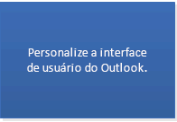
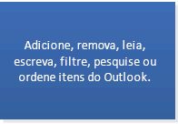
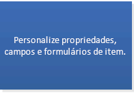

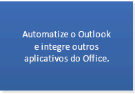-->

### Cenários adicionais compatíveis com o modelo de objeto ou PIA desde o Outlook 2007Additional scenarios supported by the object model or PIA since Outlook 2007

Além dos cenários de linha de base, se sua solução do Outlook oferecer suporte a qualquer um dos cenários mostrados na lista a seguir e for executada no Outlook 2007 ou em versões posteriores, mas não em versões anteriores, você poderá usar o modelo de objeto ou o PIA também.In addition to the baseline scenarios, if your Outlook solution supports any of the scenarios shown in Figure 3, and your solution is intended to run on Outlook 2007 or a later version but not earlier versions, you can use the object model or the PIA, as well. Esta seção especifica os principais objetos ou membros que você pode usar no modelo de objeto do Outlook para estender cada cenário (com exceção da interface [IDTExtensibility2](https://docs.microsoft.com/dotnet/api/extensibility.idtextensibility2?view=visualstudiosdk-2017) no modelo de objeto de automação do Visual Studio e da interface [IRibbonExtensibility](https://docs.microsoft.com/office/vba/api/Office.IRibbonExtensibility) no modelo de objeto do Office, que você pode integrar com o modelo de objeto do Outlook).Figure 3 specifies the main objects or members you can use in the Outlook object model to extend each scenario (with the exception of the [IDTExtensibility2](https://docs.microsoft.com/dotnet/api/extensibility.idtextensibility2?view=visualstudiosdk-2017) interface in the Visual Studio automation object model, and the [IRibbonExtensibility](https://docs.microsoft.com/office/vba/api/Office.IRibbonExtensibility) interface in the Office object model, which you can integrate with the Outlook object model). 

- [Personalizar a interface do usuário do Outlook: Faixa de opções do Office Fluent, painel de navegação, painel de tarefasCustomize the Outlook UI: Office Fluent Ribbon, Navigation pane, Task pane](#OLSelectAPI_CustomizeTheOutlookInterface)
- [Personalizar formulários como áreas de formulários e implantá-los por meio de suplementosCustomize forms as form regions and deploy them by add-ins](#OLSelectAPI_CustomFormRegions)
- [Definir e obter propriedades internas a nível do item que não são expostas no modelo de objetoSet and get built-in item-level properties that are not exposed in the object model.](#OLSelectAPI_CustomizingProperties)
- [Enumerar e exibir muitos itens em uma pastaEnumerate and view items in a folder](#OLSelectAPI_Enumerating)
- [Sinalizar itens como tarefasFlag items as tasks](#OLSelectAPI_ItemsFlag)
- [Compartilhar calendários, feeds RSS e pastasShare calendars, RSS feeds, and folders](#OLSelectAPI_Sharing)
- [Adicionar, remover, salvar e obter nível, caminho, tamanho e tipo de anexo do blocoAdd, remove, save, and get block level, path, size, and type of an attachment](#OLSelectAPI_Attachments)
- [Gerenciar regras, fusos horários e exibiçõesManage rules, time zones, and views](#OLSelectAPI_Misc)
- [Adicionar ou remover uma categoria à lista de categorias mestras do perfil atualAdd or remove a category to the master category list for the current profile](#OLSelectAPI_Categories)
- [Obter informações detalhadas para uma conta no perfil atualObtain detailed information for an account in the current profile](#OLSelectAPI_PrimaryAccount)
- [Obter informações detalhadas de uma lista de distribuição do Exchange ou usuário como uma entrada de endereçoObtain detailed information of an Exchange distribution list or user as an address entry](#OLSelectAPI_AddressBook)
- [Armazenar dados privados para soluçõesStore private data for solutions.](#OLSelectAPI_StoringData)

<!--More removed images
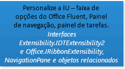
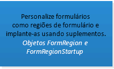

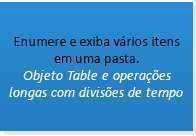
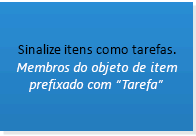
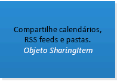

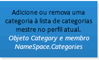
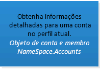
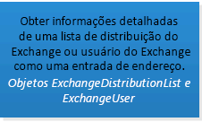
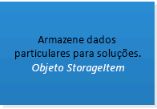
-->

### Mais cenários compatíveis com o modelo de objeto ou PIA desde o Outlook 2010More scenarios supported by the object model or PIA since Outlook 2010

Se a sua solução do Outlook se destina a ser executada no Outlook 2010 e não em versões anteriores, você poderá optar por usar o modelo de objeto ou o PIA para oferecer suporte aos cenários mostrados nesta próxima seção.If your Outlook solution is intended to run on Outlook 2010 and not earlier versions, you can choose to use the object model or the PIA to support the scenarios shown in Figure 4. Esta seção especifica os principais objetos ou membros que você pode usar no modelo de objeto do Outlook para estender cada cenário (com exceção das interfaces [IRibbonControl](https://docs.microsoft.com/office/vba/api/Office.IRibbonControl), [IRibbonExtensibility](https://docs.microsoft.com/office/vba/api/Office.IRibbonExtensibility) e [IRibbonUI](https://docs.microsoft.com/office/vba/api/Office.IRibbonUI) que estão no modelo de objeto do Office, que você pode integrar com o modelo de objeto do Outlook).Figure 4 specifies the main objects or members you can use in the Outlook object model to extend each scenario (with the exception of the [IRibbonControl](https://docs.microsoft.com/office/vba/api/Office.IRibbonControl), [IRibbonExtensibility](https://docs.microsoft.com/office/vba/api/Office.IRibbonExtensibility), and [IRibbonUI](https://docs.microsoft.com/office/vba/api/Office.IRibbonUI) interfaces that are in the Office object model, which you can integrate with the Outlook object model). 
   
- [Personalizar a interface do usuário do Outlook 2010, como o modo de exibição Backstage do Office e menus de contextoCustomize the Outlook 2010 UI such as the Office Backstage view and context menus](#OLSelectAPI_CustomizingUIOutlook2010)
- [Gerenciar e acessar itens heterogêneos em uma conversaManage and access heterogeneous items in a conversation](#OLSelectAPI_Conversations)
- [Gerenciar a seleção de itens em um explorador ou localizar uma seleçãoManage selection of items in an explorer or locate a selection](#OLSelectAPI_ItemSelection)
- [Gerenciar a seleção de anexos em um inspetorManage selection of attachments in an inspector](#OLSelectAPI_AttachmentSelection)
- [Oferecer suporte a várias contas do Exchange em um perfilSupport multiple Exchange accounts in one profile](#OLSelectAPI_MultipleAccounts)
- [Criar um cartão de visita para uma entrada de endereçoCreate a contact card for an address entry](https://docs.microsoft.com/office/vba/api/Outlook.NameSpace.CreateContactCard)
- [Organizar pastas específicas da solução no módulo SoluçõesOrganize solution-specific folders in the Solutions module](#OLSelectAPI_Folders)

<!--more removed images:
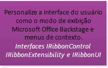

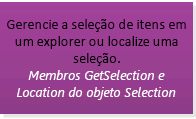

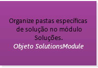
-->

### Cenários adicionais compatíveis com o modelo de objeto ou PIA desde o Outlook 2013Additional scenarios supported by the object model or PIA since Outlook 2013

Se a sua solução se destina a ser executada no Outlook 2013 e não em versões anteriores, você pode usar o modelo de objeto ou o PIA para oferecer suporte aos cenários mostrados nos seguintes recursos.And if your solution is intended to run on Outlook 2013 and not any earlier version, you can use the object model or the PIA to support the scenarios shown in Figure 5.

- [Mostrar uma exibição de todos os contatos na pasta atualDisplay view for all contacts in current folder](https://docs.microsoft.com/office/vba/api/Outlook.peopleview)
- [Selecionar resposta embutida no painel de leituraSelect inline response in reading pane](#OLSelectAPI_InlineResponse)
- [Mostrar verificação de endereço ou caixa de diálogo com nome completo para contatoShow check address or full name dialog for contact](#OLSelectAPI_ContactCheckDialogs)
- [A detecção das propriedades do item de leitura está concluídaDetecting reading item properties is complete](https://docs.microsoft.com/office/vba/outlook/How-to/Items-Folders-and-Stores/outlook-item-objects)

<!--more removed images:

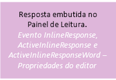
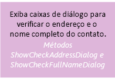

-->

## Fatores de decisão para MAPIDecision factors for MAPI

In general, you use MAPI to access data on a MAPI-based server such as the Microsoft Exchange server, and to do tasks such as the following:In general, you use MAPI to access data on a MAPI-based server such as the Microsoft Exchange server, and to do tasks such as the following:
  
- Create a custom service provider such as an address book provider, transport provider, or store provider.Create a custom service provider such as an address book provider, transport provider, or store provider.
    
- Create a sink process.Create a sink process.
    
- Create or manipulate a profile.Create or manipulate a profile.
    
- Run an application as a Windows NT service.Run an application as a Windows NT service.
    
- Run tasks on a background thread. For example, enumerating numerous items in a folder and modifying the items' properties in a background thread can optimize performance.Run tasks on a background thread. For example, enumerating numerous items in a folder and modifying the items' properties in a background thread can optimize performance.
    
For more information and code samples, see the [Referência de MAPI do Outlook](https://msdn.microsoft.com/library/3d980b86-7001-4869-9780-121c6bfc7275%28Office.15%29.aspx) and [MFCMAPI](https://mfcmapi.codeplex.com/).For more information and code samples, see the [Outlook MAPI Reference](https://msdn.microsoft.com/library/3d980b86-7001-4869-9780-121c6bfc7275%28Office.15%29.aspx) and [MFCMAPI](https://mfcmapi.codeplex.com/).
  
In addition, if your solution runs on a version of Outlook earlier than Outlook 2007, and scenarios such as the following apply to your solution, you should use MAPI to extend those scenarios.In addition, if your solution runs on a version of Outlook earlier than Outlook 2007, and scenarios such as the following apply to your solution, you should use MAPI to extend those scenarios.
  
- Set and get built-in item-level properties that are not exposed in the object model.Set and get built-in item-level properties that are not exposed in the object model.
    
- Manage accounts, attachments, Exchange distribution lists, Exchange users, or stores.Manage accounts, attachments, Exchange distribution lists, Exchange users, or stores.
    
- Store private data for solutions.Store private data for solutions.
    
- Manage a message store for an account.Manage a message store for an account.
    
Since Outlook 2007, the object model has supported a range of features that, prior to Outlook 2007, developers had to resort to MAPI or other APIs such as Microsoft Collaboration Data Objects (CDO) 1.2.1 and Microsoft Exchange Client Extensions. So if any of the scenarios in the previous list applies to your solution, but your solution runs on Outlook 2007 or Outlook 2010, you can and should use the Outlook object model or PIA to support these scenarios. For more information about Outlook 2007 enhancements that unify Outlook development technologies, see [What's New for Developers in Outlook 2007 (Part 1 of 2)](https://msdn.microsoft.com/library/76e3f0b7-ef2b-4e9f-8515-3002d75d7721%28Office.15%29.aspx).Since Outlook 2007, the object model has supported a range of features that, prior to Outlook 2007, developers had to resort to MAPI or other APIs such as Microsoft Collaboration Data Objects (CDO) 1.2.1 and Microsoft Exchange Client Extensions. So if any of the scenarios in the previous list applies to your solution, but your solution runs on Outlook 2007 or Outlook 2010, you can and should use the Outlook object model or PIA to support these scenarios. For more information about Outlook 2007 enhancements that unify Outlook development technologies, see [What's New for Developers in Outlook 2007 (Part 1 of 2)](https://msdn.microsoft.com/library/76e3f0b7-ef2b-4e9f-8515-3002d75d7721%28Office.15%29.aspx).

## Fatores de decisão para as APIs auxiliaresDecision factors for the Auxiliary APIs

The Outlook auxiliary APIs can integrate with Outlook business logic or MAPI in some scenarios where the object model or MAPI does not provide a solution. Use the Outlook auxiliary APIs in the following scenarios:The Outlook auxiliary APIs can integrate with Outlook business logic or MAPI in some scenarios where the object model or MAPI does not provide a solution. Use the Outlook auxiliary APIs in the following scenarios:
  
- Account management: Manage account information, manipulate accounts, provide notification on account changes, and protect accounts from spam.Account management: Manage account information, manipulate accounts, provide notification on account changes, and protect accounts from spam. 
    
- Data degradation: Wrap an object in a preferred character format rather than exposing the object in its native format.Data degradation: Wrap an object in a preferred character format rather than exposing the object in its native format.
    
- Rebasing calendars and time zone support: Rebase Outlook calendars to support daylight saving time.Rebasing calendars and time zone support: Rebase Outlook calendars to support daylight saving time.
    
- Free/busy status: Provide free/busy information on calendars.Free/busy status: Provide free/busy information on calendars.
    
- Contact pictures: Determine the display of a contact's picture in Outlook.Contact pictures: Determine the display of a contact's picture in Outlook.
    
- Item currency: Determine whether an Outlook item has unsaved changes.Item currency: Determine whether an Outlook item has unsaved changes.
    
- Categorizing an item: Categorize an Outlook item after sending the item.Categorizing an item: Categorize an Outlook item after sending the item.
    
For more information about the auxiliary APIs, see the [Additional resourcesAuxiliary APIs](#OLSelectAPI_AdditionalResourcesAuxAPIs) section.For more information about the auxiliary APIs, see the [Additional resources—Auxiliary APIs](#OLSelectAPI_AdditionalResourcesAuxAPIs) section. 

## Automatizando o Outlook por meio de soluções em processo vs. fora de processoAutomating Outlook by in-process vs. out-of-process Solutions

> [!NOTE]
> The discussion of automating Outlook in this section and the next is outside the scope of Suplementos do Office, which are intended to extend the functionality of the Office client or web application but not to automate it.The discussion of automating Outlook in this section and the next is outside the scope of Office Add-ins, which are intended to extend the functionality of the Office client or web application but not to automate it. 
  
Outlook supports automation by using add-ins that run in the same foreground process as the Outlook process, and by standalone solutions that run in their own separate process outside of the Outlook process. Generally, to automate Outlook, use an add-in to interact with Outlook through the object model, PIA, or MAPI, and in less common scenarios, through an auxiliary API (such as [HrProcessConvActionForSentItem](auxiliary/hrprocessconvactionforsentitem.md)). Use an out-of-process solution only when it's necessary (for example, when you're writing a MAPI client application that uses the Tzmovelib.dll file to rebase Outlook calendars for customers, or enumerating numerous items in a folder and modifying the items' properties in a background thread to optimize performance).Outlook supports automation by using add-ins that run in the same foreground process as the Outlook process, and by standalone solutions that run in their own separate process outside of the Outlook process. Generally, to automate Outlook, use an add-in to interact with Outlook through the object model, PIA, or MAPI, and in less common scenarios, through an auxiliary API (such as [HrProcessConvActionForSentItem](auxiliary/hrprocessconvactionforsentitem.md)). Use an out-of-process solution only when it's necessary (for example, when you're writing a MAPI client application that uses the Tzmovelib.dll file to rebase Outlook calendars for customers, or enumerating numerous items in a folder and modifying the items' properties in a background thread to optimize performance). 
  
Add-ins are the preferred solution to automate Outlook, because Outlook trusts only the [Application](https://msdn.microsoft.com/library/797003e7-ecd1-eccb-eaaf-32d6ddde8348%28Office.15%29.aspx) object passed to the add-in during the [OnConnection(Object, ext_ConnectMode, Object, Array)](https://msdn.microsoft.com/library/Extensibility.IDTExtensibility2.OnConnection.aspx) event of the add-in. You can avoid the display of security warnings of the Object Model Guard by deriving all objects, properties, and methods from this **Application** object. If the add-in creates a new instance of the **Application** object, Outlook does not trust that object, even if the add-in is on the list of trusted add-ins. Any objects, properties, and methods derived from such an **Application** object will not be trusted and the blocked properties and methods will invoke security warnings. For more information about the Outlook Object Model Guard, see [Comportamento de segurança do modelo de objeto do Outlook (em inglês)](https://msdn.microsoft.com/library/4aa3b7c7-5f3f-41ce-bbf3-75d8ecbd6d4f%28Office.15%29.aspx).Add-ins are the preferred solution to automate Outlook, because Outlook trusts only the [Application](https://msdn.microsoft.com/library/797003e7-ecd1-eccb-eaaf-32d6ddde8348%28Office.15%29.aspx) object passed to the add-in during the [OnConnection(Object, ext_ConnectMode, Object, Array)](https://msdn.microsoft.com/library/Extensibility.IDTExtensibility2.OnConnection.aspx) event of the add-in. You can avoid the display of security warnings of the Object Model Guard by deriving all objects, properties, and methods from this **Application** object. If the add-in creates a new instance of the **Application** object, Outlook does not trust that object, even if the add-in is on the list of trusted add-ins. Any objects, properties, and methods derived from such an **Application** object will not be trusted and the blocked properties and methods will invoke security warnings. For more information about the Outlook Object Model Guard, see [Security Behavior of the Outlook Object Model](https://msdn.microsoft.com/library/4aa3b7c7-5f3f-41ce-bbf3-75d8ecbd6d4f%28Office.15%29.aspx).

## Automatizando o Outlook por meio de soluções gerenciadas vs. não gerenciadasAutomating Outlook by managed vs. unmanaged solutions

Outlook supports automation by add-ins and standalone applications, written in managed or unmanaged languages. The more commonly used managed languages are C# and Visual Basic. C++ and Delphi tools are more common in unmanaged development. Available expertise is one consideration when choosing between managed and unmanaged development.Outlook supports automation by add-ins and standalone applications, written in managed or unmanaged languages. The more commonly used managed languages are C# and Visual Basic. C++ and Delphi tools are more common in unmanaged development. Available expertise is one consideration when choosing between managed and unmanaged development. 
  
If your solution uses only the object model, you can consider developing a managed solution by using the PIA, or Office development tools in Visual Studio. The Office development tools in Visual Studio provide project templates and visual designers that simplify creating custom user interfaces and developing Office solutions.If your solution uses only the object model, you can consider developing a managed solution by using the PIA, or Office development tools in Visual Studio. The Office development tools in Visual Studio provide project templates and visual designers that simplify creating custom user interfaces and developing Office solutions.
  
On the other hand, because MAPI was developed years before the .NET Framework, and Microsoft does not provide managed wrappers for MAPI, Microsoft does not support using MAPI in managed code. If you are using MAPI, you must develop an unmanaged solution. For more information, see [The support guidelines for client-side messaging development](https://support.microsoft.com/kb/266353/en-us).On the other hand, because MAPI was developed years before the .NET Framework, and Microsoft does not provide managed wrappers for MAPI, Microsoft does not support using MAPI in managed code. If you are using MAPI, you must develop an unmanaged solution. For more information, see [The support guidelines for client-side messaging development](https://support.microsoft.com/kb/266353/en-us).

## APIs e tecnologias de nichoNiche APIs and technologies

The Outlook Social Connector (OSC) and Weather Bar support extending very specific scenarios in Outlook.The Outlook Social Connector (OSC) and Weather Bar support extending very specific scenarios in Outlook. 
  
### Outlook Social Connector (OSC) provider extensibilityOutlook Social Connector (OSC) provider extensibility

The Outlook Social Connector (OSC) provider extensibility supports developing a provider for a social network to allow users to view, in Outlook and other Office client applications, friends and activities updates on that social network. Figure 6 shows the OSC displaying in the People Pane the activities of a person in social network sites.The Outlook Social Connector (OSC) provider extensibility supports developing a provider for a social network to allow users to view, in Outlook and other Office client applications, friends and activities updates on that social network. Figure 6 shows the OSC displaying in the People Pane the activities of a person in social network sites.
  
**Figure 6. The OSC displaying social network data in the People Pane****Figure 6. The OSC displaying social network data in the People Pane**

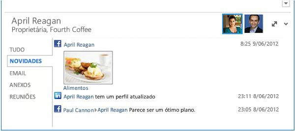
  
The OSC in Outlook allows users to view, in the People Pane, an aggregation of emails, attachments, and meeting requests from a person in Outlook. In an organizational environment, users who collaborate on a SharePoint site can see document updates and other site activities of this person on the SharePoint site. Outlook Social Connector provider extensibility supports developing a provider for the OSC to synchronize and surface social network updates in Outlook. Common OSC providers (such as Facebook and LinkedIn) are installed by default with Outlook. Depending on the social network sites that an Outlook user has signed into, the user can see, in the People Pane, updates such as photos, status, and activities on the corresponding social networks.The OSC in Outlook allows users to view, in the People Pane, an aggregation of emails, attachments, and meeting requests from a person in Outlook. In an organizational environment, users who collaborate on a SharePoint site can see document updates and other site activities of this person on the SharePoint site. Outlook Social Connector provider extensibility supports developing a provider for the OSC to synchronize and surface social network updates in Outlook. Common OSC providers (such as Facebook and LinkedIn) are installed by default with Outlook. Depending on the social network sites that an Outlook user has signed into, the user can see, in the People Pane, updates such as photos, status, and activities on the corresponding social networks. 
  
### Weather Bar extensibilityWeather Bar extensibility

Starting in Outlook 2013, the Weather Bar allows developers to plug in a third-party weather web service for the Weather Bar, to provide weather conditions data for a user-chosen location. The Weather Bar in Outlook displays weather conditions and forecast for a geographic location. A user can choose one or multiple locations, and conveniently see weather data in the Weather Bar in the calendar module. Figure 7 shows the Weather Bar displaying a three-day forecast for New York, NY.Starting in Outlook 2013, the Weather Bar allows developers to plug in a third-party weather web service for the Weather Bar, to provide weather conditions data for a user-chosen location. The Weather Bar in Outlook displays weather conditions and forecast for a geographic location. A user can choose one or multiple locations, and conveniently see weather data in the Weather Bar in the calendar module. Figure 7 shows the Weather Bar displaying a three-day forecast for New York, NY. 
  
**Figure 7. Weather Bar in Outlook****Figure 7. Weather Bar in Outlook**

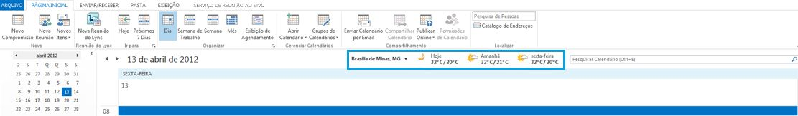
  
By default, Outlook uses weather data provided by MSN Weather. The Weather Bar supports third-party weather data web services which follow a defined protocol to communicate with Outlook. As long as a third-party weather data service supports this protocol, users can choose that weather data service to provide weather data in the Weather Bar.By default, Outlook uses weather data provided by MSN Weather. The Weather Bar supports third-party weather data web services which follow a defined protocol to communicate with Outlook. As long as a third-party weather data service supports this protocol, users can choose that weather data service to provide weather data in the Weather Bar.
  
See the [Additional resourcesprimary references, resources, and code samples](#OLSelectAPI_AdditionalResourcesRefCode) section for more information about using OSC provider extensibility and the Weather Bar extensibility.See the [Additional resources—primary references, resources, and code samples](#OLSelectAPI_AdditionalResourcesRefCode) section for more information about using OSC provider extensibility and the Weather Bar extensibility. 

## ConclusãoConclusion

To determine the best API or technology for your solution, you must first define the goals of your solution:To determine the best API or technology for your solution, you must first define the goals of your solution: 
  
- The versions of Outlook you intend your solution to support.The versions of Outlook you intend your solution to support.
    
- The high-priority scenarios of your solution. Does your solution mainly interact with the content and properties of a message or appointment item? Or does your solution automate Outlook at an application level? If so, do these scenarios involve enumerating, filtering, or modifying folders that contain many Outlook items?The high-priority scenarios of your solution. Does your solution mainly interact with the content and properties of a message or appointment item? Or does your solution automate Outlook at an application level? If so, do these scenarios involve enumerating, filtering, or modifying folders that contain many Outlook items?
    
First, verify whether the mail app support in the Suplementos do Office platform meets your needs. See the Functional Criteria section of [Objective evaluation criteria for the apps for Office platform](#OLSelectAPI_ObjectiveEvalCritApps) to determine whether the major objects and features support your scenarios. See the section [Decision factors for the apps for Office platform](#OLSelectAPI_FactorsApps) to verify whether mail apps are a better choice than add-ins for your scenarios. In general, develop your solution as an app, if possible, to take advantage of the platform's support across Outlook clients over different form factors.First, verify whether the mail app support in the Office Add-ins platform meets your needs. See the Functional Criteria section of [Objective evaluation criteria for the apps for Office platform](#OLSelectAPI_ObjectiveEvalCritApps) to determine whether the major objects and features support your scenarios. See the section [Decision factors for the apps for Office platform](#OLSelectAPI_FactorsApps) to verify whether mail apps are a better choice than add-ins for your scenarios. In general, develop your solution as an app, if possible, to take advantage of the platform's support across Outlook clients over different form factors. 
  
If your scenarios require you to extend beyond message and appointment items, or require you to automate Outlook at an application level, try to match your scenarios with those outlined in the section [Decision factors for the object model or PIA](#OLSelectAPI_FactorsOM). If the object model (or PIA) of your target Outlook versions supports your scenarios, and your solution does not manipulate folders with many items, you should implement your solution as an add-in, in either a managed or unmanaged language.If your scenarios require you to extend beyond message and appointment items, or require you to automate Outlook at an application level, try to match your scenarios with those outlined in the section [Decision factors for the object model or PIA](#OLSelectAPI_FactorsOM). If the object model (or PIA) of your target Outlook versions supports your scenarios, and your solution does not manipulate folders with many items, you should implement your solution as an add-in, in either a managed or unmanaged language. 
  
If the object model (or PIA) of a target Outlook version does not support some of your scenarios, verify whether the scenarios in the [Decision factors for MAPI](#OLSelectAPI_FactorsMAPI) or [Decision factors for the Auxiliary APIs](#OLSelectAPI_FactorsAux) section meet your needs. If MAPI meets your needs, you should implement your solution in unmanaged code. If an auxiliary API solves one of your scenarios, you can use managed or unmanaged code.If the object model (or PIA) of a target Outlook version does not support some of your scenarios, verify whether the scenarios in the [Decision factors for MAPI](#OLSelectAPI_FactorsMAPI) or [Decision factors for the Auxiliary APIs](#OLSelectAPI_FactorsAux) section meet your needs. If MAPI meets your needs, you should implement your solution in unmanaged code. If an auxiliary API solves one of your scenarios, you can use managed or unmanaged code. 
  
If your solution uses MAPI, you must implement it in unmanaged code, such as C++. Otherwise, the decision to use managed or unmanaged code to create the solution generally depends on your available resources and their expertise. As for deciding whether to implement the solution as an add-in or standalone application, choose an add-in to avoid the user constantly invoking the Outlook Object Model Guard, unless your scenario requires manipulation of folders that contain numerous items. In the latter scenario, implementing the solution to run as a background thread can optimize Outlook performance.If your solution uses MAPI, you must implement it in unmanaged code, such as C++. Otherwise, the decision to use managed or unmanaged code to create the solution generally depends on your available resources and their expertise. As for deciding whether to implement the solution as an add-in or standalone application, choose an add-in to avoid the user constantly invoking the Outlook Object Model Guard, unless your scenario requires manipulation of folders that contain numerous items. In the latter scenario, implementing the solution to run as a background thread can optimize Outlook performance.
  
If your scenarios include showing social network information or updates in Outlook, you should use the OSC provider extensibility to create a COM-visible DLL. You can do this in either a managed or unmanaged language.If your scenarios include showing social network information or updates in Outlook, you should use the OSC provider extensibility to create a COM-visible DLL. You can do this in either a managed or unmanaged language.
  
If you are interested in plugging in a third-party weather data service to the Weather Bar, you can follow the protocol defined by Weather Bar extensibility and provide the appropriate web services. You can create these web services in a managed language.If you are interested in plugging in a third-party weather data service to the Weather Bar, you can follow the protocol defined by Weather Bar extensibility and provide the appropriate web services. You can create these web services in a managed language.
  
Once you have decided on the APIs or technologies to use in your solution, you can refer to additional documentation and code samples in the [Additional resourcesprimary references, resources, and code samples](#OLSelectAPI_AdditionalResourcesRefCode) section for more information.Once you have decided on the APIs or technologies to use in your solution, you can refer to additional documentation and code samples in the [Additional resources—primary references, resources, and code samples](#OLSelectAPI_AdditionalResourcesRefCode) section for more information. 

## Confira também: Suplementos do OfficeSee also: Office Add-ins

[Visão geral da plataforma Suplementos do Office](https://msdn.microsoft.com/library/e64de870-ce22-4331-92e7-76d35279bf91%28Office.15%29.aspx) provides a good introduction of Suplementos do Office, including the architecture and development life cycle.[Office Add-ins platform overview](https://msdn.microsoft.com/library/e64de870-ce22-4331-92e7-76d35279bf91%28Office.15%29.aspx) provides a good introduction of Office Add-ins, including the architecture and development life cycle. 
  
Confira [Suplementos do Outlook](https://msdn.microsoft.com/library/71e64bc9-e347-4f5d-8948-0a47b5dd93e6%28Office.15%29.aspx) para ver um roteiro detalhado de recursos sobre o desenvolvimento de aplicativos de email.See [Outlook add-ins](https://msdn.microsoft.com/library/71e64bc9-e347-4f5d-8948-0a47b5dd93e6%28Office.15%29.aspx) for a detailed roadmap of resources about developing mail apps. 

## Confira também: PIA e modelo de objetoSee also: Object model and PIA

Os recursos a seguir fornecem mais informações sobre como usar o modelo de objeto e o PIA.The following resources provide more information about using the object model and PIA.

### Contas — conta principal do Exchange no perfilAccounts—primary Exchange account in profile

- [Account](https://msdn.microsoft.com/library/f624438c-4e45-2822-18b6-bfe8074a33c0%28Office.15%29.aspx) object[Account](https://msdn.microsoft.com/library/f624438c-4e45-2822-18b6-bfe8074a33c0%28Office.15%29.aspx) object 
    
- [NameSpace.Accounts](https://msdn.microsoft.com/library/80e969ea-d2cc-966d-5fe4-68d59951b5c9%28Office.15%29.aspx) property[NameSpace.Accounts](https://msdn.microsoft.com/library/80e969ea-d2cc-966d-5fe4-68d59951b5c9%28Office.15%29.aspx) property 

### Contas — várias contas no perfilAccounts—multiple accounts in profile

- [Account](https://msdn.microsoft.com/library/f624438c-4e45-2822-18b6-bfe8074a33c0%28Office.15%29.aspx) object[Account](https://msdn.microsoft.com/library/f624438c-4e45-2822-18b6-bfe8074a33c0%28Office.15%29.aspx) object 
    
- [Usar várias contas para o mesmo perfil no OutlookUsing Multiple Accounts for the Same Profile on Outlook](https://msdn.microsoft.com/library/9e06e076-d62a-37c8-4502-709da5a0b104%28Office.15%29.aspx)
    
- [Obter informações para várias contasObtain Information for Multiple Accounts](https://msdn.microsoft.com/library/af587ee2-429a-252f-ecb6-2f058b9a37a8%28Office.15%29.aspx)
    
- [Manipulação de várias contas do Exchange no Outlook 2010Manipulating Multiple Exchange Accounts in Outlook 2010](https://msdn.microsoft.com/library/b5a80da9-102d-4617-8a06-49ded01a237a%28Office.15%29.aspx)

### Usuários do catálogo de endereços e do ExchangeAddress book and Exchange users

- [Exibir nomes do catálogo de endereçosDisplay Names from the Address Book](https://msdn.microsoft.com/library/32e7179c-8133-ee20-ecf6-52c9275f205f%28Office.15%29.aspx)
    
- [Acessar as informações da lista de distribuição e dos usuários do Exchange a partir do catálogo de endereçosAccess Exchange User or Distribution List Information from the Address Book](https://msdn.microsoft.com/library/077a8666-09c5-e641-0b9b-7d83133d931f%28Office.15%29.aspx)
    
- [Listar os grupos aos quais meu gerente pertenceList the Groups that My Manager Belongs to](https://msdn.microsoft.com/library/2f0ff92c-e026-4f62-c039-fbda9aaf1546%28Office.15%29.aspx)
    
- [Listar o nome e a localização do escritório de cada gerente pertencente a uma lista de distribuição do ExchangeList the Name and Office Location of Each Manager Belonging to an Exchange Distribution List](https://msdn.microsoft.com/library/abc26854-62db-be7f-4025-46acbcb42541%28Office.15%29.aspx)
    
- Objeto [AddressEntries](https://msdn.microsoft.com/library/db91b717-07c6-d1f2-c545-b766ee1f0c6b%28Office.15%29.aspx)[AddressEntries](https://msdn.microsoft.com/library/db91b717-07c6-d1f2-c545-b766ee1f0c6b%28Office.15%29.aspx) object 
    
- [AddressLists](https://msdn.microsoft.com/library/b8c5ce75-3030-0179-45bb-f44fe6628074%28Office.15%29.aspx) object[AddressLists](https://msdn.microsoft.com/library/b8c5ce75-3030-0179-45bb-f44fe6628074%28Office.15%29.aspx) object 
    
- [ExchangeDistributionList](https://msdn.microsoft.com/library/2830dfba-6c0a-a81f-6b98-92ac2aafb59d%28Office.15%29.aspx) object[ExchangeDistributionList](https://msdn.microsoft.com/library/2830dfba-6c0a-a81f-6b98-92ac2aafb59d%28Office.15%29.aspx) object 
    
- [ExchangeUser](https://msdn.microsoft.com/library/6ec117d1-7fdb-aa36-b567-1242f8238df0%28Office.15%29.aspx) object[ExchangeUser](https://msdn.microsoft.com/library/6ec117d1-7fdb-aa36-b567-1242f8238df0%28Office.15%29.aspx) object 
    
- [SelectNamesDialog](https://msdn.microsoft.com/library/1522736a-3cad-9f1c-4da9-b52a3a01731c%28Office.15%29.aspx) object[SelectNamesDialog](https://msdn.microsoft.com/library/1522736a-3cad-9f1c-4da9-b52a3a01731c%28Office.15%29.aspx) object 

### AnexosAttachments

- [Anexar um arquivo a um item de emailAttach a File to a Mail Item](https://msdn.microsoft.com/library/1d94629b-e713-92cb-32de-c8910612e861%28Office.15%29.aspx)
    
- 
  [Tipos de arquivo de anexo restringidos pelo Outlook 2010](https://technet.microsoft.com/pt-BR/library/cc179163.aspx)[Attachment file types restricted by Outlook 2010](https://technet.microsoft.com/en-us/library/cc179163.aspx)
    
- [Attachment](https://msdn.microsoft.com/library/3e11582b-ac90-0948-bc37-506570bb287b%28Office.15%29.aspx) object[Attachment](https://msdn.microsoft.com/library/3e11582b-ac90-0948-bc37-506570bb287b%28Office.15%29.aspx) object 
    
- [AttachmentSelection](https://msdn.microsoft.com/library/398cf106-a904-9048-e627-e47aaadf1105%28Office.15%29.aspx) object[AttachmentSelection](https://msdn.microsoft.com/library/398cf106-a904-9048-e627-e47aaadf1105%28Office.15%29.aspx) object 
    
- **AttachmentAdd** event per item object**AttachmentAdd** event per item object 
    
- **AttachmentRead** event per item object**AttachmentRead** event per item object 
    
- **AttachmentRemove** event per item object**AttachmentRemove** event per item object 
    
- **BeforeAttachmentAdd** event per item object**BeforeAttachmentAdd** event per item object 
    
- **BeforeAttachmentPreview** event per item object**BeforeAttachmentPreview** event per item object 
    
- **BeforeAttachmentRead** event per item object**BeforeAttachmentRead** event per item object 
    
- **BeforeAttachmentSave** event per item object**BeforeAttachmentSave** event per item object 
    
- **BeforeAttachmentWrite** event per item object**BeforeAttachmentWrite** event per item object 

### Anexos: seleção no inspetorAttachments: selection in inspector

- [Inspector.AttachmentSelection](https://msdn.microsoft.com/library/19466ce7-def8-4cce-1776-dcea1df9f15d%28Office.15%29.aspx) property[Inspector.AttachmentSelection](https://msdn.microsoft.com/library/19466ce7-def8-4cce-1776-dcea1df9f15d%28Office.15%29.aspx) property 
    
- [Inspector.AttachmentSelectionChange](https://msdn.microsoft.com/library/1250045d-bcb3-b823-31d5-ec31c64ad59e%28Office.15%29.aspx) event[Inspector.AttachmentSelectionChange](https://msdn.microsoft.com/library/1250045d-bcb3-b823-31d5-ec31c64ad59e%28Office.15%29.aspx) event 

### Automatizando o OutlookAutomating Outlook

- [Personalizar o Outlook usando suplementos de COMCustomizing Outlook using COM add-ins](https://msdn.microsoft.com/library/84a4f616-3ace-0139-57d5-f0c070064ab2%28Office.15%29.aspx)
    
- [Criar um Suplemento do C++ para Outlook 2010Building a C++ Add-in for Outlook 2010](https://msdn.microsoft.com/library/70b308e7-d713-4a26-9892-5021f7320674%28Office.15%29.aspx)
    
- [Introdução à interoperabilidade entre COM e .NETIntroduction to interoperability between COM and .NET](https://msdn.microsoft.com/library/6b2d099a-ec6f-4099-aaf6-e61003fe5a32%28Office.15%29.aspx)
    
- [Por que usar o PIA do OutlookWhy Use the Outlook PIA](https://msdn.microsoft.com/library/5cc9085e-7c97-4698-8cb9-e33e427c02e7%28Office.15%29.aspx)
    
- [Práticas recomendadas para o desenvolvimento de suplementos gerenciados do OutlookBest practices in developing managed Outlook add-ins](https://msdn.microsoft.com/library/a03246f6-2ca5-4fcb-8e63-a11cfbc8d9a0%28Office.15%29.aspx)
    
- [Obter e fazer logon em uma instância do OutlookObtain and Log On to an Instance of Outlook ](https://msdn.microsoft.com/library/ef369364-6500-2759-3ef4-ed4411112e96%28Office.15%29.aspx)
    
- [Automatizar o Outlook a partir de um aplicativo do Visual BasicAutomating Outlook from a Visual Basic Application](https://msdn.microsoft.com/library/623f91af-cd50-1ff0-9519-5a39cbcf5d18%28Office.15%29.aspx)
    
- [Automatizar o Outlook a partir de outros aplicativos do OfficeAutomating Outlook from Other Office Applications](https://msdn.microsoft.com/library/d3e44f80-df67-2d28-94dc-14d7a8c8c26c%28Office.15%29.aspx)

### CategoriasCategories

- [Categorizar seus itens do OutlookCategorize Your Outlook Items](https://msdn.microsoft.com/library/e8cfb450-b8b0-bee6-fdf0-d0a92bf9af56%28Office.15%29.aspx)
    
- [Category](https://msdn.microsoft.com/library/143ef095-54b0-cbe2-e356-632029061ac2%28Office.15%29.aspx) object[Category](https://msdn.microsoft.com/library/143ef095-54b0-cbe2-e356-632029061ac2%28Office.15%29.aspx) object 
    
- [NameSpace.Categories](https://msdn.microsoft.com/library/3963afca-3a7e-38d7-1347-7e1467be3a10%28Office.15%29.aspx) property[NameSpace.Categories](https://msdn.microsoft.com/library/3963afca-3a7e-38d7-1347-7e1467be3a10%28Office.15%29.aspx) property 

### Contatos: verifique o endereço e o nome completoContacts: check address and full name

- [ContactItem.ShowCheckAddressDialog](https://msdn.microsoft.com/library/773a1a3c-1247-fd48-399a-728766e56570%28Office.15%29.aspx) method[ContactItem.ShowCheckAddressDialog](https://msdn.microsoft.com/library/773a1a3c-1247-fd48-399a-728766e56570%28Office.15%29.aspx) method 
    
- [ContactItem.ShowCheckFullNameDialog](https://msdn.microsoft.com/library/d42632e3-6f50-cce7-80c6-cf846be1f925%28Office.15%29.aspx) method[ContactItem.ShowCheckFullNameDialog](https://msdn.microsoft.com/library/d42632e3-6f50-cce7-80c6-cf846be1f925%28Office.15%29.aspx) method 

### ConversasConversations

- [Gerenciar os itens do Outlook como conversasManaging Outlook Items as Conversations](https://msdn.microsoft.com/library/d91959d7-07b2-7952-8e6d-a39422d355e0%28Office.15%29.aspx)
    
- [Obter e enumerar conversas selecionadasObtain and Enumerate Selected Conversations](https://msdn.microsoft.com/library/3bba1e98-b2eb-c53d-354a-bdd899b65a59%28Office.15%29.aspx)
    
- Objeto [Conversation](https://msdn.microsoft.com/library/2705d38a-ebc0-e5a7-208b-ffe1f5446b1b%28Office.15%29.aspx)[Conversation](https://msdn.microsoft.com/library/2705d38a-ebc0-e5a7-208b-ffe1f5446b1b%28Office.15%29.aspx) object 
    
- [ConversationHeader](https://msdn.microsoft.com/library/5142d5f7-55c1-4d9d-3a11-d25c8763fcb7%28Office.15%29.aspx) object[ConversationHeader](https://msdn.microsoft.com/library/5142d5f7-55c1-4d9d-3a11-d25c8763fcb7%28Office.15%29.aspx) object 
    
- [SimpleItems](https://msdn.microsoft.com/library/b929ae28-fe5f-607e-37b5-ed6a304d4896%28Office.15%29.aspx) object[SimpleItems](https://msdn.microsoft.com/library/b929ae28-fe5f-607e-37b5-ed6a304d4896%28Office.15%29.aspx) object 
    
- **ConversationID** property per item object**ConversationID** property per item object 

### EventosEvents

- [Trabalhar com eventos do Outlook Working with Outlook Events](https://msdn.microsoft.com/library/514f8f31-8047-2a9f-cbac-d0a23218f49c%28Office.15%29.aspx)
    
- [Implementar um invólucro para inspetores e rastrear eventos em nível de item em cada inspetorImplement a Wrapper for Inspectors and Track Item-Level Events in Each Inspector](https://msdn.microsoft.com/library/8021dd2b-c36c-492b-b281-783e85140ad8%28Office.15%29.aspx)

### Explorador: resposta embutidaExplorer: inline response

- [Explorer.ActiveInlineResponse](https://msdn.microsoft.com/library/fc38314d-7cff-44f4-9151-6129f918a721%28Office.15%29.aspx) property[Explorer.ActiveInlineResponse](https://msdn.microsoft.com/library/fc38314d-7cff-44f4-9151-6129f918a721%28Office.15%29.aspx) property 
    
- [Explorer.ActiveInlineResponseWordEditor](https://msdn.microsoft.com/library/b9058694-ab8f-4962-ab7d-afac1704dd29%28Office.15%29.aspx) property[Explorer.ActiveInlineResponseWordEditor](https://msdn.microsoft.com/library/b9058694-ab8f-4962-ab7d-afac1704dd29%28Office.15%29.aspx) property 
    
- [Explorer.InlineResponse](https://msdn.microsoft.com/library/5dbaddbd-e6cd-4776-b417-c67f51b12812%28Office.15%29.aspx) event[Explorer.InlineResponse](https://msdn.microsoft.com/library/5dbaddbd-e6cd-4776-b417-c67f51b12812%28Office.15%29.aspx) event 

### Itens: campos, formulários e propriedades básicasItems: basic properties, fields, and forms

- [Objetos de item do OutlookOutlook Item Objects](https://msdn.microsoft.com/library/6ea4babf-facf-4018-ef5a-4a484e55153a%28Office.15%29.aspx)
    
- [ItemProperties](https://msdn.microsoft.com/library/34a110ed-6617-72da-1e98-a9773c705b40%28Office.15%29.aspx) object[ItemProperties](https://msdn.microsoft.com/library/34a110ed-6617-72da-1e98-a9773c705b40%28Office.15%29.aspx) object 
    
- [UserProperties](https://msdn.microsoft.com/library/20b49c86-d74f-9bda-382c-559af278c148%28Office.15%29.aspx) object[UserProperties](https://msdn.microsoft.com/library/20b49c86-d74f-9bda-382c-559af278c148%28Office.15%29.aspx) object 
    
- [Visão geral de campos padrãoStandard Fields Overview](https://msdn.microsoft.com/library/f0d903a3-f404-8511-af3d-d4f3e30f0779%28Office.15%29.aspx)
    
- [Campos do Outlook e propriedades equivalentesOutlook Fields and Equivalent Properties](https://msdn.microsoft.com/library/acc5d2c5-f579-0a60-5676-3faa63f26c0e%28Office.15%29.aspx)
    
- [Campos personalizados e visão geral de tipos de dadosCustom Fields and Data Types Overview](https://msdn.microsoft.com/library/a85a7bc2-2b85-1782-04a3-0104e0df32aa%28Office.15%29.aspx)
    
- [Personalizar páginas de formulário e regiões de formulárioCustomizing Form Pages and Form Regions](https://msdn.microsoft.com/library/c8c2d080-66a8-b761-bdc0-527b209e0bd1%28Office.15%29.aspx)

### Itens: personalizando propriedadesItems: customizing properties

- [Visão geral das propriedadesProperties Overview](https://msdn.microsoft.com/library/242c9e89-a0c5-ff89-0d2a-410bd42a3461%28Office.15%29.aspx)
    
- [Efficiently Getting and Setting Custom Properties in a Contact Folder in Outlook 2010Efficiently Getting and Setting Custom Properties in a Contact Folder in Outlook 2010](https://msdn.microsoft.com/library/bb49f7a6-ec0a-483a-a27e-e843c6af781b%28Office.15%29.aspx)
    
- [PropertyAccessor](https://msdn.microsoft.com/library/2fc91e13-703c-3ec9-9066-ffee7144306c%28Office.15%29.aspx) object[PropertyAccessor](https://msdn.microsoft.com/library/2fc91e13-703c-3ec9-9066-ffee7144306c%28Office.15%29.aspx) object 

### Itens: enumerando, filtrando e classificandoItems: enumerating, filtering, and sorting

- [Armazenar os itens do OutlookStoring Outlook Items](https://msdn.microsoft.com/library/e4a639a4-10b2-7665-9261-19d6e7707e48%28Office.15%29.aspx)
    
- [Propriedades padrão exibidas em um objeto de tabelaDefault Properties Displayed in a Table Object](https://msdn.microsoft.com/library/649c64f3-2d1e-23f1-bf13-3368da79e62b%28Office.15%29.aspx)
    
- [Efficiently Filtering Contact Items in a Contact Folder in Outlook 2010Efficiently Filtering Contact Items in a Contact Folder in Outlook 2010](https://msdn.microsoft.com/library/b8dd39e7-d716-4acd-873b-d2b0faaff30d%28Office.15%29.aspx)
    
- [Enumerar, pesquisar e filtrar itens em uma pastaEnumerating, Searching, and Filtering Items in a Folder](https://msdn.microsoft.com/library/d786d292-7a0e-0e1a-e132-affbfde37744%28Office.15%29.aspx)
    
- [Classificar itens em uma pastaSorting Items in a Folder](https://msdn.microsoft.com/library/bc3651da-cfdb-4301-4034-bb848f371e55%28Office.15%29.aspx)
    
- [Table](https://msdn.microsoft.com/library/0affaafd-93fe-227a-acee-e09a86cadc20%28Office.15%29.aspx) object[Table](https://msdn.microsoft.com/library/0affaafd-93fe-227a-acee-e09a86cadc20%28Office.15%29.aspx) object 

### Itens: sinalizar como tarefasItems: flag as tasks

See the following task-related properties in some item objects such as the [MailItem](https://msdn.microsoft.com/library/14197346-05d2-0250-fa4c-4a6b07daf25f%28Office.15%29.aspx) object:See the following task-related properties in some item objects such as the [MailItem](https://msdn.microsoft.com/library/14197346-05d2-0250-fa4c-4a6b07daf25f%28Office.15%29.aspx) object: 
  
- [TaskCompleteDate](https://msdn.microsoft.com/library/4bee35d4-1f1e-0b77-2021-84d4916bef8e%28Office.15%29.aspx) property[TaskCompleteDate](https://msdn.microsoft.com/library/4bee35d4-1f1e-0b77-2021-84d4916bef8e%28Office.15%29.aspx) property 
    
- [TaskDueDate](https://msdn.microsoft.com/library/161ed0ed-0e3f-2e4c-7e63-daad4e918dd6%28Office.15%29.aspx) property[TaskDueDate](https://msdn.microsoft.com/library/161ed0ed-0e3f-2e4c-7e63-daad4e918dd6%28Office.15%29.aspx) property 
    
- [TaskStartDate](https://msdn.microsoft.com/library/76b7109f-55fc-b7e2-63dc-bf7804a709f5%28Office.15%29.aspx) property[TaskStartDate](https://msdn.microsoft.com/library/76b7109f-55fc-b7e2-63dc-bf7804a709f5%28Office.15%29.aspx) property 
    
- [TaskSubject](https://msdn.microsoft.com/library/f7e4629f-ad47-b455-9fee-b5e537602a34%28Office.15%29.aspx) property[TaskSubject](https://msdn.microsoft.com/library/f7e4629f-ad47-b455-9fee-b5e537602a34%28Office.15%29.aspx) property 
    
- [ToDoTaskOrdinal](https://msdn.microsoft.com/library/d1ccb01a-0792-3779-3f94-eb5195a39bb0%28Office.15%29.aspx) property[ToDoTaskOrdinal](https://msdn.microsoft.com/library/d1ccb01a-0792-3779-3f94-eb5195a39bb0%28Office.15%29.aspx) property 

### Itens: seleção no exploradorItems: selection in explorer

- [Selection.GetSelection](https://msdn.microsoft.com/library/c6af6665-d97d-3833-1014-5b43282bafc2%28Office.15%29.aspx) method[Selection.GetSelection](https://msdn.microsoft.com/library/c6af6665-d97d-3833-1014-5b43282bafc2%28Office.15%29.aspx) method 
    
- [Selection.Location](https://msdn.microsoft.com/library/8a2db72a-8db0-840e-349e-5d9d22f3affb%28Office.15%29.aspx) property[Selection.Location](https://msdn.microsoft.com/library/8a2db72a-8db0-840e-349e-5d9d22f3affb%28Office.15%29.aspx) property 

### Diversos: cartões de visita, regras e visualizaçõesMiscellaneous: business cards, rules, and views

- [Personalizar e compartilhar cartões de visitaCustomize and Share Business Cards](https://msdn.microsoft.com/library/d29fd962-ea5f-040d-e9af-e8ab70595832%28Office.15%29.aspx)
    
- [Gerenciar regras no modelo de objeto do OutlookManaging Rules in the Outlook Object Model](https://msdn.microsoft.com/library/05ddd643-e9bd-a37d-b680-b8519960a5f6%28Office.15%29.aspx)
    
- [Criar uma regra para mover emails específicos para uma pastaCreate a Rule to Move Specific E-mails to a Folder](https://msdn.microsoft.com/library/e72fa307-8224-c2d2-1318-a18cd8e9f22f%28Office.15%29.aspx)
    
- Objeto [Rules](https://msdn.microsoft.com/library/dd41b4de-bf5f-5532-46c9-394a5d078bec%28Office.15%29.aspx)[Rules](https://msdn.microsoft.com/library/dd41b4de-bf5f-5532-46c9-394a5d078bec%28Office.15%29.aspx) object 
    
- [RuleActions](https://msdn.microsoft.com/library/82ba76cd-86a4-3372-cb51-2df1d58c8b71%28Office.15%29.aspx) object[RuleActions](https://msdn.microsoft.com/library/82ba76cd-86a4-3372-cb51-2df1d58c8b71%28Office.15%29.aspx) object 
    
- [RuleConditions](https://msdn.microsoft.com/library/b2af6ebf-f9f8-8106-20a3-1725c3b78174%28Office.15%29.aspx) object[RuleConditions](https://msdn.microsoft.com/library/b2af6ebf-f9f8-8106-20a3-1725c3b78174%28Office.15%29.aspx) object 
    
- [TimeZones](https://msdn.microsoft.com/library/c68f8589-44e9-3c12-45c1-96943fa9bcb7%28Office.15%29.aspx) object[TimeZones](https://msdn.microsoft.com/library/c68f8589-44e9-3c12-45c1-96943fa9bcb7%28Office.15%29.aspx) object 
    
- [Modos de exibição do OutlookOutlook Views](https://msdn.microsoft.com/library/cbaa3192-6c27-26c0-ebd6-f6489c2e812e%28Office.15%29.aspx)
    
- [Views](https://msdn.microsoft.com/library/5dd7edc2-12a2-f4c2-d158-8053d80e8dc9%28Office.15%29.aspx) object[Views](https://msdn.microsoft.com/library/5dd7edc2-12a2-f4c2-d158-8053d80e8dc9%28Office.15%29.aspx) object 

### SegurançaSecurity

- [Comportamento de segurança do modelo de objeto do OutlookSecurity Behavior of the Outlook Object Model](https://msdn.microsoft.com/library/4aa3b7c7-5f3f-41ce-bbf3-75d8ecbd6d4f%28Office.15%29.aspx)
    
- [Shutdown Changes for Outlook 2010Shutdown Changes for Outlook 2010](https://msdn.microsoft.com/library/1b154d46-8d13-4c65-91e3-180b22603d03%28Office.15%29.aspx)
    
- 
  [Attachment file types restricted by Outlook 2010](https://technet.microsoft.com/pt-BR/library/cc179163.aspx)[Attachment file types restricted by Outlook 2010](https://technet.microsoft.com/en-us/library/cc179163.aspx)
    
- [Application Shutdown Changes in Outlook 2007 SP2Application Shutdown Changes in Outlook 2007 SP2](https://msdn.microsoft.com/library/795a8237-7804-4da4-9d04-2bb663d300d9%28Office.15%29.aspx)
    
- [Code Security Changes in Outlook 2007Code Security Changes in Outlook 2007](https://msdn.microsoft.com/library/26a9fd8f-6277-48ac-a92f-3ff46e1d883a%28Office.15%29.aspx)

### CompartilhamentoSharing

- [Compartilhar calendáriosSharing Calendars](https://msdn.microsoft.com/library/03e0b693-5446-ca62-f868-69a583087966%28Office.15%29.aspx)
    
- [Compartilhar online calendários, RSS Feeds, pastas do Microsoft SharePoint Foundation e pastas do Exchange OnlineSharing Online Calendars, RSS Feeds, Microsoft SharePoint Foundation Folders, and Exchange Folders](https://msdn.microsoft.com/library/e579e026-bd10-37bb-eb3e-5c9f042fa0fa%28Office.15%29.aspx)
    
- [SharingItem](https://msdn.microsoft.com/library/63dd3451-44f3-7cc4-c6e2-7dad5835a7d2%28Office.15%29.aspx) object[SharingItem](https://msdn.microsoft.com/library/63dd3451-44f3-7cc4-c6e2-7dad5835a7d2%28Office.15%29.aspx) object 

### Soluções: pastas de solução específicaSolutions: solution-specific folders

- [Programming the Outlook 2010 Solutions ModuleProgramming the Outlook 2010 Solutions Module](https://msdn.microsoft.com/library/5989a3da-2f2a-4abd-87b0-cc0e1560dd59%28Office.15%29.aspx)
    
- [SolutionsModule](https://msdn.microsoft.com/library/4597765e-a95d-bf07-2ac4-103218ebc696%28Office.15%29.aspx) object[SolutionsModule](https://msdn.microsoft.com/library/4597765e-a95d-bf07-2ac4-103218ebc696%28Office.15%29.aspx) object 

### Soluções: armazenando dadosSolutions: storing data

- [Armazenando dados de soluçõesStoring Data for Solutions ](https://msdn.microsoft.com/library/58e69983-5718-4dde-64fc-858abd80c9e5%28Office.15%29.aspx)
    
- [StorageItem](https://msdn.microsoft.com/library/41776bc3-b838-2755-fd6b-3b5012fb9ae5%28Office.15%29.aspx) object[StorageItem](https://msdn.microsoft.com/library/41776bc3-b838-2755-fd6b-3b5012fb9ae5%28Office.15%29.aspx) object 

### Interface do usuário: personalizando áreas de formulárioUser interface: customizing form regions

- [Personalizar páginas de formulário e regiões de formulárioCustomizing Form Pages and Form Regions](https://msdn.microsoft.com/library/c8c2d080-66a8-b761-bdc0-527b209e0bd1%28Office.15%29.aspx)
    
- [Regiões de formulárioForm Regions](https://msdn.microsoft.com/library/66e80f83-60db-e3b1-47e9-097f855f6512%28Office.15%29.aspx)
    
- [Criar uma região de formulárioCreate a Form Region](https://msdn.microsoft.com/library/695b95a5-c795-cb4a-8d35-ba12b0007b1f%28Office.15%29.aspx)
    
- [Passo a passo: adicionar uma região de formulário a uma página existente em um formulário Walkthrough: Add a Form Region to an Existing Page on a Form ](https://msdn.microsoft.com/library/3c988dac-f171-966d-cf9a-17139353d604%28Office.15%29.aspx)
    
- [Building an Outlook 2007 Form Region with a Managed Add-InBuilding an Outlook 2007 Form Region with a Managed Add-In](https://msdn.microsoft.com/library/cc8503c2-9e17-4718-a757-9f0b7d42f0ee%28Office.15%29.aspx)
    
- [Implementing a Form Region to Display Email Headers in Outlook 2010Implementing a Form Region to Display Email Headers in Outlook 2010](https://msdn.microsoft.com/library/243a4e64-d4ea-4cfc-871e-af19d622fb1b%28Office.15%29.aspx)
    
- [FormRegion](https://msdn.microsoft.com/library/3a0b83eb-4076-9cb3-86a9-68f9e44df89f%28Office.15%29.aspx) object[FormRegion](https://msdn.microsoft.com/library/3a0b83eb-4076-9cb3-86a9-68f9e44df89f%28Office.15%29.aspx) object 
    
- [FormRegionStartup](https://msdn.microsoft.com/library/948ea6b7-2962-57e7-618d-fa0977b65651%28Office.15%29.aspx) object[FormRegionStartup](https://msdn.microsoft.com/library/948ea6b7-2962-57e7-618d-fa0977b65651%28Office.15%29.aspx) object 

### Interface do usuário: personalização desde o Outlook 2007User interface: customizing since Outlook 2007

- [Visão geral da personalização da faixa de opçõesOverview of Customizing the Ribbon](https://msdn.microsoft.com/library/ee49751d-9eae-357c-5fa9-0b2dd4ff0890%28Office.15%29.aspx)
    
- [Customizing the Ribbon in Outlook 2007Customizing the Ribbon in Outlook 2007](https://msdn.microsoft.com/library/946e97ea-f556-4e84-8fac-01cd9214e170%28Office.15%29.aspx)
    
- [Developing Interfaces in Outlook 2007Developing Interfaces in Outlook 2007](https://msdn.microsoft.com/library/e50257a3-98dd-498f-b9ff-dbfb6705a95a%28Office.15%29.aspx)
    
- [Custom Task Panes OverviewCustom Task Panes Overview](https://msdn.microsoft.com/library/9a415109-5333-433e-95c6-3d59ce9c4d02.aspx)
    
- [Targeting User Interface Solutions to the 2007 and 2010 Releases of Microsoft OfficeTargeting User Interface Solutions to the 2007 and 2010 Releases of Microsoft Office](https://msdn.microsoft.com/library/98726fb2-5d5c-44be-80c3-cfef926471f9%28Office.15%29.aspx)
    
- [Personalizar o painel de navegaçãoCustomizing the Navigation Pane](https://msdn.microsoft.com/library/426c3d1c-13b5-cac5-702d-87dfe71f2478%28Office.15%29.aspx)
    
- [Referência de modelos de objeto do Controle de Exibição do OutlookOutlook View Control Object Model Reference](https://msdn.microsoft.com/library/36fa9303-2135-6fcc-b93c-05eef37af3ec%28Office.15%29.aspx)
    
- [IDTExtensibility2](https://msdn.microsoft.com/library/Extensibility.IDTExtensibility2.aspx) interface[IDTExtensibility2](https://msdn.microsoft.com/library/Extensibility.IDTExtensibility2.aspx) interface 
    
- [IRibbonExtensibility](https://msdn.microsoft.com/library/b27a7576-b6f5-031e-e307-78ef5f8507e0%28Office.15%29.aspx) object[IRibbonExtensibility](https://msdn.microsoft.com/library/b27a7576-b6f5-031e-e307-78ef5f8507e0%28Office.15%29.aspx) object 
    
- [NavigationPane](https://msdn.microsoft.com/library/b6538c72-6115-99fc-c926-e0532a747823%28Office.15%29.aspx) object[NavigationPane](https://msdn.microsoft.com/library/b6538c72-6115-99fc-c926-e0532a747823%28Office.15%29.aspx) object 

### Interface do usuário: personalização desde o Outlook 2010User interface: customizing since Outlook 2010

- [Extending the User Interface in Outlook 2010Extending the User Interface in Outlook 2010](https://msdn.microsoft.com/library/00b504b0-e897-43b9-8615-44276166823f%28Office.15%29.aspx)
    
- [Extensibilidade da interface de usuário do Office Fluent para OutlookOffice Fluent User Interface Extensibility for Outlook](https://msdn.microsoft.com/library/8496c52e-1f9d-16ef-2fd8-c1bca1a96816%28Office.15%29.aspx)
    
- [Programming the Outlook 2010 Solutions ModuleProgramming the Outlook 2010 Solutions Module](https://msdn.microsoft.com/library/5989a3da-2f2a-4abd-87b0-cc0e1560dd59%28Office.15%29.aspx)
    
- [Customizing the Context Menu of a Contact Card in Outlook 2010Customizing the Context Menu of a Contact Card in Outlook 2010](https://msdn.microsoft.com/library/8513c8de-15d7-4396-8ced-f5f56f4cd9b3%28Office.15%29.aspx)
    
- [IRibbonControl](https://msdn.microsoft.com/library/63aef709-e1d3-b1a6-76af-b568ad0e69ae%28Office.15%29.aspx) object[IRibbonControl](https://msdn.microsoft.com/library/63aef709-e1d3-b1a6-76af-b568ad0e69ae%28Office.15%29.aspx) object 
    
- [IRibbonExtensibility](https://msdn.microsoft.com/library/b27a7576-b6f5-031e-e307-78ef5f8507e0%28Office.15%29.aspx) object[IRibbonExtensibility](https://msdn.microsoft.com/library/b27a7576-b6f5-031e-e307-78ef5f8507e0%28Office.15%29.aspx) object 
    
- [IRibbonUI](https://msdn.microsoft.com/library/d323aa21-de74-e821-c914-db71ef3b9c5e%28Office.15%29.aspx) object[IRibbonUI](https://msdn.microsoft.com/library/d323aa21-de74-e821-c914-db71ef3b9c5e%28Office.15%29.aspx) object 

### Interface do usuário: pastas de solução específicaUser interface: solutions-specific folders

- [Programming the Outlook 2010 Solutions ModuleProgramming the Outlook 2010 Solutions Module](https://msdn.microsoft.com/library/5989a3da-2f2a-4abd-87b0-cc0e1560dd59%28Office.15%29.aspx)
    
- [Adding Solution-Specific Folders to the Solutions Module in Outlook 2010Adding Solution-Specific Folders to the Solutions Module in Outlook 2010](https://msdn.microsoft.com/library/9709af57-1577-4497-8c9c-3d239353e2ed%28Office.15%29.aspx)
    
- [SolutionsModule](https://msdn.microsoft.com/library/4597765e-a95d-bf07-2ac4-103218ebc696%28Office.15%29.aspx) object[SolutionsModule](https://msdn.microsoft.com/library/4597765e-a95d-bf07-2ac4-103218ebc696%28Office.15%29.aspx) object 

## Confira também: APIs auxiliaresSee also: Auxiliary APIs

The following resources provide more information about the Outlook auxiliary APIs.The following resources provide more information about the Outlook auxiliary APIs.
  
### Account managementAccount management

- [Sobre a API de gerenciamento de contasAbout the Account Management API](auxiliary/about-the-account-management-api.md)
    
- [Referência de API de gerenciamento de contasAccount management API reference](auxiliary/account-management-api-reference.md)
    
- [Sobre as configurações antispamAbout anti-spam settings](auxiliary/about-anti-spam-settings.md)
    
### Categorizing itemsCategorizing items

- [HrProcessConvActionForSentItemHrProcessConvActionForSentItem](auxiliary/hrprocessconvactionforsentitem.md)
    
### Imagens de contatosContact pictures

- [Especificar se deseja exibir a imagem de um contato no Outlook (referência auxiliar do Outlook)Specify whether to display a contact's picture in Outlook (Outlook Auxiliary Reference)](https://msdn.microsoft.com/library/office/gg262879.aspx)
    
### Degradação de dadosData degradation

- [Sobre a API de camada de degradação de dadosAbout the Data Degradation Layer API](auxiliary/about-the-data-degradation-layer-api.md)
    
- [Referência de camada API de redução de dadosData degradation layer API reference](auxiliary/data-degradation-layer-api-reference.md)
    
### Status de disponibilidadeFree/busy status

- [Sobre a API do serviço de disponibilidadeAbout the Free/Busy API](auxiliary/about-the-free-busy-api.md)
    
- [Usar o tempo relativo para acessar dados de disponibilidadeUse relative time to access free/busy data](auxiliary/how-to-use-relative-time-to-access-free-busy-data.md)
    
- [Referência da API de disponibilidadeFree/busy API reference](auxiliary/free-busy-api-reference.md)
    
### Moeda do itemItem currency

- [Determinar se um item do Outlook foi modificado, mas não salvo (referência do Outlook auxiliar)Determine whether an Outlook item has been modified but not saved (Outlook Auxiliary Reference)](auxiliary/how-to-determine-if-outlook-item-has-been-modified-but-not-saved.md)
    
### Trocar a base de calendáriosRebase calendars

- [Sobre a alteração programática da base de calendários para o horário de verãoAbout rebasing calendars programmatically for Daylight Saving Time](auxiliary/about-rebasing-calendars-programmatically-for-daylight-saving-time.md)
    
- [Sobre TZDEFINITION persistente em um fluxo para confirmar uma propriedade bináriaAbout persisting TZDEFINITION to a stream to commit to a binary property](auxiliary/about-persisting-tzdefinition-to-a-stream-to-commit-to-a-binary-property.md)
    
- [Analisar um fluxo de uma propriedade binária para ler a estrutura TZDEFINITIONParse a stream from a binary property to read the TZDEFINITION structure](auxiliary/how-to-parse-stream-from-binary-property-to-read-tzdefinition-structure.md)
    
- [Analisar um fluxo de uma propriedade binária para ler a estrutura TZREGParse a stream from a binary property to read the TZREG structure](auxiliary/how-to-parse-a-stream-from-a-binary-property-to-read-the-tzreg-structure.md)
    
- [Ler propriedades de fuso horário de um compromissoRead time zone properties from an appointment](auxiliary/how-to-read-time-zone-properties-from-an-appointment.md)

## Confira também: recursos, exemplos de código e referências principaisSee also: Primary references, resources, and code samples

The following resources provide more information about the primary Outlook references, resources, and code samples.The following resources provide more information about the primary Outlook references, resources, and code samples.
  
### Major references and resourcesMajor references and resources

- [Suplementos do OfficeOffice Add-ins](https://docs.microsoft.com/office/dev/add-ins/overview/office-add-ins)   
- [Outlook 2013 developer referenceOutlook 2013 developer reference](https://msdn.microsoft.com/library/75e4ad96-62a2-49d2-bc51-48ceab50634c%28Office.15%29.aspx)   
- [Outlook 2010 Primary Interop Assembly ReferenceOutlook 2010 Primary Interop Assembly Reference](https://msdn.microsoft.com/library/54bdde85-8dc9-4498-a1ac-f72eaf8f0cd3%28Office.15%29.aspx)   
- [Referência de MAPI do OutlookOutlook MAPI Reference](https://msdn.microsoft.com/library/3d980b86-7001-4869-9780-121c6bfc7275%28Office.15%29.aspx)   
- [Outlook 2013 Auxiliary ReferenceOutlook 2013 Auxiliary Reference](auxiliary/welcome-to-the-outlook-auxiliary-reference.md)   
- [Referência do provedor do Outlook Social ConnectorOutlook Social Connector provider reference](social-connector/outlook-social-connector-provider-reference.md)   
- [Extending the Weather Bar in OutlookExtending the Weather Bar in Outlook](weather/extending-the-weather-bar-in-outlook.md)   
- [Outlook Weather Information XML SchemaOutlook Weather Information XML Schema](weather/outlook-weather-information-xml-schema.md)   
- [Esquema XML de localização do clima do OutlookOutlook Weather Location XML Schema](weather/outlook-weather-location-xml-schema.md)   
- [What's New in XML Schemas for Outlook 2010What's New in XML Schemas for Outlook 2010](https://msdn.microsoft.com/library/52f91e6f-a774-488c-8e55-111ae8f68f8a%28Office.15%29.aspx)   
- [Outlook 2010: XML Schema ReferenceOutlook 2010: XML Schema Reference](https://www.microsoft.com/downloads/en/details.aspx?FamilyID=10ca414a-6cff-46a1-a521-e42c25f079d3&amp;displaylang=en)   
- [Developing Outlook 2010 Solutions for 32-Bit and 64-Bit SystemsDeveloping Outlook 2010 Solutions for 32-Bit and 64-Bit Systems](https://msdn.microsoft.com/library/076753e1-6252-4189-843c-7b1be1967176%28Office.15%29.aspx)
    
### Exemplos de códigoCode samples

- [Mail apps samplesMail apps samples](https://code.msdn.microsoft.com/officeapps/site/search?f%5B0%5D.Type=Technology&amp;f%5B0%5D.Value=Outlook%202013)   
- Object model code samples: [Como posso fazer … (Referência de desenvolvedor do outlook 2013)](https://msdn.microsoft.com/library/3c33646d-e5c2-3103-b219-487ffe23357f%28Office.15%29.aspx)Object model code samples: [How Do I ... in Outlook](https://msdn.microsoft.com/library/3c33646d-e5c2-3103-b219-487ffe23357f%28Office.15%29.aspx)  
- PIA code samples: [Como faço para... (Referência de PIA do outlook 2013)](https://msdn.microsoft.com/library/ff647d52-bd32-4945-afa4-5b97d9a0d7dd%28Office.15%29.aspx)PIA code samples: [How Do I... (Outlook Reference)](https://msdn.microsoft.com/library/ff647d52-bd32-4945-afa4-5b97d9a0d7dd%28Office.15%29.aspx)  
- [Amostras MAPIMAPI Samples](https://msdn.microsoft.com/library/641659f2-3c0a-43af-96f1-2521b4b06680%28Office.15%29.aspx)
- Auxiliary API code samples: [Tarefas de amostra (em inglês)](auxiliary/sample-tasks.md)Auxiliary API code samples: [Sample tasks](auxiliary/sample-tasks.md)
    

