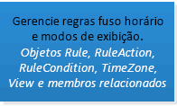
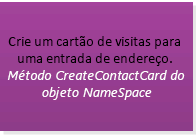

# Escolher uma API ou tecnologia para desenvolver soluções para o Outlook

Este artigo descreve as APIs e tecnologias que você pode usar para estender o Outlook 2013 e o Outlook 2016 e ajuda você a se decidir pela API ou a tecnologia apropriada para seu cenário.
  
A Microsoft oferece suporte a várias APIs e tecnologias que estendem o Outlook: 
  
- A partir do Office 2013, a plataforma aplicativos do Office abre oportunidades para estender a funcionalidade do Outlook pelos clientes do Outlook na área de trabalho, Tablet e Smartphone. A plataforma inclui uma API JavaScript para o Office e um esquema para manifestos de aplicativos.
    
- O modelo de objeto, o Microsoft Outlook Primary Interop Assembly (PIA), e o MAPI (Messaging API) têm sido as APIs mais comumente usadas nas soluções do Outlook.
    
- As APIs auxiliares complementam o MAPI em alguns cenários.
    
- A extensibilidade do provedor do Outlook Social Connector (OSC) e a extensibilidade da Barra do Tempo servem cenários específicos de seus nichos de mercado.
    
Este artigo explica os critérios de seleção para a plataforma de suplementos do Office, o modelo de objeto, o PIA e o MAPI. Observe que os suplementos do Office usam a API JavaScript para Office e não chamam o modelo de objeto, e vice-versa. Soluções que usam outras APIs podem usar uma ou mais APIs. Por exemplo, um suplemento COM escrito no C++ pode usar o modelo de objeto, MAPI e APIs auxiliares na mesma solução.
  
Para obter o máximo de benefícios deste artigo, você deve estar familiarizado com o Outlook no nível do usuário e ter conhecimentos gerais de desenvolvimento de software. No entanto, não é necessário ter um conhecimento abrangente dos recursos compatíveis com essas APIs ou tecnologias. O artigo ajuda a responder as seguintes perguntas:
  
- Se você tem apenas uma ideia sobre os objetivos de sua solução, o mercado-alvo e os recursos disponíveis, que outros critérios você deve considerar para selecionar uma API?
    
- Por que você deve considerar os suplementos do Office e quando optar por criar aplicativos em vez de suplementos?
    
- Se a solução tiver que ser executada nas versões anteriores do Outlook, incluindo o Outlook 2003, como isso afeta a sua escolha da API?
    
- Se a solução tiver que se iterar nas pastas do Outlook que contenham milhares de itens e você precisar modificar esses itens, qual API seria melhor?
    
- Se sua solução depende muito da lógica comercial do Outlook e interage com outros aplicativos do Office, o modelo de objeto do Outlook é a melhor opção?
    
- O que o modelo de objeto e o MAPI permitem estender no Outlook?
    
- Se for possível usar o modelo de objeto ou o MAPI para realizar sua tarefa, como você deverá decidir qual API usar?

## Critérios de avaliação objetiva

Esta seção descreve os critérios que você pode usar para comparar a plataforma de Suplementos do Office, modelo de objeto, PIA e MAPI para determinar o que melhor atende às suas necessidades. Diferentes critérios podem ser mais ou menos importantes, dependendo dos seus projetos e recursos disponíveis.
  
As tabelas nesta seção definem critérios de avaliação nas categorias a seguir:
  
- Critérios funcionais: descreve o que você pode e não pode fazer com a tecnologia.
    
- Critérios de desenvolvimento: descreve as ferramentas de desenvolvimento ou informações que você precisa para usar a tecnologia
    
- Critérios de segurança: descreve os problemas de segurança e permissões relacionados à tecnologia.
    
- Critérios de implantação: descreve os métodos de implantação e distribuição recomendados para a tecnologia.

### Critérios de avaliação objetiva para os aplicativos da plataforma Office

A partir do Office 2013, os desenvolvedores podem usar a plataforma de suplementos do Office para estender o conteúdo e os serviços da Web para o contexto dos clientes Web e avançados do Office. Um suplemento do Office é uma página da Web desenvolvida usando tecnologias da Web comuns, hospedadas dentro de um aplicativo de cliente do Office (como o Outlook), que pode ser executada no local ou na nuvem. Entre os poucos tipos de suplementos do Office, o tipo compatível com o Outlook é chamado de aplicativo de email. Enquanto o modelo de objeto, PIA e MAPI geralmente são usados para automatizar o Outlook no nível do aplicativo, você pode usar a API avaScript para o Office para interagir em um nível de item com o conteúdo e as propriedades de uma mensagem de email, solicitação de reunião ou compromisso. Você pode publicar aplicativos de email na Office Store ou em um catálogo interno do Exchange. 
  
Os usuários finais e administradores podem instalar aplicativos de email em uma caixa de correio do Exchange e usar os aplicativos de email no cliente avançado do Outlook e no Outlook Web App. Como desenvolvedor, você pode optar por disponibilizar o aplicativo de email somente no computador ou no Tablet ou no smartphone. A Figura 1 mostra um exemplo de um aplicativo de email do YouTube, descrito em detalhes em [Amostra: criar um suplemento de email para exibir vídeos do YouTube no Outlook](https://docs.microsoft.com/samples/browse/?redirectedfrom=MSDN-samples). O aplicativo de email do YouTube permite que os usuários finais selecionem uma URL de um vídeo do YouTube e assistam ao vídeo no Outlook ou no Outlook Web App, no computador ou no tablet.
  
**Figura 1. O aplicativo de email do YouTube está ativo para a mensagem selecionada, que contém uma URL de um vídeo no YouTube.com**

  
Depois que o usuário instala o aplicativo de email, ele fica disponível para uso na barra do aplicativo quando o contexto atual corresponder às condições de ativação especificadas pelo aplicativo. Um aplicativo de email permite que você especifique regras sobre o item selecionado que ativará um aplicativo de email somente se determinadas condições forem atendidas. Por exemplo, o aplicativo de email do YouTube que permite que você reproduza um vídeo do YouTube no Outlook só será relevante quando o item selecionado do Outlook contiver uma URL para um vídeo no YouTube.com. Nesse caso, você deveria especificar que o aplicativo só deve estar ativo quando a mensagem selecionada contiver tal URL.
  
As tabelas a seguir mostram os critérios de avaliação para a plataforma de suplementos do Office.
  
#### Critérios funcionais

|**Critérios**|**Suporte a aplicativos de email em aplicativos para a plataforma do Office**|
|:-----|:-----|
|Domínio do aplicativo    |O escopo da atividade de um aplicativo de email é praticamente qualquer item de mensagem ou compromisso compatível com a caixa de correio do Exchange do usuário que o usuário selecionou e que atenda às condições de ativação. As permissões de um aplicativo de email determinam seu acesso às propriedades e entidades específicas (como um endereço de email ou número de telefone) que existem para esse item. Por exemplo, um aplicativo de email solicitando a permissão para **leitura/gravação de caixa de correio** pode ler e gravar todas as propriedades de qualquer item na caixa de correio do usuário; criar, ler e gravar em qualquer pasta ou item; e enviar um item dessa caixa de correio.   |
|Objetos principais    |O JavaScript API para Office fornece alguns objetos no nível superior que são compartilhados por todos os tipos de suplementos do Office: [Office](https://msdn.microsoft.com/library/c490b13d-ee52-4291-af5d-f4a5a11d3af0%28Office.15%29.aspx), [Contex](https://msdn.microsoft.com/library/662883d5-b86f-4bdc-99f0-9ee9129ed16c%28Office.15%29.aspx)e [AysncResult](https://msdn.microsoft.com/library/540c114f-0398-425c-baf3-7363f2f6bc47%28Office.15%29.aspx). O próximo nível da API aplicável e específico aos aplicativos de email inclui [Caixa de correio](https://msdn.microsoft.com/library/a3880d3b-8a09-4cf9-9274-f2682cb3b769%28Office.15%29.aspx), [Item](https://msdn.microsoft.com/library/ad288df1-3ca2-474c-bea4-c51f46e6fc43%28Office.15%29.aspx)e [UserProfile](https://msdn.microsoft.com/library/6d0a36ec-0d5c-40e3-9f6f-9a7fcf0ac3d8%28Office.15%29.aspx), que oferecem suporte ao acesso a informações sobre o usuário e ao item atualmente selecionado na caixa de correio do usuário. No nível de dados, os objetos [CustomProperties](https://msdn.microsoft.com/library/95a69bd6-c4dc-429a-8b27-e2b68f74f3e3%28Office.15%29.aspx) e [RoamingSettings](https://msdn.microsoft.com/library/cf21bb08-7274-4ad6-ae9e-b2c12f92abc9%28Office.15%29.aspx) oferecem suporte a propriedades persistentes configuradas pelo aplicativo email para o item selecionado e para a caixa de correio do usuário, respectivamente. Os objetos de nível de item incluem os objetos [Appointment](https://msdn.microsoft.com/library/08ebffff-eb52-4e21-9d4e-8f79e426f992%28Office.15%29.aspx) e [Message](https://msdn.microsoft.com/library/909ad9eb-a1bc-4caa-b51e-fd59a02b9569%28Office.15%29.aspx)que herdam de **Item**, e o objeto [MeetingRequest](https://msdn.microsoft.com/library/c658fa3d-1138-4a67-9a4b-c9edd11f8385%28Office.15%29.aspx) que herda de **Message**. Eles representam os tipos de itens do Outlook compatíveis com aplicativos de email: itens de calendário de compromissos e reuniões e itens de mensagem, como mensagens de email, solicitações de reunião, respostas e cancelamentos. Além desse nível na API, há propriedades no nível do item (por exemplo, [Appointment.subject](https://msdn.microsoft.com/library/ffa6812c-34b8-4b0a-8f92-22c3580c8379%28Office.15%29.aspx)), assim como objetos e propriedades que oferecem suporte a determinados objetos[Entities](https://msdn.microsoft.com/library/1a06c8d1-dafe-46f4-967e-dd9b1d5b20e9%28Office.15%29.aspx) conhecidos (por exemplo, [Contact](https://msdn.microsoft.com/library/2604b44c-7b79-47f0-ac3e-7d99bc9e6751%28Office.15%29.aspx), [MeetingSuggestion](https://msdn.microsoft.com/library/9726fbff-0f4f-4b70-8deb-effc14607d4e%28Office.15%29.aspx), [PhoneNumber](https://msdn.microsoft.com/library/cc86426a-2730-4774-9067-0611e5c8e9c1%28Office.15%29.aspx)e [TaskSuggestion](https://msdn.microsoft.com/library/16b0c3d6-adf4-4a88-ad09-4bb5565816b1%28Office.15%29.aspx)).    Confira [Visão geral da arquitetura e dos recursos do Outlook](https://msdn.microsoft.com/library/2cd5641b-492b-4431-8388-7fc589163e9c%28Office.15%29.aspx) para obter um resumo dos recursos compatíveis com os aplicativos de email.    |
|Modelo de acesso a dados    |A API do JavaScript para Office representa os recursos a seguir como um conjunto hierárquico de objetos: ambiente de tempo de execução do aplicativo, caixa de correio do usuário e o perfil, além de dados sobre um item.    |
|Modelos de Threading    |Cada aplicativo de email é executado em seu próprio processo separado do processo do Outlook.    |
|Arquiteturas de aplicativos    |No Outlook, um aplicativo de email é um conjunto de páginas da Web HTML e JavaScript hospedadas como um processo separado dentro de um controle de navegador da web que, por sua vez, é hospedado dentro de um processo de tempo de execução do aplicativo que fornece isolamento de segurança e desempenho.    |
|Uso remoto    |Os aplicativos de email usam o JavaScript API do Office para acessar os dados do usuário atual, da caixa de correio e do item selecionado armazenados no servidor do Exchange correspondente. Desde que tenham as permissões apropriadas e usem a técnica adequada para o acesso entre domínios, os aplicativos de email também podem ligar para os serviços Web do Exchange e outros serviços Web de terceiros para estender sua funcionalidade.    |
|Transações    |A API JavaScript para Office não oferece suporte a transações.    |
|Disponibilidade    |A API JavaScript para Office está disponível para caixas de correio no Exchange Server 2013, começando no Outlook 2013.    |
   
#### Critérios de desenvolvimento

|**Critérios**|**Suporte a aplicativos de email em aplicativos para a plataforma do Office**|
|:-----|:-----|
|Ferramentas e idiomas    |Você pode implementar aplicativos de email usando qualquer tecnologia comum da Web, incluindo as APIs HTML5, JavaScript, CSS3, XML e REST. Você pode usar sua ferramenta de desenvolvimento da Web preferida. Como alternativa, usar Napa, Visual Studio 2012 ou uma versão mais recente dessas ferramentas fornece comodidades que pouparão tempo no desenvolvimento.    |
|Implementação gerenciada    |Quando for apropriado em seu cenário, você poderá usar páginas Managed.aspx para implementar o código do lado do servidor para seus aplicativos de email.    |
|Programável    |A API avaScript para Office é usada diretamente em scripts.    |
|Ferramentas de depuração e teste    |Você pode usar qualquer uma das ferramentas de desenvolvimento de Web que preferir. O Napa e o Visual Studio fornecem um ambiente de desenvolvimento integrado que facilita os testes e a depuração de aplicativos. [Solucionar problemas de ativação do suplemento do Outlook](https://msdn.microsoft.com/library/da5b56c9-7fd1-4556-8c0e-f489c4c9e9b6%28Office.15%29.aspx) e [Amostra: Propriedades de depuração dos itens do Outlook](https://code.msdn.microsoft.com/office/Mail-apps-for-Outlook-faca78cd) fornecem mais ajuda na solução de problemas e na depuração de aplicativos de email.   |
|Disponibilidade especializada    |Os programadores que têm o nível necessário de experiência de desenvolvimento na Web para suplementos do Office são relativamente fáceis de localizar. A plataforma destina-se a desenvolvedores profissionais e não profissionais.    |
|Informações disponíveis    |As informações sobre o desenvolvimento e a postagem de suplementos do Office estão disponíveis em [Criar aplicativos do Office e do SharePoint](https://msdn.microsoft.com/office/apps/fp160950.aspx). A documentação específica para os aplicativos de email está disponível em [Suplementos do Outlook](https://msdn.microsoft.com/library/71e64bc9-e347-4f5d-8948-0a47b5dd93e6%28Office.15%29.aspx).    |
|Licenciamento de implantação e desenvolvedor    |Consulte [Licenciar seus suplementos do Office e do SharePoint](https://msdn.microsoft.com/library/3e0e8ff6-66d6-44ff-b0c2-59108ebd9181%28Office.15%29.aspx) para obter informações sobre a estrutura de licença do aplicativo para suplementos do Office.    |
   
#### Critérios de segurança

|**Critérios**|**Suporte a aplicativos de email em aplicativos para a plataforma do Office**|
|:-----|:-----|
|Permissões de tempo de design    |Nenhuma permissão especial é necessária para o desenvolvimento de aplicativos de email.    |
|Configuração de permissões    |Por padrão, os usuários finais e os administradores podem instalar aplicativos de email de baixa confiança que exigem permissão **restrita** ou **de leitura de item**, e os administradores podem instalar aplicativos de email de alta confiança que exijam permissão de **leitura/gravação de caixa de correio**.    |
|Permissões de tempo de execução    |Aplicativos de email solicitam um determinado nível de permissão que se baseia em um modelo de permissões de três camadas: **restrita**, **leitura de item** e **leitura/gravação de caixa de correio**.    |
|Recursos internos de segurança    | O tempo de execução de suplementos do Office fornece os seguintes benefícios para impedir que um aplicativo danifique o ambiente do usuário final:     Isola o processo em que o aplicativo é executado.     Não envolve substituição de .dll ou .exe ou componentes ActiveX.     Facilita a instalação ou a desinstalação de aplicativos do usuário final.     O administrador e os usuários finais têm controle sobre os aplicativos de email disponibilizados e se devem conceder a permissão solicitada antes de instalar um aplicativo de email.     No caso de clientes avançados, controla o uso de memória e CPU para impedir ataques maliciosos de negação de serviço.    |
|Recursos de monitoramento de segurança    | Para os aplicativos de email, os seguintes recursos são monitorados:     Uso da CPU principal.     Uso de memória.     Número de falhas.     Intervalo de tempo para bloquear um aplicativo.     Tempo de resposta de expressão regular.     Número de vezes que você reavalia as expressões regulares.     Os administradores podem substituir as configurações padrão que governam o uso do recurso.    |
   
#### Critérios de implantação

|**Critérios**|**Suporte a aplicativos de email em aplicativos para a plataforma do Office**|
|:-----|:-----|
|Requisitos da plataforma do servidor    |A caixa de correio do usuário na qual um aplicativo de email está instalado deve estar no Exchange Server 2013 ou em uma versão posterior.    |
|Requisitos da plataforma do cliente    |Para que um aplicativo de email seja executado no cliente avançado do Outlook, no Outlook 2013, no Internet Explorer 9, ou em uma versão posterior desses aplicativos, eles devem estar instalados no computador local.    |
|Métodos de implantação    |Você pode publicar aplicativos de email na Office Store ou em um catálogo do Exchange que torna o aplicativo disponível para os usuários do Exchange Server. Os administradores ou usuários podem optar por instalar um aplicativo de email da Office Store ou catálogo do Exchange usando o centro de administração do Exchange ou executando cmdlets do Windows PowerShell remotos. Você pode acessar a EAC no modo de exibição Backstage do Outlook ou no Outlook Web App, ou entrando diretamente no EAC para sua caixa de correio.    Para saber mais, confira [implantar e instalar suplementos do Outlook para teste](https://msdn.microsoft.com/library/d6eea4c4-bb21-4f24-bcba-1eccbb4e12dd%28Office.15%29.aspx).    |
|Notas de implantação    |Depois de instalar um aplicativo de email no Outlook ou no Outlook Web App, o aplicativo de email fica disponível para essa caixa de correio em clientes do Outlook.    |

### Critérios de avaliação objetiva para o modelo de objeto e PIA

As soluções executadas no computador cliente podem usar o modelo de objeto do Outlook ou PIA para acessar itens do Outlook programaticamente, como contatos, mensagens, itens de calendário, solicitações de reunião e tarefas. Diferentemente do MAPI, o modelo de objeto do Outlook e o PIA podem fornecer notificações de evento para alterações na interface do usuário do Outlook, como alterar a pasta atual ou exibir um inspetor do Outlook.
  
> [!NOTE]
> Para obter uma solução para acessar os dados armazenados em uma caixa de correio do Microsoft Exchange ou em um arquivo de pastas particulares (.pst), o Outlook deve ser instalado e configurado no computador cliente em que o aplicativo está sendo executado. O modelo de objeto do Outlook e PIA oferecem suporte à mesma funcionalidade do Outlook.  O PIA define interfaces gerenciadas que são mapeadas para o modelo de objeto baseado em COM e com as quais uma solução gerenciada pode interagir. Nas discussões restantes nesta seção, a maioria dos critérios funcionais, de segurança e de implantação se aplicam ao modelo de objeto e ao PIA da mesma maneira. Para obter mais informações sobre como o PIA facilita a interoperabilidade entre o COM e o .NET Framework, confira [Introdução à interoperabilidade entre COM e .NET](https://msdn.microsoft.com/library/6b2d099a-ec6f-4099-aaf6-e61003fe5a32%28Office.15%29.aspx) e [Arquitetura do PIA do Outlook](https://msdn.microsoft.com/library/89577d14-e6e2-4270-8e72-b0adba378667%28Office.15%29.aspx). 
  
As tabelas a seguir mostram os critérios de avaliação para o modelo de objeto do Outlook e o PIA.
  
#### Critérios funcionais

|**Critérios**|**PIA ou modelo de objeto do Outlook**|
|:-----|:-----|
|Domínio do aplicativo    |Os suplementos ou aplicativos independentes que usam o modelo de objeto do Outlook ou PIA geralmente lidam com mensagens específicas do usuário, personalizam a interface do usuário do Outlook ou criam tipos de itens personalizados para soluções especializadas, como soluções de gerenciamento de relacionamento com cliente (CRM) que se integram ao Outlook. O modelo de objeto do Outlook ou PIA às vezes é usado para processamento de mensagens em um processo informal de fluxo de trabalho, especialmente quando o desenvolvimento de aplicativos no Microsoft Exchange Server não é permitido. Diferentemente dos clientes baseados em navegador, a operação em modo cache permite que as soluções do Outlook funcionem quando o usuário estiver offline ou desconectado da rede corporativa.    |
|Objetos principais    |O objeto de nível superior no modelo de objeto do Outlook e PIA é o objeto [Application](https://msdn.microsoft.com/library/797003e7-ecd1-eccb-eaaf-32d6ddde8348%28Office.15%29.aspx) object. [Explorers](https://msdn.microsoft.com/library/8398532a-1fad-7390-6778-109ac5e6c67c%28Office.15%29.aspx), [Conversation](https://msdn.microsoft.com/library/2705d38a-ebc0-e5a7-208b-ffe1f5446b1b%28Office.15%29.aspx), [Inspectors](https://msdn.microsoft.com/library/b65475d6-a212-fc96-459d-47390dfe5ee5%28Office.15%29.aspx), [Views](https://msdn.microsoft.com/library/5dd7edc2-12a2-f4c2-d158-8053d80e8dc9%28Office.15%29.aspx), [NavigationPane](https://msdn.microsoft.com/library/b6538c72-6115-99fc-c926-e0532a747823%28Office.15%29.aspx), [SolutionsModule](https://msdn.microsoft.com/library/4597765e-a95d-bf07-2ac4-103218ebc696%28Office.15%29.aspx), [FormRegion](https://msdn.microsoft.com/library/3a0b83eb-4076-9cb3-86a9-68f9e44df89f%28Office.15%29.aspx), e objetos relacionados representam elementos da interface do usuário do OutlookThe [NameSpace](https://msdn.microsoft.com/library/f0dcaa19-07f5-5d42-a3bf-2e42b7885644%28Office.15%29.aspx), [Stores](https://msdn.microsoft.com/library/8915a8e4-9c22-21d5-c492-051d393ce5f7%28Office.15%29.aspx), [Folders](https://msdn.microsoft.com/library/0c814c3c-74fc-414c-982d-a0097fcb35c2%28Office.15%29.aspx), [Accounts](https://msdn.microsoft.com/library/2510b7d7-5062-8ea3-dda4-b544d2882a2b%28Office.15%29.aspx), [AccountSelector](https://msdn.microsoft.com/library/846f176e-5680-a214-7624-75f3a524c989%28Office.15%29.aspx), [AddressEntries](https://msdn.microsoft.com/library/db91b717-07c6-d1f2-c545-b766ee1f0c6b%28Office.15%29.aspx), [ExchangeUser](https://msdn.microsoft.com/library/6ec117d1-7fdb-aa36-b567-1242f8238df0%28Office.15%29.aspx), e objetos relacionados oferecem suporte à extensão de sessões, perfis, contas de usuário, armazenamentos de mensagens e pastas do Outlook. No nível dos dados, vários objetos no nível do item, como [MailItem](https://msdn.microsoft.com/library/14197346-05d2-0250-fa4c-4a6b07daf25f%28Office.15%29.aspx), [AppointmentItem](https://msdn.microsoft.com/library/204a409d-654e-27aa-643a-8344c631b82d%28Office.15%29.aspx), [ContactItem](https://msdn.microsoft.com/library/8e32093c-a678-f1fd-3f35-c2d8994d166f%28Office.15%29.aspx), and [TaskItem](https://msdn.microsoft.com/library/5df8cfa5-5460-a5a1-a130-ba5bca1a0091%28Office.15%29.aspx), representam os tipos de itens internos do Outlook. [PropertyAccessor](https://msdn.microsoft.com/library/2fc91e13-703c-3ec9-9066-ffee7144306c%28Office.15%29.aspx), [Table](https://msdn.microsoft.com/library/0affaafd-93fe-227a-acee-e09a86cadc20%28Office.15%29.aspx), [Search](https://msdn.microsoft.com/library/226a5d49-3caf-90dd-725c-265404d1939f%28Office.15%29.aspx), [ItemProperties](https://msdn.microsoft.com/library/34a110ed-6617-72da-1e98-a9773c705b40%28Office.15%29.aspx), [UserDefinedProperties](https://msdn.microsoft.com/library/196e5d4c-22be-02d3-95e0-3ea7594c2e4b%28Office.15%29.aspx), [Attachments](https://msdn.microsoft.com/library/4cc96a5f-a822-8ad5-6f61-e996bee8ba22%28Office.15%29.aspx), [Categories](https://msdn.microsoft.com/library/319efa26-269d-9f2f-c8ec-33082e80a9e2%28Office.15%29.aspx), [Recipients](https://msdn.microsoft.com/library/774f56b7-4de8-9584-60cd-4fbf361f4c85%28Office.15%29.aspx), [RecurrencePattern](https://msdn.microsoft.com/library/36c098f7-59fb-879a-5173-ed0260d13fa4%28Office.15%29.aspx), [Reminders](https://msdn.microsoft.com/library/66b94251-7fe4-886b-7c29-7feac4440dee%28Office.15%29.aspx), [Rules](https://msdn.microsoft.com/library/dd41b4de-bf5f-5532-46c9-394a5d078bec%28Office.15%29.aspx) e objetos relacionados oferecem suporte à personalização e manipulação de objetos no nível do item.  |
|Modelo de acesso a dados    |O modelo de objeto do Outlook e PIA representam todos os dados como um conjunto hierárquico de objetos e coleções.    |
|Modelos de Threading    |Todas as chamadas para o modelo de objeto do Outlook e o PIA são executadas no thread principal do Outlook. O único modelo de encadeamento suportado pelo modelo de objeto do Outlook é STA (single-threaded apartment). Não é possível chamar o modelo de objeto do Outlook ou PIA a partir de um thread em segundo plano e isso pode levar a erros e resultados inesperados em sua solução.    |
|Arquiteturas de aplicativos    |Geralmente, suplementos de COM e outros aplicativos do Office usam o modelo de objeto do Outlook para estender o Outlook. As soluções gerenciadas podem usar o PIA do Outlook e a camada de interoperabilidade COM do Visual Studio e o .NET Framework para acessar o modelo de objeto do Outlook. O Visual Studio fornece modelos e bibliotecas de classe adicionais e manifestos para facilitar a personalização de documentos e aplicativos do Office. Para obter mais informações sobre como usar o Visual Studio para desenvolver suplementos gerenciados do Outlook, confira [Arquitetura de Suplementos de Nível de Aplicativo](https://msdn.microsoft.com/library/978f102f-15c6-44e4-84e8-80b161408324.aspx) e [Soluções do Outlook](https://msdn.microsoft.com/library/2ae3cd9c-bf31-4efa-8b18-b6b1c34a8d93.aspx). O modelo de objeto do Outlook também oferece suporte a macros do Visual Basic for Applications (VBA) e ao WSH (Windows Scripting Host), mas não oferece suporte a aplicativos de serviço do Windows.   |
|Uso remoto    |O modelo de objeto do Outlook e o PIA só podem ser usados em um computador no qual o Outlook esteja instalado. O modelo de objeto do Outlook pode ser usado para acessar informações armazenadas no Exchange que estão disponíveis no aplicativo Outlook.    |
|Transações    |O modelo de objeto do Outlook e PIA não dão suporte a transações.    |
|Disponibilidade    |O modelo de objeto do Outlook está disponível em todas as versões do Outlook. O PIA está disponível nas versões do Outlook a partir do Outlook 2003. Houve extensões e melhorias em cada nova versão do Outlook.    |
   
#### Critérios de desenvolvimento

|**Critérios**|**PIA ou modelo de objeto do Outlook**|
|:-----|:-----|
|Ferramentas e idiomas    |Você pode implementar aplicativos de modelo de objeto do Outlook usando qualquer linguagem compatível com automação ou COM, como Visual Basic ou C#, bem como idiomas não-COM, como C ou C ++ nativo. As ferramentas de desenvolvimento do Microsoft Office no Microsoft Visual Studio 2010 são as ferramentas preferidas para o desenvolvimento de suplementos gerenciados para o Outlook 2010 e o Outlook 2007. As ferramentas do Microsoft Visual Studio 2005 para o Microsoft Office System são as ferramentas preferidas para o Outlook 2003. Você também pode usar as ferramentas de desenvolvimento do Office no Visual Studio 2010 para criar soluções para as versões de 32 e 64 bits do Outlook. Quando você cria uma solução nas ferramentas de desenvolvimento do Office no Visual Studio 2010 ou no Microsoft Visual Studio Tools para o Microsoft Office System, especifique a opção **Qualquer CPU** para a plataforma de destino para resultar em soluções gerenciadas que funcionam nas versões de 32 e 64 bits do Outlook 2010.  |
|Implementação gerenciada    |O PIA do Outlook permite que o modelo de objeto do Outlook seja usado em um ambiente de código gerenciado, suportado por um rico conjunto de bibliotecas de classes e tecnologias de suporte que abordam muitas limitações dos suplementos VBA e COM. O PIA é um invólucro COM que atua como uma ponte entre os ambientes gerenciado e COM. Para mais informações, veja [Por que usar o PIA do Outlook](https://msdn.microsoft.com/library/5cc9085e-7c97-4698-8cb9-e33e427c02e7%28Office.15%29.aspx).  |
|Programável    |O modelo de objeto do Outlook pode ser usado em scripts.    |
|Ferramentas de depuração e teste    |Nenhuma ferramenta de depuração especial é necessária para usar o modelo de objeto do Outlook ou PIA. Por outro lado, você pode usar o Visual Studio para fornecer um ambiente de desenvolvimento integrado que facilita os testes e a depuração de aplicativos.    |
|Disponibilidade especializada    |Os desenvolvedores que podem desenvolver aplicativos usando o modelo de objeto do Outlook ou PIA são relativamente fáceis de localizar. O modelo de objeto do Outlook e o PIA devem ser criados por suplementos, usando ferramentas de desenvolvimento amplamente disponíveis, como o Visual Studio. Essas ferramentas fornecem ambientes de tempo de design que simplificam o processo de desenvolvimento.    |
|Informações disponíveis    |Informações sobre programação usando o modelo de objeto do Outlook estão disponíveis nos recursos da Microsoft e de terceiros. Para obter mais informações sobre o modelo de objeto do Outlook, consulte [Referência do desenvolvedor do Outlook 2010](https://msdn.microsoft.com/library/75e4ad96-62a2-49d2-bc51-48ceab50634c%28Office.15%29.aspx). Para obter mais informações sobre o PIA do Outlook, consulte [Referência do assembly de interoperabilidade primária do Outlook 2010](https://msdn.microsoft.com/library/54bdde85-8dc9-4498-a1ac-f72eaf8f0cd3%28Office.15%29.aspx). Para exemplos de soluções gerenciadas do Outlook desenvolvidas usando as ferramentas de desenvolvimento do Office no Visual Studio, consulte [Soluções do Outlook com o Visual Studio](https://msdn.microsoft.com/vsto/dd162450.aspx).  |
|Licenciamento de implantação e desenvolvedor    |Confira o seu contrato de licença de assinatura do MSDN (Microsoft Developer Network) para determinar se serão necessárias licenças adicionais para o Outlook e o modelo de objeto do Outlook usando os aplicativos.    |
   
#### Critérios de segurança

|**Critérios**|**PIA ou modelo de objeto do Outlook**|
|:-----|:-----|
|Permissões de tempo de design    |Nenhuma permissão especial é necessária para o desenvolvimento de aplicativos usando o modelo de objeto do Outlook ou PIA.    |
|Configuração de permissões    |Nenhuma permissão especial é necessária para instalar aplicativos que usam o modelo de objeto do Outlook ou PIA. No entanto, os direitos de administrador local são necessários para instalar o Office e o Outlook.    |
|Permissões de tempo de execução    |Nenhuma permissão especial é necessária para executar aplicativos que usam o modelo de objeto do Outlook ou PIA.    |
|Recursos internos de segurança    |O modelo de objeto do Outlook e o PIA se comunicam com o Exchange usando o MAPI e o Active Directory usando as interfaces de serviço do Active Directory (ADSI). O contexto de segurança atual do usuário que está executando o aplicativo é usado para determinar quais recursos podem ser acessados por códigos. Por padrão, os suplementos são confiáveis para o acesso total a todos os objetos, propriedades e métodos no PIA ou no modelo de objeto do Outlook. Os administradores de TI podem exercer controle sobre quais suplementos e objetos podem acessar o modelo de objeto do Outlook ou PIA. O modelo de objeto do Outlook e o PIA impedem que o código executado fora do processo do Outlook acesse objetos e métodos seguros.    |
|Recursos de monitoramento de segurança    | O Outlook monitora as seguintes métricas de um suplemento para determinar se ele deve desabilitar o suplemento:     Startup     Break     Parâmetro de Pasta     Item aberto    Frequência **Invocada**     Os administradores podem usar a política de grupo para substituir as configurações do usuário e controlar os suplementos executados nos computadores dos usuários.     Para saber mais, confira [Critérios de desempenho para manter os suplementos habilitados](https://msdn.microsoft.com/library/office/4c6d44d2-238b-42d8-896b-51d513c9e14c#ol15WhatsNew_AddinDisabling).    |
   
#### Critérios de implantação

|**Critérios**|**PIA ou modelo de objeto do Outlook**|
|:-----|:-----|
|Requisitos da plataforma do servidor    |O modelo de objeto do Outlook e o PIA são tecnologias do lado do cliente.    |
|Requisitos da plataforma do cliente    |Os aplicativos que usam o modelo de objeto do Outlook ou PIA para acessar os dados do Exchange exigem que o Outlook esteja instalado no computador local.    |
|Métodos de implantação    |Os aplicativos que usam o modelo de objeto do Outlook ou PIA são distribuídos usando o software padrão de instalação de aplicativos.    |
|Notas de implantação    |Como o Outlook não deve ser instalado no Exchange Server, os aplicativos que usam o modelo de objeto do Outlook ou PIA não podem ser executados no Exchange Server.    |

### Critérios de avaliação objetiva para MAPI

Você pode usar o MAPI para acessar itens e pastas em repositórios públicos e privados, bem como para acessar as propriedades armazenadas em cada item. Todas as versões do Outlook usam MAPI. Você pode criar clientes que usam o MAPI, além disso, também pode criar servidores MAPI e manipuladores de formulários MAPI. As informações nesta seção se aplicam apenas a aplicativos MAPI de cliente.
  
> [!NOTE]
> MAPI é um mecanismo maduro usado para acessar informações no Exchange ou em um arquivo de pastas particulares (.pst) e o MAPI fornece alguns recursos que não estão disponíveis em nenhuma outra API. No entanto, o MAPI não funciona bem fora de uma intranet, mantém uma conexão aberta durante a sessão MAPI e pode ser difícil de aprender. O MAPI não aplica a lógica comercial do Outlook, portanto, você deve tomar um cuidado especial para garantir que a lógica comercial do Outlook seja mantida. 
  
As tabelas a seguir mostram os critérios de avaliação para MAPI.
  
#### Critérios funcionais

|**Critérios**|**MAPI**|
|:-----|:-----|
|Domínio do aplicativo    |Os aplicativos clientes que usam MAPI acessam as informações de uma caixa de correio ou pasta pública do usuário armazenadas no Exchange e as informações do diretório do usuário armazenadas no Active Directory. Os aplicativos clientes que usam MAPI geralmente são clientes de email, como o Outlook, e aplicativos que requerem processamento de email complexo.    |
|Objetos principais    |Os objetos MAPI são todos obtidos por meio da interface [IMAPISession: IUnknown](https://msdn.microsoft.com/library/5650fa2a-6e62-451c-964e-363f7bee2344%28Office.15%29.aspx). O objeto de sessão fornece o acesso do cliente a objetos para trabalhar com perfis MAPI, status, administração do provedor de serviços de mensagem, tabelas de repositório de mensagens e catálogos de endereços. A tabela armazenamento de mensagens contém objetos para o repositório de mensagens, pastas, mensagens, anexos e destinatários. As tabelas do catálogo de endereços contêm objetos para usuários e listas de distribuição.    |
|Modelo de acesso a dados    |O MAPI representa as mensagens e os usuários como um conjunto hierárquico de objetos.    |
|Modelos de Threading    |Não há nenhuma proibição específica de segmentação. No entanto, os aplicativos que usam threading livre devem evitar o compartilhamento de objetos MAPI entre segmentos devido aos altos custos de empacotamento do objeto. Os provedores de serviços MAPI e MAPI usam threading livre.    |
|Arquiteturas de aplicativos    |Aplicativos cliente MAPI são geralmente aplicativos clientes baseados em Windows Forms. No entanto, você pode usar o MAPI para escrever aplicativos de camada N.    |
|Uso remoto    |O MAPI usa chamadas de procedimento remoto (RPCs) para se comunicar com o servidor Exchange. Geralmente, as RPCs estão propositadamente impedidas de passar por firewalls da Internet.    |
|Transações    |O MAPI não dá suporte a transações.    |
|Disponibilidade    |Um esboço MAPI atualmente é fornecido com todas as versões do Windows. O Office instala seu próprio subsistema MAPI ao instalar o Outlook. Nenhuma alteração no MAPI está prevista no momento.    |
   
#### Critérios de desenvolvimento

|**Critérios**|**MAPI**|
|:-----|:-----|
|Ferramentas e idiomas    |Você pode acessar diretamente o MAPI usando C ou C ++. Outros idiomas que podem acessar a convenção de chamada C / C ++ podem acessar MAPI. O uso de idiomas gerenciados, como Visual Basic ou C #, não é suportado. Você deve compilar soluções MAPI separadas para versões de 32 e 64 bits do Outlook.    |
|Implementação gerenciada    |O MAPI é um componente não gerenciado. O uso do MAPI não é compatível com a camada de interoperabilidade COM do Visual Studio e o .NET Framework. Para obter mais informações sobre o suporte a MAPI para componentes gerenciados, confira artigo da Base de Conhecimento [266353: Diretrizes de suporte para o desenvolvimento de mensagens do cliente](https://go.microsoft.com/fwlink/?LinkId=133254).    |
|Programável    |Os MAPI não podem ser usados diretamente em scripts.    |
|Ferramentas de depuração e teste    |Nenhuma ferramenta de depuração especial é necessária para depurar aplicativos que usam MAPI. Por outro lado, você pode usar o [MFCMAPI](https://mfcmapi.codeplex.com/). O MFCMAPI usa o MAPI para fornecer acesso a repositórios MAPI por meio de uma interface gráfica do usuário e facilita a investigação de problemas quando você estende o Outlook usando MAPI.    |
|Disponibilidade especializada    |Os programadores especializados em MAPI podem ser difíceis de localizar e aprender a tecnologia pode demorar muito tempo. Além das comunidades da Microsoft, há apenas um pequeno número de sites de terceiros de alta qualidade, que fornecem informações úteis de desenvolvimento MAPI.    |
|Informações disponíveis    |Os livros da Microsoft e de terceiros que descrevem a programação MAPI estão disponíveis.    |
|Licenciamento de implantação e desenvolvedor    |Não é necessário licenciamento especial para o desenvolvimento de aplicativos que usam MAPI.    |
   
#### Critérios de segurança

|**Critérios**|**MAPI**|
|:-----|:-----|
|Permissões de tempo de design    |O desenvolvedor deve ter permissões para acessar os dados no repositório do Exchange. O Exchange armazena informações de lista de usuários e distribuição no Active Directory, portanto, os desenvolvedores que criam aplicativos clientes MAPI que acessam essas informações devem ter a capacidade de recuperar e definir essas informações.    |
|Configuração de permissões    |Configurar aplicativos baseados em MAPI geralmente exige que o usuário seja um administrador local ou tenha direitos para instalar o software.    |
|Permissões de tempo de execução    |Executar um aplicativo baseado em MAPI geralmente exige que o usuário tenha permissões suficientes para acessar os dados em um repositório do Exchange ou em um arquivo de pastas particulares (.pst).    |
|Recursos internos de segurança    |Os perfis MAPI podem ser protegidos por senha na maioria das plataformas.    |
   
#### Critérios de implantação

|**Critérios**|**MAPI**|
|:-----|:-----|
|Requisitos da plataforma do servidor    |O Exchange Server em que os dados do usuário são armazenados para os usuários do aplicativo cliente MAPI devem ser configurados corretamente para permitir o acesso pelos clientes MAPI.    |
|Requisitos da plataforma do cliente    |O instalador do aplicativo cliente deve verificar se a versão correta do MAPI está disponível no computador e se ela está configurada corretamente usando o arquivo Mapisvc.inf.    |
|Métodos de implantação    |Aplicativos que usam MAPI podem ser implantados em computadores clientes usando tecnologias de distribuição de software padrão.    |
|Notas de implantação    |O instalador deve verificar se a versão correta do MAPI está disponível.    |

## Fatores de decisão para os aplicativos da plataforma Office

Como os suplementos do Office usam tecnologias da Web, eles são ideais para conectar-se aos serviços na nuvem ou no local e trazer os serviços para o contexto do cliente avançado e cliente da Web. Ao solicitar as permissões apropriadas, os aplicativos de email também permitem a leitura, escrita ou envio de itens em uma caixa de correio.
  
Estes são os motivos comuns pelos quais os aplicativos de email são a melhor opção para desenvolvedores do que os suplementos:
  
- Você pode usar o conhecimento existente e os benefícios das tecnologias da web, como HTML, JavaScript e CSS. Para usuários avançados e novos desenvolvedores, XML, HTML e JavaScript exigem um tempo de aceleração menos significativo do que as APIs baseadas em COM, incluindo o modelo de objeto e o MAPI.
    
- Você pode usar um modelo simples de implantação da Web para atualizar seu aplicativo de email (incluindo os serviços da Web que o aplicativo usa) em seu servidor Web sem nenhuma instalação complexa no cliente do Outlook. Na verdade, todas as atualizações para o aplicativo de email, com exceção do manifesto do aplicativo, não exigem nenhuma atualização no cliente do Office. Você pode atualizar o código ou a interface de usuário do aplicativo de email, convenientemente, no servidor Web. Isso representa uma vantagem significativa sobre a sobrecarga administrativa envolvida na atualização de suplementos.
    
- Você pode usar uma plataforma de desenvolvimento da Web comum para aplicativos de email que podem percorrer o Outlook Rich Client e o Outlook Web App na área de trabalho, tablet e smartphone. Por outro lado, os suplementos usam o modelo de objeto para o cliente avançado do Outlook e, portanto, podem ser executados apenas nesse cliente avançado em um formato de área de trabalho.
    
- Você pode aproveitar o retorno rápido para a criação e a liberação de aplicativos na Office Store.
    
- Devido ao modelo de permissões de três camadas, os usuários e os administradores do percebem melhor a segurança e privacidade em aplicativos de email do que suplementos, que têm acesso total ao conteúdo de cada conta no perfil do usuário. Isso, por sua vez, incentiva o consumo de aplicativos pelos usuários.
    
- Dependendo dos seus cenários, há recursos exclusivos de aplicativos de email que você pode aproveitar e que não são suportados pelos suplementos:
    
  - Você pode especificar um aplicativo de email para ativar apenas em certos contextos (por exemplo, o Outlook exibe o aplicativo na barra de aplicativos apenas se a classe de mensagem do compromisso selecionado pelo usuário for IPM.Appointment.Contoso ou se o corpo de um email contiver um número de rastreamento de pacote ou um identificador de cliente).
    
  - Você pode ativar um aplicativo de email se a mensagem selecionada contiver alguma entidade conhecida, como um endereço, contato, endereço de email, sugestão de reunião ou sugestão de tarefa.
    
  - Você pode tirar proveito da autenticação por tokens de identidade e de serviços Web do Exchange.
    
No entanto, os recursos a seguir são exclusivos para suplementos e podem torná-los uma opção mais adequada do que os aplicativos de email em algumas circunstâncias:
  
- Você pode usar os suplementos para estender ou automatizar o Outlook no nível do aplicativo, porque o modelo de objeto e a PIA têm integração abrangente com recursos do Outlook (como todos os tipos de item do Outlook, sessões de usuário, sessões e regras). No nível de item, os suplementos podem interagir com um item no modo de leitura ou de escrita. Com os aplicativos de email, você não pode automatizar o Outlook no nível do aplicativo e pode estender a funcionalidade do Outlook no contexto apenas do modo de leitura dos itens suportados (mensagens e compromissos) na caixa de correio do usuário.
    
- Você pode especificar a lógica de negócios personalizada para um novo tipo de item.
    
- Você pode modificar e adicionar comandos personalizados na faixa de opções e no modo de exibição Backstage.
    
- Você pode exibir uma página de formulário ou região de formulário personalizada.
    
- Você pode detectar eventos como enviar um item ou modificar as propriedades de um item.
    
- Você pode usar os suplementos no Outlook 2013 e no Exchange Server 2013, além das versões anteriores do Outlook e do Exchange. Por outro lado, os aplicativos de email funcionam com o Outlook e com o Exchange no Outlook 2013 e no Exchange Server 2013, mas não nas versões anteriores.
    
Para obter mais informações sobre os cenários que o modelo de objeto e o PIA suportam, consulte a próxima seção, [Fatores de decisão para o modelo de objeto ou PIA](#OLSelectAPI_FactorsOM). Para obter uma comparação da plataforma de suplementos do Office com outras tecnologias de extensibilidade do Office, consulte [Histórico de aplicativos para Office e SharePoint](https://blogs.msdn.com/b/officeapps/archive/2012/07/23/introducing-apps-for-the-new-office-and-sharepoint.aspx).

## Fatores de decisão para o modelo de objeto ou PIA

### Principais cenários de linha de base compatíveis com o modelo de objeto do Outlook ou PIA

Em geral, use o modelo de objeto ou o PIA se a sua solução personalizar a interface do usuário do Outlook ou se basear na lógica de negócios do Outlook. A seguir, os principais cenários de linha de base para os quais as soluções do Outlook usam o modelo de objeto ou o PIA. 
  
- [Personalizar a interface do usuário do Outlook](#OLSelectAPI_CustomizeTheOutlookInterface)
- [Adicionar, remover, ler, escrever, filtrar, pesquisar ou classificar itens do Outlook](https://docs.microsoft.com/office/vba/outlook/How-to/Items-Folders-and-Stores/outlook-item-objects)
- [Personalizar propriedades, campos e formulários do item](#OLSelectAPI_ItemPropFieldsForms)
- [Processar eventos do Outlook, como alternar pastas ou abrir um item](#OLSelectAPI_Events)
- [Automatizar o Outlook e integrá-lo a outros aplicativos do Office](#OLSelectAPI_AutomateOutlook)

<!--Images removed because we can't add a link to the images. If someone figures out a way to do this, you can add them back in but they're not really needed; I replaced them with a bulleted list here and after the next paragraph: 

-->

### Cenários compatíveis com o modelo de objeto ou PIA desde o Outlook 2007

Além dos cenários de linha de base, se sua solução do Outlook oferecer suporte a qualquer um dos cenários mostrados na lista a seguir e for executada no Outlook 2007 ou em versões posteriores, mas não em versões anteriores, você poderá usar o modelo de objeto ou o PIA também. Esta seção especifica os principais objetos ou membros que você pode usar no modelo de objeto do Outlook para estender cada cenário (com exceção da interface [IDTExtensibility2](https://docs.microsoft.com/dotnet/api/extensibility.idtextensibility2?view=visualstudiosdk-2017) no modelo de objeto de automação do Visual Studio e da interface [IRibbonExtensibility](https://docs.microsoft.com/office/vba/api/Office.IRibbonExtensibility) no modelo de objeto do Office, que você pode integrar com o modelo de objeto do Outlook). 

- [Personalizar a interface do usuário do Outlook: Faixa de opções do Office Fluent, painel de navegação, painel de tarefas](#OLSelectAPI_CustomizeTheOutlookInterface)
- [Personalizar formulários como áreas de formulários e implantá-los por meio de suplementos](#OLSelectAPI_CustomFormRegions)
- [Definir e obter propriedades internas a nível do item que não são expostas no modelo de objeto](#OLSelectAPI_CustomizingProperties)
- [Enumerar e exibir muitos itens em uma pasta](#OLSelectAPI_Enumerating)
- [Sinalizar itens como tarefas](#OLSelectAPI_ItemsFlag)
- [Compartilhar calendários, feeds RSS e pastas](#OLSelectAPI_Sharing)
- [Adicionar, remover, salvar e obter nível, caminho, tamanho e tipo de anexo do bloco](#OLSelectAPI_Attachments)
- [Gerenciar regras, fusos horários e exibições](#OLSelectAPI_Misc)
- [Adicionar ou remover uma categoria à lista de categorias mestras do perfil atual](#OLSelectAPI_Categories)
- [Obter informações detalhadas para uma conta no perfil atual](#OLSelectAPI_PrimaryAccount)
- [Obter informações detalhadas de uma lista de distribuição do Exchange ou usuário como uma entrada de endereço](#OLSelectAPI_AddressBook)
- [Armazenar dados privados para soluções](#OLSelectAPI_StoringData)

<!--More removed images

-->

### Cenários compatíveis com o modelo de objeto ou PIA desde o Outlook 2010

Se a sua solução do Outlook se destina a ser executada no Outlook 2010 e não em versões anteriores, você poderá optar por usar o modelo de objeto ou o PIA para oferecer suporte aos cenários mostrados nesta próxima seção. Esta seção especifica os principais objetos ou membros que você pode usar no modelo de objeto do Outlook para estender cada cenário (com exceção das interfaces [IRibbonControl](https://docs.microsoft.com/office/vba/api/Office.IRibbonControl), [IRibbonExtensibility](https://docs.microsoft.com/office/vba/api/Office.IRibbonExtensibility) e [IRibbonUI](https://docs.microsoft.com/office/vba/api/Office.IRibbonUI) que estão no modelo de objeto do Office, que você pode integrar com o modelo de objeto do Outlook). 
   
- [Personalizar a interface do usuário do Outlook 2010, como o modo de exibição Backstage do Office e menus de contexto](#OLSelectAPI_CustomizingUIOutlook2010)
- [Gerenciar e acessar itens heterogêneos em uma conversa](#OLSelectAPI_Conversations)
- [Gerenciar a seleção de itens em um explorador ou localizar uma seleção](#OLSelectAPI_ItemSelection)
- [Gerenciar a seleção de anexos em um inspetor](#OLSelectAPI_AttachmentSelection)
- [Oferecer suporte a várias contas do Exchange em um perfil](#OLSelectAPI_MultipleAccounts)
- [Criar um cartão de visita para uma entrada de endereço](https://docs.microsoft.com/office/vba/api/Outlook.NameSpace.CreateContactCard)
- [Organizar pastas específicas da solução no módulo Soluções](#OLSelectAPI_Folders)

<!--more removed images:

-->

### Cenários compatíveis com o modelo de objeto ou PIA desde o Outlook 2013

Se a sua solução se destina a ser executada no Outlook 2013 e não em versões anteriores, você pode usar o modelo de objeto ou o PIA para oferecer suporte aos cenários mostrados nos seguintes recursos.

- [Mostrar uma exibição de todos os contatos na pasta atual](https://docs.microsoft.com/office/vba/api/Outlook.peopleview)
- [Selecionar resposta embutida no painel de leitura](#OLSelectAPI_InlineResponse)
- [Mostrar verificação de endereço ou caixa de diálogo com nome completo para contato](#OLSelectAPI_ContactCheckDialogs)
- [A detecção das propriedades do item de leitura está concluída](https://docs.microsoft.com/office/vba/outlook/How-to/Items-Folders-and-Stores/outlook-item-objects)

<!--more removed images:

-->

## Fatores de decisão para MAPI

Em geral, vcê usa o MAPI para acessar dados em um servidor baseado em MAPI, como o servidor Microsoft Exchange, e para executar tarefas como as seguintes:
  
- Crie um provedor de serviços personalizado, como um provedor de catálogo de endereços, um provedor de transporte ou um provedor de loja.
    
- Crie um processo de coletor.
    
- Crie ou manipular um perfil.
    
- Execute um aplicativo como um serviço do Windows NT.
    
- Execute tarefas em um encadeamento em segundo plano. Por exemplo, enumerar vários itens em uma pasta e modificar as propriedades dos itens em um encadeamento em segundo plano pode otimizar o desempenho.
    
Para obter mais informações e exemplos de códigos, confira [referência MAPI do Outlook](https://msdn.microsoft.com/library/3d980b86-7001-4869-9780-121c6bfc7275%28Office.15%29.aspx) e [MFCMAPI](https://mfcmapi.codeplex.com/).
  
Além disso, se sua solução for executada em uma versão do Outlook anterior ao Outlook 2007 e cenários como os seguintes se aplicarem à sua solução, você deve usar o MAPI para estender esses cenários.
  
- Definir e obter propriedades internas a nível do item que não são expostas no modelo de objeto.
    
- Gerenciar contas, anexos, listas de distribuição do Exchange, usuários do Exchange ou lojas.
    
- Armazenar dados privados para soluções.
    
- Gerenciar um repositório de mensagens de uma conta.
    
Desde o Outlook 2007, o modelo de objeto tem suporte a uma variedade de recursos que, antes do Outlook 2007, os desenvolvedores tinham que recorrer ao MAPI ou outras APIs, como o Collaboration Data Objects (CDO) 1.2.1 e extensões de cliente do Microsoft Exchange. Portanto, se qualquer um dos cenários na lista anterior se aplicar à sua solução, mas sua solução funcionar no Outlook 2007 ou no Outlook 2010, você pode usar o modelo de objeto do Outlook ou PIA para dar suporte a esses cenários. Para obter mais informações sobre os aprimoramentos do Outlook 2007 que unificam as tecnologias de desenvolvimento do Outlook, confira [Novidades para desenvolvedores no Outlook 2007 (parte 1 de 2)](https://msdn.microsoft.com/library/76e3f0b7-ef2b-4e9f-8515-3002d75d7721%28Office.15%29.aspx).

## Fatores de decisão para as APIs auxiliares

As APIs auxiliares do Outlook podem se integrar à lógica comercial ou ao MAPI do Outlook em alguns cenários em que o modelo de objeto ou o MAPI não fornece uma solução. Use as APIs auxiliares do Outlook nos seguintes cenários:
  
- Gerenciamento de contas: gerenciar as informações da conta, manipular contas, fornecer notificação sobre alterações em contas e proteger contas contra spam. 
    
- Degradação de dados: agrupe um objeto em um formato de caractere preferido em vez de expor o objeto em seu formato nativo.
    
- Alteração de base de calendários e suporte a fuso horário: altere a base de calendários do Outlook para dar suporte ao horário de verão.
    
- Status de disponibilidade: forneça informações de disponibilidade em calendários.
    
- Imagens de contato: determine a exibição da imagem de um contato no Outlook.
    
- Moeda do item: determine se um item do Outlook tem alterações não salvas.
    
- Categorizar um item: categorize um item do Outlook depois de enviar o item.
    
Para obter mais informações sobre as APIs auxiliares, confira a seção [Recursos adicionais — APIs auxiliares](#OLSelectAPI_AdditionalResourcesAuxAPIs). 

## Automatizando o Outlook por solução em processo versus fora de processo

> [!NOTE]
> A discussão sobre a automação do Outlook nesta seção e na próxima está fora do escopo dos suplementos do Office, cujo objetivo é estender a funcionalidade do cliente ou aplicativo Web do Office, mas não para automatizá-lo. 
  
O Outlook dá suporte à automação usando suplementos que são executados no mesmo processo em primeiro plano que o processo do Outlook e por soluções autônomas que são executadas no próprio processo separado, fora do processo do Outlook. Geralmente, para automatizar o Outlook, use um suplemento para interagir com o Outlook por meio do modelo de objeto, PIA ou MAPI e em cenários menos comuns, por meio de uma API auxiliar (como [HrProcessConvActionForSentItem](auxiliary/hrprocessconvactionforsentitem.md)). Use uma solução fora do processo somente quando for necessário (por exemplo, quando você estiver escrevendo um aplicativo de cliente MAPI que usa o arquivo Tzmovelib.dll para alterar o banco de calendários do Outlook para clientes ou enumerar vários itens em uma pasta e modificar as propriedades dos itens em um thread de plano de fundo para otimizar o desempenho). 
  
Os suplementos são a solução preferencial para automatizar o Outlook, porque o Outlook confia apenas no objeto [Application](https://msdn.microsoft.com/library/797003e7-ecd1-eccb-eaaf-32d6ddde8348%28Office.15%29.aspx) transmitido ao suplemento durante o evento [OnConnection (Object, ext_ConnectMode, Object, Array)](https://msdn.microsoft.com/library/Extensibility.IDTExtensibility2.OnConnection.aspx)do suplemento. Você pode evitar a exibição de avisos de segurança do Object Model Guard, derivando todos os objetos, propriedades e métodos desse objeto **Application**. Se o suplemento criar uma nova instância do objeto **Application**, o Outlook não confiará nesse objeto, mesmo que o suplemento esteja na lista de suplementos confiáveis. Quaisquer objetos, propriedades e métodos derivados desse objeto **Application** não serão confiáveis e as propriedades e métodos bloqueados chamarão avisos de segurança. Para obter mais informações sobre o Outlook Object Model Guard, consulte [Comportamento de segurança do Outlook Object Model](https://msdn.microsoft.com/library/4aa3b7c7-5f3f-41ce-bbf3-75d8ecbd6d4f%28Office.15%29.aspx).

## Automação do Outlook por soluções gerenciadas versus não gerenciadas

O Outlook dá suporte à automação por suplementos e aplicativos autônomos, escritos em idiomas gerenciados ou não gerenciados. Os idiomas gerenciados mais comuns são C# o e o Visual Basic. C++ o e Delphi Tools são mais comuns no desenvolvimento não gerenciado. A expertise disponível é um fator importante ao escolher entre o desenvolvimento gerenciado e não gerenciado. 
  
Se sua solução usa apenas o modelo de objeto, você pode considerar o desenvolvimento de uma solução gerenciada usando o PIA ou ferramentas de desenvolvimento do Office no Visual Studio. As ferramentas de desenvolvimento do Office no Visual Studio fornecem modelos de projeto e designers visuais que simplificam a criação de interfaces de usuário personalizadas e o desenvolvimento de soluções do Office.

Por outro lado, como o MAPI fpi desenvolvido anos antes do .NET Framework, e a Microsoft não fornece invólucros gerenciados para MAPI, a Microsoft não oferece suporte ao uso de MAPI no código gerenciado. Se você estiver usando o MAPI, você deve desenvolver uma solução não gerenciada. Para obter mais informações, confira [Diretrizes de suporte para o desenvolvimento de mensagens do lado do cliente](https://support.office.com/article/Best-practices-for-Outlook-f90e5f69-8832-4d89-95b3-bfdf76c82ef8).
  
## APIs e tecnologias de nicho

## APIs e tecnologias de nicho

O Outlook Social Connector (OSC) e a Barra do Tempo suportam a extensão de cenários muito específicos no Outlook. 
  
### Extensibilidade do provedor do Outlook Social Connector (OSC)

A extensibilidade do provedor do Outlook Social Connector (OSC) oferece suporte ao desenvolvimento de um provedor de rede social para permitir que os usuários visualizem, no Outlook e em outros aplicativos de cliente do Office, amigos e atualizações de atividades na rede social. A Figura 6 mostra o OSC exibindo no Painel de Pessoas as atividades de uma pessoa em sites de redes sociais.
  
**Figura 6. O OSC exibe os dados da rede social no Painel de Pessoas**

  
O OSC no Outlook permite que os usuários visualizem, no Painel de Pessoas, uma agregação de emails, anexos e solicitações de reunião de uma pessoa no Outlook. Em um ambiente organizacional, os usuários que colaboram em um site do SharePoint podem ver as atualizações do documento e outras atividades de site dessa pessoa no site do SharePoint. A extensibilidade do provedor Outlook Social Connector suporta o desenvolvimento de um provedor para o OSC para sincronizar e exibir atualizações de redes sociais no Outlook. Provedores OSC comuns (como Facebook e LinkedIn) são instalados por padrão com o Outlook. Dependendo dos sites de rede social em que um usuário do Outlook entrou, o usuário pode ver, no Painel de Pessoas, atualizações como fotos, status e atividades nas redes sociais correspondentes. 
  
### Previsão do tempo

A partir do Outlook 2013, a Barra do Tempo permite aos desenvolvedores conectar um serviço meteorológico da Web de terceiros à barra do clima para fornecer dados de condições do clima para um local escolhido pelo usuário. A Barra do Tempo exibe as condições meteorológicas e a previsão para uma localização geográfica. Um usuário pode escolher um ou vários locais e ver convenientemente os dados meteorológicos na Barra do Tempo no módulo de calendário. A Figura 7 mostra a barra de tempo exibindo uma previsão de três dias para Nova York, NY. 
  
**Figura 7. Barra do Tempo no Outlook**

  
Por padrão, o Outlook usa dados meteorológicos fornecidos pelo MSN Weather. A Barra do Tempo oferece suporte a serviços da web de dados climáticos de terceiros que seguem um protocolo definido para se comunicar com o Outlook. Desde que um serviço de dados climáticos de terceiros suporte esse protocolo, os usuários podem escolher esse serviço de dados climáticos para fornecer dados climáticos na Barra do Tempo.
  
Confira a seção[Recursos adicionais: referências primárias, recursos e exemplos de código](#OLSelectAPI_AdditionalResourcesRefCode) para obter mais informações sobre como usar a extensibilidade do provedor OSC e a extensibilidade da barra do tempo. 

## Conclusão

Para determinar a melhor API ou tecnologia para a sua solução, primeiro você deve definir os objetivos da sua solução: 
  
- As versões do Outlook para as quais você pretende oferecer suporte.
    
- Os cenários de alta prioridade da sua solução. Sua solução interage principalmente com o conteúdo e as propriedades de uma mensagem ou item de compromisso? Ou sua solução automatiza o Outlook no nível do aplicativo? Em caso afirmativo, esses cenários envolvem enumerar, filtrar ou modificar pastas que contêm muitos itens do Outlook?
    
Primeiro, verifique se o aplicativo email é compatível com a plataforma de suplementos do Office. Confira a seção de critérios funcionais [Critérios de avaliação objetiva para os aplicativos da plataforma Office](#OLSelectAPI_ObjectiveEvalCritApps) para determinar se os principais objetos e recursos têm suporte para seus cenários. Confira a seção [Fatores de decisão para a plataforma Office](#OLSelectAPI_FactorsApps) para verificar se os aplicativos de email são uma opção melhor do que os suplementos para os cenários. Em geral, desenvolva sua solução como um aplicativo, se possível, para aproveitar o suporte da plataforma em clientes do Outlook em diferentes fatores de forma. 
  
Se seus cenários exigirem que você amplie os itens de mensagem e compromisso, ou que você automatize o Outlook no nível do aplicativo, tente corresponder aos seus cenários com os descritos na seção [Fatores de decisão para o modelo de objeto ou PIA](#OLSelectAPI_FactorsOM). Se o modelo de objeto (ou PIA) das suas versões de destino do Outlook oferecer suporte a seus cenários, e sua solução não manipular pastas com muitos itens, você deve implementar sua solução como um suplemento, em um idioma gerenciado ou não gerenciado. 
  
Se o modelo de objeto (ou PIA) de uma versão de destino do Outlook não oferecer suporte a alguns dos seus cenários, verifique se os cenários nas seções, [Fatores de decisão para MAPI](#OLSelectAPI_FactorsMAPI) ou [Fatores de decisão para as APIs auxiliares](#OLSelectAPI_FactorsAux) atendem às suas necessidades. Se o MAPI atender às suas necessidades, você deve implementar sua solução no código não gerenciado. Se uma API auxiliar resolver um de seus cenários, você poderá usar o código gerenciado ou não gerenciado. 
  
Se sua solução usa MAPI, você deve implementá-la em código não gerenciado, como C ++. Caso contrário, a decisão de usar código gerenciado ou não gerenciado para criar a solução geralmente depende dos recursos disponíveis e dos conhecimentos deles. Quanto à decisão de implementar a solução como um aplicativo complementar ou autônomo, escolha um suplemento para evitar que o usuário invoque constantemente o Outlook Object Model Guard, a menos que seu cenário exija manipulação de pastas que contêm vários itens. No último cenário, a implementação da solução para execução como um encadeamento em segundo plano pode otimizar o desempenho do Outlook.
  
Se seus cenários incluírem as informações de rede social ou atualizações no Outlook, você deverá usar a extensibilidade do provedor OSC para criar uma DLL visível COM. Você pode fazer isso em um idioma gerenciado ou não gerenciado.
  
Se você estiver interessado em conectar um serviço de dados meteorológicos de terceiros à Barra do Tempo, siga o protocolo definido pela extensibilidade da Barra do Tempo e forneça os serviços da Web apropriados. Você pode criar esses serviços da Web em uma linguagem gerenciada.
  
Depois de decidir quais são as APIs ou tecnologias para usar em sua solução, você pode conferir a documentação adicional e exemplos de códigona seção [Recursos adicionais — referências principais, recursos e exemplos de códigos](#OLSelectAPI_AdditionalResourcesRefCode) para saber mais. 

[Visão geral da plataforma de suplementos do Office](https://docs.microsoft.com/office/dev/add-ins/overview/office-add-ins?redirectedfrom=MSDN) fornece uma boa introdução de suplementos do Office, incluindo o ciclo de vida da arquitetura e do desenvolvimento. 
  
Confira [Suplementos do Outlook](https://docs.microsoft.com/outlook/add-ins/?redirectedfrom=MSDN) para ver um roteiro detalhado de recursos sobre o desenvolvimento de aplicativos de email. 
  
## Confira também: PIA e modelo de objeto

## Confira também: PIA e modelo de objeto

Os recursos a seguir fornecem mais informações sobre como usar o modelo de objeto e o PIA.

- Objeto [Account](https://docs.microsoft.com/office/vba/api/Outlook.Account) 

    
- Propriedade [NameSpace.Accounts](https://msdn.microsoft.com/library/80e969ea-d2cc-966d-5fe4-68d59951b5c9%28Office.15%29.aspx) 

### Contas — várias contas no perfil

- Objeto [Account](https://msdn.microsoft.com/library/f624438c-4e45-2822-18b6-bfe8074a33c0%28Office.15%29.aspx) 
    
- [Usar várias contas para o mesmo perfil no Outlook](https://msdn.microsoft.com/library/9e06e076-d62a-37c8-4502-709da5a0b104%28Office.15%29.aspx)
    
- [Obter informações para várias contas](https://msdn.microsoft.com/library/af587ee2-429a-252f-ecb6-2f058b9a37a8%28Office.15%29.aspx)
    
- [Manipulação de várias contas do Exchange no Outlook 2010](https://msdn.microsoft.com/library/b5a80da9-102d-4617-8a06-49ded01a237a%28Office.15%29.aspx)

### Usuários do catálogo de endereços e do Exchange

- [Exibir nomes do catálogo de endereços](https://msdn.microsoft.com/library/32e7179c-8133-ee20-ecf6-52c9275f205f%28Office.15%29.aspx)
    
- [Acessar as informações da lista de distribuição e dos usuários do Exchange a partir do catálogo de endereços](https://msdn.microsoft.com/library/077a8666-09c5-e641-0b9b-7d83133d931f%28Office.15%29.aspx)
    
- [Listar os grupos aos quais meu gerente pertence](https://msdn.microsoft.com/library/2f0ff92c-e026-4f62-c039-fbda9aaf1546%28Office.15%29.aspx)
    
- [Listar o nome e a localização do escritório de cada gerente pertencente a uma lista de distribuição do Exchange](https://msdn.microsoft.com/library/abc26854-62db-be7f-4025-46acbcb42541%28Office.15%29.aspx)
    
- Objeto [AddressEntries](https://msdn.microsoft.com/library/db91b717-07c6-d1f2-c545-b766ee1f0c6b%28Office.15%29.aspx) 
    
- Objeto [AddressLists](https://msdn.microsoft.com/library/b8c5ce75-3030-0179-45bb-f44fe6628074%28Office.15%29.aspx) 
    
- Objeto [ExchangeDistributionList](https://msdn.microsoft.com/library/2830dfba-6c0a-a81f-6b98-92ac2aafb59d%28Office.15%29.aspx) 
    
- Objeto [ExchangeUser](https://msdn.microsoft.com/library/6ec117d1-7fdb-aa36-b567-1242f8238df0%28Office.15%29.aspx) 
    
- Objeto [SelectNamesDialog](https://msdn.microsoft.com/library/1522736a-3cad-9f1c-4da9-b52a3a01731c%28Office.15%29.aspx) 

### Anexos

- [Anexar um arquivo a um item de email](https://msdn.microsoft.com/library/1d94629b-e713-92cb-32de-c8910612e861%28Office.15%29.aspx)
    
- [Tipos de arquivo de anexo restringidos pelo Outlook 2010](https://technet.microsoft.com/library/cc179163.aspx)
    
- Objeto [Attachment](https://msdn.microsoft.com/library/3e11582b-ac90-0948-bc37-506570bb287b%28Office.15%29.aspx)  
    
- Objeto [AttachmentSelection](https://msdn.microsoft.com/library/398cf106-a904-9048-e627-e47aaadf1105%28Office.15%29.aspx) 
    
- Evento por objeto Item **AttachmentAdd** 
    
- Evento por objeto Item **AttachmentRead** 
    
- Evento por objeto Item **AttachmentRemove** 
    
- Evento por objeto Item **BeforeAttachmentAdd** 
    
- Evento por objeto Item **BeforeAttachmentPreview** 
    
- Evento por objeto Item **BeforeAttachmentRead** 
    
- Evento por objeto Item **BeforeAttachmentSave** 
    
- Evento por objeto Item **BeforeAttachmentWrite** 

### Anexos: seleção no inspetor

- Propriedade[Inspector.AttachmentSelection](https://msdn.microsoft.com/library/19466ce7-def8-4cce-1776-dcea1df9f15d%28Office.15%29.aspx) 
    
- Evento [Inspector.AttachmentSelectionChange](https://msdn.microsoft.com/library/1250045d-bcb3-b823-31d5-ec31c64ad59e%28Office.15%29.aspx) 

### Automatizando o Outlook

- [Personalizar o Outlook usando suplementos de COM](https://msdn.microsoft.com/library/84a4f616-3ace-0139-57d5-f0c070064ab2%28Office.15%29.aspx)
    
- [Criar um Suplemento do C++ para Outlook 2010](https://msdn.microsoft.com/library/70b308e7-d713-4a26-9892-5021f7320674%28Office.15%29.aspx)
    
- [Introdução à interoperabilidade entre COM e .NET](https://msdn.microsoft.com/library/6b2d099a-ec6f-4099-aaf6-e61003fe5a32%28Office.15%29.aspx)
    
- [Por que usar o PIA do Outlook](https://msdn.microsoft.com/library/5cc9085e-7c97-4698-8cb9-e33e427c02e7%28Office.15%29.aspx)
    
- [Práticas recomendadas para o desenvolvimento de suplementos gerenciados do Outlook](https://msdn.microsoft.com/library/a03246f6-2ca5-4fcb-8e63-a11cfbc8d9a0%28Office.15%29.aspx)
    
- [Obter e fazer logon em uma instância do Outlook](https://msdn.microsoft.com/library/ef369364-6500-2759-3ef4-ed4411112e96%28Office.15%29.aspx)
    
- [Automatizar o Outlook a partir de um aplicativo do Visual Basic](https://msdn.microsoft.com/library/623f91af-cd50-1ff0-9519-5a39cbcf5d18%28Office.15%29.aspx)
    
- [Automatizar o Outlook a partir de outros aplicativos do Office](https://msdn.microsoft.com/library/d3e44f80-df67-2d28-94dc-14d7a8c8c26c%28Office.15%29.aspx)

### Categorias

- [Categorizar seus itens do Outlook](https://msdn.microsoft.com/library/e8cfb450-b8b0-bee6-fdf0-d0a92bf9af56%28Office.15%29.aspx)
    
- Objeto[Category](https://msdn.microsoft.com/library/143ef095-54b0-cbe2-e356-632029061ac2%28Office.15%29.aspx) 
    
- Propriedade[NameSpace.Categories](https://msdn.microsoft.com/library/3963afca-3a7e-38d7-1347-7e1467be3a10%28Office.15%29.aspx) 

### Contatos: verifique o endereço e o nome completo

- Método[ContactItem.ShowCheckAddressDialog](https://msdn.microsoft.com/library/773a1a3c-1247-fd48-399a-728766e56570%28Office.15%29.aspx) 
    
- Método[ContactItem.ShowCheckFullNameDialog](https://msdn.microsoft.com/library/d42632e3-6f50-cce7-80c6-cf846be1f925%28Office.15%29.aspx) 

### Conversas

- [Gerenciar os itens do Outlook como conversas](https://msdn.microsoft.com/library/d91959d7-07b2-7952-8e6d-a39422d355e0%28Office.15%29.aspx)
    
- [Obter e enumerar conversas selecionadas](https://msdn.microsoft.com/library/3bba1e98-b2eb-c53d-354a-bdd899b65a59%28Office.15%29.aspx)
    
- Objeto [Conversation](https://msdn.microsoft.com/library/2705d38a-ebc0-e5a7-208b-ffe1f5446b1b%28Office.15%29.aspx) 
    
- Objeto[ConversationHeader](https://msdn.microsoft.com/library/5142d5f7-55c1-4d9d-3a11-d25c8763fcb7%28Office.15%29.aspx) 
    
- Objeto [SimpleItems](https://msdn.microsoft.com/library/b929ae28-fe5f-607e-37b5-ed6a304d4896%28Office.15%29.aspx) 
    
- Propriedade por objeto de item**ConversationID**  

### Eventos

- [Trabalhar com eventos do Outlook ](https://msdn.microsoft.com/library/514f8f31-8047-2a9f-cbac-d0a23218f49c%28Office.15%29.aspx)
    
- [Implementar um invólucro para inspetores e rastrear eventos em nível de item em cada inspetor](https://msdn.microsoft.com/library/8021dd2b-c36c-492b-b281-783e85140ad8%28Office.15%29.aspx)

### Explorador: resposta embutida

- Propriedade [Explorer. ActiveInlineResponse](https://msdn.microsoft.com/library/fc38314d-7cff-44f4-9151-6129f918a721%28Office.15%29.aspx) 
    
- Propriedade [Explorer. ActiveInlineResponseWordEditor](https://msdn.microsoft.com/library/b9058694-ab8f-4962-ab7d-afac1704dd29%28Office.15%29.aspx) 
    
- Evento [Explorer.InlineResponse](https://msdn.microsoft.com/library/5dbaddbd-e6cd-4776-b417-c67f51b12812%28Office.15%29.aspx) 

### Itens: campos, formulários e propriedades básicas

- [Objetos de item do Outlook](https://msdn.microsoft.com/library/6ea4babf-facf-4018-ef5a-4a484e55153a%28Office.15%29.aspx)
    
- Objeto [ItemProperties](https://msdn.microsoft.com/library/34a110ed-6617-72da-1e98-a9773c705b40%28Office.15%29.aspx) 
    
- Objeto [UserProperties](https://msdn.microsoft.com/library/20b49c86-d74f-9bda-382c-559af278c148%28Office.15%29.aspx) 
    
- [Visão geral de campos padrão](https://msdn.microsoft.com/library/f0d903a3-f404-8511-af3d-d4f3e30f0779%28Office.15%29.aspx)
    
- [Campos do Outlook e propriedades equivalentes](https://msdn.microsoft.com/library/acc5d2c5-f579-0a60-5676-3faa63f26c0e%28Office.15%29.aspx)
    
- [Campos personalizados e visão geral de tipos de dados](https://msdn.microsoft.com/library/a85a7bc2-2b85-1782-04a3-0104e0df32aa%28Office.15%29.aspx)
    
- [Personalizar páginas de formulário e regiões de formulário](https://msdn.microsoft.com/library/c8c2d080-66a8-b761-bdc0-527b209e0bd1%28Office.15%29.aspx)

### Itens: personalizando propriedades

- [Visão geral das propriedades](https://msdn.microsoft.com/library/242c9e89-a0c5-ff89-0d2a-410bd42a3461%28Office.15%29.aspx)
    
- [Obter e definir as propriedades personalizadas em uma pasta de contatos do Outlook 2010](https://msdn.microsoft.com/library/bb49f7a6-ec0a-483a-a27e-e843c6af781b%28Office.15%29.aspx)
    
- Objeto [PropertyAccessor](https://msdn.microsoft.com/library/2fc91e13-703c-3ec9-9066-ffee7144306c%28Office.15%29.aspx) 

### Itens: enumerando, filtrando e classificando

- [Armazenar os itens do Outlook](https://msdn.microsoft.com/library/e4a639a4-10b2-7665-9261-19d6e7707e48%28Office.15%29.aspx)
    
- [Propriedades padrão exibidas em um objeto de tabela](https://msdn.microsoft.com/library/649c64f3-2d1e-23f1-bf13-3368da79e62b%28Office.15%29.aspx)
    
- [Efficiently Filtering Contact Items in a Contact Folder in Outlook 2010](https://msdn.microsoft.com/library/b8dd39e7-d716-4acd-873b-d2b0faaff30d%28Office.15%29.aspx)
    
- [Enumerar, pesquisar e filtrar itens em uma pasta](https://msdn.microsoft.com/library/d786d292-7a0e-0e1a-e132-affbfde37744%28Office.15%29.aspx)
    
- [Classificar itens em uma pasta](https://msdn.microsoft.com/library/bc3651da-cfdb-4301-4034-bb848f371e55%28Office.15%29.aspx)
    
- Objeto [Table](https://msdn.microsoft.com/library/0affaafd-93fe-227a-acee-e09a86cadc20%28Office.15%29.aspx) 

### Itens: sinalizar como tarefas

Veja as seguintes propriedades relacionadas a tarefas em alguns objetos de item, como objeto [MailItem](https://msdn.microsoft.com/library/14197346-05d2-0250-fa4c-4a6b07daf25f%28Office.15%29.aspx): 
  
- Propriedade [TaskCompleteDate](https://msdn.microsoft.com/library/4bee35d4-1f1e-0b77-2021-84d4916bef8e%28Office.15%29.aspx) 
    
- Propriedade[TaskDueDate](https://msdn.microsoft.com/library/161ed0ed-0e3f-2e4c-7e63-daad4e918dd6%28Office.15%29.aspx) 
    
- Propriedade[TaskStartDate](https://msdn.microsoft.com/library/76b7109f-55fc-b7e2-63dc-bf7804a709f5%28Office.15%29.aspx) 
    
- Propriedade[TaskSubject](https://msdn.microsoft.com/library/f7e4629f-ad47-b455-9fee-b5e537602a34%28Office.15%29.aspx) 
    
- Propriedade[ToDoTaskOrdinal](https://msdn.microsoft.com/library/d1ccb01a-0792-3779-3f94-eb5195a39bb0%28Office.15%29.aspx) 

### Itens: seleção no explorer

- Método[Selection.GetSelection](https://msdn.microsoft.com/library/c6af6665-d97d-3833-1014-5b43282bafc2%28Office.15%29.aspx) 
    
- Propriedade [Selection.Location](https://msdn.microsoft.com/library/8a2db72a-8db0-840e-349e-5d9d22f3affb%28Office.15%29.aspx) 

### Diversos: cartões de visita, regras e visualizações

- [Personalizar e compartilhar cartões de visita](https://msdn.microsoft.com/library/d29fd962-ea5f-040d-e9af-e8ab70595832%28Office.15%29.aspx)
    
- [Gerenciar regras no modelo de objeto do Outlook](https://msdn.microsoft.com/library/05ddd643-e9bd-a37d-b680-b8519960a5f6%28Office.15%29.aspx)
    
- [Criar uma regra para mover emails específicos para uma pasta](https://msdn.microsoft.com/library/e72fa307-8224-c2d2-1318-a18cd8e9f22f%28Office.15%29.aspx)
    
- Objeto [Rules](https://msdn.microsoft.com/library/dd41b4de-bf5f-5532-46c9-394a5d078bec%28Office.15%29.aspx) 
    
- Objeto[RuleActions](https://msdn.microsoft.com/library/82ba76cd-86a4-3372-cb51-2df1d58c8b71%28Office.15%29.aspx)  
    
- Objeto[RuleConditions](https://msdn.microsoft.com/library/b2af6ebf-f9f8-8106-20a3-1725c3b78174%28Office.15%29.aspx)  
    
- Objeto[TimeZones](https://msdn.microsoft.com/library/c68f8589-44e9-3c12-45c1-96943fa9bcb7%28Office.15%29.aspx)  
    
- [Modos de exibição do Outlook](https://msdn.microsoft.com/library/cbaa3192-6c27-26c0-ebd6-f6489c2e812e%28Office.15%29.aspx)
    
- Objeto [Views](https://msdn.microsoft.com/library/5dd7edc2-12a2-f4c2-d158-8053d80e8dc9%28Office.15%29.aspx) 

### Segurança

- [Comportamento de segurança do modelo de objeto do Outlook](https://msdn.microsoft.com/library/4aa3b7c7-5f3f-41ce-bbf3-75d8ecbd6d4f%28Office.15%29.aspx)
    
- [Alterações de desligamento do Outlook 2010](https://msdn.microsoft.com/library/1b154d46-8d13-4c65-91e3-180b22603d03%28Office.15%29.aspx)
    
- [Tipos de arquivo de anexo restringidos pelo Outlook 2010](https://technet.microsoft.com/library/cc179163.aspx)
    
- [Alterações de encerramento do aplicativo no Outlook 2007 SP2](https://msdn.microsoft.com/library/795a8237-7804-4da4-9d04-2bb663d300d9%28Office.15%29.aspx)
    
- [Alterações de segurança do código no Outlook 2007](https://msdn.microsoft.com/library/26a9fd8f-6277-48ac-a92f-3ff46e1d883a%28Office.15%29.aspx)

### Compartilhamento

- [Compartilhar calendários](https://msdn.microsoft.com/library/03e0b693-5446-ca62-f868-69a583087966%28Office.15%29.aspx)
    
- [Compartilhar online calendários, RSS Feeds, pastas do Microsoft SharePoint Foundation e pastas do Exchange Online](https://msdn.microsoft.com/library/e579e026-bd10-37bb-eb3e-5c9f042fa0fa%28Office.15%29.aspx)
    
- Objeto [SharingItem](https://msdn.microsoft.com/library/63dd3451-44f3-7cc4-c6e2-7dad5835a7d2%28Office.15%29.aspx) 

### Soluções: pastas de solução específica

- [Programming the Outlook 2010 Solutions Module](https://msdn.microsoft.com/library/5989a3da-2f2a-4abd-87b0-cc0e1560dd59%28Office.15%29.aspx)
    
- Objeto [SolutionsModule](https://msdn.microsoft.com/library/4597765e-a95d-bf07-2ac4-103218ebc696%28Office.15%29.aspx) 

### Soluções: armazenando dados

- [Armazenando dados de soluções](https://msdn.microsoft.com/library/58e69983-5718-4dde-64fc-858abd80c9e5%28Office.15%29.aspx)
    
- Objeto [StorageItem](https://msdn.microsoft.com/library/41776bc3-b838-2755-fd6b-3b5012fb9ae5%28Office.15%29.aspx) 

### Interface do usuário: personalizando áreas de formulário

- [Personalizar páginas de formulário e regiões de formulário](https://msdn.microsoft.com/library/c8c2d080-66a8-b761-bdc0-527b209e0bd1%28Office.15%29.aspx)
    
- [Regiões de formulário](https://msdn.microsoft.com/library/66e80f83-60db-e3b1-47e9-097f855f6512%28Office.15%29.aspx)
    
- [Criar uma região de formulário](https://msdn.microsoft.com/library/695b95a5-c795-cb4a-8d35-ba12b0007b1f%28Office.15%29.aspx)
    
- [Passo a passo: adicionar uma região de formulário a uma página existente em um formulário ](https://msdn.microsoft.com/library/3c988dac-f171-966d-cf9a-17139353d604%28Office.15%29.aspx)
    
- [Building an Outlook 2007 Form Region with a Managed Add-In](https://msdn.microsoft.com/library/cc8503c2-9e17-4718-a757-9f0b7d42f0ee%28Office.15%29.aspx)
    
- [Implementing a Form Region to Display Email Headers in Outlook 2010](https://msdn.microsoft.com/library/243a4e64-d4ea-4cfc-871e-af19d622fb1b%28Office.15%29.aspx)
    
- Objeto [FormRegion](https://msdn.microsoft.com/library/3a0b83eb-4076-9cb3-86a9-68f9e44df89f%28Office.15%29.aspx) 
    
- [FormRegionStartup](https://msdn.microsoft.com/library/948ea6b7-2962-57e7-618d-fa0977b65651%28Office.15%29.aspx) object 

### Interface do usuário: personalização desde o Outlook 2007

- [Visão geral da personalização da faixa de opções](https://msdn.microsoft.com/library/ee49751d-9eae-357c-5fa9-0b2dd4ff0890%28Office.15%29.aspx)
    
- [Customizing the Ribbon in Outlook 2007](https://msdn.microsoft.com/library/946e97ea-f556-4e84-8fac-01cd9214e170%28Office.15%29.aspx)
    
- [Developing Interfaces in Outlook 2007](https://msdn.microsoft.com/library/e50257a3-98dd-498f-b9ff-dbfb6705a95a%28Office.15%29.aspx)
    
- [Custom Task Panes Overview](https://msdn.microsoft.com/library/9a415109-5333-433e-95c6-3d59ce9c4d02.aspx)
    
- [Direcionamento de soluções de interface de usuário para versões 2007 e 2010 do Microsoft Office](https://msdn.microsoft.com/library/98726fb2-5d5c-44be-80c3-cfef926471f9%28Office.15%29.aspx)
    
- [Personalizar o painel de navegação](https://msdn.microsoft.com/library/426c3d1c-13b5-cac5-702d-87dfe71f2478%28Office.15%29.aspx)
    
- [Referência de modelos de objeto do Controle de Exibição do Outlook](https://msdn.microsoft.com/library/36fa9303-2135-6fcc-b93c-05eef37af3ec%28Office.15%29.aspx)
    
- [IDTExtensibility2](https://msdn.microsoft.com/library/Extensibility.IDTExtensibility2.aspx) interface 
    
- [IRibbonExtensibility](https://msdn.microsoft.com/library/b27a7576-b6f5-031e-e307-78ef5f8507e0%28Office.15%29.aspx) object 
    
- Objeto [NavigationPane](https://msdn.microsoft.com/library/b6538c72-6115-99fc-c926-e0532a747823%28Office.15%29.aspx) 

### Interface do usuário: personalização desde o Outlook 2010

- [Extending the User Interface in Outlook 2010](https://msdn.microsoft.com/library/00b504b0-e897-43b9-8615-44276166823f%28Office.15%29.aspx)
    
- [Extensibilidade da interface de usuário do Office Fluent para Outlook](https://msdn.microsoft.com/library/8496c52e-1f9d-16ef-2fd8-c1bca1a96816%28Office.15%29.aspx)
    
- [Programming the Outlook 2010 Solutions Module](https://msdn.microsoft.com/library/5989a3da-2f2a-4abd-87b0-cc0e1560dd59%28Office.15%29.aspx)
    
- [Customizing the Context Menu of a Contact Card in Outlook 2010](https://msdn.microsoft.com/library/8513c8de-15d7-4396-8ced-f5f56f4cd9b3%28Office.15%29.aspx)
    
- [Objeto](https://msdn.microsoft.com/library/63aef709-e1d3-b1a6-76af-b568ad0e69ae%28Office.15%29.aspx) IRibbonControl 
    
- [IRibbonExtensibility](https://msdn.microsoft.com/library/b27a7576-b6f5-031e-e307-78ef5f8507e0%28Office.15%29.aspx) object 
    
- [Objeto](https://msdn.microsoft.com/library/d323aa21-de74-e821-c914-db71ef3b9c5e%28Office.15%29.aspx) IRibbonUI 

### Interface do usuário: pastas de solução específica

- [Programming the Outlook 2010 Solutions Module](https://msdn.microsoft.com/library/5989a3da-2f2a-4abd-87b0-cc0e1560dd59%28Office.15%29.aspx)
    
- [Adding Solution-Specific Folders to the Solutions Module in Outlook 2010](https://msdn.microsoft.com/library/9709af57-1577-4497-8c9c-3d239353e2ed%28Office.15%29.aspx)
    
- Objeto [SolutionsModule](https://msdn.microsoft.com/library/4597765e-a95d-bf07-2ac4-103218ebc696%28Office.15%29.aspx) 

## Confira também: APIs auxiliares

Os recursos a seguir fornecem mais informações sobre as APIs auxiliares do Outlook.
  
### Account management

- [Sobre a API de gerenciamento de contas](auxiliary/about-the-account-management-api.md)
    
- [Referência de API de gerenciamento de contas](auxiliary/account-management-api-reference.md)
    
- [Sobre as configurações antispam](auxiliary/about-anti-spam-settings.md)
    
### Categorizing items

- [HrProcessConvActionForSentItem](auxiliary/hrprocessconvactionforsentitem.md)
    
### Imagens de contatos

- [Especificar se deseja exibir a imagem de um contato no Outlook (referência auxiliar do Outlook)](https://msdn.microsoft.com/library/office/gg262879.aspx)
    
### Degradação de dados

- [Sobre a API de camada de degradação de dados](auxiliary/about-the-data-degradation-layer-api.md)
    
- [Referência de camada API de redução de dados](auxiliary/data-degradation-layer-api-reference.md)
    
### Status de disponibilidade

- [Sobre a API do serviço de disponibilidade](auxiliary/about-the-free-busy-api.md)
    
- [Usar o tempo relativo para acessar dados de disponibilidade](auxiliary/how-to-use-relative-time-to-access-free-busy-data.md)
    
- [Referência da API de disponibilidade](auxiliary/free-busy-api-reference.md)
    
### Moeda do item

- [Determinar se um item do Outlook foi modificado, mas não salvo (referência do Outlook auxiliar)](auxiliary/how-to-determine-if-outlook-item-has-been-modified-but-not-saved.md)
    
### Trocar a base de calendários

- [Sobre a alteração programática da base de calendários para o horário de verão](auxiliary/about-rebasing-calendars-programmatically-for-daylight-saving-time.md)
    
- [Sobre TZDEFINITION persistente em um fluxo para confirmar uma propriedade binária](auxiliary/about-persisting-tzdefinition-to-a-stream-to-commit-to-a-binary-property.md)
    
- [Analisar um fluxo de uma propriedade binária para ler a estrutura TZDEFINITION](auxiliary/how-to-parse-stream-from-binary-property-to-read-tzdefinition-structure.md)
    
- [Analisar um fluxo de uma propriedade binária para ler a estrutura TZREG](auxiliary/how-to-parse-a-stream-from-a-binary-property-to-read-the-tzreg-structure.md)
    
- [Ler propriedades de fuso horário de um compromisso](auxiliary/how-to-read-time-zone-properties-from-an-appointment.md)

## Confira também: recursos, exemplos de código e referências principais

Os recursos a seguir fornecem mais informações sobre as principais referências, recursos e exemplos de código do Outlook.
  
### Principais recursos e referências

- [Suplementos do Office](https://docs.microsoft.com/office/dev/add-ins/overview/office-add-ins)   
- [Outlook 2013 developer reference](https://docs.microsoft.com/office/vba/api/overview/outlook)   
- [Outlook 2010 Primary Interop Assembly Reference](https://docs.microsoft.com/office/client-developer/outlook/pia/welcome-to-the-outlook-primary-interop-assembly-reference)   
- [Referência de MAPI do Outlook](https://docs.microsoft.com/office/client-developer/outlook/mapi/outlook-mapi-reference)   
- [Outlook 2013 Auxiliary Reference](auxiliary/welcome-to-the-outlook-auxiliary-reference.md)   
- [Referência do provedor do Outlook Social Connector](social-connector/outlook-social-connector-provider-reference.md)   
- [Extending the Weather Bar in Outlook](weather/extending-the-weather-bar-in-outlook.md)   
- [Outlook Weather Information XML Schema](weather/outlook-weather-information-xml-schema.md)   
- [Esquema XML de localização do clima do Outlook](weather/outlook-weather-location-xml-schema.md)   
- [What's New in XML Schemas for Outlook 2010](https://docs.microsoft.com/previous-versions/office/developer/office-2010/ff697175(v=office.14))   
- [Outlook 2010: XML Schema Reference](https://www.microsoft.com/download/details.aspx?id=22609)   
- [Developing Outlook 2010 Solutions for 32-Bit and 64-Bit Systems](https://docs.microsoft.com/previous-versions/office/developer/office-2010/gg549122(v=office.14))
    
### Exemplos de código

- [Mail apps samples](https://developer.microsoft.com/outlook/gallery/?filterBy=Outlook,Samples)   
- Exemplos de códigos de modelo de objeto: [como eu faço... no Outlook](https://docs.microsoft.com/office/vba/outlook/concepts/miscellaneous/how-do-i-outlook-vba-reference)  
- Exemplos de códigos de PIA: [como faço para... (Referência do Outlook)](https://docs.microsoft.com/office/client-developer/outlook/pia/how-do-i-outlook-2013-pia-reference?redirectedfrom=MSDN)  
- [Amostras MAPI](https://docs.microsoft.com/office/client-developer/outlook/mapi/mapi-samples)
- Auxiliary API code samples: [Tarefas de amostra](auxiliary/sample-tasks.md)
    

