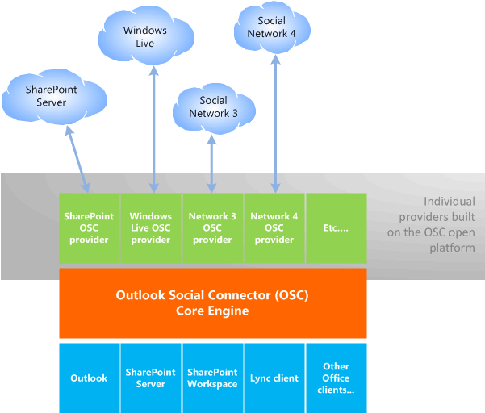

# Relacionar o OSC ao Outlook e a redes sociaisRelating the OSC with Outlook and social networks

O Outlook Social Connector (OSC) pode ser exibido no cartão de contato do Office e nas atividades do Outlook, no status ou nas atualizações de foto de um colega de funcionários, amigo ou pessoa à qual você está associado.The Outlook Social Connector (OSC) can display in the Office Contact Card and Outlook People Pane activities, status, or photo updates for a coworker, friend, or any person you are associated with. Por padrão, o OSC exibe os emails, anexos e solicitações de reunião do Outlook recebidos de uma pessoa selecionada.By default, the OSC displays the Outlook emails, attachments, and meeting requests received from a selected person. Se a pessoa selecionada e o usuário do Office colaborarem em um site do SharePoint, o OSC também exibirá atualizações de documentos e outras atividades de site desse site do SharePoint.If the selected person and the Office user collaborate on a SharePoint site, the OSC also displays document updates and other site activities from that SharePoint site. Dependendo dos contextos de associação nos quais o usuário do Office está interessado, o usuário do Office pode instalar os provedores do OSC para aplicativos de linha de negócios, sites corporativos internos ou vários sites de rede social e profissionais, como o LinkedIn, Facebook e Windows Live.Depending on the contexts of association that the Office user is interested in, the Office user can install OSC providers for line-of-business applications, internal corporate websites, or a variety of professional and social network sites, such as LinkedIn, Facebook, and Windows Live.
  
Para dar suporte ao compartilhamento de funcionalidade nos aplicativos cliente do Office, o mecanismo principal do OSC é implementado como parte de um componente compartilhado do Office e o painel de pessoas é implementado como um suplemento do Outlook.To support sharing of functionality across Office client applications, the OSC core engine is implemented as part of an Office shared component, and the People Pane is implemented as an Outlook add-in. Para usar o OSC, um usuário do Office deve ter instalado o Outlook nesse computador cliente e configurar o Outlook com um perfil, para que o OSC possa armazenar em cache contatos em uma pasta de contatos.To use the OSC, an Office user must have installed Outlook on that client computer and configured Outlook with a profile, so that the OSC can cache contacts in a Contacts folder. 
  
Um provedor OSC é uma DLL COM (Component Object Model) que permite ao OSC acessar os dados da rede social de uma maneira que seja independente das APIs de cada rede social.An OSC provider is a Component Object Model (COM) DLL that allows the OSC to access social network data in a way that is independent of the APIs of each social network. Uma DLL de provedor OSC deve ser instalada localmente em um computador cliente.An OSC provider DLL must be installed locally on a client computer. O provedor OSC de uma rede social conecta o OSC, que faz parte do Outlook, com a rede social na Internet.A social network's OSC provider connects the OSC, which is part of Outlook, with the social network on the Internet.
  
Um provedor de OSC deve implementar um conjunto de interfaces, definido como parte da extensibilidade do provedor OSC, para se comunicar com o OSC.An OSC provider must implement a set of interfaces, defined as part of the OSC provider extensibility, to communicate with the OSC. A extensibilidade do provedor OSC está disponível como uma plataforma aberta.OSC provider extensibility is available as an open platform.
  
A arquitetura do provedor do OSC permite que vários provedores funcionem com o mecanismo principal do OSC e informações sociais agregadas, como amigos e atividades.The provider architecture of the OSC enables multiple providers to work with the OSC core engine and aggregate social information such as friends and activities. A Figura 1 ilustra a arquitetura do provedor OSC.Figure 1 illustrates the OSC provider architecture.
  
**Figura 1. Arquitetura do provedor do Outlook Social Connector****Figure 1. Outlook Social Connector provider architecture**

  
## TerminologiaTerminology

Nesta referência do provedor do Outlook Social Connector, uma rede social é usada para se referir aos seguintes tipos de sites:In this Outlook Social Connector Provider Reference, a social network is used to refer to the following types of sites: 
  
- Sites colaborativos, como o SharePoint.Collaborative sites such as SharePoint.
    
- Sites de redes sociais, como o Facebook e o Windows Live.Social network sites such as Facebook and Windows Live.
    
- Sites de rede profissionais como o LinkedIn.Professional network sites such as LinkedIn.
    
- Outros aplicativos de linha de negócios ou sites internos corporativos usados para redes.Other line-of-business applications or corporate internal websites used for networking.
    
O termo Friend é usado geralmente para incluir amigos, familiares, colegas, conexões e qualquer pessoa à qual um usuário do Office esteja associado em um contexto colaborativo, como o SharePoint, ou adicionado à conta de rede social do usuário.The term friend is used generally to include friends, family, colleagues, connections, and anyone else an Office user is associated with in a collaborative context like SharePoint, or has added to the user's social network account. Não amigos são pessoas referidas em atualizações de atividade de amigos, mas não são amigos que foram adicionados à conta de rede social do usuário do Office.Non-friends are people referenced in friends' activity updates but are not friends who have been added to the Office user's social network account. Contatos são pessoas em uma pasta de contatos do Outlook.Contacts are people in an Outlook contact folder. 
  
## Confira tambémSee also

- [Introdução ao desenvolvimento de um provedor de serviços do Outlook Social ConnectorGetting Started with Developing an Outlook Social Connector Provider](getting-started-with-developing-an-outlook-social-connector-provider.md)

