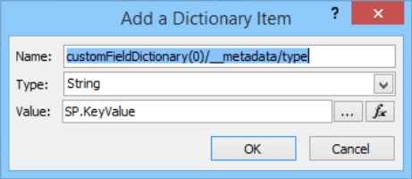
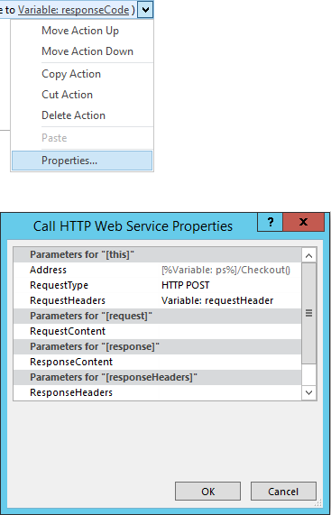

# Atualizar campos personalizados em massa e criar sites de projeto a partir de um fluxo de trabalho no Project OnlineBulk update custom fields and create project sites from a workflow in Project Online

Para ajudar os clientes a aproveitar ao máximo Project Online e melhorar nossos extensibilidade de serviço e a flexibilidade, adicionamos dois métodos para o modelo de objeto do cliente que podem ser usados nos fluxos de trabalho e aplicativos do Project Online.To help customers get the most out of Project Online and improve our service extensibility and flexibility, we've added two methods to the client-side object model that you can use in Project Online apps and workflows.
  
|||
|:-----|:-----|
|**UpdateCustomFields****UpdateCustomFields**   |Em massa atualiza os campos personalizados do projeto.Bulk updates project custom fields. Para o Project Online somente.For Project Online only. Disponível somente na API REST.Available only in the REST API.    |
|**CreateProjectSite****CreateProjectSite**   | Cria um site de projeto.Creates a Project site. Para o Project Online somente.For Project Online only. Disponível na API REST, modelo de objeto do cliente gerenciado e modelo de objeto de cliente JavaScript.Available in the REST API, managed client object model, and JavaScript client object model.    |
   
Além de fornecer mais flexibilidade, esses métodos também oferecem significativos aprimoramentos de desempenho quando salvar e publicar projetos em um fluxo de trabalho.In addition to providing more flexibility, these methods also offer significant performance improvements when saving and publishing projects in a workflow. Este artigo descreve como usar os métodos na API REST e fornece instruções para criar um fluxo de trabalho que campos personalizados de atualizações em massa e um fluxo de trabalho que cria um site de projeto.This article describes how to use the methods in the REST API and provides instructions for creating a workflow that bulk updates custom fields and a workflow that creates a Project site.
  
> [!NOTE]
> Para saber mais sobre chamando APIs REST a partir de fluxos de trabalho do SharePoint 2013, consulte [REST do SharePoint usando os serviços de fluxo de trabalho com o método POST](http://mysharepointinsight.blogspot.com/2013/05/using-sharepoint-rest-services-from.mdl) e [chamando a API do SharePoint 2013 Rest a partir de um fluxo de trabalho do SharePoint Designer](https://sergeluca.wordpress.com/2013/04/09/calling-the-sharepoint-2013-rest-api-from-a-sharepoint-designer-workflow/).To learn more about calling REST APIs from SharePoint 2013 workflows, see [Using SharePoint REST services from workflow with POST method](http://mysharepointinsight.blogspot.com/2013/05/using-sharepoint-rest-services-from.mdl) and [Calling the SharePoint 2013 Rest API from a SharePoint Designer Workflow](https://sergeluca.wordpress.com/2013/04/09/calling-the-sharepoint-2013-rest-api-from-a-sharepoint-designer-workflow/). 
  
## Atualização em massa campos personalizados do projeto a partir de um fluxo de trabalhoBulk update project custom fields from a workflow

Anteriormente, fluxos de trabalho só podem atualizar um campo personalizado por vez.Previously, workflows could only update one custom field at a time. Atualizar os campos personalizados do projeto um por vez pode resultar em uma experiência de usuário final ruim quando os usuários fazer a transição entre páginas de detalhes do projeto.Updating project custom fields one at a time can result in a poor end-user experience when users transition between Project Detail Pages. Cada atualização necessária uma solicitação de um servidor separado usando a ação **Definir campo de projeto** e atualizar vários campos personalizados em uma latência alta, baixa largura de banda rede resultou em uma sobrecarga não rotineira.Each update required a separate server request using the **Set Project Field** action, and updating multiple custom fields on a high-latency, low-bandwidth network resulted in a non-trivial overhead. Para resolver esse problema, adicionamos o método **UpdateCustomFields** para a API REST que permite a que você em massa atualizar campos personalizados.To resolve this issue, we added the **UpdateCustomFields** method to the REST API that lets you bulk update custom fields. Para usar **UpdateCustomFields**, você passar um dicionário que contém os nomes e valores de todos os campos personalizados que você deseja atualizar.To use **UpdateCustomFields**, you pass in a dictionary that contains the names and values of all the custom fields you want to update.
  
O método REST pode ser encontrado no ponto de extremidade seguir:The REST method can be found at the following endpoint:
  
`https://<site-url>/_api/ProjectServer/Projects('<guid>')/Draft/UpdateCustomFields()`
  
> [!NOTE]
> Substituir o `<site-url>` espaço reservado nos exemplos com a URL do seu site do Project Web App (PWA) e o `<guid>` espaço reservado com seu projeto UID.Replace the  `<site-url>` placeholder in the examples with the URL of your Project Web App (PWA) site and the  `<guid>` placeholder with your project UID. 
  
Esta seção descreve como criar um fluxo de trabalho em massa atualizações de campos personalizados de um projeto.This section describes how to create a workflow that bulk updates custom fields for a project. O fluxo de trabalho segue estas etapas de alto nível:The workflow follows these high-level steps:
  
- Aguarde o projeto que você deseja atualizar para fazer check-inWait for the project that you want to update to get checked in
    
- Criar um conjunto de dados que define todas as suas atualizações de campo personalizado para o projetoBuild a data set that defines all your custom field updates for the project
    
- Fazer check-out do projetoCheck out the project
    
- Chamar **UpdateCustomFields** para aplicar as atualizações de campo personalizado ao projetoCall **UpdateCustomFields** to apply the custom field updates to the project 
    
- Faça logon informações relevantes para a lista de histórico do fluxo de trabalho (se necessário)Log relevant information to the workflow history list (if required)
    
- Publicar o projetoPublish the project
    
- Fazer check-in do projetoCheck in the project
    
O fluxo de trabalho de ponta a ponta, final tem esta aparência:The final, end-to-end workflow looks like this:
  
![Fluxo de trabalho de ponta a ponta] (media/8c0741f9-7f76-409d-8c00-e7a8c3ddb89f.png "Fluxo de trabalho de ponta a ponta")
  
### Para criar um fluxo de trabalho em massa atualizações de campos personalizadosTo create a workflow that bulk updates custom fields

1. Opcional.Optional. Armazene a URL completa do seu projeto em uma variável que você pode usar em todo o fluxo de trabalho.Store the full URL of your project in a variable that you can use throughout the workflow.
    
    ![A URL do projeto em uma variável de repositório] (media/a880c5c6-8e7a-44dd-87e9-7e532169d489.png "A URL do projeto em uma variável de repositório")
  
2. Adicione a ação de **aguardar o evento de projeto** ao fluxo de trabalho e escolha o evento **quando um projeto check-in** .Add the **Wait for Project Event** action to the workflow and choose the **When a project is checked in** event. 
    
    ![Aguarde o projeto a ser verificado] (media/699aa9c7-b3c9-426e-a775-96993a13559c.png "Aguarde o projeto a ser verificado")
  
3. Crie um dicionário de **requestHeader** usando a ação de **compilação de dicionário** .Create a **requestHeader** dictionary using the **Build dictionary** action. Você usará o mesmo cabeçalho de solicitação para todas as chamadas de serviço da web neste fluxo de trabalho.You'll use the same request header for all the web service calls in this workflow. 
    
    ![Crie o dicionário requestHeader] (media/83b0aa10-9ab7-43dd-800d-a738bb815876.png "Crie o dicionário requestHeader")
  
4. Adicione os seguintes itens ao dicionário.Add the following two items to the dictionary.
    
    |NameName|TipoType|ValueValue|
    |:-----|:-----|:-----|
    |AcceptAccept    |StringString    |aplicativo/json; OData = verboseapplication/json; odata=verbose    |
    |Content-TypeContent-Type    |StringString    |aplicativo/json; OData = verboseapplication/json; odata=verbose    |
   
    ![Adicionando um cabeçalho Accept] (media/2f2e2016-3c49-4cac-b1e7-f2b8118b840c.png "Adicionando um cabeçalho Accept")
  
5. Crie um dicionário de **requestBody** usando a ação de **compilação de dicionário** .Create a **requestBody** dictionary using the **Build dictionary** action. Esse dicionário armazena todas as atualizações do campo que você deseja aplicar.This dictionary stores all the field updates that you want to apply. 
    
    Cada atualização de campo personalizado requer quatro linhas: tipo (1) de metadados, (2) a chave, (3) valor e tipo (4) o valor do campo.Each custom field update requires four rows: the field's (1) metadata type, (2) key, (3) value, and (4) value type.
    
    - **__metadata/tipo** Tipo de metadados do campo.**__metadata/type** The field's metadata type. Esse registro é sempre o mesmo e usa os seguintes valores:This record is always the same and uses the following values: 
    
       - Nome: customFieldDictionary (i) / __metadata/tipo (onde **i** é o índice de cada campo personalizado no dicionário, começando com 0)Name: customFieldDictionary(i)/__metadata/type (where **i** is the index of each custom field in the dictionary, starting with 0) 
            
       - Tipo: StringType: String
            
       - Valor: SP. KeyValueValue: SP.KeyValue
    
       ![Definindo uma atualização de campo personalizado] (media/a4423493-6603-42ee-ae50-1ef74c5c59bd.png "Definindo uma atualização de campo personalizado")
  
    - **Chave** O nome interno do campo personalizado, no formato: *Custom_ce23fbf43fa0e411941000155d3c8201***Key** The internal name of the custom field, in the format: *Custom_ce23fbf43fa0e411941000155d3c8201* 
    
       Você pode encontrar o nome interno de um campo personalizado navegando até a extremidade do **InternalName** :`https://<site-url>/_api/ProjectServer/CustomFields('<guid>')/InternalName`You can find the internal name of a custom field by navigating to it's **InternalName** endpoint: `https://<site-url>/_api/ProjectServer/CustomFields('<guid>')/InternalName`
    
       Se você criou seus campos personalizados manualmente, os valores serão diferentes de um site para outro.If you created your custom fields manually, the values will differ from site to site. Se você pretende reutilizar o fluxo de trabalho em vários sites, verifique se o campo personalizado IDs estão corretas.If you plan to reuse the workflow across multiple sites, make sure the custom field IDs are correct.
    
    - **Valor** O valor a ser atribuído ao campo personalizado.**Value** The value to assign to the custom field. Para campos personalizados que são vinculados a tabelas de pesquisa, você precisa usar os nomes de internos das entradas de tabela de pesquisa, em vez de valores de tabela de pesquisa real.For custom fields that are linked to lookup tables, you need to use the internal names of the lookup table entries instead of the actual lookup table values. 
    
       Você pode encontrar o nome interno da entrada da tabela de pesquisa no ponto de extremidade seguir:`https://<site-url>/_api/ProjectServer/CustomFields('<guid>')/LookupEntries('<guid>')/InternalName`You can find the internal name of the lookup table entry at the following endpoint: `https://<site-url>/_api/ProjectServer/CustomFields('<guid>')/LookupEntries('<guid>')/InternalName`
    
       Se você tiver um campo personalizado da tabela de pesquisa configurado para aceitar vários valores, use `;#` concatenar valores (conforme mostrado no dicionário exemplo abaixo).If you have a lookup table custom field set up to accept multiple values, use  `;#` to concatenate values (as shown in the example dictionary below). 
    
    - **ValueType** O tipo de campo personalizado que você está atualizando.**ValueType** The type of the custom field you are updating. 
    
       - Para campos de texto, duração, sinalizador e LookupTable, use Edm.StringFor Text, Duration, Flag, and LookupTable fields, use Edm.String
    
       - Para campos numéricos, use Edm.Int32, Edm.Double ou qualquer outro aceitos OData número tipoFor Number fields, use Edm.Int32, Edm.Double, or any other OData-accepted number type
    
       - Para campos de data, use Edm.DateTimeFor Date fields, use Edm.DateTime
    
       O dicionário de exemplo abaixo define atualizações para três campos personalizados.The example dictionary below defines updates for three custom fields. A primeira é de um campo personalizado vários do valor pesquisa tabela, o segundo é para um campo de número e a terceira é destinada um campo date.The first is for a multiple value lookup table custom field, the second is for a number field, and the third is for a date field. Observação como incrementos de índice do **customFieldDictionary** .Note how the **customFieldDictionary** index increments. 
    
       > [!NOTE]
       > Esses valores são apenas para fins ilustrativos.These values are for illustration purposes only. Os pares de chave-valor que você utilizará dependem de seus dados do PWA.The key-value pairs you'll use depend on your PWA data. 
  
       |NameName|TipoType|ValueValue|
       |:-----|:-----|:-----|
       |tipo/__metadata/customFieldDictionary (0)customFieldDictionary(0)/__metadata/type    |StringString    |SP. KeyValueSP.KeyValue    |
       |customFieldDictionary (0) tecla /customFieldDictionary(0)/Key    |StringString    |Sinalizador\_ce23fbf43fa0e411941000155d3c8201Custom\_ce23fbf43fa0e411941000155d3c8201    |
       |customFieldDictionary (0) / valorcustomFieldDictionary(0)/Value    |StringString    |Entrada\_b9a2fd69279de411940f00155d3c8201; #Entry\_baa2fd69279de411940f00155d3c8201Entry\_b9a2fd69279de411940f00155d3c8201;#Entry\_baa2fd69279de411940f00155d3c8201    |
       |customFieldDictionary (0) / ValueTypecustomFieldDictionary(0)/ValueType    |StringString    |Edm.StringEdm.String    |
       |customFieldDictionary (1) / __metadata/tipocustomFieldDictionary(1)/__metadata/type    |StringString    |SP. KeyValueSP.KeyValue    |
       |customFieldDictionary (1) / chavecustomFieldDictionary(1)/Key    |StringString    |Custom_c7f114c97098e411940f00155d3c8201Custom_c7f114c97098e411940f00155d3c8201    |
       |customFieldDictionary (1) / valorcustomFieldDictionary(1)/Value    |StringString    |90.590.5    |
       |customFieldDictionary (1) / ValueTypecustomFieldDictionary(1)/ValueType    |StringString    |Edm.DoubleEdm.Double    |
       |customFieldDictionary (2) / __metadata/tipocustomFieldDictionary(2)/__metadata/type    |StringString    |SP. KeyValueSP.KeyValue    |
       |customFieldDictionary (2) / chavecustomFieldDictionary(2)/Key    |StringString    |Custom_c6fb67e0b9a1e411941000155d3c8201Custom_c6fb67e0b9a1e411941000155d3c8201    |
       |customFieldDictionary (2) / valorcustomFieldDictionary(2)/Value    |StringString    |2015-04-01T00:00:00.00000002015-04-01T00:00:00.0000000    |
       |customFieldDictionary (2) / ValueTypecustomFieldDictionary(2)/ValueType    |StringString    |Edm.DateTimeEdm.DateTime    |
   
       ![Dicionário que define as atualizações de campo personalizado] (media/41a1f18f-a6b2-40ff-904b-437baf962621.png "Dicionário que define as atualizações de campo personalizado")
  
6. Adicione uma ação de **Chamada serviço da Web de HTTP** para Confira o projeto.Add a **Call HTTP Web Service** action to check the project out. 
    
    ![Chame o método de check-out] (media/8ce56014-0317-419b-afa7-229d05c86885.png "Chame o método de check-out")
  
7. Edite as propriedades da chamada de serviço web para especificar o cabeçalho de solicitação.Edit the properties of the web service call to specify the request header. Para abrir a caixa de diálogo **Propriedades** , a ação do mouse em e escolha **Propriedades**.To open the **Properties** dialog box, right-click the action and choose **Properties**.
    
    ![Especificar o cabeçalho de solicitação no serviço web propriedades da chamada] (media/d81e92b1-43df-42ad-9cd0-a693f93b164e.png "Especificar o cabeçalho de solicitação no serviço web propriedades da chamada")
  
8. Adicione uma ação de **Chamada serviço da Web de HTTP** para chamar o método **UpdateCustomFields** .Add a **Call HTTP Web Service** action to call the **UpdateCustomFields** method. 
    
    ![Criar uma ação de chamada serviço da Web de HTTP] (media/9a73a201-c035-41b4-8798-506ac48b90f8.png "Criar uma ação de chamada serviço da Web de HTTP")
  
    Observação o `/Draft/` segmento na URL do serviço web.Note the  `/Draft/` segment in the web service URL. A URL completa deve ter esta aparência:`https://<site-url>/_api/ProjectServer/Projects('<guid>')/Draft/UpdateCustomFields()`The full URL should look like this: `https://<site-url>/_api/ProjectServer/Projects('<guid>')/Draft/UpdateCustomFields()`
    
    ![Chame o método UpdateCustomFields] (media/03b323f1-8e99-4b18-be18-be505d7cec7e.png "Chame o método UpdateCustomFields")
  
9. Edite as propriedades da chamada de serviço web para vincular os parâmetros **RequestHeader** e **RequestContent** aos dicionários que você criou.Edit the properties of the web service call to bind the **RequestHeader** and **RequestContent** parameters to the dictionaries you created. Você também pode criar uma nova variável para armazenar o **ResponseContent**.You can also create a new variable to store the **ResponseContent**.
    
    ![Associe os dicionários ao cabeçalho da solicitação e conteúdo] (media/f96bec92-138e-4eab-b1e7-1ab83d0428a5.png "Associe os dicionários ao cabeçalho da solicitação e conteúdo")
  
10. Opcional.Optional. Ler o dicionário de resposta para verificar o estado do trabalho em fila e registrar as informações na lista de histórico do fluxo de trabalho.Read from the response dictionary to check the state of the queue job and log the information in the workflow history list.
    
    ![Configurações de log] (media/7d2f4936-61d7-4906-83e8-7478a5935af5.png "Configurações de log")
  
11. Adicione uma chamada de serviço web para o ponto de extremidade de **Publicar** para publicar o projeto.Add a web service call to the **Publish** endpoint to publish the project. Sempre use o mesmo cabeçalho de solicitação.Always use the same request header. 
    
    ![Chamar o método Publish] (media/3b661091-ffae-4d7e-a0bb-5b96a6292731.png "Chamar o método Publish")
  
    ![Propriedades do serviço web Publish chamada] (media/6a80a5d3-7e29-4398-993c-f78b3faca8b1.png "Propriedades do serviço web Publish chamada")
  
12. Adicione uma chamada ao serviço web final ao ponto de extremidade **Checkin** fazer check-in do projeto.Add a final web service call to the **Checkin** endpoint to check the project in. 
    
    ![Chame o método Checkin] (media/430510cb-0774-4911-af7f-b565b83eba0e.png "Chame o método Checkin")
  
    ![Chamada de propriedades para o serviço web de check-in] (media/485f48d6-bbb8-4568-9dc3-aae3218f6bd1.png "Chamada de propriedades para o serviço web de check-in")

## Criar um site de projeto a partir de um fluxo de trabalhoCreate a Project site from a workflow

Cada projeto pode ter seus próprio sites dedicados do SharePoint onde os membros da equipe podem colaborar, compartilhar documentos, eleve problemas e assim por diante.Every project can have its own dedicated SharePoint sites where team members can collaborate, share documents, raise issues, and so on. Anteriormente, sites só podiam ser criadas automaticamente nas primeiro publique ou manualmente pelo gerente de projeto no Project Professional ou pelo administrador no PWA configurações ou eles poderiam ser desabilitado.Previously, sites could only be created automatically on first publish or manually by the project manager in Project Professional or by the administrator in PWA settings, or they could be disabled.
  
Adicionamos o método **CreateProjectSite** para que você possa escolher quando criar sites de projetos.We've added the **CreateProjectSite** method so you can choose when to create project sites. Isso é particularmente útil para organizações que deseja criar seus sites automaticamente quando uma proposta de projeto atinge um estágio específico em um fluxo de trabalho predefinido, em vez de na primeira publicar.This is particularly useful for organizations who want to create their sites automatically when a project proposal reaches a specific stage in a pre-defined workflow, rather than on first publish. Adiar a criação de site de projeto significativamente melhora o desempenho de criação de um projeto.Postponing project site creation significantly improves the performance of creating a project. 
  
**Pré-requisito:** Antes de poder usar **CreateProjectSite**, a configuração **Permitir que os usuários escolham** deve ser definida para a criação de site de projeto no **PWA configurações** > * * Sites do SharePoint conectados * * > **configurações**.**Prerequisite:** Before you can use **CreateProjectSite**, the **Allow users to choose** setting must be set for project site creation in **PWA Settings** > ** Connected SharePoint Sites ** > **Settings**.
  
![Configuração "Permitir que os usuários escolham" nas configurações do PWA] (media/6c6c8175-eb10-431d-8056-cea55718fdb4.png "Configuração Permitir que usuários escolher nas configurações do PWA")
  
### Para criar um fluxo de trabalho que cria um site de projetoTo create a workflow that creates a Project site

1. Criar ou editar um fluxo de trabalho existente e selecione a etapa onde você deseja criar seus sites de projeto.Create or edit an existing workflow and select the step where you want to create your Project sites.
    
2. Crie um dicionário de **requestHeader** usando a ação de **compilação de dicionário** .Create a **requestHeader** dictionary using the **Build dictionary** action. 
    
    ![Crie o dicionário requestHeader] (media/83b0aa10-9ab7-43dd-800d-a738bb815876.png "Crie o dicionário requestHeader")
  
3. Adicione os seguintes itens ao dicionário.Add the following two items to the dictionary.
    
    |NameName|TipoType|ValueValue|
    |:-----|:-----|:-----|
    |AcceptAccept    |StringString    |aplicativo/json; OData = verboseapplication/json; odata=verbose    |
    |Content-TypeContent-Type    |StringString    |aplicativo/json; OData = verboseapplication/json; odata=verbose    |
   
    ![Adicionando um cabeçalho Accept] (media/2f2e2016-3c49-4cac-b1e7-f2b8118b840c.png "Adicionando um cabeçalho Accept")
  
4. Adicione a ação de **Chamada serviço da Web de HTTP** .Add the **Call HTTP Web Service** action. Altere o tipo de solicitação para usar o **POST**e definir a URL usando o seguinte formato:Change the request type to use **POST**, and set the URL using the following format:
    
    `https://<site-url>/_api/ProjectServer/Projects('<guid>')/CreateProjectSite('New web name')`
    
    ![Construir o URI do ponto de extremidade de CreateProjectSite] (media/42a90a5e-8d1b-4667-a933-785175212847.png "Construir o URI do ponto de extremidade de CreateProjectSite")
  
    Passe o nome do site de projeto para o método **CreateProjectSite** como uma cadeia de caracteres.Pass the name of the Project site to the **CreateProjectSite** method as a string. Para usar o nome do projeto como o nome do site, passe uma sequência vazia.To use the project name as the site name, pass an empty string. Certifique-se de usar nomes exclusivos para que o próximo site de projeto que você criar funcione.Be sure to use unique names so the next project site you create will work. 
    
5. Edite as propriedades da chamada de serviço web para vincular o parâmetro **RequestHeader** ao dicionário que você criou.Edit the properties of the web service call to bind the **RequestHeader** parameter to the dictionary you created. 
    
    ![Associando o dicionário à solicitação] (media/61a5a0a8-405f-44eb-b5e7-80b11f7caec3.png "Associando o dicionário à solicitação")
  
## Confira tambémSee also

- [Tarefas de programação do ProjectProject programming tasks](project-programming-tasks.md)
- [Modelo de objeto do cliente (CSOM) para o Project 2013Client-side object model (CSOM) for Project 2013](client-side-object-model-csom-for-project-2013.md)
- [Fluxos de trabalho no SharePoint 2013Workflows in SharePoint 2013](http://msdn.microsoft.com/library/e0602371-ae22-44be-8a7e-9e47e9f046d6%28Office.15%29.aspx)
    

