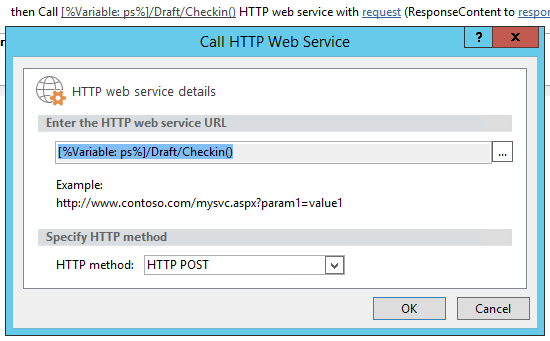

# Fazer atualizações em massa de campos personalizados e criar sites de projeto com base em um fluxo de trabalho no Project Online

Para ajudar os clientes a aproveitar ao máximo o Project Online e melhorar a flexibilidade e a extensibilidade dos nossos serviços, adicionamos dois métodos ao modelo de objeto no lado do cliente que você pode usar em aplicativos e fluxos de trabalho do Project Online.
  
|||
|:-----|:-----|
|**UpdateCustomFields**   |Faz atualizações em massa de campos de projeto personalizados. Apenas para o Project Online. Disponível apenas na API REST.    |
|**CreateProjectSite**   | Cria um site do Project. Apenas para o Project Online. Disponível na API REST, no modelo de objeto de cliente gerenciado e no modelo de objeto do cliente JavaScript.    |
   
Além de fornecerem mais flexibilidade, esses métodos também proporcionam melhorias significativas de desempenho ao salvar e publicar projetos em um fluxo de trabalho. Este artigo descreve como usar os métodos na API REST e fornece instruções para criar um fluxo de trabalho que faz a atualização em massa de campos personalizados e um fluxo de trabalho que cria um site do Project.
  
> [!NOTE]
> Para saber mais sobre como chamar APIs REST de fluxos de trabalho do SharePoint 2013, consulte os tópicos sobre como [Usar serviços REST do SharePoint de um fluxo de trabalho com o método POST](https://mysharepointinsight.blogspot.com/2013/05/using-sharepoint-rest-services-from.mdl) e [Chamar a API REST do SharePoint 2013 de um fluxo de trabalho do SharePoint Designer](https://sergeluca.wordpress.com/2013/04/09/calling-the-sharepoint-2013-rest-api-from-a-sharepoint-designer-workflow/). 
  
## Fazer atualizações em massa de campos de projeto personalizados com base em um fluxo de trabalho

Anteriormente, fluxos de trabalho podiam atualizar apenas um campo personalizado de cada vez. Essa atualização individual de campos de projeto personalizados pode resultar em uma experiência insatisfatória do usuário final ao fazer a transição entre Páginas de Detalhes do Projeto. Cada atualização exigia uma solicitação de servidor separada usando a ação **Definir Campo de Projeto**, e a atualização de vários campos personalizados em uma rede de alta latência e baixa largura de banda resultava em uma sobrecarga incomum. Para resolver esse problema, adicionamos o método **UpdateCustomFields** à API REST, que permite a atualização em massa de campos personalizados. Para usar **UpdateCustomFields**, você transmite um dicionário que contém os nomes e os valores de todos os campos personalizados que deseja atualizar.
  
O método REST pode ser encontrado no seguinte ponto de extremidade:
  
`https://<site-url>/_api/ProjectServer/Projects('<guid>')/Draft/UpdateCustomFields()`
  
> [!NOTE]
> Substitua o espaço reservado `<site-url>` nos exemplos pela URL do seu site do Project Web App (PWA) e o espaço reservado `<guid>` pela UID do seu projeto. 
  
Esta seção descreve como criar um fluxo de trabalho que faz a atualização em massa de campos personalizados de um projeto. O fluxo de trabalho segue estas etapas avançadas:
  
- Aguardar o check-in do projeto que você deseja atualizar
    
- Criar um conjunto de dados que define todas as atualizações de campos personalizados para o projeto
    
- Fazer check-out do projeto
    
- Chamar **UpdateCustomFields** para aplicar as atualizações de campos personalizados ao projeto 
    
- Registrar informações relevantes na lista do histórico do fluxo de trabalho (se necessário)
    
- Publicar o projeto
    
- Fazer check-in do projeto
    
O fluxo de trabalho completo final é semelhante e este:
  

  
### Para criar um fluxo de trabalho que faz a atualização em massa de campos personalizados

1. Opcional. Armazene a URL completa do seu projeto em uma variável que você possa usar por todo o fluxo de trabalho.
    
    
  
2. Adicione a ação **Aguardar o Evento do Projeto** ao fluxo de trabalho e escolha o evento**Quando é feito o check-in de um projeto**. 
    
    
  
3. Crie um dicionário **requestHeader** usando a ação **Criar Dicionário**. Você usará o mesmo cabeçalho de solicitação para todas as chamadas de serviço Web nesse fluxo de trabalho. 
    
    
  
4. Adicione os dois itens a seguir ao dicionário.
    
    |Nome|Tipo|Valor|
    |:-----|:-----|:-----|
    |Accept    |String    |application/json; odata=verbose    |
    |Content-Type    |String    |application/json; odata=verbose    |
   
    
  
5. Crie um dicionário **requestBody** usando a ação **Criar Dicionário**. Esse dicionário armazena todas as atualizações de campo que você deseja aplicar. 
    
    Cada atualização de campo personalizado requer quatro linhas: (1) o tipo de metadados do campo, (2) a chave do campo, (3) o valor do campo e (4) o tipo de valor do campo.
    
    - **__metadata/type** O tipo de metadados do campo. Esse registro é sempre o mesmo e usa os seguintes valores: 
    
       - Nome: customFieldDictionary(i)/__metadata/type (em que **i** é o índice de cada campo personalizado no dicionário, começando com 0) 
            
       - Type: cadeia de caracteres
            
       - Valor: SP.KeyValue
    
       
  
    - **Key** O nome interno do campo personalizado, no formato: *Custom_ce23fbf43fa0e411941000155d3c8201* 
    
       Você pode encontrar o nome interno de um campo personalizado navegando até seu ponto de extremidade **InternalName**: `https://<site-url>/_api/ProjectServer/CustomFields('<guid>')/InternalName`
    
       Se tiver criado seus campos personalizados manualmente, os valores serão diferentes para cada site. Se você planeja reutilizar o fluxo de trabalho em vários sites, certifique-se de que as IDs dos campos personalizados estejam corretas.
    
    - **Value** O valor a ser atribuído ao campo personalizado. Para campos personalizados vinculados a tabelas de pesquisa, você precisa usar os nomes internos das entradas da tabela de pesquisa ao invés dos valores reais dessa tabela. 
    
       É possível encontrar o nome interno da entrada da tabela de pesquisa no seguinte ponto de extremidade: `https://<site-url>/_api/ProjectServer/CustomFields('<guid>')/LookupEntries('<guid>')/InternalName`
    
       Se você tiver um campo personalizado de tabela de pesquisa configurado para aceitar vários valores, use `;#` para concatenar os valores (conforme mostrado no dicionário de exemplo abaixo). 
    
    - **ValueType** O tipo do campo personalizado que você está atualizando. 
    
       - Para campos Text, Duration, Flag e LookupTable, use Edm.String
    
       - Para campos Number, use Edm.Int32, Edm.Double ou qualquer outro tipo de número aceito por OData
    
       - Para campos Date, use Edm.DateTime
    
       O dicionário de exemplo abaixo define atualizações para três campos personalizados. A primeira é para um campo personalizado de tabela de pesquisa com vários valores, a segunda é para um campo numérico e a terceira, para um campo de data. Observe como o índice **customFieldDictionary** é incrementado. 
    
       > [!NOTE]
       > Esses valores são apenas para fins ilustrativos. Os pares de valor/chave que você usará dependem dos seus dados do PWA. 
  
       |Nome|Tipo|Valor|
       |:-----|:-----|:-----|
       |customFieldDictionary(0)/__metadata/type    |String    |SP.KeyValue    |
       |customFieldDictionary(0)/Key    |String    |Custom\_ce23fbf43fa0e411941000155d3c8201    |
       |customFieldDictionary(0)/Value    |String    |Entry\_b9a2fd69279de411940f00155d3c8201;#Entry\_baa2fd69279de411940f00155d3c8201    |
       |customFieldDictionary(0)/ValueType    |String    |Edm.String    |
       |customFieldDictionary(1)/__metadata/type    |String    |SP.KeyValue    |
       |customFieldDictionary(1)/Key    |String    |Custom_c7f114c97098e411940f00155d3c8201    |
       |customFieldDictionary(1)/Value    |String    |90,5    |
       |customFieldDictionary(1)/ValueType    |Cadeia de caracteres    |Edm.Double    |
       |customFieldDictionary(2)/__metadata/type    |String    |SP.KeyValue    |
       |customFieldDictionary(2)/Key    |String    |Custom_c6fb67e0b9a1e411941000155d3c8201    |
       |customFieldDictionary(2)/Value    |String    |2015-04-01T00:00:00.0000000    |
       |customFieldDictionary(2)/ValueType    |Cadeia de caracteres    |Edm.DateTime    |
   
       
  
6. Adicione uma ação **Chamar Serviço Web HTTP** para fazer check-out do projeto. 
    
    
  
7. Edite as propriedades da chamada de serviço Web para especificar o cabeçalho da solicitação. Para abrir a caixa de diálogo **Propriedades**, clique com o botão direito do mouse na ação e escolha **Propriedades**.
    
    
  
8. Adicione uma ação **Chamar Serviço Web HTTP** para chamar o método **UpdateCustomFields**. 
    
    
  
    Observe o segmento `/Draft/` na URL do serviço Web. A URL completa deve ter a seguinte aparência: `https://<site-url>/_api/ProjectServer/Projects('<guid>')/Draft/UpdateCustomFields()`
    
    
  
9. Edite as propriedades da chamada do serviço Web para associar os parâmetros **RequestHeader** e **RequestContent** aos dicionários que você criou. Você também pode criar uma nova variável para armazenar **ResponseContent**.
    
    
  
10. Opcional. Leia o conteúdo do dicionário de resposta para verificar o estado do trabalho da fila e registre as informações na lista do histórico do fluxo de trabalho.
    
    
  
11. Adicione uma chamada de serviço Web ao ponto de extremidade **Publish** para publicar o projeto. Sempre use o mesmo cabeçalho de solicitação. 
    
    
  
    
  
12. Adicione uma chamada final de serviço Web ao ponto de extremidade **Checkin** para fazer check-in do projeto. 
    
    
  
    

## Criar um site do Project com base em um fluxo de trabalho

Cada projeto pode ter seus próprios sites dedicados do SharePoint, nos quais os membros das equipes podem colaborar, compartilhar documentos, fazer perguntas e assim por diante. Anteriormente, sites só podiam ser criados automaticamente na primeira publicação ou manualmente pelo gerente de projetos no Project Professional, ou pelo administrador nas configurações do PWA, ou podiam ser desabilitados.
  
Adicionamos o método **CreateProjectSite** para que você possa escolher quando criar sites de projeto. Isso é particularmente útil para organizações que desejam criar seus sites automaticamente quando uma proposta de projeto atinge um estágio específico em um fluxo de trabalho predefinido, ao invés de criá-lo na primeira publicação. Adiar a criação do site de projeto melhora significativamente o desempenho de criação de um projeto. 
  
**Pré-requisito**: antes de poder usar **CreateProjectSite**, a configuração **Permitir que os usuários escolham** deve ser definida para a criação do site de projeto nas **Configurações do PWA** > ** Sites do SharePoint conectados ** > **Configurações**.
  

  
### Para criar um fluxo de trabalho que cria um site do Project

1. Crie ou edite um fluxo de trabalho existente e selecione a etapa em que você deseja criar seus sites do Project.
    
2. Crie um dicionário **requestHeader** usando a ação **Criar Dicionário**. 
    
    
  
3. Adicione os dois itens a seguir ao dicionário.
    
    |Nome|Tipo|Valor|
    |:-----|:-----|:-----|
    |Accept    |String    |application/json; odata=verbose    |
    |Content-Type    |String    |application/json; odata=verbose    |
   
    
  
4. Adicione a ação **Chamar Serviço Web HTTP**. Altere o tipo de solicitação para usar **POST** e defina a URL usando o seguinte formato:
    
    `https://<site-url>/_api/ProjectServer/Projects('<guid>')/CreateProjectSite('New web name')`
    
    
  
    Transmita o nome do site do Project para o método **CreateProjectSite** como uma cadeia de caracteres. Para usar o nome do projeto como o nome do site, transmita uma cadeia vazia. Certifique-se de usar nomes exclusivos para que o próximo site de projeto que você criar funcione. 
    
5. Edite as propriedades da chamada do serviço Web para associar o parâmetro **RequestHeader** ao dicionário que você criou. 
    
    
  
## Confira também

- [Tarefas de programação do Project](project-programming-tasks.md)
- [Modelo de objeto no lado do cliente (CSOM) para o Project 2013](client-side-object-model-csom-for-project-2013.md)
- [Fluxos de trabalho no SharePoint 2013](https://msdn.microsoft.com/library/e0602371-ae22-44be-8a7e-9e47e9f046d6%28Office.15%29.aspx)
    

