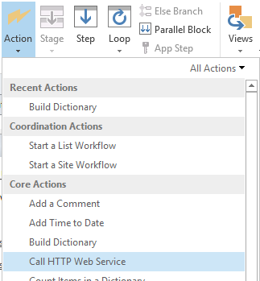

# Fazer atualizações em massa de campos personalizados e criar sites de projeto com base em um fluxo de trabalho no Project OnlineBulk update custom fields and create project sites from a workflow in Project Online

Para ajudar os clientes a aproveitar ao máximo o Project Online e melhorar a flexibilidade e a extensibilidade dos nossos serviços, adicionamos dois métodos ao modelo de objeto no lado do cliente que você pode usar em aplicativos e fluxos de trabalho do Project Online.To help customers get the most out of Project Online and improve our service extensibility and flexibility, we've added two methods to the client-side object model that you can use in Project Online apps and workflows.
  
|||
|:-----|:-----|
|**UpdateCustomFields****UpdateCustomFields**   |Faz atualizações em massa de campos de projeto personalizados.Bulk updates project custom fields. Apenas para o Project Online.For Project Online only. Disponível apenas na API REST.Available only in the REST API.    |
|**CreateProjectSite****CreateProjectSite Method**   | Cria um site do Project.Creates a Project site. Apenas para o Project Online.For Project Online only. Disponível na API REST, no modelo de objeto de cliente gerenciado e no modelo de objeto do cliente JavaScript.Available in the REST API, managed client object model, and JavaScript client object model.    |
   
Além de fornecerem mais flexibilidade, esses métodos também proporcionam melhorias significativas de desempenho ao salvar e publicar projetos em um fluxo de trabalho.In addition to providing more flexibility, these methods also offer significant performance improvements when saving and publishing projects in a workflow. Este artigo descreve como usar os métodos na API REST e fornece instruções para criar um fluxo de trabalho que faz a atualização em massa de campos personalizados e um fluxo de trabalho que cria um site do Project.This article describes how to use the methods in the REST API and provides instructions for creating a workflow that bulk updates custom fields and a workflow that creates a Project site.
  
> [!NOTE]
> Para saber mais sobre como chamar APIs REST de fluxos de trabalho do SharePoint 2013, consulte os tópicos sobre como [Usar serviços REST do SharePoint de um fluxo de trabalho com o método POST](https://mysharepointinsight.blogspot.com/2013/05/using-sharepoint-rest-services-from.mdl) e [Chamar a API REST do SharePoint 2013 de um fluxo de trabalho do SharePoint Designer](https://sergeluca.wordpress.com/2013/04/09/calling-the-sharepoint-2013-rest-api-from-a-sharepoint-designer-workflow/).To learn more about calling REST APIs from SharePoint 2013 workflows, see [Using SharePoint REST services from workflow with POST method](https://mysharepointinsight.blogspot.com/2013/05/using-sharepoint-rest-services-from.mdl) and [Calling the SharePoint 2013 Rest API from a SharePoint Designer Workflow](https://sergeluca.wordpress.com/2013/04/09/calling-the-sharepoint-2013-rest-api-from-a-sharepoint-designer-workflow/). 
  
## Fazer atualizações em massa de campos de projeto personalizados com base em um fluxo de trabalhoBulk update custom fields and create project sites from a workflow in Project Online

Anteriormente, fluxos de trabalho podiam atualizar apenas um campo personalizado de cada vez.Previously, workflows could only update one custom field at a time. Essa atualização individual de campos de projeto personalizados pode resultar em uma experiência insatisfatória do usuário final ao fazer a transição entre Páginas de Detalhes do Projeto.Updating project custom fields one at a time can result in a poor end-user experience when users transition between Project Detail Pages. Cada atualização exigia uma solicitação de servidor separada usando a ação **Definir Campo de Projeto**, e a atualização de vários campos personalizados em uma rede de alta latência e baixa largura de banda resultava em uma sobrecarga incomum.Each update required a separate server request using the **Set Project Field** action, and updating multiple custom fields on a high-latency, low-bandwidth network resulted in a non-trivial overhead. Para resolver esse problema, adicionamos o método **UpdateCustomFields** à API REST, que permite a atualização em massa de campos personalizados.To resolve this issue, we added the **UpdateCustomFields** method to the REST API that lets you bulk update custom fields. Para usar **UpdateCustomFields**, você transmite um dicionário que contém os nomes e os valores de todos os campos personalizados que deseja atualizar.To use **UpdateCustomFields**, you pass in a dictionary that contains the names and values of all the custom fields you want to update.
  
O método REST pode ser encontrado no seguinte ponto de extremidade:The REST method can be found at the following endpoint:
  
`https://<site-url>/_api/ProjectServer/Projects('<guid>')/Draft/UpdateCustomFields()`
  
> [!NOTE]
> Substitua o espaço reservado `<site-url>` nos exemplos pela URL do seu site do Project Web App (PWA) e o espaço reservado `<guid>` pela UID do seu projeto.Replace the  `<site-url>` placeholder in the examples with the URL of your Project Web App (PWA) site and the  `<guid>` placeholder with your project UID. 
  
Esta seção descreve como criar um fluxo de trabalho que faz a atualização em massa de campos personalizados de um projeto.This section describes how to create a workflow that bulk updates custom fields for a project. O fluxo de trabalho segue estas etapas avançadas:The workflow follows these high-level steps:
  
- Aguardar o check-in do projeto que você deseja atualizarWait for the project that you want to update to get checked in
    
- Criar um conjunto de dados que define todas as atualizações de campos personalizados para o projetoBuild a data set that defines all your custom field updates for the project
    
- Fazer check-out do projetoCheck out the project
    
- Chamar **UpdateCustomFields** para aplicar as atualizações de campos personalizados ao projetoCall **UpdateCustomFields** to apply the custom field updates to the project 
    
- Registrar informações relevantes na lista do histórico do fluxo de trabalho (se necessário)Log relevant information to the workflow history list (if required)
    
- Publicar o projetoPublish the project
    
- Fazer check-in do projetoCheck in the project
    
O fluxo de trabalho completo final é semelhante e este:The final, end-to-end workflow looks like this:
  

  
### Para criar um fluxo de trabalho que faz a atualização em massa de campos personalizadosTo create a workflow that bulk updates custom fields

1. Opcional.Optional. Armazene a URL completa do seu projeto em uma variável que você possa usar por todo o fluxo de trabalho.Store the full URL of your project in a variable that you can use throughout the workflow.
    
    
  
2. Adicione a ação **Aguardar o Evento do Projeto** ao fluxo de trabalho e escolha o evento**Quando é feito o check-in de um projeto**.Add the **Wait for Project Event** action to the workflow and choose the **When a project is checked in** event. 
    
    
  
3. Crie um dicionário **requestHeader** usando a ação **Criar Dicionário**.Create a **requestHeader** dictionary using the **Build dictionary** action. Você usará o mesmo cabeçalho de solicitação para todas as chamadas de serviço Web nesse fluxo de trabalho.You'll use the same request header for all the web service calls in this workflow. 
    
    
  
4. Adicione os dois itens a seguir ao dicionário.Add the following two items to the dictionary.
    
    |NomeName|TipoType|ValorValue|
    |:-----|:-----|:-----|
    |AcceptAccept    |Cadeia de caracteresString    |application/json; odata=verboseapplication/json;odata=verbose    |
    |Content-TypeContent-Type    |Cadeia de caracteresString    |application/json; odata=verboseapplication/json;odata=verbose    |
   
    
  
5. Crie um dicionário **requestBody** usando a ação **Criar Dicionário**.Create a **requestBody** dictionary using the **Build dictionary** action. Esse dicionário armazena todas as atualizações de campo que você deseja aplicar.This dictionary stores all the field updates that you want to apply. 
    
    Cada atualização de campo personalizado requer quatro linhas: (1) o tipo de metadados do campo, (2) a chave do campo, (3) o valor do campo e (4) o tipo de valor do campo.Each custom field update requires four rows: the field's (1) metadata type, (2) key, (3) value, and (4) value type.
    
    - **__metadata/type** O tipo de metadados do campo.**__metadata/type** The field's metadata type. Esse registro é sempre o mesmo e usa os seguintes valores:This record is always the same and uses the following values: 
    
       - Nome: customFieldDictionary(i)/__metadata/type (em que **i** é o índice de cada campo personalizado no dicionário, começando com 0)Name: customFieldDictionary(i)/__metadata/type (where **i** is the index of each custom field in the dictionary, starting with 0) 
            
       - Type: cadeia de caracteresType: String
            
       - Valor: SP.KeyValueValue: SP.KeyValue
    
       
  
    - **Key** O nome interno do campo personalizado, no formato: *Custom_ce23fbf43fa0e411941000155d3c8201***Key** The internal name of the custom field, in the format: *Custom_ce23fbf43fa0e411941000155d3c8201* 
    
       Você pode encontrar o nome interno de um campo personalizado navegando até seu ponto de extremidade **InternalName**: `https://<site-url>/_api/ProjectServer/CustomFields('<guid>')/InternalName`You can find the internal name of a custom field by navigating to it's **InternalName** endpoint: `https://<site-url>/_api/ProjectServer/CustomFields('<guid>')/InternalName`
    
       Se tiver criado seus campos personalizados manualmente, os valores serão diferentes para cada site.If you created your custom fields manually, the values will differ from site to site. Se você planeja reutilizar o fluxo de trabalho em vários sites, certifique-se de que as IDs dos campos personalizados estejam corretas.If you plan to reuse the workflow across multiple sites, make sure the custom field IDs are correct.
    
    - **Value** O valor a ser atribuído ao campo personalizado.**Value** The value to assign to the custom field. Para campos personalizados vinculados a tabelas de pesquisa, você precisa usar os nomes internos das entradas da tabela de pesquisa ao invés dos valores reais dessa tabela.For custom fields that are linked to lookup tables, you need to use the internal names of the lookup table entries instead of the actual lookup table values. 
    
       É possível encontrar o nome interno da entrada da tabela de pesquisa no seguinte ponto de extremidade: `https://<site-url>/_api/ProjectServer/CustomFields('<guid>')/LookupEntries('<guid>')/InternalName`You can find the internal name of the lookup table entry at the following endpoint: `https://<site-url>/_api/ProjectServer/CustomFields('<guid>')/LookupEntries('<guid>')/InternalName`
    
       Se você tiver um campo personalizado de tabela de pesquisa configurado para aceitar vários valores, use `;#` para concatenar os valores (conforme mostrado no dicionário de exemplo abaixo).If you have a lookup table custom field set up to accept multiple values, use  `;#` to concatenate values (as shown in the example dictionary below). 
    
    - **ValueType** O tipo do campo personalizado que você está atualizando.**ValueType** The type of the custom field you are updating. 
    
       - Para campos Text, Duration, Flag e LookupTable, use Edm.StringFor Text, Duration, Flag, and LookupTable fields, use Edm.String
    
       - Para campos Number, use Edm.Int32, Edm.Double ou qualquer outro tipo de número aceito por ODataFor Number fields, use Edm.Int32, Edm.Double, or any other OData-accepted number type
    
       - Para campos Date, use Edm.DateTimeFor Date fields, use Edm.DateTime
    
       O dicionário de exemplo abaixo define atualizações para três campos personalizados.The example dictionary below defines updates for three custom fields. A primeira é para um campo personalizado de tabela de pesquisa com vários valores, a segunda é para um campo numérico e a terceira, para um campo de data.The first is for a multiple value lookup table custom field, the second is for a number field, and the third is for a date field. Observe como o índice **customFieldDictionary** é incrementado.Note how the **customFieldDictionary** index increments. 
    
       > [!NOTE]
       > Esses valores são apenas para fins ilustrativos.These values are for illustration purposes only. Os pares de valor/chave que você usará dependem dos seus dados do PWA.The key-value pairs you'll use depend on your PWA data. 
  
       |NomeName|TipoType|ValorValue|
       |:-----|:-----|:-----|
       |customFieldDictionary(0)/__metadata/typecustomFieldDictionary(0)/__metadata/type    |Cadeia de caracteresString    |SP.KeyValueSP.KeyValue    |
       |customFieldDictionary(0)/KeycustomFieldDictionary(0)/Key    |Cadeia de caracteresString    |Custom\_ce23fbf43fa0e411941000155d3c8201Custom\_ce23fbf43fa0e411941000155d3c8201    |
       |customFieldDictionary(0)/ValuecustomFieldDictionary(0)/Value    |Cadeia de caracteresString    |Entry\_b9a2fd69279de411940f00155d3c8201;#Entry\_baa2fd69279de411940f00155d3c8201Entry\_b9a2fd69279de411940f00155d3c8201;#Entry\_baa2fd69279de411940f00155d3c8201    |
       |customFieldDictionary(0)/ValueTypecustomFieldDictionary(0)/ValueType    |Cadeia de caracteresString    |Edm.StringEdm.String    |
       |customFieldDictionary(1)/__metadata/typecustomFieldDictionary(1)/__metadata/type    |Cadeia de caracteresString    |SP.KeyValueSP.KeyValue    |
       |customFieldDictionary(1)/KeycustomFieldDictionary(1)/Key    |Cadeia de caracteresString    |Custom_c7f114c97098e411940f00155d3c8201Custom_c7f114c97098e411940f00155d3c8201    |
       |customFieldDictionary(1)/ValuecustomFieldDictionary(1)/Value    |Cadeia de caracteresString    |90,590.5    |
       |customFieldDictionary(1)/ValueTypecustomFieldDictionary(1)/ValueType    |Cadeia de caracteresString    |Edm.DoubleEdm.Double    |
       |customFieldDictionary(2)/__metadata/typecustomFieldDictionary(2)/__metadata/type    |Cadeia de caracteresString    |SP.KeyValueSP.KeyValue    |
       |customFieldDictionary(2)/KeycustomFieldDictionary(2)/Key    |Cadeia de caracteresString    |Custom_c6fb67e0b9a1e411941000155d3c8201Custom_c6fb67e0b9a1e411941000155d3c8201    |
       |customFieldDictionary(2)/ValuecustomFieldDictionary(2)/Value    |Cadeia de caracteresString    |2015-04-01T00:00:00.00000002015-04-01T00:00:00.0000000    |
       |customFieldDictionary(2)/ValueTypecustomFieldDictionary(2)/ValueType    |Cadeia de caracteresString    |Edm.DateTimeEdm.DateTime    |
   
       
  
6. Adicione uma ação **Chamar Serviço Web HTTP** para fazer check-out do projeto.Add a **Call HTTP Web Service** action to check the project out. 
    
    
  
7. Edite as propriedades da chamada de serviço Web para especificar o cabeçalho da solicitação.Edit the properties of the web service call to specify the request header. Para abrir a caixa de diálogo **Propriedades**, clique com o botão direito do mouse na ação e escolha **Propriedades**.To open the **Properties** dialog box, right-click the action and choose **Properties**.
    
    
  
8. Adicione uma ação **Chamar Serviço Web HTTP** para chamar o método **UpdateCustomFields**.Add a **Call HTTP Web Service** action to call the **UpdateCustomFields** method. 
    
    
  
    Observe o segmento `/Draft/` na URL do serviço Web.Note the  `/Draft/` segment in the web service URL. A URL completa deve ter a seguinte aparência: `https://<site-url>/_api/ProjectServer/Projects('<guid>')/Draft/UpdateCustomFields()`The full URL should look like this: `https://<site-url>/_api/ProjectServer/Projects('<guid>')/Draft/UpdateCustomFields()`
    
    
  
9. Edite as propriedades da chamada do serviço Web para associar os parâmetros **RequestHeader** e **RequestContent** aos dicionários que você criou.Edit the properties of the web service call to bind the **RequestHeader** and **RequestContent** parameters to the dictionaries you created. Você também pode criar uma nova variável para armazenar **ResponseContent**.You can also create a new variable to store the **ResponseContent**.
    
    
  
10. Opcional.Optional. Leia o conteúdo do dicionário de resposta para verificar o estado do trabalho da fila e registre as informações na lista do histórico do fluxo de trabalho.Read from the response dictionary to check the state of the queue job and log the information in the workflow history list.
    
    
  
11. Adicione uma chamada de serviço Web ao ponto de extremidade **Publish** para publicar o projeto.Add a web service call to the **Publish** endpoint to publish the project. Sempre use o mesmo cabeçalho de solicitação.Always use the same request header. 
    
    
  
    
  
12. Adicione uma chamada final de serviço Web ao ponto de extremidade **Checkin** para fazer check-in do projeto.Add a final web service call to the **Checkin** endpoint to check the project in. 
    
    
  
    

## Criar um site do Project com base em um fluxo de trabalhoCreate a Project site from a workflow

Cada projeto pode ter seus próprios sites dedicados do SharePoint, nos quais os membros das equipes podem colaborar, compartilhar documentos, fazer perguntas e assim por diante.Every project can have its own dedicated SharePoint sites where team members can collaborate, share documents, raise issues, and so on. Anteriormente, sites só podiam ser criados automaticamente na primeira publicação ou manualmente pelo gerente de projetos no Project Professional, ou pelo administrador nas configurações do PWA, ou podiam ser desabilitados.Previously, sites could only be created automatically on first publish or manually by the project manager in Project Professional or by the administrator in PWA settings, or they could be disabled.
  
Adicionamos o método **CreateProjectSite** para que você possa escolher quando criar sites de projeto.We've added the **CreateProjectSite** method so you can choose when to create project sites. Isso é particularmente útil para organizações que desejam criar seus sites automaticamente quando uma proposta de projeto atinge um estágio específico em um fluxo de trabalho predefinido, ao invés de criá-lo na primeira publicação.This is particularly useful for organizations who want to create their sites automatically when a project proposal reaches a specific stage in a pre-defined workflow, rather than on first publish. Adiar a criação do site de projeto melhora significativamente o desempenho de criação de um projeto.Postponing project site creation significantly improves the performance of creating a project. 
  
**Pré-requisito**: antes de poder usar **CreateProjectSite**, a configuração **Permitir que os usuários escolham** deve ser definida para a criação do site de projeto nas **Configurações do PWA** > \*\* Sites do SharePoint conectados \*\* > **Configurações**.**Prerequisite:** Before you can use **CreateProjectSite**, the **Allow users to choose** setting must be set for project site creation in **PWA Settings** > \*\* Connected SharePoint Sites \*\* > **Settings**.
  

  
### Para criar um fluxo de trabalho que cria um site do ProjectTo create a workflow that creates a Project site

1. Crie ou edite um fluxo de trabalho existente e selecione a etapa em que você deseja criar seus sites do Project.Create or edit an existing workflow and select the step where you want to create your Project sites.
    
2. Crie um dicionário **requestHeader** usando a ação **Criar Dicionário**.Create a **requestHeader** dictionary using the **Build dictionary** action. 
    
    
  
3. Adicione os dois itens a seguir ao dicionário.Add the following two items to the dictionary.
    
    |NomeName|TipoType|ValorValue|
    |:-----|:-----|:-----|
    |AcceptAccept    |Cadeia de caracteresString    |application/json; odata=verboseapplication/json;odata=verbose    |
    |Content-TypeContent-Type    |Cadeia de caracteresString    |application/json; odata=verboseapplication/json;odata=verbose    |
   
    
  
4. Adicione a ação **Chamar Serviço Web HTTP**.Add the **Call HTTP Web Service** action. Altere o tipo de solicitação para usar **POST** e defina a URL usando o seguinte formato:Change the request type to use **POST**, and set the URL using the following format:
    
    `https://<site-url>/_api/ProjectServer/Projects('<guid>')/CreateProjectSite('New web name')`
    
    
  
    Transmita o nome do site do Project para o método **CreateProjectSite** como uma cadeia de caracteres.Pass the name of the Project site to the **CreateProjectSite** method as a string. Para usar o nome do projeto como o nome do site, transmita uma cadeia vazia.To use the project name as the site name, pass an empty string. Certifique-se de usar nomes exclusivos para que o próximo site de projeto que você criar funcione.Be sure to use unique names so the next project site you create will work. 
    
5. Edite as propriedades da chamada do serviço Web para associar o parâmetro **RequestHeader** ao dicionário que você criou.Edit the properties of the web service call to bind the **RequestHeader** parameter to the dictionary you created. 
    
    
  
## Confira tambémSee also

- [Tarefas de programação de projetoProject programming tasks](project-programming-tasks.md)
- [Modelo de objeto no lado do cliente (CSOM) para o Project 2013Client-side object model (CSOM) for Project](client-side-object-model-csom-for-project-2013.md)
- [Fluxos de trabalho no SharePoint 2013Workflows in SharePoint 2013](https://msdn.microsoft.com/library/e0602371-ae22-44be-8a7e-9e47e9f046d6%28Office.15%29.aspx)
    

