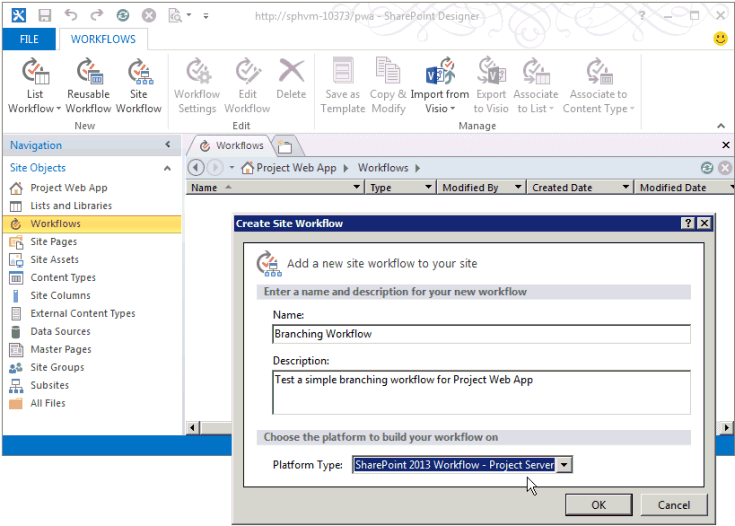
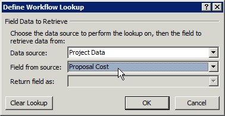

# Criar um fluxo de trabalho do Project Server para o Gerenciamento de PropostasCreate a Project Server workflow for Demand Management

Este artigo descreve como criar um fluxo de trabalho simples com o SharePoint Designer 2013.This article describes how to create a simple workflow by using SharePoint Designer 2013. Você pode exportar o fluxo de trabalho para o Visio 2013 para visualização e edição, ou usar o Visio 2013 para criar fluxos de trabalho do Project Server 2013 e importar o design para o SharePoint Designer 2013 para publicação no Project Web App.You can export the workflow to Visio 2013 for visualization and editing, or use Visio 2013 to design Project Server 2013 workflows and import the design into SharePoint Designer 2013 for publication to Project Web App. Para saber mais sobre a plataforma de fluxo de trabalho do SharePoint e a criação de fluxos de trabalho com o Visio 2013 e o SharePoint Designer 2013, confira os artigos sobre [Fluxos de trabalho no SharePoint 2013](https://msdn.microsoft.com/library/jj163986%28office.15%29.aspx) na documentação de desenvolvedor do SharePoint 2013.For more information about the SharePoint workflow platform and creating workflows with Visio 2013 and SharePoint Designer 2013, see the [Workflows in SharePoint 2013](https://msdn.microsoft.com/library/jj163986%28office.15%29.aspx) articles in the SharePoint 2013 developer documentation. 
  
Para saber mais sobre a preparação do Project Server para fluxos de trabalho, consulte [Início: Instalar e configurar o Gerenciador de Fluxos de Trabalho do SharePoint 2013](https://msdn.microsoft.com/library/jj163276%28office.15%29.aspx).For information about preparing Project Server for workflows, see [Start: Set up and configure SharePoint 2013 Workflow Managerhttp://msdn.microsoft.com/en-us/library/jj163276(office.15).aspx](https://msdn.microsoft.com/library/jj163276%28office.15%29.aspx).

## Como criar um fluxo de trabalho geralCreating a general workflow

Use as etapas a seguir para criar um fluxo de trabalho do Project Server 2013 com o SharePoint Designer 2013.Use the following steps to create a Project Server 2013 workflow by using SharePoint Designer 2013. O fluxo de trabalho é projetado para o gerenciamento de propostas de projeto.Use the following steps to create a pj15srvshort workflow by using spd15short. The workflow is designed for demand management of project proposals.
  
Para obter as etapas detalhadas, consulte a seção [Criando um fluxo de trabalho de ramificação](#pj15_CreateWorkflowSPD_Detailed).For detailed steps, see the [Create a branching workflow](#pj15_CreateWorkflowSPD_Detailed) section. 
  
### Para criar um fluxo de trabalho do Project Server (procedimento geral)To create a Project Server workflow (general procedure)

1. Determine os requisitos e então projete o fluxo de trabalho. Organize-o em fases e estágios e determine os campos personalizados que o fluxo de trabalho usará.Determine the requirements, and then design the workflow. Organize it into phases and stages, and determine the custom fields that the workflow will use.
    
2. No Project Web App, crie as entidades exigidas pelo fluxo de trabalho:In pwa, create the entities that the workflow requires:
    
    1. Examine as fases existentes do fluxo de trabalho; crie fases como o necessário.Review the existing workflow phases; create phases as necessary.
        
    2. Crie os campos personalizados da empresa que o fluxo de trabalho usará. Para estar disponível em um estágio do fluxo de trabalho, um campo personalizado deverá ser controlado por um fluxo de trabalho.Create the enterprise custom fields that the workflow will use. To be available in a workflow stage, a custom field must be controlled by a workflow.
        
    3. Edite ou crie as páginas de detalhes do projeto (PDPs) que os estágios do seu fluxo de trabalho usarão para coletar informações para o projeto. Neste exemplo, os estágios usarão PDPs padrão editados para incluírem um novo campo personalizado.Edit or create the project detail pages (PDPs) that your workflow stages will use to collect information for the project. In this example, the stages use default PDPs that are edited to include a new custom field.
        
    4. Crie os estágios necessários do fluxo de trabalho e então associe cada estágio de fluxo de trabalho à fase correta.Create the necessary workflow stages, and then associate each workflow stage with the correct phase.
    
3. No SharePoint Designer 2013, construa o fluxo de trabalho usando instruções declarativas no **Designer Baseado em Texto**:In spd15short, construct the workflow by using declarative statements in the Text-Based Designer:
    
    > [!NOTE]
    > Você também pode alternar para o \*\*Designer Visual \*\* do SharePoint Designer 2013 ou importar um fluxo de trabalho existente do Visio 2013.You can also switch to the **Visual Designer** in SharePoint Designer 2013, or import an existing workflow from Visio 2013. Siga estas etapas para usar o **Designer Baseado em Texto**:Follow these steps to use the REST API. 
    > 
    > 1. Abra o site do Project Web App e então crie um fluxo de trabalho de site que use a plataforma de fluxo de trabalho **Fluxo de Trabalho do SharePoint 2013 - Project Server**.Open the pwa site, and then create a site workflow that uses the SharePoint 2013 Workflow - Project Server workflow platform. 
    > 2. Adicione os estágios usados pelo fluxo de trabalho.Add the stages that the workflow uses.
    > 3. Insira as etapas, as condições, as ações e os loops do fluxo de trabalho necessários em cada estágio.Insert the workflow steps, conditions, actions, and loops that are required in each stage.
    > 4. Verifique se há algum erro no fluxo de trabalho e corrija os que encontrar.Check for any workflow errors and fix any that you find.
    > 5. (Opcional) Alterne do modo de exibição para o **Designer Visual**, ou de exportar o fluxo de trabalho para um arquivo do Visio 2013.(Optional) Switch the view to the **Visual Designer**, or export the workflow to a Visio 2013 file. Modifique o modo de exibição do Visio e salve as alterações no fluxo de trabalho atual.You can modify the Visio view and save changes to the current workflow. Edite o arquivo do Visio e importe-o para o SharePoint Designer 2013 para criar outros fluxos de trabalho.You can edit the Visio file and import it in SharePoint Designer 2013 to create other workflows.
    > 6. Publique o fluxo de trabalho.Publish the workflow. Depois de publicado, o fluxo de trabalho será mostrado na lista de fluxos de trabalho para o site do Project Web App.Publish the workflow. After it is published, the workflow shows in the list of workflows for the pwa site.
    
4. No Project Web App, use o fluxo de trabalho para o gerenciamento de propostas de projeto:In pwa, use the workflow for demand management of project proposals:
    
    1. Crie um modelo de projeto corporativo (EPT) que use o fluxo de trabalho.Create an enterprise project template (EPT) that uses the workflow.
        
    2. Na página Centro de Projeto, crie um projeto que use o EPT para o fluxo de trabalho e então siga os estágios do fluxo de trabalho.On the Project Center page, create a project that uses the EPT for the workflow, and then follow through the workflow stages.
        
    3. Teste o fluxo de trabalho cuidadosamente.Test the workflow thoroughly.
        
    4. Implante o fluxo de trabalho em um servidor de produção.Deploy the workflow to a production server.

## Criando um fluxo de trabalho de ramificaçãoCreating a branching workflow

Antes de poder usar o SharePoint Designer 2013 para criar um fluxo de trabalho do Project Server, o serviço do cliente do Workflow Manager Client 1.0 deverá ser configurado para usar as atividades de fluxo de trabalho do Project Server 2013.Before you can use SharePoint Designer 2013 to create a Project Server workflow, the Workflow Manager Client 1.0 service must be configured to use the Project Server 2013 workflow activities. Para saber mais sobre como configurar o Workflow Manager Client 1.0, confira os artigos sobre [Fluxos de trabalho no SharePoint 2013](https://msdn.microsoft.com/library/jj163986%28office.15%29.aspx) na documentação de desenvolvedor do SharePoint Server 2013.For information about how to configure Workflow Manager Client 1.0, see the [Workflows in SharePoint 2013](https://msdn.microsoft.com/library/jj163986%28office.15%29.aspx) articles in the SharePoint Server 2013 developer documentation. 
  
O procedimento detalhado a seguir inclui as mesmas etapas da seção [Como criar um fluxo de trabalho geral](#pj15_CreateWorkflowSPD_General).The following detailed procedure includes the same steps as in the [Create a general workflow](#pj15_CreateWorkflowSPD_General) section. 
  
### Para criar um fluxo de trabalho de ramificação do Project Server (procedimento detalhado)To create a Project Server branching workflow (detailed procedure)

#### 1. Planeje e projete o fluxo de trabalho.1. Plan and design the workflow.

Um fluxo de trabalho do Project Server pode ser integrado a vários estágios e fases de um processo de gerenciamento de propostas.A Project Server workflow can integrate with multiple stages and phases in a demand-management process. Uma vez que fluxos de trabalho podem ser complexos, é preciso compreender os requisitos de negócios e planejar um fluxo de trabalho cuidadosamente.Because workflows can be complex, you must understand the business requirements and plan a workflow carefully. Para obter um exemplo simples, crie um fluxo de trabalho de ramificação que usa o custo estimado de uma proposta de projeto para determinar se a proposta é aceita.For a simple example, design a branching workflow that uses the estimated cost of a project proposal to determine whether the proposal is accepted. Se o custo estimado for maior que US$ 25.000, rejeite a proposta. Caso contrário, aceite a proposta e crie o projeto.If the estimated cost is greater than $25,000 USD, reject the proposal; otherwise, accept the proposal and create the project.
    
Já que você pode usar o Visio 2013 e o SharePoint Designer 2013 para ajudar a projetar e criar fluxos de trabalho do Project Server 2013, fica mais fácil experimentar fluxos de trabalho do que com o Project Server 2010.Because you can use Visio 2013 and SharePoint Designer 2013 to help design and create workflows for Project Server 2013, you can more easily experiment with workflows than is possible with Project Server 2010. O exemplo de design de fluxo de trabalho deste artigo é o igual ao do artigo [Criar um fluxo de trabalho ramificação](https://msdn.microsoft.com/library/a02cafdc-d881-4271-b446-d8b2cd456a52%28Office.15%29.aspx) do SDK do Project 2010.The sample workflow design in this article is the same as in the [Create a branching workflow](https://msdn.microsoft.com/library/a02cafdc-d881-4271-b446-d8b2cd456a52%28Office.15%29.aspx) article in the Project 2010 SDK. Você pode projetar e criar um fluxo de trabalho de teste em um computador remoto usando uma instância de teste do Project Web App, não sendo necessário criar fluxos de trabalho diretamente em um computador com o Project Server 2013.You can design and create a test workflow on a remote computer using a test instance of Project Web App—you do not have to create workflows directly on a Project Server 2013 computer. 
    
#### 2. Crie as entidades exigidas pelo seu fluxo de trabalho.2. Create the entities that your workflow requires.

No Project Web App, examine as fases e estágio de fluxo de trabalho disponíveis e os campos personalizados empresariais disponíveis.In Project Web App, review the available workflow phases and stages, and the enterprise custom fields that are available. Se necessário, crie as entidades exigidas pelo seu fluxo de trabalho, como nas etapas a seguir:In pwa, review the available workflow phases and stages, and the enterprise custom fields that are available. If necessary, create the entities that your workflow requires, as in the following steps:
    
1. **Fases de fluxo de trabalho** A instalação padrão do Project Web App inclui as fases Criar, Selecionar, Planejar, Gerenciar e Concluído.**Workflow phases** The default installation of Project Web App includes the Create, Select, Plan, Manage, and Finished phases. Para o exemplo de fluxo de trabalho de ramificação, você não precisa criar outras fases.Workflow phases   The default installation of pwa includes the Create, Select, Plan, Manage, and Finished phases. For the branching workflow example, you do not have to create other phases. 
        
2. **Campos personalizados empresariais** O fluxo de trabalho de ramificação exige um campo personalizado de custo do projeto que é controlado pelo fluxo de trabalho.**Enterprise custom fields** The branching workflow requires a project cost custom field that is workflow-controlled. O valor de um campo personalizado controlado pelo fluxo de trabalho é definido em uma PDP que usa o fluxo de trabalho.The value of a workflow-controlled custom field is set in a PDP that the workflow uses. Por exemplo, escolha o ícone de **Configurações** no canto superior direito de uma página do Project Web App, escolha **Configurações do PWA** e, em seguida, escolha **Campos personalizados empresariais e tabelas de pesquisa**.For example, choose the **Settings** icon at the top-right of a Project Web App page, choose **PWA Settings**, and then choose **Enterprise Custom Fields and Lookup Tables**.
        
   Crie um campo personalizado chamado Custo da Proposta para a entidade **Projeto** e selecione o tipo **Custo**.Create a custom field named Proposal Cost for the **Project** entity, and select the type **Cost**. For the description, type Estimated cost of a project proposal. In the Behavior section, choose Behavior controlled by workflow. Para a descrição, digite o Custo estimado de uma proposta de projeto.For the description, type Estimated cost of a project proposal. Na seção **Comportamento**, escolha **Comportamento controlado por fluxo de trabalho**.In the **Behavior** section, choose **Behavior controlled by workflow**.
        
3. **Páginas de detalhes do projeto** Edite ou crie as PDPs que os estágios de fluxo de trabalho irão usar.**Project detail pages**   Edit or create the PDPs that the workflow stages will use. For example, do the following steps: Por exemplo, siga estas etapas:For example, do the following: 
        
    1. Escolha **Páginas de Detalhes do Projeto** na página Configurações do Servidor e então escolha a PDP **ProjectInformation**.Choose **Project Detail Pages** on the Server Settings page, and then choose the **ProjectInformation** PDP. 
            
    2. Na guia **PÁGINA** da faixa de opções, no grupo **Editar**, escolha **Editar Página**.On the **PAGE** tab of the ribbon, in the **Edit** group, choose **Edit Page**.
            
    3. Escolha a seta para baixo no canto superior direito da web part **Informações Básicas** e então escolha **Editar web part**.Choose the down arrow at the top-right of the **Basic Info** Web Part, and then choose **Edit Web Part**. Ou, na guia **WEB PART** da faixa de opções, no grupo **Propriedades**, escolha **Propriedades da web part** para mostrar a parte do editor.Or, on the **WEB PART** tab of the ribbon, in the **Properties** group, choose **Web Part Properties** to show the editor part. 
            
    4. Na seção **Campos do Projeto Exibidos** da parte do editor (consulte a Figura 1), escolha **Modificar**.In the **Displayed Project Fields** section of the editor part (see Figure 1), choose **Modify**.
            
    5. Adicione o campo personalizado **Custo da Proposta**, mova-o para acima do campo **Proprietário** na lista **Campos do Projeto Selecionados** e então escolha **OK** (ver Figura 1).Add the **Proposal Cost** custom field, move it above the **Owner** field in the **Selected Project Fields** list, and then choose **OK**.
      
    6. Na parte do editor, escolha **OK** e então escolha **Parar a Edição** no grupo **Editar**, na guia **PÁGINA** da faixa de opções. A Figura 2 mostra o campo personalizado **Proposal Cost** adicionado ao PDP Informações do Projeto.In the editor part, choose **OK**, and then choose **Stop Editing** in the **Edit** group, on the **PAGE** tab of the ribbon. Figure 2 shows the **Proposal Cost** custom field that is added to the Project Information PDP. 

    **Figura 1. Edição da web part Campos do Projeto em uma PDP****Figure 1. Editing the Project Fields Web Part in a PDP**

    

    **Figura 2. A PDP editada inclui o campo personalizado Custo da Proposta****Figure 2. The edited PDP includes the Proposal Cost custom field**

    
  
4. **Estágios do fluxo de trabalho** Crie os estágios necessários para cada fase do fluxo de trabalho.**Workflow stages** Create the stages that are required for each phase of the workflow. Na página Configurações do Servidor, escolha **Estágios do Fluxo de Trabalho**, e então escolha **NOVO ESTÁGIO DO FLUXO DE TRABALHO**.On the Server Settings page, choose **Workflow Stages**, and then choose **NEW WORKFLOW STAGE**. A Figura 3 mostra parte da página Adicionar Estágio do Fluxo de Trabalho.Figure 3 shows part of the Add Workflow Stage page.
    
    **Figura 3. Como adicionar um estágio do fluxo de trabalho no Project Web App****Figure 3. Adding a workflow stage in Project Web App**

    
  
    O exemplo de fluxo de trabalho de ramificação usa os quatro estágios mostrados na Tabela 1.The branching workflow example uses the four stages that are shown in Table 1. Nas **Configurações Adicionais da seção Página de Detalhes do Projeto Visível** da página Adicionar Estágio do Fluxo de Trabalho (não mostrada na Figura 3), os valores são opcionais. Eles fornecem mais informações sobre a página Status do Fluxo de Trabalho.In the **Additional Settings for the Visible Project Detail Page** section of the Add Workflow Stage page (not shown in Figure 3), values are optional; they provide more information on the Workflow Status page. Por exemplo, como a PDP de Detalhes da Proposta Inicial exige a inserção de dados pelo usuário, marque a caixa de seleção **A Página de Detalhes do Projeto requer atenção** e adicione uma descrição específica, como Definir o nome do projeto e o custo para esta PDP.The branching workflow example uses the four stages that are shown in Table 1. In the Additional Settings for the Visible Project Detail Page section of the Add Workflow Stage page (not shown in Figure 3), values are optional; they provide more information on the Workflow Status page. For example, because the Initial Proposal Details PDP requires user input, you can select the The Project Detail Page requires attention check box, and then add a specific description such as Set the project name and cost for this PDP.
    
    A Figura 4 mostra os quatro estágios concluídos na página Estágios do Fluxo de Trabalho.Figure 4 shows the four stages completed on the Workflow Stages page.
    
    **Tabela 1. Estágios para o fluxo de trabalho de ramificação****Table 1. Stages for the branching workflow**

    |NomeName|DescriçãoDescription|Descrição para envioDescription for Submit|FasePhase|PDPs visíveisVisible PDPs|Campos PersonalizadosCustom Fields|
    |:-----|:-----|:-----|:-----|:-----|:-----|
    |Detalhes Iniciais da PropostaInitial Proposal Details    |Defina o nome e o custo do projeto.Set the project name and cost.    |Envie o projeto como uma proposta.Submit the project as a proposal.    |CriarCreate    |Informações do ProjetoProject Information    Detalhes do ProjetoProject Details    |Custo da Proposta (obrigatório)Proposal Cost (required)    |
    |Detalhes do ProjetoProject Details    |Forneça detalhes sobre o projeto proposto.Provide details of the proposed project.    |Envie detalhes para continuar com o projeto.Submit details to continue with the project.    |CriarCreate    |Informações do ProjetoProject Information    Detalhes do ProjetoProject Details    |Custo da Proposta (somente leitura)Proposal Cost (read-only)    |
    |Rejeição AutomatizadaAutomated Rejection    |A proposta é rejeitada, com base nas informações fornecidas.The proposal is rejected, based on the information that is provided.    |   |CriarCreate    |Informações do ProjetoProject Information    |Custo da Proposta (somente leitura)Proposal Cost (read-only)    |
    |ExecuçãoExecution    |A proposta é aceita e está pronta para o gerenciamento de projetos.The proposal is accepted, and ready for project management.    |   |GerenciarManage    |Informações do ProjetoProject Information    Detalhes do ProjetoProject Details    |Custo da Proposta (somente leitura)Proposal Cost (read-only)    |
   
    **Figura 4. Lista dos estágios do fluxo de trabalho no Project Web App****Figure 4. List of the workflow stages in Project Web App**

    
  
#### 3. Construa o fluxo de trabalho no Designer Baseado em Texto.3. Construct the workflow in the Text-Based Designer.

No SharePoint Designer 2013, construa o fluxo de trabalho usando instruções declarativas no Designer Baseado em Texto.In spd15short, construct the workflow by using declarative statements in the Text-Based Designer: Você pode começar a digitar na linha de inserção laranja para obter instruções de conclusão automática sensíveis ao contexto para a lógica e as etapas do fluxo de trabalho ou pode inserir a lógica e as etapas usando controles no grupo **Inserir** na guia **FLUXO DE TRABALHO** da faixa de opções.In spd15short, construct the workflow by using declarative statements in the Text-Based Designer. You can start typing at the orange insertion line to get context-sensitive auto-completion statements for the workflow logic and steps, or you can insert the logic and steps by using controls in the **Insert** group on the \*\*WORKFLOW \*\*tab of the ribbon. 
    
1. No modo de exibição Backstage do SharePoint Designer 2013, escolha **Abrir Site**.In the Backstage view of SharePoint Designer 2013, choose **Open Site**. Por exemplo, abra o `https://ServerName/pwa`.For example, open  `https://ServerName/pwa`. No painel de **navegação**, clique em **Fluxos de Trabalho**.In the **Navigation** pane, click **Workflows**. Em seguida, na guia **FLUXOS DE TRABALHO** da faixa de opções, no grupo **Novo**, escolha **Site do Fluxo de Trabalho**.Then, on the **WORKFLOWS** tab of the ribbon, in the **New** group, choose **Site Workflow**. Por exemplo, chame o fluxo de trabalho de Fluxo de Trabalho de Ramificação.For this example, name the workflow Branching Workflow. Garanta que **Fluxo de Trabalho do SharePoint 2013 - Project Server** esteja selecionado como a lista suspensa **Tipo de Plataforma** (ver Figura 5).Ensure that **SharePoint 2013 Workflow - Project Server** is selected in the **Platform Type** drop-down list (see Figure 5). 
    
    **Figura 5. Como criar um fluxo de trabalho do site do Project Server****Figure 5. Creating a Project Server site workflow**

    
  
2. Selecione a guia **Fluxo de Trabalho de Ramificação**. Em seguida, na guia **FLUXO DE TRABALHO** da faixa de opções, no grupo **Gerenciar**, na lista suspensa **Exibições**, escolha **Designer Baseado em Texto**. Para mostrar a exibição com a linha de inserção laranja piscando (consulta a Figura 6), clique na exibição.Select the **Branching Workflow** tab. Then, on the **WORKFLOW** tab of the ribbon, in the **Manage** group, in the **Views** drop-down list, choose **Text-Based Designer**. To show the view with the blinking orange insertion line (see Figure 6), click within the view.
    
    **Figura 6. Uso do modo de exibição de Designer Baseado em Texto para o fluxo de trabalho****Figure 6. Using the Text-Based Designer view for the workflow**

    
  
3. Na exibição **Designer Baseado em Texto**, adicione os estágios usados pelo fluxo de trabalho. Na guia **FLUXO DE TRABALHO** da faixa de opções, no grupo **Inserir**, na lista suspensa **Estágio** em **Criar**, escolha **Detalhes Iniciais da Proposta**.In the **Text-Based Designer** view, add the stages that the workflow uses. On the **WORKFLOW** tab of the ribbon, in the **Insert** group, in the **Stage** drop-down list under **Create**, choose **Initial Proposal Details**.
    
    De maneira semelhante, posicione a linha de inserção laranja abaixo da caixa **Estágio: Detalhes Iniciais da Proposta** e adicione os outros estágios usados pelo fluxo de trabalho: **Detalhes do Projeto**, **Rejeição Automatizada** e **Execução** (consulte a Figura 7).Similarly, place the orange insertion line below the **Stage: Initial Proposal Details** box, and add the other stages that the workflow uses: **Project Details**, **Automated Rejection**, and **Execution** (see Figure 7). 
    
    **Figura 7. Como adicionar um estágio a um fluxo de trabalho no SharePoint Designer****Figure 7. Adding a stage to a workflow in SharePoint Designer**

    
  
4. Adicione as etapas e a lógica do fluxo de trabalho em cada estágio:Add the workflow steps and logic within each stage: 
    
    1. No estágio **Detalhes Iniciais da Proposta**, posicione a linha de inserção laranja na parte superior do corpo do estágio. No grupo **Inserir** na faixa de opções, escolha **Ação**, role para baixo até **Ações do Project Web App** e então escolha **Aguardar Evento de Projeto**. Escolha **este evento de projeto** e então selecione **Evento: Quando um projeto é enviado** na lista suspensa.In the **Initial Proposal Details** stage, place the orange insertion line at the top of the stage body. In the **Insert** group on the ribbon, choose **Action**, scroll down to **Project Web App Actions**, and then choose **Wait for Project Event**. Choose **this project event**, and then select **Event: When a project is submitted** in the drop-down list. 
    
    2. Na seção **Transição para o estágio** do estágio **Detalhes Iniciais da Proposta**, insira **Se qualquer valor for igual ao valor**. Você pode começar a digitar a declaração ou usar o controle **Condição** no grupo **Inserir** na faixa de opções.In the **Transition to stage** section of the **Initial Proposal Details** stage, insert **If any value equals value**. You can start typing the statement or use the **Condition** control in the **Insert** group on the ribbon. 
    
    3. Escolha o primeiro controle de **valor** e então escolha **fx** para mostrar a caixa de diálogo **Definir Pesquisa de Fluxo de Trabalho** (consulte a Figura 8). Na lista suspensa **Fonte de dados**, selecione **Dados do Projeto**. Na lista suspensa **Campo da origem**, selecione **Custo da Proposta**.Choose the first **value** control, and then choose **fx** to show the **Define Workflow Lookup** dialog box (see Figure 8). In the **Data source** drop-down list, select **Project Data**. In the **Field from source** drop-down list, select **Proposal Cost**.
    
       **Figura 8. Definição de um valor de pesquisa no fluxo de trabalho****Figure 8. Defining a lookup value in the workflow**

       
  
    4. Conclua a instrução `If` de forma que ela mostre o seguinte: **Se Dados do Projeto:Custo da Proposta for maior do que 25000**Complete the If`If` statement so that it shows the following: **If Project Data:Proposal Cost is greater than 25000**
    
       > [!NOTE]
       > Como alternativa, você poderia criar uma variável de fluxo de trabalho, definir uma variável como o valor do campo personalizado e então comprar a variável ao valor. Por exemplo, da lista suspensa **Variáveis Locais** na faixa de opções, crie uma variável chamada **TotalCost** (sem espaços) do tipo **Number**. Na caixa **Definir Pesquisa do Fluxo de Trabalho**, selecione **Variáveis e Parâmetros do Fluxo de Trabalho** como a fonte de dados e então selecione **Variável: TotalCost** como o campo. A instrução **Se** seria então: **Se a Variável: TotalCost for maior do que 25000**Alternately, you could create a workflow variable, set the variable to the custom field value, and then compare the variable with a value. For example, from the **Local Variables** drop-down list on the ribbon, create a variable named **TotalCost** (no spaces) of type **Number**. In the **Define Workflow Lookup** dialog box, select **Workflow Variables and Parameters** for the data source, and then select **Variable: TotalCost** as the field. The **If** statement would then be: **If Variable: TotalCost is greater than 25000**
  
    5. Posicione a linha de inserção laranja na ramificação `If` e então insira **Vá para um estágio** usando o controle **Ação** do grupo **Inserir** na faixa de opções.Place the orange insertion line within the If`If` branch, and then insert **Go to a stage** by using the **Action** control, in the **Insert** group on the ribbon. Choose the a stage drop-down control and select the Automated Rejection stage. Escolha o controle da lista suspensa de **um estágio** e selecione o estágio **Rejeição Automatizada**.Choose the **a stage** drop-down control and select the **Automated Rejection** stage. 
    
       Da mesma forma, na ramificação `Else`, insira a instrução **Ir para Detalhes do Projeto**.Similarly, in the Else`Else` branch, insert the **Go to Project Details** statement. Figure 9 shows the completed Initial Proposal Details stage. A Figura 9 mostra o estágio **Detalhes Iniciais da Proposta** concluído.Figure 9. Completed logic for the Initial Proposal Details stage 
    
       **Figura 9. Lógica concluída para o estágio Detalhes Iniciais da Proposta****Figure 9. Completed logic for the Initial Proposal Details stage**

       
  
    6. No estágio **Rejeição Automatizada**, a menos que você queira pausar o fluxo de trabalho e mostrar alguns dados em um PDP, deixe a primeira seção vazia. A seção **Transição para o estágio** deve conter uma transição; como não há outro estágio após uma rejeição, digite Ir para o Fim do Fluxo de Trabalho para a instrução.In the **Automated Rejection** stage, unless you want to pause the workflow and show some data in a PDP, leave the first section empty. The **Transition to stage** section must contain a transition; because there is no other stage following a rejection, type Go to End of Workflow for the statement. 
    
    7. No estágio **Detalhes do Projeto**, adicione Ir para a Execução na seção **Transição para o estágio**. A menos que haja outros dados a serem adicionados, ou se você quiser pausar o fluxo de trabalho, não será necessário aguardar por um evento enviado.In the **Project Details** stage, add Go to Execution in the **Transition to stage** section. Unless there is additional data to add, or you want to pause the workflow, it is not necessary to wait for a submitted event. 
    
    8. No estágio **Execução**, a menos que queira pausar o fluxo de trabalho, deixe a seção de ação do estágio vazia. Na seção **Transição para o estágio**, adicione **Ir para o Fim do Fluxo de Trabalho**.In the **Execution** stage, unless you want to pause the workflow, leave the stage action section empty. In the **Transition to stage** section, add **Go to End of Workflow**.
    
5. No grupo **Salvar** da faixa de opções, escolha **Verificar Erros** para verificar a existência de erros de fluxo de trabalho (consulte a Figura 10). Corrija qualquer erro e então escolha **Salvar**.In the **Save** group on the ribbon, choose **Check for Errors** to check for workflow errors (see Figure 10). Fix any errors, and then choose **Save**.
    
    **Figura 10. Como verificar o fluxo de trabalho em busca de erros no SharePoint Designer****Figure 10. Checking the workflow for errors in SharePoint Designer**

    
  
6. (Opcional) No grupo **Gerenciar** na faixa de opções, no menu suspenso **Exibições**, escolha **Visual Designer**. Na Figura 11, a exibição terá o zoom reduzido para 50%.(Optional) In the **Manage** group on the ribbon, in the **Views** drop-down menu, choose **Visual Designer**. In Figure 11, the view is zoomed out to 50%.
    
    Você pode editar itens no fluxo de trabalho usando o Virtual Designer. Por exemplo, selecione a condição **Se qualquer valor for igual ao valor**, escolha o ícone de ferramenta no canto inferior esquerda da condição e então selecione **Valor** para mostrar as condições de comparação na caixa de diálogo **Propriedades**.You can edit items in the workflow by using the Visual Designer. For example, select the **If any value equals value** condition, choose the tool icon at the bottom-left of the condition, and then select **Value** to show the comparison conditions in the **Properties** dialog box. 
    
    **Figura 11. Uso do Designer Visual para um fluxo de trabalho****Figure 11. Using the Visual Designer for a workflow**

    
  
    Quando o fluxo de trabalho estiver no modo de exibição do Designer Visual, para salvar o fluxo de trabalho em um arquivo do Visio 2013 (.vsdx) como um backup ou para uso posterior, você poderá escolher **Exportar para o Visio**.When the workflow is in the Visual Designer view, to save the workflow in a vis15short (.vsdx) file as a backup or for later use, you can choose Export to Visio.
    
7. Publique o fluxo de trabalho.Publish the workflow. Quando você usa o SharePoint Designer 2013 para publicar o fluxo de trabalho no site ativo do Project Web App, o fluxo de trabalho será registrado no site do SharePoint ou no Azure e ficará disponível no Project Web App para novos EPTs.Publish the workflow. When you use spd15short to publish the workflow to the active pwa site, the workflow is registered to the SharePoint site or in winazurefabshort and becomes available within pwa for new EPTs.

#### 4. Crie um EPT para o fluxo de trabalho e então teste o fluxo de trabalho.In pwa, create an EPT for the workflow, and then test the workflow by creating a project proposal:

No Project Web App, crie um EPT para o fluxo de trabalho e então teste o fluxo de trabalho criando uma proposta de projeto:In pwa, create an EPT for the workflow, and then test the workflow by creating a project proposal:
    
1. Na página Configurações do PWA, escolha **Tipos de Projeto Corporativo**e crie um EPT chamado Fluxo de Trabalho de Ramificação de Teste.On the PWA Settings page, choose **Enterprise Project Types**, and then create an EPT named Test Branching Workflow. Desmarque as caixas de seleção **Criar novos projetos como Projetos de Lista de Tarefas do SharePoint**, dessa forma o Project Server manterá total controle dos projetos criados pela EPT.Clear the **Create new projects as SharePoint Tasks List Projects** check box so that Project Server will maintain full control of projects that are created by the EPT. Selecione **Fluxo de Trabalho de Ramificação** na lista suspensa **Associação de Fluxo de Trabalho de Site** e selecione a PDP **Informações do Projeto** na lista suspensa **Nova Página do Projeto** para ser a primeira página que o fluxo de trabalho mostra.On the PWA Settings page, choose **Enterprise Project Types**, and then create an EPT named Test Branching Workflow. Clear the **Create new projects as SharePoint Tasks List Projects** check box so that Project Server will maintain full control of projects that are created by the EPT. Select **Branching Workflow** in the **Site Workflow Association** drop-down list, and then select the Project Information PDP in the New Project Page drop-down list to be the first page that the workflow shows. 
    
    **Figura 12. Adição de um EPT ao fluxo de trabalho****Figure 12. Adding an EPT for the workflow**

    
  
    > [!NOTE]
    > Um valor **Sim** na coluna **Projeto de Lista de Tarefas do SharePoint** da tabela de tipos de projeto da empresa refere-se a um EPT que cria uma lista de tarefas do SharePoint, onde a lista de tarefas fica visível no Project Web App, mas o SharePoint mantém o controle do projeto. Para saber mais sobre o gerenciamento de projetos como listas de tarefas do SharePoint, consulte [Project Server 2013 architecture](project-server-2013-architecture.md).A **Yes** value in the **SharePoint Tasks List Project** column in the table of enterprise project types refers to an EPT that creates a SharePoint tasks list, where the tasks list is visible in Project Web App but SharePoint maintains control of the project. For more information about managing projects as SharePoint tasks lists, see [Project Server 2013 architecture](project-server-2013-architecture.md). 
  
2. Abra a página Projetos no Project Web App e crie um projeto usando o novo EPT (ver Figura 13).Open the Projects page in Project Web App, and then create a project by using the new EPT (see Figure 13). Como o **Fluxo de Trabalho de Ramificação de Teste** está associado ao **Fluxo de Trabalho de Ramificação**, a criação do projeto começa sob controle do fluxo de trabalho.Open the Projects page in pwa, and then create a project by using the new EPT (see Figure 13). Because **Test Branching Workflow** is associated with **Branching Workflow**, project creation starts under control of the workflow.
    
    **Figura 13. Como criar um projeto com o EPT Fluxo de Trabalho de Ramificação de Teste****Figure 13. Creating a project with the Test Branching Workflow EPT**

    
  
3. Quando o fluxo de trabalho exibe a PDP **Informações do Projeto**, adicione dados aos campos do projeto.When the workflow displays the **Project Information** PDP, add data to the project fields. Por exemplo, insira um valor de **Custo da Proposta** de 30.000.For example, enter a **Proposal Cost** value of 30000. A versão em inglês dos EUA do Project Server altera o campo para mostrar US$ 30.000 (ver Figura 14).When the workflow displays the Project Information PDP, add data to the project fields. For example, enter a Proposal Cost value of 30000. The U.S. English version of Project Server changes the field to show $30,000 (see Figure 14).
    
    **Figura 14. Uso da PDP Informações do Projeto editada****Figure 14. Using the edited Project Information PDP**

    
  
4. Na guia **PROJETO** da faixa de opções, no grupo **Projeto**, escolha **Salvar**. O Project Server adiciona os dados do PDP ao projeto e então mostra a página Status do Fluxo de Trabalho (consulte a Figura 15). Para ver a descrição completa do estágio Detalhes Iniciais da Proposta no diagrama de status do fluxo de trabalho, passe o ponteiro do mouse sobre o estágio no diagrama de visualização do fluxo de trabalho.On the **PROJECT** tab of the ribbon, in the **Project** group, choose **Save**. Project Server adds the data in the PDP to the project, and then shows the Workflow Status page (see Figure 15). To see the full description of the Initial Proposal Details stage in the workflow status diagram, hover the pointer over the stage in the workflow visualization diagram.
    
    A grade **Todos os Estágios do Fluxo de Trabalho** usa uma seta verde para mostrar que o estágio Detalhes Iniciais da Proposta está aguardando uma entrada. Isso acontece porque o fluxo de trabalho aguarda um evento de envio no estágio Detalhes Iniciais da Proposta. Se o fluxo de trabalho não tiver aguardado um evento de envio, você pode escolher **Avançar** no grupo **Página** para avançar para o próximo PDP.The **All Workflow Stages** grid uses a green arrow to show that the Initial Proposal Details stage is waiting for input. This is because the workflow waits for a submit event in the Initial Proposal Details stage. If the workflow did not wait for a submit event, you could choose **Next** in the **Page** group to advance to the next PDP. 
    
    **Figura 15. Uso da página Status do Fluxo de Trabalho no estágio Detalhes Iniciais da Proposta****Figure 15. Using the Workflow Status page in the Initial Proposal Details stage**

    
  
    O diagrama de visualização do fluxo de trabalho mostra o estágio atual em verde. Na fase **Criar**, o estágio Detalhes Iniciais da Proposta é o estágio atual.The workflow visualization diagram shows the current stage in a green color. In the **Create** phase, the Initial Proposal Details stage is the current stage. 
    
5. Na faixa de opções, no grupo **Fluxo de Trabalho**, escolha **Enviar**.On the ribbon, in the **Workflow** group, choose **Submit**.
    
    > [!TIP]
    > Se o controle **Enviar** estiver desabilitado, atualize a página.If the **Submit** control is disabled, refresh the page. 
  
    Se o valor **Custo da Proposta** for maior do que US$ 25.000, o fluxo de trabalho se moverá para o estágio Rejeição Automatizada. A Figura 16 mostra o status do estágio Rejeição Automatizada quando você escolher **Enviar** novamente. Se o **Custo da Proposta** for de US$ 25.000 ou menos, o fluxo de trabalho se moverá para o estágio Detalhes do Projeto (consulte a Figura 17).If the **Proposal Cost** value is greater than $25,000 USD, the workflow moves to the Automated Rejection stage. Figure 16 shows the Automated Rejection stage status when you choose **Submit** again. If the **Proposal Cost** is $25,000 USD or less, the workflow moves to the Project Details stage (see Figure 17). 
    
    **Figura 16. O fluxo de trabalho é concluído no estágio Rejeição Automatizada****Figure 16. The workflow is completed in the Automated Rejection stage**

    
  
    A Figura 17 mostra outro teste com uma proposta de projeto chamada **Teste 2 - Ramificação**, em que o estágio Detalhes do Projeto é atual na fase Criar.Figure 17 shows another test with a project proposal named **Test 2 – Branching**, where the Project Details stage is current in the Create phase. The Manage phase shows in a light blue color, which indicates that phase is not yet active. A fase Gerenciar é exibida na cor azul claro, o que indica que fase ainda não está ativa.The Manage phase shows in a light blue color, which indicates that phase is not yet active.
    
    **Figura 17. O fluxo de trabalho prossegue para o estágio Detalhes do Projeto se o custo for inferior a US$ 25.000****Figure 17. The workflow continues to the Project Details stage if the cost is less than $25,000**

    
  
6. Se você avançar para o estágio Detalhes do Projeto, não haverá outros dados a serem adicionados na página padrão. Escolha **Enviar** novamente para avançar para o estágio Execução (consulte a Figura 18).If you advance to the Project Details stage, there is no additional data to add in the default page. Choose **Submit** again to advance to the Execution stage (see Figure 18). 
    
    **Figura 18. O fluxo de trabalho está pronto para ser gerenciado no estágio Execução****Figure 18. The workflow is ready to manage in the Execution stage**

    
  
No estágio Detalhes do Projeto, o fluxo de trabalho não aguarda um evento de envio. Se o PDP Detalhes do Projeto incluir campos obrigatórios adicionais, o Project Server aguardará até você adicionar dados aos campos antes de prosseguir para o estágio Execução. Como definido no Fluxo de Trabalho de Ramificação, o estágio Execução também não aguarda um evento de envio. No estágio Execução, você pode editar o projeto como um gerente de projeto ou escolher \*\*Fechar \*\* na guia **PROJETO** da faixa de opções. Quando você escolher **Fechar** poderá fazer check-in no projeto e editá-lo posteriormente ou deixar o projeto em check-out.In the Project Details stage, the workflow does not wait for a submit event. If the Project Details PDP includes additional required fields, Project Server waits until you add data to the fields before continuing to the Execution stage. As defined in the Branching Workflow, the Execution stage also does not wait for a submit event. In the Execution stage, you can edit the project as a project manager or choose **Close** in the **PROJECT** tab of the ribbon. When you choose **Close**, you can check in the project and edit it later or leave the project checked out.

O projeto **Fluxo de Trabalho de Ramificação** é um exemplo simples que tem somente um teste de comparação. O fluxo de trabalho envolve três estágios na fase Criar e um estágio na fase Gerenciar do Gerenciamento de Propostas. Para testar cuidadosamente um fluxo de trabalho, você deverá testar todas as ramificações do fluxo de trabalho e usar valores extremos e típicos para ver se o comportamento é o esperado.The **Branching Workflow** project is a simple example that has only one comparison test. The workflow involves three stages in the Create phase and one stage in the Manage phase of Demand Management. To thoroughly test a workflow, you should test all branches of the workflow and use extreme and typical values to see whether the behavior is as expected. 

## Como importar um fluxo de trabalho do VisioImporting a workflow from Visio

Para alterar o fluxo de trabalho, você pode criar ou modificar campos personalizados controlados pelo fluxo de trabalho e criar ou modificar fases e estágios do fluxo de trabalho.To change the workflow, you can create or modify workflow-controlled custom fields and create or modify workflow phases and stages. Você pode usar o SharePoint Designer 2013 para adicionar condições, ações, loops e estágios e, em seguida, salvar e republicar o fluxo de trabalho.You can use SharePoint Designer 2013 to add conditions, actions, loops, and stages, and then save and republish the workflow. Para reutilizar ou manter um backup de um fluxo de trabalho, você pode exportar para um arquivo do Visio 2013.To reuse or keep a backup of a workflow, you can export it to a Visio 2013 file. 
  
Você também pode criar ou editar o fluxo de trabalho do Visio 2013 e importar o arquivo para o SharePoint Designer 2013 para usar com o Project Web App.You can also create or edit the workflow in Visio 2013 and import the file into SharePoint Designer 2013 for use by Project Web App. Para usar um fluxo de trabalho não modificado, a instância do Project Web App deve incluir propriedades do estágio do fluxo de trabalho que são as mesmas da instância original do Project Web App.To use an unmodified workflow, the Project Web App instance must include workflow stage properties that are the same as those in the original Project Web App instance. Para saber mais sobre como usar o Visio para ajudar a criar a luxos de trabalho, confira [Desenvolvimento de fluxos de trabalho no SharePoint Designer 2013 e no Visio 2013](https://msdn.microsoft.com/library/jj163272%28office.15%29.aspx).For more information about using Visio to help create workflows, see [Workflow development in SharePoint Designer 2013 and Visio 2013](https://msdn.microsoft.com/library/jj163272%28office.15%29.aspx).
  
> [!NOTE]
> Quando você importa um arquivo do Visio 2013 para outra instância do Project Web App, os estágios têm diferentes GUIDs de estágio, mesmo se os nomes dos estágios forem iguais.When you import a Visio 2013 file to a different instance of Project Web App, the stages have different stage GUIDs, even if the stage names are the same. Depois de importar o fluxo de trabalho, você precisa configurar as propriedades de estágio e ação para usar valores específicos para a instância do Project Web App.After you import the workflow, you must configure the stage and action properties to use values that are specific to the Project Web App instance. 
> 
> Quando você cria um fluxo de trabalho do Visio 2013, os estágios e as ações não têm nenhuma propriedade específica para uma instância do Project Web App, uma vez que o Visio não se conecta com o Project Web App.If you create a workflow in Visio 2013, the stages and actions have no properties that are specific for a Project Web App instance because Visio does not connect with Project Web App. Quando você conecta o SharePoint Designer 2013 ao Project Web App, cria um fluxo de trabalho e, depois, importa o arquivo VSDX, você substitui o fluxo de trabalho ativo.When you connect SharePoint Designer 2013 with Project Web App, create a workflow, and then import the VSDX file, you overwrite the active workflow. Então é necessário configurar as propriedades de estágio e ação para corresponder os valores que o SharePoint Designer 2013 obtém do Project Web App.You must then configure the stage and action properties to match the values that SharePoint Designer 2013 gets from Project Web App. 
  
### Para importar um fluxo de trabalho do Visio para o SharePoint DesignerTo import a workflow from Visio to SharePoint Designer

1. No Visio 2013, crie um fluxo de trabalho simples.In Visio 2013, create a simple workflow. Por exemplo, siga estas etapas:For example, do the following:
    
   1. Abra o Visio e então crie um fluxo de trabalho. Escolha o painel **CATEGORIAS** para um novo fluxo de trabalho, escolha **Fluxograma**, escolha o modelo **Fluxo de Trabalho do Microsoft SharePoint 2013** no painel **Novo** e então escolha **Criar**. O fluxo de trabalho abre com uma forma Estágio chamada **Estágio 1**. O fluxo de trabalho inclui um componente Iniciar e uma forma Entrar e uma forma Sair como parte da forma Estágio.Open Visio, and then create a workflow. Choose the **CATEGORIES** pane for a new workflow, choose **Flowchart**, choose the **Microsoft SharePoint 2013 Workflow** template in the **New** pane, and then choose **Create**. The workflow opens with a Stage shape named **Stage 1**. The workflow includes a Start component, and an Enter shape and Exit shape as part of the Stage shape.
    
      Quando você passa o mouse sobre a forma de estágio e escolhe o ícone **Propriedades**, a seleção é desabilitada.When you hover over the Stage shape and choose the **Properties** icon, the selection is disabled. You can set the stage and action properties after you import the workflow diagram to spd15short. É possível definir as propriedades de estágio e ação depois de importar o diagrama de fluxo de trabalho para o SharePoint Designer 2013.You can set the stage and action properties after you import the workflow diagram to SharePoint Designer 2013. 
    
      > [!NOTE]
      >  Os únicos estênceis de forma que você deve usar são os seguintes na lista de formas de Fluxo de Trabalho:The only shape stencils you should use are the following in the list of Flowchart shapes: 
      > - **Ações – Fluxo de Trabalho do SharePoint 2013****Actions – SharePoint 2013 Workflow**
      > - **Componentes – Fluxo de Trabalho do SharePoint 2013****Components – SharePoint 2013 Workflow**
      > - **Condições – Fluxo de Trabalho do SharePoint 2013****Conditions – SharePoint 2013 Workflow**
  
   2. No painel **Formas**, escolha **Formas Rápidas** e então arraste a forma Condição chamada **Se qualquer valor for igual ao valor** à direita da forma Estágio.In the **Shapes** pane, choose **Quick Shapes**, and then drag the Condition shape named **If any value equals value** to the right of the Stage shape. 
    
   3. Na guia **Página Inicial** da faixa de opções, escolha a ferramenta **Conector** e então conecte a forma Sair no estágio à forma Condição (consulte a Figura 19).On the **HOME** tab of the ribbon, choose the **Connector** tool, and then connect the Exit shape on the stage with the Condition shape (see Figure 19). 
    
      **Figura 19. Conexão de uma forma Estágio a uma forma Condição em um diagrama de fluxo de trabalho do Visio****Figure 19. Connecting a Stage shape with a Condition shape in a Visio workflow diagram**

      
  
   4. Arraste outras duas formas Estágio à direita da forma de condição. As formas se chamam **Estágio 2** e **Estágio 3**.Drag two more Stage shapes to the right of the condition shape. The shapes are named **Stage 2** and **Stage 3**.
    
   5. Com a ferramenta **Conector**, conecte o lado direito da forma Condição à forma Inserir **Estágio 2**.Using the **Connector** tool, connect the right side of the Condition shape to the Enter shape of **Stage 2. Choose the Pointer tool, double-click the connection to show a textbox for the name, and then name the connection Yes**. Escolha a ferramenta **Ponteiro**, clique duas vezes na conexão para mostrar uma caixa de texto para o nome e, então, nomeie a conexão como Sim.Using the Connector tool, connect the right side of the Condition shape to the Enter shape of Stage 2. Choose the Pointer tool, double-click the connection to show a textbox for the name, and then name the connection Yes.
    
   6. Conecte a parte inferior da forma Condição à forma Entrar do **Estágio 3**. Com a ferramenta **Ponteiro**, clique com o botão direito do mouse na conexão e então escolha **Não**. Qualquer um dos métodos funciona para nomear os conectores como **Sim** ou **Não**.Connect the bottom of the Condition shape to the Enter shape of **Stage 3**. With the **Pointer** tool, right-click the connection, and then choose **No**. Either method works for naming the connectors **Yes** or **No**.
    
   7. No painel **Formas**, escolha **Ações – Fluxo de Trabalho do SharePoint 2013** e então arraste a ação **Aguardar evento de projeto** para a parte central da forma para o **Estágio 1** (ver Figura 20).In the **Shapes** pane, choose **Actions – SharePoint 2013 Workflow**, and then drag the **Wait for project event** action to the middle of the shape for **Stage 1** (see Figure 20) 
    
      **Figura 20. Como concluir o fluxo de trabalho no Visio****Figure 20. Completing the workflow in Visio**

      
  
   8. Na guia **PROCESSO** da faixa de opções, no grupo **Validação de Diagrama**, escolha **Verificar Diagrama**.On the **Process** tab, in the **Diagram Validation** group, choose **Check Diagram**. Corrija os erros e salve o desenho.Fix any errors, and then save the drawing. Por exemplo, nomeie o arquivo como Fluxo de trabalho teste do Visio.vsdx.For example, name the file Test workflow from Visio.vsdx.
    
      Para saber mais sobre a correção de erros de fluxo de trabalho, consulte [Como solucionar problemas de erros de validação de fluxo de trabalho do SharePoint Server 2013 no Visio 2013](https://msdn.microsoft.com/library/jj163971%28v=office.15%29.aspx).For information about fixing workflow errors, see [Troubleshooting SharePoint Server 2013 workflow validation errors in Visio 2013http://msdn.microsoft.com/en-us/library/jj163971(v=office.15).aspx](https://msdn.microsoft.com/library/jj163971%28v=office.15%29.aspx).
    
2. Abra o SharePoint Designer 2013 e, em seguida, abra o mesmo site do Project Web App que você usou para o exemplo de **Fluxo de Trabalho de Ramificação**.Open spd15short, and then open the same pwa site that you used for the Branching Workflow example. 
    
3. Escolha **Fluxos de Trabalho** no painel **Navegação** e então crie um fluxo de trabalho de site (escolha **Fluxo de Trabalho de Site** na guia **FLUXOS DE TRABALHO** da faixa de opções).Choose **Workflows** in the **Navigation** pane, and then create a site workflow (choose **Site Workflow** on the **WORKFLOWS** tab of the ribbon). For example, name the workflow Simple workflow from Visio. Por exemplo, nomeie o fluxo de trabalho como Fluxo de trabalho simples do Visio.For example, name the workflow Simple workflow from Visio.
    
   Na caixa de diálogo **Criar Site de Fluxo de Trabalho**, verifique se o tipo de plataforma é **Fluxo de Trabalho do SharePoint 2013 – Project Server**.In the Create Site Workflow dialog box, ensure that the platform type is SharePoint 2013 Workflow – Project Server. Choose Create, and spdesignernv2 opens the Text-Based Designer pane for the new workflow. Escolha **Criar**, e o SharePoint Designer abrirá o painel **Designer Baseado em Texto** para o novo fluxo de trabalho.Choose **Create**, and SharePoint Designer opens the **Text-Based Designer** pane for the new workflow. 
    
4. No grupo **Gerenciar** da guia **FLUXO DE TRABALHO** da faixa de opções, escolha **Configurações do Fluxo de Trabalho**.In the **Manage** group on the **WORKFLOW** tab of the ribbon, choose **Workflow Settings**.
    
5. No grupo **Gerenciar**, na guia **CONFIGURAÇÕES DE FLUXO DE TRABALHO** da faixa de opções, escolha **Importar do Visio** e, em seguida, importe o arquivo **Fluxo de trabalho de teste do Visio.vsdx** salvo anteriormente.In the **Manage** group on the **WORKFLOW SETTINGS** tab of the ribbon, choose **Import from Visio**, and then import the **Test workflow from Visio.vsdx** file that you previously saved. Uma caixa de diálogo do **Microsoft SharePoint Designer** alerta que o diagrama que você está importando não contém propriedades de fluxo de trabalho e pergunta se deseja substituir o fluxo de trabalho atual.A **Microsoft SharePoint Designer** dialog box warns that the diagram you are importing contains no workflow properties, and asks whether to overwrite the current workflow. Escolha **Sim**. O SharePoint Designer importa o diagrama de fluxo de trabalho, cria estênceis para as formas e exibe o painel do **Designer Visual** que contém o fluxo de trabalho importado.Choose **Yes**; SharePoint Designer imports the workflow diagram, generates stencils for the shapes, and displays the **Visual Designer** pane that contains the imported workflow. 
    
6. Defina as propriedades de cada forma do estágio do fluxo de trabalho.Set the properties of each stage shape in the workflow. Por exemplo, a primeira forma do estágio é chamada de **Estágio 1 (Inválido)** porque ela não representa um estágio válido na instância do Project Web App conectado.For example, the first stage shape is named **Stage 1 (Invalid)**, because it does not represent a valid stage in the connected Project Web App instance. Quando você seleciona ou passa o mouse sobre o estágio, é possível escolher o ícone **Propriedades** na parte inferior esquerda da forma do estágio para mostrar a caixa de diálogo **Propriedades do Estágio** (ver Figura 21).When you select or hover over the stage, you can choose the **Properties** icon at the lower left of the stage shape to show the **Stage Properties** dialog box (see Figure 21). Selecione o estágio **Detalhes Iniciais da Proposta** na lista suspensa **Estágio do Projeto** e, em seguida, escolha **OK**.Select the **Initial Proposal Details** stage in the **Project Stage** drop-down list, and then choose **OK**. O SharePoint Designer renomeia o estágio.SharePoint Designer renames the stage.
    
   **Figura 21. Configuração da propriedade do estágio no SharePoint Designer****Figure 21. Setting the stage property in SharePoint Designer**

   
  
   Para o segundo estágio, defina a propriedade **Estágio do Projeto** como **Rejeição Automatizada**. Para o terceiro estágio, defina a propriedade **Estágio do Projeto** como **Execução**.For the second stage, set the **Project Stage** property to **Automated Rejection**. For the third stage, set the **Project Stage** property to **Execution**.
    
7. De maneira semelhante, para a ação **Aguardar evento de projeto**, defina a propriedade **Nome do Evento** como **Evento: Quando um projeto é enviado**.Similarly, for the **Wait for project event** action, set the **Event Name** property to **Event: When a project is submitted**.
    
8. Da mesma forma, defina as propriedades da condição **Se qualquer valor for igual ao valor**.Similarly, set the properties of the **If any value equals value** condition. Por exemplo, defina a primeira propriedade **Valor** como **Dados do Projeto:Custo da Proposta**.For example, set the first **Value** property to **Project Data:Proposal Cost**. Configure a propriedade **Operador** como **é menor que**.Set the **Operator** property to **is less than**. Configure a segunda propriedade **Valor** como 5.000.Set the second **Value** property to 5000.
    
9. Verifique se o fluxo de trabalho tem erros e então salve o fluxo de trabalho. Se não houver erros, você poderá alterar a exibição para o **Designer Baseado em Texto** (consulte a Figura 22).Check the workflow for errors, and then save the workflow. If there are no errors, you can change the view to the **Text-Based Designer** (see Figure 22). 
    
   **Figura 22. Exibição do fluxo de trabalho importado no Designer Baseado em Texto****Figure 22. Viewing the imported workflow in the Text-Based Designer**

   
  
10. Publique o fluxo de trabalho. Se você salvar o fluxo de trabalho mas não publicá-lo, o fluxo de trabalho não estará disponível quando você criar um tipo de projeto corporativo.Publish the workflow. If you save the workflow but do not publish it, the workflow will not be available when you create an enterprise project type.
    
11. Para testar o **Fluxo de trabalho simples do Visio** importado no Project Web App, crie um EPT que use o fluxo de trabalho e então crie projetos que usem o novo EPT como fez para o exemplo de **Fluxo de Trabalho de Ramificação**.To test the imported Simple workflow from Visio in pwa, create an EPT that uses the workflow, and then create projects that use the new EPT as you did for the Branching Workflow example. In this case, however, projects that are less than $5,000 cost are rejected. Nesse caso, no entanto, os projetos com custos inferiores a US$ 5.000 são rejeitados.In this case, however, projects that are less than $5,000 cost are rejected. 
    
Nas etapas deste artigo, você criou e testou um fluxo de trabalho de ramificação simples usando o SharePoint Designer 2013 para definir diretamente os estágios, condições e ações usadas pelo fluxo de trabalho.In working through this article, you created and tested a simple branching workflow by using SharePoint Designer 2013 to directly set the stages, conditions, and actions that the workflow uses. Você também criou um diagrama para um fluxo de trabalho de ramificação ainda mais simples usando o Visio 2013.You also created a diagram for an even simpler branching workflow by using Visio 2013. Importou o diagrama de fluxo de trabalho do Visio para o SharePoint Designer 2013, onde você definiu as propriedades de cada estágio, condição e ação da conexão ao Project Web App.You imported the Visio workflow diagram into SharePoint Designer 2013, where you set the properties of each stage, condition, and action from the connection with Project Web App.
  
O Visio 2013 e o SharePoint Designer juntos fornecem maneiras convenientes de designers, gerentes de projeto, desenvolvedores de fluxo de trabalho e testers criar, compartilhar e personalizar designs de fluxo de trabalho para diferentes instalações do Project Server 2013 e no Project Online.Visio 2013 and SharePoint Designer together provide convenient ways for designers, project managers, workflow developers, and testers to create, share, and customize workflow designs for different installations of Project Server 2013 and Project Online. Para fluxos de trabalho que requerem acesso programático ao Project Server não fornecido pelo SharePoint Designer, é possível usar o Visual Studio 2012 com o modelo de objeto do lado cliente (CSOM).For workflows that require programmatic access to Project Server that SharePoint Designer does not provide, you can use Visual Studio 2012 with the client-side object model (CSOM).
  
## Confira tambémSee also

- [Arquitetura do Project Server 2013Project Server 2013 architecture](project-server-2013-architecture.md)
- [Início: Instalar e configurar o Gerenciador de fluxo de trabalho do SharePoint 2013Set up and configure SharePoint 2013 Workflow Manager](https://msdn.microsoft.com/library/jj163276%28office.15%29.aspx)
- [Compreensão de como empacotar e implantar fluxos de trabalho no SharePoint 2013Understanding how to package and deploy workflow in SharePoint 2013](https://msdn.microsoft.com/library/jj819316%28office.15%29.aspx)
- [Fluxos de trabalho no SharePoint 2013Workflows in SharePoint 2013](https://msdn.microsoft.com/library/jj163986%28office.15%29.aspx)
- [Desenvolvimento de fluxos de trabalho no SharePoint Designer 2013 e no Visio 2013Workflow development in SharePoint Designer 2013 and Visio 2013](https://msdn.microsoft.com/library/jj163272%28office.15%29.aspx)
- [Solução de erros na validação dos fluxos de trabalho do SharePoint Server 2013 no Visio 2013Troubleshooting SharePoint Server workflow validation errors in Visio](https://msdn.microsoft.com/library/jj163971%28v=office.15%29.aspx)
- [Fluxo de Trabalho e Gerenciamento de PropostasWorkflow and Demand Management](https://msdn.microsoft.com/library/cf7433a3-a531-4467-ac0c-df0c5d6881ae%28Office.15%29.aspx)

