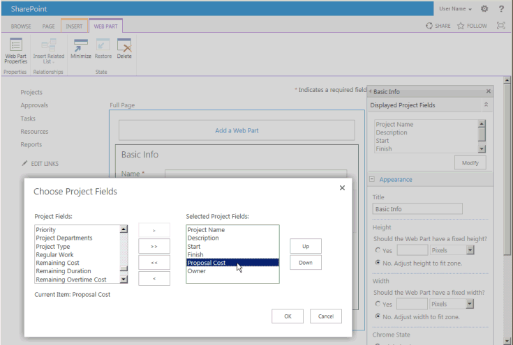
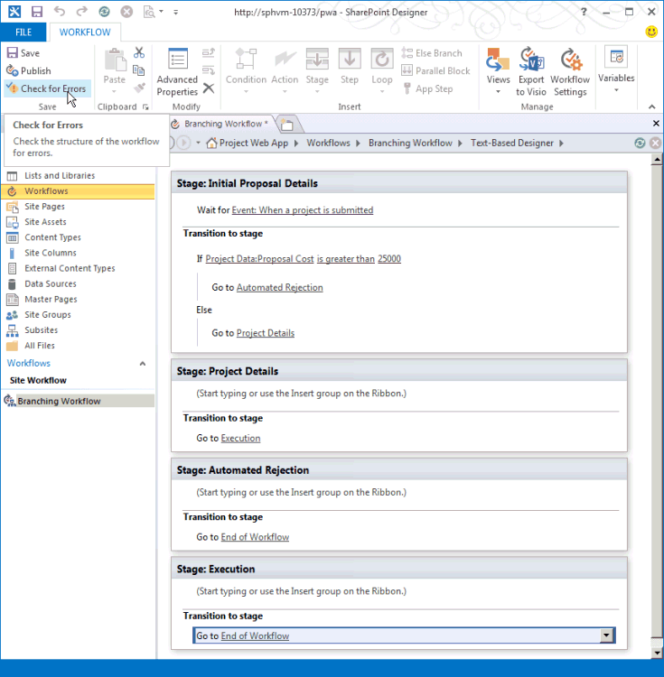
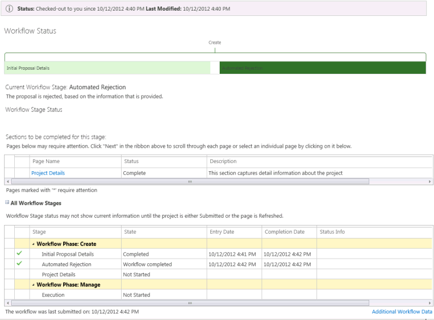

# Criar um fluxo de trabalho do Project Server para gerenciamento de demandaCreate a Project Server workflow for demand management

Este artigo descreve como criar um fluxo de trabalho simple usando o SharePoint Designer 2013.This article describes how to create a simple workflow by using SharePoint Designer 2013. Você pode exportar o fluxo de trabalho para o Visio 2013 para visualização e edição, ou use o Visio 2013 para fluxos de trabalho do Project Server 2013 de design e importar o design para o SharePoint Designer 2013 para publicação ao Project Web App.You can export the workflow to Visio 2013 for visualization and editing, or use Visio 2013 to design Project Server 2013 workflows and import the design into SharePoint Designer 2013 for publication to Project Web App. Para obter mais informações sobre a plataforma de fluxo de trabalho do SharePoint e criando fluxos de trabalho com o SharePoint Designer 2013 e o Visio 2013, consulte os artigos de [fluxos de trabalho no SharePoint 2013](http://msdn.microsoft.com/pt-br/library/jj163986%28office.15%29.aspx) na documentação do desenvolvedor do SharePoint 2013.For more information about the SharePoint workflow platform and creating workflows with Visio 2013 and SharePoint Designer 2013, see the [Workflows in SharePoint 2013](http://msdn.microsoft.com/pt-br/library/jj163986%28office.15%29.aspx) articles in the SharePoint 2013 developer documentation. 
  
Para obter informações sobre como preparar o Project Server para fluxos de trabalho, consulte [Iniciar: definida para cima e para configurar o Gerenciador de fluxo de trabalho do SharePoint 2013](http://msdn.microsoft.com/pt-br/library/jj163276%28office.15%29.aspx).For information about preparing Project Server for workflows, see [Start: Set up and configure SharePoint 2013 Workflow Manager](http://msdn.microsoft.com/pt-br/library/jj163276%28office.15%29.aspx).

## Criando um fluxo de trabalho geralCreating a general workflow

Use as etapas a seguir para criar um fluxo de trabalho do Project Server 2013 usando o SharePoint Designer 2013.Use the following steps to create a Project Server 2013 workflow by using SharePoint Designer 2013. O fluxo de trabalho foi projetado para gerenciamento de propostas de propostas de projeto.The workflow is designed for demand management of project proposals.
  
Para obter etapas detalhadas, consulte a seção [Criando um fluxo de trabalho ramificação](#pj15_CreateWorkflowSPD_Detailed) .For detailed steps, see the [Creating a branching workflow](#pj15_CreateWorkflowSPD_Detailed) section. 
  
### Para criar um fluxo de trabalho do Project Server (procedimento geral)To create a Project Server workflow (general procedure)

1. Determine os requisitos e então projete o fluxo de trabalho. Organize-o em fases e estágios e determine os campos personalizados que o fluxo de trabalho usará.Determine the requirements, and then design the workflow. Organize it into phases and stages, and determine the custom fields that the workflow will use.
    
2. No Project Web App, crie as entidades que requer que o fluxo de trabalho:In Project Web App, create the entities that the workflow requires:
    
    1. Examine as fases existentes do fluxo de trabalho; crie fases como o necessário.Review the existing workflow phases; create phases as necessary.
        
    2. Crie os campos personalizados da empresa que o fluxo de trabalho usará. Para estar disponível em um estágio do fluxo de trabalho, um campo personalizado deverá ser controlado por um fluxo de trabalho.Create the enterprise custom fields that the workflow will use. To be available in a workflow stage, a custom field must be controlled by a workflow.
        
    3. Edite ou crie as páginas de detalhes do projeto (PDPs) que os estágios do seu fluxo de trabalho usarão para coletar informações para o projeto. Neste exemplo, os estágios usarão PDPs padrão editados para incluírem um novo campo personalizado.Edit or create the project detail pages (PDPs) that your workflow stages will use to collect information for the project. In this example, the stages use default PDPs that are edited to include a new custom field.
        
    4. Crie os estágios necessários do fluxo de trabalho e então associe cada estágio de fluxo de trabalho à fase correta.Create the necessary workflow stages, and then associate each workflow stage with the correct phase.
    
3. No SharePoint Designer 2013, construa o fluxo de trabalho usando afirmações de declaração no **Designer baseado em texto**:In SharePoint Designer 2013, construct the workflow by using declarative statements in the **Text-Based Designer**:
    
    > [!NOTE]
    > Você também pode alternar para o **Visual Designer** no SharePoint Designer 2013 ou importar um fluxo de trabalho existente do Visio 2013.You can also switch to the **Visual Designer** in SharePoint Designer 2013, or import an existing workflow from Visio 2013. Siga estas etapas para usar o **Designer baseado em texto**:Follow these steps to use the **Text-Based Designer**: 
    > 
    > 1. Abra o site do Project Web App e, em seguida, crie um fluxo de trabalho de site que usa a plataforma de fluxo de trabalho do **SharePoint 2013 Workflow - Project Server** .Open the Project Web App site, and then create a site workflow that uses the **SharePoint 2013 Workflow - Project Server** workflow platform. 
    > 2. Adicione os estágios usados pelo fluxo de trabalho.Add the stages that the workflow uses.
    > 3. Insira as etapas, as condições, as ações e os loops do fluxo de trabalho necessários em cada estágio.Insert the workflow steps, conditions, actions, and loops that are required in each stage.
    > 4. Verifique se há algum erro no fluxo de trabalho e corrija os que encontrar.Check for any workflow errors and fix any that you find.
    > 5. (Opcional) Alternar o modo de exibição para o **Visual Designer**ou exportar o fluxo de trabalho para um arquivo do Visio 2013.(Optional) Switch the view to the **Visual Designer**, or export the workflow to a Visio 2013 file. Você pode modificar o modo de exibição do Visio e salvar as alterações no fluxo de trabalho atual.You can modify the Visio view and save changes to the current workflow. Você pode editar o arquivo do Visio e importá-lo no SharePoint Designer 2013 criar outros fluxos de trabalho.You can edit the Visio file and import it in SharePoint Designer 2013 to create other workflows.
    > 6. Publica o fluxo de trabalho.Publish the workflow. Depois que ele for publicado, o fluxo de trabalho mostra na lista de fluxos de trabalho para o site do Project Web App.After it is published, the workflow shows in the list of workflows for the Project Web App site.
    
4. No Project Web App, use o fluxo de trabalho para gerenciamento de propostas de propostas de projeto:In Project Web App, use the workflow for demand management of project proposals:
    
    1. Crie um modelo de projeto corporativo (EPT) que use o fluxo de trabalho.Create an enterprise project template (EPT) that uses the workflow.
        
    2. Na página Centro de Projeto, crie um projeto que use o EPT para o fluxo de trabalho e então siga os estágios do fluxo de trabalho.On the Project Center page, create a project that uses the EPT for the workflow, and then follow through the workflow stages.
        
    3. Teste o fluxo de trabalho cuidadosamente.Test the workflow thoroughly.
        
    4. Implante o fluxo de trabalho em um servidor de produção.Deploy the workflow to a production server.

## Criando um fluxo de trabalho de ramificaçãoCreating a branching workflow

Antes de poder usar o SharePoint Designer 2013 para criar um fluxo de trabalho do Project Server, o serviço de cliente do Gerenciador de fluxo de trabalho 1.0 deve ser configurado para usar as atividades de fluxo de trabalho do Project Server 2013.Before you can use SharePoint Designer 2013 to create a Project Server workflow, the Workflow Manager Client 1.0 service must be configured to use the Project Server 2013 workflow activities. Para obter informações sobre como configurar o cliente do Gerenciador de fluxo de trabalho 1.0, consulte os artigos de [fluxos de trabalho no SharePoint 2013](http://msdn.microsoft.com/pt-br/library/jj163986%28office.15%29.aspx) na documentação do desenvolvedor do SharePoint Server 2013.For information about how to configure Workflow Manager Client 1.0, see the [Workflows in SharePoint 2013](http://msdn.microsoft.com/pt-br/library/jj163986%28office.15%29.aspx) articles in the SharePoint Server 2013 developer documentation. 
  
O procedimento a seguir detalhado inclui as mesmas etapas da seção [Criando um fluxo de trabalho geral](#pj15_CreateWorkflowSPD_General) .The following detailed procedure includes the same steps as in the [Creating a general workflow](#pj15_CreateWorkflowSPD_General) section. 
  
### Para criar um fluxo de trabalho de ramificação do Project Server (procedimento detalhado)To create a Project Server branching workflow (detailed procedure)

#### 1. planejar e projetar o fluxo de trabalho.1. Plan and design the workflow.

Um fluxo de trabalho do Project Server pode se integrar com várias fases e fases em um processo de gerenciamento de demanda.A Project Server workflow can integrate with multiple stages and phases in a demand-management process. Como os fluxos de trabalho podem ser complexos, você deve entender os requisitos de negócios e planeje cuidadosamente um fluxo de trabalho.Because workflows can be complex, you must understand the business requirements and plan a workflow carefully. Para obter um exemplo simple, crie um fluxo de trabalho ramificação que usa o custo estimado de uma proposta de projeto para determinar se a proposta foi aceita.For a simple example, design a branching workflow that uses the estimated cost of a project proposal to determine whether the proposal is accepted. Se o custo estimado for maior que US $ 25.000, rejeitar a proposta; Caso contrário, aceite a proposta e criar o projeto.If the estimated cost is greater than $25,000 USD, reject the proposal; otherwise, accept the proposal and create the project.
    
Como você pode usar o Visio 2013 e SharePoint Designer 2013 para ajudar a projetar e criar fluxos de trabalho do Project Server 2013, você pode mais facilmente experiências com fluxos de trabalho que é possível com o Project Server 2010.Because you can use Visio 2013 and SharePoint Designer 2013 to help design and create workflows for Project Server 2013, you can more easily experiment with workflows than is possible with Project Server 2010. O exemplo de design de fluxo de trabalho neste artigo forem os mesmos que o artigo [criar um fluxo de trabalho ramificação](http://msdn.microsoft.com/library/a02cafdc-d881-4271-b446-d8b2cd456a52%28Office.15%29.aspx) no SDK do Project 2010.The sample workflow design in this article is the same as in the [Create a branching workflow](http://msdn.microsoft.com/library/a02cafdc-d881-4271-b446-d8b2cd456a52%28Office.15%29.aspx) article in the Project 2010 SDK. Você pode criar e criar um fluxo de trabalho de teste em um computador remoto usando uma instância de teste do Project Web App — você não precisará criar fluxos de trabalho diretamente em um computador do Project Server 2013.You can design and create a test workflow on a remote computer using a test instance of Project Web App—you do not have to create workflows directly on a Project Server 2013 computer. 
    
#### 2. Crie as entidades que requer que o fluxo de trabalho.2. Create the entities that your workflow requires.

No Project Web App, examine as fases do fluxo de trabalho disponíveis e estágios e os campos personalizados da empresa que estão disponíveis.In Project Web App, review the available workflow phases and stages, and the enterprise custom fields that are available. Se necessário, crie as entidades que requer o fluxo de trabalho, como as seguintes etapas:If necessary, create the entities that your workflow requires, as in the following steps:
    
1. **Fases do fluxo de trabalho** A instalação padrão do Project Web App inclui criar, selecionar, planejar, gerenciar e fases terminadas.**Workflow phases** The default installation of Project Web App includes the Create, Select, Plan, Manage, and Finished phases. No exemplo ramificação do fluxo de trabalho, você não precisará criar outras fases.For the branching workflow example, you do not have to create other phases. 
        
2. **Campos personalizados da empresa** O fluxo de trabalho ramificação requer um campo personalizado de custo do projeto é controlado por fluxo de trabalho.**Enterprise custom fields** The branching workflow requires a project cost custom field that is workflow-controlled. O valor de um campo personalizado controlado por fluxo de trabalho é definido em um PDP que usa o fluxo de trabalho.The value of a workflow-controlled custom field is set in a PDP that the workflow uses. Por exemplo, escolha o ícone de **configurações** no canto superior direito de uma página do Project Web App, escolha **Configurações do PWA**e escolha **campos personalizados da empresa e tabelas de pesquisa**.For example, choose the **Settings** icon at the top-right of a Project Web App page, choose **PWA Settings**, and then choose **Enterprise Custom Fields and Lookup Tables**.
        
   Criar um campo personalizado denominado custo da proposta da entidade de **projeto** e selecione o tipo de **custo**.Create a custom field named Proposal Cost for the **Project** entity, and select the type **Cost**. Para a descrição, digite o custo estimado de uma proposta de projeto.For the description, type Estimated cost of a project proposal. Na seção **comportamento** , escolha **comportamento controlado por fluxo de trabalho**.In the **Behavior** section, choose **Behavior controlled by workflow**.
        
3. **Páginas de detalhes do projeto** Editar ou criar o PDPs que usarão os estágios do fluxo de trabalho.**Project detail pages** Edit or create the PDPs that the workflow stages will use. Por exemplo, execute as seguintes etapas:For example, do the following steps: 
        
    1. Escolha as **Páginas de detalhes do projeto** na página Configurações do servidor e escolha **ProjectInformation** PDP.Choose **Project Detail Pages** on the Server Settings page, and then choose the **ProjectInformation** PDP. 
            
    2. Na guia **página** da faixa de opções, no grupo **Editar** , escolha **Editar página**.On the **PAGE** tab of the ribbon, in the **Edit** group, choose **Edit Page**.
            
    3. Escolha a seta para baixo no canto superior direito da web part **Básica Info** e escolha **Editar web part**.Choose the down arrow at the top-right of the **Basic Info** web part, and then choose **Edit web part**. Ou então, na guia **WEB PART** da faixa de opções, no grupo **Propriedades** , escolha a **web part de propriedades** para mostrar a parte de editor.Or, on the **WEB PART** tab of the ribbon, in the **Properties** group, choose **web part Properties** to show the editor part. 
            
    4. Os **Campos de projeto exibidos** seção do editor parte (consulte a Figura 1), escolha **Modificar**.In the **Displayed Project Fields** section of the editor part (see Figure 1), choose **Modify**.
            
    5. Adicione o campo personalizado de **Custo da proposta** , movê-lo acima do campo **proprietário** na lista de **Campos do projeto selecionado** e escolha **Okey** (consulte a Figura 1).Add the **Proposal Cost** custom field, move it above the **Owner** field in the **Selected Project Fields** list, and then choose **OK** (see Figure 1).
      
    6. Na parte editor, escolha **Okey**e clique em **Parar Edição** no grupo **Editar** , na guia **página** da faixa de opções.In the editor part, choose **OK**, and then choose **Stop Editing** in the **Edit** group, on the **PAGE** tab of the ribbon. A Figura 2 mostra o campo personalizado de **Custo da proposta** que é adicionado à PDP de informações do projeto.Figure 2 shows the **Proposal Cost** custom field that is added to the Project Information PDP. 

    **Figura 1. Editando a web part de campos do projeto em um PDP****Figure 1. Editing the Project Fields web part in a PDP**

    ![Editando os campos do projeto da web part em uma PDP] (media/pj15_CreateWorkflowSPD_EditPDP.gif "Editando os campos do projeto da web part em uma PDP")

    **Figura 2. O PDP editada inclui o campo personalizado de custo da proposta****Figure 2. The edited PDP includes the Proposal Cost custom field**

    ![O PDP editada inclui o campo Custo da proposta] (media/pj15_CreateWorkflowSPD_EditedPDP.gif "O PDP editada inclui o campo Custo da proposta")
  
4. **Estágios do fluxo de trabalho** Crie os estágios que são necessários para cada fase do fluxo de trabalho.**Workflow stages** Create the stages that are required for each phase of the workflow. Na página Configurações do servidor, escolha **Estágios do fluxo de trabalho**e, em seguida, escolha **Novo ESTÁGIO de fluxo de trabalho**.On the Server Settings page, choose **Workflow Stages**, and then choose **NEW WORKFLOW STAGE**. A Figura 3 mostra a parte da página Adicionar estágio de fluxo de trabalho.Figure 3 shows part of the Add Workflow Stage page.
    
    **Figura 3. A adição de um estágio de fluxo de trabalho no Project Web App****Figure 3. Adding a workflow stage in Project Web App**

    ![Adicionando um estágio de fluxo de trabalho no Project Web App] (media/pj15_CreateWorkflowSPD_AddWorkflowStage.gif "Adicionando um estágio de fluxo de trabalho no Project Web App")
  
    O exemplo de fluxo de trabalho ramificação usa os quatro estágios que são mostrados na tabela 1.The branching workflow example uses the four stages that are shown in Table 1. Na seção **Configurações adicionais para a página de detalhes do projeto visíveis** da página Adicionar estágio de fluxo de trabalho (não é mostrada na Figura 3), os valores são opcionais. eles fornecem mais informações sobre a página Status do fluxo de trabalho.In the **Additional Settings for the Visible Project Detail Page** section of the Add Workflow Stage page (not shown in Figure 3), values are optional; they provide more information on the Workflow Status page. Por exemplo, porque o PDP inicial de detalhes de proposta exigir a entrada do usuário, você pode marque a caixa de seleção **a página de detalhes do projeto precisam de atenção** e, em seguida, adicione uma descrição específica como definido no nome do projeto e custo por este PDP.For example, because the Initial Proposal Details PDP requires user input, you can select the **The Project Detail Page requires attention** check box, and then add a specific description such as Set the project name and cost for this PDP.
    
    A Figura 4 mostra os quatro estágios concluídos na página Estágios do Fluxo de Trabalho.Figure 4 shows the four stages completed on the Workflow Stages page.
    
    **Tabela 1. Estágios do fluxo de trabalho de ramificação****Table 1. Stages for the branching workflow**

    |NameName|DescriçãoDescription|Descrição para envioDescription for Submit|FasePhase|PDPs visíveisVisible PDPs|Campos PersonalizadosCustom Fields|
    |:-----|:-----|:-----|:-----|:-----|:-----|
    |Detalhes Iniciais da PropostaInitial Proposal Details    |Defina o nome e o custo do projeto.Set the project name and cost.    |Envie o projeto como uma proposta.Submit the project as a proposal.    |CriarCreate    |Informações do ProjetoProject Information    Detalhes do ProjetoProject Details    |Custo da Proposta (obrigatório)Proposal Cost (required)    |
    |Detalhes do ProjetoProject Details    |Forneça detalhes sobre o projeto proposto.Provide details of the proposed project.    |Envie detalhes para continuar com o projeto.Submit details to continue with the project.    |CriarCreate    |Informações do ProjetoProject Information    Detalhes do ProjetoProject Details    |Custo da Proposta (somente leitura)Proposal Cost (read-only)    |
    |Rejeição AutomatizadaAutomated Rejection    |A proposta é rejeitada, com base nas informações fornecidas.The proposal is rejected, based on the information that is provided.    |   |CriarCreate    |Informações do ProjetoProject Information    |Custo da Proposta (somente leitura)Proposal Cost (read-only)    |
    |ExecuçãoExecution    |A proposta é aceita e está pronta para o gerenciamento de projetos.The proposal is accepted, and ready for project management.    |   |GerenciarManage    |Informações do ProjetoProject Information    Detalhes do ProjetoProject Details    |Custo da Proposta (somente leitura)Proposal Cost (read-only)    |
   
    **Figura 4. Lista dos estágios do fluxo de trabalho no Project Web App****Figure 4. List of the workflow stages in Project Web App**

    ![Lista dos estágios do fluxo de trabalho no Project Web App] (media/pj15_CreateWorkflowSPD_WorkflowStages.gif "Lista dos estágios do fluxo de trabalho no Project Web App")
  
#### 3. construa o fluxo de trabalho no Designer baseado em texto.3. Construct the workflow in the Text-Based Designer.

No SharePoint Designer 2013, construa o fluxo de trabalho usando afirmações de declaração no Designer baseado em texto.In SharePoint Designer 2013, construct the workflow by using declarative statements in the Text-Based Designer. Você pode começar a digitar na linha de inserção laranja para obter instruções de AutoCompletar sensível ao contexto para as etapas e a lógica de fluxo de trabalho, ou você pode inserir a lógica e etapas usando os controles no grupo **Inserir** na guia **fluxo de trabalho** da faixa de opções.You can start typing at the orange insertion line to get context-sensitive auto-completion statements for the workflow logic and steps, or you can insert the logic and steps by using controls in the **Insert** group on the **WORKFLOW** tab of the ribbon. 
    
1. No modo de exibição Backstage do SharePoint Designer 2013, escolha **Abrir Site**.In the Backstage view of SharePoint Designer 2013, choose **Open Site**. Por exemplo, abrir `http://ServerName/pwa`.For example, open  `http://ServerName/pwa`. No painel de **navegação** , escolha **fluxos de trabalho**.In the **Navigation** pane, choose **Workflows**. Em seguida, na guia **fluxos de trabalho** da faixa de opções, no grupo **novo** , escolha **Site de fluxo de trabalho**.Then, on the **WORKFLOWS** tab of the ribbon, in the **New** group, choose **Site Workflow**. Nesse exemplo, nome o fluxo de trabalho de ramificação de fluxo de trabalho.For this example, name the workflow Branching Workflow. Certifique-se de que o **SharePoint 2013 Workflow - Project Server** está selecionado na lista suspensa **Tipo de plataforma** (consulte a Figura 5).Ensure that **SharePoint 2013 Workflow - Project Server** is selected in the **Platform Type** drop-down list (see Figure 5). 
    
    **Figura 5. Criando um fluxo de trabalho de site do Project Server****Figure 5. Creating a Project Server site workflow**

    ![Criando um fluxo de trabalho de site do Project Server] (media/pj15_CreateWorkflowSPD_CreateSiteWorkflow.gif "Criando um fluxo de trabalho de site do Project Server")
  
2. Selecione a guia **Ramificação fluxo de trabalho** . Em seguida, na guia **fluxo de trabalho** da faixa de opções, no grupo **Gerenciar** , na lista suspensa de **modos de exibição** , escolha **Designer baseado em texto**.Select the **Branching Workflow** tab. Then, on the **WORKFLOW** tab of the ribbon, in the **Manage** group, in the **Views** drop-down list, choose **Text-Based Designer**. Para mostrar o modo de exibição com o laranja intermitente inserção click (consulte a Figura 6), o modo de exibição de linha.To show the view with the blinking orange insertion line (see Figure 6), click within the view.
    
    **Figura 6. Usando o modo de exibição do Designer baseado em texto para o fluxo de trabalho****Figure 6. Using the Text-Based Designer view for the workflow**

    ![Usando o modo de exibição do Designer baseado em texto] (media/pj15_CreateWorkflowSPD_TextBasedDesigner.gif "Usando o modo de exibição do Designer baseado em texto")
  
3. Na exibição de **Designer baseado em texto** , adicione os estágios que usa o fluxo de trabalho.In the **Text-Based Designer** view, add the stages that the workflow uses. Na guia **fluxo de trabalho** da faixa de opções, no grupo **Inserir** , na lista suspensa **estágio** em **Create**, escolha **Inicial detalhes da proposta**.On the **WORKFLOW** tab of the ribbon, in the **Insert** group, in the **Stage** drop-down list under **Create**, choose **Initial Proposal Details**.
    
    Da mesma forma, coloque a linha de inserção laranja abaixo do **estágio: detalhes da proposta inicial** caixa e adicione os outros estágios que usa o fluxo de trabalho: **Detalhes do projeto**, **Rejeição automatizada**e **execução** (consulte a Figura 7).Similarly, place the orange insertion line below the **Stage: Initial Proposal Details** box, and add the other stages that the workflow uses: **Project Details**, **Automated Rejection**, and **Execution** (see Figure 7). 
    
    **Figura 7. Adicionando um estágio a um fluxo de trabalho no SharePoint Designer****Figure 7. Adding a stage to a workflow in SharePoint Designer**

    ![Adicionando um estágio para um fluxo de trabalho no SPD] (media/pj15_CreateWorkflowSPD_AddStageInSPD.gif "Adicionando um estágio para um fluxo de trabalho no SPD")
  
4. Adicione as etapas e a lógica do fluxo de trabalho em cada estágio:Add the workflow steps and logic within each stage: 
    
    1. No estágio **Inicial detalhes da proposta** , coloque a linha de inserção laranja na parte superior do corpo do estágio.In the **Initial Proposal Details** stage, place the orange insertion line at the top of the stage body. No grupo **Inserir** na faixa de opções, escolha a **ação**, role para baixo até **Ações do Project Web App**e escolha **aguardar evento do Project**.In the **Insert** group on the ribbon, choose **Action**, scroll down to **Project Web App Actions**, and then choose **Wait for Project Event**. Escolha **Este evento de projeto**e selecione **evento: quando um projeto é enviado** na lista suspensa.Choose **this project event**, and then select **Event: When a project is submitted** in the drop-down list. 
    
    2. Na seção de **transição para o estágio** do estágio **Inicial detalhes da proposta** , insira **se qualquer valor for igual a valor**.In the **Transition to stage** section of the **Initial Proposal Details** stage, insert **If any value equals value**. Você pode começar a digitar a instrução ou use o controle de **condição** no grupo **Inserir** na faixa de opções.You can start typing the statement or use the **Condition** control in the **Insert** group on the ribbon. 
    
    3. Escolha o primeiro controle de **valor** e clique em **fx** para mostrar a caixa de diálogo **Definir pesquisa de fluxo de trabalho** caixa (consulte a Figura 8).Choose the first **value** control, and then choose **fx** to show the **Define Workflow Lookup** dialog box (see Figure 8). Na lista suspensa de **fonte de dados** , selecione **Dados do projeto**.In the **Data source** drop-down list, select **Project Data**. Na lista suspensa **campo da fonte** , selecione **Custo da proposta**.In the **Field from source** drop-down list, select **Proposal Cost**.
    
       **Figura 8. Definir um valor de pesquisa no fluxo de trabalho****Figure 8. Defining a lookup value in the workflow**

       ![Definir um valor de pesquisa no fluxo de trabalho] (media/pj15_CreateWorkflowSPD_DefineWorkflowLookup.gif "Definir um valor de pesquisa no fluxo de trabalho")
  
    4. Conclua o `If` instrução de forma que ele mostra o seguinte: **custo de dados: proposta de projeto se for maior que 25000**Complete the  `If` statement so that it shows the following: **If Project Data:Proposal Cost is greater than 25000**
    
       > [!NOTE]
       > Como alternativa, você poderia criar uma variável de fluxo de trabalho, defina a variável como o valor do campo personalizado e, em seguida, compare a variável com um valor.Alternately, you could create a workflow variable, set the variable to the custom field value, and then compare the variable with a value. Por exemplo, na lista suspensa **Variáveis locais** na faixa de opções, crie uma variável denominada **CustoTotal** (sem espaços) do tipo **número**.For example, from the **Local Variables** drop-down list on the ribbon, create a variable named **TotalCost** (no spaces) of type **Number**. Na caixa de diálogo **Definir pesquisa de fluxo de trabalho** , selecione o **fluxo de trabalho variáveis e parâmetros** para a fonte de dados e selecione **variável: CustoTotal** do campo.In the **Define Workflow Lookup** dialog box, select **Workflow Variables and Parameters** for the data source, and then select **Variable: TotalCost** as the field. A instrução **If** seriam: **se variável: CustoTotal for maior que 25000**The **If** statement would then be: **If Variable: TotalCost is greater than 25000**
  
    5. Coloque a linha de inserção laranja dentro do `If` de filiais e inserir **Ir para um estágio** usando o controle de **ação** , no grupo **Inserir** na faixa de opções.Place the orange insertion line within the  `If` branch, and then insert **Go to a stage** by using the **Action** control, in the **Insert** group on the ribbon. Escolha o controle de lista suspensa de **um estágio** e selecione o estágio de **Rejeição automatizada** .Choose the **a stage** drop-down control and select the **Automated Rejection** stage. 
    
       Da mesma forma, no `Else` de filiais, insira a instrução **Ir para detalhes do projeto** .Similarly, in the  `Else` branch, insert the **Go to Project Details** statement. Figura 9 mostra o estágio de **Detalhes da proposta inicial** concluído.Figure 9 shows the completed **Initial Proposal Details** stage. 
    
       **Figura 9. Concluídas lógica para o estágio de detalhes da proposta inicial****Figure 9. Completed logic for the Initial Proposal Details stage**

       ![Lógica de Completed para obter detalhes de proposta inicial] (media/pj15_CreateWorkflowSPD_InitialStageLogic.gif "Lógica de Completed para obter detalhes de proposta inicial")
  
    6. No estágio **Rejeição automatizada** , a menos que você deseja pausar o fluxo de trabalho e mostrar alguns dados em um PDP, deixe a primeira seção vazia.In the **Automated Rejection** stage, unless you want to pause the workflow and show some data in a PDP, leave the first section empty. A seção de **transição para o estágio** deve conter uma transição; como não há nenhum outro estágio seguindo uma rejeição, digite Go ao final do fluxo de trabalho para a instrução.The **Transition to stage** section must contain a transition; because there is no other stage following a rejection, type Go to End of Workflow for the statement. 
    
    7. Na etapa de **Detalhes do projeto** , adicione ir para execução na seção **fazer a transição para o estágio** .In the **Project Details** stage, add Go to Execution in the **Transition to stage** section. A menos que não há dados adicionais para adicionar ou que deseja pausar o fluxo de trabalho, não é necessário aguardar um evento enviado.Unless there is additional data to add, or you want to pause the workflow, it is not necessary to wait for a submitted event. 
    
    8. O estágio de **execução** , a menos que você deseja pausar o fluxo de trabalho, deixe a seção de ação estágio vazio.In the **Execution** stage, unless you want to pause the workflow, leave the stage action section empty. Na seção de **transição para o estágio** , adicione **Vá até o final do fluxo de trabalho**.In the **Transition to stage** section, add **Go to End of Workflow**.
    
5. No grupo **Salvar** na faixa de opções, escolha **Verificar erros** para verificar se há erros de fluxo de trabalho (veja a Figura 10).In the **Save** group on the ribbon, choose **Check for Errors** to check for workflow errors (see Figure 10). Corrija quaisquer erros e escolha **Salvar**.Fix any errors, and then choose **Save**.
    
    **Figura 10. O fluxo de trabalho no SharePoint Designer se há erros de verificação****Figure 10. Checking the workflow for errors in SharePoint Designer**

    ![Verificando se há erros no fluxo de trabalho] (media/pj15_CreateWorkflowSPD_SPDCheckForErrors.gif "Verificando se há erros no fluxo de trabalho")
  
6. (Opcional) No grupo **Gerenciar** da faixa de opções, no menu suspenso de **modos de exibição** , escolha **Visual Designer**.(Optional) In the **Manage** group on the ribbon, in the **Views** drop-down menu, choose **Visual Designer**. Na Figura 11, o modo de exibição será ampliado check-out como 50%.In Figure 11, the view is zoomed out to 50%.
    
    Você pode editar os itens no fluxo de trabalho usando o Designer Visual.You can edit items in the workflow by using the Visual Designer. Por exemplo, selecione a condição **se qualquer valor for igual ao valor** , escolha o ícone de ferramenta no canto inferior esquerdo da condição e, em seguida, selecione o **valor** para mostrar as condições de comparação na caixa de diálogo **Propriedades** .For example, select the **If any value equals value** condition, choose the tool icon at the bottom-left of the condition, and then select **Value** to show the comparison conditions in the **Properties** dialog box. 
    
    **Figura 11. Usando o Visual Designer para um fluxo de trabalho****Figure 11. Using the Visual Designer for a workflow**

    ![Usando o modo de design do Visio do fluxo de trabalho] (media/pj15_CreateWorkflowSPD_SwitchView.gif "Usando o modo de design do Visio do fluxo de trabalho")
  
    Quando o fluxo de trabalho está no modo de exibição Visual Designer, para salvar o fluxo de trabalho em um arquivo do Visio 2013 (. vsdx) como um backup ou para uso posterior, você pode escolher a **Exportar para o Visio**.When the workflow is in the Visual Designer view, to save the workflow in a Visio 2013 (.vsdx) file as a backup or for later use, you can choose **Export to Visio**.
    
7. Publica o fluxo de trabalho.Publish the workflow. Quando você usa o SharePoint Designer 2013 para publicar o fluxo de trabalho para o site do Project Web App ativo, o fluxo de trabalho está registrado para o site do SharePoint ou no Windows Azure e se torna disponível no Project Web App para o novos EPTs.When you use SharePoint Designer 2013 to publish the workflow to the active Project Web App site, the workflow is registered to the SharePoint site or in Azure and becomes available within Project Web App for new EPTs.

#### 4. criar um EPT para o fluxo de trabalho e depois testar o fluxo de trabalho.4. Create an EPT for the workflow, and then test the workflow.

No Project Web App, crie um EPT para o fluxo de trabalho e depois testar o fluxo de trabalho gerando uma proposta de projeto:In Project Web App, create an EPT for the workflow, and then test the workflow by creating a project proposal:
    
1. Na página Configurações do PWA, escolha **Tipos de projeto corporativo**e, em seguida, crie um EPT denominado Test ramificação fluxo de trabalho.On the PWA Settings page, choose **Enterprise Project Types**, and then create an EPT named Test Branching Workflow. Desmarque a caixa de seleção **criar novos projetos como projetos de lista de tarefas do SharePoint** para que o Project Server manter o controle total de projetos que são criados pelo EPT.Clear the **Create new projects as SharePoint Tasks List Projects** check box so that Project Server will maintain full control of projects that are created by the EPT. Selecione **a ramificação fluxo de trabalho** na lista suspensa **Associação de fluxo de trabalho de Site** e, em seguida, selecione as **Informações do projeto** PDP na lista suspensa **Nova página do projeto** a ser a primeira página que mostra o fluxo de trabalho.Select **Branching Workflow** in the **Site Workflow Association** drop-down list, and then select the **Project Information** PDP in the **New Project Page** drop-down list to be the first page that the workflow shows. 
    
    **Figura 12. Adicionando um EPT para o fluxo de trabalho****Figure 12. Adding an EPT for the workflow**

    ![Adicionando um EPT para o fluxo de trabalho] (media/pj15_CreateWorkflowSPD_EPTs.gif "Adicionando um EPT para o fluxo de trabalho")
  
    > [!NOTE]
    > Um valor **Sim** na coluna de **Projeto de lista de tarefas do SharePoint** , na tabela de tipos de projeto corporativo se refere a um EPT que cria uma lista de tarefas do SharePoint, onde a lista de tarefas estiver visível no Project Web App, mas SharePoint mantém o controle do projeto .A **Yes** value in the **SharePoint Tasks List Project** column in the table of enterprise project types refers to an EPT that creates a SharePoint tasks list, where the tasks list is visible in Project Web App but SharePoint maintains control of the project. Para obter mais informações sobre o gerenciamento de projetos, como listas de tarefas do SharePoint, consulte [arquitetura do Project Server 2013](project-server-2013-architecture.md).For more information about managing projects as SharePoint tasks lists, see [Project Server 2013 architecture](project-server-2013-architecture.md). 
  
2. Abra a página de projetos no Project Web App e, em seguida, crie um projeto usando o novo EPT (consulte a Figura 13).Open the Projects page in Project Web App, and then create a project by using the new EPT (see Figure 13). Como **Teste ramificação fluxo de trabalho** é associado **a ramificação fluxo de trabalho**, criação do projeto é iniciado sob o controle do fluxo de trabalho.Because **Test Branching Workflow** is associated with **Branching Workflow**, project creation starts under control of the workflow.
    
    **Figura 13. Criando um projeto com o EPT de fluxo de trabalho de ramificação de teste****Figure 13. Creating a project with the Test Branching Workflow EPT**

    ![Como criar um projeto com o EPT] (media/pj15_CreateWorkflowSPD_NewProject.gif "Como criar um projeto com o EPT")
  
3. Quando o fluxo de trabalho exibe as **Informações do projeto** PDP, adicione dados para os campos do projeto.When the workflow displays the **Project Information** PDP, add data to the project fields. Por exemplo, insira um valor de **Custo da proposta** de 30000.For example, enter a **Proposal Cost** value of 30000. Versão em inglês dos EUA do Project Server altera o campo para mostrar a US $30.000 (consulte a Figura 14).The U.S. English version of Project Server changes the field to show $30,000 (see Figure 14).
    
    **Figura 14. Usando o PDP editadas de informações de projeto****Figure 14. Using the edited Project Information PDP**

    ![Usando o PDP editadas de informações de projeto] (media/pj15_CreateWorkflowSPD_NewProjectStage1.gif "Usando o PDP editadas de informações de projeto")
  
4. Na guia **projeto** da faixa de opções, no grupo de **projetos** , escolha **Salvar**.On the **PROJECT** tab of the ribbon, in the **Project** group, choose **Save**. Project Server adiciona os dados no PDP ao projeto e, em seguida, mostra a página Status do fluxo de trabalho (consulte a Figura 15).Project Server adds the data in the PDP to the project, and then shows the Workflow Status page (see Figure 15). Para ver a descrição completa do estágio inicial detalhes da proposta no diagrama de status do fluxo de trabalho, passe o ponteiro sobre o estágio do diagrama de visualização de fluxo de trabalho.To see the full description of the Initial Proposal Details stage in the workflow status diagram, hover the pointer over the stage in the workflow visualization diagram.
    
    A grade de **Todos os estágios do fluxo de trabalho** usa uma seta verde para mostrar o estágio de detalhes da proposta inicial está aguardando entrada.The **All Workflow Stages** grid uses a green arrow to show that the Initial Proposal Details stage is waiting for input. Isso ocorre porque o fluxo de trabalho aguarda de um evento de envio no estágio inicial detalhes da proposta.This is because the workflow waits for a submit event in the Initial Proposal Details stage. Se o fluxo de trabalho não aguardou para um evento de envio, você poderá escolher **próximo** do grupo de **página** para ir para a próxima PDP.If the workflow did not wait for a submit event, you could choose **Next** in the **Page** group to advance to the next PDP. 
    
    **Figura 15. Usando a página Status do fluxo de trabalho no estágio inicial detalhes da proposta****Figure 15. Using the Workflow Status page in the Initial Proposal Details stage**

    ![Página de status do fluxo de trabalho após o primeiro estágio] (media/pj15_CreateWorkflowSPD_NewProjectStage1Status.gif "Página de status do fluxo de trabalho após o primeiro estágio")
  
    O diagrama de visualização de fluxo de trabalho mostra o estágio atual em uma cor verde.The workflow visualization diagram shows the current stage in a green color. Na fase de **criar** , o estágio de detalhes da proposta inicial é o estágio atual.In the **Create** phase, the Initial Proposal Details stage is the current stage. 
    
5. Na faixa de opções, no grupo de **fluxo de trabalho** , escolha **Enviar**.On the ribbon, in the **Workflow** group, choose **Submit**.
    
    > [!TIP]
    > Se o controle de **envio** estiver desabilitado, atualize a página.If the **Submit** control is disabled, refresh the page. 
  
    Se o valor de **Custo da proposta** for maior que US $ 25.000, o fluxo de trabalho move para a etapa de rejeição automatizada.If the **Proposal Cost** value is greater than $25,000 USD, the workflow moves to the Automated Rejection stage. Figura 16 mostra o status do estágio de rejeição automatizada quando você escolhe **Enviar** novamente.Figure 16 shows the Automated Rejection stage status when you choose **Submit** again. Se o **Custo da proposta** é de US $ 25.000 ou menos, o fluxo de trabalho move para a etapa de detalhes do projeto (consulte a Figura 17).If the **Proposal Cost** is $25,000 USD or less, the workflow moves to the Project Details stage (see Figure 17). 
    
    **Figura 16. O fluxo de trabalho for concluído na etapa de rejeição automatizada****Figure 16. The workflow is completed in the Automated Rejection stage**

    ![O fluxo de trabalho está concluído em rejeição automatizada] (media/pj15_CreateWorkflowSPD_AutomatedRejectionCompleted.gif "O fluxo de trabalho está concluído em rejeição automatizada")
  
    A Figura 17 mostra outro teste com uma proposta de projeto chamada **Testar 2 - ramificação**, onde o estágio de detalhes do projeto é atual na fase de criar.Figure 17 shows another test with a project proposal named **Test 2 - Branching**, where the Project Details stage is current in the Create phase. A fase gerenciar apresentações de uma luz azul a cor, que indica a fase ainda não está ativo.The Manage phase shows in a light blue color, which indicates that phase is not yet active.
    
    **Figura 17. O fluxo de trabalho continua para o estágio de detalhes do projeto, se o custo for inferior a US $25.000****Figure 17. The workflow continues to the Project Details stage if the cost is less than $25,000**

    ![Status do fluxo de trabalho no estágio de detalhes do projeto] (media/pj15_CreateWorkflowSPD_ProjectDetailsStage.gif "Status do fluxo de trabalho no estágio de detalhes do projeto")
  
6. Se você avança para o estágio de detalhes do projeto, não há nenhum dado adicionais para adicionar na página padrão.If you advance to the Project Details stage, there is no additional data to add in the default page. Escolher **Enviar** novamente para ir para o estágio de execução (consulte a Figura 18).Choose **Submit** again to advance to the Execution stage (see Figure 18). 
    
    **Figura 18. O fluxo de trabalho está pronto para gerenciar o estágio de execução****Figure 18. The workflow is ready to manage in the Execution stage**

    ![Status do fluxo de trabalho no estágio de execução] (media/pj15_CreateWorkflowSPD_ExecutionStage.gif "Status do fluxo de trabalho no estágio de execução")
  
Na etapa de detalhes do projeto, o fluxo de trabalho não espera para um evento de envio.In the Project Details stage, the workflow does not wait for a submit event. Se o PDP de detalhes do projeto inclui campos obrigatórios adicionais, o Project Server aguardará até que você adicione dados aos campos antes de continuar com o estágio de execução.If the Project Details PDP includes additional required fields, Project Server waits until you add data to the fields before continuing to the Execution stage. Conforme definido no fluxo de trabalho ramificação, o estágio de execução também não espera até que um evento de envio.As defined in the Branching Workflow, the Execution stage also does not wait for a submit event. No estágio de execução, você pode editar o projeto como um gerente de projeto ou escolha **Fechar** na guia **projeto** da faixa de opções.In the Execution stage, you can edit the project as a project manager or choose **Close** in the **PROJECT** tab of the ribbon. Quando você escolhe **Close**, pode fazer check-in do projeto e editá-lo mais tarde ou deixe o projeto com check-out.When you choose **Close**, you can check in the project and edit it later or leave the project checked out.

O projeto de **Fluxo de trabalho ramificação** é um exemplo simples que tem apenas uma comparação de teste.The **Branching Workflow** project is a simple example that has only one comparison test. O fluxo de trabalho envolve três estágios na fase de criar e uma etapa na fase de gerenciamento do gerenciamento de propostas.The workflow involves three stages in the Create phase and one stage in the Manage phase of Demand Management. Para testar completamente um fluxo de trabalho, você deve testar todas as ramificações do fluxo de trabalho e usar valores extremos e típicos para ver se o comportamento é conforme o esperado.To thoroughly test a workflow, you should test all branches of the workflow and use extreme and typical values to see whether the behavior is as expected. 

## Importando um fluxo de trabalho do VisioImporting a workflow from Visio

Para alterar o fluxo de trabalho, você pode criar ou modificar campos personalizados controlados por fluxo de trabalho e criar ou modificar o etapas e fases do fluxo de trabalho.To change the workflow, you can create or modify workflow-controlled custom fields and create or modify workflow phases and stages. Você pode usar o SharePoint Designer 2013 para adicionar condições, ações, loops e estágios e salve republicar o fluxo de trabalho.You can use SharePoint Designer 2013 to add conditions, actions, loops, and stages, and then save and republish the workflow. Para reutilizar ou manter um backup de um fluxo de trabalho, você poderá exportá-lo em um arquivo do Visio 2013.To reuse or keep a backup of a workflow, you can export it to a Visio 2013 file. 
  
Você também pode criar ou editar o fluxo de trabalho no Visio 2013 e importe o arquivo para o SharePoint Designer 2013 para ser usado pelo Project Web App.You can also create or edit the workflow in Visio 2013 and import the file into SharePoint Designer 2013 for use by Project Web App. Para usar um fluxo de trabalho não modificado, a instância do Project Web App deve incluir propriedades de estágio de fluxo de trabalho que são os mesmos na instância do Project Web App original.To use an unmodified workflow, the Project Web App instance must include workflow stage properties that are the same as those in the original Project Web App instance. Para obter mais informações sobre como usar o Visio para ajudar a criar fluxos de trabalho, consulte o [desenvolvimento de fluxo de trabalho no SharePoint Designer 2013 e Visio 2013](http://msdn.microsoft.com/pt-br/library/jj163272%28office.15%29.aspx).For more information about using Visio to help create workflows, see [Workflow development in SharePoint Designer 2013 and Visio 2013](http://msdn.microsoft.com/pt-br/library/jj163272%28office.15%29.aspx).
  
> [!NOTE]
> Quando você importa um arquivo do Visio 2013 para uma instância diferente do Project Web App, os estágios tem diferente estágio GUIDs, mesmo se os nomes do estágio são iguais.When you import a Visio 2013 file to a different instance of Project Web App, the stages have different stage GUIDs, even if the stage names are the same. Depois de importar o fluxo de trabalho, você deve configurar as propriedades de estágio e ação para usar valores que são específicos para a instância do Project Web App.After you import the workflow, you must configure the stage and action properties to use values that are specific to the Project Web App instance. 
> 
> Se você criar um fluxo de trabalho no Visio 2013, as etapas e ações adotadas tem sem propriedades que são específicas para uma instância do Project Web App porque o Visio não se conectar ao Project Web App.If you create a workflow in Visio 2013, the stages and actions have no properties that are specific for a Project Web App instance because Visio does not connect with Project Web App. Quando você conecta o SharePoint Designer 2013 ao Project Web App, criar um fluxo de trabalho e depois importar o arquivo VSDX, substituirá o fluxo de trabalho ativo.When you connect SharePoint Designer 2013 with Project Web App, create a workflow, and then import the VSDX file, you overwrite the active workflow. Em seguida, você deve configurar as propriedades de estágio e ação para coincidir com os valores que o SharePoint Designer 2013 obtém do Project Web App.You must then configure the stage and action properties to match the values that SharePoint Designer 2013 gets from Project Web App. 
  
### Para importar um fluxo de trabalho do Visio para o SharePoint DesignerTo import a workflow from Visio to SharePoint Designer

1. No Visio 2013, crie um fluxo de trabalho simple.In Visio 2013, create a simple workflow. Por exemplo, execute as seguintes etapas:For example, do the following steps:
    
   1. Abra o Visio e, em seguida, criar um fluxo de trabalho.Open Visio, and then create a workflow. Escolha o painel de **categorias** para um novo fluxo de trabalho, escolha o **Fluxograma**, escolha o modelo de **Fluxo de trabalho do Microsoft SharePoint 2013** no painel **novo** e, em seguida, escolha **criar**.Choose the **CATEGORIES** pane for a new workflow, choose **Flowchart**, choose the **Microsoft SharePoint 2013 Workflow** template in the **New** pane, and then choose **Create**. O fluxo de trabalho é aberta com uma forma de estágio chamada **estágio 1**.The workflow opens with a Stage shape named **Stage 1**. O fluxo de trabalho inclui um componente de início e uma forma de Enter e a forma de saída como parte da forma estágio.The workflow includes a Start component, and an Enter shape and Exit shape as part of the Stage shape.
    
      Quando você passe o mouse sobre a forma de estágio e escolha o ícone de **Propriedades** , a seleção é desabilitada.When you hover over the Stage shape and choose the **Properties** icon, the selection is disabled. Você pode definir as propriedades estágio e ação depois de importar o diagrama de fluxo de trabalho para o SharePoint Designer 2013.You can set the stage and action properties after you import the workflow diagram to SharePoint Designer 2013. 
    
      > [!NOTE]
      >  Os únicos estênceis de forma que você deve usar são os seguintes na lista de formas de Fluxo de Trabalho:The only shape stencils you should use are the following in the list of Flowchart shapes: 
      > - **Ações - fluxo de trabalho do SharePoint 2013****Actions - SharePoint 2013 Workflow**
      > - **Componentes - fluxo de trabalho do SharePoint 2013****Components - SharePoint 2013 Workflow**
      > - **Condições - fluxo de trabalho do SharePoint 2013****Conditions - SharePoint 2013 Workflow**
  
   2. No painel **formas** , escolha **Formas rápidas**e arraste a forma de condição chamada **se qualquer valor for igual ao valor** à direita da forma estágio.In the **Shapes** pane, choose **Quick Shapes**, and then drag the Condition shape named **If any value equals value** to the right of the Stage shape. 
    
   3. Na guia **início** da faixa de opções, escolha a ferramenta de **conector** e conecte-se a forma de saída no estágio com a forma de condição (consulte a Figura 19).On the **HOME** tab of the ribbon, choose the **Connector** tool, and then connect the Exit shape on the stage with the Condition shape (see Figure 19). 
    
      **Figura 19. Conectando uma forma de estágio com uma forma de condição em um diagrama de fluxo de trabalho do Visio****Figure 19. Connecting a Stage shape with a Condition shape in a Visio workflow diagram**

      ![Criando um diagrama de fluxo de trabalho no Visio] (media/pj15_CreateWorkflowSPD_NewVisioWorkflow.gif "Criando um diagrama de fluxo de trabalho no Visio")
  
   4. Arraste duas formas de estágio mais à direita da forma condição.Drag two more Stage shapes to the right of the condition shape. As formas são denominadas **estágio 2** e **3 do estágio**.The shapes are named **Stage 2** and **Stage 3**.
    
   5. Usando a ferramenta de **conector** , conecte-se à direita da forma condição à forma do **estágio 2**Enter.Using the **Connector** tool, connect the right side of the Condition shape to the Enter shape of **Stage 2**. Escolha a ferramenta **ponteiro** , clique duas vezes a conexão para mostrar uma caixa de texto para o nome e depois nomeie a conexão Sim.Choose the **Pointer** tool, double-click the connection to show a textbox for the name, and then name the connection Yes.
    
   6. Conecte-se a parte inferior da forma condição à forma de **estágio 3**Enter.Connect the bottom of the Condition shape to the Enter shape of **Stage 3**. Com a ferramenta **ponteiro** , com o botão direito a conexão e, em seguida, escolha **não**.With the **Pointer** tool, right-click the connection, and then choose **No**. Um dos métodos funciona para nomear os conectores **Sim** ou **não**.Either method works for naming the connectors **Yes** or **No**.
    
   7. No painel **formas** , escolha **ações - fluxo de trabalho do SharePoint 2013**e arraste a ação de **aguardar o evento de projeto** para o meio da forma para **estágio 1** (consulte a Figura 20).In the **Shapes** pane, choose **Actions - SharePoint 2013 Workflow**, and then drag the **Wait for project event** action to the middle of the shape for **Stage 1** (see Figure 20). 
    
      **Figura 20. Concluir o fluxo de trabalho no Visio****Figure 20. Completing the workflow in Visio**

      ![Concluir o fluxo de trabalho no Visio] (media/pj15_CreateWorkflowSPD_CompletedVisioWorkflow.gif "Concluir o fluxo de trabalho no Visio")
  
   8. Na guia **processo** da faixa de opções, no grupo de **Validação de diagrama** , escolha **Verificar diagrama**.On the **PROCESS** tab of the ribbon, in the **Diagram Validation** group, choose **Check Diagram**. Corrija quaisquer erros e salve o desenho.Fix any errors, and then save the drawing. Por exemplo, nome o fluxo de trabalho de teste de arquivo de Visio.vsdx.For example, name the file Test workflow from Visio.vsdx.
    
      Para obter informações sobre como corrigir erros de fluxo de trabalho, consulte os [erros de validação de fluxo de trabalho de solução de problemas do SharePoint Server 2013 no Visio 2013](http://msdn.microsoft.com/pt-br/library/jj163971%28v=office.15%29.aspx).For information about fixing workflow errors, see [Troubleshooting SharePoint Server 2013 workflow validation errors in Visio 2013](http://msdn.microsoft.com/pt-br/library/jj163971%28v=office.15%29.aspx).
    
2. Abra o SharePoint Designer 2013 e em seguida, abra o site do Project Web App mesmo que você usou para o exemplo de **Fluxo de trabalho ramificação** .Open SharePoint Designer 2013, and then open the same Project Web App site that you used for the **Branching Workflow** example. 
    
3. Escolha os **fluxos de trabalho** no painel de **navegação** e, em seguida, criar um fluxo de trabalho de site (escolha **Fluxo de trabalho de Site** , na guia **fluxos de trabalho** da faixa de opções).Choose **Workflows** in the **Navigation** pane, and then create a site workflow (choose **Site Workflow** on the **WORKFLOWS** tab of the ribbon). Por exemplo, nome o fluxo de trabalho simples de fluxo de trabalho do Visio.For example, name the workflow Simple workflow from Visio.
    
   Na caixa de diálogo **Criar fluxo de trabalho de Site** , certifique-se de que o tipo de plataforma é o **SharePoint 2013 Workflow - Project Server**.In the **Create Site Workflow** dialog box, ensure that the platform type is **SharePoint 2013 Workflow - Project Server**. Escolha **criar**e SharePoint Designer abre o painel de **Designer baseado em texto** para o novo fluxo de trabalho.Choose **Create**, and SharePoint Designer opens the **Text-Based Designer** pane for the new workflow. 
    
4. No grupo **Gerenciar** na guia **fluxo de trabalho** da faixa de opções, escolha **Configurações de fluxo de trabalho**.In the **Manage** group on the **WORKFLOW** tab of the ribbon, choose **Workflow Settings**.
    
5. No grupo **Gerenciar** , na guia **Configurações de fluxo de trabalho** da faixa de opções, escolha **Importar do Visio**e importe o arquivo de **fluxo de trabalho de teste de Visio.vsdx** salvo anteriormente.In the **Manage** group on the **WORKFLOW SETTINGS** tab of the ribbon, choose **Import from Visio**, and then import the **Test workflow from Visio.vsdx** file that you previously saved. Uma caixa de diálogo do **Microsoft SharePoint Designer** avisa que o diagrama que você está importando contiver sem propriedades do fluxo de trabalho e perguntando se você deseja substituir o fluxo de trabalho atual.A **Microsoft SharePoint Designer** dialog box warns that the diagram you are importing contains no workflow properties, and asks whether to overwrite the current workflow. Escolha **Sim**. SharePoint Designer importa o diagrama de fluxo de trabalho, gera estênceis para as formas e exibe o painel **Visual Designer** que contém o fluxo de trabalho importado.Choose **Yes**; SharePoint Designer imports the workflow diagram, generates stencils for the shapes, and displays the **Visual Designer** pane that contains the imported workflow. 
    
6. Defina as propriedades de cada forma do estágio do fluxo de trabalho.Set the properties of each stage shape in the workflow. Por exemplo, a primeira forma do estágio é nomeada **estágio 1 (inválido)**, porque ela não representa um estágio válido na instância do Project Web App conectada.For example, the first stage shape is named **Stage 1 (Invalid)**, because it does not represent a valid stage in the connected Project Web App instance. Quando você seleciona ou passe o mouse sobre o estágio, você pode escolher o ícone de **Propriedades** no canto inferior esquerdo da forma estágio para mostrar a caixa de diálogo **Propriedades do estágio** caixa (consulte a Figura 21).When you select or hover over the stage, you can choose the **Properties** icon at the lower left of the stage shape to show the **Stage Properties** dialog box (see Figure 21). Selecione o estágio de **Detalhes da proposta inicial** na lista suspensa **Estágio do projeto** e escolha **Okey**.Select the **Initial Proposal Details** stage in the **Project Stage** drop-down list, and then choose **OK**. SharePoint Designer renomeia o estágio.SharePoint Designer renames the stage.
    
   **Figura 21. A definição da propriedade stage no SharePoint Designer****Figure 21. Setting the stage property in SharePoint Designer**

   ![Definindo propriedades em um fluxo de trabalho importada] (media/pj15_CreateWorkflowSPD_ImportFromVisio1.gif "Definindo propriedades em um fluxo de trabalho importada")
  
   Para o segundo estágio, defina a propriedade do **Estágio do projeto** para **Rejeição automatizada**.For the second stage, set the **Project Stage** property to **Automated Rejection**. Para a terceira fase, defina a propriedade do **Estágio do projeto** para **a execução**.For the third stage, set the **Project Stage** property to **Execution**.
    
7. Da mesma forma, para a ação de **aguardar o evento de projeto** , defina a propriedade de **Nome do evento** como **evento: quando um projeto é enviado**.Similarly, for the **Wait for project event** action, set the **Event Name** property to **Event: When a project is submitted**.
    
8. Da mesma forma, defina as propriedades da condição **se qualquer valor for igual a valor** .Similarly, set the properties of the **If any value equals value** condition. Por exemplo, defina a propriedade **Value** primeira ao **Custo de dados: proposta de projeto**.For example, set the first **Value** property to **Project Data:Proposal Cost**. Defina a propriedade **Operator** como **é menor que**.Set the **Operator** property to **is less than**. Defina a propriedade **Value** segunda para 5000.Set the second **Value** property to 5000.
    
9. Verifique o fluxo de trabalho para erros e salve o fluxo de trabalho.Check the workflow for errors, and then save the workflow. Se não houver nenhum erro, você pode alterar o modo de exibição para o **Designer baseado em texto** (consulte a Figura 22).If there are no errors, you can change the view to the **Text-Based Designer** (see Figure 22). 
    
   **Figura 22. Exibindo o fluxo de trabalho importado no Designer baseado em texto****Figure 22. Viewing the imported workflow in the Text-Based Designer**

   ![Exibindo o fluxo de trabalho importado] (media/pj15_CreateWorkflowSPD_WorkflowFromVisio.gif "Exibindo o fluxo de trabalho importado")
  
10. Publique o fluxo de trabalho. Se você salvar o fluxo de trabalho mas não publicá-lo, o fluxo de trabalho não estará disponível quando você criar um tipo de projeto corporativo.Publish the workflow. If you save the workflow but do not publish it, the workflow will not be available when you create an enterprise project type.
    
11. Para testar o **fluxo de trabalho Simple do Visio** de importadas no Project Web App, crie um EPT que usa o fluxo de trabalho e, em seguida, criar projetos que usam o EPT novo, como fez para o exemplo de **Fluxo de trabalho ramificação** .To test the imported **Simple workflow from Visio** in Project Web App, create an EPT that uses the workflow, and then create projects that use the new EPT as you did for the **Branching Workflow** example. Nesse caso, entretanto, os projetos que são menores que o custo de US $5.000 são rejeitados.In this case, however, projects that are less than $5,000 cost are rejected. 
    
Seguir as etapas neste artigo, você criou e testado um fluxo de trabalho ramificação simple usando o SharePoint Designer 2013 para definir diretamente os estágios, condições e ações que usa o fluxo de trabalho.In working through this article, you created and tested a simple branching workflow by using SharePoint Designer 2013 to directly set the stages, conditions, and actions that the workflow uses. Você também criou um diagrama para um fluxo de trabalho ramificação ainda mais simples usando o Visio 2013.You also created a diagram for an even simpler branching workflow by using Visio 2013. Você importado o diagrama de fluxo de trabalho do Visio no SharePoint Designer 2013, onde você pode definir as propriedades de cada estágio, a condição e a ação da conexão com o Project Web App.You imported the Visio workflow diagram into SharePoint Designer 2013, where you set the properties of each stage, condition, and action from the connection with Project Web App.
  
Visio 2013 e SharePoint Designer juntos oferecem maneiras convenientes para designers, gerentes de projeto, os desenvolvedores de fluxo de trabalho e testadores criar, compartilhar e personalizar designs de fluxo de trabalho para instalações diferentes do Project Server 2013 e Project Online.Visio 2013 and SharePoint Designer together provide convenient ways for designers, project managers, workflow developers, and testers to create, share, and customize workflow designs for different installations of Project Server 2013 and Project Online. Para fluxos de trabalho que exigem acesso programático para o Project Server que o SharePoint Designer não fornece, você pode usar o Visual Studio 2012 com o modelo de objeto do cliente (CSOM).For workflows that require programmatic access to Project Server that SharePoint Designer does not provide, you can use Visual Studio 2012 with the client-side object model (CSOM).
  
## Confira tambémSee also

- [Arquitetura do Project Server 2013Project Server 2013 architecture](project-server-2013-architecture.md)
- [Início: Instalar e configurar o Gerenciador de fluxo de trabalho do SharePoint 2013Start: Set up and configure SharePoint 2013 Workflow Manager](http://msdn.microsoft.com/pt-br/library/jj163276%28office.15%29.aspx)
- [Noções básicas sobre como empacotar e implantar um fluxo de trabalho no SharePoint 2013Understanding how to package and deploy workflow in SharePoint 2013](http://msdn.microsoft.com/pt-br/library/jj819316%28office.15%29.aspx)
- [Fluxos de trabalho no SharePoint 2013Workflows in SharePoint 2013](http://msdn.microsoft.com/pt-br/library/jj163986%28office.15%29.aspx)
- [Desenvolvimento de fluxo de trabalho no SharePoint Designer 2013 e Visio 2013Workflow development in SharePoint Designer 2013 and Visio 2013](http://msdn.microsoft.com/pt-br/library/jj163272%28office.15%29.aspx)
- [Solucionando problemas de erros de validação de fluxo de trabalho do SharePoint Server 2013 no Visio 2013Troubleshooting SharePoint Server 2013 workflow validation errors in Visio 2013](http://msdn.microsoft.com/pt-br/library/jj163971%28v=office.15%29.aspx)
- [Gerenciamento de demanda e fluxo de trabalhoWorkflow and Demand Management](http://msdn.microsoft.com/library/cf7433a3-a531-4467-ac0c-df0c5d6881ae%28Office.15%29.aspx)

