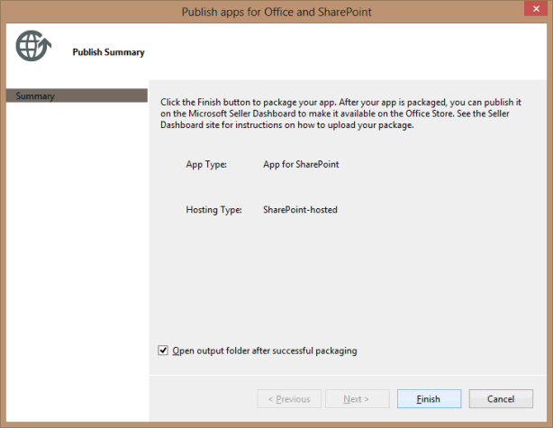
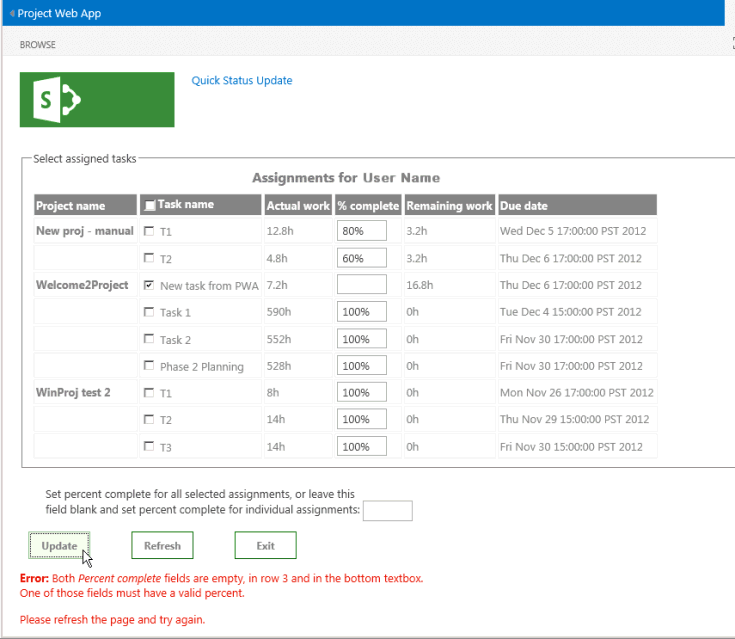

# <a name="create-a-sharepoint-hosted-project-server-add-in"></a><span data-ttu-id="fe434-103">Criar um suplemento do Project Server hospedado pelo SharePoint</span><span class="sxs-lookup"><span data-stu-id="fe434-103">Create a SharePoint-hosted Project Server add-in</span></span>

<span data-ttu-id="fe434-104">Dos três tipos de aplicativos que você pode criar para o Project Online (auto-hospedado, hospedado em provedor e hospedado no SharePoint), o aplicativo hospedado no SharePoint é o mais simples criar e implantar.</span><span class="sxs-lookup"><span data-stu-id="fe434-104">Of the three types of apps that you can create for Project Online (autohosted, provider-hosted, and SharePoint-hosted), the SharePoint-hosted app is the simplest to create and deploy.</span></span> <span data-ttu-id="fe434-105">Um aplicativo hospedado no SharePoint não exige a autenticação OAuth e não usar o Azure ou necessitam de manutenção de um site local para os recursos hospedados pelo provedor.</span><span class="sxs-lookup"><span data-stu-id="fe434-105">A SharePoint-hosted app does not require OAuth authentication, and does not use Azure or require maintenance of a local site for the provider-hosted resources.</span></span> <span data-ttu-id="fe434-106">O modelo de **aplicativo para o SharePoint 2013** no Visual Studio é uma estrutura conveniente para desenvolver aplicativos que podem ser publicados e vendidos no Office Store ou implantados em um catálogo de aplicativos privado no SharePoint.</span><span class="sxs-lookup"><span data-stu-id="fe434-106">The **App for SharePoint 2013** template in Visual Studio is a convenient framework for developing apps that can be published and sold in the Office Store or deployed to a private app catalog on SharePoint.</span></span> 
  
<span data-ttu-id="fe434-107">No Project, o status é um processo em que um membro da equipe pode usar a página de tarefas no Project Web App para enviar o status de uma tarefa atribuída, como o número de horas trabalhadas cada dia da semana gasto trabalhando na tarefa.</span><span class="sxs-lookup"><span data-stu-id="fe434-107">In Project, statusing is a process where a team member can use the Tasks page in Project Web App to submit the status of an assigned task, such as the number of hours worked each day of a week spent working on the task.</span></span> <span data-ttu-id="fe434-108">O proprietário da atribuição (geralmente, o gerente de projeto) pode aprovar ou rejeitar o status.</span><span class="sxs-lookup"><span data-stu-id="fe434-108">The assignment owner (usually the project manager) can approve or reject the status.</span></span> <span data-ttu-id="fe434-109">Quando o status for aprovado, o Project recalcula o agendamento.</span><span class="sxs-lookup"><span data-stu-id="fe434-109">When the status is approved, Project recalculates the schedule.</span></span> <span data-ttu-id="fe434-110">O aplicativo **QuickStatus** exibe as tarefas atribuídas, onde o usuário pode rapidamente Atualizar porcentagem concluída e enviar o status das atribuições selecionadas para aprovação.</span><span class="sxs-lookup"><span data-stu-id="fe434-110">The **QuickStatus** app displays assigned tasks, where the user can quickly update percent complete and submit status of the selected assignments for approval.</span></span> <span data-ttu-id="fe434-111">Embora a página de tarefas no Project Web App tem muito mais funcionalidade, o aplicativo **QuickStatus** é um exemplo que fornece uma interface simplificada.</span><span class="sxs-lookup"><span data-stu-id="fe434-111">Although the Tasks page in Project Web App has much more functionality, the **QuickStatus** app is an example that provides a simplified interface.</span></span> 
  
<span data-ttu-id="fe434-112">O aplicativo **QuickStatus** é um exemplo para desenvolvedores; ele não é projetado para uso em um ambiente de produção.</span><span class="sxs-lookup"><span data-stu-id="fe434-112">The **QuickStatus** app is a sample for developers; it is not intended for use in a production environment.</span></span> <span data-ttu-id="fe434-113">O objetivo principal é mostrar um exemplo de desenvolvimento de aplicativos para o Project Online, não para criar um aplicativo do status totalmente funcional.</span><span class="sxs-lookup"><span data-stu-id="fe434-113">The primary purpose is to show an example of app development for Project Online, not to create a fully functional statusing app.</span></span> <span data-ttu-id="fe434-114">Para uma melhor abordagem status, consulte a recomendação da [próximas etapas](#pj15_StatusingApp_NextSteps).</span><span class="sxs-lookup"><span data-stu-id="fe434-114">For a better approach to statusing, see the recommendation in [Next steps](#pj15_StatusingApp_NextSteps).</span></span>
  
<span data-ttu-id="fe434-115">Para obter informações gerais sobre o status, consulte o [andamento da tarefa](https://support.office.com/article/Find-information-about-Project-Server-2013-8b08a414-15a7-4076-b2db-c90d0214ea7f?ui=en-US&rs=en-US&ad=US#BKMK_TaskProgress).</span><span class="sxs-lookup"><span data-stu-id="fe434-115">For general information about statusing, see [Task progress](https://support.office.com/article/Find-information-about-Project-Server-2013-8b08a414-15a7-4076-b2db-c90d0214ea7f?ui=en-US&rs=en-US&ad=US#BKMK_TaskProgress).</span></span> <span data-ttu-id="fe434-116">Para obter mais informações sobre como desenvolver suplementos para o SharePoint e do Project Server, consulte [Add-ins do SharePoint](http://msdn.microsoft.com/en-us/library/jj163230.aspx).</span><span class="sxs-lookup"><span data-stu-id="fe434-116">For more information about developing add-ins for SharePoint and Project Server, see [SharePoint Add-ins](http://msdn.microsoft.com/en-us/library/jj163230.aspx).</span></span>

<span data-ttu-id="fe434-117"><a name="pj15_StatusingApp_Prerequisites"> </a></span><span class="sxs-lookup"><span data-stu-id="fe434-117"></span></span>

## <a name="prerequisites-for-creating-an-app-for-project-server-2013"></a><span data-ttu-id="fe434-118">Pré-requisitos para a criação de um aplicativo para o Project Server 2013</span><span class="sxs-lookup"><span data-stu-id="fe434-118">Prerequisites for creating an app for Project Server 2013</span></span>

<span data-ttu-id="fe434-119">Para desenvolver aplicativos relativamente simples que podem ser implantados com o Project Online ou em uma instalação local do Project Server 2013, você pode usar o Napa, que fornecem um ambiente de desenvolvimento on-line.</span><span class="sxs-lookup"><span data-stu-id="fe434-119">To develop relatively simple apps that can be deployed to Project Online or to an on-premises installation of Project Server 2013, you can use the Napa, which provide an online development environment.</span></span> <span data-ttu-id="fe434-120">Para aplicativos mais complexos, modificando a faixa de opções do Project Web App e facilitar a depuração durante o desenvolvimento, você pode usar o Visual Studio 2012 ou Visual Studio 2013.</span><span class="sxs-lookup"><span data-stu-id="fe434-120">For more complex apps, modifying the Project Web App ribbon, and easier debugging during development, you can use Visual Studio 2012 or Visual Studio 2013.</span></span> <span data-ttu-id="fe434-121">Por exemplo, com uma instalação local, você pode verificar manualmente as tabelas de dados de rascunhos para que as alterações do banco de dados do Project Server.</span><span class="sxs-lookup"><span data-stu-id="fe434-121">For example, with an on-premises installation, you can manually check the Drafts datatables for changes in the Project Server database.</span></span> <span data-ttu-id="fe434-122">Este artigo mostra como fazer o desenvolvimento de aplicativos com o Visual Studio.</span><span class="sxs-lookup"><span data-stu-id="fe434-122">This article shows how to do app development with Visual Studio.</span></span>
  
<span data-ttu-id="fe434-123">O desenvolvimento de aplicativos do Project Server com o Visual Studio exige o seguinte:</span><span class="sxs-lookup"><span data-stu-id="fe434-123">Development of Project Server apps with Visual Studio requires the following:</span></span>
  
- <span data-ttu-id="fe434-p106">Verifique se você instalou os service packs e as atualizações mais recentes do Windows em seu computador de desenvolvimento local. O sistema operacional pode ser Windows 7, Windows 8, Windows Server 2008 ou Windows Server 2012.</span><span class="sxs-lookup"><span data-stu-id="fe434-p106">Ensure that you have installed the most recent service packs and Windows updates on your local development computer. The operating system can be Windows 7, Windows 8, Windows Server 2008, or Windows Server 2012.</span></span>
    
- <span data-ttu-id="fe434-126">Você deve ter um computador que tenha o SharePoint Server 2013 e Project Server 2013 estiver instalado, onde o computador está configurado para o isolamento de aplicativo e sideloading de aplicativos.</span><span class="sxs-lookup"><span data-stu-id="fe434-126">You must have a computer that has SharePoint Server 2013 and Project Server 2013 installed, where the computer is configured for app isolation and sideloading of apps.</span></span> <span data-ttu-id="fe434-127">Sideloading permite que o Visual Studio para instalar temporariamente o aplicativo para depuração.</span><span class="sxs-lookup"><span data-stu-id="fe434-127">Sideloading enables Visual Studio to temporarily install the app for debugging.</span></span> <span data-ttu-id="fe434-128">Você pode usar uma instalação local do SharePoint e do Project Server.</span><span class="sxs-lookup"><span data-stu-id="fe434-128">You can use an on-premises installation of SharePoint and Project Server.</span></span> <span data-ttu-id="fe434-129">Para obter mais informações, consulte [Configurar um ambiente de desenvolvimento locais para aplicativos do SharePoint](http://msdn.microsoft.com/en-us/library/fp179923%28Office.15%29.aspx).</span><span class="sxs-lookup"><span data-stu-id="fe434-129">For more information, see [Set up an on-premises development environment for apps for SharePoint](http://msdn.microsoft.com/en-us/library/fp179923%28Office.15%29.aspx).</span></span>
    
   > [!NOTE]
   > <span data-ttu-id="fe434-130">Para uma instalação local, configure um aplicativo isolado domínio *antes de* criar um catálogo de aplicativos corporativos.</span><span class="sxs-lookup"><span data-stu-id="fe434-130">For an on-premises installation, configure an isolated app domain  *before*  you create a corporate app catalog.</span></span> 
  
- <span data-ttu-id="fe434-131">O computador de desenvolvimento pode ser um computador remoto que tenha o Office Developer Tools para Visual Studio 2012 instalado.</span><span class="sxs-lookup"><span data-stu-id="fe434-131">The development computer can be a remote computer that has Office Developer Tools for Visual Studio 2012 installed.</span></span> <span data-ttu-id="fe434-132">Certifique-se de que você tenha instalado a versão mais recente; Consulte a seção de *Ferramentas* dos [downloads de aplicativos para Office e SharePoint](http://msdn.microsoft.com/en-us/office/apps/fp123627.aspx).</span><span class="sxs-lookup"><span data-stu-id="fe434-132">Ensure that you have installed the most recent version; see the  *Tools*  section of the [Apps for Office and SharePoint downloads](http://msdn.microsoft.com/en-us/office/apps/fp123627.aspx).</span></span>
    
- <span data-ttu-id="fe434-133">Verifique se a instância do Project Web App será utilizada para o desenvolvimento e teste pode ser acessado no navegador.</span><span class="sxs-lookup"><span data-stu-id="fe434-133">Verify that the Project Web App instance you will be using for development and testing is accessible in the browser.</span></span>
    
<span data-ttu-id="fe434-134">Para obter informações sobre como usar as ferramentas online, consulte [Configurar um ambiente de desenvolvimento de aplicativos para SharePoint no Office 365](http://msdn.microsoft.com/en-us/library/fp161179.aspx).</span><span class="sxs-lookup"><span data-stu-id="fe434-134">For information about using the online tools, see [Set up an environment for developing apps for SharePoint on Office 365](http://msdn.microsoft.com/en-us/library/fp161179.aspx).</span></span> <span data-ttu-id="fe434-135">Um passo a passo da criação de um aplicativo simple para o Project Server que usa as ferramentas online, consulte a série de blogs EPMSource, [Criando seu primeiro aplicativo do Project Server](http://epmsource.com/2012/11/20/building-your-first-project-server-app-part-zerothe-introduction/).</span><span class="sxs-lookup"><span data-stu-id="fe434-135">For a walkthrough of building a simple app for Project Server that uses the online tools, see the EPMSource blog series, [Building your first Project Server app](http://epmsource.com/2012/11/20/building-your-first-project-server-app-part-zerothe-introduction/).</span></span>

<span data-ttu-id="fe434-136"><a name="pj15_StatusingApp_UsingVisualStudio"> </a></span><span class="sxs-lookup"><span data-stu-id="fe434-136"></span></span>

## <a name="using-visual-studio-to-create-a-project-server-app"></a><span data-ttu-id="fe434-137">Usando o Visual Studio para criar um aplicativo do Project Server</span><span class="sxs-lookup"><span data-stu-id="fe434-137">Using Visual Studio to create a Project Server app</span></span>

<span data-ttu-id="fe434-138">Office Developer Tools para Visual Studio 2012 inclui um modelo para aplicativos do SharePoint que pode ser usado com o Project Server 2013.</span><span class="sxs-lookup"><span data-stu-id="fe434-138">Office Developer Tools for Visual Studio 2012 includes a template for SharePoint apps that can be used with Project Server 2013.</span></span> <span data-ttu-id="fe434-139">Quando você cria uma solução de aplicativo, a solução inclui os seguintes arquivos para o seu código personalizado:</span><span class="sxs-lookup"><span data-stu-id="fe434-139">When you create an app solution, the solution includes the following files for your custom code:</span></span>
  
- <span data-ttu-id="fe434-p111">**AppManifest.xml** inclui configurações para o título do aplicativo, o escopo da solicitação de permissão e outras propriedades. O Procedimento 1 inclui etapas para a definição das propriedades usando o Designer de Manifesto.</span><span class="sxs-lookup"><span data-stu-id="fe434-p111">**AppManifest.xml** includes settings for the app title, permission request scope, and other properties. Procedure 1 includes steps to set the properties by using the Manifest Designer.</span></span> 
    
- <span data-ttu-id="fe434-p112">**Default.aspx** na pasta Páginas é a página principal do aplicativo. O Procedimento 2 mostra como adicionar conteúdo HTML5 para o aplicativo **QuickStatus**.</span><span class="sxs-lookup"><span data-stu-id="fe434-p112">**Default.aspx** in the Pages folder is the main page of the app. Procedure 2 shows how to add HTML5 content for the **QuickStatus** app.</span></span> 
    
- <span data-ttu-id="fe434-144">**App.js** na pasta Scripts é o arquivo principal para o código JavaScript personalizado.</span><span class="sxs-lookup"><span data-stu-id="fe434-144">**App.js** in the Scripts folder is the primary file for the custom JavaScript code.</span></span> <span data-ttu-id="fe434-145">3 do procedimento explica o código JavaScript para o aplicativo **QuickStatus** .</span><span class="sxs-lookup"><span data-stu-id="fe434-145">Procedure 3 explains the JavaScript code for the **QuickStatus** app.</span></span> 
    
   <span data-ttu-id="fe434-146">Se você adicionar controles comerciais como uma grade baseado em jQuery ou selecionador de data, você pode adicionar referências a arquivos JavaScript adicionais no arquivo default. aspx.</span><span class="sxs-lookup"><span data-stu-id="fe434-146">If you add commercial controls such as a jQuery-based grid or date picker, you can add references to additional JavaScript files in the Default.aspx file.</span></span>
    
- <span data-ttu-id="fe434-p114">**App.css** na pasta Conteúdo é o arquivo principal para estilos CSS3 personalizados. O Procedimento 2 e o Procedimento 3 incluem informações sobre CSS (folhas de estilo em cascata) para o aplicativo **QuickStatus**. Você pode adicionar referências a arquivos CSS adicionais no arquivo Default.aspx.</span><span class="sxs-lookup"><span data-stu-id="fe434-p114">**App.css** in the Content folder is the primary file for custom CSS3 styles. Procedure 2 and Procedure 3 include information about cascading style sheets (CSS) styles for the **QuickStatus** app. You can add references to additional CSS files in the Default.aspx file.</span></span> 
    
- <span data-ttu-id="fe434-150">**AppIcon.png** na pasta de imagens é o ícone de 96 x 96 que o aplicativo exibe no Office Store ou o catálogo de aplicativos.</span><span class="sxs-lookup"><span data-stu-id="fe434-150">**AppIcon.png** in the Images folder is the 96 x 96 icon that the app displays in the Office Store or the app catalog.</span></span> 
    
<span data-ttu-id="fe434-151">Para modificar a faixa de opções do Project Web App, você pode adicionar uma ação personalizada da faixa de opções.</span><span class="sxs-lookup"><span data-stu-id="fe434-151">To modify the Project Web App ribbon, you can add a ribbon custom action.</span></span> <span data-ttu-id="fe434-152">A seção de [exemplo de código para o aplicativo QuickStatus](#pj15_StatusingApp_Example) inclui o código completo para os arquivos default. aspx, App.js, App.css, Elements. XML e AppManifest.xml modificados.</span><span class="sxs-lookup"><span data-stu-id="fe434-152">The [Example code for the QuickStatus app](#pj15_StatusingApp_Example) section includes the complete code for the modified Default.aspx, App.js, App.css, Elements.xml, and AppManifest.xml files.</span></span> 
  
### <a name="procedure-1-to-create-an-app-project-in-visual-studio"></a><span data-ttu-id="fe434-p116">Procedimento 1. Para criar um projeto de aplicativo no Visual Studio</span><span class="sxs-lookup"><span data-stu-id="fe434-p116">Procedure 1. To create an app project in Visual Studio</span></span>

1. <span data-ttu-id="fe434-155">Execute o Visual Studio 2012 como administrador e, em seguida, selecione **Novo projeto** na página inicial.</span><span class="sxs-lookup"><span data-stu-id="fe434-155">Run Visual Studio 2012 as an administrator, and then select **New Project** on the Start page.</span></span> 
    
2. <span data-ttu-id="fe434-p117">Na caixa de diálogo **Novo Projeto**, expanda os nós **Modelos**, **Visual C#** e **Office/SharePoint** e então selecione **Aplicativos**. Use o **.NET Framework 4.5** padrão na lista suspensa da estrutura de destino na parte superior do painel central e então selecione **Aplicativo para o SharePoint 2013** (consulte a Figura 1).</span><span class="sxs-lookup"><span data-stu-id="fe434-p117">In the **New Project** dialog box, expand the **Templates**, **Visual C#**, and **Office/SharePoint** nodes, and then select **Apps**. Use the default **.NET Framework 4.5** in the target framework drop-down list at the top of the center pane, and then select **App for SharePoint 2013** (see Figure 1).</span></span> 
    
3. <span data-ttu-id="fe434-158">No campo **nome** , digite QuickStatus, navegue até o local onde deseja salvar o aplicativo e escolha **Okey**.</span><span class="sxs-lookup"><span data-stu-id="fe434-158">In the **Name** field, type QuickStatus, browse to the location where you want to save the app, and then choose **OK**.</span></span>
    
   <span data-ttu-id="fe434-159">**Figura 1. Criando um aplicativo do Project Server no Visual Studio**</span><span class="sxs-lookup"><span data-stu-id="fe434-159">**Figure 1. Creating a Project Server app in Visual Studio**</span></span>

   <span data-ttu-id="fe434-160">![Criando um projeto de aplicativo de servidor no Visual Studio] (media/pj15_CreateStatusingApp_NewProject.gif "Criando um projeto de aplicativo de servidor no Visual Studio")</span><span class="sxs-lookup"><span data-stu-id="fe434-160"></span></span>
  
4. <span data-ttu-id="fe434-161">Na caixa de diálogo **Novo aplicativo para o SharePoint**, preencha estes três campos:</span><span class="sxs-lookup"><span data-stu-id="fe434-161">In the **New app for SharePoint** dialog box, fill in the following three fields:</span></span> 
    
   - <span data-ttu-id="fe434-162">Na caixa de texto superior, digite o nome que você deseja que o aplicativo para exibir no Project Web App.</span><span class="sxs-lookup"><span data-stu-id="fe434-162">In the top text box, type the name that you want the app to display in Project Web App.</span></span> <span data-ttu-id="fe434-163">Por exemplo, digite rápida de atualização de Status.</span><span class="sxs-lookup"><span data-stu-id="fe434-163">For example, type Quick Status Update.</span></span>
    
   - <span data-ttu-id="fe434-164">Para o site a ser usado para depuração, digite a URL da instância do Project Web App.</span><span class="sxs-lookup"><span data-stu-id="fe434-164">For the site to use for debugging, type the URL of the Project Web App instance.</span></span> <span data-ttu-id="fe434-165">Por exemplo, digite `https://ServerName/ProjectServerName` (substituindo _ServerName_ e _ProjectServerName_ com seus próprios valores) e clique em **Validar**.</span><span class="sxs-lookup"><span data-stu-id="fe434-165">For example, type  `https://ServerName/ProjectServerName` (replacing  _ServerName_ and  _ProjectServerName_ with your own values), and then choose **Validate**.</span></span> <span data-ttu-id="fe434-166">Se tudo correr bem, o Visual Studio mostra **Conexão bem-sucedida**.</span><span class="sxs-lookup"><span data-stu-id="fe434-166">If all goes well, Visual Studio shows **Connection successful**.</span></span> <span data-ttu-id="fe434-167">Se você receber uma mensagem de erro, certifique-se de que a URL do Project Web App está correta e se o computador do Project Server está configurado para isolamento de aplicativo e sideloading de aplicativos.</span><span class="sxs-lookup"><span data-stu-id="fe434-167">If you get an error message, ensure that the Project Web App URL is correct and that the Project Server computer is configured for app isolation and sideloading of apps.</span></span> <span data-ttu-id="fe434-168">Para obter mais informações, consulte a seção de [pré-requisitos para a criação de um aplicativo do Project Server 2013](#pj15_StatusingApp_Prerequisites) .</span><span class="sxs-lookup"><span data-stu-id="fe434-168">For more information, see the [Prerequisites for creating an app for Project Server 2013](#pj15_StatusingApp_Prerequisites) section.</span></span> 
    
   - <span data-ttu-id="fe434-169">Na lista suspensa **Como você deseja hospedar seu aplicativo para o SharePoint**, escolha **Hospedado pelo SharePoint**.</span><span class="sxs-lookup"><span data-stu-id="fe434-169">In the **How do you want to host your app for SharePoint** drop-down list, choose **SharePoint-hosted**.</span></span>
    
   > [!CAUTION]
   > <span data-ttu-id="fe434-p120">Se você escolher o tipo de projeto **Hospedado pelo provedor** padrão por engano, o Visual Studio criará dois projetos na solução: um projeto **QuickStatus** e um projeto **QuickStatusWeb**. Se forem exibidos dois projetos, exclua essa solução e comece novamente.</span><span class="sxs-lookup"><span data-stu-id="fe434-p120">If you choose the default **Provider-hosted** project type by mistake, Visual Studio creates two projects in the solution: a **QuickStatus** project and a **QuickStatusWeb** project. If you see two projects, delete that solution and start again.</span></span> 
  
5. <span data-ttu-id="fe434-172">Escolha **OK** para criar a solução **QuickStatus**, o projeto **QuickStatus** e arquivos padrão.</span><span class="sxs-lookup"><span data-stu-id="fe434-172">Choose **OK** to create the **QuickStatus** solution, **QuickStatus** project, and default files.</span></span> 
    
6. <span data-ttu-id="fe434-p121">Abra o modo Designer de Manifesto (por exemplo, clique duas vezes no arquivo AppManifest.xml). Na guia **Geral**, a caixa de texto **Título** deve mostrar o nome do aplicativo que você digitou na etapa 4. Escolha a guia **Permissões** para adicionar as seguintes solicitações de permissão para o aplicativo (consulte a Figura 2):</span><span class="sxs-lookup"><span data-stu-id="fe434-p121">Open the Manifest Designer view (for example, double-click the AppManifest.xml file). On the **General** tab, the **Title** text box should show the app name that you typed in step 4. Choose the **Permissions** tab to add the following permission requests for the app (see Figure 2):</span></span> 
    
   - <span data-ttu-id="fe434-p122">Na primeira linha da lista **Solicitações de permissão**, na coluna **Escopo**, escolha **Status** na lista suspensa. Na coluna **Permissão**, escolha **SubmitStatus**.</span><span class="sxs-lookup"><span data-stu-id="fe434-p122">In the first row of the **Permission requests** list, in the **Scope** column, choose **Statusing** in the drop-down list. In the **Permission** column, choose **SubmitStatus**.</span></span>
    
   - <span data-ttu-id="fe434-178">Adicione uma linha onde o **Escopo** for **Vários Projetos** e a **Permissão** for **Leitura**.</span><span class="sxs-lookup"><span data-stu-id="fe434-178">Add a row where the **Scope** is **Multiple Projects** and the **Permission** is **Read**.</span></span>
    
   <span data-ttu-id="fe434-179">**Figura 2. Configurando o escopo da permissão para um aplicativo de status**</span><span class="sxs-lookup"><span data-stu-id="fe434-179">**Figure 2. Setting the permission scope for a statusing app**</span></span>

   <span data-ttu-id="fe434-180">![Configurando o escopo de permissão para um aplicativo de status] (media/pj15_CreateStatusingApp_PermissionScope.gif "Configurando o escopo de permissão para um aplicativo de status")</span><span class="sxs-lookup"><span data-stu-id="fe434-180"></span></span>
  
<span data-ttu-id="fe434-181">O aplicativo **QuickStatus** permite que um usuário do Project Web App ler atribuições para que o usuário de vários projetos, alterar a porcentagem de atribuição concluída e envia a atualização.</span><span class="sxs-lookup"><span data-stu-id="fe434-181">The **QuickStatus** app enables a Project Web App user to read assignments for that user from multiple projects, change the assignment percent complete, and submit the update.</span></span> <span data-ttu-id="fe434-182">Os outros escopos de solicitação permissão mostrados na lista suspensa na Figura 2 não são necessários para esse aplicativo.</span><span class="sxs-lookup"><span data-stu-id="fe434-182">The other permission request scopes shown in the drop-down list in Figure 2 are not required for this app.</span></span> <span data-ttu-id="fe434-183">Os escopos de solicitação de permissão são as permissões que o aplicativo as solicitações em nome do usuário.</span><span class="sxs-lookup"><span data-stu-id="fe434-183">The permission request scopes are the permissions that the app requests on behalf of the user.</span></span> <span data-ttu-id="fe434-184">Se o usuário não tiver essas permissões no Project Web App, o aplicativo não é executado.</span><span class="sxs-lookup"><span data-stu-id="fe434-184">If the user does not have those permissions in Project Web App, the app does not run.</span></span> <span data-ttu-id="fe434-185">Um aplicativo pode ter vários escopos de solicitação de permissão, incluindo aqueles para outras permissões do SharePoint, mas deve ter apenas o mínimo necessário para a funcionalidade do aplicativo.</span><span class="sxs-lookup"><span data-stu-id="fe434-185">An app can have multiple permission request scopes, including those for other SharePoint permissions, but should have only the minimum necessary for the app functionality.</span></span> <span data-ttu-id="fe434-186">Estes são os escopos de solicitação de permissão que estão relacionados ao Project Server:</span><span class="sxs-lookup"><span data-stu-id="fe434-186">Following are the permission request scopes that are related to Project Server:</span></span> 

- <span data-ttu-id="fe434-187">**Recursos da empresa**: permissões de gerente de recursos, ler ou gravar informações sobre outros usuários do Project Web App.</span><span class="sxs-lookup"><span data-stu-id="fe434-187">**Enterprise Resources**: Resource manager permissions, to read or write information about other Project Web App users.</span></span>
    
- <span data-ttu-id="fe434-188">**Vários Projetos**: leitura ou gravação para mais de um projeto, onde o usuário tem as permissões exigidas.</span><span class="sxs-lookup"><span data-stu-id="fe434-188">**Multiple Projects**: Read or write to more than one project, where the user has the permissions requested.</span></span>
    
- <span data-ttu-id="fe434-189">**Project Server**: requer que o usuário do aplicativo ter permissões de administrador para o Project Web App.</span><span class="sxs-lookup"><span data-stu-id="fe434-189">**Project Server**: Requires the app user to have administrator permissions for Project Web App.</span></span>
    
- <span data-ttu-id="fe434-190">**Relatórios**: ler o serviço **ProjectData** OData para o Project Web App (requer o logon apenas a permissão para o Project Web App).</span><span class="sxs-lookup"><span data-stu-id="fe434-190">**Reporting**: Read the **ProjectData** OData service for Project Web App (requires only log on permission for Project Web App).</span></span> 
    
- <span data-ttu-id="fe434-191">**Projeto Único**: leitura ou gravação para um projeto onde o usuário tem as permissões exigidas.</span><span class="sxs-lookup"><span data-stu-id="fe434-191">**Single Project**: Read or write to a project where the user has the permissions requested.</span></span>
    
- <span data-ttu-id="fe434-192">**Status**: envie atualizações para status de atribuições, como as horas trabalhadas, a porcentagem concluída e as novas atribuições.</span><span class="sxs-lookup"><span data-stu-id="fe434-192">**Statusing**: Submit updates for status of assignments, such as times worked, percent complete, and new assignments.</span></span>
    
- <span data-ttu-id="fe434-193">**Fluxo de Trabalho**: se o usuário tiver permissão para executar fluxos de trabalho do Project Server, o aplicativo então será executado com permissões elevadas para o fluxo de trabalho.</span><span class="sxs-lookup"><span data-stu-id="fe434-193">**Workflow**: If the user has permission to run Project Server workflows, the app then runs with elevated permissions for the workflow.</span></span>
    
<span data-ttu-id="fe434-194">Para obter mais informações sobre escopos de solicitação de permissão do Project Server 2013, consulte a seção de *aplicativos do projeto* em [atualizações para desenvolvedores no Project 2013](updates-for-developers-in-project-2013.md) e [permissões de aplicativo no SharePoint 2013](http://msdn.microsoft.com/library/fp142383.aspx).</span><span class="sxs-lookup"><span data-stu-id="fe434-194">For more information about permission request scopes for Project Server 2013, see the  *Project apps*  section in [Updates for developers in Project 2013](updates-for-developers-in-project-2013.md) and [App permissions in SharePoint 2013](http://msdn.microsoft.com/library/fp142383.aspx).</span></span>


<span data-ttu-id="fe434-195"><a name="pj15_StatusingApp_HTML"> </a></span><span class="sxs-lookup"><span data-stu-id="fe434-195"></span></span>

### <a name="creating-the-html-content-for-the-quickstatus-app"></a><span data-ttu-id="fe434-196">Criando o conteúdo HTML para o aplicativo QuickStatus</span><span class="sxs-lookup"><span data-stu-id="fe434-196">Creating the HTML content for the QuickStatus app</span></span>

<span data-ttu-id="fe434-197">Antes de começar a codificação do conteúdo HTML, projete a interface do usuário e a experiência do usuário para o aplicativo QuickStatus (Figura 3 mostra um exemplo da página concluída).</span><span class="sxs-lookup"><span data-stu-id="fe434-197">Before you start coding the HTML content, design the user interface and user experience for the QuickStatus app (Figure 3 shows an example of the completed page).</span></span> <span data-ttu-id="fe434-198">Um design também pode incluir uma estrutura de tópicos das funções JavaScript que interagem com o código HTML.</span><span class="sxs-lookup"><span data-stu-id="fe434-198">A design can also include an outline of the JavaScript functions that interact with the HTML code.</span></span> <span data-ttu-id="fe434-199">Para obter informações gerais, consulte [design de eu para aplicativos no SharePoint 2013](http://msdn.microsoft.com/library/fp179934.aspx).</span><span class="sxs-lookup"><span data-stu-id="fe434-199">For general information, see [UX design for apps in SharePoint 2013](http://msdn.microsoft.com/library/fp179934.aspx).</span></span>
  
<span data-ttu-id="fe434-200">**Figura 3. Página Design do aplicativo QuickStatus**</span><span class="sxs-lookup"><span data-stu-id="fe434-200">**Figure 3. Design of the QuickStatus app page**</span></span>

<span data-ttu-id="fe434-201">![Design da página QuickStatus app] (media/pj15_CreateStatusingApp_AfterRefresh.gif "Design da página QuickStatus app")</span><span class="sxs-lookup"><span data-stu-id="fe434-201"></span></span>
  
<span data-ttu-id="fe434-202">O aplicativo mostra o nome de exibição na parte superior, que é o valor do elemento **Title** no AppManifest.xml.</span><span class="sxs-lookup"><span data-stu-id="fe434-202">The app shows the display name at the top, which is the value of the **Title** element in AppManifest.xml.</span></span> 
  
<span data-ttu-id="fe434-p125">Por padrão, a página usa HTML5. A seguir, os elementos HTML padrão para os objetos da interface do usuário principal que o aplicativo **QuickStatus** contém no corpo da página:</span><span class="sxs-lookup"><span data-stu-id="fe434-p125">By default, the page uses HTML5. Following are the standard HTML elements for the main UI objects that the **QuickStatus** app contains in the body of the page:</span></span> 
  
- <span data-ttu-id="fe434-205">Um elemento **form** contém todos os outros elementos da interface do usuário.</span><span class="sxs-lookup"><span data-stu-id="fe434-205">A **form** element contains all of the other UI elements.</span></span> 
    
- <span data-ttu-id="fe434-206">Um elemento **fieldset** cria um contêiner e uma borda para a tabela de atribuições; o elemento **legend** secundário oferece um rótulo para o contêiner.</span><span class="sxs-lookup"><span data-stu-id="fe434-206">A **fieldset** element creates a container and border for the table of assignments; the child **legend** element provides a label for the container.</span></span> 
    
- <span data-ttu-id="fe434-207">Um elemento de **tabela** inclui uma legenda e apenas um cabeçalho da tabela.</span><span class="sxs-lookup"><span data-stu-id="fe434-207">A **table** element includes a caption and only a table header.</span></span> <span data-ttu-id="fe434-208">Funções JavaScript alterar a legenda de tabela e adicionar linhas para as atribuições.</span><span class="sxs-lookup"><span data-stu-id="fe434-208">JavaScript functions change the table caption and add rows for the assignments.</span></span> 
    
   > [!NOTE]
   > <span data-ttu-id="fe434-209">Para adicionar paginação e classificação com facilidade, um aplicativo de produção provavelmente usaria um controle de grade baseado em jQuery comercial em vez de uma tabela.</span><span class="sxs-lookup"><span data-stu-id="fe434-209">To easily add paging and sorting, a production app would probably use a commercial jQuery-based grid control instead of a table.</span></span> 
  
   <span data-ttu-id="fe434-210">A tabela inclui colunas para o nome do projeto, o nome da tarefa com uma caixa de seleção, o trabalho real, a porcentagem do trabalho concluída, restante e a atribuição de data de término.</span><span class="sxs-lookup"><span data-stu-id="fe434-210">The table includes columns for the project name, task name with a check box, actual work, percent complete, remaining work, and the assignment finish date.</span></span> <span data-ttu-id="fe434-211">Funções JavaScript criar a caixa de seleção e o campo de entrada de texto para a porcentagem concluída de cada tarefa.</span><span class="sxs-lookup"><span data-stu-id="fe434-211">JavaScript functions create the check box and the text input field for the percent complete of each task.</span></span>
    
- <span data-ttu-id="fe434-212">Um elemento **input** para uma caixa de texto define a porcentagem concluída para todas as atribuições concluídas.</span><span class="sxs-lookup"><span data-stu-id="fe434-212">An **input** element for a text box sets percent complete for all selected assignments.</span></span> 
    
- <span data-ttu-id="fe434-213">Um elemento **button** envia as alterações de status.</span><span class="sxs-lookup"><span data-stu-id="fe434-213">A **button** element submits the status changes.</span></span> 
    
- <span data-ttu-id="fe434-214">Um elemento **button** atualiza a página.</span><span class="sxs-lookup"><span data-stu-id="fe434-214">A **button** element refreshes the page.</span></span> 
    
- <span data-ttu-id="fe434-215">Um elemento de **botão** sai do aplicativo e retorna para a página de tarefas no Project Web App.</span><span class="sxs-lookup"><span data-stu-id="fe434-215">A **button** element exits the app and returns to the Tasks page in Project Web App.</span></span> 
    
<span data-ttu-id="fe434-216">Os elementos de botão e de caixa de texto inferior estão dentro dos elementos **div** , para que CSS pode gerenciar facilmente a posição e a aparência dos objetos de interface do usuário.</span><span class="sxs-lookup"><span data-stu-id="fe434-216">The bottom text box and button elements are within **div** elements, so that CSS can easily manage the position and appearance of the UI objects.</span></span> <span data-ttu-id="fe434-217">Uma função JavaScript adiciona um parágrafo na parte inferior da página que contém os resultados para o sucesso ou falha da atualização de status.</span><span class="sxs-lookup"><span data-stu-id="fe434-217">A JavaScript function adds a paragraph at the bottom of the page that contains results for success or failure of the status update.</span></span> 
  
### <a name="procedure-2-to-create-the-html-content"></a><span data-ttu-id="fe434-p129">Procedimento 2. Para criar o conteúdo HTML</span><span class="sxs-lookup"><span data-stu-id="fe434-p129">Procedure 2. To create the HTML content</span></span>

1. <span data-ttu-id="fe434-220">No Visual Studio, abra o arquivo default. aspx.</span><span class="sxs-lookup"><span data-stu-id="fe434-220">In Visual Studio, open the Default.aspx file.</span></span>
    
   <span data-ttu-id="fe434-221">O arquivo inclui dois elementos **Asp: conteúdo** : O elemento com o `ContentPlaceHolderID="PlaceHolderAdditionalPageHead"` atributo é adicionado no cabeçalho da página e o elemento com o `ContentPlaceHolderID="PlaceHolderMain"` atributo é colocado dentro do elemento de **corpo** da página.</span><span class="sxs-lookup"><span data-stu-id="fe434-221">The file includes two **asp:Content** elements: The element with the  `ContentPlaceHolderID="PlaceHolderAdditionalPageHead"` attribute is added within the page header, and the element with the  `ContentPlaceHolderID="PlaceHolderMain"` attribute is placed within the page **body** element.</span></span> 
    
2. <span data-ttu-id="fe434-222">No `<asp:Content ContentPlaceHolderID="PlaceHolderAdditionalPageHead" runat="server">` controle para o cabeçalho de página, adicione uma referência ao arquivo PS.js no computador do Project Server.</span><span class="sxs-lookup"><span data-stu-id="fe434-222">In the  `<asp:Content ContentPlaceHolderID="PlaceHolderAdditionalPageHead" runat="server">` control for the page header, add a reference to the PS.js file on the Project Server computer.</span></span> <span data-ttu-id="fe434-223">Para testar e depurar, você pode usar PS.debug.js.</span><span class="sxs-lookup"><span data-stu-id="fe434-223">For testing and debugging, you can use PS.debug.js.</span></span> 
    
   ```HTML
     <script type="text/javascript" src="/_layouts/15/ps.debug.js"></script>
   ```

   <span data-ttu-id="fe434-224">A infraestrutura de app usa o `/_layouts/15/` diretório virtual para o site do SharePoint no IIS.</span><span class="sxs-lookup"><span data-stu-id="fe434-224">The app infrastructure uses the `/_layouts/15/` virtual directory for the SharePoint site in IIS.</span></span> <span data-ttu-id="fe434-225">O arquivo físico é `%ProgramFiles%\Common Files\Microsoft Shared\Web Server Extensions\15\TEMPLATE\LAYOUTS\PS.debug.js`.</span><span class="sxs-lookup"><span data-stu-id="fe434-225">The physical file is  `%ProgramFiles%\Common Files\Microsoft Shared\Web Server Extensions\15\TEMPLATE\LAYOUTS\PS.debug.js`.</span></span>
    
   > [!NOTE]
   > <span data-ttu-id="fe434-226">Antes de implantar o aplicativo para uso em produção, remover `.debug` das referências de script para melhorar o desempenho.</span><span class="sxs-lookup"><span data-stu-id="fe434-226">Before you deploy the app for production use, remove  `.debug` from the script references to improve performance.</span></span> 
  
3. <span data-ttu-id="fe434-227">No `<asp:Content ContentPlaceHolderID="PlaceHolderMain" runat="server">` controlar o corpo da página, exclua o elemento **div** de gerado e adicione o código HTML para os objetos de interface do usuário.</span><span class="sxs-lookup"><span data-stu-id="fe434-227">In the  `<asp:Content ContentPlaceHolderID="PlaceHolderMain" runat="server">` control for the page body, delete the generated **div** element, and then add the HTML code for the UI objects.</span></span> <span data-ttu-id="fe434-228">O elemento de **tabela** contém somente uma linha de cabeçalho.</span><span class="sxs-lookup"><span data-stu-id="fe434-228">The **table** element contains only a header row.</span></span> <span data-ttu-id="fe434-229">Coluna **nome da tarefa** inclui um controle de caixa de seleção de entrada.</span><span class="sxs-lookup"><span data-stu-id="fe434-229">The **Task name** column includes a check box input control.</span></span> <span data-ttu-id="fe434-230">Texto para o elemento de **legenda** é substituído pelo retorno de chamada para a função **getUserInfo** no arquivo App.js **onGetUserNameSuccess** .</span><span class="sxs-lookup"><span data-stu-id="fe434-230">Text for the **caption** element is replaced by the **onGetUserNameSuccess** callback for the **getUserInfo** function in the App.js file.</span></span> 
    
    ```HTML
    <form>
        <fieldset>
        <legend>Select assigned tasks</legend>
        <table id="assignmentsTable">
            <caption id="tableCaption">Replace caption</caption>
            <thead>
            <tr id="headerRow">
                <th>Project name</th>
                <th><input type="checkbox" id="headercheckbox" checked="checked" />Task name</th>
                <th>Actual work</th>
                <th>% complete</th>
                <th>Remaining work</th>
                <th>Due date</th>
            </tr>
            </thead>
        </table>
        </fieldset>
        <div id="inputPercentComplete" >
        Set percent complete for all selected assignments, or leave this
        <br /> field blank and set percent complete for individual assignments: 
        <input type="text" name="percentComplete" id="pctComplete" size="4"  maxlength="4" />
        </div>
        <div id="submitResult">
        <p><button id="btnSubmitUpdate" type="button" class="bottomButtons" ></button></p>
        <p id="message"></p>
        </div>
        <div id="refreshPage">
        <p><button id="btnRefresh" type="button" class="bottomButtons" >Refresh</button></p>
        </div>
        <div id="exitPage">
        <p><button id="btnExit" type="button" class="bottomButtons" >Exit</button></p>
        </div>
    </form>
    ```

4. <span data-ttu-id="fe434-p133">No arquivo App.css, adicione código CSS para a posição e a aparência dos elementos da interface do usuário. Para obter o código CSS completo do aplicativo **QuickStatus**, consulte a seção [Código de exemplo para o aplicativo QuickStatus](#pj15_StatusingApp_Example).</span><span class="sxs-lookup"><span data-stu-id="fe434-p133">In the App.css file, add CSS code for the position and appearance of the UI elements. For the complete CSS code of the **QuickStatus** app, see the [Example code for the QuickStatus app](#pj15_StatusingApp_Example) section.</span></span> 
    
<span data-ttu-id="fe434-233">3 do procedimento adiciona as funções do JavaScript para ler as atribuições e criar as linhas de tabela, para alterar e atualizar a porcentagem de atribuição concluída.</span><span class="sxs-lookup"><span data-stu-id="fe434-233">Procedure 3 adds the JavaScript functions to read the assignments and create the table rows, and to change and update the assignment percent complete.</span></span> <span data-ttu-id="fe434-234">As etapas reais são mais repetitivo no desenvolvimento de um aplicativo, onde você Alternativamente cria alguns dos códigos HTML, adicionar e testar estilos relacionados e funções do JavaScript, modificar ou adicionar mais um código HTML e, em seguida, repita o processo.</span><span class="sxs-lookup"><span data-stu-id="fe434-234">The actual steps are more iterative in developing an app, where you alternately create some of the HTML code, add and test related styles and JavaScript functions, modify or add more HTML code, and then repeat the process.</span></span>

<span data-ttu-id="fe434-235"><a name="pj15_StatusingApp_JavaScript"> </a></span><span class="sxs-lookup"><span data-stu-id="fe434-235"></span></span>

### <a name="creating-the-javascript-functions-for-the-quickstatus-app"></a><span data-ttu-id="fe434-236">Criando as funções JavaScript para o aplicativo QuickStatus</span><span class="sxs-lookup"><span data-stu-id="fe434-236">Creating the JavaScript functions for the QuickStatus app</span></span>

<span data-ttu-id="fe434-237">O modelo do Visual Studio para um aplicativo do SharePoint inclui o App.js arquivo, que contém o código de inicialização padrão que obtém o contexto de cliente do SharePoint e demonstra básica obter e definir ações para a página do aplicativo.</span><span class="sxs-lookup"><span data-stu-id="fe434-237">The Visual Studio template for a SharePoint app includes the App.js file, which contains default initialization code that gets the SharePoint client context and demonstrates basic get and set actions for the app page.</span></span> <span data-ttu-id="fe434-238">O namespace do JavaScript para a biblioteca do SharePoint do cliente SP.js é **SP**.</span><span class="sxs-lookup"><span data-stu-id="fe434-238">The JavaScript namespace for the SharePoint client-side SP.js library is **SP**.</span></span> <span data-ttu-id="fe434-239">Como um aplicativo do Project Server usa a biblioteca de PS.js, o aplicativo usa o namespace **PS** para obter o contexto de cliente e acessar o JSOM para o Project Server.</span><span class="sxs-lookup"><span data-stu-id="fe434-239">Because a Project Server app uses the PS.js library, the app uses the **PS** namespace to get the client context and access the JSOM for Project Server.</span></span> 
  
<span data-ttu-id="fe434-240">Funções de JavaScript no aplicativo **QuickStatus** incluem o seguinte:</span><span class="sxs-lookup"><span data-stu-id="fe434-240">JavaScript functions in the **QuickStatus** app include the following:</span></span> 
  
- <span data-ttu-id="fe434-p136">O manipulador de eventos **ready** do documento é executado quando o modelo de objeto do documento (DOM) é instanciado. O manipulador de eventos do **ready** executa estas quatro etapas:</span><span class="sxs-lookup"><span data-stu-id="fe434-p136">The document **ready** event handler runs when the document object model (DOM) is instantiated. The **ready** event handler does the following four steps:</span></span> 
    
    1. <span data-ttu-id="fe434-243">Inicializa a variável global **projContext** com o contexto de cliente para o JSOM do Project Server e a variável global **pwaWeb**.</span><span class="sxs-lookup"><span data-stu-id="fe434-243">Initializes the **projContext** global variable with the client context for the Project Server JSOM and the **pwaWeb** global variable.</span></span> 
        
    2. <span data-ttu-id="fe434-244">Chama a função **getUserInfo** para inicializar a variável global **projUser**.</span><span class="sxs-lookup"><span data-stu-id="fe434-244">Calls the **getUserInfo** function to initialize the **projUser** global variable.</span></span> 
        
    3. <span data-ttu-id="fe434-245">Chama a função **getAssignments**, que obtém os dados de atribuição especificados para o usuário.</span><span class="sxs-lookup"><span data-stu-id="fe434-245">Calls the **getAssignments** function, which gets specified assignment data for the user.</span></span> 
        
    4. <span data-ttu-id="fe434-p137">Associa manipuladores de eventos de clique a uma caixa de seleção de cabeçalho de tabela e a caixas de seleção em cada linha da tabela. Os manipuladores de eventos de clique gerenciam o atributo **checked** das caixas de seleção quando o usuário marca ou desmarca qualquer caixa de seleção na tabela.</span><span class="sxs-lookup"><span data-stu-id="fe434-p137">Binds click event handlers to the table header check box, and to the check boxes in each row of the table. The click event handlers manage the **checked** attribute of the check boxes when the user selects or clears any check box in the table.</span></span> 
    
- <span data-ttu-id="fe434-p138">Se a função **getAssignments** obtiver êxito, chama a função **onGetAssignmentsSuccess**. Essa função insere uma linha na tabela para cada atribuição, inicializa os controles HTML em cada linha e então inicializa as propriedades do botão na parte inferior.</span><span class="sxs-lookup"><span data-stu-id="fe434-p138">If the **getAssignments** function is successful, it calls the **onGetAssignmentsSuccess** function. That function inserts a row in the table for each assignment, initializes the HTML controls in each row, and then initializes the bottom button properties.</span></span> 
    
- <span data-ttu-id="fe434-p139">O manipulador de eventos **onClick** para o botão **Atualizar** chama a função **updateAssignments**. Essa função obtém o valor da porcentagem concluída que é aplicado a cada atribuição selecionada ou se a caixa de texto de porcentagem concluída estiver vazia, a função obterá a porcentagem concluída de cada atribuição selecionada na tabela. O valor completo aplicado a cada atribuição selecionada na tabela. A função **updateAssignments** então salva e envia as atualizações de status e grava uma mensagem sobre os resultados na parte inferior da página.</span><span class="sxs-lookup"><span data-stu-id="fe434-p139">The **onClick** event handler for the **Update** button calls the **updateAssignments** function. That function gets the percent complete value that is applied to each selected assignment; or if the percent complete text box is empty, the function gets the percent complete of each selected assignment in the table. The **updateAssignments** function then saves and submits the status updates and writes a message about the results to the bottom of the page.</span></span> 
    
### <a name="procedure-3-to-create-the-javascript-functions"></a><span data-ttu-id="fe434-p140">Procedimento 3. Para criar as funções JavaScript</span><span class="sxs-lookup"><span data-stu-id="fe434-p140">Procedure 3. To create the JavaScript functions</span></span>

1. <span data-ttu-id="fe434-255">No Visual Studio, abra o arquivo App.js e então exclua todo o conteúdo do arquivo.</span><span class="sxs-lookup"><span data-stu-id="fe434-255">In Visual Studio, open the App.js file, and then delete all the content in the file.</span></span>
    
2. <span data-ttu-id="fe434-p141">Adicione as variáveis globais e o manipulador de eventos **ready** do documento. O objeto **document** é acessado usando uma função jQuery.</span><span class="sxs-lookup"><span data-stu-id="fe434-p141">Add the global variables and the document **ready** event handler. The **document** object is accessed by using a jQuery function.</span></span> 
    
   <span data-ttu-id="fe434-p142">O manipulador de eventos de clique para a caixa de seleção de cabeçalho de tabela define o estado marcado das caixas de seleção de linha. Se todas as caixas de seleção de linha estiverem marcadas ou se todas estiverem desmarcadas, o manipulador de eventos de clique para as caixas de seleção de linha define o estado marcado da caixa de seleção de cabeçalho. Os manipuladores de eventos de clique também definem a mensagem de resultados na parte inferior da página como uma cadeia de caracteres vazia.</span><span class="sxs-lookup"><span data-stu-id="fe434-p142">The click event handler for the table header check box sets the checked state of the row check boxes. If all of the row check boxes are selected or all are clear, the click event handler for the row check boxes sets the checked state of the header check box. The click event handlers also set the results message at the bottom of the page to an empty string.</span></span>
    
   ```js
    var projContext;
    var pwaWeb;
    var projUser;
    // This code runs when the DOM is ready and creates a ProjectContext object.
    // The ProjectContext object is required to use the JSOM for Project Server.
    $(document).ready(function () {
        projContext = PS.ProjectContext.get_current();
        pwaWeb = projContext.get_web();
        getUserInfo();
        getAssignments();
        // Bind a click event handler to the table header check box, which sets the row check boxes
        // to the checked state of the header check box, and sets the results message to an empty string.
        $('#headercheckbox').live('click', function (event) {
            $('input:checkbox:not(#headercheckbox)').attr('checked', this.checked);
            $get("message").innerText = "";
        });
        // Bind a click event handler to the row check boxes. If any row check box is cleared, clear
        // the header check box. If all of the row check boxes are selected, select the header check box.
        $('input:checkbox:not(#headercheckbox)').live('click', function (event) {
            var isChecked = true;
            $('input:checkbox:not(#headercheckbox)').each(function () {
                if (this.checked == false) isChecked = false;
                $get("message").innerText = "";
            });
            $("#headercheckbox").attr('checked', isChecked);
        });
    });
   ```

3. <span data-ttu-id="fe434-p143">Adicione a função **getUserInfo**, que chama **onGetUserNameSuccess** caso a consulta obtenha êxito. A função **onGetUserNameSuccess** substitui o conteúdo do parágrafo **caption** por uma legenda de tabela que inclui o nome do usuário.</span><span class="sxs-lookup"><span data-stu-id="fe434-p143">Add the **getUserInfo** function, which calls **onGetUserNameSuccess** if the query is successful. The **onGetUserNameSuccess** function replaces the contents of the **caption** paragraph with a table caption that includes the user name.</span></span> 
    
   ```js
        // Get information about the current user.
        function getUserInfo() {
            projUser = pwaWeb.get_currentUser();
            projContext.load(projUser);
            projContext.executeQueryAsync(onGetUserNameSuccess,
                // Anonymous function to execute if getUserInfo fails.
                function (sender, args) {
                    alert('Failed to get user name. Error: ' + args.get_message());
            });
        } 
        // This function is executed if the getUserInfo call is successful.
        function onGetUserNameSuccess() {
            var prefaceInfo = 'Assignments for ' + projUser.get_title();
            $('#tableCaption').text(prefaceInfo);
        }
   ```

4. <span data-ttu-id="fe434-p144">Adicione a função **getAssignments**, que chama **onGetAssignmentsSuccess** (consulte a etapa 5) caso a consulta de atribuição não obtenha êxito. A opção **Include** limita a consulta para retornar somente os campos especificados.</span><span class="sxs-lookup"><span data-stu-id="fe434-p144">Add the **getAssignments** function, which calls **onGetAssignmentsSuccess** (see step 5) if the assignment query is successful. The **Include** option limits the query to return only the fields specified.</span></span> 
    
   ```js
    // Get the collection of assignments for the current user.
    function getAssignments() {
        assignments = PS.EnterpriseResource.getSelf(projContext).get_assignments();
        // Register the request that you want to run on the server. The optional "Include" parameter 
        // requests only the specified properties for each assignment in the collection.
        projContext.load(assignments,
            'Include(Project, Name, ActualWork, ActualWorkMilliseconds, PercentComplete, RemainingWork, Finish, Task)');
        // Run the request on the server.
        projContext.executeQueryAsync(onGetAssignmentsSuccess,
            // Anonymous function to execute if getAssignments fails.
            function (sender, args) {
                alert('Failed to get assignments. Error: ' + args.get_message());
            });
    }
   ```

5. <span data-ttu-id="fe434-p145">Adicione a função **onGetAssignmentsSuccess**, que adiciona uma linha para cada atribuição à tabela. A variável **prevProjName** é usada para determinar se uma linha é para um projeto diferente. Nesse caso, o nome do projeto é mostrado em uma fonte em negrito; caso contrário, o nome do projeto é definido como uma cadeia de caracteres vazia.</span><span class="sxs-lookup"><span data-stu-id="fe434-p145">Add the **onGetAssignmentsSuccess** function, which adds a row for each assignment to the table. The **prevProjName** variable is used to determine whether a row is for a different project. If so, the project name is shown in a bold font; if not, the project name is set to an empty string.</span></span> 
    
   > [!NOTE]
   > <span data-ttu-id="fe434-268">O JSOM não inclui propriedades **TimeSpan** que inclui o CSOM, como **ActualWorkTimeSpan**.</span><span class="sxs-lookup"><span data-stu-id="fe434-268">The JSOM does not include **TimeSpan** properties that the CSOM includes, such as **ActualWorkTimeSpan**.</span></span> <span data-ttu-id="fe434-269">Em vez disso, o JSOM usa propriedades para o número de milissegundos, como o [PS. StatusAssignment.actualWorkMilliseconds](http://msdn.microsoft.com/library/736bce1e-f734-0efe-6c5f-e0e891ab00ef%28Office.15%29.aspx) propriedade.</span><span class="sxs-lookup"><span data-stu-id="fe434-269">Instead, the JSOM uses properties for the number of milliseconds, such as the [PS.StatusAssignment.actualWorkMilliseconds](http://msdn.microsoft.com/library/736bce1e-f734-0efe-6c5f-e0e891ab00ef%28Office.15%29.aspx) property.</span></span> <span data-ttu-id="fe434-270">O método obter essa propriedade é **obter\_actualWorkMilliseconds**, que retorna um valor inteiro.</span><span class="sxs-lookup"><span data-stu-id="fe434-270">The method to get that property is **get\_actualWorkMilliseconds**, which returns an integer value.</span></span> <span data-ttu-id="fe434-271">> O método **get_actualWork** retorna uma cadeia de caracteres, como "3 h".</span><span class="sxs-lookup"><span data-stu-id="fe434-271">> The **get_actualWork** method returns a string such as "3h".</span></span> <span data-ttu-id="fe434-272">Você poderia usar qualquer um desses valores no aplicativo **QuickStatus** , mas exibi-la de forma diferente.</span><span class="sxs-lookup"><span data-stu-id="fe434-272">You could use either value in the **QuickStatus** app, but display it differently.</span></span> <span data-ttu-id="fe434-273">A consulta de atribuições inclui ambas as propriedades, para que você possa testar o valor durante a depuração.</span><span class="sxs-lookup"><span data-stu-id="fe434-273">The assignments query includes both properties, so you can test the value during debugging.</span></span> <span data-ttu-id="fe434-274">Se você remover a variável **actualWork** , você também pode remover a propriedade **ActualWork** na consulta atribuições.</span><span class="sxs-lookup"><span data-stu-id="fe434-274">If you remove the **actualWork** variable, you can also remove the **ActualWork** property in the assignments query.</span></span> 
  
   <span data-ttu-id="fe434-p147">Por fim, a função **onGetAssignmentsSuccess** inicializa o botão **Atualização** e o botão **Atualizar** com manipuladores de eventos de clique. O valor do texto do botão **Atualização** também poderia ser definido no código HTML.</span><span class="sxs-lookup"><span data-stu-id="fe434-p147">Finally, the **onGetAssignmentsSuccess** function initializes the **Update** button and the **Refresh** button with click event handlers. The text value of the **Update** button could also be set in the HTML code.</span></span> 
    
   ```js
        // Get the enumerator, iterate through the assignment collection, 
        // and add each assignment to the table.
        function onGetAssignmentsSuccess(sender, args) {
            if (assignments.get_count() > 0) {
                var assignmentsEnumerator = assignments.getEnumerator();
                var projName = "";
                var prevProjName = "3D2A8045-4920-4B31-B3E7-9D0C5195FC70"; // Any unique name.
                var taskNum = 0;
                var chkTask = "";
                var txtPctComplete = "";
                // Constants for creating input controls in the table.
                var INPUTCHK = '<input type="checkbox" class="chkTask" checked="checked" id="chk';
                var LBLCHK = '<label for="chk';
                var INPUTTXT = '<input type="text" size="4"  maxlength="4" class="txtPctComplete" id="txt';
                while (assignmentsEnumerator.moveNext()) {
                    var statusAssignment = assignmentsEnumerator.get_current();
                    projName = statusAssignment.get_project().get_name();
                    // Get an integer, such as 3600000.
                    var actualWorkMilliseconds = statusAssignment.get_actualWorkMilliseconds(); 
                    // Get a string, such as "1h". Not used here.
                    var actualWork = statusAssignment.get_actualWork();
                    if (projName === prevProjName) {
                        projName = "";
                    }
                    prevProjName = statusAssignment.get_project().get_name();
                    // Create a row for the assignment information.
                    var row = assignmentsTable.insertRow();
                    taskNum++;
                    // Create an HTML string with a check box and task name label, for example:
                    // <input type="checkbox" class="chkTask" checked="checked" id="chk1" /> <label for="chk1">Task 1</label>
                    chkTask = INPUTCHK + taskNum + '" /> ' + LBLCHK + taskNum + '">' 
                        + statusAssignment.get_name() + '</label>';
                    txtPctComplete = INPUTTXT + taskNum + '" />';
                    // Insert cells for the assignment properties.
                    row.insertCell().innerHTML = '<strong>' + projName + '</strong>';
                    row.insertCell().innerHTML = chkTask;
                    row.insertCell().innerText = actualWorkMilliseconds / 3600000 + 'h';
                    row.insertCell().innerHTML = txtPctComplete;
                    row.insertCell().innerText = statusAssignment.get_remainingWork();
                    row.insertCell().innerText = statusAssignment.get_finish();
                    // Initialize the percent complete cell.
                    $get("txt" + taskNum).innerText = statusAssignment.get_percentComplete() + '%'
                }
            }
            else {
                $('p#message').attr('style', 'color: #0f3fdb');     // Blue text.
                $get("message").innerText = projUser.get_title() + ' has no assignments'
            }
            // Initialize the button properties.
            $get("btnSubmitUpdate").onclick = function() { updateAssignments(); };
            $get("btnSubmitUpdate").innerText = 'Update';
            $get('btnRefresh').onclick = function () { window.location.reload(true); };
            $get('btnExit').onclick = function () { exitToPwa(); };
        }
   ```

6. <span data-ttu-id="fe434-p148">Adicione o manipulador de eventos de clique **updateAssignments** para o botão **Atualização**. Quando o usuário altera um valor para a porcentagem concluída de uma tarefa ou adiciona um valor à caixa de texto **percentComplete**, o valor poderia ser inserido em diversos formatos, como "60", "60%" ou "60 %". O método **getNumericValue** retorna o valor numérico do texto de entrada.</span><span class="sxs-lookup"><span data-stu-id="fe434-p148">Add the **updateAssignments** click event handler for the **Update** button. When the user changes a value for percent complete of a task, or adds a value in the **percentComplete** text box, the value could be entered in several formats such as "60", "60%", or "60 %". The **getNumericValue** method returns the numeric value of the input text.</span></span> 
    
   > [!NOTE]
   > <span data-ttu-id="fe434-280">Em um aplicativo projetado para o uso em produção, os valores de entrada para informações numéricas devem incluir validação de campo e verificação de erro adicional.</span><span class="sxs-lookup"><span data-stu-id="fe434-280">In an app that is designed for production use, input values for numeric information should include field validation and additional error checking.</span></span> 
  
   <span data-ttu-id="fe434-281">O exemplo **updateAssignments** inclui alguma verificação básica de erro e exiba informações no parágrafo **message** na parte inferior da página — verde se a consulta de atualização obtiver êxito e vermelho se houver um erro de entrada ou se a consulta de atualização não obtiver êxito.</span><span class="sxs-lookup"><span data-stu-id="fe434-281">The **updateAssignments** example includes some basic error checking, and displays information in the **message** paragraph at the bottom of the page—green if the update query is successful and red if there is an input error or the update query is unsuccessful.</span></span> 
    
   <span data-ttu-id="fe434-282">Antes de usar o método **submitAllStatusUpdates**, o aplicativo deverá salvar as atualizações para o servidor usando o método **PS.StatusAssignmentCollection.update**.</span><span class="sxs-lookup"><span data-stu-id="fe434-282">Before using the **submitAllStatusUpdates** method, the app must save the updates to the server by using the **PS.StatusAssignmentCollection.update** method.</span></span> 
    
   ```js
        // Update all checked assignments. If the bottom percent complete field is blank,
        // use the value in the % complete field of each selected row in the table.
        function updateAssignments() {
            // Get percent complete from the bottom text box.
            var pctCompleteMain = getNumericValue($('#pctComplete').val()).trim();
            var pctComplete = pctCompleteMain;
            var assignmentsEnumerator = assignments.getEnumerator();
            var taskNum = 0;
            var taskRow = "";
            var indexPercent = "";
            var doSubmit = true;
            while (assignmentsEnumerator.moveNext()) {
                var pctCompleteRow = "";
                taskRow = "chk" + ++taskNum;
                if ($get(taskRow).checked) {
                    var statusAssignment = assignmentsEnumerator.get_current();
                    if (pctCompleteMain === "") {
                        // Get percent complete from the text box field in the table row.
                        pctCompleteRow = getNumericValue($('#txt' + taskNum).val());
                        pctComplete = pctCompleteRow;
                    }
                    // If both percent complete fields are empty, show an error.
                    if (pctCompleteMain === "" && pctCompleteRow === "") {
                        $('p#message').attr('style', 'color: #e11500');     // Red text.
                        $get("message").innerHTML =
                            '<b>Error:</b> Both <i>Percent complete</i> fields are empty, in row '
                            + taskNum
                            + ' and in the bottom textbox.<br/>One of those fields must have a valid percent.'
                            + '<p>Please refresh the page and try again.</p>';
                        doSubmit = false;
                        taskNum = 0;
                        break;
                    }
                    if (doSubmit) statusAssignment.set_percentComplete(pctComplete);
                }
            } 
            // Save and submit the assignment updates.
            if (doSubmit) {
                assignments.update();
                assignments.submitAllStatusUpdates();
                projContext.executeQueryAsync(function (source, args) {
                    $('p#message').attr('style', 'color: #0faa0d');     // Green text.
                    $get("message").innerText = 'Assignments have been updated.';
                }, function (source, args) {
                    $('p#message').attr('style', 'color: #e11500');     // Red text.
                    $get("message").innerText = 'Error updating assignments: ' + args.get_message();
                });
            }
        }
        // Get the numeric part for percent complete, from a string. For example, with "20 %", return "20".
        function getNumericValue(pctComplete) {
            pctComplete = pctComplete.trim();
            pctComplete = pctComplete.replace(/ /g, "");    // Remove interior spaces.
            indexPercent = pctComplete.indexOf('%', 0);
            if (indexPercent > -1) pctComplete = pctComplete.substring(0, indexPercent);
            return pctComplete;
        }
   ```

7. <span data-ttu-id="fe434-283">Adicione a função **exitToPwa** , que usa o parâmetro de cadeia de caracteres de consulta de **SPHostUrl** para a URL do site do Project Web App do host.</span><span class="sxs-lookup"><span data-stu-id="fe434-283">Add the **exitToPwa** function, which uses the **SPHostUrl** query string parameter for the URL of the host Project Web App site.</span></span> <span data-ttu-id="fe434-284">Para navegar voltar para a página de tarefas, append `"/Tasks.aspx"` para a URL.</span><span class="sxs-lookup"><span data-stu-id="fe434-284">To navigate back to the Tasks page, append  `"/Tasks.aspx"` to the URL.</span></span> <span data-ttu-id="fe434-285">Por exemplo, a variável **spHostUrl** deve ser definida como `https://ServerName/ProjectServerName/Tasks.aspx`.</span><span class="sxs-lookup"><span data-stu-id="fe434-285">For example, the **spHostUrl** variable would be set to  `https://ServerName/ProjectServerName/Tasks.aspx`.</span></span>
    
   <span data-ttu-id="fe434-p150">A função  **getQueryStringParameter** divide a URL da página **QuickStatus** para extrair e retornar o parâmetro especificado nas opções da URL. A seguir, um exemplo do valor **document.URL** para o documento **QuickStatus** (tudo em uma linha):</span><span class="sxs-lookup"><span data-stu-id="fe434-p150">The **getQueryStringParameter** function splits the URL of the **QuickStatus** page to extract and return the specified parameter in the URL options. Following is an example of the **document.URL** value for the **QuickStatus** document (all on one line):</span></span> 
    
   ```HTML
    https://app-ef98082fa37e3c.servername.officeapps.selfhost.corp.microsoft.com/pwa/
        QuickStatus/Pages/Default.aspx
        ?SPHostUrl=https%3A%2F%2Fsphvm%2D85178%2Fpwa
        &SPLanguage=en%2DUS
        &SPClientTag=1
        &SPProductNumber=15%2E0%2E4420%2E1022
        &SPAppWebUrl=https%3A%2F%2Fapp%2Def98082fa37e3c%2Eservername
            %2Eofficeapps%2Eselfhost%2Ecorp%2Emicrosoft%2Ecom%2Fpwa%2FQuickStatus
   ```

   <span data-ttu-id="fe434-288">Para a URL anterior, a função de **getQueryStringParameter** retornará o valor de cadeia de caracteres de consulta **SPHostUrl** , `https://ServerName/pwa`.</span><span class="sxs-lookup"><span data-stu-id="fe434-288">For the previous URL, the **getQueryStringParameter** function returns the **SPHostUrl** query string value,  `https://ServerName/pwa`.</span></span> 
    
   ```js
        // Exit the QuickStatus page and go back to the Tasks page in Project Web App.
        function exitToPwa() {
            // Get the SharePoint host URL, which is the top page of PWA, and add the Tasks page.
            var spHostUrl = decodeURIComponent(getQueryStringParameter('SPHostUrl'))
                            + "/Tasks.aspx";
            // Set the top window for the QuickStatus IFrame to the Tasks page.
            window.top.location.href = spHostUrl;
        }
        // Get a specified query string parameter from the {StandardTokens} URL option string.
        function getQueryStringParameter(urlParameterKey) {
            var docUrl = document.URL;
            var params = docUrl.split('?')[1].split('&');
            for (var i = 0; i < params.length; i++) {
                var theParam = params[i].split('=');
                if (theParam[0] == urlParameterKey)
                    return decodeURIComponent(theParam[1]);
            }
        }
   ```

<span data-ttu-id="fe434-289">Se você publica o aplicativo **QuickStatus** nesse momento e adicioná-lo ao Project Web App, o aplicativo pode ser executado de página conteúdo do Site, mas não é facilmente disponível aos usuários.</span><span class="sxs-lookup"><span data-stu-id="fe434-289">If you publish the **QuickStatus** app at this point and add it to Project Web App, the app can be run from the Site Contents page, but it is not easily available to users.</span></span> <span data-ttu-id="fe434-290">Para ajudar os usuários a encontrar e executar o aplicativo, você pode adicionar um botão para que ele à faixa de opções na página tarefas.</span><span class="sxs-lookup"><span data-stu-id="fe434-290">To help users find and run the app, you can add a button for it to the ribbon on the Tasks page.</span></span> <span data-ttu-id="fe434-291">4 do procedimento mostra como adicionar uma ação personalizada da faixa de opções.</span><span class="sxs-lookup"><span data-stu-id="fe434-291">Procedure 4 shows how to add a ribbon custom action.</span></span> 

<span data-ttu-id="fe434-292"><a name="pj15_StatusingApp_ribbon"> </a></span><span class="sxs-lookup"><span data-stu-id="fe434-292"></span></span>

### <a name="adding-a-ribbon-custom-action"></a><span data-ttu-id="fe434-293">Adding a ribbon custom action</span><span class="sxs-lookup"><span data-stu-id="fe434-293">Adding a ribbon custom action</span></span>

<span data-ttu-id="fe434-294">Guias da faixa de opções, grupos e controles do Project Web App são especificados no arquivo pwaribbon.xml, que é instalado no `[Program Files]\Common Files\Microsoft Shared\Web Server Extensions\15\TEMPLATE\FEATURES\PWARibbon\listtemplates` diretório no computador executando o Project Server.</span><span class="sxs-lookup"><span data-stu-id="fe434-294">Ribbon tabs, groups, and controls for Project Web App are specified in the pwaribbon.xml file, which is installed in the  `[Program Files]\Common Files\Microsoft Shared\Web Server Extensions\15\TEMPLATE\FEATURES\PWARibbon\listtemplates` directory on the computer running Project Server.</span></span> <span data-ttu-id="fe434-295">Para ajudar a ações personalizadas de design para a faixa de opções do Project Web App, o download do SDK do Project 2013 inclui uma cópia de pwaribbon.xml.</span><span class="sxs-lookup"><span data-stu-id="fe434-295">To help design custom actions for the Project Web App ribbon, the Project 2013 SDK download includes a copy of pwaribbon.xml.</span></span> 
  
<span data-ttu-id="fe434-296">Project Web App utiliza as definições de faixa diferentes para a página de tarefas, dependendo se a instância do Project Web App usa o modo de entrada única que permite aos usuários inserir valores para o quadro de horários e a tarefa de status.</span><span class="sxs-lookup"><span data-stu-id="fe434-296">Project Web App uses different ribbon definitions for the Tasks page, depending on whether the Project Web App instance uses single entry mode that enables users to enter values for both the timesheet and task status.</span></span> <span data-ttu-id="fe434-297">Se você tiver permissões administrativas para o Project Web App, para determinar o modo de entrada, escolha **Configurações do PWA** no menu de configurações de lista suspensa no canto superior direito da página.</span><span class="sxs-lookup"><span data-stu-id="fe434-297">If you have administrative permissions for Project Web App, to determine the entry mode, choose **PWA Settings** in the drop-down settings menu at the top-right corner of the page.</span></span> <span data-ttu-id="fe434-298">Na página Configurações do PWA, escolha **Timesheet Settings and Defaults**e, em seguida, examine a caixa de seleção **Modo de entrada única** na parte inferior da página.</span><span class="sxs-lookup"><span data-stu-id="fe434-298">On the PWA Settings page, choose **Timesheet Settings and Defaults**, and then look at the **Single Entry Mode** check box at the bottom of the page.</span></span> 
  
<span data-ttu-id="fe434-299">Quando o modo de entrada única estiver desativado, a faixa de opções na página Tarefas é definida pela região Meu Trabalho em pwaribbon.xml:</span><span class="sxs-lookup"><span data-stu-id="fe434-299">When single entry mode is off, the ribbon on the Tasks page is defined by the My Work region in pwaribbon.xml:</span></span> 
  
```XML
   <!-- REGION My Work Ribbon-->
   <CustomAction
      Id="Ribbon.ContextualTabs.MyWork"
      . . .
```

<span data-ttu-id="fe434-300">Quando o modo de entrada única estiver ativado, a faixa de opções da página Tarefas será definida pela região Modo Vinculado em pwaribbon.xml:</span><span class="sxs-lookup"><span data-stu-id="fe434-300">When single entry mode is on, the Tasks page ribbon is defined by the Tied Mode region in pwaribbon.xml:</span></span> 
  
```XML
   <!-- REGION Tied Mode Ribbon-->
   <CustomAction
      Id="Ribbon.ContextualTabs.TiedMode"
      . . .
```

<span data-ttu-id="fe434-p154">Embora os grupos e controles em cada região pareçam semelhantes, um controle para o modo vinculado pode chamar uma função diferente do mesmo controle para o modo não vinculado. O Procedimento 4 mostra como adicionar um controle de botão para o aplicativo **QuickStatus** quando o modo de entrada única estiver desativado (a caixa de seleção **Modo de Entrada Única** está desmarcada).</span><span class="sxs-lookup"><span data-stu-id="fe434-p154">Although the groups and controls in each region look similar, a control for the tied mode can call a different function than the same control for the non-tied mode. Procedure 4 shows how to add a button control for the **QuickStatus** app when single entry mode is off (the **Single Entry Mode** check box is clear).</span></span> 
  
> [!NOTE]
> <span data-ttu-id="fe434-303">Para obter informações gerais sobre como adicionar ações personalizadas com uma faixa de opções ou como um menu em um aplicativo do SharePoint, consulte [criar ações personalizadas para implantação com aplicativos do SharePoint](http://msdn.microsoft.com/en-us/library/jj163954.aspx).</span><span class="sxs-lookup"><span data-stu-id="fe434-303">For general information about adding custom actions to a ribbon or to a menu in a SharePoint application, see [Create custom actions to deploy with apps for SharePoint](http://msdn.microsoft.com/en-us/library/jj163954.aspx).</span></span> 
  
### <a name="procedure-4-to-add-a-ribbon-custom-action-to-the-tasks-page"></a><span data-ttu-id="fe434-p155">Procedimento 4. Para adicionar uma ação personalizada da faixa de opções à página Tarefas</span><span class="sxs-lookup"><span data-stu-id="fe434-p155">Procedure 4. To add a ribbon custom action to the Tasks page</span></span>

1. <span data-ttu-id="fe434-306">Examine a faixa de opções na página tarefas no Project Web App.</span><span class="sxs-lookup"><span data-stu-id="fe434-306">Examine the ribbon on the Tasks page in Project Web App.</span></span> <span data-ttu-id="fe434-307">Selecione a guia **tarefas** na faixa de opções e planejar como modificá-lo.</span><span class="sxs-lookup"><span data-stu-id="fe434-307">Select the **TASKS** tab on the ribbon and plan how to modify it.</span></span> <span data-ttu-id="fe434-308">Há sete grupos, como **Enviar**, **tarefas**e **período**.</span><span class="sxs-lookup"><span data-stu-id="fe434-308">There are seven groups, such as **Submit**, **Tasks**, and **Period**.</span></span> <span data-ttu-id="fe434-309">O grupo de **envio** tem dois controles, um botão **Salvar** e um menu suspenso de **Status de envio** .</span><span class="sxs-lookup"><span data-stu-id="fe434-309">The **Submit** group has two controls, a **Save** button and a **Send Status** drop-down menu.</span></span> <span data-ttu-id="fe434-310">Você pode adicionar um controle em qualquer local em um grupo, adicione um grupo com um novo controle em qualquer local na guia **tarefas** ou adicionar outra guia faixa de opções com controles e grupos personalizados.</span><span class="sxs-lookup"><span data-stu-id="fe434-310">You can add a control at any location in a group, add a group with a new control at any location in the **TASKS** tab, or add another ribbon tab that has custom groups and controls.</span></span> <span data-ttu-id="fe434-311">Neste exemplo, adicionamos um terceiro botão para o grupo de **envio** , onde o botão invoca a URL do aplicativo **QuickStatus** .</span><span class="sxs-lookup"><span data-stu-id="fe434-311">In this example, we add a third button to the **Submit** group, where the button invokes the URL of the **QuickStatus** app.</span></span> 
    
2. <span data-ttu-id="fe434-312">No painel **Gerenciador de soluções** no Visual Studio, clique com botão direito no projeto **QuickStatus** e, em seguida, adicionar um novo item.</span><span class="sxs-lookup"><span data-stu-id="fe434-312">In the **Solution Explorer** pane in Visual Studio, right-click the **QuickStatus** project, and then add a new item.</span></span> <span data-ttu-id="fe434-313">Na caixa de diálogo **Adicionar Novo Item** , escolha **A ação personalizada da faixa de opções** (consulte a Figura 4).</span><span class="sxs-lookup"><span data-stu-id="fe434-313">In the **Add New Item** dialog box, choose **Ribbon Custom Action** (see Figure 4).</span></span> <span data-ttu-id="fe434-314">Por exemplo, nomeie a ação personalizada RibbonQuickStatusAction e escolha **Adicionar**.</span><span class="sxs-lookup"><span data-stu-id="fe434-314">For example, name the custom action RibbonQuickStatusAction, and then choose **Add**.</span></span>
    
   <span data-ttu-id="fe434-315">**Figura 4. Adicionando uma ação personalizada da faixa de opções**</span><span class="sxs-lookup"><span data-stu-id="fe434-315">**Figure 4. Adding a ribbon custom action**</span></span>

   <span data-ttu-id="fe434-316">![Adicionando uma ação personalizada da faixa de opções] (media/pj15_CreateStatusingApp_AddRibbonCustomAction.gif "Adicionando uma ação personalizada da faixa de opções")</span><span class="sxs-lookup"><span data-stu-id="fe434-316"></span></span>
  
3. <span data-ttu-id="fe434-p158">Na primeira página do assistente **Criar Ação Personalizada para a Faixa de Opções**, deixe a opção **Host da Web** selecionada, escolha **Nenhum** na lista suspensa para o escopo da ação personalizada e então escolha **Avançar** (consulte a Figura 5). Os itens das listas suspensas são relevantes para o SharePoint e não para o Project Server. Substituiremos a maioria dos XMLs gerados para a ação personalizada e, portanto, ela se aplicará ao Project Server.</span><span class="sxs-lookup"><span data-stu-id="fe434-p158">On the first page of the **Create Custom Action for Ribbon** wizard, leave the **Host Web** option selected, choose **None** in the drop-down list for the custom action scope, and then choose **Next** (see Figure 5). The items in the drop-down lists are relevant to SharePoint, not to Project Server. We will replace most of the generated XML for the custom action so that it applies to Project Server.</span></span> 
    
   <span data-ttu-id="fe434-320">**Figura 5. Especificando propriedades para a ação personalizada da faixa de opções**</span><span class="sxs-lookup"><span data-stu-id="fe434-320">**Figure 5. Specifying properties for the ribbon custom action**</span></span>

   <span data-ttu-id="fe434-321">![Especificando propriedades para a ação personalizada da faixa de opções] (media/pj15_CreateStatusingApp_RibbonCustomAction2.gif "Especificando propriedades para a ação personalizada da faixa de opções")</span><span class="sxs-lookup"><span data-stu-id="fe434-321"></span></span>
  
4. <span data-ttu-id="fe434-p159">Na próxima página do assistente **Criar Ação Personalizada para a Faixa de Opções**, deixe todos os valores padrão para as configurações e então escolha **Concluir** (consulte a Figura 6). O Visual Studio cria a pasta **RibbonQuickStatusAction**, que contém um arquivo Elements.xml.</span><span class="sxs-lookup"><span data-stu-id="fe434-p159">On the next page of the **Create Custom Action for Ribbon** wizard, leave all the default values for the settings, and then choose **Finish** (see Figure 6). Visual Studio creates the **RibbonQuickStatusAction** folder, which contains an Elements.xml file.</span></span> 
    
   <span data-ttu-id="fe434-324">**Figura 6. Especificando as configurações para um controle de botão**</span><span class="sxs-lookup"><span data-stu-id="fe434-324">**Figure 6. Specifying the settings for a button control**</span></span>

   <span data-ttu-id="fe434-325">![Especificando as configurações para um controle de botão] (media/pj15_CreateStatusingApp_RibbonCustomAction3.gif "Especificando as configurações para um controle de botão")</span><span class="sxs-lookup"><span data-stu-id="fe434-325"></span></span>
  
5. <span data-ttu-id="fe434-p160">Modifique o código padrão gerado no arquivo Elements.xml para a ação personalizada da faixa de opções. A seguir, o código XML padrão:</span><span class="sxs-lookup"><span data-stu-id="fe434-p160">Modify the default generated code in the Elements.xml file for the ribbon custom action. Following is the default XML code:</span></span>
    
   ```XML
    <?xml version="1.0" encoding="utf-8"?>
    <Elements xmlns="http://schemas.microsoft.com/sharepoint/">
        <CustomAction Id="21ea3aaf-79e5-4aac-9479-8eef14b4d9df.RibbonQuickStatusAction"
                    Location="CommandUI.Ribbon"
                    Sequence="10001"
                    Title="Invoke &apos;RibbonQuickStatusAction&apos; action">
        <CommandUIExtension>
            <!-- 
            Update the UI definitions below with the controls and the command actions
            that you want to enable for the custom action.
            -->
            <CommandUIDefinitions>
            <CommandUIDefinition Location="Ribbon.ListItem.Actions.Controls._children">
                <Button Id="Ribbon.ListItem.Actions.RibbonQuickStatusActionButton"
                        Alt="Request RibbonQuickStatusAction"
                        Sequence="100"
                        Command="Invoke_RibbonQuickStatusActionButtonRequest"
                        LabelText="Request RibbonQuickStatusAction"
                        TemplateAlias="o1"
                        Image32by32="_layouts/15/images/placeholder32x32.png"
                        Image16by16="_layouts/15/images/placeholder16x16.png" />
            </CommandUIDefinition>
            </CommandUIDefinitions>
            <CommandUIHandlers>
            <CommandUIHandler Command="Invoke_RibbonQuickStatusActionButtonRequest"
                                CommandAction="~appWebUrl/Pages/Default.aspx"/>
            </CommandUIHandlers>
        </CommandUIExtension >
        </CustomAction>
    </Elements>
   ```

   1. <span data-ttu-id="fe434-328">No elemento **CustomAction**, exclua o atributo **Sequence** e o atributo **Title**.</span><span class="sxs-lookup"><span data-stu-id="fe434-328">In the **CustomAction** element, delete the **Sequence** attribute and the **Title** attribute.</span></span> 
    
   2. <span data-ttu-id="fe434-329">Para adicionar um controle para o grupo de **envio** , localize o primeiro grupo de `Ribbon.ContextualTabs.MyWork.Home.Groups` conjunto no arquivo pwaribbon.xml, que é o elemento que começa, `<Group Id="Ribbon.ContextualTabs.MyWork.Home.Page" Command="PageGroup" Sequence="10" Title="$Resources:pwafeatures,PAGE_PDP_CM_SUBMIT"`.</span><span class="sxs-lookup"><span data-stu-id="fe434-329">To add a control to the **Submit** group, find the first group in the  `Ribbon.ContextualTabs.MyWork.Home.Groups` collection in the pwaribbon.xml file, which is the element that begins,  `<Group Id="Ribbon.ContextualTabs.MyWork.Home.Page" Command="PageGroup" Sequence="10" Title="$Resources:pwafeatures,PAGE_PDP_CM_SUBMIT"`.</span></span> <span data-ttu-id="fe434-330">Para adicionar um controle filho ao grupo de **envio** , o código a seguir mostra o atributo **Location** correto do elemento **CommandUIDefinition** no arquivo Elements XML:</span><span class="sxs-lookup"><span data-stu-id="fe434-330">To add a child control to the **Submit** group, the following code shows the correct **Location** attribute of the **CommandUIDefinition** element in the Elements.xml file:</span></span> 
    
      ```XML
        <CommandUIDefinitions>
          <CommandUIDefinition Location="Ribbon.ContextualTabs.MyWork.Home.Page.Controls._children">
             . . .
          </CommandUIDefinition>
        </CommandUIDefinitions>
      ```

   3. <span data-ttu-id="fe434-331">Altere os valores de atributo do elemento **Button** secundário desta forma:</span><span class="sxs-lookup"><span data-stu-id="fe434-331">Change the attribute values of the child **Button** element as follows:</span></span> 
    
       ```XML
            <Button Id="Ribbon.ContextualTabs.MyWork.Home.Page.QuickStatus"
                    Alt="Quick Status app"
                    Sequence="30"
                    Command="Invoke_QuickStatus"
                    LabelText="Quick Status"
                    TemplateAlias="o1"
                    Image16by16="_layouts/15/1033/images/ps16x16.png" 
                    Image16by16Left="-80"
                    Image16by16Top="-144"
                    Image32by32="_layouts/15/1033/images/ps32x32.png" 
                    Image32by32Left="-32"
                    Image32by32Top="-288" 
                    ToolTipTitle="QuickStatus"
                    ToolTipDescription="Run the QuickStatus app" />
       ```

       - <span data-ttu-id="fe434-332">Para tornar o botão o terceiro controle no grupo, o atributo de **sequência** pode ser qualquer número maior do que o `Sequence="20"` valor do controle **Enviar Status** existente (que é um elemento de **FlyoutAnchor** em pwaribbon.xml).</span><span class="sxs-lookup"><span data-stu-id="fe434-332">To make the button the third control in the group, the **Sequence** attribute can be any number higher than the  `Sequence="20"` value of the existing **Send Status** control (which is a **FlyoutAnchor** element in pwaribbon.xml).</span></span> <span data-ttu-id="fe434-333">Por convenção, os números de sequência de grupos e controles são `10, 20, 30, …`, que permite que os elementos a ser inserido no posições intermediárias.</span><span class="sxs-lookup"><span data-stu-id="fe434-333">By convention, the sequence numbers of groups and controls are  `10, 20, 30, …`, which enables elements to be inserted in intermediate positions.</span></span>
    
       - <span data-ttu-id="fe434-334">O atributo do **comando** Especifica o comando para executar no elemento **CommandUIHandler** (consulte o seguinte etapa 5.d).</span><span class="sxs-lookup"><span data-stu-id="fe434-334">The **Command** attribute specifies the command to run in the **CommandUIHandler** element (see the following step 5.d).</span></span> <span data-ttu-id="fe434-335">Você pode simplificar o nome do comando para tornar mais fácil para o desenvolvedor próximo.</span><span class="sxs-lookup"><span data-stu-id="fe434-335">You can simplify the command name to make it easier for the next developer.</span></span> <span data-ttu-id="fe434-336">Por exemplo `Command="Invoke_QuickStatus"` é mais fácil leitura que `Command="Invoke_RibbonQuickStatusActionButtonRequest"`.</span><span class="sxs-lookup"><span data-stu-id="fe434-336">For example  `Command="Invoke_QuickStatus"` is easier to read than  `Command="Invoke_RibbonQuickStatusActionButtonRequest"`.</span></span>
    
       - <span data-ttu-id="fe434-337">Os atributos de imagem especificam o ícone de 16 x 16 pixels e o ícone de 32 x 32 pixels para o controle de botão.</span><span class="sxs-lookup"><span data-stu-id="fe434-337">The image attributes specify the 16 x 16-pixel icon and the 32 x 32-pixel icon for the button control.</span></span> <span data-ttu-id="fe434-338">No arquivo Elements. XML padrão, `Image32by32="_layouts/15/images/placeholder32x32.png"` Especifica um ponto laranja.</span><span class="sxs-lookup"><span data-stu-id="fe434-338">In the default Elements.xml file,  `Image32by32="_layouts/15/images/placeholder32x32.png"` specifies an orange dot.</span></span> <span data-ttu-id="fe434-339">Você pode extrair ícones dos arquivos de mapa de imagem (ps16x16.png e ps32x32.png) que são instalados no `[Program Files]\Common Files\Microsoft Shared\Web Server Extensions\15\TEMPLATE\LAYOUTS\1033\IMAGES` diretório no computador executando o Project Server.</span><span class="sxs-lookup"><span data-stu-id="fe434-339">You can extract icons from the image map files (ps16x16.png and ps32x32.png) that are installed in the  `[Program Files]\Common Files\Microsoft Shared\Web Server Extensions\15\TEMPLATE\LAYOUTS\1033\IMAGES` directory on the computer running Project Server.</span></span> <span data-ttu-id="fe434-340">Por exemplo, o ícone de 32 x 32 pixels está na segunda coluna dos ícones da esquerda e a linha décima inoperante da parte superior do mapa de imagem do ps32x32.png (a parte superior do ícone é após o término do nono linha; 9 linhas x 32 pixels/linha = 288 pixels).</span><span class="sxs-lookup"><span data-stu-id="fe434-340">For example, the 32 x 32-pixel icon is in the second column of icons from the left and the tenth row down from the top of the ps32x32.png image map (the top of the icon is after the end of the ninth row; 9 rows x 32 pixels/row = 288 pixels).</span></span> 
    
       - <span data-ttu-id="fe434-341">Para mostrar uma dica de ferramenta para o controle de botão, adicione o atributo **ToolTipTitle** e o atributo **ToolTipDescription**.</span><span class="sxs-lookup"><span data-stu-id="fe434-341">To show a tool tip for the button control, add the **ToolTipTitle** attribute and the **ToolTipDescription** attribute.</span></span> 
    
    4. <span data-ttu-id="fe434-342">Altere os atributos do elemento **CommandUIHandler** .</span><span class="sxs-lookup"><span data-stu-id="fe434-342">Change the attributes of the **CommandUIHandler** element.</span></span> <span data-ttu-id="fe434-343">Por exemplo, certifique-se de que o atributo do **comando** coincide com o valor do atributo de **comando** para o elemento de **botão** .</span><span class="sxs-lookup"><span data-stu-id="fe434-343">For example, ensure that the **Command** attribute matches the **Command** attribute value for the **Button** element.</span></span> <span data-ttu-id="fe434-344">Para o atributo **CommandAction** , `~appWebUrl` é um espaço reservado para a URL da página da Web **QuickStatus** .</span><span class="sxs-lookup"><span data-stu-id="fe434-344">For the **CommandAction** attribute,  `~appWebUrl` is a placeholder for the URL of the **QuickStatus** webpage.</span></span> <span data-ttu-id="fe434-345">Quando o botão da faixa de opções invoca o aplicativo **QuickStatus** , o token de **{StandardTokens}** é substituído pelas opções de URL que incluem **SPHostUrl**, **SPLanguage**, **SPClientTag**, **SPProductNumber**e **SPAppWebUrl **.</span><span class="sxs-lookup"><span data-stu-id="fe434-345">When the ribbon button invokes the **QuickStatus** app, the **{StandardTokens}** token is replaced by URL options that include **SPHostUrl**, **SPLanguage**, **SPClientTag**, **SPProductNumber**, and **SPAppWebUrl**.</span></span>
    
        ```XML
            <CommandUIHandlers>
                <CommandUIHandler Command="Invoke_QuickStatus"
                                  CommandAction="~appWebUrl/Pages/Default.aspx?{StandardTokens}"/>
            </CommandUIHandlers>
        ```

6. <span data-ttu-id="fe434-p166">No **Gerenciador de Soluções**, abra o designer **Feature1.feature** e mova o item **RibbonQuickStatusAction** do painel **Itens na Solução** para o painel **Itens no Recurso**. Então, se você abrir o designer **Package.package**, o item **RibbonQuickStatusAction** estará no painel **Itens no Pacote**.</span><span class="sxs-lookup"><span data-stu-id="fe434-p166">In **Solution Explorer**, open the **Feature1.feature** designer, and move the **RibbonQuickStatusAction** item from the **Items in the Solution** pane to the **Items in the Feature** pane. If you then open the **Package.package** designer, the **RibbonQuickStatusAction** item will be in the **Items in the Package** pane.</span></span> 
    
<span data-ttu-id="fe434-348">Ao desenvolver o aplicativo e adicionar um botão da faixa de opções, você normalmente o aplicativo de teste e definir pontos de interrupção no código JavaScript para depuração.</span><span class="sxs-lookup"><span data-stu-id="fe434-348">As you develop the app and add a ribbon button, you normally test the app and set breakpoints in the JavaScript code for debugging.</span></span> <span data-ttu-id="fe434-349">Quando você pressiona **F5** para iniciar a depuração, o Visual Studio compila o aplicativo, implanta para o site que é especificado na propriedade **URL do Site** do projeto **QuickStatus** e exibe uma página que pergunta se você confiar no aplicativo.</span><span class="sxs-lookup"><span data-stu-id="fe434-349">When you press **F5** to start debugging, Visual Studio compiles the app, deploys it to the site that is specified in the **Site URL** property of the **QuickStatus** project, and displays a page that asks whether you trust the app.</span></span> <span data-ttu-id="fe434-350">Quando você continuar e saia do aplicativo **QuickStatus** , ele retorna para a página de tarefas no Project Web App.</span><span class="sxs-lookup"><span data-stu-id="fe434-350">When you proceed and then exit the **QuickStatus** app, it returns to the Tasks page in Project Web App.</span></span> 

> [!NOTE]
> <span data-ttu-id="fe434-351">Figura 7 mostra que o botão de **Status rápido** na guia **tarefas** da faixa de opções é desabilitado.</span><span class="sxs-lookup"><span data-stu-id="fe434-351">Figure 7 shows that the **Quick Status** button on the **TASKS** tab of the ribbon is disabled.</span></span> <span data-ttu-id="fe434-352">Depois que muitas depurar implantações com o Visual Studio, os controles de faixa de opções personalizada poderão ser bloqueados quando você continuar a depuração ou implantar o aplicativo publicado no mesmo servidor de teste.</span><span class="sxs-lookup"><span data-stu-id="fe434-352">After many debug deployments with Visual Studio, custom ribbon controls can be blocked when you continue to debug or deploy the published app on the same test server.</span></span> <span data-ttu-id="fe434-353">Para habilitar o botão, exclua o item de **RibbonQuickStatusAction** no Visual Studio e, em seguida, criar uma nova ação de faixa de opções que tem um nome diferente e ID.</span><span class="sxs-lookup"><span data-stu-id="fe434-353">To enable the button, delete the **RibbonQuickStatusAction** item in Visual Studio, and then create a new ribbon action that has a different name and ID.</span></span> <span data-ttu-id="fe434-354">Se isso não resolver o problema, tente remover o aplicativo da instância de teste do Project Web App e, em seguida, recrie o aplicativo com uma ID de aplicativo diferentes.</span><span class="sxs-lookup"><span data-stu-id="fe434-354">If that doesn't solve the problem, try removing the app from the Project Web App test instance, and then recreate the app with a different app ID.</span></span> 
  
<span data-ttu-id="fe434-355">**Figura 7. Exibindo a dica de ferramenta do botão Status Rápido desabilitado**</span><span class="sxs-lookup"><span data-stu-id="fe434-355">**Figure 7. Viewing the tooltip of the disabled Quick Status button**</span></span>

<span data-ttu-id="fe434-356">![Exibindo a dica de tela do botão desabilitado] (media/pj15_CreateStatusingApp_ButtonToolTipDisabled.gif "Exibindo a dica de tela do botão desabilitado")</span><span class="sxs-lookup"><span data-stu-id="fe434-356"></span></span>
  
<span data-ttu-id="fe434-p169">O Procedimento 5 mostra como implantar e instalar o aplicativo **QuickStatus**. O Procedimento 6 mostra algumas etapas adicionais para testar o aplicativo depois de instalá-lo.</span><span class="sxs-lookup"><span data-stu-id="fe434-p169">Procedure 5 shows how to deploy and install the **QuickStatus** app. Procedure 6 shows some additional steps in testing the app after you have installed it.</span></span> 

<span data-ttu-id="fe434-359"><a name="pj15_StatusingApp_Deploying"> </a></span><span class="sxs-lookup"><span data-stu-id="fe434-359"></span></span>

## <a name="deploying-the-quickstatus-app"></a><span data-ttu-id="fe434-360">Implantando o aplicativo QuickStatus</span><span class="sxs-lookup"><span data-stu-id="fe434-360">Deploying the QuickStatus app</span></span>

<span data-ttu-id="fe434-361">Há várias maneiras de implantar um aplicativo para um aplicativo web do SharePoint, como o Project Web App.</span><span class="sxs-lookup"><span data-stu-id="fe434-361">There are several ways to deploy an app to a SharePoint web application such as Project Web App.</span></span> <span data-ttu-id="fe434-362">Qual implantação que você use dependem se você deseja publicar o aplicativo para um catálogo particular do SharePoint ou para a Office Store pública e se SharePoint está instalado no local ou é um inquilino online.</span><span class="sxs-lookup"><span data-stu-id="fe434-362">Which deployment you use will depend on whether you want to publish the app to a private SharePoint catalog or to the public Office Store, and whether SharePoint is installed on-premises or is an online tenancy.</span></span> <span data-ttu-id="fe434-363">Procedimento 5 mostra como implantar o aplicativo **QuickStatus** em uma instalação local em um catálogo de aplicativos privado.</span><span class="sxs-lookup"><span data-stu-id="fe434-363">Procedure 5 shows how to deploy the **QuickStatus** app to an on-premises installation in a private app catalog.</span></span> <span data-ttu-id="fe434-364">Para obter mais informações, consulte [instalar e gerenciar aplicativos do SharePoint 2013](http://technet.microsoft.com/library/fp161232.aspx) e [publicar aplicativos para SharePoint](http://msdn.microsoft.com/library/jj164070.aspx)</span><span class="sxs-lookup"><span data-stu-id="fe434-364">For more information, see [Install and manage apps for SharePoint 2013](http://technet.microsoft.com/library/fp161232.aspx) and [Publish apps for SharePoint](http://msdn.microsoft.com/library/jj164070.aspx)</span></span>
  
> [!NOTE]
> <span data-ttu-id="fe434-365">A adição de um aplicativo em um catálogo do SharePoint exige permissões de administrador do SharePoint.</span><span class="sxs-lookup"><span data-stu-id="fe434-365">Adding an app to a SharePoint catalog requires SharePoint administrator permissions.</span></span> 
  
### <a name="procedure-5-to-deploy-the-quickstatus-app"></a><span data-ttu-id="fe434-p171">Procedimento 5. para implantar o aplicativo QuickStatus</span><span class="sxs-lookup"><span data-stu-id="fe434-p171">Procedure 5. To deploy the QuickStatus app</span></span>

1. <span data-ttu-id="fe434-368">No Visual Studio, salve todos os arquivos e então clique com o botão direito do mouse no projeto **QuickStatus** no **Gerenciador de Soluções** e escolha **Publicar**.</span><span class="sxs-lookup"><span data-stu-id="fe434-368">In Visual Studio, save all of the files, and then right-click the **QuickStatus** project in the **Solution Explorer** and choose **Publish**.</span></span>
    
2. <span data-ttu-id="fe434-p172">Como o aplicativo **QuickStatus** é hospedado pelo SharePoint, existem algumas poucas opções para publicação (consulte a Figura 8). Na caixa de diálogo **Publicar aplicativos para o Office e o SharePoint**, escolha **Concluir**.</span><span class="sxs-lookup"><span data-stu-id="fe434-p172">Because the **QuickStatus** app is SharePoint-hosted, there are very few options for publishing (see Figure 8). In the **Publish apps for Office and SharePoint** dialog box, choose **Finish**.</span></span>
    
   <span data-ttu-id="fe434-371">**Figura 8. Publicando o aplicativo QuickStatus**</span><span class="sxs-lookup"><span data-stu-id="fe434-371">**Figure 8. Publishing the QuickStatus app**</span></span>

   <span data-ttu-id="fe434-372">![Usando o Assistente de publicação] (media/pj15_CreateStatusingApp_PublishWizard.gif "Usando o Assistente de publicação")</span><span class="sxs-lookup"><span data-stu-id="fe434-372"></span></span>
  
3. <span data-ttu-id="fe434-373">Copie o arquivo QuickStatus.app a partir do `~\QuickStatus\bin\Debug\app.publish\1.0.0.0` diretório para um diretório conveniente no computador local (ou para o computador do SharePoint para uma instalação local).</span><span class="sxs-lookup"><span data-stu-id="fe434-373">Copy the QuickStatus.app file from the  `~\QuickStatus\bin\Debug\app.publish\1.0.0.0` directory to a convenient directory on the local computer (or to the SharePoint computer for an on-premises installation).</span></span> 
    
4. <span data-ttu-id="fe434-374">Na Administração Central do SharePoint, escolha **Aplicativos** no Início Rápido e então escolha **Gerenciar o Catálogo de Aplicativos**.</span><span class="sxs-lookup"><span data-stu-id="fe434-374">In SharePoint Central Administration, choose **Apps** in the Quick Launch, and then choose **Manage App Catalog**.</span></span>
    
5. <span data-ttu-id="fe434-375">Se um catálogo de aplicativos não existir, crie um conjunto de sites para o catálogo de aplicativos, seguindo a seção de *Configurar o site de catálogo de aplicativos para um aplicativo web* em [Gerenciar o catálogo de aplicativos no SharePoint 2013](http://technet.microsoft.com/library/fp161234.aspx).</span><span class="sxs-lookup"><span data-stu-id="fe434-375">If an app catalog does not exist, create a site collection for the app catalog, by following the  *Configure the App Catalog site for a web application*  section in [Manage the App Catalog in SharePoint 2013](http://technet.microsoft.com/library/fp161234.aspx).</span></span>
    
   <span data-ttu-id="fe434-376">Se existir em um catálogo de aplicativos, navegue até a URL do site na página Gerenciar o catálogo de aplicativos.</span><span class="sxs-lookup"><span data-stu-id="fe434-376">If an app catalog exists, navigate to the site URL on the Manage App Catalog page.</span></span> <span data-ttu-id="fe434-377">Por exemplo, nas etapas a seguir, o site de catálogo de app é `http://ServerName/sites/TestApps`.</span><span class="sxs-lookup"><span data-stu-id="fe434-377">For example, in the following steps, the app catalog site is  `http://ServerName/sites/TestApps`.</span></span>
    
6. <span data-ttu-id="fe434-p174">Na página do catálogo de aplicativos, escolha **Aplicativos para o SharePoint** no Início Rápido. Na página Aplicativos para o SharePoint, na guia **ARQUIVOS** da faixa de opções, escolha **Carregar Documento**.</span><span class="sxs-lookup"><span data-stu-id="fe434-p174">On the app catalog page, choose **Apps for SharePoint** in the Quick Launch. On the Apps for SharePoint page, on the **FILES** tab of the ribbon, choose **Upload Document**.</span></span>
    
7. <span data-ttu-id="fe434-380">Na caixa de diálogo **Adicionar um documento**, procure o arquivo QuickStatus.app, adicione comentários à versão e então escolha **OK**.</span><span class="sxs-lookup"><span data-stu-id="fe434-380">In the **Add a document** dialog box, browse for the QuickStatus.app file, add comments for the version, and then choose **OK**.</span></span>
    
8. <span data-ttu-id="fe434-381">Quando você adiciona um aplicativo, você também pode adicionar informações de locais para a descrição do aplicativo, ícone e outras informações.</span><span class="sxs-lookup"><span data-stu-id="fe434-381">When you add an app, you can also add local information for the app description, icon, and other information.</span></span> <span data-ttu-id="fe434-382">Na caixa de diálogo de **aplicativos do SharePoint - QuickStatus.app** , adicione as informações que você deseja mostrar para o app no conjunto de sites do SharePoint.</span><span class="sxs-lookup"><span data-stu-id="fe434-382">In the **Apps for SharePoint - QuickStatus.app** dialog box, add the information that you want to show for the app in the SharePoint site collection.</span></span> <span data-ttu-id="fe434-383">Por exemplo, adicione as seguintes informações:</span><span class="sxs-lookup"><span data-stu-id="fe434-383">For example, add the following information:</span></span> 
    
   1. <span data-ttu-id="fe434-384">Campo de **Descrição curta** : aplicativo de teste do tipo rapidamente o Status.</span><span class="sxs-lookup"><span data-stu-id="fe434-384">**Short Description** field: Type Quick Status test app.</span></span>
    
   2. <span data-ttu-id="fe434-385">Campo **Descrição** : tipo de teste aplicativo para atualizar a porcentagem concluída para tarefas em vários projetos.</span><span class="sxs-lookup"><span data-stu-id="fe434-385">**Description** field: Type Test app to update percent complete for tasks in multiple projects.</span></span>
    
   3. <span data-ttu-id="fe434-386">**URL do ícone** campos: adicionar uma imagem de 96 x 96 pixels para o ícone de aplicativo para os ativos de site para o catálogo de aplicativos.</span><span class="sxs-lookup"><span data-stu-id="fe434-386">**Icon URL** fields: Add a 96 x 96-pixel image for the app icon to the site assets for the app catalog.</span></span> <span data-ttu-id="fe434-387">Por exemplo, navegue até `http://ServerName/sites/TestApps`, escolha o **conteúdo do Site** no menu suspenso de **configurações** , escolha **Ativos do Site**e, em seguida, adicione a imagem de quickStatusApp.png.</span><span class="sxs-lookup"><span data-stu-id="fe434-387">For example, navigate to  `http://ServerName/sites/TestApps`, choose **Site contents** in the **Settings** drop-down menu, choose **Site Assets**, and then add the quickStatusApp.png image.</span></span> <span data-ttu-id="fe434-388">Com o botão direito no item **quickStatusApp** , escolha **Propriedades**e, em seguida, copie o valor de **Endereço (URL)** na caixa de diálogo **Propriedades** .</span><span class="sxs-lookup"><span data-stu-id="fe434-388">Right-click the **quickStatusApp** item, choose **Properties**, and then copy the **Address (URL)** value in the **Properties** dialog box.</span></span> <span data-ttu-id="fe434-389">Por exemplo, copie `http://ServerName/sites/TestApps/SiteAssets/QuickStatusApp.png`e cole o valor no campo de endereço da web de **URL do ícone** .</span><span class="sxs-lookup"><span data-stu-id="fe434-389">For example, copy  `http://ServerName/sites/TestApps/SiteAssets/QuickStatusApp.png`, and then paste the value in the **Icon URL** web address field.</span></span> <span data-ttu-id="fe434-390">Digite uma descrição para o ícone, por exemplo (como na Figura 9), digite QuickStatus ícone de aplicativo.</span><span class="sxs-lookup"><span data-stu-id="fe434-390">Type a description for the icon, for example (as in Figure 9), type QuickStatus app icon.</span></span> <span data-ttu-id="fe434-391">Teste se a URL é válida.</span><span class="sxs-lookup"><span data-stu-id="fe434-391">Test that the URL is valid.</span></span>
    
      <span data-ttu-id="fe434-392">**Figura 9. Adicione a URL de um ícone para o aplicativo QuickStatus**</span><span class="sxs-lookup"><span data-stu-id="fe434-392">**Figure 9. Adding an icon URL for the QuickStatus app**</span></span>

      <span data-ttu-id="fe434-393">![Definindo propriedades do SharePoint para o aplicativo] (media/pj15_CreateStatusingApp_AddAppToSharePointSettings.gif "Definindo propriedades do SharePoint para o aplicativo")</span><span class="sxs-lookup"><span data-stu-id="fe434-393"></span></span>
  
   4. <span data-ttu-id="fe434-394">Campo de **categoria** : escolher uma categoria existente ou especificar seu próprio valor.</span><span class="sxs-lookup"><span data-stu-id="fe434-394">**Category** field: Choose an existing category, or specify your own value.</span></span> <span data-ttu-id="fe434-395">Por exemplo, digite status.</span><span class="sxs-lookup"><span data-stu-id="fe434-395">For example, type Statusing.</span></span>
    
      > [!NOTE]
      > <span data-ttu-id="fe434-p178">Uma categoria chamada **Status** destina-se apenas para fins de teste. Uma categoria típica para aplicativos do Project Server é **Gerenciamento de Projetos**.</span><span class="sxs-lookup"><span data-stu-id="fe434-p178">A category named **Statusing** is just for testing purposes. A typical category for Project Server apps is **Project Management**.</span></span> 
  
   5. <span data-ttu-id="fe434-398">Campo **nome do Publisher** : digite o nome do Editor.</span><span class="sxs-lookup"><span data-stu-id="fe434-398">**Publisher name** field: Type the name of the publisher.</span></span> <span data-ttu-id="fe434-399">Neste exemplo, digite o SDK do Project.</span><span class="sxs-lookup"><span data-stu-id="fe434-399">In this example, type Project SDK.</span></span>
    
   6. <span data-ttu-id="fe434-400">Campo **habilitado** : para tornar o aplicativo visíveis aos administradores de sites do Project Web App para instalação, marque a caixa de seleção **habilitado** .</span><span class="sxs-lookup"><span data-stu-id="fe434-400">**Enabled** field: To make the app visible to Project Web App site administrators for installation, select the **Enabled** check box.</span></span> 
    
   7. <span data-ttu-id="fe434-p180">Os campos adicionais são opcionais. Por exemplo, você pode adicionar uma URL de suporte e várias imagens de ajuda à página de detalhes do aplicativo. Na Figura 9, os campos **URL da Imagem 1** incluem a URL para uma captura de tela do aplicativo e uma descrição da captura de tela.</span><span class="sxs-lookup"><span data-stu-id="fe434-p180">Additional fields are optional. For example, you can add a support URL and multiple help images for the app details page. In Figure 9, the **Image URL 1** fields include the URL for a screenshot of the app and a description of the screenshot.</span></span> 
    
   8. <span data-ttu-id="fe434-404">Na caixa de diálogo de **aplicativos do SharePoint - QuickStatus.app** , escolha **Salvar**.</span><span class="sxs-lookup"><span data-stu-id="fe434-404">In the **Apps for SharePoint - QuickStatus.app** dialog box, choose **Save**.</span></span> <span data-ttu-id="fe434-405">Na Figura 9, o item **Rápida de atualização de Status** de aplicativos para a biblioteca do SharePoint está com check-out para edição, assim por diante na guia **Editar** da faixa de opções de caixa de diálogo, você escolheria **Check-In** para concluir o processo (veja a Figura 10).</span><span class="sxs-lookup"><span data-stu-id="fe434-405">In Figure 9, the **Quick Status Update** item in the Apps for SharePoint library is checked out for editing, so on the **EDIT** tab of the dialog box ribbon, you would choose **Check In** to complete the process (see Figure 10).</span></span> 
    
      <span data-ttu-id="fe434-406">**Figura 10. O aplicativo QuickStatus é adicionado à biblioteca Aplicativos para o SharePoint.**</span><span class="sxs-lookup"><span data-stu-id="fe434-406">**Figure 10. The QuickStatus app is added to the Apps for SharePoint library.**</span></span>

      <span data-ttu-id="fe434-407">![QuickStatus o aplicativo é adicionado ao SharePoint] (media/pj15_CreateStatusingApp_AddAppToSharePoint.gif "QuickStatus o aplicativo é adicionado ao SharePoint")</span><span class="sxs-lookup"><span data-stu-id="fe434-407"></span></span>
  
9. <span data-ttu-id="fe434-408">No Project Web App, no menu suspenso **configurações** , escolha **Adicionar um aplicativo**.</span><span class="sxs-lookup"><span data-stu-id="fe434-408">In Project Web App, in the **Settings** drop-down menu, choose **Add an app**.</span></span> <span data-ttu-id="fe434-409">Na página de seus aplicativos, na inicialização rápida, escolha **Da sua organização**e escolha **Detalhes do aplicativo** para o aplicativo de **Atualização de Status rápido** .</span><span class="sxs-lookup"><span data-stu-id="fe434-409">On the Your Apps page, in the Quick Launch, choose **From Your Organization**, and then choose **App Details** for the **Quick Status Update** app.</span></span> <span data-ttu-id="fe434-410">Figura 11 mostra a página de detalhes com o ícone do aplicativo, captura de tela e outras informações que você adicionou na etapa anterior.</span><span class="sxs-lookup"><span data-stu-id="fe434-410">Figure 11 shows the details page with the app icon, screenshot, and other information that you added in the previous step.</span></span> 
    
   <span data-ttu-id="fe434-411">**Figura 11. Usando a página de detalhes de Atualização do Status Rápido no Project Web App**</span><span class="sxs-lookup"><span data-stu-id="fe434-411">**Figure 11. Using the Quick Status Update details page in Project Web App**</span></span>

   <span data-ttu-id="fe434-412">![Adicionando o aplicativo QuickStatus para o Project Web App] (media/pj15_CreateStatusingApp_AddAppToPWA.gif "Adicionando o aplicativo QuickStatus para o Project Web App")</span><span class="sxs-lookup"><span data-stu-id="fe434-412"></span></span>
  
10. <span data-ttu-id="fe434-413">Na página de detalhes da atualização de Status rápida, escolha **Adicionar TI**.</span><span class="sxs-lookup"><span data-stu-id="fe434-413">On the Quick Status Update details page, choose **ADD IT**.</span></span> <span data-ttu-id="fe434-414">Project Web App exibe uma caixa de diálogo que lista as operações que o aplicativo QuickStatus pode realizar (veja a Figura 12).</span><span class="sxs-lookup"><span data-stu-id="fe434-414">Project Web App displays a dialog box that lists the operations that the QuickStatus app can perform (see Figure 12).</span></span> <span data-ttu-id="fe434-415">A lista de operações é derivada dos elementos **AppPermissionRequest** no arquivo AppManifest.xml.</span><span class="sxs-lookup"><span data-stu-id="fe434-415">The list of operations is derived from the **AppPermissionRequest** elements in the AppManifest.xml file.</span></span> 
    
    <span data-ttu-id="fe434-416">**Figura 12. Verificando se você confia no aplicativo Status Rápido**</span><span class="sxs-lookup"><span data-stu-id="fe434-416">**Figure 12. Verifying that you trust the Quick Status app**</span></span>

    <span data-ttu-id="fe434-417">![Verificando a relação de confiança para o aplicativo QuickStatus] (media/pj15_CreateStatusingApp_AddAppToPWA2Trust.gif "Verificando a relação de confiança para o aplicativo QuickStatus")</span><span class="sxs-lookup"><span data-stu-id="fe434-417"></span></span>
  
11. <span data-ttu-id="fe434-418">Na caixa de diálogo **você confia rápida de atualização de Status** , escolha **Confiança**.</span><span class="sxs-lookup"><span data-stu-id="fe434-418">In the **Do you trust Quick Status Update** dialog box, choose **Trust It**.</span></span> <span data-ttu-id="fe434-419">O aplicativo é adicionado à página conteúdo do Site do Project Web App (consulte a Figura 13).</span><span class="sxs-lookup"><span data-stu-id="fe434-419">The app is added to the Project Web App Site Contents page (see Figure 13).</span></span>
    
    <span data-ttu-id="fe434-420">**Figura 13. Exibindo o aplicativo QuickStatus na página Conteúdo do Site**</span><span class="sxs-lookup"><span data-stu-id="fe434-420">**Figure 13. Viewing the Quick Status app on the Site Contents page**</span></span>

    <span data-ttu-id="fe434-421">![Exibindo o aplicativo QuickStatus no conteúdo do Site] (media/pj15_CreateStatusingApp_AddAppToPWA3.gif "Exibindo o aplicativo QuickStatus no conteúdo do Site")</span><span class="sxs-lookup"><span data-stu-id="fe434-421"></span></span>
  
<span data-ttu-id="fe434-422">Na página Conteúdo do Site, você pode selecionar o ícone **Atualização do Status Rápido** para executar o aplicativo.</span><span class="sxs-lookup"><span data-stu-id="fe434-422">On the Site Contents page, you can select the **Quick Status Update** icon to run the app.</span></span>

> [!NOTE]
> <span data-ttu-id="fe434-423">Para os comandos adicionais que fornecem informações sobre o aplicativo, na página conteúdo do Site, escolha na região que contém o nome de **Atualização de Status rápida** e reticências (…). Você pode examinar a página sobre para o aplicativo, exibir a página de detalhes do aplicativo que contém informações sobre erros do aplicativo, revise a página de permissões de aplicativo ou remover o aplicativo do Project Web App.</span><span class="sxs-lookup"><span data-stu-id="fe434-423">For additional commands that provide information about the app, on the Site Contents page, choose the region that contains the **Quick Status Update** name and the ellipsis (...). You can review the About page for the app, view the App Details page that contains information about app errors, review the app permissions page, or remove the app from Project Web App.</span></span> 
  
<span data-ttu-id="fe434-424">Na página tarefas no Project Web App (consulte a Figura 14), o botão **QuickStatus** deve ser habilitado na faixa de opções.</span><span class="sxs-lookup"><span data-stu-id="fe434-424">On the Tasks page in Project Web App (see Figure 14), the **QuickStatus** button should be enabled on the ribbon.</span></span> <span data-ttu-id="fe434-425">Se o botão **Status rápida** estiver desabilitado, tente as ações descritas na Observação para Figura 7.</span><span class="sxs-lookup"><span data-stu-id="fe434-425">If the **Quick Status** button is disabled, try the actions described in the note for Figure 7.</span></span> 

<span data-ttu-id="fe434-426">**Figura 14. Iniciando o aplicativo QuickStatus na guia TAREFAS**</span><span class="sxs-lookup"><span data-stu-id="fe434-426">**Figure 14. Starting the QuickStatus app from the TASKS tab**</span></span>

<span data-ttu-id="fe434-427">![Iniciando o aplicativo QuickStatus a partir da guia de tarefas] (media/pj15_CreateStatusingApp_TasksRibbon.gif "Iniciando o aplicativo QuickStatus a partir da guia de tarefas")</span><span class="sxs-lookup"><span data-stu-id="fe434-427"></span></span>
  
<span data-ttu-id="fe434-428">O Procedimento 6 mostra alguns testes a serem feitos com o aplicativo QuickStatus.</span><span class="sxs-lookup"><span data-stu-id="fe434-428">Procedure 6 shows some tests to make with the QuickStatus app.</span></span>

<span data-ttu-id="fe434-429"><a name="pj15_StatusingApp_Testing"> </a></span><span class="sxs-lookup"><span data-stu-id="fe434-429"></span></span>

## <a name="testing-the-quickstatus-app"></a><span data-ttu-id="fe434-430">Testando o aplicativo QuickStatus</span><span class="sxs-lookup"><span data-stu-id="fe434-430">Testing the QuickStatus app</span></span>

<span data-ttu-id="fe434-431">Cada operação que um usuário pode tentar no aplicativo **QuickStatus** deve ser testada em uma instalação de teste do Project Server antes de implantar o aplicativo para um servidor de produção ou para um locatário de produção do Project Online.</span><span class="sxs-lookup"><span data-stu-id="fe434-431">Every operation that a user might try in the **QuickStatus** app should be tested on a test installation of Project Server before deploying the app to a production server or to a production tenant of Project Online.</span></span> <span data-ttu-id="fe434-432">Uma instalação de teste permite alterar e excluir atribuições para os usuários sem afetar projetos reais.</span><span class="sxs-lookup"><span data-stu-id="fe434-432">A test installation enables you to change and delete assignments for users without affecting actual projects.</span></span> <span data-ttu-id="fe434-433">Teste também deve envolve a vários usuários que possuem diferentes conjuntos de permissões, como membro da equipe, gerente de projeto e administrador.</span><span class="sxs-lookup"><span data-stu-id="fe434-433">Testing should also involve several users who have different sets of permissions, such as administrator, project manager, and team member.</span></span> <span data-ttu-id="fe434-434">Um teste completo poderá revelar alterações que devem ser feitas no aplicativo, que não foram aparentes nos testes durante o desenvolvimento.</span><span class="sxs-lookup"><span data-stu-id="fe434-434">Thorough testing can uncover changes that should be made in the app, which were not apparent in testing during development.</span></span> <span data-ttu-id="fe434-435">Procedimento 6 lista vários testes para o aplicativo **QuickStatus** , mas não inclui uma série de exaustiva de testes.</span><span class="sxs-lookup"><span data-stu-id="fe434-435">Procedure 6 lists several tests for the **QuickStatus** app, but does not include an exhaustive series of tests.</span></span> 
  
### <a name="procedure-6-to-test-the-quickstatus-app"></a><span data-ttu-id="fe434-p187">Procedimento 6. Para testar o aplicativo QuickStatus</span><span class="sxs-lookup"><span data-stu-id="fe434-p187">Procedure 6. To test the QuickStatus app</span></span>

1. <span data-ttu-id="fe434-p188">Execute o aplicativo **QuickStatus** onde o usuário não tem atribuições. O aplicativo deve mostrar uma mensagem azul na parte inferior da página, por exemplo, **Nome de Usuário não tem atribuições**.</span><span class="sxs-lookup"><span data-stu-id="fe434-p188">Run the **QuickStatus** app where the user has no assignments. The app should show a blue message at the bottom of the page, for example, **User Name has no assignments**.</span></span>
    
   <span data-ttu-id="fe434-440">Escolha **Atualização** e a mensagem será alterada para um **Atribuições foram atualizadas** verde.</span><span class="sxs-lookup"><span data-stu-id="fe434-440">Choose **Update**, and the message changes to a green **Assignments have been updated**.</span></span>
    
   > [!NOTE]
   > <span data-ttu-id="fe434-441">O comportamento do aplicativo deve ser alterado de forma que o botão **Atualização** seja desatualizado quando não houver atribuições.</span><span class="sxs-lookup"><span data-stu-id="fe434-441">The app behavior should be changed so that the **Update** button is disabled when there are no assignments.</span></span> 
  
2. <span data-ttu-id="fe434-p189">Execute o aplicativo onde o usuário tiver várias atribuições em diversos projetos diferentes e algumas atribuições não estejam concluídas. Observe a aparência do aplicativo e execute as ações como a seguir (consulte a Figura 15):</span><span class="sxs-lookup"><span data-stu-id="fe434-p189">Run the app where the user has multiple assignments in several different projects and some assignments are not complete. Notice the appearance of the app and perform actions as follows (see Figure 15):</span></span>
    
   1. <span data-ttu-id="fe434-p190">A função **onGetAssignmentsSuccess** cria uma linha na tabela para cada atribuição para o usuário atual. O nome do projeto é mostrado somente uma vez, em negrito, para a primeira atribuição em cada projeto.</span><span class="sxs-lookup"><span data-stu-id="fe434-p190">The **onGetAssignmentsSuccess** function creates a row in the table for each assignment for the current user. The project name shows only once, in a bold font, for the first assignment in each project.</span></span> 
    
   2. <span data-ttu-id="fe434-p191">Desmarque a caixa de seleção no cabeçalho da coluna **Nome da tarefa**. O manipulador de eventos de clique do cabeçalho da tela desmarca todas as outras caixas de seleção nas linhas da tarefa.</span><span class="sxs-lookup"><span data-stu-id="fe434-p191">Clear the check box in the **Task name** column header. The table header click event handler clears all of the other check boxes in the task rows.</span></span> 
    
   3. <span data-ttu-id="fe434-p192">Selecione todas as tarefas. O manipulador de eventos de clique para cada linha determina se todas as linhas estão selecionadas e, nesse caso, selecione o cabeçalho da coluna **Nome da tarefa**.</span><span class="sxs-lookup"><span data-stu-id="fe434-p192">Select all of the tasks. The click event handler for each row determines whether all rows are selected, and if so, selects the **Task name** column header.</span></span> 
    
   4. <span data-ttu-id="fe434-p193">Desmarque todas as caixas de seleção novamente e então selecione uma atribuição com algum trabalho restante. Por exemplo, a Figura 15 mostra a principal tarefa T1 tem 20% de trabalho restantes para concluir.</span><span class="sxs-lookup"><span data-stu-id="fe434-p193">Clear all of the check boxes again, and then select one assignment that has some remaining work. For example, Figure 15 shows the top task T1 has 20% remaining work to complete.</span></span>
    
   5. <span data-ttu-id="fe434-452">Na caixa de texto **Definir porcentagem concluída** , digite 80 e, em seguida, escolha a **atualização**.</span><span class="sxs-lookup"><span data-stu-id="fe434-452">In the **Set percent complete** text box, type 80, and then choose **Update**.</span></span> <span data-ttu-id="fe434-453">Parte inferior da página deve mostrar uma mensagem de verde, **atribuições foram atualizadas**.</span><span class="sxs-lookup"><span data-stu-id="fe434-453">The bottom of the page should show a green message, **Assignments have been updated**.</span></span>
    
      <span data-ttu-id="fe434-454">**Figura 15. Atualizando uma atribuição no aplicativo QuickStatus**</span><span class="sxs-lookup"><span data-stu-id="fe434-454">**Figure 15. Updating an assignment in the QuickStatus app**</span></span>

      <span data-ttu-id="fe434-455">![Atualizando uma atribuição no aplicativo QuickStatus] (media/pj15_CreateStatusingApp_Testing1Update.gif "Atualizando uma atribuição no aplicativo QuickStatus")</span><span class="sxs-lookup"><span data-stu-id="fe434-455"></span></span>
  
3. <span data-ttu-id="fe434-p195">Escolha **Atualizar** (consulte a Figura 16). Todas as tarefas são selecionadas novamente e a tarefa superior mostra 80% concluídos.</span><span class="sxs-lookup"><span data-stu-id="fe434-p195">Choose **Refresh** (see Figure 16). All of the tasks are selected again, and the top task shows 80% complete.</span></span> 
    
      <span data-ttu-id="fe434-458">**Figura 16. Atualizando a página Atualização do Status Rápido**</span><span class="sxs-lookup"><span data-stu-id="fe434-458">**Figure 16. Refreshing the Quick Status Update page**</span></span>

      <span data-ttu-id="fe434-459">![Atualizar a página QuickStatus] (media/pj15_CreateStatusingApp_Testing2Refresh.gif "Atualizar a página QuickStatus")</span><span class="sxs-lookup"><span data-stu-id="fe434-459"></span></span>
  
4. <span data-ttu-id="fe434-p196">Desmarque todas as caixas de seleção e então selecione outra tarefa. Por exemplo, selecione **Nova tarefa do PWA**. Deixe a caixa de texto **Definir porcentagem concluída** vazia, exclua todo o texto da coluna **% concluídos** para a tarefa selecionada e então escolha **Atualização**. Como ambas as caixas de texto estão vazias, o aplicativo mostra uma mensagem de erro vermelha (consulte a Figura 17).</span><span class="sxs-lookup"><span data-stu-id="fe434-p196">Clear all of the check boxes, and then select another task. For example, select **New task from PWA**. Leave the **Set percent complete** text box empty, delete all text in the **% complete** column for the selected task, and then choose **Update**. Because both text boxes are empty, the app shows a red error message (see Figure 17).</span></span>
    
      <span data-ttu-id="fe434-464">**Figura 17. Testando a mensagem de erro**</span><span class="sxs-lookup"><span data-stu-id="fe434-464">**Figure 17. Testing the error message**</span></span>

      <span data-ttu-id="fe434-465">![Teste a mensagem de erro] (media/pj15_CreateStatusingApp_Testing3Error.gif "Teste a mensagem de erro")</span><span class="sxs-lookup"><span data-stu-id="fe434-465"></span></span>
  
5. <span data-ttu-id="fe434-466">Atualize a tarefa anterior para 80% concluída e, em seguida, clique em **Sair**.</span><span class="sxs-lookup"><span data-stu-id="fe434-466">Update the previous task to 80% complete, and then choose **Exit**.</span></span> <span data-ttu-id="fe434-467">A função **exitToPwa** altera o local da janela de navegador para a página de tarefas no aplicativo host do SharePoint (ou seja, a URL se altera para https://ServerName/pwa/Tasks.aspx).</span><span class="sxs-lookup"><span data-stu-id="fe434-467">The **exitToPwa** function changes the browser window location to the Tasks page in the SharePoint host application (that is, the URL changes to https://ServerName/pwa/Tasks.aspx).</span></span> <span data-ttu-id="fe434-468">Figura 18 mostra que a tarefa de **T1** e a tarefa de **nova tarefa a partir do PWA** mostram 80% concluída.</span><span class="sxs-lookup"><span data-stu-id="fe434-468">Figure 18 shows that the **T1** task and the **New task from PWA** task each show 80% complete.</span></span> 
    
      <span data-ttu-id="fe434-469">**Figura 18. Verificando se as tarefas são atualizadas no Project Web App**</span><span class="sxs-lookup"><span data-stu-id="fe434-469">**Figure 18. Verifying the tasks are updated in Project Web App**</span></span>

      <span data-ttu-id="fe434-470">![Verificando as tarefas atualizadas no Project Web App] (media/pj15_CreateStatusingApp_TasksUpdatedInPWA.gif "Verificando as tarefas atualizadas no Project Web App")</span><span class="sxs-lookup"><span data-stu-id="fe434-470"></span></span>
  
6. <span data-ttu-id="fe434-471">Antes que o status atualizado é mostrado no Project Professional 2013, as alterações devem ser enviadas para aprovação e, em seguida, aprovadas pelo gerente de projeto.</span><span class="sxs-lookup"><span data-stu-id="fe434-471">Before the updated status shows in Project Professional 2013, the changes must be submitted for approval, and then approved by the project manager.</span></span>
    
<span data-ttu-id="fe434-p198">Os testes revelam outras alterações que devem ser feitas no aplicativo **QuickStatus** para usabilidade aprimorada. Por exemplo:</span><span class="sxs-lookup"><span data-stu-id="fe434-p198">Testing reveals several other changes that should be made in the **QuickStatus** app for improved usability. For example:</span></span>

- <span data-ttu-id="fe434-p199">Deve haver verificações de erro adicionais e validação de valores de caixa de texto. Atualmente, um usuário pode inserir um valor não numérico ou um valor negativo para porcentagem concluída, que resulta em uma mensagem de erro não amigável. Por exemplo, com um valor negativo, a mensagem de erro é **Erro ao atualizar atribuições: PJClientCallableException: StatusingSetDataValueInvalid**.</span><span class="sxs-lookup"><span data-stu-id="fe434-p199">There should be additional error checks and validation of text box values. Currently, a user can enter a non-numeric value or a negative value for percent complete, which results in an unfriendly error message. For example, with a negative value, the error message is **Error updating assignments: PJClientCallableException: StatusingSetDataValueInvalid**.</span></span>
    
- <span data-ttu-id="fe434-477">A mensagem de erro para caixas de texto em branco pode listar o projeto e a tarefa, além do número da linha.</span><span class="sxs-lookup"><span data-stu-id="fe434-477">The error message for blank text boxes could list the project and task, in addition to the row number.</span></span>
    
- <span data-ttu-id="fe434-478">A mensagem de êxito pode incluir uma lista das tarefas atualizadas ou, se a função **updateAssignments** obtiver êxito, pode executar uma atualização de página automática e mostrar tarefas atualizadas ou porcentagens em uma cor diferente e em fonte em negrito.</span><span class="sxs-lookup"><span data-stu-id="fe434-478">The success message could include a list of the tasks updated; or if the **updateAssignments** function is successful, it could perform an automatic page refresh and show updated tasks or percentages in a different color and bold font.</span></span> 
    
- <span data-ttu-id="fe434-p200">Para evitar uma tabela muito grande, a tabela de atribuições deverá estar limitada a tarefas com menos de 100% concluídos. Ou adicione uma opção para mostrar todas as tarefas. Esse problema também pode ser resolvido usando uma grade baseada em jQuery em vez de uma tabela, onde você pode implementar filtragem e paginação de grade com facilidade.</span><span class="sxs-lookup"><span data-stu-id="fe434-p200">To avoid a very large table, the table of assignments should be limited to tasks that are less than 100% complete. Or, add an option to show all tasks. This problem could also be solved by using a jQuery-based grid instead of a table, where you can easily implement filtering and grid paging.</span></span>
    
- <span data-ttu-id="fe434-482">Como o aplicativo **QuickStatus** não envia status, o ícone **Status Rápido** na guia **TAREFAS** da faixa de opções logicamente seria o primeiro ícone do grupo **Tarefas**, em vez do último ícone do grupo **Enviar**.</span><span class="sxs-lookup"><span data-stu-id="fe434-482">Because the **QuickStatus** app does not submit status, the **Quick Status** icon on the **TASKS** tab of the ribbon would more logically be the first icon in the **Tasks** group, rather than the last icon in the **Submit** group.</span></span> 
    
- <span data-ttu-id="fe434-p201">Como a função **onGetAssignmentsSuccess** inicializa o texto do botão **btnSubmitUpdate**, mas os outros valores de texto do botão são inicializados em HTML, a página é deixada em um estado parcialmente inicializado enquanto a função **getAssignments** é executada. Os botões da página apareceriam mais consistentes caso os valores de texto fossem todos inicializados em HTML.</span><span class="sxs-lookup"><span data-stu-id="fe434-p201">Because the **onGetAssignmentsSuccess** function initializes the **btnSubmitUpdate** button text, but the other button text values are initialized in HTML, the page is left in a partially initialized state while the **getAssignments** function runs. Buttons on the page would appear more consistent if the text values were all initialized in HTML.</span></span> 
    
<span data-ttu-id="fe434-p202">Mais importante, a abordagem que o aplicativo **QuickStatus** usa, em que ele altera porcentagem concluída para atribuições, deve ser revisada em um aplicativo de produção. Para saber mais, consulte a seção [Próximas etapas](#pj15_StatusingApp_NextSteps).</span><span class="sxs-lookup"><span data-stu-id="fe434-p202">Most importantly, the approach that the **QuickStatus** app uses, where it changes percent complete for assignments, should be revised in a production app. For more information, see the [Next steps](#pj15_StatusingApp_NextSteps) section.</span></span> 

<span data-ttu-id="fe434-487"><a name="pj15_StatusingApp_Example"> </a></span><span class="sxs-lookup"><span data-stu-id="fe434-487"></span></span>

## <a name="example-code-for-the-quickstatus-app"></a><span data-ttu-id="fe434-488">Código de exemplo para o aplicativo QuickStatus</span><span class="sxs-lookup"><span data-stu-id="fe434-488">Example code for the QuickStatus app</span></span>

### <a name="defaultaspx-file"></a><span data-ttu-id="fe434-489">Arquivo default. aspx</span><span class="sxs-lookup"><span data-stu-id="fe434-489">Default.aspx file</span></span>

<span data-ttu-id="fe434-490">O código a seguir está no `Pages\Default.aspx` arquivo do projeto **QuickStatus** :</span><span class="sxs-lookup"><span data-stu-id="fe434-490">The following code is in the  `Pages\Default.aspx` file of the **QuickStatus** project:</span></span> 
  
```HTML
    <%-- The following lines are ASP.NET directives needed when using SharePoint components --%>
    <%@ Page Inherits="Microsoft.SharePoint.WebPartPages.WebPartPage, Microsoft.SharePoint, Version=15.0.0.0, 
    Culture=neutral, PublicKeyToken=71e9bce111e9429c" MasterPageFile="~masterurl/default.master" Language="C#" %>
    <%@ Register TagPrefix="Utilities" Namespace="Microsoft.SharePoint.Utilities" Assembly="Microsoft.SharePoint, Version=15.0.0.0, 
    Culture=neutral, PublicKeyToken=71e9bce111e9429c" %>
    <%@ Register TagPrefix="WebPartPages" Namespace="Microsoft.SharePoint.WebPartPages" Assembly="Microsoft.SharePoint, Version=15.0.0.0, 
    Culture=neutral, PublicKeyToken=71e9bce111e9429c" %>
    <%@ Register TagPrefix="SharePoint" Namespace="Microsoft.SharePoint.WebControls" Assembly="Microsoft.SharePoint, Version=15.0.0.0, 
    Culture=neutral, PublicKeyToken=71e9bce111e9429c" %>
    <%-- The markup and script in the following Content element will be placed in the <head> of the page.
        For production deployment, change the .debug.js JavaScript references to .js. --%>
    <asp:Content ContentPlaceHolderID="PlaceHolderAdditionalPageHead" runat="server">
    <script type="text/javascript" src="../Scripts/jquery-1.7.1.min.js"></script>
    <script type="text/javascript" src="/_layouts/15/sp.runtime.debug.js"></script>
    <script type="text/javascript" src="/_layouts/15/sp.debug.js"></script>
    <script type="text/javascript" src="/_layouts/15/ps.debug.js"></script>
    <!-- CSS styles -->
    <link rel="Stylesheet" type="text/css" href="../Content/App.css" />
    <!-- Add your JavaScript to the following file -->
    <script type="text/javascript" src="../Scripts/App.js"></script>
    </asp:Content>
    <%-- The markup and script in the following Content element will be placed in the <body> of the page --%>
    <asp:Content ContentPlaceHolderID="PlaceHolderMain" runat="server">
    <form>
        <fieldset>
        <legend>Select assigned tasks</legend>
        <table id="assignmentsTable">
            <caption id="tableCaption">Replace caption</caption>
            <thead>
            <tr id="headerRow">
                <th>Project name</th>
                <th><input type="checkbox" id="headercheckbox" checked="checked" />Task name</th>
                <th>Actual work</th>
                <th>% complete</th>
                <th>Remaining work</th>
                <th>Due date</th>
            </tr>
            </thead>
        </table>
        </fieldset>
        <div id="inputPercentComplete" >
        Set percent complete for all selected assignments, or leave this
        <br /> field blank and set percent complete for individual assignments: 
        <input type="text" name="percentComplete" id="pctComplete" size="4"  maxlength="4" />
        </div>
        <div id="submitResult">
        <p><button id="btnSubmitUpdate" type="button" class="bottomButtons" ></button></p>
        <p id="message"></p>
        </div>
        <div id="refreshPage">
        <p><button id="btnRefresh" type="button" class="bottomButtons" >Refresh</button></p>
        </div>
    <div id="exitPage">
        <p><button id="btnExit" type="button" class="bottomButtons" >Exit</button></p>
    </div>
    </form>
    </asp:Content>
```

<br/>

### <a name="appjs-file"></a><span data-ttu-id="fe434-491">Arquivo App.js</span><span class="sxs-lookup"><span data-stu-id="fe434-491">App.js file</span></span>

<span data-ttu-id="fe434-492">O código a seguir está no `Scripts\App.js` arquivo do projeto **QuickStatus** :</span><span class="sxs-lookup"><span data-stu-id="fe434-492">The following code is in the  `Scripts\App.js` file of the **QuickStatus** project:</span></span> 
  
```js
    var projContext;
    var pwaWeb;
    var projUser;
    // This code runs when the DOM is ready and creates a ProjectContext object.
    // The ProjectContext object is required to use the JSOM for Project Server.
    $(document).ready(function () {
        projContext = PS.ProjectContext.get_current();
        pwaWeb = projContext.get_web();
        getUserInfo();
        getAssignments();
        // Bind a click event handler to the table header check box, which sets the row check boxes
        // to the selected state of the header check box, and sets the results message to an empty string.
        $('#headercheckbox').live('click', function (event) {
            $('input:checkbox:not(#headercheckbox)').attr('checked', this.checked);
            $get("message").innerText = "";
        });
        // Bind a click event handler to the row check boxes. If any row check box is cleared, clear
        // the header check box. If all of the row check boxes are selected, select the header check box.
        $('input:checkbox:not(#headercheckbox)').live('click', function (event) {
            var isChecked = true;
            $('input:checkbox:not(#headercheckbox)').each(function () {
                if (this.checked == false) isChecked = false;
                $get("message").innerText = "";
            });
            $("#headercheckbox").attr('checked', isChecked);
        });
    });
    // Get information about the current user.
    function getUserInfo() {
        projUser = pwaWeb.get_currentUser();
        projContext.load(projUser);
        projContext.executeQueryAsync(onGetUserNameSuccess,
            // Anonymous function to execute if getUserInfo fails.
            function (sender, args) {
                alert('Failed to get user name. Error: ' + args.get_message());
        });
    }
    // This function is executed if the getUserInfo call is successful.
    // Replace the contents of the 'caption' paragraph with the project user name.
    function onGetUserNameSuccess() {
        var prefaceInfo = 'Assignments for ' + projUser.get_title();
        $('#tableCaption').text(prefaceInfo);
    }
    // Get the collection of assignments for the current user.
    function getAssignments() {
        assignments = PS.EnterpriseResource.getSelf(projContext).get_assignments();
        // Register the request that you want to run on the server. The optional "Include" parameter 
        // requests only the specified properties for each assignment in the collection.
        projContext.load(assignments,
            'Include(Project, Name, ActualWork, ActualWorkMilliseconds, PercentComplete, RemainingWork, Finish, Task)');
        // Run the request on the server.
        projContext.executeQueryAsync(onGetAssignmentsSuccess,
            // Anonymous function to execute if getAssignments fails.
            function (sender, args) {
                alert('Failed to get assignments. Error: ' + args.get_message());
            });
    }
    // Get the enumerator, iterate through the assignment collection, 
    // and add each assignment to the table.
    function onGetAssignmentsSuccess(sender, args) {
        if (assignments.get_count() > 0) {
            var assignmentsEnumerator = assignments.getEnumerator();
            var projName = "";
            var prevProjName = "3D2A8045-4920-4B31-B3E7-9D0C5195FC70"; // Any unique name.
            var taskNum = 0;
            var chkTask = "";
            var txtPctComplete = "";
            // Constants for creating input controls in the table.
            var INPUTCHK = '<input type="checkbox" class="chkTask" checked="checked" id="chk';
            var LBLCHK = '<label for="chk';
            var INPUTTXT = '<input type="text" size="4"  maxlength="4" class="txtPctComplete" id="txt';
            while (assignmentsEnumerator.moveNext()) {
                var statusAssignment = assignmentsEnumerator.get_current();
                projName = statusAssignment.get_project().get_name();
                // Get an integer value for the number of milliseconds of actual work, such as 3600000.
                var actualWorkMilliseconds = statusAssignment.get_actualWorkMilliseconds();
                // Get a string value for the assignment actual work, such as "1h". Not used here.
                var actualWork = statusAssignment.get_actualWork();                         
                if (projName === prevProjName) {
                    projName = "";
                }
                prevProjName = statusAssignment.get_project().get_name();
                // Create a row for the assignment information.
                var row = assignmentsTable.insertRow();
                taskNum++;
                // Create an HTML string with a check box and task name label, for example:
                //     <input type="checkbox" class="chkTask" checked="checked" id="chk1" /> 
                //     <label for="chk1">Task 1</label>
                chkTask = INPUTCHK + taskNum + '" /> ' + LBLCHK + taskNum + '">'
                    + statusAssignment.get_name() + '</label>';
                txtPctComplete = INPUTTXT + taskNum + '" />';
                // Insert cells for the assignment properties.
                row.insertCell().innerHTML = '<strong>' + projName + '</strong>';
                row.insertCell().innerHTML = chkTask;
                row.insertCell().innerText = actualWorkMilliseconds / 3600000 + 'h';
                row.insertCell().innerHTML = txtPctComplete;
                row.insertCell().innerText = statusAssignment.get_remainingWork();
                row.insertCell().innerText = statusAssignment.get_finish();
                // Initialize the percent complete cell.
                $get("txt" + taskNum).innerText = statusAssignment.get_percentComplete() + '%'
            }
        }
        else {
            $('p#message').attr('style', 'color: #0f3fdb');     // Blue text.
            $get("message").innerText = projUser.get_title() + ' has no assignments'
        }
        // Initialize the button properties.
        $get("btnSubmitUpdate").onclick = function() { updateAssignments(); };
        $get("btnSubmitUpdate").innerText = 'Update';
        $get('btnRefresh').onclick = function () { window.location.reload(true); };
        $get('btnExit').onclick = function () { exitToPwa(); };
    }
    // Update all selected assignments. If the bottom percent complete field is blank,
    // use the value in the % complete field of each selected row in the table.
    function updateAssignments() {
        // Get percent complete from the bottom text box.
        var pctCompleteMain = getNumericValue($('#pctComplete').val()).trim();
        var pctComplete = pctCompleteMain;
        var assignmentsEnumerator = assignments.getEnumerator();
        var taskNum = 0;
        var taskRow = "";
        var indexPercent = "";
        var doSubmit = true;
        while (assignmentsEnumerator.moveNext()) {
            var pctCompleteRow = "";
            taskRow = "chk" + ++taskNum;
            if ($get(taskRow).checked) {
                var statusAssignment = assignmentsEnumerator.get_current();
                if (pctCompleteMain === "") {
                    // Get percent complete from the text box field in the table row.
                    pctCompleteRow = getNumericValue($('#txt' + taskNum).val());
                    pctComplete = pctCompleteRow;
                }
                // If both percent complete fields are empty, show an error.
                if (pctCompleteMain === "" && pctCompleteRow === "") {
                    $('p#message').attr('style', 'color: #e11500');     // Red text.
                    $get("message").innerHTML =
                        '<b>Error:</b> Both <i>Percent complete</i> fields are empty, in row '
                        + taskNum
                        + ' and in the bottom textbox.<br/>One of those fields must have a valid percent.'
                        + '<p>Please refresh the page and try again.</p>';
                    doSubmit = false;
                    taskNum = 0;
                    break;
                }
                if (doSubmit) statusAssignment.set_percentComplete(pctComplete);
            }
        } 
        // Save and submit the assignment updates.
        if (doSubmit) {
            assignments.update();
            assignments.submitAllStatusUpdates();
            projContext.executeQueryAsync(function (source, args) {
                $('p#message').attr('style', 'color: #0faa0d');     // Green text.
                $get("message").innerText = 'Assignments have been updated.';
            }, function (source, args) {
                $('p#message').attr('style', 'color: #e11500');     // Red text.
                $get("message").innerText = 'Error updating assignments: ' + args.get_message();
            });
        }
    }
    // Get the numeric part for percent complete, from a string. 
    // For example, with "20 %", return "20".
    function getNumericValue(pctComplete) {
        pctComplete = pctComplete.trim();
        pctComplete = pctComplete.replace(/ /g, "");    // Remove interior spaces.
        indexPercent = pctComplete.indexOf('%', 0);
        if (indexPercent > -1) pctComplete = pctComplete.substring(0, indexPercent);
        return pctComplete;
    }
    // Exit the QuickStatus page and go back to the Tasks page in Project Web App.
    function exitToPwa() {
        // Get the SharePoint host URL, which is the top page of PWA, and add the Tasks page.
        var spHostUrl = decodeURIComponent(getQueryStringParameter('SPHostUrl'))
                        + "/Tasks.aspx";
        // Set the top window for the QuickStatus IFrame to the Tasks page.
        window.top.location.href = spHostUrl;
    }
    // Get a specified query string parameter from the {StandardTokens} URL option string.
    function getQueryStringParameter(urlParameterKey) {
        var docUrl = document.URL;
        var params = docUrl.split('?')[1].split('&');
        for (var i = 0; i < params.length; i++) {
            var theParam = params[i].split('=');
            if (theParam[0] == urlParameterKey)
                return decodeURIComponent(theParam[1]);
        }
    }
```

<br/>

### <a name="appcss-file"></a><span data-ttu-id="fe434-493">Arquivo App.CSS</span><span class="sxs-lookup"><span data-stu-id="fe434-493">App.css file</span></span>

<span data-ttu-id="fe434-494">O código a seguir CSS está no `Content\App.css` arquivo do projeto **QuickStatus** :</span><span class="sxs-lookup"><span data-stu-id="fe434-494">The following CSS code is in the  `Content\App.css` file of the **QuickStatus** project:</span></span> 
  
```css
    /* Custom styles for the QuickStatus app. */
    /*============= Table elements ========================================*/
    table {
        width: 90%;
    }
    caption {
        font-size: 16px;
        padding-bottom: 5px;
        font-weight: bold;
        color: gray;
    }
    table th {
        background-color: gray;
        color: white;
    }
    table td, th {
        width: auto;
        text-align: left;
        padding: 2px;
        border: solid 1px whitesmoke;
        color: gray;
    }
    /*=== Class for check boxes added to rows 
    */
    .chkTask {
        width: 12px;
        height: 12px;
        color: gray;
    }
    /*========== DIV id for the Percent Complete text box ================*/
    #inputPercentComplete {
        position: fixed;
        top: auto;
        height: auto;
        padding-top: 20px;
        margin-left: 30px;
    }
    /*========== DIV id for the Submit Result button ====================*/
    #submitResult {
        position: fixed;
        top: auto;
        height: auto;
        padding-top: 60px;
    }
    /*========== DIV id for the Refresh Page button ====================*/
    #refreshPage {
        position: fixed;
        top: auto;
        height: auto;
        padding-top: 60px;
        margin-left: 120px;
    }
    /*========== DIV id for the Exit Page button ====================*/
    #exitPage {
        position: fixed;
        top: auto;
        height: auto;
        padding-top: 60px;
        margin-left: 240px;
    }
    /*========== Class for the buttons at the bottom of the page =======*/
    .bottomButtons {
        color: gray;
        font-weight: bold; 
        font-size: 12px; 
        border-color: darkgreen;
        border-width: thin;
    }
```

<br/>

### <a name="elementsxml-file-for-the-ribbon"></a><span data-ttu-id="fe434-495">Arquivo Elements XML para a faixa de opções</span><span class="sxs-lookup"><span data-stu-id="fe434-495">Elements.xml file for the ribbon</span></span>

<span data-ttu-id="fe434-496">A seguinte definição de XML para o botão adicionado na guia **tarefas** na faixa de opções, que se situa a `RibbonQuickStatusAction\Elements.xml` arquivo do projeto **QuickStatus** :</span><span class="sxs-lookup"><span data-stu-id="fe434-496">The following XML definition, for the added button on the **TASKS** tab on the ribbon, is in the  `RibbonQuickStatusAction\Elements.xml` file of the **QuickStatus** project:</span></span> 
  
```XML
    <?xml version="1.0" encoding="utf-8"?>
    <Elements xmlns="http://schemas.microsoft.com/sharepoint/">
    <CustomAction Id="21ea3aaf-79e5-4aac-9479-8eef14b4d9df.RibbonQuickStatusAction"
                    Location="CommandUI.Ribbon">
        <CommandUIExtension>
        <!-- 
        Add a button that invokes the QuickStatus app. The Quick Status button is displayed as  
        the third control in the Page group (the group title is "Submit").
        -->
        <CommandUIDefinitions>
            <CommandUIDefinition Location="Ribbon.ContextualTabs.MyWork.Home.Page.Controls._children">
            <Button Id="Ribbon.ContextualTabs.MyWork.Home.Page.QuickStatus"
                    Alt="Quick Status app"
                    Sequence="30"
                    Command="Invokae_QuickStatus"
                    LabelText="Quick Status"
                    TemplateAlias="o1"
                    Image16by16="_layouts/15/1033/images/ps16x16.png" 
                    Image16by16Left="-80"
                    Image16by16Top="-144"
                    Image32by32="_layouts/15/1033/images/ps32x32.png" 
                    Image32by32Left="-32"
                    Image32by32Top="-288" 
                    ToolTipTitle="Quick Status"
                    ToolTipDescription="Run the QuickStatus app" />
            </CommandUIDefinition>
        </CommandUIDefinitions>
        <CommandUIHandlers>
            <CommandUIHandler Command="Invoke_QuickStatus"
                            CommandAction="~appWebUrl/Pages/Default.aspx?{StandardTokens}"/>
        </CommandUIHandlers>
        </CommandUIExtension >
    </CustomAction>
    </Elements>
```

<br/>

### <a name="appmanifestxml-file"></a><span data-ttu-id="fe434-497">Arquivo AppManifest.xml</span><span class="sxs-lookup"><span data-stu-id="fe434-497">AppManifest.xml file</span></span>

<span data-ttu-id="fe434-498">A seguir é o XML para o manifesto do aplicativo do projeto **QuickStatus** , que inclui os dois escopos de solicitação de permissão que são necessários para atualizar o status de atribuição de aplicativo do usuário em vários projetos:</span><span class="sxs-lookup"><span data-stu-id="fe434-498">Following is the XML for the app manifest of the **QuickStatus** project, which includes the two permission request scopes that are necessary for updating the app user's assignment status in multiple projects:</span></span> 
  
```XML
    <?xml version="1.0" encoding="utf-8" ?>
    <!--Created:cb85b80c-f585-40ff-8bfc-12ff4d0e34a9-->
    <App xmlns="http://schemas.microsoft.com/sharepoint/2012/app/manifest"
        Name="QuickStatus"
        ProductID="{bbc497e7-1221-4d7b-a0ae-141a99546008}"
        Version="1.0.0.0"
        SharePointMinVersion="15.0.0.0"
    >
    <Properties>
        <Title>Quick Status Update</Title>
        <StartPage>~appWebUrl/Pages/Default.aspx?{StandardTokens}</StartPage>
    </Properties>
    <AppPrincipal>
        <Internal />
    </AppPrincipal>
    <AppPermissionRequests>
        <AppPermissionRequest Scope="http://sharepoint/projectserver/statusing" Right="SubmitStatus" />
        <AppPermissionRequest Scope="http://sharepoint/projectserver/projects" Right="Read" />
    </AppPermissionRequests>
    </App>
```

<br/>

### <a name="appiconpng-file"></a><span data-ttu-id="fe434-499">Arquivo AppIcon.png</span><span class="sxs-lookup"><span data-stu-id="fe434-499">AppIcon.png file</span></span>

<span data-ttu-id="fe434-500">A solução completa do Visual Studio para o aplicativo **QuickStatus** inclui um arquivo AppIcon.png personalizado.</span><span class="sxs-lookup"><span data-stu-id="fe434-500">The complete Visual Studio solution for the **QuickStatus** app includes a custom AppIcon.png file.</span></span> <span data-ttu-id="fe434-501">A solução será incluída no download do SDK do Project 2013.</span><span class="sxs-lookup"><span data-stu-id="fe434-501">The solution will be included in the Project 2013 SDK download.</span></span> 

<span data-ttu-id="fe434-502"><a name="pj15_StatusingApp_NextSteps"> </a></span><span class="sxs-lookup"><span data-stu-id="fe434-502"></span></span>

## <a name="next-steps"></a><span data-ttu-id="fe434-503">Próximas etapas</span><span class="sxs-lookup"><span data-stu-id="fe434-503">Next steps</span></span>

<span data-ttu-id="fe434-504">O aplicativo **QuickStatus** é um exemplo relativamente simples de como escrever aplicativos que podem ser instalados no Project Server 2013 e Project Online.</span><span class="sxs-lookup"><span data-stu-id="fe434-504">The **QuickStatus** app is a relatively simple example of how to write apps that can be installed on Project Server 2013 and Project Online.</span></span> <span data-ttu-id="fe434-505">A seção de [testes do aplicativo QuickStatus](#pj15_StatusingApp_Testing) lista diversos aperfeiçoamentos que podem ser feitos para melhor usabilidade.</span><span class="sxs-lookup"><span data-stu-id="fe434-505">The [Testing the QuickStatus app](#pj15_StatusingApp_Testing) section lists several improvements that can be made for better usability.</span></span> <span data-ttu-id="fe434-506">O aplicativo **QuickStatus** usa funções JavaScript para atualizar o status da atribuição do Project Web App.</span><span class="sxs-lookup"><span data-stu-id="fe434-506">The **QuickStatus** app uses JavaScript functions to update assignment status for Project Web App.</span></span> <span data-ttu-id="fe434-507">Mas, alterando a porcentagem de atribuição concluída não é uma prática de gerenciamento de projeto recomendado.</span><span class="sxs-lookup"><span data-stu-id="fe434-507">But, changing the assignment percent complete is not a recommended project management practice.</span></span> <span data-ttu-id="fe434-508">Outra abordagem seria atualizar a data de início real e a duração restante das tarefas atribuídas.</span><span class="sxs-lookup"><span data-stu-id="fe434-508">Another approach would be to update the actual start date and remaining duration of assigned tasks.</span></span> <span data-ttu-id="fe434-509">Para uma discussão dos problemas, consulte [Atualização melhor](http://www.mpug.com/articles/update-better) no boletim informativo MPUG.</span><span class="sxs-lookup"><span data-stu-id="fe434-509">For a discussion of the issues, see [Update Better](http://www.mpug.com/articles/update-better) in the MPUG newsletter.</span></span> 

<span data-ttu-id="fe434-510"><a name="pj15_StatusingApp_AdditionalResources"> </a></span><span class="sxs-lookup"><span data-stu-id="fe434-510"></span></span>

## <a name="see-also"></a><span data-ttu-id="fe434-511">Confira também</span><span class="sxs-lookup"><span data-stu-id="fe434-511">See also</span></span>

- [<span data-ttu-id="fe434-512">Tarefas de programação do Project Server</span><span class="sxs-lookup"><span data-stu-id="fe434-512">Project Server programming tasks</span></span>](project-programming-tasks.md)
- [<span data-ttu-id="fe434-513">Suplementos do SharePoint</span><span class="sxs-lookup"><span data-stu-id="fe434-513">SharePoint Add-ins</span></span>](http://msdn.microsoft.com/library/jj163230.aspx)
- [<span data-ttu-id="fe434-514">Gerenciando atualizações de tarefas no Project Web App</span><span class="sxs-lookup"><span data-stu-id="fe434-514">Managing task updates in Project Web App</span></span>](https://technet.microsoft.com/en-us/library/hh767481%28v=office.14%29.aspx)
- [<span data-ttu-id="fe434-515">Criar ações personalizadas para implantar com os suplementos do SharePoint</span><span class="sxs-lookup"><span data-stu-id="fe434-515">Create custom actions to deploy with SharePoint Add-ins</span></span>](http://msdn.microsoft.com/library/jj163954.aspx)
    

