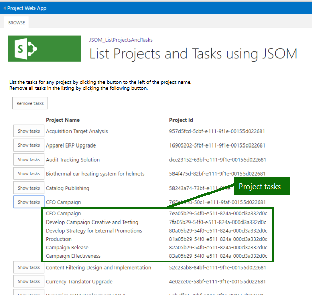

# <a name="developing-a-project-online-add-in-using-the-javascript-object-model-jsom"></a><span data-ttu-id="5979c-105">Desenvolvendo um suplemento Project Online usando o modelo de objeto JavaScript (JSOM)</span><span class="sxs-lookup"><span data-stu-id="5979c-105">Developing a Project Online add-in using the JavaScript Object Model (JSOM)</span></span>

<span data-ttu-id="5979c-106">Este artigo descreve o desenvolvimento de suplemento Microsoft Project Online para aperfeiçoar sua experiência com o Project Online.</span><span class="sxs-lookup"><span data-stu-id="5979c-106">This article describes Microsoft Project Online Add-in development to enhance your experience with the Project Online.</span></span> <span data-ttu-id="5979c-107">O projeto de desenvolvimento é implementado como um passo a passo.</span><span class="sxs-lookup"><span data-stu-id="5979c-107">The development project is implemented as a walkthrough.</span></span> <span data-ttu-id="5979c-108">O suplemento usado para este artigo lê e exibe os nomes de projeto e as identificações dos projetos publicados de sua conta do Project Online e permite fazer drill para baixo até tarefas recuperar associadas aos projetos individuais.</span><span class="sxs-lookup"><span data-stu-id="5979c-108">The add-in used for this article reads and displays the project names and IDs of the published projects from your Project Online account and allows you to drill down to retrieve tasks associated with individual projects.</span></span>
  
<span data-ttu-id="5979c-109">Em tempo de execução, a listagem de suplemento parece com a ilustração a seguir:</span><span class="sxs-lookup"><span data-stu-id="5979c-109">At run time, the add-in listing looks similar to the following illustration:</span></span>
  
<span data-ttu-id="5979c-110">![Captura de tela mostrando uma listagem de JSOM projetos e tarefas] (media/766e5914-f048-48f4-9282-291f55e6e90d.png "Captura de tela mostrando uma listagem de JSOM projetos e tarefas")</span><span class="sxs-lookup"><span data-stu-id="5979c-110"></span></span>
  
<span data-ttu-id="5979c-111">O foco do exemplo é a interação com o Project Online, fazendo consultas e definindo o contexto de cada solicitação do serviço.</span><span class="sxs-lookup"><span data-stu-id="5979c-111">The focus of the example is the interaction with the Project Online, making queries and setting the context for each request from the service.</span></span> <span data-ttu-id="5979c-112">Elementos de interface do usuário recebem atenção mínima.</span><span class="sxs-lookup"><span data-stu-id="5979c-112">User interface (UI) elements receive minimal attention.</span></span> <span data-ttu-id="5979c-113">Em vez disso, as listagens de origem fornecem comentários sobre a interface do usuário.</span><span class="sxs-lookup"><span data-stu-id="5979c-113">Instead, the source listings provide comments regarding the UI.</span></span>
  
> [!NOTE]
> <span data-ttu-id="5979c-114">Os arquivos de origem para o exemplo suplemento, um projeto do Visual Studio, estão disponíveis em: https://github.com/OfficeDev/Project-JSOM-List-Projects-Tasks.....</span><span class="sxs-lookup"><span data-stu-id="5979c-114">The source files for the example add-in, a Visual Studio project, are available at: https://github.com/OfficeDev/Project-JSOM-List-Projects-Tasks.....</span></span> <span data-ttu-id="5979c-115">Manter os arquivos de origem úteis como uma referência enquanto você leia o artigo, como cada complementa o outro.</span><span class="sxs-lookup"><span data-stu-id="5979c-115">Keep the source files handy as a reference while you read the article, as each complements the other.</span></span> <span data-ttu-id="5979c-116">Os arquivos no Visual Studio compilação do projeto e são executáveis com alterações mínimas — substituindo a URL para seu locatário do Project Online para baixo até a pasta do PWA.</span><span class="sxs-lookup"><span data-stu-id="5979c-116">The files in the Visual Studio project build and are executable with minimal changes—substituting the URL for your Project Online tenant down to the PWA folder.</span></span> 
  
## <a name="background"></a><span data-ttu-id="5979c-117">Background</span><span class="sxs-lookup"><span data-stu-id="5979c-117">Background</span></span>

<span data-ttu-id="5979c-118">Project Online é um serviço do Office 365 que fornece as empresas com um gerenciamento de portfólio de projeto (PPM) e a solução do project management office (PMO) para coordenar e gerenciar portfólios, programas e projetos.</span><span class="sxs-lookup"><span data-stu-id="5979c-118">Project Online is a Office 365 service that provides companies with a project portfolio management (PPM) and project management office (PMO) solution to coordinate and manage portfolios, programs, and projects.</span></span> <span data-ttu-id="5979c-119">Project Online é uma oferta de diferente que as edições da área de trabalho do projeto; ainda assim, Project Online ainda contém a funcionalidade para manter e rastrear detalhes do projeto em toda a duração de um projeto.</span><span class="sxs-lookup"><span data-stu-id="5979c-119">Project Online is a different offering than the Project desktop editions; yet, Project Online still contains the functionality to maintain and track project details throughout the life of a project.</span></span> <span data-ttu-id="5979c-120">Project Online é baseado no SharePoint Online.</span><span class="sxs-lookup"><span data-stu-id="5979c-120">Project Online is built on SharePoint Online.</span></span>
  
<span data-ttu-id="5979c-121">Um suplemento Project Online hospedado consiste em arquivos JavaScript e recursos que interagem com a API de cliente-lado-modelo de objeto.</span><span class="sxs-lookup"><span data-stu-id="5979c-121">A Project Online hosted add-in consists of JavaScript and resource files that interact with the Client-Side-Object-Model API.</span></span> <span data-ttu-id="5979c-122">Quando o usuário visita o suplemento, o JavaScript e os recursos são baixados e executados dentro do navegador.</span><span class="sxs-lookup"><span data-stu-id="5979c-122">When the user visits the add-in, the JavaScript and resources are downloaded and executed within the browser.</span></span> <span data-ttu-id="5979c-123">O suplemento faz chamadas assíncronas com o Project Online para interagir com o serviço, se a criação, recuperação, atualizem ou excluam dados.</span><span class="sxs-lookup"><span data-stu-id="5979c-123">The add-In makes asynchronous calls to Project Online to interact with the service, whether creating, retrieving, updating, or deleting data.</span></span> 
  
<span data-ttu-id="5979c-124">Project Online realiza uma ação de mais para proteger as informações que pertence a outros locatários add-in do; Isto é, Project Online cria um site isolado para interagir com as solicitações do suplemento.</span><span class="sxs-lookup"><span data-stu-id="5979c-124">Project Online performs one more action to protect information that belongs to other tenants from the add-in; namely, Project Online creates an isolated site to interact with the requests from the add-in.</span></span> <span data-ttu-id="5979c-125">Nenhum código personalizado é executado no host do Project Online.</span><span class="sxs-lookup"><span data-stu-id="5979c-125">No custom code runs on the Project Online host.</span></span> 
  
<span data-ttu-id="5979c-126">A configuração de desenvolvimento para Project Online suplementos usa o tipo de projeto Visual Studio SharePoint Add-in.</span><span class="sxs-lookup"><span data-stu-id="5979c-126">The development setup for Project Online add-ins uses the Visual Studio SharePoint Add-in project type.</span></span> <span data-ttu-id="5979c-127">O suplemento é gravado em JavaScript e usa o modelo de objeto JavaScript do projeto (JSOM) para interagir com o serviço do Project Online.</span><span class="sxs-lookup"><span data-stu-id="5979c-127">The add-in is written in JavaScript, and uses the Project JavaScript object model (JSOM) to interact with the Project Online service.</span></span> <span data-ttu-id="5979c-128">O JSOM herda grande parte da sua funcionalidade JSOM do SharePoint.</span><span class="sxs-lookup"><span data-stu-id="5979c-128">The JSOM inherits much of its functionality from the SharePoint JSOM.</span></span>
  
> [!NOTE]
> <span data-ttu-id="5979c-129">Suplementos podem ser publicados e vendidos no Office Store ou implantados em um catálogo de aplicativos privado no SharePoint.</span><span class="sxs-lookup"><span data-stu-id="5979c-129">Add-ins can be published and sold in the Office Store or deployed to a private app catalog on SharePoint.</span></span> <span data-ttu-id="5979c-130">Para obter mais informações, consulte [Deploy e publicar o Add-in Office](https://docs.microsoft.com/en-us/office/dev/add-ins/publish/publish).</span><span class="sxs-lookup"><span data-stu-id="5979c-130">For more information, see [Deploy and publish your Office Add-in](https://docs.microsoft.com/en-us/office/dev/add-ins/publish/publish).</span></span>
> 
> <span data-ttu-id="5979c-131">O suplemento usado neste artigo é uma amostra para desenvolvedores; ele não é projetado para uso em um ambiente de produção.</span><span class="sxs-lookup"><span data-stu-id="5979c-131">The add-in used in this article is a sample for developers; it is not intended for use in a production environment.</span></span> <span data-ttu-id="5979c-132">O objetivo principal é mostrar um exemplo de desenvolvimento de aplicativos para o Project Online.</span><span class="sxs-lookup"><span data-stu-id="5979c-132">The primary purpose is to show an example of app development for Project Online.</span></span> 
  
## <a name="prerequisites"></a><span data-ttu-id="5979c-133">Pré-requisitos</span><span class="sxs-lookup"><span data-stu-id="5979c-133">Prerequisites</span></span>

<span data-ttu-id="5979c-134">Adicione os seguintes itens em um ambiente do Windows com suporte:</span><span class="sxs-lookup"><span data-stu-id="5979c-134">Add the following items to a supported Windows environment:</span></span>
  
- <span data-ttu-id="5979c-135">**.NET framework 4.0 ou posterior**: as versões completas do framework da versão 4.0 são compatíveis.</span><span class="sxs-lookup"><span data-stu-id="5979c-135">**.NET Framework 4.0 or later**: Complete versions of the framework from version 4.0 are compatible.</span></span> <span data-ttu-id="5979c-136">O site de download está https://msdn.microsoft.com/en-us/vstudio/aa496123.aspx.</span><span class="sxs-lookup"><span data-stu-id="5979c-136">The download site is https://msdn.microsoft.com/en-us/vstudio/aa496123.aspx.</span></span>
    
- <span data-ttu-id="5979c-137">**Visual Studio 2013 ou posterior**:</span><span class="sxs-lookup"><span data-stu-id="5979c-137">**Visual Studio 2013 or later**:</span></span>  
    
   - <span data-ttu-id="5979c-138">A professional edition do Visual Studio de 2015 está pronto para ir fora da caixa e está disponível em https://www.visualstudio.com/en-us/products/visual-studio-professional-with-msdn-vs.aspx.</span><span class="sxs-lookup"><span data-stu-id="5979c-138">The professional edition of Visual Studio 2015 is ready to go out-of-the box and is available at https://www.visualstudio.com/en-us/products/visual-studio-professional-with-msdn-vs.aspx.</span></span>
    
   - <span data-ttu-id="5979c-139">A edição de comunidade do 2015 do Visual Studio está disponível em https://www.visualstudio.com/en-us/products/visual-studio-community-vs.aspx.</span><span class="sxs-lookup"><span data-stu-id="5979c-139">The community edition of Visual Studio 2015 is available at https://www.visualstudio.com/en-us/products/visual-studio-community-vs.aspx.</span></span> <span data-ttu-id="5979c-140">Nesta edição requer instalação manual das ferramentas de desenvolvedor do Microsoft Office para Visual Studio.</span><span class="sxs-lookup"><span data-stu-id="5979c-140">This edition requires manual installation of the Microsoft Office Developer Tools for Visual Studio.</span></span>
    
   <span data-ttu-id="5979c-141">O Microsoft Office Developer Tools para o Visual Studio estão disponível em https://www.visualstudio.com/en-us/features/office-tools-vs.aspx.</span><span class="sxs-lookup"><span data-stu-id="5979c-141">The Microsoft Office Developer Tools for Visual Studio are available at https://www.visualstudio.com/en-us/features/office-tools-vs.aspx.</span></span>
    
- <span data-ttu-id="5979c-142">**Conta uma Project Online**: Isso oferece acesso ao serviço de hospedagem.</span><span class="sxs-lookup"><span data-stu-id="5979c-142">**A Project Online account**: This provides access to the hosting service.</span></span> <span data-ttu-id="5979c-143">Para obter mais informações sobre como adquirir uma conta do Project Online, consulte https://products.office.com/en-us/Project/project-online-portfolio-management.</span><span class="sxs-lookup"><span data-stu-id="5979c-143">For more information about obtaining a Project Online account, see https://products.office.com/en-us/Project/project-online-portfolio-management.</span></span>
    
   <span data-ttu-id="5979c-144">Certifique-se de que o usuário de suplemento tenha autorização suficiente para acessar alguns projetos no Project Online inquilino.</span><span class="sxs-lookup"><span data-stu-id="5979c-144">Ensure that the add-in user has sufficient authorization to access some projects in the Project Online tenant.</span></span> 
    
- <span data-ttu-id="5979c-145">**Projetos no site de hospedagem** que são preenchidas com informações.</span><span class="sxs-lookup"><span data-stu-id="5979c-145">**Projects on the hosting site** that are populated with information.</span></span>
    
> [!NOTE]
> <span data-ttu-id="5979c-146">O padrão do .NET Framework é uma estrutura para usar correta.</span><span class="sxs-lookup"><span data-stu-id="5979c-146">The standard .NET Framework is the correct framework to use.</span></span> <span data-ttu-id="5979c-147">Não use o ".NET Framework 4 Client Profile".</span><span class="sxs-lookup"><span data-stu-id="5979c-147">Do not use the ".NET Framework 4 Client Profile".</span></span> 
  
### <a name="set-up-the-visual-studio-project"></a><span data-ttu-id="5979c-148">Configurar o projeto do Visual Studio</span><span class="sxs-lookup"><span data-stu-id="5979c-148">Set up the Visual Studio project</span></span>

<span data-ttu-id="5979c-149">A instalação do aplicativo consiste em criar um novo projeto, vinculando nas bibliotecas apropriadas e declarando os namespaces necessários.</span><span class="sxs-lookup"><span data-stu-id="5979c-149">The application setup consists of creating a new project, linking the appropriate libraries and declaring the needed namespaces.</span></span> <span data-ttu-id="5979c-150">O Visual Studio apresenta vários tipos de projetos de desenvolvimento.</span><span class="sxs-lookup"><span data-stu-id="5979c-150">Visual Studio presents several types of development projects.</span></span> <span data-ttu-id="5979c-151">A seção é breve e muito básico.</span><span class="sxs-lookup"><span data-stu-id="5979c-151">The section is brief and very basic.</span></span> <span data-ttu-id="5979c-152">O valor está tendo a informação é unidas em um único local.</span><span class="sxs-lookup"><span data-stu-id="5979c-152">The value is having the information is coalesced in one place.</span></span>
  
#### <a name="select-a-visual-studio-project"></a><span data-ttu-id="5979c-153">Selecione um projeto do Visual Studio</span><span class="sxs-lookup"><span data-stu-id="5979c-153">Select a Visual Studio project</span></span>

<span data-ttu-id="5979c-154">Para criar um projeto do tipo apropriado para o suplemento, você deve fazer as seguintes etapas.</span><span class="sxs-lookup"><span data-stu-id="5979c-154">To create a project of the appropriate type for the add-in, you must do the following steps.</span></span> <span data-ttu-id="5979c-155">Palavras-chave, encontradas na tela tem um atributo **negrito** :</span><span class="sxs-lookup"><span data-stu-id="5979c-155">Keywords encountered on the screen have a **bold** attribute:</span></span> 
  
1. <span data-ttu-id="5979c-156">No menu Arquivo, escolha **arquivo** > **New** > **Project**.</span><span class="sxs-lookup"><span data-stu-id="5979c-156">From the File menu, choose **File** > **New** > **Project**.</span></span> 
    
2. <span data-ttu-id="5979c-157">A partir de modelos de Installed no painel esquerdo, selecione **c#** > **Office/SharePoint** > **Web suplementos**.</span><span class="sxs-lookup"><span data-stu-id="5979c-157">From the Installed templates in the left pane, select **C#** > **Office/SharePoint** > **Web Add-ins**.</span></span> 
    
3. <span data-ttu-id="5979c-158">Na parte superior do painel central, selecione o **.NET Framework 4** ou posterior; a versão atual é 4.6.</span><span class="sxs-lookup"><span data-stu-id="5979c-158">At the top of the central pane, select **.NET Framework 4** or later; the current version is 4.6.</span></span> 
    
4. <span data-ttu-id="5979c-159">A partir de tipos de aplicativos, no painel central, escolha **do suplemento do SharePoint**.</span><span class="sxs-lookup"><span data-stu-id="5979c-159">From the application types in the central pane, choose **SharePoint Add-in**.</span></span> 
    
5. <span data-ttu-id="5979c-160">Na seção inferior, especifique um nome e local para o projeto e o nome da solução.</span><span class="sxs-lookup"><span data-stu-id="5979c-160">In the bottom section, specify a name and location for the project, and a solution name.</span></span> 
    
6. <span data-ttu-id="5979c-161">Também na seção inferior, marque a caixa de **criar diretório para a solução** .</span><span class="sxs-lookup"><span data-stu-id="5979c-161">Also in the bottom section, check the **Create directory for solution** box.</span></span> 
    
7. <span data-ttu-id="5979c-162">Clique em **Okey** para criar o projeto inicial.</span><span class="sxs-lookup"><span data-stu-id="5979c-162">Click **OK** to create the initial project.</span></span> 
    
<span data-ttu-id="5979c-163">O Assistente do Visual Studio pergunta algumas perguntas de acompanhamento sobre o site de configurações (configurações do SharePoint chamados nas caixas de diálogo) Project Online de duas caixas de diálogo que seguem.</span><span class="sxs-lookup"><span data-stu-id="5979c-163">The Visual Studio Wizard asks a few follow-up questions about the Project Online settings site (called SharePoint settings in the dialogs) in a couple of dialogs that follow.</span></span> <span data-ttu-id="5979c-164">Aqui estão as perguntas:</span><span class="sxs-lookup"><span data-stu-id="5979c-164">Here are the questions:</span></span>
  
1. <span data-ttu-id="5979c-165">Qual site do SharePoint você deseja usar para depuração seu suplemento?</span><span class="sxs-lookup"><span data-stu-id="5979c-165">What SharePoint site do you want to use for debugging your add-in?</span></span> <span data-ttu-id="5979c-166">Especificar a URL para seu site do PWA, tais como https://contoso.sharepoint.com/sites/pwa.</span><span class="sxs-lookup"><span data-stu-id="5979c-166">Specify the URL to your PWA site, such as https://contoso.sharepoint.com/sites/pwa.</span></span>
    
2. <span data-ttu-id="5979c-167">Como você deseja hospedar o Add-in do SharePoint?</span><span class="sxs-lookup"><span data-stu-id="5979c-167">How do you want to host your SharePoint Add-in?</span></span> <span data-ttu-id="5979c-168">Escolha [X] **hospedado no SharePoint**.</span><span class="sxs-lookup"><span data-stu-id="5979c-168">Choose [X] **SharePoint-hosted**.</span></span>
    
   <span data-ttu-id="5979c-169">Para obter mais informações sobre o SharePoint Add-ins, incluindo opções de hospedagem, consulte [Add-ins do SharePoint](https://docs.microsoft.com/en-us/sharepoint/dev/sp-add-ins/sharepoint-add-ins).</span><span class="sxs-lookup"><span data-stu-id="5979c-169">For more information about SharePoint Add-ins, including hosting options, see [SharePoint Add-ins](https://docs.microsoft.com/en-us/sharepoint/dev/sp-add-ins/sharepoint-add-ins).</span></span>
    
3. <span data-ttu-id="5979c-170">Clique em **Avançar**.</span><span class="sxs-lookup"><span data-stu-id="5979c-170">Click **Next**.</span></span> 
    
<span data-ttu-id="5979c-171">A segunda caixa de diálogo adicional solicita que você especificar a versão do SharePoint Online para o suplemento:</span><span class="sxs-lookup"><span data-stu-id="5979c-171">The second additional dialog asks you to specify the SharePoint Online version for the add-in:</span></span> 
  
1. <span data-ttu-id="5979c-172">Qual é a versão mais antiga do SharePoint que você deseja que seu suplemento para o destino?</span><span class="sxs-lookup"><span data-stu-id="5979c-172">What's the earliest version of SharePoint that you want your add-in to target?</span></span> <span data-ttu-id="5979c-173">Escolha [X] S **HarePoint on-line**.</span><span class="sxs-lookup"><span data-stu-id="5979c-173">Choose [X] S **harePoint-Online**.</span></span> 
    
2. <span data-ttu-id="5979c-174">Click **Finish**.</span><span class="sxs-lookup"><span data-stu-id="5979c-174">Click **Finish**.</span></span> 
    
<span data-ttu-id="5979c-175">Visual Studio cria o projeto e acessa o site do Project Online.</span><span class="sxs-lookup"><span data-stu-id="5979c-175">Visual Studio creates the project and accesses the Project Online site.</span></span> 
  
### <a name="enable-sideloading-on-the-project-online-site"></a><span data-ttu-id="5979c-176">Habilitar sideloading no site do Project Online</span><span class="sxs-lookup"><span data-stu-id="5979c-176">Enable sideloading on the Project Online site</span></span>

<span data-ttu-id="5979c-177">Sideloading é o mecanismo para testar e depurar suplementos Project Online. Você precisa de dois scripts para sideloading: um para habilitar sideloading em seu site do Project Online e outro para desabilitar sideloading depois que terminar de teste e depuração o add-in.</span><span class="sxs-lookup"><span data-stu-id="5979c-177">Sideloading is the mechanism for testing and debugging Project Online add-ins. You need two scripts for sideloading: one to enable sideloading on your Project Online site and another to disable sideloading once you finish testing and debugging the add-in.</span></span>
  
<span data-ttu-id="5979c-178">Para obter mais informações sobre como configurar sideloading, consulte [Habilitar app SideLoading em seu conjunto de sites não desenvolvedores](https://blogs.msdn.microsoft.com/officeapps/2013/12/10/enable-app-sideloading-in-your-non-developer-site-collection/).</span><span class="sxs-lookup"><span data-stu-id="5979c-178">For more information about setting up sideloading, see [Enable app SideLoading in your non-developer site collection](https://blogs.msdn.microsoft.com/officeapps/2013/12/10/enable-app-sideloading-in-your-non-developer-site-collection/).</span></span>
  
> [!NOTE]
> <span data-ttu-id="5979c-179">Aplicativos sideloading é um recurso de desenvolvedor/teste.</span><span class="sxs-lookup"><span data-stu-id="5979c-179">Sideloading apps is a developer/test feature.</span></span> <span data-ttu-id="5979c-180">É **não pretendido para uso em produção**.</span><span class="sxs-lookup"><span data-stu-id="5979c-180">It is **not intended for production use**.</span></span> <span data-ttu-id="5979c-181">Execute aplicativos de sideload não regularmente ou mantenha sideloading aplicativo habilitado para mais do que você estiver usando ativamente o recurso.</span><span class="sxs-lookup"><span data-stu-id="5979c-181">Do not sideload apps regularly, or keep app sideloading enabled for longer than you are actively using the feature.</span></span> 
  
## <a name="add-content-to-the-add-in-project"></a><span data-ttu-id="5979c-182">Adicionar conteúdo ao projeto de suplemento</span><span class="sxs-lookup"><span data-stu-id="5979c-182">Add content to the add-in project</span></span>

<span data-ttu-id="5979c-183">Após criar um projeto e configurando o mecanismo de depuração, a adição de conteúdo para o aplicativo inclui as seguintes tarefas:</span><span class="sxs-lookup"><span data-stu-id="5979c-183">After creating a project and setting up the debugging mechanism, adding content to the app includes the following tasks:</span></span>
  
- <span data-ttu-id="5979c-184">Configurando o escopo de aplicativo</span><span class="sxs-lookup"><span data-stu-id="5979c-184">Setting the application scope</span></span>
    
- <span data-ttu-id="5979c-185">Vinculando a biblioteca JSOM</span><span class="sxs-lookup"><span data-stu-id="5979c-185">Linking the JSOM library</span></span>
    
- <span data-ttu-id="5979c-186">Adicionando elementos de interface do usuário para o suplemento</span><span class="sxs-lookup"><span data-stu-id="5979c-186">Adding UI Elements to the add-in</span></span>
    
- <span data-ttu-id="5979c-187">Inicializando e conectando-se ao serviço Project Online</span><span class="sxs-lookup"><span data-stu-id="5979c-187">Initializing and connecting to the Project Online service</span></span>
    
- <span data-ttu-id="5979c-188">Recuperando detalhes/propriedades e projetos</span><span class="sxs-lookup"><span data-stu-id="5979c-188">Retrieving projects and details/properties</span></span>
    
- <span data-ttu-id="5979c-189">Exibindo projetos</span><span class="sxs-lookup"><span data-stu-id="5979c-189">Displaying projects</span></span>
    
- <span data-ttu-id="5979c-190">A exibição de tarefas para um projeto</span><span class="sxs-lookup"><span data-stu-id="5979c-190">Displaying tasks for a Project</span></span>
    
<span data-ttu-id="5979c-191">O projeto de suplemento consiste em vários arquivos.</span><span class="sxs-lookup"><span data-stu-id="5979c-191">The add-in project consists of many files.</span></span> <span data-ttu-id="5979c-192">Neste exemplo, você precisará editar os arquivos a seguir:</span><span class="sxs-lookup"><span data-stu-id="5979c-192">In this example, you'll need to edit the following files:</span></span> 
  
- <span data-ttu-id="5979c-193">AppManifest.xml</span><span class="sxs-lookup"><span data-stu-id="5979c-193">AppManifest.xml</span></span>
    
- <span data-ttu-id="5979c-194">Default. aspx</span><span class="sxs-lookup"><span data-stu-id="5979c-194">Default.aspx</span></span>
    
- <span data-ttu-id="5979c-195">App.js</span><span class="sxs-lookup"><span data-stu-id="5979c-195">App.js</span></span>
    
- <span data-ttu-id="5979c-196">App.CSS - opcional; contém as definições de estilo desenvolvidas para o suplemento</span><span class="sxs-lookup"><span data-stu-id="5979c-196">App.css - optional; contains style definitions developed for the add-in</span></span>
    
<span data-ttu-id="5979c-197">Se o Project Online inquilino muda, como mover de uma versão de avaliação para um site de inscrição, você pode atualizar as propriedades do projeto, incluindo a Conexão do servidor e a URL do Site, usando a janela de propriedades disponíveis por meio do **modo de exibição** > **Propriedades Janela** comando.</span><span class="sxs-lookup"><span data-stu-id="5979c-197">If the Project Online tenant changes, such as moving from a trial to a subscription site, you can update the project properties, including the Server Connection and Site URL, using the Properties Window available through the **View** > **Properties Window** command.</span></span> 
  
<span data-ttu-id="5979c-198">Você também pode adicionar arquivos ao projeto.</span><span class="sxs-lookup"><span data-stu-id="5979c-198">You can also add files to the project.</span></span> <span data-ttu-id="5979c-199">Nesse caso, você precisará atualizar o arquivo Elements XML localizado no mesmo grupo (conteúdo, imagens, páginas ou Scripts) para incluir os novos arquivos.</span><span class="sxs-lookup"><span data-stu-id="5979c-199">If so, you'll need to update the Elements.xml file located in the same group (Content, Images, Pages, or Scripts) to include the new files.</span></span> <span data-ttu-id="5979c-200">Para obter mais informações sobre os arquivos do projeto, consulte [Explore a estrutura de manifesto de aplicativo e o pacote de um suplemento do SharePoint](https://docs.microsoft.com/en-us/sharepoint/dev/sp-add-ins/explore-the-app-manifest-structure-and-the-package-of-a-sharepoint-add-in).</span><span class="sxs-lookup"><span data-stu-id="5979c-200">For more information about the project files, see [Explore the app manifest structure and the package of a SharePoint Add-in](https://docs.microsoft.com/en-us/sharepoint/dev/sp-add-ins/explore-the-app-manifest-structure-and-the-package-of-a-sharepoint-add-in).</span></span>
  
### <a name="set-application-scope"></a><span data-ttu-id="5979c-201">Definir o escopo do aplicativo</span><span class="sxs-lookup"><span data-stu-id="5979c-201">Set application scope</span></span>

<span data-ttu-id="5979c-202">O suplemento precisa de níveis de permissão ou escopo definidos antes que o serviço retorna informações nos resultados da consulta.</span><span class="sxs-lookup"><span data-stu-id="5979c-202">The add-in needs scope or permission levels defined before the service returns information in query results.</span></span> <span data-ttu-id="5979c-203">Para este suplemento, use o seguinte escopo para o projeto do Visual Studio.</span><span class="sxs-lookup"><span data-stu-id="5979c-203">For this add-in, use the following scope to the Visual Studio project.</span></span> <span data-ttu-id="5979c-204">Esta alteração é feita no arquivo AppManifest.xml na guia permissões:</span><span class="sxs-lookup"><span data-stu-id="5979c-204">This change is made to the AppManifest.xml file in the Permissions tab:</span></span>

|<span data-ttu-id="5979c-205">Escopo</span><span class="sxs-lookup"><span data-stu-id="5979c-205">Scope</span></span>|<span data-ttu-id="5979c-206">Permissão</span><span class="sxs-lookup"><span data-stu-id="5979c-206">Permission</span></span>|
|:-----|:-----|
|<span data-ttu-id="5979c-207">Vários projetos (Project Server)</span><span class="sxs-lookup"><span data-stu-id="5979c-207">Multiple Projects (Project Server)</span></span>  <br/> |<span data-ttu-id="5979c-208">Read</span><span class="sxs-lookup"><span data-stu-id="5979c-208">Read</span></span>  <br/> |
   
<span data-ttu-id="5979c-209">Salve o arquivo após a configuração do escopo do aplicativo.</span><span class="sxs-lookup"><span data-stu-id="5979c-209">Save the file after setting the application scope.</span></span> <span data-ttu-id="5979c-210">Caso contrário, nenhum dado será retornado do serviço.</span><span class="sxs-lookup"><span data-stu-id="5979c-210">Otherwise, no data will be returned from the service.</span></span> 
  
### <a name="link-the-jsom-library"></a><span data-ttu-id="5979c-211">Vincular a biblioteca JSOM</span><span class="sxs-lookup"><span data-stu-id="5979c-211">Link the JSOM library</span></span>

<span data-ttu-id="5979c-212">As bibliotecas de Project Online runtime, PS.js e PS.debug.js, são fornecidas pelo Project Online e são sempre a versão mais recente.</span><span class="sxs-lookup"><span data-stu-id="5979c-212">The runtime Project Online libraries, PS.js and PS.debug.js, are provided by Project Online and are always the most recent version.</span></span> <span data-ttu-id="5979c-213">Suplementos JavaScript usam JSOM devem link com uma dessas bibliotecas.</span><span class="sxs-lookup"><span data-stu-id="5979c-213">JavaScript add-ins that use JSOM must link with one of these libraries.</span></span> <span data-ttu-id="5979c-214">As definições de vinculação são adicionadas no arquivo default. aspx.</span><span class="sxs-lookup"><span data-stu-id="5979c-214">The linking definitions are added in the Default.aspx file.</span></span> <span data-ttu-id="5979c-215">Os comandos para usar o PS.js e/ou PS.debug.js fazem parte do código localizado no arquivo App.js.</span><span class="sxs-lookup"><span data-stu-id="5979c-215">The commands to use the PS.js and/or PS.debug.js are part of the code located in the App.js file.</span></span>
  
<span data-ttu-id="5979c-216">Adicione o seguinte comando para definição de PS.js ou PS.debug.js no `<asp:Content ContentPlaceHolderID="PlaceHolderAdditionalPageHead"` elemento seguindo o "SharePoint:ScriptLink" sp.js.</span><span class="sxs-lookup"><span data-stu-id="5979c-216">Add the following command for PS.js or PS.debug.js definition in the  `<asp:Content ContentPlaceHolderID="PlaceHolderAdditionalPageHead"` element following the "SharePoint:ScriptLink" for sp.js.</span></span> 
  
```js
<SharePoint:ScriptLink name="PS.js" runat="server" OnDemand="false" LoadAfterUI="true" Localizable="false" />
```

> [!NOTE]
> <span data-ttu-id="5979c-217">O atributo **OnDemand** para PS.js ou PS.debug.js é definida como **false**.</span><span class="sxs-lookup"><span data-stu-id="5979c-217">The **OnDemand** attribute for PS.js or PS.debug.js set to **false**.</span></span> 
  
### <a name="add-ui-elements-to-the-add-in"></a><span data-ttu-id="5979c-218">Adicionar elementos de interface do usuário para o suplemento</span><span class="sxs-lookup"><span data-stu-id="5979c-218">Add UI elements to the add-in</span></span>

<span data-ttu-id="5979c-219">O suplemento de exemplo consiste em alguns componentes.</span><span class="sxs-lookup"><span data-stu-id="5979c-219">The example add-in consists of a few components.</span></span> <span data-ttu-id="5979c-220">Descrições de elemento estático estão localizadas no arquivo default. aspx.</span><span class="sxs-lookup"><span data-stu-id="5979c-220">Static element descriptions are located in the Default.aspx file.</span></span> <span data-ttu-id="5979c-221">Descrições de elemento dinâmico e código para todos os componentes estão localizados no arquivo App.js.</span><span class="sxs-lookup"><span data-stu-id="5979c-221">Dynamic element descriptions and code for all components are located in the App.js file.</span></span> <span data-ttu-id="5979c-222">Para comentários sobre os componentes, consulte as listagens de código fonte.</span><span class="sxs-lookup"><span data-stu-id="5979c-222">For comments regarding the components, refer to the source code listings.</span></span> <span data-ttu-id="5979c-223">Aqui está uma lista dos componentes de UI do add-in:</span><span class="sxs-lookup"><span data-stu-id="5979c-223">Here is a list of the UI components in the add-in:</span></span>
  
- <span data-ttu-id="5979c-224">Title</span><span class="sxs-lookup"><span data-stu-id="5979c-224">Title</span></span>
    
- <span data-ttu-id="5979c-225">Verbosidade introdutória</span><span class="sxs-lookup"><span data-stu-id="5979c-225">Introductory verbiage</span></span>
    
- <span data-ttu-id="5979c-226">Botão para remover as tarefas da tabela</span><span class="sxs-lookup"><span data-stu-id="5979c-226">Button to remove tasks from the table</span></span>
    
- <span data-ttu-id="5979c-227">Tabela que lista a ID do projeto e o nome e as informações de tarefa.</span><span class="sxs-lookup"><span data-stu-id="5979c-227">Table that lists the project ID and name, and the task information.</span></span>
    
- <span data-ttu-id="5979c-228">Botão (clonada uma vez para cada projeto) que importa dados de tarefa para a tabela de tarefas.</span><span class="sxs-lookup"><span data-stu-id="5979c-228">Tasks Button (cloned once for each project) that imports task data into the table.</span></span>
    
<span data-ttu-id="5979c-229">Para obter detalhes da interface do usuário, como o título e a parte do cabeçalho da tabela project, consulte o arquivo de projeto default. aspx.</span><span class="sxs-lookup"><span data-stu-id="5979c-229">For details of the user interface, such as the title and the header portion of the project table, see the Default.aspx project file.</span></span>
  
### <a name="initialize-and-connect-to-the-host-system"></a><span data-ttu-id="5979c-230">Inicializar e conecte-se para o sistema host</span><span class="sxs-lookup"><span data-stu-id="5979c-230">Initialize and connect to the host system</span></span>

<span data-ttu-id="5979c-231">O arquivo de App.js contém o código JavaScript.</span><span class="sxs-lookup"><span data-stu-id="5979c-231">The App.js file contains the JavaScript code.</span></span> <span data-ttu-id="5979c-232">O suplemento carrega PS.js no navegador e, em seguida, chama a função initializePage.</span><span class="sxs-lookup"><span data-stu-id="5979c-232">The add-in loads PS.js in the browser, and then calls the initializePage function.</span></span> <span data-ttu-id="5979c-233">InitializePage recupera um contexto para o ponto de extremidade do Project Online e inicia a função loadProjects.</span><span class="sxs-lookup"><span data-stu-id="5979c-233">InitializePage retrieves a context to the Project Online endpoint and starts the loadProjects function.</span></span>
  
```js
    'use strict';
    SP.SOD.executeOrDelayUntilScriptLoaded(initializePage, "PS.js");
    //Project PWA Context and published projects in PWA
    var projContext;
    var projects;
    function initializePage() {
        //Get the Project context for this web
        projContext = PS.ProjectContext.get_current();
        loadProjects();
    }
    //General CSOM failure event handler
    //Invoked when ExecuteQueryAsync returns unsuccessfully
    function onRequestFailed(sender, args) {
        alert("Failed to execute: " + args.get_message());
        return;
    };

```

### <a name="retrieve-the-projects"></a><span data-ttu-id="5979c-234">Recuperar os projetos</span><span class="sxs-lookup"><span data-stu-id="5979c-234">Retrieve the projects</span></span>

<span data-ttu-id="5979c-235">A função loadProjects consulta o serviço de nomes de projeto e IDs.</span><span class="sxs-lookup"><span data-stu-id="5979c-235">The loadProjects function queries the service for the project names and IDs.</span></span> 
  
<span data-ttu-id="5979c-236">O aplicativo recupera o nome do projeto e o project ID. Outras informações sobre o projeto está disponíveis e podem ser acessadas por modificar o método load para identificar explicitamente propriedades a serem recuperadas.</span><span class="sxs-lookup"><span data-stu-id="5979c-236">The application retrieves the project name and project Id. Other information about the project is available and can be accessed by modifying the load method to identify explicitly the properties to retrieve.</span></span> <span data-ttu-id="5979c-237">Um exemplo é fornecido no código como um comentário.</span><span class="sxs-lookup"><span data-stu-id="5979c-237">An example is provided in the code as a comment.</span></span> 
  
<span data-ttu-id="5979c-238">Se a consulta for bem sucedido, o suplemento continua chamando displayProjects.</span><span class="sxs-lookup"><span data-stu-id="5979c-238">If the query succeeds, the add-in continues by calling displayProjects.</span></span> 
  
```js
    //Query CSOM and get the list of projects in PWA
    function loadProjects() {
        projects = projContext.get_projects();
    //Request to server - identifies what to retrieve
        projContext.load(projects, 'Include(Name, Id)');
        //Notice to server to execute query
        projContext.executeQueryAsync(displayProjects, onRequestFailed);
        // Syntax for requesting more fields to pull down from server
        // projContext.load(projects, 'Include(Name, Description, StartDate, 
        // Id, IsCheckedOut)');
    }

```

### <a name="display-the-projects"></a><span data-ttu-id="5979c-239">Exibir os projetos</span><span class="sxs-lookup"><span data-stu-id="5979c-239">Display the projects</span></span>

<span data-ttu-id="5979c-240">A função displayProjects cria uma tabela, uma linha por projeto e um botão para mostrar as tarefas do projeto específico.</span><span class="sxs-lookup"><span data-stu-id="5979c-240">The displayProjects function creates a table, one row per project, and a button to show the tasks for the specific project.</span></span> 
  
```js
    //Display the projects with names and ids in a table
    function displayProjects() {
        //Current published project and ID
        var p, projId;
        //Project table rows to publish collectively
        var pTable = []; 
        var pEnum = projects.getEnumerator();
        //Build a 3-column table, with one project per row.
        while (pEnum.moveNext()) {
            p = pEnum.get_current();
        
            //Items used in getting information for table rows:
            //Current published project object, and ID and name
            // var project = p;
            // var projId = p.get_id();
            // var projName = p.get_name();
        
            //Continue processing/working with project object as needed.
        }
    }

```

> [!NOTE]
> <span data-ttu-id="5979c-241">O loop while acessos a ID e propriedades de nome.</span><span class="sxs-lookup"><span data-stu-id="5979c-241">The while loop accesses the ID and name properties.</span></span> <span data-ttu-id="5979c-242">Isso é ligeiramente diferente projeto código-fonte que chama uma função que, por sua vez, acessa as mesmas propriedades.</span><span class="sxs-lookup"><span data-stu-id="5979c-242">This is slightly different than the source code project that calls a function that, in turn, accesses the same properties.</span></span> 
  
### <a name="display-the-tasks-for-a-project"></a><span data-ttu-id="5979c-243">Exibir as tarefas de um projeto</span><span class="sxs-lookup"><span data-stu-id="5979c-243">Display the tasks for a project</span></span>

<span data-ttu-id="5979c-244">As tarefas, enquanto a parte do add-in, não fazem parte do carregamento inicial.</span><span class="sxs-lookup"><span data-stu-id="5979c-244">The tasks, while part of the add-in, are not part of the initial loading.</span></span> <span data-ttu-id="5979c-245">Se o usuário está interessado nas tarefas associadas a um projeto, clicando no botão "Mostrar tarefas" faz com que as tarefas a ser exibido na lista usando o manipulador de eventos btnLoadTasks.</span><span class="sxs-lookup"><span data-stu-id="5979c-245">If the user is interested in the tasks associated with a project, clicking the "Show Tasks" button causes the tasks to display in the list using the btnLoadTasks event handler.</span></span> 
  
<span data-ttu-id="5979c-246">O manipulador de eventos btnLoadTasks, com a ID de projeto apropriado, solicita as tarefas do projeto especificado do servidor.</span><span class="sxs-lookup"><span data-stu-id="5979c-246">The btnLoadTasks event handler, with the appropriate project ID, requests the tasks for the specified project from the server.</span></span> <span data-ttu-id="5979c-247">Depois que recuperados, o btnLoadTasks passa a lista de tarefas para displayTasks para apresentar as tarefas na tela.</span><span class="sxs-lookup"><span data-stu-id="5979c-247">Once retrieved, btnLoadTasks passes the task list to displayTasks to present the tasks onscreen.</span></span>
  
```js
    //Query CSOM and get the list of tasks for a specific project
    function btnLoadTasks(pid) {
        //Event handler for the "Show tasks" buttons. 
        //
        //The project ID is the sole argument and is used to get the appropriate task 
        //info from the service.
        //The project ID is also the button name, and is used to identify where to place
        //the task information in the table.
        //
        //Project ID to pass to the event handler
        var projId = pid;
        //
        //Get the project reference
        var pProj = projects.getById(projId);
        //
        //Get the tasks collection reference associated with the project.
        var tasks = pProj.get_tasks();
        //
        projContext.load(tasks, 'Include(Id, Name, Start, ScheduledStart, Completion)');
        //
        //If the query succeeds, displayTasks presents the tasks to the user.
        projContext.executeQueryAsync(function () { displayTasks(tasks, projId) }, onRequestFailed);
    }

```

<span data-ttu-id="5979c-248">A função displayTasks exibe as tarefas associadas a um projeto especificado imediatamente abaixo da entrada de projeto.</span><span class="sxs-lookup"><span data-stu-id="5979c-248">The displayTasks function displays the tasks associated with a specified project immediately beneath the project entry.</span></span>
  
```js
    //Insert tasks for the specified project immediately underneath the project entry 
    //in the table.
    function displayTasks(tasks, projId) {
        //selected project ID
        var pId = projId;
        //individual task
        var t;
        //Task table rows to publish collectively
        var tTable = [];
        var tEnum = tasks.getEnumerator();
        //Build table one task per row.
        while (tEnum.moveNext()) {
            t = tEnum.get_current();
            //
            //Items used in getting information for table rows:
            //Current task object, and ID and name
            // var task = t;
            // var taskId = t.get_id();
            // var taskName = t.get_name();
            
            //Continue processing/working with task object as needed.
        }
    }

```

> [!NOTE]
> <span data-ttu-id="5979c-249">O loop while acessos a identificação da tarefa e propriedades de nome.</span><span class="sxs-lookup"><span data-stu-id="5979c-249">The while loop accesses the task ID and name properties.</span></span> <span data-ttu-id="5979c-250">Isso é ligeiramente diferente projeto código-fonte que chama uma função que, por sua vez, acessa as mesmas propriedades.</span><span class="sxs-lookup"><span data-stu-id="5979c-250">This is slightly different than the source code project that calls a function that, in turn, accesses the same properties.</span></span> 
  
<span data-ttu-id="5979c-251">Saída de exemplo para as tarefas de um único projeto segue.</span><span class="sxs-lookup"><span data-stu-id="5979c-251">Sample output for the tasks of a single project follows.</span></span>
  
<span data-ttu-id="5979c-252">![Captura de tela mostrando a saída para uma tarefa de projeto] (media/f6500a3f-000b-4f3e-9be6-9a74d0bea15e.png "Captura de tela mostrando a saída para uma tarefa de projeto")</span><span class="sxs-lookup"><span data-stu-id="5979c-252"></span></span>
  
## <a name="see-also"></a><span data-ttu-id="5979c-253">Confira também</span><span class="sxs-lookup"><span data-stu-id="5979c-253">See also</span></span>

<span data-ttu-id="5979c-254">Para documentação e exemplos relacionados ao Project Online e desenvolvimento de aplicativos usando CSOM, consulte o [Portal de desenvolvimento do Project](https://developer.microsoft.com/en-us/project).</span><span class="sxs-lookup"><span data-stu-id="5979c-254">For documentation and samples related to Project Online and application development using CSOM, see the [Project Development Portal](https://developer.microsoft.com/en-us/project).</span></span>
    


