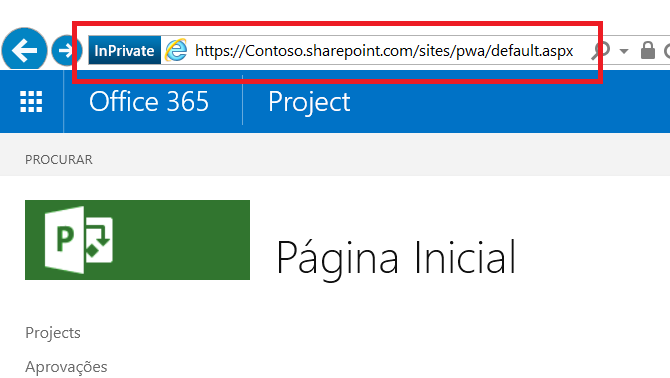

# <a name="developing-a-project-online-application-using-the-client-side-object-model-csom"></a><span data-ttu-id="38671-103">Desenvolvimento de um aplicativo do Project Online usando o modelo de objeto do cliente (CSOM)</span><span class="sxs-lookup"><span data-stu-id="38671-103">Developing a Project Online application using the client-side object model (CSOM)</span></span>

>[!NOTE] 
><span data-ttu-id="38671-104">Este artigo descreve o desenvolvimento de aplicativos do Microsoft Project Online para usar o CSOM.</span><span class="sxs-lookup"><span data-stu-id="38671-104">This article describes Microsoft Project Online application development for using CSOM.</span></span> <span data-ttu-id="38671-105">Recomendamos que você explore como desenvolver aplicativos usando o [novo Project para a Web](https://developer.microsoft.com/pt-BR/office/blogs/developing-applications-and-reports-using-the-new-project/).</span><span class="sxs-lookup"><span data-stu-id="38671-105">We recommend you explore how to develop applications using the [new Project for the web](https://developer.microsoft.com/pt-BR/office/blogs/developing-applications-and-reports-using-the-new-project/).</span></span>
  
## <a name="background"></a><span data-ttu-id="38671-106">Segundo plano</span><span class="sxs-lookup"><span data-stu-id="38671-106">Background</span></span>

<span data-ttu-id="38671-107">O Microsoft Project começou como um aplicativo da área de trabalho no início da década de 1990.</span><span class="sxs-lookup"><span data-stu-id="38671-107">Microsoft Project started as desktop application in the early 1990's.</span></span> <span data-ttu-id="38671-108">Atualmente o Project é muito mais, o que se comprova por sua variedade:</span><span class="sxs-lookup"><span data-stu-id="38671-108">Today, Project is much more, as its several varieties attest:</span></span>
  
- <span data-ttu-id="38671-109">O Project Standard Edition é um aplicativo da área de trabalho executado como um aplicativo autônomo.</span><span class="sxs-lookup"><span data-stu-id="38671-109">Project standard edition is a desktop application that runs as a stand-alone application.</span></span>
    
- <span data-ttu-id="38671-110">O Project Professional Edition é um aplicativo da área de trabalho que pode interagir e compartilhar dados com um servidor em uma escala maior, além de ter as mesmas funcionalidades do Project Standard Edition.</span><span class="sxs-lookup"><span data-stu-id="38671-110">Project professional edition is a desktop application that can interact and share data with a server on a larger scale, as well as perform the functionality found in Project standard edition.</span></span>
    
- <span data-ttu-id="38671-111">O Project Online é um serviço hospedado da Microsoft que oferece às empresas uma solução no nível de PMO para coordenar e gerenciar projetos, programas e portfólios.</span><span class="sxs-lookup"><span data-stu-id="38671-111">Project Online is a Microsoft-hosted service that provides companies with a PMO-level solution to coordinate and manage projects, programs, and portfolios.</span></span> <span data-ttu-id="38671-112">Diferente das edições da área de trabalho, o Project Online pode manter e controlar os detalhes do projeto durante a vigência dele.</span><span class="sxs-lookup"><span data-stu-id="38671-112">A different offering than the desktop editions, Project Online can maintain and track project details throughout the life of a project.</span></span> 
    
- <span data-ttu-id="38671-113">O Project Server é um serviço hospedado pela empresa em que ela gerencia e protege o servidor contendo informações de projetos, programas e portfólios.</span><span class="sxs-lookup"><span data-stu-id="38671-113">Project Server is an enterprise-hosted service in which the enterprise manages and secures the server containing project, program, and portfolio information.</span></span> <span data-ttu-id="38671-114">O Project Server, por proteger o servidor internamente, oferece os recursos orientados a projetos, programas e portfólios do Project Online hospedado externamente com maior capacidade de personalização.</span><span class="sxs-lookup"><span data-stu-id="38671-114">Project Server, by virtue of securing the server in-house, offers the project, program, and portfolio oriented features of externally-hosted Project Online with a greater capacity for customization.</span></span>
    
<span data-ttu-id="38671-115">O Project Online tem três conjuntos de API online: CSOM (Modelo de Objeto do Cliente), JSOM (Modelo de Objeto do JavaScript) e REST (Transferência de Estado Representacional).</span><span class="sxs-lookup"><span data-stu-id="38671-115">Project Online has three online API sets: Client-side Object Model (CSOM), JavaScript Object Model (JSOM), and Representational State Transfer (REST).</span></span> 
  
- <span data-ttu-id="38671-116">A implementação do .NET CSOM é a interface preferencial ao desenvolver aplicativos para Windows que interagem com locatários do Project Online.</span><span class="sxs-lookup"><span data-stu-id="38671-116">The .NET CSOM implementation is the preferred interface when developing Windows applications that interact with Project Online tenants.</span></span> <span data-ttu-id="38671-117">Entre os ambientes típicos de aplicativos voltados para o usuário estão os computadores Windows e os dispositivos Microsoft Surface.</span><span class="sxs-lookup"><span data-stu-id="38671-117">Typical environments for user-centric applications include Windows desktops and Microsoft Surface devices.</span></span> <span data-ttu-id="38671-118">Aplicativos de back-end escritos com .NET CSOM podem se conectar a outros servidores como fontes de dados e lógicas corporativas que sejam externas ao Project Online.</span><span class="sxs-lookup"><span data-stu-id="38671-118">Back-end applications written with .NET CSOM can connect to other servers for business logic and data sources that are external to Project Online.</span></span> <span data-ttu-id="38671-119">Solicitações de recuperação no Project Online usam um sistema de consulta equivalente ao LINQ que oferece diversas melhorias em relação às funções básicas de recuperação.</span><span class="sxs-lookup"><span data-stu-id="38671-119">Retrieval requests to Project Online use a LINQ-like query system that offers several enhancements over basic retrieval functions.</span></span>
    
- <span data-ttu-id="38671-120">A interface do JSOM (Modelo de Objeto do JavaScript) oferece suporte a navegadores para Suplementos do Project Online. Um suplemento é um aplicativo web que fica armazenado em um locatário do Project Online.</span><span class="sxs-lookup"><span data-stu-id="38671-120">The JavaScript Object Model (JSOM) interface provides cross-browser support for Project Online Add-ins. An add-in is a web application that is stored in the Project Online tenant.</span></span> <span data-ttu-id="38671-121">Quando um usuário deseja executar um suplemento, o código do suplemento é baixado e executado no navegador do computador do usuário.</span><span class="sxs-lookup"><span data-stu-id="38671-121">When a user wants to run an add-in, the code for the add-in downloads and runs in the browser on the user machine.</span></span> 
    
- <span data-ttu-id="38671-122">O modelo de REST/Odata proporciona uma comunicação com base em HTTP. Essa interface é recomendável para aplicativos que não estão em ambientes Windows.</span><span class="sxs-lookup"><span data-stu-id="38671-122">The REST/Odata model provides HTTP-based communication, This interface is recommended for applications in non-Windows environments.</span></span> <span data-ttu-id="38671-123">Pontos de extremidade de comunicações são objetos no site do PWA (Projeto de Aplicativo Web).</span><span class="sxs-lookup"><span data-stu-id="38671-123">Communication endpoints are the objects in the Project Web Application (PWA) site.</span></span> <span data-ttu-id="38671-124">Os resultados fornecem códigos de status HTTP normal.</span><span class="sxs-lookup"><span data-stu-id="38671-124">Results provide normal HTTP status codes.</span></span>
    
<span data-ttu-id="38671-125">Este artigo aborda um aplicativo que usa a interface do .NET CSOM.</span><span class="sxs-lookup"><span data-stu-id="38671-125">This article focuses on an application that uses the .NET CSOM interface.</span></span>
  
## <a name="prerequisites"></a><span data-ttu-id="38671-126">Pré-requisitos</span><span class="sxs-lookup"><span data-stu-id="38671-126">Prerequisites</span></span>

<span data-ttu-id="38671-127">Comece com um sistema de base executando o Windows 10 e adicione os seguintes itens:</span><span class="sxs-lookup"><span data-stu-id="38671-127">Start with a base system running Windows 10, and add the following items:</span></span>
  
- <span data-ttu-id="38671-128">.NET Framework 4.0 ou posterior – Use a estrutura completa.</span><span class="sxs-lookup"><span data-stu-id="38671-128">.Net Framework 4.0 or later -- Use the complete framework.</span></span> <span data-ttu-id="38671-129">O site de download é https://msdn.microsoft.com/vstudio/aa496123.aspx.</span><span class="sxs-lookup"><span data-stu-id="38671-129">The download site is https://msdn.microsoft.com/vstudio/aa496123.aspx.</span></span>
    
- <span data-ttu-id="38671-130">Visual Studio 2013 ou posterior – Qualquer edição é aceitável.</span><span class="sxs-lookup"><span data-stu-id="38671-130">Visual Studio 2013 or later -- Any edition is acceptable.</span></span> <span data-ttu-id="38671-131">A edição da comunidade do Visual Studio 2015 foi usada para desenvolver o aplicativo de exemplo.</span><span class="sxs-lookup"><span data-stu-id="38671-131">The community edition of Visual Studio 2015 was used to develop the sample application.</span></span> <span data-ttu-id="38671-132">A edição da comunidade está disponível em https://www.visualstudio.com/en-us/products/visual-studio-community-vs.aspx.</span><span class="sxs-lookup"><span data-stu-id="38671-132">The community edition is available at https://www.visualstudio.com/en-us/products/visual-studio-community-vs.aspx.</span></span>
    
- <span data-ttu-id="38671-133">SDK dos Componentes de Clientes do SharePoint – O Project Online e o Project Server estão acima do SharePoint e dos assemblies do SharePoint.</span><span class="sxs-lookup"><span data-stu-id="38671-133">SharePoint Client Components SDK -- Project Online and Project Server sit on top of SharePoint, and SharePoint assemblies.</span></span> <span data-ttu-id="38671-134">Os Componentes do Cliente do SharePoint são incluídos nas edições do Visual Studio Professional e Enterprise.</span><span class="sxs-lookup"><span data-stu-id="38671-134">The SharePoint Client Components are included in Visual Studio Professional and Enterprise editions.</span></span> <span data-ttu-id="38671-135">Se você usar a edição Visual Studio Community, a versão mais recente do SDK de Ferramentas de Desenvolvedor do Office estará disponível no seguinte site: https://www.microsoft.com/en-us/download/details.aspx?id=35585.</span><span class="sxs-lookup"><span data-stu-id="38671-135">If you use Visual Studio Community edition, the latest version of the Office Developer Tools SDK is available at the following site: https://www.microsoft.com/en-us/download/details.aspx?id=35585.</span></span>
    
- <span data-ttu-id="38671-136">Uma conta do Project Online – Fornece acesso ao site de hospedagem.</span><span class="sxs-lookup"><span data-stu-id="38671-136">A Project Online account -- This provides access to the hosting site.</span></span> <span data-ttu-id="38671-137">Confira mais informações sobre como obter uma conta do Project Online em https://products.office.com/en-gb/project/project-portfolio-management.</span><span class="sxs-lookup"><span data-stu-id="38671-137">For more information about obtaining a Project Online account, see https://products.office.com/en-gb/project/project-portfolio-management.</span></span>
    
- <span data-ttu-id="38671-138">Projetos no site de hospedagem que são preenchidos com informações</span><span class="sxs-lookup"><span data-stu-id="38671-138">Projects on the hosting site that are populated with information</span></span>
    
> [!NOTE]
> <span data-ttu-id="38671-139">O .NET Framework padrão (4.0 ou posterior) é a estrutura correta a se usar.</span><span class="sxs-lookup"><span data-stu-id="38671-139">The standard .NET Framework (4.0 or later) is the correct framework to use.</span></span> <span data-ttu-id="38671-140">Não use o .NET Framework 4 Client Profile.</span><span class="sxs-lookup"><span data-stu-id="38671-140">Do not use the .NET Framework 4 Client Profile.</span></span> 
  
## <a name="develop-the-application"></a><span data-ttu-id="38671-141">Desenvolver o aplicativo</span><span class="sxs-lookup"><span data-stu-id="38671-141">Develop the application</span></span>

<span data-ttu-id="38671-142">Ao desenvolver um aplicativo de área de trabalho para o SharePoint, a interface preferida é o CSOM (Modelo de Objeto do Cliente) do Project.</span><span class="sxs-lookup"><span data-stu-id="38671-142">In developing a desktop application for SharePoint, the preferred interface is the Project client side object model (CSOM).</span></span> 
  
<span data-ttu-id="38671-143">Você pode baixar os [exemplos de CSOM do Project](https://developer.microsoft.com/project/gallery/?filterBy=Samples,Project) na galeria de recursos do Project Developer no Centro de Desenvolvimento do Office.</span><span class="sxs-lookup"><span data-stu-id="38671-143">You can download the [Project CSOM samples](https://developer.microsoft.com/project/gallery/?filterBy=Samples,Project) from the Project Developer resource gallery on the Office Dev Center.</span></span>
  
<span data-ttu-id="38671-144">Os dois primeiros tópicos abordam as questões básicas: a criação de um projeto do Visual Studio com namespaces apropriados e assemblies, e o acesso ao servidor de hospedagem.</span><span class="sxs-lookup"><span data-stu-id="38671-144">The first two topics cover basic issues: creating a Visual Studio project with appropriate namespaces and assemblies, and accessing the hosting server.</span></span> <span data-ttu-id="38671-145">Os tópicos restantes lidam com a recuperação de informações por meio do CSOM, de um e de diversos objetos.</span><span class="sxs-lookup"><span data-stu-id="38671-145">The remaining topics deal with retrieving information through the CSOM, from one and many objects.</span></span> 
  
<span data-ttu-id="38671-146">Recuperar informações do host é um processo de duas ações nos aplicativos cliente.</span><span class="sxs-lookup"><span data-stu-id="38671-146">Retrieving information from the host is a two-action process from client applications.</span></span> <span data-ttu-id="38671-147">Primeiro o aplicativo especifica e envia uma ou mais solicitações de recuperação para o servidor.</span><span class="sxs-lookup"><span data-stu-id="38671-147">First, the application specifies and sends one or more retrieval requests to the server.</span></span> <span data-ttu-id="38671-148">Depois o aplicativo emite uma notificação para o servidor executar as consultas enviadas.</span><span class="sxs-lookup"><span data-stu-id="38671-148">Second, the application issues a notification to the server to execute the submitted queries.</span></span> <span data-ttu-id="38671-149">O servidor responde enviando os resultados da consulta para o cliente.</span><span class="sxs-lookup"><span data-stu-id="38671-149">The server responds by sending the query results to the client.</span></span>
  
### <a name="set-up-the-visual-studio-project"></a><span data-ttu-id="38671-150">Configurar o projeto do Visual Studio</span><span class="sxs-lookup"><span data-stu-id="38671-150">Set up the Visual Studio project</span></span>

<span data-ttu-id="38671-151">A instalação do aplicativo consiste em criar um novo projeto, vincular os assemblies apropriados e declarar os namespaces necessários.</span><span class="sxs-lookup"><span data-stu-id="38671-151">The application setup consists of creating a new project, linking the appropriate assemblies and declaring the needed namespaces.</span></span> <span data-ttu-id="38671-152">O Visual Studio apresenta vários tipos de projetos de desenvolvimento.</span><span class="sxs-lookup"><span data-stu-id="38671-152">Visual Studio presents several types of development projects.</span></span> 
  
#### <a name="select-a-visual-studio-project"></a><span data-ttu-id="38671-153">Selecionar um projeto do Visual Studio</span><span class="sxs-lookup"><span data-stu-id="38671-153">Select a Visual Studio project</span></span>

1. <span data-ttu-id="38671-154">Inicie o Visual Studio e selecione **Iniciar um Novo Projeto** na página inicial.</span><span class="sxs-lookup"><span data-stu-id="38671-154">Launch Visual Studio and select **Start A New Project** on the Start Page.</span></span> 
    
   <span data-ttu-id="38671-155">A caixa de diálogo Novo Projeto exibe modelos de aplicativos disponíveis e os campos de dados de qualquer modelo selecionado.</span><span class="sxs-lookup"><span data-stu-id="38671-155">The New Project dialog displays available application templates, and data fields for any selected template.</span></span> 
    
2. <span data-ttu-id="38671-156">Para esse aplicativo, especifique os itens a seguir.</span><span class="sxs-lookup"><span data-stu-id="38671-156">For this application, specify the following items.</span></span> <span data-ttu-id="38671-157">As palavras-chave da tela têm um atributo em negrito:</span><span class="sxs-lookup"><span data-stu-id="38671-157">Keywords encountered on the screen have a bold attribute:</span></span>
    
   1. <span data-ttu-id="38671-158">nos modelos Instalados no painel esquerdo, selecione \*\* C#\*\* => **Windows** => **Área de trabalho Clássica**.</span><span class="sxs-lookup"><span data-stu-id="38671-158">From the Installed templates in the left pane, select **C#** => **Windows** => **Classic desktop**.</span></span> 
    
   2. <span data-ttu-id="38671-159">Na parte superior do painel central, selecione **.NET Framework 4**.</span><span class="sxs-lookup"><span data-stu-id="38671-159">At the top of the central pane, select **.NET Framework 4**.</span></span> 
    
   3. <span data-ttu-id="38671-160">Nos tipos de aplicativo no painel central, escolha **Aplicativo do Console**.</span><span class="sxs-lookup"><span data-stu-id="38671-160">From the application types in the central pane, choose **Console Application**.</span></span> 
    
   4. <span data-ttu-id="38671-161">Na seção inferior, especifique o nome e o local do projeto e o nome da solução.</span><span class="sxs-lookup"><span data-stu-id="38671-161">In the bottom section, specify a name and location for the project, and a solution name.</span></span> 
    
   5. <span data-ttu-id="38671-162">Também na seção inferior, marque a caixa **Criar diretório para a solução**.</span><span class="sxs-lookup"><span data-stu-id="38671-162">Also in the bottom section, check the **Create directory for solution** box.</span></span> 
    
3. <span data-ttu-id="38671-163">Clique em **OK** para criar o projeto inicial.</span><span class="sxs-lookup"><span data-stu-id="38671-163">Click **OK** to create the initial project.</span></span> 
    
#### <a name="add-assemblies"></a><span data-ttu-id="38671-164">Adicionar assemblies</span><span class="sxs-lookup"><span data-stu-id="38671-164">Add assemblies</span></span>

<span data-ttu-id="38671-165">A solução VS precisa do assembly ProjectServerClient do SDK do Project 2013, de um conjunto de assemblies do SDK do SharePoint e do assembly .NET Framework System.Security.</span><span class="sxs-lookup"><span data-stu-id="38671-165">The VS solution needs the ProjectServerClient assembly from the Project 2103 SDK, a couple of assemblies from the SharePoint SDK, and the .NET Framework System.Security assembly.</span></span>
  
1. <span data-ttu-id="38671-166">No Explorador de Soluções do VS, clique na entrada Referências e selecione **Adicionar Referência...**</span><span class="sxs-lookup"><span data-stu-id="38671-166">In the VS Solution Explorer, right-click the References entry, and select **Add Reference…**</span></span> <span data-ttu-id="38671-167">no menu de atalho.</span><span class="sxs-lookup"><span data-stu-id="38671-167">from the shortcut menu.</span></span> 
    
2. <span data-ttu-id="38671-168">Verifique a **Microsoft.ProjectServer.Client.dll**.</span><span class="sxs-lookup"><span data-stu-id="38671-168">Check the **Microsoft.ProjectServer.Client.dll**.</span></span> 
    
   <span data-ttu-id="38671-169">Se necessário, clique no botão **Procurar...**</span><span class="sxs-lookup"><span data-stu-id="38671-169">If needed, click the **Browse…**</span></span> <span data-ttu-id="38671-170">na parte inferior da caixa de diálogo e navegue até o diretório de instalação do SDK do Project 2013 para localizar o assembly.</span><span class="sxs-lookup"><span data-stu-id="38671-170">button at the bottom of the dialog and navigate to the Project 2013 SDK installation directory to locate the assembly.</span></span> 
    
3. <span data-ttu-id="38671-171">Clique em **OK**.</span><span class="sxs-lookup"><span data-stu-id="38671-171">Click **OK**.</span></span> 
    
4. <span data-ttu-id="38671-172">Adicione o namespace ProjectServerClient ao arquivo .cs.</span><span class="sxs-lookup"><span data-stu-id="38671-172">Add the PrjoctServer Client namespace to the .cs file.</span></span>
    
   ```cs
    using Microsoft.ProjectServer.Client;
   ```

<span data-ttu-id="38671-173">Adicione os assemblies de SDK do SharePoint 2013 usando o Console do Gerenciador de Pacotes NuGet.</span><span class="sxs-lookup"><span data-stu-id="38671-173">Add the SharePoint 2013 SDK assemblies using the NuGet Package Manager Console.</span></span> 
  
1. <span data-ttu-id="38671-174">No menu Ferramentas do VS, clique nos seguintes menus: **Ferramentas =\> Gerenciador de Pacotes NuGet =\> Console do Gerenciador de Pacotes**.</span><span class="sxs-lookup"><span data-stu-id="38671-174">From the VS Tools menu, click the following menus: **Tools =\> NuGet Package Manager =\> Package Manager Console**.</span></span> 
    
2. <span data-ttu-id="38671-175">No Console do Gerenciador de Pacotes, insira o comando a seguir e pressione \<Enter\>:</span><span class="sxs-lookup"><span data-stu-id="38671-175">In the Package Manager Console, enter the following command and press \<ENTER\>:</span></span>
    
   ```cs
    Install-Package Microsoft.SharePointOnline.CSOM
   ```

   <span data-ttu-id="38671-176">O **Console do Gerenciador de Pacotes** fornece uma descrição de resultados de comandos, e o Explorador de soluções do VS exibe assemblies do SharePoint nas referências do projeto.</span><span class="sxs-lookup"><span data-stu-id="38671-176">The **Package Manager Console** provides a description of the command results; and, the VS Solution Explorer displays the SharePoint assemblies in the project references.</span></span> 
    
3. <span data-ttu-id="38671-177">Adicione os namespaces ao arquivo .cs:</span><span class="sxs-lookup"><span data-stu-id="38671-177">Add the namespaces to the .cs file:</span></span>
    
   ```cs
    using Microsoft.SharePoint.Client;
   ```

<span data-ttu-id="38671-178">O assembly System.Security faz parte do .NET Framework e foi instalado com a estrutura.</span><span class="sxs-lookup"><span data-stu-id="38671-178">The System.Security assembly is part of .NET Framework and was installed with the framework.</span></span> <span data-ttu-id="38671-179">O aplicativo de exemplo precisa de mais um namespace que forneça uma cadeia de caracteres criptografada ao sistema de hospedagem para efetuar a autenticação.</span><span class="sxs-lookup"><span data-stu-id="38671-179">The sample application needs one more namespace that provides an encrypted string to the hosting system for authentication.</span></span> <span data-ttu-id="38671-180">Depois de autenticado, o aplicativo pode acessar projetos no sistema de hospedagem.</span><span class="sxs-lookup"><span data-stu-id="38671-180">Once authenticated, the application can access projects on the hosting system.</span></span> <span data-ttu-id="38671-181">Adicione o namespace System.Security ao arquivo .cs desta maneira:</span><span class="sxs-lookup"><span data-stu-id="38671-181">Add the System.Security namespace to the .cs file in this way:</span></span>
  
1. <span data-ttu-id="38671-182">No Explorador de Soluções do VS, clique na entrada Referências e selecione **Adicionar Referência...**</span><span class="sxs-lookup"><span data-stu-id="38671-182">In the VS Solution Explorer, right-click the References entry, and select **Add Reference…**</span></span> <span data-ttu-id="38671-183">no menu de atalho.</span><span class="sxs-lookup"><span data-stu-id="38671-183">from the shortcut menu.</span></span> 
    
2. <span data-ttu-id="38671-184">Selecione **Assemblies =\> Framework** no painel esquerdo da caixa de diálogo Gerenciador de Referências, depois marque **System.Security**.</span><span class="sxs-lookup"><span data-stu-id="38671-184">Select **Assemblies =\> Framework** in the left pane of the References Manager dialog, then check **System.Security**.</span></span> 
    
3. <span data-ttu-id="38671-185">Clique em **OK**.</span><span class="sxs-lookup"><span data-stu-id="38671-185">Click **OK**.</span></span> 
    
4. <span data-ttu-id="38671-186">Adicione o namespace System.Security ao arquivo .cs:</span><span class="sxs-lookup"><span data-stu-id="38671-186">Add the System.Security namespace to the .cs file:</span></span>
    
   ```cs
    using System.Security;
   ```

<span data-ttu-id="38671-187">O início do arquivo .cs deve conter os seguintes namespaces:</span><span class="sxs-lookup"><span data-stu-id="38671-187">The start of the .cs file should contain the following namespaces:</span></span>
  
- <span data-ttu-id="38671-188">System</span><span class="sxs-lookup"><span data-stu-id="38671-188">System</span></span>
    
- <span data-ttu-id="38671-189">System.Collections.Generic</span><span class="sxs-lookup"><span data-stu-id="38671-189">System.Collections.Generic</span></span>
    
- <span data-ttu-id="38671-190">System.Linq</span><span class="sxs-lookup"><span data-stu-id="38671-190">System.Linq</span></span>
    
- <span data-ttu-id="38671-191">System.Test</span><span class="sxs-lookup"><span data-stu-id="38671-191">System.Test</span></span>
    
- <span data-ttu-id="38671-192">Microsoft.ProjectServer.Client</span><span class="sxs-lookup"><span data-stu-id="38671-192">Microsoft.ProjectServer.Client</span></span>
    
- <span data-ttu-id="38671-193">Microsoft.SharePoint.Client</span><span class="sxs-lookup"><span data-stu-id="38671-193">Microsoft.SharePoint.Client</span></span>
    
- <span data-ttu-id="38671-194">System.Security</span><span class="sxs-lookup"><span data-stu-id="38671-194">System.Security</span></span>
    
### <a name="connect-to-the-host-system"></a><span data-ttu-id="38671-195">Conecte-se ao sistema de host</span><span class="sxs-lookup"><span data-stu-id="38671-195">Connect to the host system</span></span>

<span data-ttu-id="38671-196">O Project Online é um aplicativo do SharePoint, assim, usar a autenticação do SharePoint é a abordagem correta.</span><span class="sxs-lookup"><span data-stu-id="38671-196">Project Online is a SharePoint application, so using SharePoint authentication is the correct approach.</span></span> <span data-ttu-id="38671-197">O fragmento de código a seguir prepara para acessar o ambiente hospedado.</span><span class="sxs-lookup"><span data-stu-id="38671-197">The following code fragment prepares to access the hosted environment.</span></span>
  
```cs
    class Program
    {
        private static ProjectContext projContext;
        static void Main (string[] args)
        {
            using (ProjectContext projContext = new ProjectContext("https://Contoso.sharepoint.com/sites/pwa"))
            {
                SecureString password - new SecureString();
                foreach (char c in "password".ToCharArray()) password.AppendChar(c);
                //Using SharePoint method to load Credentials
                projContext.Credentials = new SharePointOnlineCredentials("sarad@Contoso.onmicrosoft.com", password);

```

<span data-ttu-id="38671-198">Entre os preparativos para acessar o ambiente hospedado estão os seguintes itens:</span><span class="sxs-lookup"><span data-stu-id="38671-198">Preparations to access the hosted environment include the following items:</span></span>
  
1. <span data-ttu-id="38671-199">Criar um objeto de contexto para projetos – ele está contido no código a seguir ao fragmento de código anterior.</span><span class="sxs-lookup"><span data-stu-id="38671-199">Create a context object for the projects -- this is contained in the following code of the preceding code fragment.</span></span> 
    
   ```cs
    private static ProjectContext projContext;
    
   ```

   <span data-ttu-id="38671-200">O contexto é herdado pelos outros componentes, permitindo que o sistema gerencie o contexto do modelo de objeto do Project.</span><span class="sxs-lookup"><span data-stu-id="38671-200">The context is inherited by other components, allowing the system to manage the context of the Project object model.</span></span>
    
2. <span data-ttu-id="38671-201">Identificar o site do host – isso é feito no código a seguir ao fragmento de código anterior.</span><span class="sxs-lookup"><span data-stu-id="38671-201">Identify the host site -- this is done in the following code from the preceding code fragment.</span></span>
    
   ```cs
    using (ProjectContext projContext = new ProjectContext("https://Contoso.sharepoint.com/sites/pwa"))
   ```

   <span data-ttu-id="38671-202">Ao instanciar o contexto dos projetos, o aplicativo deve fornecer a raiz do conjunto de sites dos Projects.</span><span class="sxs-lookup"><span data-stu-id="38671-202">When instantiating the projects context, the application needs to provide the root of the Projects site collection.</span></span> <span data-ttu-id="38671-203">O aplicativo usa uma subcadeia de caracteres da URL da raiz dos Projects.</span><span class="sxs-lookup"><span data-stu-id="38671-203">The application uses a substring of the URL of the root of the Projects.</span></span> <span data-ttu-id="38671-204">Um instantâneo desse local é realçado com um retângulo vermelho na ilustração a seguir.</span><span class="sxs-lookup"><span data-stu-id="38671-204">A snapshot of this location is highlighted with a red rectangle in the following illustration.</span></span> <span data-ttu-id="38671-205">A autenticação precisa da cadeia de caracteres desde o início pela subcadeia de caracteres "pwa".</span><span class="sxs-lookup"><span data-stu-id="38671-205">The authentication needs the string from its start through the substring "pwa".</span></span> <span data-ttu-id="38671-206">Na lista de códigos, o aplicativo usa a cadeia "https://XXXXXXXX.sharepoint.com/sites/pwa".</span><span class="sxs-lookup"><span data-stu-id="38671-206">In the code listing, the application uses the string "https://XXXXXXXX.sharepoint.com/sites/pwa".</span></span>
        
   <span data-ttu-id="38671-207"></span><span class="sxs-lookup"><span data-stu-id="38671-207"></span></span>
  
3. <span data-ttu-id="38671-208">Definir a senha em uma cadeia de caracteres segura – isso é feito no código a seguir ao fragmento de código anterior.</span><span class="sxs-lookup"><span data-stu-id="38671-208">Place the password in a secure string -- this is done in the following code from the preceding code fragment.</span></span>
    
   ```cs
    SecureString password - new SecureString();
    foreach (char c in "password".ToCharArray()) password.AppendChar(c);
    
   ```

   <span data-ttu-id="38671-209">A conta de usuário e a senha são as credenciais para acessar o site do host.</span><span class="sxs-lookup"><span data-stu-id="38671-209">The password and user account are the credentials to access the host site.</span></span> 
    
4. <span data-ttu-id="38671-210">Adicionar a conta de usuário e senha na parte de credenciais do objeto de contexto – isso é feito no código a seguir ao fragmento de código anterior.</span><span class="sxs-lookup"><span data-stu-id="38671-210">Add the user account and password to the credentials portion of the context object -- this is done in the following code from the preceding code fragment.</span></span>
    
   ```cs
    projContext.Credentials = new SharePointOnlineCredentials("sarad@Contoso.onmicrosoft.com", password);
   ```

<span data-ttu-id="38671-211">O contexto de instâncias do projeto está pronto para uso.</span><span class="sxs-lookup"><span data-stu-id="38671-211">The instantiated project context is ready to use.</span></span>
  
### <a name="list-all-published-projects"></a><span data-ttu-id="38671-212">Listar todos os projetos publicados</span><span class="sxs-lookup"><span data-stu-id="38671-212">List all published projects</span></span>

<span data-ttu-id="38671-213">O Project Online e o Project Server usam proxies para se comunicar com o servidor para criar, relatar, atualizar e excluir operações (CRUD).</span><span class="sxs-lookup"><span data-stu-id="38671-213">Project Online and ProjectServer use proxies to communicate with the server for create, report, update, and delete (CRUD) operations.</span></span> <span data-ttu-id="38671-214">O host/servidor manipula as solicitações de maneira eficiente e faz o cliente executar as seguintes ações ao se comunicar com o servidor:</span><span class="sxs-lookup"><span data-stu-id="38671-214">The host/server handles requests in an efficient manner and has the client perform the following actions in communicating with the server:</span></span>
  
1. <span data-ttu-id="38671-215">Estabelecer um contexto de comunicação.</span><span class="sxs-lookup"><span data-stu-id="38671-215">Establish a context for communication.</span></span> 
    
   <span data-ttu-id="38671-216">O contexto é usado por conjunto de projetos, bem como outros objetos e coleções por herança, incluindo o conjunto de tarefas, conjunto de atribuições, o objeto estágio e os campos personalizados.</span><span class="sxs-lookup"><span data-stu-id="38671-216">The context is used by the projects collection, as well as other objects and collections through inheritance, including the tasks collection, assignments collection, the stage object, and custom fields.</span></span> 
    
2. <span data-ttu-id="38671-217">Use o modelo de objeto para especificar um objeto, conjunto ou dados a recuperar.</span><span class="sxs-lookup"><span data-stu-id="38671-217">Use the object model to specify an object, collection, or data to retrieve.</span></span>
    
   <span data-ttu-id="38671-218">Esta etapa usa LINQ como uma consulta ou método.</span><span class="sxs-lookup"><span data-stu-id="38671-218">This step uses LINQ as a query or as a method.</span></span> <span data-ttu-id="38671-219">A especificação controla o que você recebe.</span><span class="sxs-lookup"><span data-stu-id="38671-219">The specification controls what you receive.</span></span> <span data-ttu-id="38671-220">Geralmente essa etapa é inserida no corpo do método de Carregamento (etapa 3).</span><span class="sxs-lookup"><span data-stu-id="38671-220">Often, this step is embedded as the body of the Load method (step 3).</span></span> 
    
3. <span data-ttu-id="38671-221">Carregue a especificação de recuperação da etapa anterior usando os métodos Load() ou LoadQuery().</span><span class="sxs-lookup"><span data-stu-id="38671-221">Load the retrieval specification from the previous step using the Load() or LoadQuery() method.</span></span>
    
   <span data-ttu-id="38671-222">Para o carregamento de conjuntos e objetos, use Load().</span><span class="sxs-lookup"><span data-stu-id="38671-222">For loading collections and objects, use Load().</span></span> <span data-ttu-id="38671-223">Para consultas com cláusulas como "where" e "group", use LoadQuery().</span><span class="sxs-lookup"><span data-stu-id="38671-223">For queries with clauses such as "where" and "group", use LoadQuery().</span></span> 
    
4. <span data-ttu-id="38671-224">Execute a solicitação usando o método de ExecuteQuery().</span><span class="sxs-lookup"><span data-stu-id="38671-224">Execute the request using the ExecuteQuery() method.</span></span>
    
   <span data-ttu-id="38671-225">O método ExecuteQuery() notifica o host de que a consulta ou consultas estão prontas para executar.</span><span class="sxs-lookup"><span data-stu-id="38671-225">The ExecuteQuery() method notifies the host that the query or queries are ready to execute.</span></span> <span data-ttu-id="38671-226">Quando o host recebe a notificações, executa as consultas e envia os resultados ao cliente.</span><span class="sxs-lookup"><span data-stu-id="38671-226">Once the host receives notification, it executes the queries and sends the results to the client.</span></span> 
    
<span data-ttu-id="38671-227">Com as informações no cliente, o aplicativo pode usá-la.</span><span class="sxs-lookup"><span data-stu-id="38671-227">With the information at the client, the application can use it.</span></span> <span data-ttu-id="38671-228">O fragmento de código a seguir percorre projetos publicados e marca o Id e o Nome de cada projeto publicado no host.</span><span class="sxs-lookup"><span data-stu-id="38671-228">The following code fragment cycles through the published projects and prints the Id and Name for each published project on the host.</span></span>
  
```cs
// Get the list of projects in Project Web App.
var projects = projContext.Projects;
projContext.Load(projects);
projcontext.ExecuteQuery();
foreach (PublishedProject pubProj in projContext.Projects)
{
    Console.WriteLine("\n{0}. {1}   {2} \t{3} \n", j++, pubProj.Id, pubProj.Name, pubProj.CreatedDate);
}

```

<span data-ttu-id="38671-229">Saída:</span><span class="sxs-lookup"><span data-stu-id="38671-229">Output:</span></span>
  
```cs
Published Project count:2
1. be80a848-b2ef-e511-80f4-00155dc84e01   A second Project     3/21/2016 10:14:40 PM
2. 9d730a1a-60ed-e511-80f6-00155dc87d01   Ent_Proj_1   3/18/2016 11:21:14 PM

```

### <a name="make-a-request"></a><span data-ttu-id="38671-230">fazer uma solicitação</span><span class="sxs-lookup"><span data-stu-id="38671-230">Make a request</span></span>

<span data-ttu-id="38671-231">Usando as ações do fragmento de código anterior, o aplicativo recupera a lista de projetos na conta especificada do site de hospedagem.</span><span class="sxs-lookup"><span data-stu-id="38671-231">Using the actions from the previous code fragment, the application retrieves the list of projects in the specified account on the hosting site.</span></span> 
  
1. <span data-ttu-id="38671-232">ProjectContext está especificado nos projetos a listar.</span><span class="sxs-lookup"><span data-stu-id="38671-232">The ProjectContext is specified for the projects to list.</span></span> 
    
   ```cs
    var projects = projContext.Projects;
   ```

2. <span data-ttu-id="38671-233">Especifique o item a recuperar.</span><span class="sxs-lookup"><span data-stu-id="38671-233">Specify the item to retrieve.</span></span> 
    
   ```cs
    projContext.Load(projects);
   ```

   <span data-ttu-id="38671-234">Ao simplesmente informar o conjunto, o servidor recupera o conjunto de projetos, preenchendo cada projeto com valores do conjunto padrão de propriedades.</span><span class="sxs-lookup"><span data-stu-id="38671-234">By only stating the collection, the server retrieves the project collection, populating each project with values for the default set of properties.</span></span> <span data-ttu-id="38671-235">Acessar as propriedades que fazem parte do conjunto de propriedades padrão fornece resultados bem-sucedidos.</span><span class="sxs-lookup"><span data-stu-id="38671-235">Accessing properties that are part of the default property set gives successful results.</span></span> <span data-ttu-id="38671-236">Acessar as propriedades que não fazem parte do conjunto padrão resulta na exceção "Não inicializado".</span><span class="sxs-lookup"><span data-stu-id="38671-236">Accessing properties that are not part of the default set results in a "Not initialized" exception.</span></span>
    
3. <span data-ttu-id="38671-237">Carregue a solicitação (projContext.Load).</span><span class="sxs-lookup"><span data-stu-id="38671-237">Load the request (projContext.Load).</span></span>
    
   <span data-ttu-id="38671-238">Isso faz parte da etapa anterior.</span><span class="sxs-lookup"><span data-stu-id="38671-238">This is part of the previous step.</span></span>
    
4. <span data-ttu-id="38671-239">Execute a consulta (ExecuteQuery).</span><span class="sxs-lookup"><span data-stu-id="38671-239">Execute the query (ExecuteQuery).</span></span> 
    
   ```cs
    projContext.ExecuteQuery();
   ```

### <a name="retrieve-high-level-project-information"></a><span data-ttu-id="38671-240">Recuperar informações de projeto de alto nível</span><span class="sxs-lookup"><span data-stu-id="38671-240">Retrieve high-level project information</span></span>

<span data-ttu-id="38671-241">Propriedades que não sejam propriedades padrão devem ser especificadas na solicitação para o servidor.</span><span class="sxs-lookup"><span data-stu-id="38671-241">Properties that are not default properties must be specified in the request to the server.</span></span> <span data-ttu-id="38671-242">O próximo fragmento de código carrega o contexto do conjunto de projetos, como no exemplo anterior.</span><span class="sxs-lookup"><span data-stu-id="38671-242">The next code fragment loads the projects collection context as in the previous example.</span></span> <span data-ttu-id="38671-243">Em seguida, a especificação solicita propriedades adicionais não padrão a incluir no resultado.</span><span class="sxs-lookup"><span data-stu-id="38671-243">Then, the specification requests additional non-default properties to include in the result.</span></span> 
  
```cs
var projects = projContext.Projects;
projContext.Load(projects,
    ps => ps.IncludeWithDefaultProperties(
        p => p.StartDate, p => p.Phase, p => p.Stage));
projContext.ExecuteQuery();

```

<span data-ttu-id="38671-244">A instrução de carregamento especifica o contexto de conjuntos de projetos e adiciona DataDeInício, Estágio e Fase ao resultado da consulta.</span><span class="sxs-lookup"><span data-stu-id="38671-244">The load statement specifies the projects collection context, and adds the StartDate, Phase, and Stage to the query result.</span></span> <span data-ttu-id="38671-245">As propriedades adicionais podem ser escalares, objetos ou conjuntos.</span><span class="sxs-lookup"><span data-stu-id="38671-245">The additional properties can be scalar, objects, or collections.</span></span> <span data-ttu-id="38671-246">Itens escalares podem ser acessados diretamente.</span><span class="sxs-lookup"><span data-stu-id="38671-246">Scalar items can be accessed directly.</span></span> <span data-ttu-id="38671-247">Objetos e conjuntos exigem processamento adicional, como no próximo fragmento de código.</span><span class="sxs-lookup"><span data-stu-id="38671-247">Objects and collections require additional processing, as in the following code fragment.</span></span>
  
```cs
// Using the previous definition and Load statement …
projContext.ExecuteQuery();
foreach (PublishedProject pubProj in projContext.Projects)
{
Console.WriteLine("\n\t{0}. \t{1} \n\t{2} \n\t{3} \n", j++, pubProj.Id, pubProj.Name,
    pubProj.CreatedDate);
             // The following statement generates an exception about the object 
             // reference not being set to an instance on the server. 
             // Console.WriteLine("\tCurrent Phase:\t{0}", pubProj.Phase.Name);
             // Phase and Stage are not published with the rest of the data. Need to pull these objects from the server.
             Phase oPhase = pubProj.Phase;
             projContext.Load(oPhase);
             projContext.ExecuteQuery();
             //if-else fails because the else case fails with "Microsoft.SharePoint.Client.ServerObjectNullReferenceException".
             //if (oPhase.ServerObjectIsNull != null)
             //Using try-catch instead
             try
             {
                  Console.WriteLine("\tCurrent Phase:\t{0}", oPhase.Name);
             }
             
             catch
             {
                  Console.WriteLine("\tCurrent Phase:\t Not available");
             }
             
             Stage oStage = pubProj.Stage;
             projContext.Load(oStage);
             projContext.ExecuteQuery();
             //Again, not using if-else combination for the same reason as above.
             try
             {
                  Console.WriteLine("\tCurrent Stage:\t{0}", oStage.Name);
             }
             
             catch
             {
                  Console.WriteLine("\tCurrent Stage:\t Not available");
    }

```

<span data-ttu-id="38671-248">Saída dos três primeiros projetos:</span><span class="sxs-lookup"><span data-stu-id="38671-248">Output of the first three projects:</span></span>
  
```cs
Project counts:31
1. Project ID:  957d5fcd-5cbf-e111-9f1e-00155d022681
        Name:           Acquisition Target Analysis
        CreatedDate:            3/22/2016 5:14:34 PM
        Current Phase:  3. Plan
        Current Stage:  6. Plan
2. Project ID:  16905202-5fbf-e111-9f1e-00155d022681
        Name:           Apparel ERP Upgrade
        CreatedDate:            3/22/2016 5:36:40 PM
        Current Phase:  3. Plan
        Current Stage:  6. Plan
3. Project ID:  dce23152-63bf-e111-9f1e-00155d022681
        Name:           Audit Tracking Solution
        CreatedDate:            3/22/2016 5:02:24 PM
        Current Phase:  2. Select
        Current Stage:  4. Select Gate

```

### <a name="retrieve-all-tasks-in-a-project"></a><span data-ttu-id="38671-249">recuperar todas as tarefas em um projeto</span><span class="sxs-lookup"><span data-stu-id="38671-249">Retrieve all tasks in a project</span></span>

<span data-ttu-id="38671-250">Cada projeto tem diversas tarefas.</span><span class="sxs-lookup"><span data-stu-id="38671-250">Each project has many tasks.</span></span> <span data-ttu-id="38671-251">Portanto, extrair as tarefas de um projeto único consiste em:</span><span class="sxs-lookup"><span data-stu-id="38671-251">So, pulling the tasks for a single project consists of the following:</span></span>
  
1. <span data-ttu-id="38671-252">estabelecer o contexto do conjunto de projetos.</span><span class="sxs-lookup"><span data-stu-id="38671-252">Establish the context of the projects collection.</span></span>
    
   ```cs
    var projects = projContext.Projects;
   ```

2. <span data-ttu-id="38671-253">Recupere informações de projeto, incluindo as propriedades da Tarefa.</span><span class="sxs-lookup"><span data-stu-id="38671-253">Retrieve the project information, including the Task properties.</span></span>
    
   ```cs
    projContext.Load(projects);
    ProjContext.ExecuteQuery();
    foreach (PublishedProject pubProj in projContext.Projects){
    
   ```

    <span data-ttu-id="38671-254">Observe que o aplicativo está voltado a projetos publicados.</span><span class="sxs-lookup"><span data-stu-id="38671-254">Note that the application is addressing published projects.</span></span> <span data-ttu-id="38671-255">O contexto do projeto atual publicado é pubProj.</span><span class="sxs-lookup"><span data-stu-id="38671-255">The context for the current published project is pubProj.</span></span> 
    
3. <span data-ttu-id="38671-256">Estabeleça contexto para o conjunto de tarefas.</span><span class="sxs-lookup"><span data-stu-id="38671-256">Establish the context for the Tasks collection.</span></span>
    
   ```cs
    PublishedTaskCollection collTask = pubProj.Tasks;
   ```

   <span data-ttu-id="38671-257">A propriedade `pubProj.Tasks` referencia as tarefas do projeto publicado atual.</span><span class="sxs-lookup"><span data-stu-id="38671-257">The `pubProj.Tasks` property references the tasks of the current published project.</span></span> 
    
4. <span data-ttu-id="38671-258">Carregue a especificação para recuperar o conjunto de Tarefas, incluindo as propriedades não padrão apropriadas.</span><span class="sxs-lookup"><span data-stu-id="38671-258">Load the specification to retrieve Task collection, including the appropriate non-default properties.</span></span>
    
   ```cs
    projContext.Load(collTask,
        tsk => tsk.IncludeWithDefaultProperties(
            t => t.Id, t => t.Name, t => t.Start,
            t => t.ScheduledStart, t => t.Completion));
    
   ```

5. <span data-ttu-id="38671-259">Execute a consulta para recuperar o conjunto de tarefas com as propriedades apropriadas.</span><span class="sxs-lookup"><span data-stu-id="38671-259">Execute the query to retrieve the Task collection with the appropriate properties.</span></span>
    
   ```cs
    projContext.ExecuteQuery();
   ```

<span data-ttu-id="38671-260">As informações agora são locais.</span><span class="sxs-lookup"><span data-stu-id="38671-260">The information is now local.</span></span> <span data-ttu-id="38671-261">O fragmento de código a seguir processa o conjunto de tarefas publicadas gravando as informações no console.</span><span class="sxs-lookup"><span data-stu-id="38671-261">The following code fragment processes the published tasks collection by writing the information to the console.</span></span>
  
```cs
    Console.WriteLine("Task collection count: {0}", collTask.Count.ToString());
    if (collTask.Count > 0)
    {
        int k = 1;    //Task counter.
        foreach (PublishedTask t in collTask)
        {
            Console.WriteLine("{0}. Id:{1} \tName:{2}", k++, t.Id, t.Name);
            Console.WriteLine("\t ScheduledStart:{0} \tStart:{1} \tCompletion:{2}", k, t.ScheduledStart, t.Start, t.Completion);
        }
    }

```

<span data-ttu-id="38671-262">Saída de tarefas para um projeto:</span><span class="sxs-lookup"><span data-stu-id="38671-262">Output of tasks for one project:</span></span>
  
```cs
Task collection count: 5
1. Id:256fa850-b2ef-e511-80f6-00155dc87d01      Name:Load software onto computer
         ScheduledStart:2       Start:4/4/2016 8:00:00 AM       Completion:4/4/2016 8:00:00 AM
2. Id:266fa850-b2ef-e511-80f6-00155dc87d01      Name:Locate and load Project Online SDK
         ScheduledStart:3       Start:4/5/2016 8:00:00 AM       Completion:4/5/2016 8:00:00 AM
3. Id:276fa850-b2ef-e511-80f6-00155dc87d01      Name:Locate and load SP SDK
         ScheduledStart:4       Start:4/5/2016 1:00:00 PM       Completion:4/5/2016 1:00:00 PM
4. Id:286fa850-b2ef-e511-80f6-00155dc87d01      Name:Build app that accesses Proj Online
         ScheduledStart:5       Start:4/6/2016 8:00:00 AM       Completion:4/6/2016 8:00:00 AM
5. Id:296fa850-b2ef-e511-80f6-00155dc87d01      Name:Build app that accesses task assignments
         ScheduledStart:6       Start:4/7/2016 8:00:00 AM       Completion:4/7/2016 8:00:00 AM

```

### <a name="access-information-at-multiple-levels"></a><span data-ttu-id="38671-263">acesse as informações em vários níveis</span><span class="sxs-lookup"><span data-stu-id="38671-263">Access information at multiple levels</span></span>

<span data-ttu-id="38671-264">Cada tarefa pode ter uma ou mais pessoas (ou seja,</span><span class="sxs-lookup"><span data-stu-id="38671-264">Each task can have one or more persons (a.k.a.</span></span> <span data-ttu-id="38671-265">recursos) contribuindo até sua conclusão.</span><span class="sxs-lookup"><span data-stu-id="38671-265">resource) contributing toward its completion.</span></span> <span data-ttu-id="38671-266">Os conjuntos de Tarefas e Recursos contêm essas informações para cada tarefa.</span><span class="sxs-lookup"><span data-stu-id="38671-266">The Assignments and Resources collections contain this information for each task.</span></span> 
  
<span data-ttu-id="38671-267">O processamento consiste em:</span><span class="sxs-lookup"><span data-stu-id="38671-267">The processing consists of the following:</span></span>
  
1. <span data-ttu-id="38671-268">obter um contexto para a tarefa do projeto.</span><span class="sxs-lookup"><span data-stu-id="38671-268">Obtaining a context for the project task.</span></span>
    
2. <span data-ttu-id="38671-269">Criar e carregar uma solicitação para as tarefas vinculadas à tarefa.</span><span class="sxs-lookup"><span data-stu-id="38671-269">Build a request and load the request for the assignments tied to the task.</span></span> 
    
3. <span data-ttu-id="38671-270">Executar a consulta para as tarefas.</span><span class="sxs-lookup"><span data-stu-id="38671-270">Execute the query for the assignments.</span></span>
    
4. <span data-ttu-id="38671-271">Criar e carregar a solicitação do recurso associado a uma tarefa individual.</span><span class="sxs-lookup"><span data-stu-id="38671-271">Build a request and load the request for the resource associated with an individual assignment.</span></span> 
    
5. <span data-ttu-id="38671-272">Executar a consulta para o recurso.</span><span class="sxs-lookup"><span data-stu-id="38671-272">Execute the query for the resource.</span></span>
    
> [!NOTE] 
> - <span data-ttu-id="38671-273">O conjunto de Atribuições é solicitado explicitamente nas informações do servidor porque não é uma propriedade padrão do conjunto de Tarefas.</span><span class="sxs-lookup"><span data-stu-id="38671-273">The Assignments collection is explicitly requested in the information from the server because it is not a default property of the Tasks collection.</span></span> <span data-ttu-id="38671-274">Como um conjunto, é feita uma consulta subsequente para obter o conjunto do servidor.</span><span class="sxs-lookup"><span data-stu-id="38671-274">As a collection, a subsequent query is made to pull the collection from the server.</span></span> 
> - <span data-ttu-id="38671-275">O Recurso é um objeto.</span><span class="sxs-lookup"><span data-stu-id="38671-275">The Resource is an object.</span></span> <span data-ttu-id="38671-276">A consulta de uma atribuição inclui o nome do recurso associado à tarefa.</span><span class="sxs-lookup"><span data-stu-id="38671-276">The query for an assignment includes the resource name associated with the assignment.</span></span>
    
```cs
PublishedTaskCollection collTask = pubProj.Tasks;
    projContext.Load(collTask,
        tsk => tsk.IncludeWithDefaultProperties(
            t => t.Id, t => t.Name, 
            t => t.Assignments));
    projContext.Load(collTask);
    projContext.ExecuteQuery();
    Console.WriteLine("Task collection count: {0}", collTask.Count.ToString());
    if (collTask.Count > 0)
    {
        int k = 1;    //Task counter.
        //Processing task list for current project
        foreach (PublishedTask t in collTask)
        {
            Console.WriteLine("{0}. Id:{1} \tName:{2}", k, t.Id, t.Name);
            k++;
            //Define and retrieve Assignments for current task
            PublishedAssignmentCollection collAssgns = t.Assignments;
            projContext.Load(collAssgns);
            projContext.ExecuteQuery();
            Console.WriteLine("    Assignment collection count: {0}", collAssgns.Count);
            if (collAssgns.Count > 0)
            {
                //Output string for resources assigned to task
                StringBuilder output = new StringBuilder();
                output.AppendFormat("\t Assignments: ");
                foreach (PublishedAssignment a in collAssgns)
                {
                    //Define and retrieve resource name for current assignment 
                    //(an object)
                    projContext.Load(a,
                        b => b.Resource.Name);
                    projContext.ExecuteQuery();
                    output.AppendFormat("{0}, ", a.Resource.Name);
                }
                Console.WriteLine(output);
            }
            else
            {
                Console.WriteLine("\t Assignments: None");
            }
        }
    }   // endif

```

<span data-ttu-id="38671-277">Saída das tarefas 52, 75 e 76 de um projeto:</span><span class="sxs-lookup"><span data-stu-id="38671-277">Output for tasks 52, 75, and 76 of a project:</span></span>
  
```cs
52. Id:2c729e96-54f0-e511-80c6-000d3a33235f     Name:Develop training materials
    Assignment collection count: 1
         Assignments: Robert Lyon,
75. Id:43729e96-54f0-e511-80c6-000d3a33235f     Name:Determine final deployment strategy
    Assignment collection count: 0
         Assignments: None
76. Id:44729e96-54f0-e511-80c6-000d3a33235f     Name:Develop deployment methodology
    Assignment collection count: 4
         Assignments: Molly Dempsey, Sara Davis, Shammi Mohamed, Zainal Arifin, 

```

### <a name="access-custom-enterprise-level-fields"></a><span data-ttu-id="38671-278">acessar campos personalizados de nível empresarial</span><span class="sxs-lookup"><span data-stu-id="38671-278">Access custom enterprise-level fields</span></span>

<span data-ttu-id="38671-279">Existem campos personalizados no Project Online.</span><span class="sxs-lookup"><span data-stu-id="38671-279">Custom fields exist for Project Online.</span></span> <span data-ttu-id="38671-280">São os campos de nível empresarial que podem ser associados ao projeto individual.</span><span class="sxs-lookup"><span data-stu-id="38671-280">These are enterprise-level fields that can be associated with individual project.</span></span> <span data-ttu-id="38671-281">Esta seção descreve como acessar esses campos.</span><span class="sxs-lookup"><span data-stu-id="38671-281">This section describes how to access these fields.</span></span> 
  
<span data-ttu-id="38671-282">Campos personalizados não estão incluídos no conjunto padrão de propriedades associadas a um projeto.</span><span class="sxs-lookup"><span data-stu-id="38671-282">Custom fields are not included in the default set of properties associated with a project.</span></span> <span data-ttu-id="38671-283">Portanto, eles precisam de identificação explícita na especificação da recuperação.</span><span class="sxs-lookup"><span data-stu-id="38671-283">So, they need explicit identification in the retrieval specification.</span></span> <span data-ttu-id="38671-284">A visão de alto nível do processo consiste nos seguintes itens:</span><span class="sxs-lookup"><span data-stu-id="38671-284">The high-level view of the process consists of the following items:</span></span>
  
1. <span data-ttu-id="38671-285">direcionar para o campo personalizado usando seu nome comum.</span><span class="sxs-lookup"><span data-stu-id="38671-285">Tunnel to the custom field using its common name.</span></span>
    
2. <span data-ttu-id="38671-286">Recuperar o nome do campo personalizado interno.</span><span class="sxs-lookup"><span data-stu-id="38671-286">Retrieve the internal name of the custom field.</span></span>
    
3. <span data-ttu-id="38671-287">Retornar ao contexto global e consultar o sistema usando o nome interno do campo personalizado.</span><span class="sxs-lookup"><span data-stu-id="38671-287">Return to the global context and query the system using the internal name of the custom field.</span></span>
    
#### <a name="tunnel-to-the-custom-field-retrieve-its-internal-name-and-used-it-to-query-the-system"></a><span data-ttu-id="38671-288">Direcionar para o campo personalizado, recuperar o nome interno e usá-lo para consultar o sistema</span><span class="sxs-lookup"><span data-stu-id="38671-288">Tunnel to the custom field, retrieve its internal name, and used it to query the system</span></span>

<span data-ttu-id="38671-289">Essa tarefa especifica uma recuperação que usa uma propriedade não padrão com um detalhe adicional.</span><span class="sxs-lookup"><span data-stu-id="38671-289">This task specifies a retrieval that uses a non-default property with one added detail.</span></span>
  
1. <span data-ttu-id="38671-290">Inicie usando o contexto de projetos, como descrito no início deste artigo.</span><span class="sxs-lookup"><span data-stu-id="38671-290">Begin by using the projects context, as described at the beginning of this article.</span></span>
    
   ```cs
    // Get the list of published projects in Project Web App.
    var projects = projContext.Projects;
    
   ```

2. <span data-ttu-id="38671-291">Adicione dois itens na solicitação de recuperação de conjunto de projetos além de quaisquer outras propriedades não padrão a recuperar:</span><span class="sxs-lookup"><span data-stu-id="38671-291">Add two items to the projects collection retrieval request in addition to any other non-default properties to retrieve:</span></span>
    
   ```cs
    projContext.Load(projects,
        ps => ps.IncludeWithDefaultProperties(
            p => p.Phase, p => p.Stage,                  // Other nondefault properties
            p => p.IncludeCustomFields,                  // Gets PublishedProject object 
                                                        // that contains custom fields
            p => p.IncludeCustomFields.CustomFields));   // Populates the custom fields
                    projContext.ExecuteQuery();
    
   ```

   <span data-ttu-id="38671-292">A cláusula `p => p.IncludeCustomFields` identifica a necessidade de usar um objeto do projeto que ofereça suporte a campos personalizados.</span><span class="sxs-lookup"><span data-stu-id="38671-292">The  `p => p.IncludeCustomFields` clause identifies the need to use a project object that supports custom fields.</span></span> 
    
   <span data-ttu-id="38671-293">A cláusula `p => p.IncludeCustomFields.CustomFields` solicita a inclusão de dados do campo personalizado no resultado da consulta.</span><span class="sxs-lookup"><span data-stu-id="38671-293">The  `p => p.IncludeCustomFields.CustomFields` clause requests the inclusion of custom field data in the query result.</span></span> <span data-ttu-id="38671-294">Essas informações são usadas depois que o nome do campo personalizado interno é recuperado.</span><span class="sxs-lookup"><span data-stu-id="38671-294">This information is used after the custom field internal name is retrieved.</span></span> 
    
3. <span data-ttu-id="38671-295">Carregue a solicitação.</span><span class="sxs-lookup"><span data-stu-id="38671-295">Load the request.</span></span>
    
   <span data-ttu-id="38671-296">Isso faz parte da etapa anterior.</span><span class="sxs-lookup"><span data-stu-id="38671-296">This is part of the previous step.</span></span>
    
4. <span data-ttu-id="38671-297">Execute a consulta.</span><span class="sxs-lookup"><span data-stu-id="38671-297">Execute the Query.</span></span>
    
   ```cs
    projContext.ExecuteQuery()
   ```

5. <span data-ttu-id="38671-298">Com essas informações no cliente, crie uma solicitação para recuperar campos personalizados associados ao projeto atual.</span><span class="sxs-lookup"><span data-stu-id="38671-298">With this information on the client, build a request to retrieve the custom fields associated with the current project.</span></span>
    
   ```cs
    foreach (PublishedProject pubProj in projContext.Projects)
    {
        //Console.WriteLine("\n\t{0}. \t{1} \n\t\t{2} \n\t\t{3} \n", 
                j++, pubProj.Id, pubProj.Name, pubProj.CreatedDate);
        CustomFieldCollection collCustF = pubProj.CustomFields;
                        
        projContext.Load(collCustF);
        projContext.ExecuteQuery();
    
   ```

6. <span data-ttu-id="38671-299">Localize o campo personalizado apropriado e recupere o nome do campo interno.</span><span class="sxs-lookup"><span data-stu-id="38671-299">Locate the appropriate custom field and retrieve the internal name of the field.</span></span> 
    
   ```cs
        foreach (CustomField oCF in collCustF)
        {
            if (oCF.Name == "Project Health")
            {
                Console.WriteLine("Name: {0}", oCF.Name);
                Console.WriteLine("InternalName: {0}", oCF.InternalName);
    
   ```

   <span data-ttu-id="38671-300">O nome interno do campo personalizado é recuperado.</span><span class="sxs-lookup"><span data-stu-id="38671-300">The internal name of the custom field is retrieved.</span></span> <span data-ttu-id="38671-301">Agora os itens de alto nível 1 e 2 estão concluídos.</span><span class="sxs-lookup"><span data-stu-id="38671-301">High-level items 1 and 2 are now complete.</span></span>
    
7. <span data-ttu-id="38671-302">Retorne ao contexto do projeto e recupere o valor do campo personalizado.</span><span class="sxs-lookup"><span data-stu-id="38671-302">Return to the project context and retrieve the value of the custom field.</span></span>
    
   ```cs
    Console.WriteLine("Value: {0}", 
        pubProj.IncludeCustomFields.FieldValues[oCF.InternalName]);
    
   ```

   > [!NOTE]
   > <span data-ttu-id="38671-303">O valor de campo personalizado é recuperado usando o nome interno como índice.</span><span class="sxs-lookup"><span data-stu-id="38671-303">The value of the custom field is retrieved using the internal name as an index.</span></span> 
  
<span data-ttu-id="38671-304">A saída de três projetos que consistem em ID do projeto, Nome do projeto, nome do campo personalizado, nome interno do campo personalizado e valor do campo personalizado.</span><span class="sxs-lookup"><span data-stu-id="38671-304">Output of three projects consisting of project ID, project Name, custom field name, custom field internal name, and custom field value.</span></span>
  
```cs
Project counts:31
1. Project ID:  957d5fcd-5cbf-e111-9f1e-00155d022681
        Name:           Acquisition Target Analysis
Name: Project Health
InternalName: Custom_745de6dfcfb4e11195dc00155d02c97f
Value: Green
2. Project ID:  16905202-5fbf-e111-9f1e-00155d022681
        Name:           Apparel ERP Upgrade
Name: Project Health
InternalName: Custom_745de6dfcfb4e11195dc00155d02c97f
Value: Green
3. Project ID:  dce23152-63bf-e111-9f1e-00155d022681
        Name:           Audit Tracking Solution
Name: Project Health
InternalName: Custom_745de6dfcfb4e11195dc00155d02c97f
Value: Red

```

## <a name="see-also"></a><span data-ttu-id="38671-305">Confira também</span><span class="sxs-lookup"><span data-stu-id="38671-305">See also</span></span>

<span data-ttu-id="38671-306">Para documentação e exemplos relacionados ao desenvolvimento de aplicativos usando o CSOM, confira ao [Portal de desenvolvimento do Project](https://developer.microsoft.com/project).</span><span class="sxs-lookup"><span data-stu-id="38671-306">For documentation and samples related to Project Online and application development using CSOM, see the [Project development Portal](https://developer.microsoft.com/project) on the Office Dev Center.</span></span>
    

