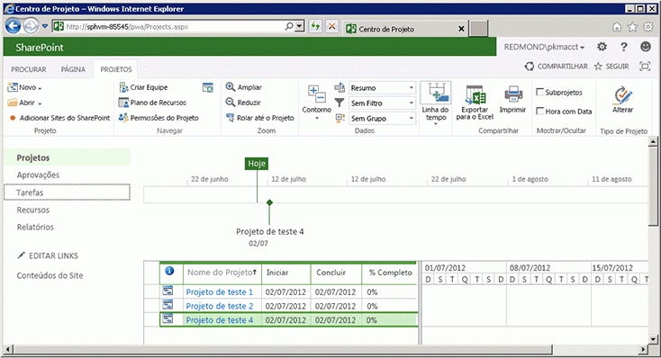

# <a name="getting-started-with-the-project-server-csom-and-net"></a>Introdução a CSOM e .NET do Project Server 

Você pode usar o CSOM (modelo de objeto do lado do cliente) do Project Server 2013 para desenvolver soluções locais e do Project Online com o .NET Framework 4. Este artigo descreve como criar um aplicativo de console que usa o CSOM para criar e publicar projetos. Depois de publicar um projeto, o aplicativo aguarda a conclusão do serviço de enfileiramento do Project Server com a ação Publicar e, em seguida, lista os projetos publicados.
  
Para uma introdução geral ao CSOM do Project Server, consulte [Atualizações para desenvolvedores no Project 2013](updates-for-developers-in-project-2013.md). Para saber sobre os tópicos de referência no namespace do CSOM, consulte [Microsoft.ProjectServer.Client](https://msdn.microsoft.com/library/Microsoft.ProjectServer.Client.aspx). 
  
## <a name="creating-a-csom-project-in-visual-studio"></a>Criar um projeto CSOM no Visual Studio
<a name="pj15_GettingStartedCSOM_CreatingVSProject"> </a>

Você pode usar o Visual Studio 2010 ou o Visual Studio 2012 para desenvolver soluções que usam CSOM do Project Server. O CSOM do Project Server contém três assemblies para desenvolvimento de aplicativos de clientes, do Microsoft Silverlight e do Windows Phone 8 usando o .NET Framework 4. O CSOM também inclui um arquivo JavaScript para desenvolvimento de aplicativos Web, como descrito em [Microsoft.ProjectServer.Client](https://msdn.microsoft.com/library/Microsoft.ProjectServer.Client.aspx) . 
  
Você pode copiar o assembly necessário do CSOM do computador do Project Server ou do download do SDK do Project 2013 para um computador remoto de desenvolvimento. O aplicativo de console **QueueCreateProject** que descrevemos neste tópico não é um aplicativo do Silverlight ou do Windows Phone 8, portanto, você precisa do assembly Microsoft.ProjectServer.Client.dll. Como o CSOM é independente da PSI (Interface do Project Server) baseada no ASMX ou no WCF, não é necessário definir as referências de serviço da PSI ou usar o namespace **Microsoft.Office.Project.Server.Library**. 
  
O aplicativo **QueueCreateProject** usa argumentos de linha de comando no nome do projeto a criar e no limite de tempo da fila. No procedimento 1, crie o aplicativo de console básico, adicione uma rotina para analisar a linha de comando e adicione uma mensagem de uso, caso haja erros na linha de comando. 
  
### <a name="procedure-1-to-create-a-csom-project-in-visual-studio"></a>Procedimento 1. Para criar um projeto CSOM no Visual Studio

1. Copie o assembly Microsoft.ProjectServer.Client.dll da pasta `%ProgramFiles%\Common Files\Microsoft Shared\Web Server Extensions\15\ISAPI\` para o computador de desenvolvimento. Copie o assembly para uma pasta conveniente para outros assemblies de referência do Project Server e do SharePoint que você venha a usar, como `C:\Project\Assemblies`.
    
2. Copie os assemblies Microsoft.SharePoint.Client.dll e Microsoft.SharePoint.Client.Runtime.dll da mesma pasta de origem para o computador de desenvolvimento. O assembly Microsoft.ProjectServer.Client.dll tem dependências nos assemblies relacionados do SharePoint.
    
3. No Visual Studio, crie um aplicativo de console do Windows e configure a estrutura de destino para o .NET Framework 4. Por exemplo, nomeie o aplicativo como QueueCreateProject.
    
   > [!NOTE]
   > Se você esquecer de definir o destino correto, depois que o Visual Studio criar o projeto, abra **Propriedades de QueueCreateProject** no menu **Projeto**. Na guia **Aplicativo**, na lista suspensa **Estrutura de Destino**, escolha **.NET Framework 4**. Não use **.NET Framework 4 Client Profile**. 
  
4. No Gerenciador de Soluções, defina as referências para os seguintes assemblies:
    
   - Microsoft.ProjectServer.Client.dll
   - Microsoft.SharePoint.Client.dll
   - Microsoft.SharePoint.Client.Runtime.dll
    
5. No arquivo Program.cs, edite as instruções `using` conforme a seguir. 
    
   ```cs
    using System;
    using System.Collections.Generic;
    using System.Linq;
    using System.Text;
    using Microsoft.ProjectServer.Client;
   ```

6. Adicione métodos para analisar os argumentos da linha de comando para o nome do projeto e o número de segundos do tempo limite da fila, para mostrar as informações de uso e para sair do aplicativo. Substitua o corpo principal do código no arquivo Program.cs com o código a seguir.
    
   ```cs
    namespace QueueCreateProject
    {
        class Program
        {
            static void Main(string[] args)
            {
                if (!ParseCommandLine(args))
                {
                    Usage();
                    ExitApp();
                }
                /* Add calls to methods here to get the project context and create a project. */
                ExitApp();
            }
            // Parse the command line. Return true if there are no errors.
            private static bool ParseCommandLine(string[] args)
            {
                bool error = false;
                int argsLen = args.Length;
                try
                {
                    for (int i = 0; i < argsLen; i++)
                    {
                        if (error) break;
                        if (args[i].StartsWith("-") || args[i].StartsWith("/"))
                            args[i] = "*" + args[i].Substring(1).ToLower();
                        switch (args[i])
                        {
                            case "*projname":
                            case "*n":
                                if (++i >= argsLen) return false;
                                projName = args[i];
                                break;
                            case "*timeout":
                            case "*t":
                                if (++i >= argsLen) return false;
                                timeoutSeconds = Convert.ToInt32(args[i]);
                                break;
                            case "*?":
                            default:
                                error = true;
                                break;
                        }
                    }
                }
                catch (FormatException)
                {
                    error = true;
                }
                if (string.IsNullOrEmpty(projName)) error = true;
                return !error;
            }
            private static void Usage()
            {
                string example = "Usage: QueueCreateProject -projName | -n \"New project name\" [-timeout | -t sec]";
                example += "\nExample: QueueCreateProject -n \"My new project\"";
                example += "\nDefault timeout seconds = " + timeoutSeconds.ToString();
                Console.WriteLine(example);
            }
            private static void ExitApp()
            {
                Console.Write("\nPress any key to exit... ");
                Console.ReadKey(true);
                Environment.Exit(0);
            }
        }
    }
   ```

## <a name="getting-the-project-context"></a>Obter o contexto de projeto
<a name="pj15_GettingStartedCSOM_GettingContext"> </a>

O desenvolvimento de CSOM requer que o objeto **ProjectContext** seja iniciado com a URL do Project Web App. O código no procedimento 2 usa a constante **pwaPath**. Se você planeja usar o aplicativo para várias instâncias do Project Web App, é possível transformar **pwaPath** em uma variável e adicionar outro argumento de linha de comando. 
  
### <a name="procedure-2-to-get-the-project-context"></a>Procedimento 2. Para obter o contexto do projeto

1. Adicione as variáveis e constantes de classe de **Program** que o aplicativo **QueueCreateProject** usará. Além da URL do Project Web App, o aplicativo usa o nome do tipo de projeto empresarial padrão (EPT), o nome do projeto a criar e um tempo limite máximo da fila em segundos. Nesse caso, a variável **timeoutSeconds** permite testar como vários valores de tempo limite afetam o aplicativo. O objeto **ProjectContext** é o objeto principal para acessar o CSOM. 
    
   ```cs
    private const string pwaPath = "https://ServerName /pwa/"; // Change the path to your Project Web App instance.
    private static string basicEpt = "Enterprise Project";   // Basic enterprise project type.
    private static string projName = string.Empty;
    private static int timeoutSeconds = 10;  // The maximum wait time for a queue job, in seconds.
    private static ProjectContext projContext;
   ```

2. Substitua o comentário `/* Add calls to methods here to get the project context and create a project. */` pelo seguinte código. O objeto **Microsoft.ProjectServer.Client.ProjectContext** inicia com a URL do Project Web App. Os métodos **CreateTestProject** e **ListPublishedProjects** são mostrados nos procedimentos 4 e 5. 
    
   ```cs
    projContext = new ProjectContext(pwaPath);
    if (CreateTestProject())
        ListPublishedProjects();
    else
        Console.WriteLine("\nProject creation failed: {0}", projName);
   ```

## <a name="getting-an-enterprise-project-type"></a>Obter um tipo de projeto empresarial
<a name="pj15_GettingStartedCSOM_GettingEPT"> </a>

O aplicativo de exemplo**QueueCreateProject** seleciona explicitamente o EPT de Projeto Empresarial para mostrar como um aplicativo pode selecionar o EPT para um projeto. Se as informações de criação do projeto não especificarem o GUID do EPT, um aplicativo usa o EPT padrão. O método **GetEptUid** é usado pelo método **CreateTestProject** descrito no procedimento 4. 
  
O método **GetEptUid** consulta o objeto **ProjectContext** pela coleção de **EnterpriseProjectTypes** em que o nome do EPT representa o nome especificado. Depois de executar a consulta, a variável **eptUid** é definida como o GUID do primeiro objeto **EnterpriseProjectType** na coleção **eptList**. Como os nomes de EPTs são exclusivos, há apenas um objeto **EnterpriseProjectType** com o nome especificado. 
  
### <a name="procedure-3-to-get-the-guid-of-an-ept-for-a-new-project"></a>Procedimento 3. Para obter o GUID de um EPT para um novo projeto

- Adicione o método **GetEptUid** à classe **Program**. 
    
   ```cs
    // Get the GUID of the specified enterprise project type.
    private static Guid GetEptUid(string eptName)
    {
        Guid eptUid = Guid.Empty;
        try
        {
            // Get the list of EPTs that have the specified name. 
            // If the EPT name exists, the list will contain only one EPT.
            var eptList = projContext.LoadQuery(
                projContext.EnterpriseProjectTypes.Where(
                    ept => ept.Name == eptName));
            projContext.ExecuteQuery();
            eptUid = eptList.First().Id;
        }
        catch (Exception ex)
        {
            string msg = string.Format("GetEptUid: eptName = \"{0}\"\n\n{1}",
                eptName, ex.GetBaseException().ToString());
            throw new ArgumentException(msg);
        }
        return eptUid;
    }
   ```

Há várias maneiras de criar um GUID de EPT. A consulta mostrada no método **GetEptUid** é eficiente, pois baixa apenas aquele objeto **EnterpriseProjectType** que corresponde ao nome do EPT. A rotina alternativa a seguir é menos eficiente porque baixa toda a lista de EPTs com o aplicativo cliente e percorre a lista. 

```cs
foreach (EnterpriseProjectType ept in projSvr.EnterpriseProjectTypes)
{
    if (ept.Name == eptName)
    {
        eptUid = ept.Id;
        break;
    }
}
```

A rotina a seguir usa uma consulta LINQ e expressões lambda para selecionar o objeto EPT, mas ainda baixa todos os objetos **EnterpriseProjectType**. 

```cs
var eptList = projContext.LoadQuery(projContext.EnterpriseProjectTypes);
projContext.ExecuteQuery();
eptUid = eptList.First(ept => ept.Name == eptName).Id;
```

## <a name="setting-the-creation-information-and-publishing-the-project"></a>Definir as informações de criação e publicação do projeto
<a name="pj15_GettingStartedCSOM_ProjectCreation"> </a>

O método **CreateTestProject** cria um objeto **ProjectCreationInformation** e especifica as informações necessárias para criar um projeto. O nome e o GUID do projeto são necessários; a data de início, a descrição do projeto e o GUID de EPT são opcionais. 
  
Depois de configurar as novas propriedades do projeto, o método **Projects.Add** adiciona o projeto à coleção **Projects**. Para salvar e publicar o projeto, você deve chamar o método **Projects.Update** para enviar uma mensagem à fila do Project Server e criar o projeto. 
  
### <a name="procedure-4-to-set-the-new-project-properties-create-the-project-and-publish-the-project"></a>Procedimento 4. Para definir as propriedades do novo projeto, criar e publicar o projeto

1. Adicione o método **CreateTestProject** à classe de **Program**. O código a seguir cria e publica um projeto, mas não aguarda a conclusão do trabalho da fila. 
    
   ```cs
    // Create a project.
    private static bool CreateTestProject()
    {
        bool projCreated = false;
        try
        {
            Console.Write("\nCreating project: {0} ...", projName);
            ProjectCreationInformation newProj = new ProjectCreationInformation();
            newProj.Id = Guid.NewGuid();
            newProj.Name = projName;
            newProj.Description = "Test creating a project with CSOM";
            newProj.Start = DateTime.Today.Date;
            // Setting the EPT GUID is optional. If no EPT is specified, Project Server  
            // uses the default EPT. 
            newProj.EnterpriseProjectTypeId = GetEptUid(basicEpt);
            PublishedProject newPublishedProj = projContext.Projects.Add(newProj);
            QueueJob qJob = projContext.Projects.Update();
            /* Add code here to wait for the queue. */
        }
        catch(Exception ex)
        {
            Console.ForegroundColor = ConsoleColor.Red;
            Console.WriteLine("\nError: {0}", ex.Message);
            Console.ResetColor();
        }
        return projCreated;
    }
   ```

2. Substitua o comentário `/* Add code here to wait for the queue. */` pelo seguinte código para aguardar pelo trabalho da fila. A rotina espera a quantidade máxima de segundos especificados em **timeoutSeconds** ou continua se o trabalho da fila for concluído antes do tempo limite. Para obter os possíveis estados de trabalho da fila, consulte [Microsoft.ProjectServer.Client.JobState](https://msdn.microsoft.com/library/Microsoft.ProjectServer.Client.JobState.aspx). 
    
   Chamar os métodos **Load** e **ExecuteQuery** para o objeto **QueueJob** é opcional. Se o objeto **QueueJob** não iniciar ao chamar o método **WaitForQueue**, o Project Server o inicia. 
    
   ```cs
    // Calling Load and ExecuteQuery for the queue job is optional.
    // projContext.Load(qJob);
    // projContext.ExecuteQuery();
    JobState jobState = projContext.WaitForQueue(qJob, timeoutSeconds);
    if (jobState == JobState.Success)
    {
        projCreated = true;
    }
    else
    {
        Console.ForegroundColor = ConsoleColor.Yellow;
        Console.WriteLine("\nThere is a problem in the queue. Timeout is {0} seconds.", 
            timeoutSeconds);
        Console.WriteLine("\tQueue JobState: {0}", jobState.ToString());
        Console.ResetColor();
    }
    Console.WriteLine();
   ```

## <a name="listing-the-published-projects"></a>Lista de projetos publicados
<a name="pj15_GettingStartedCSOM_ListingPublished"> </a>

O método **ListPublishedProjects** obtém a coleção de todos os projetos publicados no Project Web App. Se o trabalho de fila que cria um projeto no procedimento 4 não for concluído com êxito ou se o tempo limite terminar, o novo projeto não será incluído na coleção **Projects**. 
  
### <a name="procedure-5-to-list-the-published-projects"></a>Procedimento 5. Para listar os projetos publicados

1. Adicione o método **ListPublishedProjects** à classe **Program**. 
    
   ```cs
    // List the published projects.
    private static void ListPublishedProjects()
    {
        // Get the list of projects on the server.
        projContext.Load(projContext.Projects);
        projContext.ExecuteQuery();
        Console.WriteLine("\nProject ID : Project name : Created date");
        foreach (PublishedProject pubProj in projContext.Projects)
        {
            Console.WriteLine("\n\t{0} :\n\t{1} : {2}", pubProj.Id.ToString(), pubProj.Name,
                pubProj.CreatedDate.ToString());
        }
    }
   ```

2. Configure o valor correto para a URL do Project Web App, compile o aplicativo **QueueCreateProject** e teste o aplicativo conforme o procedimento 6. 
    
## <a name="testing-the-queuecreateproject-application"></a>Teste do aplicativo QueueCreateProject
<a name="pj15_GettingStartedCSOM_Testing"> </a>

Execute o aplicativo **QueueCreateProject** em uma instância de teste do Project Web App, especialmente se o Project Server estiver instalado em uma máquina virtual; o aplicativo pode precisar de mais tempo para executar do que o limite de tempo padrão da fila de dez segundos. 
  
### <a name="procedure-6-to-test-the-queuecreateproject-application"></a>Procedimento 6. Para testar o aplicativo QueueCreateProject

1. Abra a janela **Propriedades de QueueCreateProject**, selecione a guia **Depurar** e adicione os seguintes argumentos de linha de comando à seção **Opções de inicialização**: `-n "Test proj 1" -t 20`
    
   Execute o aplicativo (por exemplo, pressione **F5**). Se o valor do tempo limite for grande o suficiente, o aplicativo mostrará o seguinte resultado (se houver outros projetos publicados em sua instância do Project Web App, eles também serão mostrados):
    
   ```MS-DOS
    Creating project: Test proj 1 ...
    Project ID : Project name : Created date
            b34d7009-753f-4abb-9191-f4b15a82aac3 :
            Test proj 1 : 9/22/2011 11:27:57 AM
    Press any key to exit...
   ```

2. Execute outro teste com os seguintes argumentos de linha de comando para usar o tempo limite padrão de 10 segundos da fila: `-n "Test proj 1"`
    
   Como Test proj 1 já existe, o aplicativo mostra o resultado a seguir.
    
   ```MS-DOS
    Creating project: Test proj 1 ...
    Error: PJClientCallableException: ProjectNameAlreadyExists
    ProjectNameAlreadyExists
    projName = Test proj 1
    Project creation failed: Test proj 1
    Press any key to exit...
   ```

3. Execute outro teste com os seguintes argumentos de linha de comando para usar o tempo limite padrão de 10 segundos da fila: `-n "Test proj 2"`
    
   O aplicativo **QueueCreateProject** cria e publica o projeto chamado Test proj 2. 
    
4. Execute outro teste com os seguintes argumentos de linha de comando e configure o tempo limite para ser curto demais para permitir a conclusão do trabalho da fila: `-n "Test proj 3" -t 1`
    
   Como o tempo limite da fila é muito curto, o projeto não é criado. O aplicativo mostra o resultado a seguir.
    
   ```MS-DOS
    Creating project: Test proj 3 ...
    There is a problem in the queue. Timeout is 1 seconds.
            Queue JobState: Unknown
    Project creation failed: Test proj 3
    Press any key to exit...
   ```

5. Modifique o código para que o aplicativo não espere pelo trabalho da fila. Por exemplo, retire o comentário do código que aguarda a fila, exceto a linha `projCreated = true`, da maneira a seguir. 
    
   ```cs
    //JobState jobState = projContext.WaitForQueue(qJob, timeoutSeconds);
    //if (jobState == JobState.Success)
    //{
    projCreated = true;
    //}
    //else
    //{
    //    Console.ForegroundColor = ConsoleColor.Yellow;
    //    Console.WriteLine("\nThere is a problem in the queue. Timeout is {0} seconds.",
    //        timeoutSeconds);
    //    Console.WriteLine("\tQueue JobState: {0}", jobState.ToString());
    //    Console.ResetColor();
    //}
    
   ```

6. Compile novamente o aplicativo e execute outro teste com os seguintes argumentos de linha de comando: `-n "Test proj 4"`
    
   Como o comentário da rotina **WaitForQueue** foi retirado, o aplicativo não usa o valor do tempo limite padrão. Mesmo que o aplicativo não espere pela fila, ele poderá mostrar Test proj 4, se a ação Publicar no Project Server for rápida o suficiente. 
    
   ```MS-DOS
    Creating project: Test proj 4 ...
    Project ID : Project name : Created date
            cdd54103-082f-425c-b075-9ff52ac7d4e6 :
            Test proj 2 : 9/25/2011 4:28:55 PM
            b34d7009-753f-4abb-9191-f4b15a82aac3 :
            Test proj 1 : 9/22/2011 11:27:57 AM
            5c0c73f2-f5dd-499b-8bd8-ebb74bf8c122 :
            Test proj 4 : 9/25/2011 4:39:21 PM
    Press any key to exit...
   ```

Atualize a página do Central de Projetos no Project Web App (`https://ServerName/ProjectServerName/Projects.aspx`) para mostrar os projetos publicados. A figura a seguir mostra os projetos de teste que foram publicados.

**Verificar projetos publicados no Project Web App**


  
O aplicativo de amostra **QueueCreateProject** mostra um exemplo comum para criar uma entidade de projeto com o CSOM usando a classe **ProjectCreationInformation**, como adicionar o projeto à coleção publicada, como aguardar um trabalho de fila usando o método **WaitForQueue** e como enumerar a coleção de projetos publicados. 
  
## <a name="complete-code-example"></a>Exemplo de código completo
<a name="pj15_GettingStartedCSOM_CompleteCode"> </a>

Apresentamos a seguir o código completo para o aplicativo de exemplo **QueueCreateProject**. A referência de classe [Microsoft.ProjectServer.Client.ProjectCreationInformation](https://msdn.microsoft.com/library/Microsoft.ProjectServer.Client.ProjectCreationInformation.aspx) também inclui o código neste tópico. 
  
```cs
using System;
using System.Collections.Generic;
using System.Linq;
using System.Text;
using Microsoft.ProjectServer.Client;
namespace QueueCreateProject
{
    class Program
    {
        private const string pwaPath = "https://ServerName /pwa/"; // Change the path to your Project Web App instance.
        private static string basicEpt = "Enterprise Project";   // Basic enterprise project type.
        private static string projName = string.Empty;
        private static int timeoutSeconds = 10;  // The maximum wait time for a queue job, in seconds.
        private static ProjectContext projContext;
        static void Main(string[] args)
        {
            if (!ParseCommandLine(args))
            {
                Usage();
                ExitApp();
            }
            projContext = new ProjectContext(pwaPath);
            if (CreateTestProject())
                ListPublishedProjects();
            else
                Console.WriteLine("\nProject creation failed: {0}", projName);
            ExitApp();
        }
        // Create a project.
        private static bool CreateTestProject()
        {
            bool projCreated = false;
            try
            {
                Console.Write("\nCreating project: {0} ...", projName);
                ProjectCreationInformation newProj = new ProjectCreationInformation();
                newProj.Id = Guid.NewGuid();
                newProj.Name = projName;
                newProj.Description = "Test creating a project with CSOM";
                newProj.Start = DateTime.Today.Date;
                // Setting the EPT GUID is optional. If no EPT is specified, Project Server uses 
                // the default EPT. 
                newProj.EnterpriseProjectTypeId = GetEptUid(basicEpt);
                PublishedProject newPublishedProj = projContext.Projects.Add(newProj);
                QueueJob qJob = projContext.Projects.Update();
                // Calling Load and ExecuteQuery for the queue job is optional. If qJob is 
                // not initialized when you call WaitForQueue, Project Server initializes it.
                // projContext.Load(qJob);
                // projContext.ExecuteQuery();
                JobState jobState = projContext.WaitForQueue(qJob, timeoutSeconds);
                if (jobState == JobState.Success)
                {
                    projCreated = true;
                }
                else
                {
                    Console.ForegroundColor = ConsoleColor.Yellow;
                    Console.WriteLine("\nThere is a problem in the queue. Timeout is {0} seconds.", 
                        timeoutSeconds);
                    Console.WriteLine("\tQueue JobState: {0}", jobState.ToString());
                    Console.ResetColor();
                }
                Console.WriteLine();
            }
            catch(Exception ex)
            {
                Console.ForegroundColor = ConsoleColor.Red;
                Console.WriteLine("\nError: {0}", ex.Message);
                Console.ResetColor();
            }
            return projCreated;
        }
        // Get the GUID of the specified enterprise project type.
        private static Guid GetEptUid(string eptName)
        {
            Guid eptUid = Guid.Empty;
            try
            {
                // Get the list of EPTs that have the specified name. 
                // If the EPT name exists, the list will contain only one EPT.
                var eptList = projContext.LoadQuery(
                    projContext.EnterpriseProjectTypes.Where(
                        ept => ept.Name == eptName));
                projContext.ExecuteQuery();
                eptUid = eptList.First().Id;
                // Alternate routines to find the EPT GUID. Both (a) and (b) download the entire list of EPTs.
                // (a) Using a foreach block:
                //foreach (EnterpriseProjectType ept in projSvr.EnterpriseProjectTypes)
                //{
                //    if (ept.Name == eptName)
                //    {
                //        eptUid = ept.Id;
                //        break;
                //    }
                //}
                // (b) Querying for the EPT list, and then using a lambda expression to select the EPT:
                //var eptList = projContext.LoadQuery(projContext.EnterpriseProjectTypes);
                //projContext.ExecuteQuery();
                //eptUid = eptList.First(ept => ept.Name == eptName).Id;
            }
            catch (Exception ex)
            {
                string msg = string.Format("GetEptUid: eptName = \"{0}\"\n\n{1}",
                    eptName, ex.GetBaseException().ToString());
                throw new ArgumentException(msg);
            }
            return eptUid;
        }
        // List the published projects.
        private static void ListPublishedProjects()
        {
            // Get the list of projects on the server.
            projContext.Load(projContext.Projects);
            projContext.ExecuteQuery();
            Console.WriteLine("\nProject ID : Project name : Created date");
            foreach (PublishedProject pubProj in projContext.Projects)
            {
                Console.WriteLine("\n\t{0} :\n\t{1} : {2}", pubProj.Id.ToString(), pubProj.Name,
                    pubProj.CreatedDate.ToString());
            }
        }
        // Parse the command line. Return true if there are no errors.
        private static bool ParseCommandLine(string[] args)
        {
            bool error = false;
            int argsLen = args.Length;
            try
            {
                for (int i = 0; i < argsLen; i++)
                {
                    if (error) break;
                    if (args[i].StartsWith("-") || args[i].StartsWith("/"))
                        args[i] = "*" + args[i].Substring(1).ToLower();
                    switch (args[i])
                    {
                        case "*projname":
                        case "*n":
                            if (++i >= argsLen) return false;
                            projName = args[i];
                            break;
                        case "*timeout":
                        case "*t":
                            if (++i >= argsLen) return false;
                            timeoutSeconds = Convert.ToInt32(args[i]);
                            break;
                        case "*?":
                        default:
                            error = true;
                            break;
                    }
                }
            }
            catch (FormatException)
            {
                error = true;
            }
            if (string.IsNullOrEmpty(projName)) error = true;
            return !error;
        }
        private static void Usage()
        {
            string example = "Usage: QueueCreateProject -projName | -n \"New project name\" [-timeout | -t sec]";
            example += "\nExample: QueueCreateProject -n \"My new project\"";
            example += "\nDefault timeout seconds = " + timeoutSeconds.ToString();
            Console.WriteLine(example);
        }
        private static void ExitApp()
        {
            Console.Write("\nPress any key to exit... ");
            Console.ReadKey(true);
            Environment.Exit(0);
        }
    }
}
```

## <a name="see-also"></a>Confira também

- [Atualizações para desenvolvedores do Project 2013](updates-for-developers-in-project-2013.md) 
- [Modelo de objeto no lado do cliente (CSOM) para o Project 2013](client-side-object-model-csom-for-project-2013.md)
    

