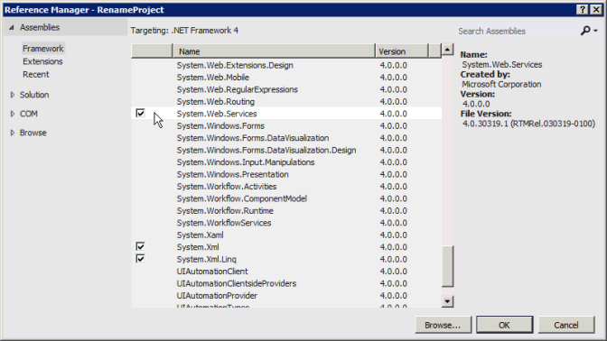

# <a name="prerequisites-for-asmx-based-code-samples-in-project"></a><span data-ttu-id="017b5-104">Pré-requisitos para exemplos de código baseados em ASMX no Project</span><span class="sxs-lookup"><span data-stu-id="017b5-104">Prerequisites for ASMX-based code samples in Project</span></span>

<span data-ttu-id="017b5-105">Conheça as informações para ajudá-lo a criar projetos no Visual Studio usando os exemplos de código baseados em ASMX que estão inclusas nos tópicos de referência da Interface do Project Server (PSI).</span><span class="sxs-lookup"><span data-stu-id="017b5-105">Learn information to help you create projects in Visual Studio by using the ASMX-based code samples that are included in the Project Server Interface (PSI) reference topics.</span></span>
  
<span data-ttu-id="017b5-106">Muitos dos exemplos de código inclusos na [Referência do serviço Web e da biblioteca de classe do Project Server 2013](https://msdn.microsoft.com/library/ef1830e0-3c9a-4f98-aa0a-5556c298e7d1%28Office.15%29.aspx) foram criados originalmente para o SDK do Office Project 2007 e usam um formato padrão para serviços Web ASMX.</span><span class="sxs-lookup"><span data-stu-id="017b5-106">Many of the code samples included in the [Project Server 2013 class library and web service reference](https://msdn.microsoft.com/library/ef1830e0-3c9a-4f98-aa0a-5556c298e7d1%28Office.15%29.aspx) were originally created for the Office Project 2007 SDK, and use a standard format for ASMX web services.</span></span> <span data-ttu-id="017b5-107">Os exemplos ainda funcionam no Project Server 2013 e foram projetados para serem copiados em um aplicativo de console e executados como uma unidade completa.</span><span class="sxs-lookup"><span data-stu-id="017b5-107">The samples still work in Project Server 2013 and are designed to be copied into a console application and run as a complete unit.</span></span> <span data-ttu-id="017b5-108">As exceções estão listadas no exemplo.</span><span class="sxs-lookup"><span data-stu-id="017b5-108">Exceptions are noted in the sample.</span></span> 
  
<span data-ttu-id="017b5-109">Os novos exemplos da PSI no SDK do Project 2013 estão de acordo com um formato que usa os serviços WCF (Windows Communication Foundation).</span><span class="sxs-lookup"><span data-stu-id="017b5-109">New PSI samples in the Project 2013 SDK conform to a format that uses Windows Communication Foundation (WCF) services.</span></span> <span data-ttu-id="017b5-110">Os exemplos baseados em ASMX também podem ser adaptados para uso com os serviços WCF.</span><span class="sxs-lookup"><span data-stu-id="017b5-110">The ASMX-based samples can also be adapted to use WCF services.</span></span> <span data-ttu-id="017b5-111">Este artigo mostra como usar os exemplos com serviços Web ASMX.</span><span class="sxs-lookup"><span data-stu-id="017b5-111">This article shows how to use the samples with ASMX web services.</span></span> <span data-ttu-id="017b5-112">Para saber mais sobre como usar os exemplos com serviços WCF, consulte [Pré-requisitos para exemplos de código baseados em WCF no Project](prerequisites-for-wcf-based-code-samples-in-project.md).</span><span class="sxs-lookup"><span data-stu-id="017b5-112">For information about using the samples with WCF services, see [Prerequisites for WCF-based code samples in Project](prerequisites-for-wcf-based-code-samples-in-project.md).</span></span>
  
> [!NOTE]
> <span data-ttu-id="017b5-113">A interface de serviço Web ASMX da PSI foi preterida no Project Server 2013, mas ainda é compatível.</span><span class="sxs-lookup"><span data-stu-id="017b5-113">The ASMX web service interface of the PSI is deprecated in Project Server 2013, but is still supported.</span></span> <span data-ttu-id="017b5-114">Se o modelo de objeto do lado do cliente (CSOM) inclui os métodos exigidos pelo aplicativo, os novos aplicativos devem ser desenvolvidos com o CSOM.</span><span class="sxs-lookup"><span data-stu-id="017b5-114">If the client-side object model (CSOM) includes the methods that your application requires, new applications should be developed with the CSOM.</span></span> <span data-ttu-id="017b5-115">O CSOM permite que os aplicativos trabalhem com o Project Online ou com uma instalação local do Project Server 2013.</span><span class="sxs-lookup"><span data-stu-id="017b5-115">The CSOM enables applications to work with Project Online or an on-premises installation of Project Server 2013.</span></span> <span data-ttu-id="017b5-116">Caso contrário, se o aplicativo usar a PSI, ele deve usar a interface WCF, que é a tecnologia que recomendamos para comunicações de rede.</span><span class="sxs-lookup"><span data-stu-id="017b5-116">Otherwise, if your application uses the PSI, it should use the WCF interface, which is the technology that we recommend for network communications.</span></span> <span data-ttu-id="017b5-117">Aplicativos que usam a interface ASMX ou WCF podem trabalhar apenas nas instalações locais do Project Server 2013.</span><span class="sxs-lookup"><span data-stu-id="017b5-117">Applications that use the ASMX interface or the WCF interface can work only for on-premises installations of Project Server 2013.</span></span> <span data-ttu-id="017b5-118">Para saber mais sobre o CSOM, consulte [Arquitetura do Project Server 2013](project-server-2013-architecture.md) e [Modelo de objeto do cliente (CSOM) para o Project 2013](client-side-object-model-csom-for-project-2013.md).</span><span class="sxs-lookup"><span data-stu-id="017b5-118">For more information about the CSOM, see [Project Server 2013 architecture](project-server-2013-architecture.md) and [Client-side object model (CSOM) for Project 2013](client-side-object-model-csom-for-project-2013.md).</span></span> 
  
<span data-ttu-id="017b5-119">Antes de executar os exemplos de código, é necessário configurar o ambiente de desenvolvimento, o aplicativo e alterar os valores constantes genéricos para corresponder ao seu ambiente.</span><span class="sxs-lookup"><span data-stu-id="017b5-119">Before running the code samples, you must set up the development environment, configure the application, and change generic constant values to match your environment.</span></span>
  
## <a name="setting-up-the-development-environment"></a><span data-ttu-id="017b5-120">Configurar o ambiente de desenvolvimento</span><span class="sxs-lookup"><span data-stu-id="017b5-120">Setting up the development environment</span></span>
<span data-ttu-id="017b5-121"><a name="pj15_PrerequisitesASMX_Setup"> </a></span><span class="sxs-lookup"><span data-stu-id="017b5-121"><a name="pj15_PrerequisitesASMX_Setup"> </a></span></span>

1. <span data-ttu-id="017b5-122">**Configurar um teste do sistema do Project Server**.</span><span class="sxs-lookup"><span data-stu-id="017b5-122">**Set up a test Project Server system**.</span></span>
    
   <span data-ttu-id="017b5-123">Use um teste de sistema do Project Server sempre que for desenvolver ou testar.</span><span class="sxs-lookup"><span data-stu-id="017b5-123">Use a test Project Server system whenever you are developing or testing.</span></span> <span data-ttu-id="017b5-124">Mesmo quando o código funciona perfeitamente, as dependências entre projetos, os relatórios ou outros fatores do ambiente podem causar consequências indesejadas.</span><span class="sxs-lookup"><span data-stu-id="017b5-124">Even when your code works perfectly, interproject dependencies, reporting, or other environmental factors can cause unintended consequences.</span></span> 
    
   > [!NOTE]
   > <span data-ttu-id="017b5-125">Certifique-se de que você seja um usuário válido no servidor e verifique se tem permissões suficientes para as chamadas da PSI usadas pelo aplicativo.</span><span class="sxs-lookup"><span data-stu-id="017b5-125">Ensure that you are a valid user on the server, and check that you have sufficient permissions for the PSI calls that your application uses.</span></span> <span data-ttu-id="017b5-126">O tópico de referência para cada método PSI inclui uma tabela de permissões do Project Server.</span><span class="sxs-lookup"><span data-stu-id="017b5-126">The reference topic for each PSI method includes a Project Server Permissions table.</span></span> <span data-ttu-id="017b5-127">Por exemplo, o método [Project.QueueCreateProject](https://msdn.microsoft.com/library/WebSvcProject.Project.QueueCreateProject.aspx) requer a permissão global **NewProject** e a permissão **SaveProjectTemplate**.</span><span class="sxs-lookup"><span data-stu-id="017b5-127">For example, the [Project.QueueCreateProject](https://msdn.microsoft.com/library/WebSvcProject.Project.QueueCreateProject.aspx) method requires the global **NewProject** permission and the **SaveProjectTemplate** permission.</span></span> 
  
   <span data-ttu-id="017b5-128">Em alguns casos, você precisa fazer depuração remota no servidor.</span><span class="sxs-lookup"><span data-stu-id="017b5-128">In some cases, you may have to do remote debugging on the server.</span></span> <span data-ttu-id="017b5-129">Você também pode ter que configurar um manipulador de eventos instalando um assembly de manipulador de eventos em cada computador do Project Server no farm do SharePoint e, em seguida, configurar o manipulador de eventos para a instância do Project Web App usando a página Configurações do Project Server em Configurações Gerais de Aplicativos da Administração Central do SharePoint.</span><span class="sxs-lookup"><span data-stu-id="017b5-129">You may also have to set up an event handler by installing an event handler assembly on each Project Server computer in the SharePoint farm, and then configuring the event handler for the Project Web App instance by using the Project Server Settings page in the General Application Settings of SharePoint Central Administration.</span></span>
    
2. <span data-ttu-id="017b5-130">**Configure um computador de desenvolvimento.**</span><span class="sxs-lookup"><span data-stu-id="017b5-130">**Set up a development computer.**</span></span>
    
   <span data-ttu-id="017b5-131">Normalmente você acessa a PSI por uma rede.</span><span class="sxs-lookup"><span data-stu-id="017b5-131">You usually access the PSI through a network.</span></span> <span data-ttu-id="017b5-132">Os exemplos de código foram projetados para serem executados em um cliente separado do servidor, exceto quando indicado.</span><span class="sxs-lookup"><span data-stu-id="017b5-132">The code samples are designed to be run on a client that is separate from the server, except where noted.</span></span>
    
   1. <span data-ttu-id="017b5-133">**Instale a versão correta do Visual Studio.**</span><span class="sxs-lookup"><span data-stu-id="017b5-133">**Install the correct version of Visual Studio.**</span></span> <span data-ttu-id="017b5-134">Exceto quando indicado, os exemplos de código são escritos em Visual C#.</span><span class="sxs-lookup"><span data-stu-id="017b5-134">Except where noted, the code samples are written in Visual C#.</span></span> <span data-ttu-id="017b5-135">Eles podem ser usados no Visual Studio 2010 ou Visual Studio 2012.</span><span class="sxs-lookup"><span data-stu-id="017b5-135">They can be used with Visual Studio 2010 or Visual Studio 2012.</span></span> <span data-ttu-id="017b5-136">Certifique-se de ter o service pack mais recente instalado.</span><span class="sxs-lookup"><span data-stu-id="017b5-136">Ensure that you have the most recent service pack installed.</span></span> 
        
   2. <span data-ttu-id="017b5-137">**Copie as DLLs do Project Server para o computador de desenvolvimento.**</span><span class="sxs-lookup"><span data-stu-id="017b5-137">**Copy Project Server DLLs to the development computer.**</span></span> <span data-ttu-id="017b5-138">Copie os seguintes assemblies de `[Program Files]\Microsoft Office Servers\15.0\Bin` no computador do Project Server para o computador de desenvolvimento:</span><span class="sxs-lookup"><span data-stu-id="017b5-138">Copy the following assemblies from  `[Program Files]\Microsoft Office Servers\15.0\Bin` on the Project Server computer to the development computer:</span></span> 
        
      - <span data-ttu-id="017b5-139">Microsoft.Office.Project.Server.Events.Receivers.dll</span><span class="sxs-lookup"><span data-stu-id="017b5-139">Microsoft.Office.Project.Server.Events.Receivers.dll</span></span>
      - <span data-ttu-id="017b5-140">Microsoft.Office.Project.Server.Library.dll</span><span class="sxs-lookup"><span data-stu-id="017b5-140">Microsoft.Office.Project.Server.Library.dll</span></span>
        
   3. <span data-ttu-id="017b5-141">Para saber mais sobre como compilar e usar o assembly de proxy ProjectServerServices.dll para os serviços Web ASMX no PSI, consulte [Usar um assembly proxy PSI e as descrições do IntelliSense](#pj15_PrerequisitesASMX_BuildingProxy).</span><span class="sxs-lookup"><span data-stu-id="017b5-141">For information about how to compile and use the ProjectServerServices.dll proxy assembly for the ASMX web services in the PSI, see [Using a PSI proxy assembly and IntelliSense descriptions](#pj15_PrerequisitesASMX_BuildingProxy).</span></span>
    
3. <span data-ttu-id="017b5-142">**Instale os arquivos do IntelliSense.**</span><span class="sxs-lookup"><span data-stu-id="017b5-142">**Install the IntelliSense files.**</span></span>
    
    <span data-ttu-id="017b5-143">Para usar as descrições do IntelliSense para classes e membros em assemblies do Project Server, copie os arquivos XML atualizados do IntelliSense do download do SDK no Project 2013 para o mesmo diretório em que estão localizados os assemblies do Project Server.</span><span class="sxs-lookup"><span data-stu-id="017b5-143">To use IntelliSense descriptions for classes and members in Project Server assemblies, copy the updated IntelliSense XML files from the Project 2013 SDK download to the same directory where the Project Server assemblies are located.</span></span> <span data-ttu-id="017b5-144">Por exemplo, copie o arquivo Microsoft.Office.Project.Server.Library.xml para o diretório em que o aplicativo definirá uma referência para o assembly Microsoft.Office.Project.Server.Library.dll.</span><span class="sxs-lookup"><span data-stu-id="017b5-144">For example, copy the Microsoft.Office.Project.Server.Library.xml file to the directory where your application will set a reference to the Microsoft.Office.Project.Server.Library.dll assembly.</span></span>
    
    <span data-ttu-id="017b5-145">As descrições do IntelliSense de serviços Web PSI exigem que você crie um assembly de proxy PSI usando o script CompileASMXProxyAssembly.cmd no subdiretório `Documentation\IntelliSense\WSDL` no download do SDK do Project 2013.</span><span class="sxs-lookup"><span data-stu-id="017b5-145">IntelliSense descriptions for the PSI web services require that you create a PSI proxy assembly by using the CompileASMXProxyAssembly.cmd script in the  `Documentation\IntelliSense\WSDL` subdirectory in the Project 2013 SDK download.</span></span> <span data-ttu-id="017b5-146">O script cria o assembly de proxy ProjectServerServices.dll baseado no ASMX.</span><span class="sxs-lookup"><span data-stu-id="017b5-146">The script creates the ASMX-based ProjectServerServices.dll proxy assembly.</span></span> <span data-ttu-id="017b5-147">Para saber mais, consulte o arquivo [ReadMe_IntelliSense] no download do SDK.</span><span class="sxs-lookup"><span data-stu-id="017b5-147">For more information, see the [ReadMe_IntelliSense] file in the SDK download.</span></span> 
    
## <a name="creating-the-application-and-adding-a-web-service-reference"></a><span data-ttu-id="017b5-148">Criar o aplicativo e adicionar uma referência ao serviço Web</span><span class="sxs-lookup"><span data-stu-id="017b5-148">Creating the application and adding a web service reference</span></span>
<span data-ttu-id="017b5-149"><a name="pj15_PrerequisitesASMX_Configure"> </a></span><span class="sxs-lookup"><span data-stu-id="017b5-149"><a name="pj15_PrerequisitesASMX_Configure"> </a></span></span>

1. <span data-ttu-id="017b5-150">**Criar um aplicativo de console**.</span><span class="sxs-lookup"><span data-stu-id="017b5-150">**Create a console application**.</span></span>
    
   <span data-ttu-id="017b5-151">Ao criar um aplicativo de console, na lista suspensa da caixa de diálogo **Novo projeto**, selecione **.NET Framework 4**.</span><span class="sxs-lookup"><span data-stu-id="017b5-151">When you create a console application, in the drop-down list of the **New Project** dialog box, select **.NET Framework 4**.</span></span> <span data-ttu-id="017b5-152">Você pode copiar o código de exemplo da PSI para o novo aplicativo.</span><span class="sxs-lookup"><span data-stu-id="017b5-152">You can copy the PSI example code into the new application.</span></span>
    
2. <span data-ttu-id="017b5-153">**Adicione a referência necessária para ASMX.**</span><span class="sxs-lookup"><span data-stu-id="017b5-153">**Add the reference required for ASMX.**</span></span>
    
   <span data-ttu-id="017b5-154">No Gerenciador de Soluções, adicione uma referência para **System.Web.Services** (veja a Figura 1).</span><span class="sxs-lookup"><span data-stu-id="017b5-154">In Solution Explorer, add a reference to **System.Web.Services** (see Figure 1).</span></span> 
    
   <span data-ttu-id="017b5-155">**Figura 1. Adicionar uma referência no Visual Studio**</span><span class="sxs-lookup"><span data-stu-id="017b5-155">**Figure 1. Adding a reference in Visual Studio**</span></span>

   <span data-ttu-id="017b5-156"></span><span class="sxs-lookup"><span data-stu-id="017b5-156"></span></span>
  
3. <span data-ttu-id="017b5-157">**Copie o código**.</span><span class="sxs-lookup"><span data-stu-id="017b5-157">**Copy the code**.</span></span>
    
   <span data-ttu-id="017b5-158">Copie o exemplo de código completo no arquivo Program.cs do aplicativo de console.</span><span class="sxs-lookup"><span data-stu-id="017b5-158">Copy the complete code example into the Program.cs file of the console application.</span></span>
    
4. <span data-ttu-id="017b5-159">**Configure o namespace do aplicativo de exemplo**.</span><span class="sxs-lookup"><span data-stu-id="017b5-159">**Set the namespace for the sample application**.</span></span>
    
   <span data-ttu-id="017b5-160">É possível alterar o namespace listado na parte superior do exemplo para o namespace padrão do aplicativo, ou alterar o namespace do aplicativo padrão para corresponder ao exemplo.</span><span class="sxs-lookup"><span data-stu-id="017b5-160">You can either change the namespace listed at the top of the sample to the application default namespace, or change the default application namespace to match the sample.</span></span> <span data-ttu-id="017b5-161">É possível alterar o namespace do aplicativo padrão alterando as propriedades do aplicativo.</span><span class="sxs-lookup"><span data-stu-id="017b5-161">You can change the default application namespace by changing the application properties.</span></span>
    
   <span data-ttu-id="017b5-162">Por exemplo, o código de exemplo [QueueRenameProject](https://msdn.microsoft.com/library/WebSvcProject.Project.QueueRenameProject.aspx) tem o namespace **Microsoft.SDK.Project.Samples.RenameProject**.</span><span class="sxs-lookup"><span data-stu-id="017b5-162">For example, the code sample for [QueueRenameProject](https://msdn.microsoft.com/library/WebSvcProject.Project.QueueRenameProject.aspx) has the namespace **Microsoft.SDK.Project.Samples.RenameProject**.</span></span> <span data-ttu-id="017b5-163">Se o nome do projeto do Visual Studio for **RenameProject**, copie o namespace do arquivo Program.cs e abra o painel **Propriedades** do projeto (no menu **Projetos**, escolha **Propriedades de RenameProject**).</span><span class="sxs-lookup"><span data-stu-id="017b5-163">If the name of the Visual Studio project is **RenameProject**, copy the namespace from the Program.cs file, and then open the project **Properties** pane (on the **Project** menu, choose **RenameProject Properties**).</span></span> <span data-ttu-id="017b5-164">Na guia **Aplicativo**, copie o namespace na caixa de texto **Namespace padrão**.</span><span class="sxs-lookup"><span data-stu-id="017b5-164">On the **Application** tab, copy the namespace into the **Default namespace** text box.</span></span> 
    
5. <span data-ttu-id="017b5-165">**Defina as referências Web**.</span><span class="sxs-lookup"><span data-stu-id="017b5-165">**Set the web references**.</span></span>
    
   <span data-ttu-id="017b5-166">A maioria dos exemplos exige uma referência a um ou mais dos serviços Web da PSI.</span><span class="sxs-lookup"><span data-stu-id="017b5-166">Most examples require a reference to one or more of the PSI web services.</span></span> <span data-ttu-id="017b5-167">Eles estão listados no próprio exemplo ou nos comentários que precedem o exemplo.</span><span class="sxs-lookup"><span data-stu-id="017b5-167">These are listed in the sample itself or in comments that precede the sample.</span></span> <span data-ttu-id="017b5-168">Para obter o namespace correto de referências Web, certifique-se de que definiu primeiro o namespace de aplicativo padrão.</span><span class="sxs-lookup"><span data-stu-id="017b5-168">To get the correct namespace of the web references, ensure that you first set the default application namespace.</span></span>
    
   <span data-ttu-id="017b5-169">Há três maneiras de adicionar uma referência de serviço Web ASMX para a PSI:</span><span class="sxs-lookup"><span data-stu-id="017b5-169">There are three ways to add an ASMX web service reference for the PSI:</span></span>
    
   - <span data-ttu-id="017b5-170">Compilar um assembly de proxy da PSI denominado ProjectServerServices.dll e definir uma referência para o assembly.</span><span class="sxs-lookup"><span data-stu-id="017b5-170">Build a PSI proxy assembly named ProjectServerServices.dll, and then set a reference to the assembly.</span></span> <span data-ttu-id="017b5-171">Obter o IntelliSense, essa é a maneira recomendada para adicionar uma referência à PSI.</span><span class="sxs-lookup"><span data-stu-id="017b5-171">To get IntelliSense, this is the recommended way to add a PSI reference.</span></span> <span data-ttu-id="017b5-172">Consulte [Usar um assembly proxy PSI e as descrições do IntelliSense](#pj15_PrerequisitesASMX_BuildingProxy).</span><span class="sxs-lookup"><span data-stu-id="017b5-172">See [Using a PSI proxy assembly and IntelliSense descriptions](#pj15_PrerequisitesASMX_BuildingProxy).</span></span>
    
   - <span data-ttu-id="017b5-173">Adicionar um arquivo de proxy de saída wsdl.exe à solução do Visual Studio.</span><span class="sxs-lookup"><span data-stu-id="017b5-173">Add a proxy file from the wsdl.exe output to the Visual Studio solution.</span></span> <span data-ttu-id="017b5-174">Consulte [Adicionar um arquivo proxy PSI](#pj15_PrerequisitesASMX_AddingProxyFile).</span><span class="sxs-lookup"><span data-stu-id="017b5-174">See [Adding a PSI proxy file](#pj15_PrerequisitesASMX_AddingProxyFile).</span></span>
    
   - <span data-ttu-id="017b5-175">Adicionar uma referência de serviço Web usando o Visual Studio.</span><span class="sxs-lookup"><span data-stu-id="017b5-175">Add a web service reference by using Visual Studio.</span></span> <span data-ttu-id="017b5-176">Consulte [Adicionar uma referência de serviço Web](#pj15_PrerequisitesASMX_AddingServiceReference).</span><span class="sxs-lookup"><span data-stu-id="017b5-176">See [Adding a web service reference](#pj15_PrerequisitesASMX_AddingServiceReference).</span></span>

<span data-ttu-id="017b5-177"><a name="pj15_PrerequisitesASMX_BuildingProxy"> </a></span><span class="sxs-lookup"><span data-stu-id="017b5-177"><a name="pj15_PrerequisitesASMX_BuildingProxy"> </a></span></span>

### <a name="using-a-psi-proxy-assembly-and-intellisense-descriptions"></a><span data-ttu-id="017b5-178">Usar um assembly proxy PSI e as descrições do IntelliSense</span><span class="sxs-lookup"><span data-stu-id="017b5-178">Using a PSI proxy assembly and IntelliSense descriptions</span></span>

<span data-ttu-id="017b5-179">Você pode compilar e usar o assembly de proxy ProjectServerServices.dll para todos os serviços Web baseados em ASMX da PSI, usando o script CompileASMXProxyAssembly.cmd na pasta `Documentation\IntelliSense\WSDL` do download do SDK do Project 2013.</span><span class="sxs-lookup"><span data-stu-id="017b5-179">You can build and use the ProjectServerServices.dll proxy assembly for all ASMX-based web services in the PSI, by using the CompileASMXProxyAssembly.cmd script in the  `Documentation\IntelliSense\WSDL` folder of the Project 2013 SDK download.</span></span> <span data-ttu-id="017b5-180">Para obter um link para baixar, consulte [Documentação de desenvolvedor do Project 2013](project-2013-developer-documentation.md).</span><span class="sxs-lookup"><span data-stu-id="017b5-180">For a link to the download, see [Project 2013 developer documentation](project-2013-developer-documentation.md).</span></span>
  
> [!NOTE]
> <span data-ttu-id="017b5-181">Ao extrair os arquivos de proxy de origem do arquivo Source.zip, os arquivos na pasta `Documentation\IntelliSense\WSDL\Source` são atualizados a partir da data de publicação do download do SDK do Project 2013.</span><span class="sxs-lookup"><span data-stu-id="017b5-181">When you extract the proxy source files from the Source.zip file, the files in the  `Documentation\IntelliSense\WSDL\Source` folder are current as of the publication date of the Project 2013 SDK download.</span></span> <span data-ttu-id="017b5-182">Para gerar os arquivos de proxy de origem atualizados da PSI, execute o script GenASMXProxyAssembly.cmd no computador do Project Server.</span><span class="sxs-lookup"><span data-stu-id="017b5-182">To generate updated PSI proxy source files, run the GenASMXProxyAssembly.cmd script on the Project Server computer.</span></span> <span data-ttu-id="017b5-183">Os scripts na pasta `Documentation\IntelliSense\WCF` não funcionam para aplicativos baseados em ASMX.</span><span class="sxs-lookup"><span data-stu-id="017b5-183">The scripts in the  `Documentation\IntelliSense\WCF` folder do not work for ASMX-based applications.</span></span> <span data-ttu-id="017b5-184">O script GenWCFProxyAssembly.cmd chama o SvcUtil.exe, que gera os arquivos de código de origem para os serviços WCF.</span><span class="sxs-lookup"><span data-stu-id="017b5-184">The GenWCFProxyAssembly.cmd script calls SvcUtil.exe, which generates source code files for the WCF services.</span></span> <span data-ttu-id="017b5-185">Os arquivos de proxy WCF incluem atributos diferentes, a interface de canal e uma classe de cliente para cada serviço da PSI.</span><span class="sxs-lookup"><span data-stu-id="017b5-185">The WCF proxy files include different attributes, the channel interface, and a client class for each PSI service.</span></span> <span data-ttu-id="017b5-186">Por exemplo, o serviço Resource baseado em WCF inclui a interface **ResourceChannel**, a interface **Resource** e a classe **ResourceClient**.</span><span class="sxs-lookup"><span data-stu-id="017b5-186">For example, the WCF-based Resource service includes the **ResourceChannel** interface, the **Resource** interface, and the **ResourceClient** class.</span></span> <span data-ttu-id="017b5-187">O serviço Web Resource baseado em ASMX inclui a classe **Resource** com algumas propriedades diferentes.</span><span class="sxs-lookup"><span data-stu-id="017b5-187">The ASMX-based Resource web includes the **Resource** class with some different properties.</span></span> 
  
<span data-ttu-id="017b5-188">A seguir temos o script GenASMXProxyAssembly.cmd, que gera os arquivos de saída WSDL para os serviços Web da PSI e compila o assembly.</span><span class="sxs-lookup"><span data-stu-id="017b5-188">Following is the GenASMXProxyAssembly.cmd script that generates WSDL output files for the PSI web services, and then compiles the assembly.</span></span>
  
```MS-DOS
@echo off
@ECHO ---------------------------------------------------
@ECHO Creating C# files for the ASMX-based proxy assembly
@ECHO ---------------------------------------------------
REM Replace ServerName with the name of the server and 
REM the instance name of Project Web App. Do not use localhost.
(set VDIR=https://ServerName/pwa/_vti_bin/psi)
(set OUTDIR=.\Source)
REM ** Wsdl.exe is the same version in the v6.0A and v7.0A subdirectories. 
(set WSDL="C:\Program Files (x86)\Microsoft SDKs\Windows\v7.0A\Bin\x64\wsdl.exe")
if not exist %OUTDIR% (
md %OUTDIR%
)
for /F %%i in (Classlist_asmx.txt) do %WSDL% /nologo /l:CS /namespace:Svc%%i /out:%OUTDIR%\wsdl.%%i.cs %VDIR%/%%i.asmx?wsdl 
@ECHO ----------------------------
@ECHO Compiling the proxy assembly
@ECHO ----------------------------
(set SOURCE=%OUTDIR%\wsdl)
(set CSC=%WINDIR%\Microsoft.NET\Framework64\v4.0.30319\csc.exe)
(set ASSEMBLY_NAME=ProjectServerServices.dll)
%CSC% /t:library /out:%ASSEMBLY_NAME% %SOURCE%*.cs
```

<span data-ttu-id="017b5-189">O script usa o arquivo ClassList_asmx.txt, que contém a lista de serviços Web disponíveis para desenvolvedores terceirizados.</span><span class="sxs-lookup"><span data-stu-id="017b5-189">The script uses the ClassList_asmx.txt file, which contains the list of web services that are available for third-party developers.</span></span>
  
```text
Admin
Archive
Calendar
CubeAdmin
CustomFields
Driver
Events
LoginForms
LoginWindows
LookupTable
Notifications
ObjectLinkProvider
PortfolioAnalyses
Project
QueueSystem
ResourcePlan
Resource
Security
Statusing
TimeSheet
Workflow
WssInterop
```

<span data-ttu-id="017b5-190">Os scripts criam um assembly chamado ProjectServerServices.dll.</span><span class="sxs-lookup"><span data-stu-id="017b5-190">The scripts create an assembly named ProjectServerServices.dll.</span></span> <span data-ttu-id="017b5-191">Evite confundi-lo com ProjectServerServices.dll do assembly baseado em WCF.</span><span class="sxs-lookup"><span data-stu-id="017b5-191">Avoid confusing it with ProjectServerServices.dll for the WCF-based assembly.</span></span> <span data-ttu-id="017b5-192">Os nomes dos assemblies são iguais, para permitir o uso de qualquer assembly com o arquivo ProjectServerServices.xml do IntelliSense.</span><span class="sxs-lookup"><span data-stu-id="017b5-192">The assembly names are the same, to enable using either assembly with the ProjectServerServices.xml IntelliSense file.</span></span>
  
<span data-ttu-id="017b5-193">O namespace arbitrário criado pelos scripts para os serviços Web ASMX e WCF é o mesmo, para que o arquivo ProjectServerServices.xml do IntelliSense funcione com ambos os assemblies.</span><span class="sxs-lookup"><span data-stu-id="017b5-193">The arbitrary namespace created by the scripts for both the ASMX web services and the WCF services is the same, so that the ProjectServerServices.xml IntelliSense file works with either assembly.</span></span> <span data-ttu-id="017b5-194">Por exemplo, o namespace do serviço Resource no assembly de proxy baseado em WCF e no assembly de proxy baseado no ASMX é **SvcResource**.</span><span class="sxs-lookup"><span data-stu-id="017b5-194">For example, the namespace of the Resource service in the WCF-based proxy assembly and in the ASMX-based proxy assembly is **SvcResource**.</span></span> <span data-ttu-id="017b5-195">Claro que você pode alterar os nomes dos namespaces, se garantir que eles correspondam no assembly de proxy e no arquivo ProjectServerServices.xml do IntelliSense.</span><span class="sxs-lookup"><span data-stu-id="017b5-195">You can, of course, change the namespace names—if you ensure that they match in the proxy assembly and in the ProjectServerServices.xml IntelliSense file.</span></span>
  
<span data-ttu-id="017b5-196">Se um exemplo de código usa um nome diferente para um namespace de serviço Web da PSI, por exemplo, **ProjectWebSvc**, para o IntelliSense funcionar, você deve alterar o exemplo para usar **SvcProject** de modo que o namespace corresponda no assembly de proxy.</span><span class="sxs-lookup"><span data-stu-id="017b5-196">If a code sample uses a different name for a PSI web service namespace, for example **ProjectWebSvc**, for IntelliSense to work you must change the sample to use **SvcProject** so that the namespace matches the proxy assembly.</span></span> 
  
<span data-ttu-id="017b5-197">Uma vantagem de usar o assembly de proxy baseado em ASMX é que ele inclui todos os namespaces de serviço Web da PSI; você não precisa criar várias referências Web.</span><span class="sxs-lookup"><span data-stu-id="017b5-197">An advantage to using the ASMX-based proxy assembly is that it includes all PSI web service namespaces; you do not have to create multiple web references.</span></span> <span data-ttu-id="017b5-198">Outra vantagem é que, se você adicionar o arquivo ProjectServerServices.xml no mesmo diretório em que definiu uma referência para o assembly de proxy ProjectServerServices.dll, poderá obter as descrições do IntelliSense para membros e classes da PSI.</span><span class="sxs-lookup"><span data-stu-id="017b5-198">Another advantage is that, if you add the ProjectServerServices.xml file to the same directory where you set a reference to the ProjectServerServices.dll proxy assembly, you can get IntelliSense descriptions for the PSI classes and members.</span></span> <span data-ttu-id="017b5-199">A figura 2 mostra o texto do IntelliSense para o método **Project.QueueCreateProject**.</span><span class="sxs-lookup"><span data-stu-id="017b5-199">Figure 2 shows the IntelliSense text for the **Project.QueueCreateProject** method.</span></span> <span data-ttu-id="017b5-200">Para saber mais, consulte o arquivo [ReadMe_IntelliSense] na pasta IntelliSense do download do SDK do Project 2013.</span><span class="sxs-lookup"><span data-stu-id="017b5-200">For more information, see the [ReadMe_IntelliSense] file in the IntelliSense folder of the Project 2013 SDK download.</span></span> 
  
<span data-ttu-id="017b5-201">**Figura 2. Usar o IntelliSense para um método no serviço Web do Project**</span><span class="sxs-lookup"><span data-stu-id="017b5-201">**Figure 2. Using IntelliSense for a method in the Project web service**</span></span>

<span data-ttu-id="017b5-202"></span><span class="sxs-lookup"><span data-stu-id="017b5-202"></span></span>
  
<span data-ttu-id="017b5-203">As desvantagens de usar o assembly de proxy são que a solução é maior e você deve distribuir e instalar o assembly de proxy com a solução.</span><span class="sxs-lookup"><span data-stu-id="017b5-203">Disadvantages to using the proxy assembly are that the solution is larger and you must distribute and install the proxy assembly with the solution.</span></span> <span data-ttu-id="017b5-204">Você também deve usar os mesmos namespaces contidos nos arquivos do IntelliSense e do assembly de proxy, a menos que altere o script e o arquivo ProjectServerServices.xml do IntelliSense para usar namespaces diferentes.</span><span class="sxs-lookup"><span data-stu-id="017b5-204">You must also use the same namespaces that are in the proxy assembly and IntelliSense files, unless you change the script and ProjectServerServices.xml IntelliSense file to use different namespaces.</span></span>
  
### <a name="adding-a-psi-proxy-file"></a><span data-ttu-id="017b5-205">Adicionar um arquivo de proxy da PSI</span><span class="sxs-lookup"><span data-stu-id="017b5-205">Adding a PSI proxy file</span></span>
<span data-ttu-id="017b5-206"><a name="pj15_PrerequisitesASMX_AddingProxyFile"> </a></span><span class="sxs-lookup"><span data-stu-id="017b5-206"><a name="pj15_PrerequisitesASMX_AddingProxyFile"> </a></span></span>

<span data-ttu-id="017b5-207">O download de SDK do Project 2013 inclui os arquivos de origem gerados pelo comando Wsdl.exe para o assembly de proxy.</span><span class="sxs-lookup"><span data-stu-id="017b5-207">The Project 2013 SDK download includes the source files generated by the Wsdl.exe command for the proxy assembly.</span></span> <span data-ttu-id="017b5-208">Os arquivos de origem estão em Source.zip, na subpasta `Documentation\IntelliSense\ASMX`.</span><span class="sxs-lookup"><span data-stu-id="017b5-208">The source files are in Source.zip in the  `Documentation\IntelliSense\ASMX` subdirectory.</span></span> <span data-ttu-id="017b5-209">Ao invés de definir uma referência para o assembly de proxy, é possível adicionar um ou mais arquivos de origem à solução do Visual Studio.</span><span class="sxs-lookup"><span data-stu-id="017b5-209">Instead of setting a reference to the proxy assembly, you can add one or more of the source files to a Visual Studio solution.</span></span> <span data-ttu-id="017b5-210">Por exemplo, depois de executar o script GenASMXProxyAssembly.cmd, adicione o arquivo wsdl.Project.cs na solução.</span><span class="sxs-lookup"><span data-stu-id="017b5-210">For example, after running the GenASMXProxyAssembly.cmd script, add the wsdl.Project.cs file to the solution.</span></span> <span data-ttu-id="017b5-211">Ao invés de executar o script, é possível executar os comandos a seguir para gerar um único arquivo de origem, por exemplo:</span><span class="sxs-lookup"><span data-stu-id="017b5-211">Instead of running the script, you can run the following commands to generate a single source file, for example:</span></span> 
  
```MS-DOS
set VDIR=https://ServerName/ProjectServerName/_vti_bin/psi
set WSDL="C:\Program Files (x86)\Microsoft SDKs\Windows\v7.0A\Bin\x64\wsdl.exe"
%WSDL% /nologo /l:cs /namespace:SvcProject /out:wsdl.Project.cs %VDIR%/Project.asmx?wsdl
```

<span data-ttu-id="017b5-212">Para definir um objeto **Project** como uma variável de classe chamada **project**, use o seguinte código.</span><span class="sxs-lookup"><span data-stu-id="017b5-212">To define a **Project** object as a class variable named **project**, use the following code.</span></span> <span data-ttu-id="017b5-213">O método **AddContextInfo** adiciona as informações de contexto no objeto **project** para autenticação baseada em formulários e autenticação do Windows.</span><span class="sxs-lookup"><span data-stu-id="017b5-213">The **AddContextInfo** method adds the context information to the **project** object for Windows authentication and Forms-based authentication.</span></span> 
  
```cs
private static SvcProject.Project project;
private static SvcLoginForms.LoginForms loginForms =
            new SvcLoginForms.LoginForms();
. . .
public void AddContextInfo()
{
    // Add the Url property.
    project.Url = "https://ServerName /ProjectServerName /_vti_bin/psi/project.asmx";
    // Add Windows credentials.
    project.Credentials = CredentialCache.DefaultCredentials;
    // If Forms authentication is used, add the Project Server cookie.
    project.CookieContainer = loginForms.CookieContainer;
}
```

> [!NOTE]
> <span data-ttu-id="017b5-214">Se você usar um assembly de proxy da PSI ou adicionar um arquivo de proxy a uma referência de serviço do Project chamada **SvcProject**, deverá usar o mesmo código para criar um objeto **project**.</span><span class="sxs-lookup"><span data-stu-id="017b5-214">Whether you use a PSI proxy assembly or add a proxy file for a Project service reference named **SvcProject**, you would use the same code to create a **project** object.</span></span> 
  
### <a name="adding-a-web-service-reference"></a><span data-ttu-id="017b5-215">Adicionar uma referência de serviço Web</span><span class="sxs-lookup"><span data-stu-id="017b5-215">Adding a web service reference</span></span>
<span data-ttu-id="017b5-216"><a name="pj15_PrerequisitesASMX_AddingServiceReference"> </a></span><span class="sxs-lookup"><span data-stu-id="017b5-216"><a name="pj15_PrerequisitesASMX_AddingServiceReference"> </a></span></span>

<span data-ttu-id="017b5-217">Se você não usar o assembly de proxy baseado em ASMX ou adicionar um arquivo de saída WSDL, pode definir uma ou mais referências Web individuais.</span><span class="sxs-lookup"><span data-stu-id="017b5-217">If you do not use the ASMX-based proxy assembly or add a WSDL output file, you can set one or more individual web references.</span></span> <span data-ttu-id="017b5-218">As etapas a seguir mostram como definir uma referência Web usando o Visual Studio 2012.</span><span class="sxs-lookup"><span data-stu-id="017b5-218">The following steps show how to set a web reference by using Visual Studio 2012.</span></span>
  
1. <span data-ttu-id="017b5-219">No **Gerenciador de Soluções**, clique com botão direito do mouse na pasta **Referências** e, em seguida, escolha **Adicionar Referência de Serviço**.</span><span class="sxs-lookup"><span data-stu-id="017b5-219">In **Solution Explorer**, right-click the **References** folder, and then choose **Add Service Reference**.</span></span> 
    
2. <span data-ttu-id="017b5-220">Na caixa de diálogo **Adicionar Referência de Serviço**, escolha **Avançado**.</span><span class="sxs-lookup"><span data-stu-id="017b5-220">In the **Add Service Reference** dialog box, choose **Advanced**.</span></span>
    
3. <span data-ttu-id="017b5-221">Na caixa de diálogo **Configurações de Referência de Serviço**, escolha **Adicionar Referência Web**.</span><span class="sxs-lookup"><span data-stu-id="017b5-221">In the **Service Reference Settings** dialog box, choose **Add Web Reference**.</span></span>
    
4. <span data-ttu-id="017b5-222">Na caixa de texto **URL**, digite `https:// _ServerName_/ _ProjectServerName_/_vti_bin/psi/ _ServiceName_.asmx?wsdl` e pressione **Enter** ou escolha o ícone **Ir**.</span><span class="sxs-lookup"><span data-stu-id="017b5-222">In the **URL** text box, type `https:// _ServerName_/ _ProjectServerName_/_vti_bin/psi/ _ServiceName_.asmx?wsdl`, and then press **Enter** or choose the **Go** icon.</span></span> <span data-ttu-id="017b5-223">Se tiver instalado o protocolo SSL, deve usar o protocolo HTTPS ao invés do protocolo HTTP.</span><span class="sxs-lookup"><span data-stu-id="017b5-223">If you have Secure Sockets Layer (SSL) installed, you should use the HTTPS protocol instead of the HTTP protocol.</span></span> 

   <span data-ttu-id="017b5-224">Por exemplo, use a seguinte URL de serviço do Project no site `https://MyServer/pwa` para o Project Web App: `https://MyServer/pwa/_vti_bin/psi/project.asmx?wsdl`</span><span class="sxs-lookup"><span data-stu-id="017b5-224">For example, use the following URL for the Project service on the  `https://MyServer/pwa` site for Project Web App: `https://MyServer/pwa/_vti_bin/psi/project.asmx?wsdl`</span></span>
    
   <span data-ttu-id="017b5-225">Abra o navegador da Web e acesse `https://ServerName/ProjectServerName/_vti_bin/psi/ServiceName.asmx?wsdl`.</span><span class="sxs-lookup"><span data-stu-id="017b5-225">Or, open your web browser, and navigate to `https://ServerName/ProjectServerName/_vti_bin/psi/ServiceName.asmx?wsdl`.</span></span> <span data-ttu-id="017b5-226">Salve o arquivo em um diretório local, como `C:\Project\WebServices\ServiceName.wsdl`.</span><span class="sxs-lookup"><span data-stu-id="017b5-226">Save the file to a local directory, such as `C:\Project\WebServices\ServiceName.wsdl`.</span></span> <span data-ttu-id="017b5-227">Na caixa de diálogo **Adicionar Referência Web** para **URL**, digite o protocolo de arquivo e o caminho do arquivo.</span><span class="sxs-lookup"><span data-stu-id="017b5-227">In the **Add Web Reference** dialog box, for **URL**, type the file protocol and the path to the file.</span></span> <span data-ttu-id="017b5-228">Por exemplo, digite `file://C:\Project\WebServices\Project.wsdl`.</span><span class="sxs-lookup"><span data-stu-id="017b5-228">For example, type `file://C:\Project\WebServices\Project.wsdl`.</span></span> 
    
5. <span data-ttu-id="017b5-229">Depois que a referência for resolvida, digite o nome da referência na caixa de texto **Nome da referência Web**.</span><span class="sxs-lookup"><span data-stu-id="017b5-229">After the reference resolves, type the reference name in the **Web reference name** text box.</span></span> <span data-ttu-id="017b5-230">Os exemplos de código na documentação do desenvolvedor do Project 2013 usam o nome de referência padrão arbitrário **Svc _ServiceName_**.</span><span class="sxs-lookup"><span data-stu-id="017b5-230">Code examples in the Project 2013 developer documentation use the arbitrary standard reference name **Svc _ServiceName_**.</span></span> <span data-ttu-id="017b5-231">Por exemplo, o serviço Web do Project chama-se **SvcProject** (veja a Figura 3).</span><span class="sxs-lookup"><span data-stu-id="017b5-231">For example, the Project web service is named **SvcProject** (see Figure 3).</span></span> 
    
   <span data-ttu-id="017b5-232">**Figura 3. Adicionar uma referência de serviço Web ASMX**</span><span class="sxs-lookup"><span data-stu-id="017b5-232">**Figure 3. Adding an ASMX web service reference**</span></span>

   <span data-ttu-id="017b5-233"></span><span class="sxs-lookup"><span data-stu-id="017b5-233"></span></span>
  
<span data-ttu-id="017b5-234">Para os componentes de aplicativo que devem ser executados no computador do Project Server, use a representação ou tenha permissões elevadas, use uma referência de serviço WCF ao invés de uma referência Web ASMX.</span><span class="sxs-lookup"><span data-stu-id="017b5-234">For application components that must run on the Project Server computer, use impersonation, or have elevated permissions, use a WCF service reference instead of an ASMX web reference.</span></span> <span data-ttu-id="017b5-235">Para saber mais, consulte [Pré-requisitos para exemplos de código baseado em WCF no Project](prerequisites-for-wcf-based-code-samples-in-project.md).</span><span class="sxs-lookup"><span data-stu-id="017b5-235">For more information, see [Prerequisites for WCF-based code samples in Project](prerequisites-for-wcf-based-code-samples-in-project.md).</span></span>
  
## <a name="setting-other-references"></a><span data-ttu-id="017b5-236">Definir outras referências</span><span class="sxs-lookup"><span data-stu-id="017b5-236">Setting other references</span></span>
<span data-ttu-id="017b5-237"><a name="pj15_PrerequisitesASMX_OtherReferences"> </a></span><span class="sxs-lookup"><span data-stu-id="017b5-237"><a name="pj15_PrerequisitesASMX_OtherReferences"> </a></span></span>

<span data-ttu-id="017b5-238">Aplicativos do Project Server geralmente usam outros serviços, como serviços Web do SharePoint Server 2013.</span><span class="sxs-lookup"><span data-stu-id="017b5-238">Project Server applications often use other services, such as SharePoint Server 2013 web services.</span></span> <span data-ttu-id="017b5-239">Se forem necessários outros serviços, eles serão detalhados no exemplo.</span><span class="sxs-lookup"><span data-stu-id="017b5-239">If other services are required, they are noted in the example.</span></span>
  
<span data-ttu-id="017b5-240">As referências locais para o exemplo de código são listadas nas instruções **using** na parte superior do exemplo:</span><span class="sxs-lookup"><span data-stu-id="017b5-240">Local references for the code sample are listed in **using** statements at the top of the sample:</span></span> 
  
1. <span data-ttu-id="017b5-241">No **Gerenciador de Soluções**, clique com botão direito do mouse na pasta **Referências** e, em seguida, escolha **Adicionar Referência**.</span><span class="sxs-lookup"><span data-stu-id="017b5-241">In **Solution Explorer**, right-click the **References** folder, and then choose **Add Reference**.</span></span>
    
2. <span data-ttu-id="017b5-242">Escolha **Procurar** e, em seguida, navegue até o local onde armazenou as DLLs do Project Server copiadas anteriormente.</span><span class="sxs-lookup"><span data-stu-id="017b5-242">Choose **Browse**, and then browse to the location where you stored the Project Server DLLs that you copied previously.</span></span> <span data-ttu-id="017b5-243">Escolha as DLLs necessárias e escolha **OK**.</span><span class="sxs-lookup"><span data-stu-id="017b5-243">Choose the DLLs you need, and then choose **OK**.</span></span>
    
> [!NOTE]
> <span data-ttu-id="017b5-244">Certifique-se de que as versões de assembly no computador de desenvolvimento são exatamente iguais àquelas no computador do Project Server de destino.</span><span class="sxs-lookup"><span data-stu-id="017b5-244">Ensure that the assembly versions on your development computer exactly match those on the target Project Server computer.</span></span> 
  
## <a name="using-multiple-authentication"></a><span data-ttu-id="017b5-245">Usar autenticação múltipla</span><span class="sxs-lookup"><span data-stu-id="017b5-245">Using multiple authentication</span></span>
<span data-ttu-id="017b5-246"><a name="pj15_PrerequisitesASMX_ClaimsMultiAuth"> </a></span><span class="sxs-lookup"><span data-stu-id="017b5-246"><a name="pj15_PrerequisitesASMX_ClaimsMultiAuth"> </a></span></span>

<span data-ttu-id="017b5-247">A autenticação de usuários do Project Server no local, por autenticação do Windows ou de formulários, é feita pelo processamento de declarações no SharePoint Server 2013.</span><span class="sxs-lookup"><span data-stu-id="017b5-247">Authentication of on-premises Project Server users, whether by Windows authentication or Forms authentication, is done through claims processing in SharePoint Server 2013.</span></span> <span data-ttu-id="017b5-248">Autenticação múltipla significa que o aplicativo Web no qual o Project Web App está provisionado oferece suporte à autenticação do Windows e à autenticação baseada em formulários.</span><span class="sxs-lookup"><span data-stu-id="017b5-248">Multiple authentication means that the web application on which Project Web App is provisioned supports both Windows authentication and Forms-based authentication.</span></span> <span data-ttu-id="017b5-249">Se esse for o caso, uma chamada para um serviço Web ASMX que usa autenticação do Windows falhará com a seguinte mensagem de erro, porque o processo de declarações não pode determinar o tipo de usuário a autenticar:</span><span class="sxs-lookup"><span data-stu-id="017b5-249">If that is the case, a call to an ASMX web service that uses Windows authentication will fail with the following error, because the claims process cannot determine which type of user to authenticate:</span></span>
  
`The server was unable to process the request due to an internal error. . . .`

<span data-ttu-id="017b5-250">Para corrigir o problema para ASMX, todas as chamadas para métodos da PSI devem ser uma classe derivada definida para cada serviço Web da PSI.</span><span class="sxs-lookup"><span data-stu-id="017b5-250">To fix the problem for ASMX, all calls to PSI methods should be to a derived class that is defined for each PSI web service.</span></span> <span data-ttu-id="017b5-251">A classe derivada também deve usar a classe **SvcLoginWindows.LoginWindows** para obter um cookie para a classe de serviço derivada da PSI.</span><span class="sxs-lookup"><span data-stu-id="017b5-251">The derived class must also use the **SvcLoginWindows.LoginWindows** class to get a cookie for the derived PSI service class.</span></span> <span data-ttu-id="017b5-252">No exemplo a seguir, a classe **ProjectDerived** deriva da classe **SvcProject.Project**.</span><span class="sxs-lookup"><span data-stu-id="017b5-252">In the following example, the **ProjectDerived** class derives from the **SvcProject.Project** class.</span></span> <span data-ttu-id="017b5-253">A classe derivada adiciona a propriedade **EnforceWindowsAuth** e substitui o cabeçalho de solicitação Web de cada chamada para um método na classe **Project**.</span><span class="sxs-lookup"><span data-stu-id="017b5-253">The derived class adds the **EnforceWindowsAuth** property and overrides the web request header for every call to a method in the **Project** class.</span></span> <span data-ttu-id="017b5-254">Se a propriedade **EnforceWindowsAuth** for **true**, o método **GetWebRequest** adiciona um cabeçalho que desabilita a autenticação de Formulários.</span><span class="sxs-lookup"><span data-stu-id="017b5-254">If the **EnforceWindowsAuth** property is **true**, the **GetWebRequest** method adds a header that disables Forms authentication.</span></span> <span data-ttu-id="017b5-255">Se **EnforceWindowsAuth** for **false**, a autenticação de formulários pode continuar.</span><span class="sxs-lookup"><span data-stu-id="017b5-255">If **EnforceWindowsAuth** is **false**, Forms authentication can proceed.</span></span>
  
<span data-ttu-id="017b5-256">Para usar o seguinte exemplo **ASMXLogon_MultiAuth**, crie um aplicativo de console, siga as etapas em [Criar o aplicativo e adicionar uma referência de serviço Web](#pj15_PrerequisitesASMX_Configure) e adicione os arquivos de proxy wsdl.LoginWindows.cs e wsdl.Project.cs.</span><span class="sxs-lookup"><span data-stu-id="017b5-256">To use the following **ASMXLogon_MultiAuth** sample, create a console application, follow the steps in [Creating the application and adding a web service reference](#pj15_PrerequisitesASMX_Configure), and then add the wsdl.LoginWindows.cs proxy file and the wsdl.Project.cs proxy file.</span></span> <span data-ttu-id="017b5-257">O método **Main** cria a instância **project** da classe **ProjectDerived**.</span><span class="sxs-lookup"><span data-stu-id="017b5-257">The **Main** method creates the **project** instance of the **ProjectDerived** class.</span></span> <span data-ttu-id="017b5-258">O exemplo deve usar a classe derivada **LoginWindowsDerived** para obter um objeto **CookieContainer** para a propriedade **project.CookieContainer**, que distingue a autenticação de Formulários da autenticação do Windows.</span><span class="sxs-lookup"><span data-stu-id="017b5-258">The sample must use the derived **LoginWindowsDerived** class to get a **CookieContainer** object for the **project.CookieContainer** property, which distinguishes Forms authentication from Windows authentication.</span></span> <span data-ttu-id="017b5-259">O objeto **project** pode ser usado para fazer chamadas para qualquer método na classe **SvcProject.Project**.</span><span class="sxs-lookup"><span data-stu-id="017b5-259">The **project** object can then be used to make calls to any method in the **SvcProject.Project** class.</span></span> 
  
> [!NOTE]
> <span data-ttu-id="017b5-260">O serviço **LoginWindows** é necessário apenas para aplicativos ASMX em um ambiente de autenticação múltipla.</span><span class="sxs-lookup"><span data-stu-id="017b5-260">The **LoginWindows** service is required only for ASMX applications in a multiple authentication environment.</span></span> <span data-ttu-id="017b5-261">No exemplo **ASMXLogon_MultiAuth**, o método **GetLogonCookie** é um cookie para o objeto **loginWindows**.</span><span class="sxs-lookup"><span data-stu-id="017b5-261">In the **ASMXLogon_MultiAuth** sample, the **GetLogonCookie** method gets a cookie for the **loginWindows** object.</span></span> <span data-ttu-id="017b5-262">A propriedade **project.CookieContainer** está definida com o valor de **loginWindows.CookieContainer**.</span><span class="sxs-lookup"><span data-stu-id="017b5-262">The **project.CookieContainer** property is set to the **loginWindows.CookieContainer** value.</span></span> 
  
```cs
using System;
using System.Net;
using PSLibrary = Microsoft.Office.Project.Server.Library;
namespace ASMXLogon_MultiAuth
{
    class Program
    {
        private const string PROJECT_SERVER_URL = 
            "https://ServerName/ProjectServerName/_vti_bin/psi/";
        static void Main(string[] args)
        {
            bool isWindowsUser = true;
            // Create an instance of the project object.
            ProjectDerived project = new ProjectDerived();
            project.Url = PROJECT_SERVER_URL + "Project.asmx";
            project.Credentials = CredentialCache.DefaultCredentials;
            try
            {
                // The program works on a Windows-auth-only computer if you comment-out the
                // following line. The line is required for multiple authentication.
                project.CookieContainer = GetLogonCookie();
                project.EnforceWindowsAuth = isWindowsUser;
                // Get a list of all published projects. 
                // Use ReadProjectStatus instead of ReadProjectList,
                // because the permission requirements are lower.
                SvcProject.ProjectDataSet projectDs =
                    project.ReadProjectStatus(Guid.Empty,
                        SvcProject.DataStoreEnum.PublishedStore,
                        string.Empty,
                        (int)PSLibrary.Project.ProjectType.Project);
                Console.WriteLine(string.Format(
                    "There are {0} published projects.", 
                    projectDs.Project.Rows.Count));
            }
            catch (UnauthorizedAccessException ex)
            {
                Console.WriteLine(ex.Message);
            }
            catch (WebException ex)
            {
                Console.WriteLine(ex.Message);
            }
            finally
            {
                Console.Write("Press any key to continue...");
                Console.ReadKey(false);
            }
        }
        private static CookieContainer GetLogonCookie()
        {
            // Create an instance of the loginWindows object.
            LoginWindowsDerived loginWindows = new LoginWindowsDerived();
            loginWindows.EnforceWindowsAuth = true;
            loginWindows.Url = PROJECT_SERVER_URL + "LoginWindows.asmx";
            loginWindows.Credentials = CredentialCache.DefaultCredentials;
            loginWindows.CookieContainer = new CookieContainer();
            if (!loginWindows.Login())
            {
                // Login failed; throw an exception.
                throw new UnauthorizedAccessException("Login failed.");
            }
            return loginWindows.CookieContainer;
        }
    }
    // Derive from LoginWindows class; include additional property and 
    // override the web request header.
    class LoginWindowsDerived : SvcLoginWindows.LoginWindows
    {
        public bool EnforceWindowsAuth { get; set; }
        protected override WebRequest GetWebRequest(Uri uri)
        {
            WebRequest request = base.GetWebRequest(uri);
            if (this.EnforceWindowsAuth)
            {
                request.Headers.Add("X-FORMS_BASED_AUTH_ACCEPTED", "f");
            }
            return request;
        }
    }
    // Derive from Project class; include additional property and 
    // override the web request header.
    class ProjectDerived : SvcProject.Project
    {
        public bool EnforceWindowsAuth { get; set; }
        protected override WebRequest GetWebRequest(Uri uri)
        {
            WebRequest request = base.GetWebRequest(uri);
            if (this.EnforceWindowsAuth)
            {
                request.Headers.Add("X-FORMS_BASED_AUTH_ACCEPTED", "f");
            }
            return request;
        }
    }
}
```

<span data-ttu-id="017b5-263">Usar a classe derivada **LoginWindows** e fazer as chamadas da PSI com um cabeçalho de solicitação Web que desabilita a autenticação de Formulários é necessário para aplicativos que são executados em um ambiente de autenticação múltipla.</span><span class="sxs-lookup"><span data-stu-id="017b5-263">Using the derived **LoginWindows** class, and making PSI calls with a web request header that disables Forms authentication, is required for applications that run in a multiple authentication environment.</span></span> <span data-ttu-id="017b5-264">Se o Project Server usa apenas a autenticação de declarações, não é necessário obter uma classe que adicione um cabeçalho de solicitação Web.</span><span class="sxs-lookup"><span data-stu-id="017b5-264">If Project Server uses only claims authentication, it is not necessary to derive a class that adds a web request header.</span></span> <span data-ttu-id="017b5-265">O exemplo anterior é executado em dois ambientes.</span><span class="sxs-lookup"><span data-stu-id="017b5-265">The previous example runs in both environments.</span></span> 
  
<span data-ttu-id="017b5-266">A correção para um aplicativo baseado em WCF é diferente.</span><span class="sxs-lookup"><span data-stu-id="017b5-266">The fix for a WCF-based application is different.</span></span> <span data-ttu-id="017b5-267">Para saber mais, consulte a seção *Usar autenticação múltipla* em [Pré-requisitos para exemplos de código baseados em WCF no Project](prerequisites-for-wcf-based-code-samples-in-project.md).</span><span class="sxs-lookup"><span data-stu-id="017b5-267">For more information, see the  *Using multiple authentication*  section in [Prerequisites for WCF-based code samples in Project](prerequisites-for-wcf-based-code-samples-in-project.md).</span></span>
  
## <a name="changing-the-values-of-generic-constants"></a><span data-ttu-id="017b5-268">Alterar os valores de constantes genéricas</span><span class="sxs-lookup"><span data-stu-id="017b5-268">Changing the values of generic constants</span></span>
<span data-ttu-id="017b5-269"><a name="pj15_PrerequisitesASMX_ChangeValues"> </a></span><span class="sxs-lookup"><span data-stu-id="017b5-269"><a name="pj15_PrerequisitesASMX_ChangeValues"> </a></span></span>

<span data-ttu-id="017b5-270">A maioria dos exemplos tem uma ou mais variáveis que você deve atualizar para o exemplo funcionar corretamente em seu ambiente.</span><span class="sxs-lookup"><span data-stu-id="017b5-270">Most samples have one or more variables that you must update for the sample to work properly in your environment.</span></span> <span data-ttu-id="017b5-271">No exemplo a seguir, se você tiver o SSL instalado, use o protocolo HTTPS ao invés do protocolo HTTP.</span><span class="sxs-lookup"><span data-stu-id="017b5-271">In the following example, if you have SSL installed, use the HTTPS protocol instead of the HTTP protocol.</span></span> <span data-ttu-id="017b5-272">Substitua _ServerName_ pelo nome do servidor que você está usando.</span><span class="sxs-lookup"><span data-stu-id="017b5-272">Replace  _ServerName_ with the name of the server that you are using.</span></span> <span data-ttu-id="017b5-273">Substitua _ProjectServerName_ pelo nome do diretório virtual do seu site do Project Server, como o PWA.</span><span class="sxs-lookup"><span data-stu-id="017b5-273">Replace  _ProjectServerName_ with the virtual directory name of your Project Server site, such as PWA.</span></span> 
  
```cs
const string PROJECT_SERVER_URI = "https://ServerName/ProjectServerName/";
```

<span data-ttu-id="017b5-274">Todas as outras variáveis que você deve alterar ou os outros pré-requisitos são listados na parte superior do exemplo de código.</span><span class="sxs-lookup"><span data-stu-id="017b5-274">Any other variables that you must change or other prerequisites are noted at the top of the code example.</span></span>
  
## <a name="verifying-the-results"></a><span data-ttu-id="017b5-275">Verificar os resultados</span><span class="sxs-lookup"><span data-stu-id="017b5-275">Verifying the results</span></span>
<span data-ttu-id="017b5-276"><a name="pj15_PrerequisitesASMX_Verify"> </a></span><span class="sxs-lookup"><span data-stu-id="017b5-276"><a name="pj15_PrerequisitesASMX_Verify"> </a></span></span>

<span data-ttu-id="017b5-277">Obter e interpretar resultados de um exemplo de código nem sempre é simples.</span><span class="sxs-lookup"><span data-stu-id="017b5-277">Getting and interpreting results from a code sample is not always straightforward.</span></span> <span data-ttu-id="017b5-278">Por exemplo, se você criar um projeto, deve publicá-lo antes que ele possa aparecer na página Centro do Projeto no Project Web App.</span><span class="sxs-lookup"><span data-stu-id="017b5-278">For example, if you create a project, you must publish the project before it can appear on the Project Center page in Project Web App.</span></span>
  
<span data-ttu-id="017b5-279">Você pode verificar os resultados de exemplo de código de várias maneiras, por exemplo:</span><span class="sxs-lookup"><span data-stu-id="017b5-279">You can verify code sample results in several ways, for example:</span></span>
  
- <span data-ttu-id="017b5-280">Usar o cliente do Project Professional 2013 para abrir o projeto no computador do Project Server e exibir os itens desejados.</span><span class="sxs-lookup"><span data-stu-id="017b5-280">Use the Project Professional 2013 client to open the project from the Project Server computer, and view the items that you want.</span></span>
    
- <span data-ttu-id="017b5-281">Exibir os projetos publicados na página Centro de Projeto do Project Web App (`https://ServerName/ProjectServerName/projects.aspx`).</span><span class="sxs-lookup"><span data-stu-id="017b5-281">View published projects on the Project Center page of Project Web App ( `https://ServerName/ProjectServerName/projects.aspx`).</span></span>
    
- <span data-ttu-id="017b5-282">Exibir o log de fila no Project Web App.</span><span class="sxs-lookup"><span data-stu-id="017b5-282">View the Queue log in Project Web App.</span></span> <span data-ttu-id="017b5-283">Abra a página Configurações do servidor (escolha o ícone **Configurações** no canto superior direito) e escolha **Meus Trabalhos Enfileirados** na seção **Configurações Pessoais** (`https://ServerName/ProjectServerName/MyJobs.aspx`).</span><span class="sxs-lookup"><span data-stu-id="017b5-283">Open the Server Settings page (choose the **Settings** icon in the top-right corner), and then choose **My Queued Jobs** under the **Personal Settings** section (  `https://ServerName/ProjectServerName/MyJobs.aspx`).</span></span> <span data-ttu-id="017b5-284">Na lista suspensa **Exibir**, é possível classificar por status de trabalho.</span><span class="sxs-lookup"><span data-stu-id="017b5-284">In the **View** drop-down list, you can sort by the job status.</span></span> <span data-ttu-id="017b5-285">O status padrão será **Trabalhos em andamento e não concluídos na semana passada**.</span><span class="sxs-lookup"><span data-stu-id="017b5-285">The default status is **In Progress and Failed Jobs in the Past Week**.</span></span> 
    
- <span data-ttu-id="017b5-286">Use a página Configurações do servidor no Project Web App (`https://ServerName/ProjectServerName/_layouts/15/pwa/admin/admin.aspx`) para gerenciar todos os trabalhos enfileirados e excluir ou forçar o check-in de objetos empresariais.</span><span class="sxs-lookup"><span data-stu-id="017b5-286">Use the Server Settings page in Project Web App ( `https://ServerName/ProjectServerName/_layouts/15/pwa/admin/admin.aspx`) to manage all queue jobs and delete or force check-in enterprise objects.</span></span> <span data-ttu-id="017b5-287">Você deve ter permissões administrativas para acessar esses links na página Configurações do servidor.</span><span class="sxs-lookup"><span data-stu-id="017b5-287">You must have administrative permissions to access those links on the Server Settings page.</span></span>
    
- <span data-ttu-id="017b5-288">Use o **Microsoft SQL Server Management Studio** para executar uma consulta em uma tabela no banco de dados do Project.</span><span class="sxs-lookup"><span data-stu-id="017b5-288">Use **Microsoft SQL Server Management Studio** to run a query on a table in the Project database.</span></span> <span data-ttu-id="017b5-289">Por exemplo, use a consulta a seguir para selecionar as primeiras 200 linhas da tabela pub.MSP_WORKFLOW_STAGE_PDPS para mostrar as informações sobre as páginas de detalhes do projeto (PDPs) em estágios do fluxo de trabalho.</span><span class="sxs-lookup"><span data-stu-id="017b5-289">For example, use the following query to select the top 200 rows of the pub.MSP_WORKFLOW_STAGE_PDPS table to show information about the project detail pages (PDPs) in workflow stages.</span></span> 
    
   ```sql
    SELECT TOP 200 [STAGE_UID]
            ,[PDP_UID]
            ,[PDP_NAME]
            ,[PDP_POSITION]
            ,[PDP_ID]
            ,[PDP_STAGE_DESCRIPTION]
            ,[PDP_REQUIRES_ATTENTION]
        FROM [ProjectService].[pub].[MSP_WORKFLOW_STAGE_PDPS]
   ```

## <a name="cleaning-up"></a><span data-ttu-id="017b5-290">Limpar</span><span class="sxs-lookup"><span data-stu-id="017b5-290">Cleaning up</span></span>
<span data-ttu-id="017b5-291"><a name="pj15_PrerequisitesASMX_Cleanup"> </a></span><span class="sxs-lookup"><span data-stu-id="017b5-291"><a name="pj15_PrerequisitesASMX_Cleanup"> </a></span></span>

<span data-ttu-id="017b5-292">Após testar alguns exemplos de código, há configurações e objetos empresariais que devem ser excluídos ou redefinidos.</span><span class="sxs-lookup"><span data-stu-id="017b5-292">After you test some code samples, there are enterprise objects and settings that should be deleted or reset.</span></span> <span data-ttu-id="017b5-293">Você pode usar a página Configurações do servidor no Project Web App para gerenciar os dados empresariais (`https://ServerName/ProjectServerName/_layouts/15/pwa/admin/admin.aspx`).</span><span class="sxs-lookup"><span data-stu-id="017b5-293">You can use the Server Settings page in Project Web App to manage enterprise data ( `https://ServerName/ProjectServerName/_layouts/15/pwa/admin/admin.aspx`).</span></span> <span data-ttu-id="017b5-294">Os links na página Configurações do servidor permitem excluir itens antigos, forçar o check-in em projetos, gerenciar a fila de tarefas para todos os usuários e realizar outras tarefas administrativas.</span><span class="sxs-lookup"><span data-stu-id="017b5-294">Links on the Server Settings page enable you to delete old items, force check-in projects, manage the job queue for all users, and perform other administrative tasks.</span></span>
  
<span data-ttu-id="017b5-295">A seguir apresentamos alguns dos links da página Configurações do servidor que você pode usar para atividades comuns de limpeza após executar exemplos de código:</span><span class="sxs-lookup"><span data-stu-id="017b5-295">Following are some of the links on the Server Settings page that you can use for typical cleanup activities after running code samples:</span></span>
  
- <span data-ttu-id="017b5-296">**Campos personalizados empresariais e tabelas de pesquisa**</span><span class="sxs-lookup"><span data-stu-id="017b5-296">**Enterprise Custom Fields and Lookup Tables**</span></span>
    
- <span data-ttu-id="017b5-297">**Gerenciar trabalhos em fila**</span><span class="sxs-lookup"><span data-stu-id="017b5-297">**Manage Queue Jobs**</span></span>
    
- <span data-ttu-id="017b5-298">**Excluir objetos empresariais**</span><span class="sxs-lookup"><span data-stu-id="017b5-298">**Delete Enterprise Objects**</span></span>
    
- <span data-ttu-id="017b5-299">**Forçar o check-in de objetos empresariais**</span><span class="sxs-lookup"><span data-stu-id="017b5-299">**Force Check-in Enterprise Objects**</span></span>
    
- <span data-ttu-id="017b5-300">**Tipos de projetos empresariais**</span><span class="sxs-lookup"><span data-stu-id="017b5-300">**Enterprise Project Types**</span></span>
    
- <span data-ttu-id="017b5-301">**Fases do fluxo de trabalho**</span><span class="sxs-lookup"><span data-stu-id="017b5-301">**Workflow Phases**</span></span>
    
- <span data-ttu-id="017b5-302">**Estágios do fluxo de trabalho**</span><span class="sxs-lookup"><span data-stu-id="017b5-302">**Workflow Stages**</span></span>
    
- <span data-ttu-id="017b5-303">**Páginas de detalhes do projeto**</span><span class="sxs-lookup"><span data-stu-id="017b5-303">**Project Detail Pages**</span></span>
    
- <span data-ttu-id="017b5-304">**Períodos de relatório de tempo**</span><span class="sxs-lookup"><span data-stu-id="017b5-304">**Time Reporting Periods**</span></span>
    
- <span data-ttu-id="017b5-305">**Configurações e padrões do quadro de horários**</span><span class="sxs-lookup"><span data-stu-id="017b5-305">**Timesheet Settings and Defaults**</span></span>
    
- <span data-ttu-id="017b5-306">**Classificações de linha**</span><span class="sxs-lookup"><span data-stu-id="017b5-306">**Line Classifications**</span></span>
    
<span data-ttu-id="017b5-307">As configurações adicionais são gerenciadas pelo SharePoint Server 2013 para cada instância do Project Web App, ao invés de por uma página específica de Configurações do servidor do Project Web App.</span><span class="sxs-lookup"><span data-stu-id="017b5-307">Additional settings are managed by SharePoint Server 2013 for each Project Web App instance, rather than by a specific Project Web App Server Settings page.</span></span> <span data-ttu-id="017b5-308">No aplicativo Administração Central do SharePoint, escolha **Configurações Gerais de Aplicativos**, escolha **Gerenciar** em **Configurações do Project Server** e escolha a instância do Project Web App na lista suspensa da página Configurações do servidor.</span><span class="sxs-lookup"><span data-stu-id="017b5-308">In the SharePoint Central Administration application, choose **General Application Settings**, choose **Manage** under **Project Server Settings**, and then choose the Project Web App instance in the drop-down list on the Server Settings page.</span></span> <span data-ttu-id="017b5-309">Por exemplo, escolha **Manipuladores de Eventos no Servidor** para adicionar ou excluir os manipuladores de eventos para a instância selecionada do Project Web App.</span><span class="sxs-lookup"><span data-stu-id="017b5-309">For example, choose **Server Side Event Handlers** to add or delete event handlers for the selected Project Web App instance.</span></span> 
  
## <a name="see-also"></a><span data-ttu-id="017b5-310">Confira também</span><span class="sxs-lookup"><span data-stu-id="017b5-310">See also</span></span>
<span data-ttu-id="017b5-311"><a name="pj15_PrerequisitesASMX_AR"> </a></span><span class="sxs-lookup"><span data-stu-id="017b5-311"><a name="pj15_PrerequisitesASMX_AR"> </a></span></span>

- [<span data-ttu-id="017b5-312">Pré-requisitos para exemplos de código baseados em WCF no Project</span><span class="sxs-lookup"><span data-stu-id="017b5-312">Prerequisites for WCF-based code samples in Project</span></span>](prerequisites-for-wcf-based-code-samples-in-project.md)
- [<span data-ttu-id="017b5-313">Usar representação com WCF</span><span class="sxs-lookup"><span data-stu-id="017b5-313">Use Impersonation with WCF</span></span>](https://msdn.microsoft.com/library/e3597901-2f02-44a2-8076-d32aae540b38%28Office.15%29.aspx)
- [<span data-ttu-id="017b5-314">Visão geral da referência da PSI do Project</span><span class="sxs-lookup"><span data-stu-id="017b5-314">Project PSI reference overview</span></span>](project-psi-reference-overview.md)
- [<span data-ttu-id="017b5-315">Central de desenvolvedores do SharePoint</span><span class="sxs-lookup"><span data-stu-id="017b5-315">SharePoint Developer Center</span></span>](https://msdn.microsoft.com/sharepoint/default.aspx)
    

