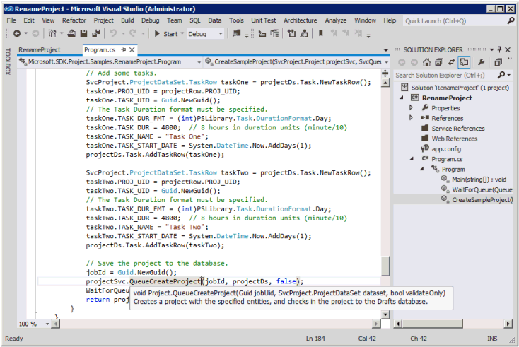

# <a name="prerequisites-for-asmx-based-code-samples-in-project"></a>Pré-requisitos para exemplos de código baseados em ASMX no Project

Conheça as informações para ajudá-lo a criar projetos no Visual Studio usando os exemplos de código baseados em ASMX que estão inclusas nos tópicos de referência da Interface do Project Server (PSI).
  
Muitos dos exemplos de código inclusos na [Referência do serviço Web e da biblioteca de classe do Project Server 2013](https://msdn.microsoft.com/library/ef1830e0-3c9a-4f98-aa0a-5556c298e7d1%28Office.15%29.aspx) foram criados originalmente para o SDK do Office Project 2007 e usam um formato padrão para serviços Web ASMX. Os exemplos ainda funcionam no Project Server 2013 e foram projetados para serem copiados em um aplicativo de console e executados como uma unidade completa. As exceções estão listadas no exemplo. 
  
Os novos exemplos da PSI no SDK do Project 2013 estão de acordo com um formato que usa os serviços WCF (Windows Communication Foundation). Os exemplos baseados em ASMX também podem ser adaptados para uso com os serviços WCF. Este artigo mostra como usar os exemplos com serviços Web ASMX. Para saber mais sobre como usar os exemplos com serviços WCF, consulte [Pré-requisitos para exemplos de código baseados em WCF no Project](prerequisites-for-wcf-based-code-samples-in-project.md).
  
> [!NOTE]
> A interface de serviço Web ASMX da PSI foi preterida no Project Server 2013, mas ainda é compatível. Se o modelo de objeto do lado do cliente (CSOM) inclui os métodos exigidos pelo aplicativo, os novos aplicativos devem ser desenvolvidos com o CSOM. O CSOM permite que os aplicativos trabalhem com o Project Online ou com uma instalação local do Project Server 2013. Caso contrário, se o aplicativo usar a PSI, ele deve usar a interface WCF, que é a tecnologia que recomendamos para comunicações de rede. Aplicativos que usam a interface ASMX ou WCF podem trabalhar apenas nas instalações locais do Project Server 2013. Para saber mais sobre o CSOM, consulte [Arquitetura do Project Server 2013](project-server-2013-architecture.md) e [Modelo de objeto do cliente (CSOM) para o Project 2013](client-side-object-model-csom-for-project-2013.md). 
  
Antes de executar os exemplos de código, é necessário configurar o ambiente de desenvolvimento, o aplicativo e alterar os valores constantes genéricos para corresponder ao seu ambiente.
  
## <a name="setting-up-the-development-environment"></a>Configurar o ambiente de desenvolvimento
<a name="pj15_PrerequisitesASMX_Setup"> </a>

1. **Configurar um teste do sistema do Project Server**.
    
   Use um teste de sistema do Project Server sempre que for desenvolver ou testar. Mesmo quando o código funciona perfeitamente, as dependências entre projetos, os relatórios ou outros fatores do ambiente podem causar consequências indesejadas. 
    
   > [!NOTE]
   > Certifique-se de que você seja um usuário válido no servidor e verifique se tem permissões suficientes para as chamadas da PSI usadas pelo aplicativo. O tópico de referência para cada método PSI inclui uma tabela de permissões do Project Server. Por exemplo, o método [Project.QueueCreateProject](https://msdn.microsoft.com/library/WebSvcProject.Project.QueueCreateProject.aspx) requer a permissão global **NewProject** e a permissão **SaveProjectTemplate**. 
  
   Em alguns casos, você precisa fazer depuração remota no servidor. Você também pode ter que configurar um manipulador de eventos instalando um assembly de manipulador de eventos em cada computador do Project Server no farm do SharePoint e, em seguida, configurar o manipulador de eventos para a instância do Project Web App usando a página Configurações do Project Server em Configurações Gerais de Aplicativos da Administração Central do SharePoint.
    
2. **Configure um computador de desenvolvimento.**
    
   Normalmente você acessa a PSI por uma rede. Os exemplos de código foram projetados para serem executados em um cliente separado do servidor, exceto quando indicado.
    
   1. **Instale a versão correta do Visual Studio.** Exceto quando indicado, os exemplos de código são escritos em Visual C#. Eles podem ser usados no Visual Studio 2010 ou Visual Studio 2012. Certifique-se de ter o service pack mais recente instalado. 
        
   2. **Copie as DLLs do Project Server para o computador de desenvolvimento.** Copie os seguintes assemblies de `[Program Files]\Microsoft Office Servers\15.0\Bin` no computador do Project Server para o computador de desenvolvimento: 
        
      - Microsoft.Office.Project.Server.Events.Receivers.dll
      - Microsoft.Office.Project.Server.Library.dll
        
   3. Para saber mais sobre como compilar e usar o assembly de proxy ProjectServerServices.dll para os serviços Web ASMX no PSI, consulte [Usar um assembly proxy PSI e as descrições do IntelliSense](#pj15_PrerequisitesASMX_BuildingProxy).
    
3. **Instale os arquivos do IntelliSense.**
    
    Para usar as descrições do IntelliSense para classes e membros em assemblies do Project Server, copie os arquivos XML atualizados do IntelliSense do download do SDK no Project 2013 para o mesmo diretório em que estão localizados os assemblies do Project Server. Por exemplo, copie o arquivo Microsoft.Office.Project.Server.Library.xml para o diretório em que o aplicativo definirá uma referência para o assembly Microsoft.Office.Project.Server.Library.dll.
    
    As descrições do IntelliSense de serviços Web PSI exigem que você crie um assembly de proxy PSI usando o script CompileASMXProxyAssembly.cmd no subdiretório `Documentation\IntelliSense\WSDL` no download do SDK do Project 2013. O script cria o assembly de proxy ProjectServerServices.dll baseado no ASMX. Para saber mais, consulte o arquivo [ReadMe_IntelliSense] no download do SDK. 
    
## <a name="creating-the-application-and-adding-a-web-service-reference"></a>Criar o aplicativo e adicionar uma referência ao serviço Web
<a name="pj15_PrerequisitesASMX_Configure"> </a>

1. **Criar um aplicativo de console**.
    
   Ao criar um aplicativo de console, na lista suspensa da caixa de diálogo **Novo projeto**, selecione **.NET Framework 4**. Você pode copiar o código de exemplo da PSI para o novo aplicativo.
    
2. **Adicione a referência necessária para ASMX.**
    
   No Gerenciador de Soluções, adicione uma referência para **System.Web.Services** (veja a Figura 1). 
    
   **Figura 1. Adicionar uma referência no Visual Studio**

   
  
3. **Copie o código**.
    
   Copie o exemplo de código completo no arquivo Program.cs do aplicativo de console.
    
4. **Configure o namespace do aplicativo de exemplo**.
    
   É possível alterar o namespace listado na parte superior do exemplo para o namespace padrão do aplicativo, ou alterar o namespace do aplicativo padrão para corresponder ao exemplo. É possível alterar o namespace do aplicativo padrão alterando as propriedades do aplicativo.
    
   Por exemplo, o código de exemplo [QueueRenameProject](https://msdn.microsoft.com/library/WebSvcProject.Project.QueueRenameProject.aspx) tem o namespace **Microsoft.SDK.Project.Samples.RenameProject**. Se o nome do projeto do Visual Studio for **RenameProject**, copie o namespace do arquivo Program.cs e abra o painel **Propriedades** do projeto (no menu **Projetos**, escolha **Propriedades de RenameProject**). Na guia **Aplicativo**, copie o namespace na caixa de texto **Namespace padrão**. 
    
5. **Defina as referências Web**.
    
   A maioria dos exemplos exige uma referência a um ou mais dos serviços Web da PSI. Eles estão listados no próprio exemplo ou nos comentários que precedem o exemplo. Para obter o namespace correto de referências Web, certifique-se de que definiu primeiro o namespace de aplicativo padrão.
    
   Há três maneiras de adicionar uma referência de serviço Web ASMX para a PSI:
    
   - Compilar um assembly de proxy da PSI denominado ProjectServerServices.dll e definir uma referência para o assembly. Obter o IntelliSense, essa é a maneira recomendada para adicionar uma referência à PSI. Consulte [Usar um assembly proxy PSI e as descrições do IntelliSense](#pj15_PrerequisitesASMX_BuildingProxy).
    
   - Adicionar um arquivo de proxy de saída wsdl.exe à solução do Visual Studio. Consulte [Adicionar um arquivo proxy PSI](#pj15_PrerequisitesASMX_AddingProxyFile).
    
   - Adicionar uma referência de serviço Web usando o Visual Studio. Consulte [Adicionar uma referência de serviço Web](#pj15_PrerequisitesASMX_AddingServiceReference).

<a name="pj15_PrerequisitesASMX_BuildingProxy"> </a>

### <a name="using-a-psi-proxy-assembly-and-intellisense-descriptions"></a>Usar um assembly proxy PSI e as descrições do IntelliSense

Você pode compilar e usar o assembly de proxy ProjectServerServices.dll para todos os serviços Web baseados em ASMX da PSI, usando o script CompileASMXProxyAssembly.cmd na pasta `Documentation\IntelliSense\WSDL` do download do SDK do Project 2013. Para obter um link para baixar, consulte [Documentação de desenvolvedor do Project 2013](project-2013-developer-documentation.md).
  
> [!NOTE]
> Ao extrair os arquivos de proxy de origem do arquivo Source.zip, os arquivos na pasta `Documentation\IntelliSense\WSDL\Source` são atualizados a partir da data de publicação do download do SDK do Project 2013. Para gerar os arquivos de proxy de origem atualizados da PSI, execute o script GenASMXProxyAssembly.cmd no computador do Project Server. Os scripts na pasta `Documentation\IntelliSense\WCF` não funcionam para aplicativos baseados em ASMX. O script GenWCFProxyAssembly.cmd chama o SvcUtil.exe, que gera os arquivos de código de origem para os serviços WCF. Os arquivos de proxy WCF incluem atributos diferentes, a interface de canal e uma classe de cliente para cada serviço da PSI. Por exemplo, o serviço Resource baseado em WCF inclui a interface **ResourceChannel**, a interface **Resource** e a classe **ResourceClient**. O serviço Web Resource baseado em ASMX inclui a classe **Resource** com algumas propriedades diferentes. 
  
A seguir temos o script GenASMXProxyAssembly.cmd, que gera os arquivos de saída WSDL para os serviços Web da PSI e compila o assembly.
  
```MS-DOS
@echo off
@ECHO ---------------------------------------------------
@ECHO Creating C# files for the ASMX-based proxy assembly
@ECHO ---------------------------------------------------
REM Replace ServerName with the name of the server and 
REM the instance name of Project Web App. Do not use localhost.
(set VDIR=https://ServerName/pwa/_vti_bin/psi)
(set OUTDIR=.\Source)
REM ** Wsdl.exe is the same version in the v6.0A and v7.0A subdirectories. 
(set WSDL="C:\Program Files (x86)\Microsoft SDKs\Windows\v7.0A\Bin\x64\wsdl.exe")
if not exist %OUTDIR% (
md %OUTDIR%
)
for /F %%i in (Classlist_asmx.txt) do %WSDL% /nologo /l:CS /namespace:Svc%%i /out:%OUTDIR%\wsdl.%%i.cs %VDIR%/%%i.asmx?wsdl 
@ECHO ----------------------------
@ECHO Compiling the proxy assembly
@ECHO ----------------------------
(set SOURCE=%OUTDIR%\wsdl)
(set CSC=%WINDIR%\Microsoft.NET\Framework64\v4.0.30319\csc.exe)
(set ASSEMBLY_NAME=ProjectServerServices.dll)
%CSC% /t:library /out:%ASSEMBLY_NAME% %SOURCE%*.cs
```

O script usa o arquivo ClassList_asmx.txt, que contém a lista de serviços Web disponíveis para desenvolvedores terceirizados.
  
```text
Admin
Archive
Calendar
CubeAdmin
CustomFields
Driver
Events
LoginForms
LoginWindows
LookupTable
Notifications
ObjectLinkProvider
PortfolioAnalyses
Project
QueueSystem
ResourcePlan
Resource
Security
Statusing
TimeSheet
Workflow
WssInterop
```

Os scripts criam um assembly chamado ProjectServerServices.dll. Evite confundi-lo com ProjectServerServices.dll do assembly baseado em WCF. Os nomes dos assemblies são iguais, para permitir o uso de qualquer assembly com o arquivo ProjectServerServices.xml do IntelliSense.
  
O namespace arbitrário criado pelos scripts para os serviços Web ASMX e WCF é o mesmo, para que o arquivo ProjectServerServices.xml do IntelliSense funcione com ambos os assemblies. Por exemplo, o namespace do serviço Resource no assembly de proxy baseado em WCF e no assembly de proxy baseado no ASMX é **SvcResource**. Claro que você pode alterar os nomes dos namespaces, se garantir que eles correspondam no assembly de proxy e no arquivo ProjectServerServices.xml do IntelliSense.
  
Se um exemplo de código usa um nome diferente para um namespace de serviço Web da PSI, por exemplo, **ProjectWebSvc**, para o IntelliSense funcionar, você deve alterar o exemplo para usar **SvcProject** de modo que o namespace corresponda no assembly de proxy. 
  
Uma vantagem de usar o assembly de proxy baseado em ASMX é que ele inclui todos os namespaces de serviço Web da PSI; você não precisa criar várias referências Web. Outra vantagem é que, se você adicionar o arquivo ProjectServerServices.xml no mesmo diretório em que definiu uma referência para o assembly de proxy ProjectServerServices.dll, poderá obter as descrições do IntelliSense para membros e classes da PSI. A figura 2 mostra o texto do IntelliSense para o método **Project.QueueCreateProject**. Para saber mais, consulte o arquivo [ReadMe_IntelliSense] na pasta IntelliSense do download do SDK do Project 2013. 
  
**Figura 2. Usar o IntelliSense para um método no serviço Web do Project**


  
As desvantagens de usar o assembly de proxy são que a solução é maior e você deve distribuir e instalar o assembly de proxy com a solução. Você também deve usar os mesmos namespaces contidos nos arquivos do IntelliSense e do assembly de proxy, a menos que altere o script e o arquivo ProjectServerServices.xml do IntelliSense para usar namespaces diferentes.
  
### <a name="adding-a-psi-proxy-file"></a>Adicionar um arquivo de proxy da PSI
<a name="pj15_PrerequisitesASMX_AddingProxyFile"> </a>

O download de SDK do Project 2013 inclui os arquivos de origem gerados pelo comando Wsdl.exe para o assembly de proxy. Os arquivos de origem estão em Source.zip, na subpasta `Documentation\IntelliSense\ASMX`. Ao invés de definir uma referência para o assembly de proxy, é possível adicionar um ou mais arquivos de origem à solução do Visual Studio. Por exemplo, depois de executar o script GenASMXProxyAssembly.cmd, adicione o arquivo wsdl.Project.cs na solução. Ao invés de executar o script, é possível executar os comandos a seguir para gerar um único arquivo de origem, por exemplo: 
  
```MS-DOS
set VDIR=https://ServerName/ProjectServerName/_vti_bin/psi
set WSDL="C:\Program Files (x86)\Microsoft SDKs\Windows\v7.0A\Bin\x64\wsdl.exe"
%WSDL% /nologo /l:cs /namespace:SvcProject /out:wsdl.Project.cs %VDIR%/Project.asmx?wsdl
```

Para definir um objeto **Project** como uma variável de classe chamada **project**, use o seguinte código. O método **AddContextInfo** adiciona as informações de contexto no objeto **project** para autenticação baseada em formulários e autenticação do Windows. 
  
```cs
private static SvcProject.Project project;
private static SvcLoginForms.LoginForms loginForms =
            new SvcLoginForms.LoginForms();
. . .
public void AddContextInfo()
{
    // Add the Url property.
    project.Url = "https://ServerName /ProjectServerName /_vti_bin/psi/project.asmx";
    // Add Windows credentials.
    project.Credentials = CredentialCache.DefaultCredentials;
    // If Forms authentication is used, add the Project Server cookie.
    project.CookieContainer = loginForms.CookieContainer;
}
```

> [!NOTE]
> Se você usar um assembly de proxy da PSI ou adicionar um arquivo de proxy a uma referência de serviço do Project chamada **SvcProject**, deverá usar o mesmo código para criar um objeto **project**. 
  
### <a name="adding-a-web-service-reference"></a>Adicionar uma referência de serviço Web
<a name="pj15_PrerequisitesASMX_AddingServiceReference"> </a>

Se você não usar o assembly de proxy baseado em ASMX ou adicionar um arquivo de saída WSDL, pode definir uma ou mais referências Web individuais. As etapas a seguir mostram como definir uma referência Web usando o Visual Studio 2012.
  
1. No **Gerenciador de Soluções**, clique com botão direito do mouse na pasta **Referências** e, em seguida, escolha **Adicionar Referência de Serviço**. 
    
2. Na caixa de diálogo **Adicionar Referência de Serviço**, escolha **Avançado**.
    
3. Na caixa de diálogo **Configurações de Referência de Serviço**, escolha **Adicionar Referência Web**.
    
4. Na caixa de texto **URL**, digite `https:// _ServerName_/ _ProjectServerName_/_vti_bin/psi/ _ServiceName_.asmx?wsdl` e pressione **Enter** ou escolha o ícone **Ir**. Se tiver instalado o protocolo SSL, deve usar o protocolo HTTPS ao invés do protocolo HTTP. 

   Por exemplo, use a seguinte URL de serviço do Project no site `https://MyServer/pwa` para o Project Web App: `https://MyServer/pwa/_vti_bin/psi/project.asmx?wsdl`
    
   Abra o navegador da Web e acesse `https://ServerName/ProjectServerName/_vti_bin/psi/ServiceName.asmx?wsdl`. Salve o arquivo em um diretório local, como `C:\Project\WebServices\ServiceName.wsdl`. Na caixa de diálogo **Adicionar Referência Web** para **URL**, digite o protocolo de arquivo e o caminho do arquivo. Por exemplo, digite `file://C:\Project\WebServices\Project.wsdl`. 
    
5. Depois que a referência for resolvida, digite o nome da referência na caixa de texto **Nome da referência Web**. Os exemplos de código na documentação do desenvolvedor do Project 2013 usam o nome de referência padrão arbitrário **Svc _ServiceName_**. Por exemplo, o serviço Web do Project chama-se **SvcProject** (veja a Figura 3). 
    
   **Figura 3. Adicionar uma referência de serviço Web ASMX**

   
  
Para os componentes de aplicativo que devem ser executados no computador do Project Server, use a representação ou tenha permissões elevadas, use uma referência de serviço WCF ao invés de uma referência Web ASMX. Para saber mais, consulte [Pré-requisitos para exemplos de código baseado em WCF no Project](prerequisites-for-wcf-based-code-samples-in-project.md).
  
## <a name="setting-other-references"></a>Definir outras referências
<a name="pj15_PrerequisitesASMX_OtherReferences"> </a>

Aplicativos do Project Server geralmente usam outros serviços, como serviços Web do SharePoint Server 2013. Se forem necessários outros serviços, eles serão detalhados no exemplo.
  
As referências locais para o exemplo de código são listadas nas instruções **using** na parte superior do exemplo: 
  
1. No **Gerenciador de Soluções**, clique com botão direito do mouse na pasta **Referências** e, em seguida, escolha **Adicionar Referência**.
    
2. Escolha **Procurar** e, em seguida, navegue até o local onde armazenou as DLLs do Project Server copiadas anteriormente. Escolha as DLLs necessárias e escolha **OK**.
    
> [!NOTE]
> Certifique-se de que as versões de assembly no computador de desenvolvimento são exatamente iguais àquelas no computador do Project Server de destino. 
  
## <a name="using-multiple-authentication"></a>Usar autenticação múltipla
<a name="pj15_PrerequisitesASMX_ClaimsMultiAuth"> </a>

A autenticação de usuários do Project Server no local, por autenticação do Windows ou de formulários, é feita pelo processamento de declarações no SharePoint Server 2013. Autenticação múltipla significa que o aplicativo Web no qual o Project Web App está provisionado oferece suporte à autenticação do Windows e à autenticação baseada em formulários. Se esse for o caso, uma chamada para um serviço Web ASMX que usa autenticação do Windows falhará com a seguinte mensagem de erro, porque o processo de declarações não pode determinar o tipo de usuário a autenticar:
  
`The server was unable to process the request due to an internal error. . . .`

Para corrigir o problema para ASMX, todas as chamadas para métodos da PSI devem ser uma classe derivada definida para cada serviço Web da PSI. A classe derivada também deve usar a classe **SvcLoginWindows.LoginWindows** para obter um cookie para a classe de serviço derivada da PSI. No exemplo a seguir, a classe **ProjectDerived** deriva da classe **SvcProject.Project**. A classe derivada adiciona a propriedade **EnforceWindowsAuth** e substitui o cabeçalho de solicitação Web de cada chamada para um método na classe **Project**. Se a propriedade **EnforceWindowsAuth** for **true**, o método **GetWebRequest** adiciona um cabeçalho que desabilita a autenticação de Formulários. Se **EnforceWindowsAuth** for **false**, a autenticação de formulários pode continuar.
  
Para usar o seguinte exemplo **ASMXLogon_MultiAuth**, crie um aplicativo de console, siga as etapas em [Criar o aplicativo e adicionar uma referência de serviço Web](#pj15_PrerequisitesASMX_Configure) e adicione os arquivos de proxy wsdl.LoginWindows.cs e wsdl.Project.cs. O método **Main** cria a instância **project** da classe **ProjectDerived**. O exemplo deve usar a classe derivada **LoginWindowsDerived** para obter um objeto **CookieContainer** para a propriedade **project.CookieContainer**, que distingue a autenticação de Formulários da autenticação do Windows. O objeto **project** pode ser usado para fazer chamadas para qualquer método na classe **SvcProject.Project**. 
  
> [!NOTE]
> O serviço **LoginWindows** é necessário apenas para aplicativos ASMX em um ambiente de autenticação múltipla. No exemplo **ASMXLogon_MultiAuth**, o método **GetLogonCookie** é um cookie para o objeto **loginWindows**. A propriedade **project.CookieContainer** está definida com o valor de **loginWindows.CookieContainer**. 
  
```cs
using System;
using System.Net;
using PSLibrary = Microsoft.Office.Project.Server.Library;
namespace ASMXLogon_MultiAuth
{
    class Program
    {
        private const string PROJECT_SERVER_URL = 
            "https://ServerName/ProjectServerName/_vti_bin/psi/";
        static void Main(string[] args)
        {
            bool isWindowsUser = true;
            // Create an instance of the project object.
            ProjectDerived project = new ProjectDerived();
            project.Url = PROJECT_SERVER_URL + "Project.asmx";
            project.Credentials = CredentialCache.DefaultCredentials;
            try
            {
                // The program works on a Windows-auth-only computer if you comment-out the
                // following line. The line is required for multiple authentication.
                project.CookieContainer = GetLogonCookie();
                project.EnforceWindowsAuth = isWindowsUser;
                // Get a list of all published projects. 
                // Use ReadProjectStatus instead of ReadProjectList,
                // because the permission requirements are lower.
                SvcProject.ProjectDataSet projectDs =
                    project.ReadProjectStatus(Guid.Empty,
                        SvcProject.DataStoreEnum.PublishedStore,
                        string.Empty,
                        (int)PSLibrary.Project.ProjectType.Project);
                Console.WriteLine(string.Format(
                    "There are {0} published projects.", 
                    projectDs.Project.Rows.Count));
            }
            catch (UnauthorizedAccessException ex)
            {
                Console.WriteLine(ex.Message);
            }
            catch (WebException ex)
            {
                Console.WriteLine(ex.Message);
            }
            finally
            {
                Console.Write("Press any key to continue...");
                Console.ReadKey(false);
            }
        }
        private static CookieContainer GetLogonCookie()
        {
            // Create an instance of the loginWindows object.
            LoginWindowsDerived loginWindows = new LoginWindowsDerived();
            loginWindows.EnforceWindowsAuth = true;
            loginWindows.Url = PROJECT_SERVER_URL + "LoginWindows.asmx";
            loginWindows.Credentials = CredentialCache.DefaultCredentials;
            loginWindows.CookieContainer = new CookieContainer();
            if (!loginWindows.Login())
            {
                // Login failed; throw an exception.
                throw new UnauthorizedAccessException("Login failed.");
            }
            return loginWindows.CookieContainer;
        }
    }
    // Derive from LoginWindows class; include additional property and 
    // override the web request header.
    class LoginWindowsDerived : SvcLoginWindows.LoginWindows
    {
        public bool EnforceWindowsAuth { get; set; }
        protected override WebRequest GetWebRequest(Uri uri)
        {
            WebRequest request = base.GetWebRequest(uri);
            if (this.EnforceWindowsAuth)
            {
                request.Headers.Add("X-FORMS_BASED_AUTH_ACCEPTED", "f");
            }
            return request;
        }
    }
    // Derive from Project class; include additional property and 
    // override the web request header.
    class ProjectDerived : SvcProject.Project
    {
        public bool EnforceWindowsAuth { get; set; }
        protected override WebRequest GetWebRequest(Uri uri)
        {
            WebRequest request = base.GetWebRequest(uri);
            if (this.EnforceWindowsAuth)
            {
                request.Headers.Add("X-FORMS_BASED_AUTH_ACCEPTED", "f");
            }
            return request;
        }
    }
}
```

Usar a classe derivada **LoginWindows** e fazer as chamadas da PSI com um cabeçalho de solicitação Web que desabilita a autenticação de Formulários é necessário para aplicativos que são executados em um ambiente de autenticação múltipla. Se o Project Server usa apenas a autenticação de declarações, não é necessário obter uma classe que adicione um cabeçalho de solicitação Web. O exemplo anterior é executado em dois ambientes. 
  
A correção para um aplicativo baseado em WCF é diferente. Para saber mais, consulte a seção *Usar autenticação múltipla* em [Pré-requisitos para exemplos de código baseados em WCF no Project](prerequisites-for-wcf-based-code-samples-in-project.md).
  
## <a name="changing-the-values-of-generic-constants"></a>Alterar os valores de constantes genéricas
<a name="pj15_PrerequisitesASMX_ChangeValues"> </a>

A maioria dos exemplos tem uma ou mais variáveis que você deve atualizar para o exemplo funcionar corretamente em seu ambiente. No exemplo a seguir, se você tiver o SSL instalado, use o protocolo HTTPS ao invés do protocolo HTTP. Substitua _ServerName_ pelo nome do servidor que você está usando. Substitua _ProjectServerName_ pelo nome do diretório virtual do seu site do Project Server, como o PWA. 
  
```cs
const string PROJECT_SERVER_URI = "https://ServerName/ProjectServerName/";
```

Todas as outras variáveis que você deve alterar ou os outros pré-requisitos são listados na parte superior do exemplo de código.
  
## <a name="verifying-the-results"></a>Verificar os resultados
<a name="pj15_PrerequisitesASMX_Verify"> </a>

Obter e interpretar resultados de um exemplo de código nem sempre é simples. Por exemplo, se você criar um projeto, deve publicá-lo antes que ele possa aparecer na página Centro do Projeto no Project Web App.
  
Você pode verificar os resultados de exemplo de código de várias maneiras, por exemplo:
  
- Usar o cliente do Project Professional 2013 para abrir o projeto no computador do Project Server e exibir os itens desejados.
    
- Exibir os projetos publicados na página Centro de Projeto do Project Web App (`https://ServerName/ProjectServerName/projects.aspx`).
    
- Exibir o log de fila no Project Web App. Abra a página Configurações do servidor (escolha o ícone **Configurações** no canto superior direito) e escolha **Meus Trabalhos Enfileirados** na seção **Configurações Pessoais** (`https://ServerName/ProjectServerName/MyJobs.aspx`). Na lista suspensa **Exibir**, é possível classificar por status de trabalho. O status padrão será **Trabalhos em andamento e não concluídos na semana passada**. 
    
- Use a página Configurações do servidor no Project Web App (`https://ServerName/ProjectServerName/_layouts/15/pwa/admin/admin.aspx`) para gerenciar todos os trabalhos enfileirados e excluir ou forçar o check-in de objetos empresariais. Você deve ter permissões administrativas para acessar esses links na página Configurações do servidor.
    
- Use o **Microsoft SQL Server Management Studio** para executar uma consulta em uma tabela no banco de dados do Project. Por exemplo, use a consulta a seguir para selecionar as primeiras 200 linhas da tabela pub.MSP_WORKFLOW_STAGE_PDPS para mostrar as informações sobre as páginas de detalhes do projeto (PDPs) em estágios do fluxo de trabalho. 
    
   ```sql
    SELECT TOP 200 [STAGE_UID]
            ,[PDP_UID]
            ,[PDP_NAME]
            ,[PDP_POSITION]
            ,[PDP_ID]
            ,[PDP_STAGE_DESCRIPTION]
            ,[PDP_REQUIRES_ATTENTION]
        FROM [ProjectService].[pub].[MSP_WORKFLOW_STAGE_PDPS]
   ```

## <a name="cleaning-up"></a>Limpar
<a name="pj15_PrerequisitesASMX_Cleanup"> </a>

Após testar alguns exemplos de código, há configurações e objetos empresariais que devem ser excluídos ou redefinidos. Você pode usar a página Configurações do servidor no Project Web App para gerenciar os dados empresariais (`https://ServerName/ProjectServerName/_layouts/15/pwa/admin/admin.aspx`). Os links na página Configurações do servidor permitem excluir itens antigos, forçar o check-in em projetos, gerenciar a fila de tarefas para todos os usuários e realizar outras tarefas administrativas.
  
A seguir apresentamos alguns dos links da página Configurações do servidor que você pode usar para atividades comuns de limpeza após executar exemplos de código:
  
- **Campos personalizados empresariais e tabelas de pesquisa**
    
- **Gerenciar trabalhos em fila**
    
- **Excluir objetos empresariais**
    
- **Forçar o check-in de objetos empresariais**
    
- **Tipos de projetos empresariais**
    
- **Fases do fluxo de trabalho**
    
- **Estágios do fluxo de trabalho**
    
- **Páginas de detalhes do projeto**
    
- **Períodos de relatório de tempo**
    
- **Configurações e padrões do quadro de horários**
    
- **Classificações de linha**
    
As configurações adicionais são gerenciadas pelo SharePoint Server 2013 para cada instância do Project Web App, ao invés de por uma página específica de Configurações do servidor do Project Web App. No aplicativo Administração Central do SharePoint, escolha **Configurações Gerais de Aplicativos**, escolha **Gerenciar** em **Configurações do Project Server** e escolha a instância do Project Web App na lista suspensa da página Configurações do servidor. Por exemplo, escolha **Manipuladores de Eventos no Servidor** para adicionar ou excluir os manipuladores de eventos para a instância selecionada do Project Web App. 
  
## <a name="see-also"></a>Confira também
<a name="pj15_PrerequisitesASMX_AR"> </a>

- [Pré-requisitos para exemplos de código baseados em WCF no Project](prerequisites-for-wcf-based-code-samples-in-project.md)
- [Usar representação com WCF](https://msdn.microsoft.com/library/e3597901-2f02-44a2-8076-d32aae540b38%28Office.15%29.aspx)
- [Visão geral da referência da PSI do Project](project-psi-reference-overview.md)
- [Central de desenvolvedores do SharePoint](https://msdn.microsoft.com/sharepoint/default.aspx)
    

