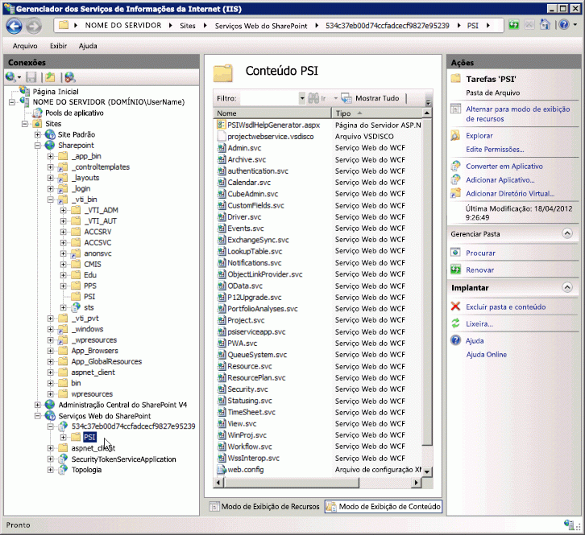

# <a name="project-psi-reference-overview"></a><span data-ttu-id="17a2b-104">Visão geral da referência da PSI do Project</span><span class="sxs-lookup"><span data-stu-id="17a2b-104">Project PSI reference overview</span></span>

<span data-ttu-id="17a2b-105">A Interface do Project Server (PSI) é a API usada para desenvolver aplicativos que se integram ao Project Server 2013 no local.</span><span class="sxs-lookup"><span data-stu-id="17a2b-105">The Project Server Interface (PSI) is the API to use for developing applications that integrate with Project Server 2013 on-premises.</span></span>
  
<span data-ttu-id="17a2b-106">Este artigo é uma visão geral dos assemblies, namespaces e serviços documentados na PSI.</span><span class="sxs-lookup"><span data-stu-id="17a2b-106">This article is an overview of the documented assemblies, namespaces, and services in the PSI.</span></span> <span data-ttu-id="17a2b-107">A [Referência do serviço Web e da biblioteca de classe do Project Server 2013](https://msdn.microsoft.com/library/ef1830e0-3c9a-4f98-aa0a-5556c298e7d1%28Office.15%29.aspx) no SDK contém toda a documentação de código gerenciado para a PSI e o namespace [Microsoft.ProjectServer.Client](https://msdn.microsoft.com/library/Microsoft.ProjectServer.Client.aspx) no Project Server 2013.</span><span class="sxs-lookup"><span data-stu-id="17a2b-107">The [Project Server 2013 class library and web service reference](https://msdn.microsoft.com/library/ef1830e0-3c9a-4f98-aa0a-5556c298e7d1%28Office.15%29.aspx) in the SDK contains all of the managed code documentation for the PSI and the [Microsoft.ProjectServer.Client](https://msdn.microsoft.com/library/Microsoft.ProjectServer.Client.aspx) namespace in Project Server 2013.</span></span> <span data-ttu-id="17a2b-108">Para desenvolver aplicativos para o Project Online, você deve usar o namespace **Microsoft.ProjectServer.Client** ao invés da PSI.</span><span class="sxs-lookup"><span data-stu-id="17a2b-108">To develop applications for Project Online, you must use the **Microsoft.ProjectServer.Client** namespace instead of the PSI.</span></span> 

<span data-ttu-id="17a2b-109">A PSI no Project Server 2013 tem uma interface dupla.</span><span class="sxs-lookup"><span data-stu-id="17a2b-109">The PSI in Project Server 2013 has a dual interface.</span></span> <span data-ttu-id="17a2b-110">A interface ASMX para serviços Web é definida por arquivos de descoberta e linguagem WSDL (disco e WSDL) no diretório virtual `https://ServerName/ProjectServerName/_vti_bin/psi/` (por exemplo, Projectdisco.aspx e Projectwsdl.aspx).</span><span class="sxs-lookup"><span data-stu-id="17a2b-110">The ASMX interface for web services is defined by discovery and Web Service Description Language (disco and WSDL) files in the  `https://ServerName/ProjectServerName/_vti_bin/psi/` virtual directory (for example, Projectdisco.aspx and Projectwsdl.aspx).</span></span> <span data-ttu-id="17a2b-111">Você pode acessar a interface ASMX apenas pela URL de uma instalação local do Project Web App (por exemplo, `https://ServerName/ProjectServerName/_vti_bin/psi/project.asmx?wsdl)`.</span><span class="sxs-lookup"><span data-stu-id="17a2b-111">You can access the ASMX interface only through the URL of an on-premises installation of Project Web App (for example,  `https://ServerName/ProjectServerName/_vti_bin/psi/project.asmx?wsdl)`.</span></span> <span data-ttu-id="17a2b-112">Para mostrar o serviço Web em um navegador, você deve incluir a opção de URL `?wsdl`.</span><span class="sxs-lookup"><span data-stu-id="17a2b-112">To show the web service in a browser, you must include the  `?wsdl` URL option.</span></span> <span data-ttu-id="17a2b-113">Como a interface ASMX foi criada usando a infraestrutura do Windows Communication Foundation (WCF), os arquivos .asmx para os serviços Web do Project Server não existem de fato no diretório virtual da PSI.</span><span class="sxs-lookup"><span data-stu-id="17a2b-113">Because the ASMX interface is built using the Windows Communication Foundation (WCF) infrastructure, the .asmx files for Project Server web services do not actually exist in the virtual PSI directory.</span></span> 
  
<span data-ttu-id="17a2b-114">A interface de serviços do WCF é definida por arquivos .svc no diretório virtual `https://ServerName:32843/GUID/PSI/` do back-end no aplicativo de serviços Web do SharePoint.</span><span class="sxs-lookup"><span data-stu-id="17a2b-114">The WCF services interface is defined by .svc files in the back-end  `https://ServerName:32843/GUID/PSI/` virtual directory in the SharePoint Web Services application.</span></span> <span data-ttu-id="17a2b-115">A URL dos serviços da PSI no diretório virtual do aplicativo de serviço do Project (por exemplo, `https://ServerName:32843/GUID/PSI/project.svc`) inclui os arquivos .svc.</span><span class="sxs-lookup"><span data-stu-id="17a2b-115">The URL of PSI services in the Project Service Application virtual directory (for example,  `https://ServerName:32843/GUID/PSI/project.svc`) includes the .svc files.</span></span> <span data-ttu-id="17a2b-116">Porém, não é possível usar diretamente a URL de back-end para definir uma referência ao serviço do WCF.</span><span class="sxs-lookup"><span data-stu-id="17a2b-116">But, you cannot directly use the back-end URL to set a WCF service reference.</span></span> <span data-ttu-id="17a2b-117">Para desenvolver um aplicativo ou componente que usa os serviços do WCF da PSI, você pode usar um assembly de proxy ou um arquivo de proxy.</span><span class="sxs-lookup"><span data-stu-id="17a2b-117">To develop an application or component that uses the WCF services of the PSI, you can use a proxy assembly or a proxy file.</span></span> <span data-ttu-id="17a2b-118">O download do SDK do Project 2013 inclui arquivos de proxy para os serviços do WCF no Project Server 2013 e os scripts para acessar arquivos de proxy do WCF atualizados e compilar os arquivos em um assembly de proxy para as builds mais recentes do Project Server.</span><span class="sxs-lookup"><span data-stu-id="17a2b-118">The Project 2013 SDK download includes proxy files for the WCF services in Project Server 2013, and scripts to get updated WCF proxy files and to compile the files into a proxy assembly for more recent Project Server builds.</span></span>
  
<span data-ttu-id="17a2b-119">O nome de diretório do aplicativo de serviço do Project é um valor GUID, que é o mesmo GUID da instância do Project Web App local.</span><span class="sxs-lookup"><span data-stu-id="17a2b-119">The Project Service Application directory name is a GUID value, which is the same as the GUID of the on-premises Project Web App instance.</span></span> <span data-ttu-id="17a2b-120">Na janela **Gerenciador dos Serviços de Informações da Internet (IIS)**, expanda o nó **Serviços Web do SharePoint**, escolha o nome do diretório GUID e escolha **Configurações Avançadas** para copiar o valor de **Caminho Virtual**.</span><span class="sxs-lookup"><span data-stu-id="17a2b-120">In the **Internet Information Services (IIS) Manager** window, expand the **SharePoint Web Services** node, choose the GUID directory name, and then choose **Advanced Settings** to copy the **Virtual Path** value.</span></span> 
  
> [!IMPORTANT]
> <span data-ttu-id="17a2b-121">A interface de serviço Web ASMX da PSI foi preterida no Project Server 2013, mas ainda é compatível.</span><span class="sxs-lookup"><span data-stu-id="17a2b-121">The ASMX web service interface of the PSI is deprecated in Project Server 2013, but is still supported.</span></span> <span data-ttu-id="17a2b-122">Novos aplicativos devem usar a interface WCF da PSI ou CSOM.</span><span class="sxs-lookup"><span data-stu-id="17a2b-122">New applications should use the WCF interface of the PSI or the CSOM.</span></span> <span data-ttu-id="17a2b-123">Para saber mais sobre recursos preteridos, consulte [Atualizações para desenvolvedores no Project 2013](updates-for-developers-in-project-2013.md)</span><span class="sxs-lookup"><span data-stu-id="17a2b-123">For more information about deprecated features, see [Updates for developers in Project 2013](updates-for-developers-in-project-2013.md)</span></span>
> 
> <span data-ttu-id="17a2b-124">Novos aplicativos e componentes middleware que são executados apenas em uma instalação local do Project Server devem usar a interface do WCF, que é a tecnologia recomendável para comunicações de rede.</span><span class="sxs-lookup"><span data-stu-id="17a2b-124">New applications, and middleware components that run only on an on-premises installation of Project Server, should use the WCF interface, which is the technology that we recommend for network communications.</span></span> <span data-ttu-id="17a2b-125">Os aplicativos herdados que usam a interface ASMX devem usar a URL pelo Project Web App, que verifica as permissões do Project Server.</span><span class="sxs-lookup"><span data-stu-id="17a2b-125">Legacy applications that use the ASMX interface must use the URL through Project Web App, which checks Project Server permissions.</span></span> 
> 
> <span data-ttu-id="17a2b-126">Para saber mais sobre a interface ASMX e como usar a interface do WCF, consulte [Pré-requisitos para exemplos de código baseados em ASMX no Project](prerequisites-for-asmx-based-code-samples-in-project.md) e [Pré-requisitos para exemplos de código baseados em WCF no Project](prerequisites-for-wcf-based-code-samples-in-project.md).</span><span class="sxs-lookup"><span data-stu-id="17a2b-126">For more information about the ASMX interface and how to use the WCF interface, see [Prerequisites for ASMX-based code samples in Project](prerequisites-for-asmx-based-code-samples-in-project.md) and [Prerequisites for WCF-based code samples in Project](prerequisites-for-wcf-based-code-samples-in-project.md).</span></span> 
  
<span data-ttu-id="17a2b-127">Para desenvolver aplicativos que usam a interface do WCF, você pode usar o Visual Studio 2010 ou Visual Studio 2012.</span><span class="sxs-lookup"><span data-stu-id="17a2b-127">For developing applications that use the WCF interface, you can use Visual Studio 2010 or Visual Studio 2012.</span></span> <span data-ttu-id="17a2b-128">Para criar fluxos de trabalho declarativos do Project Server, você pode usar o SharePoint Designer 2013.</span><span class="sxs-lookup"><span data-stu-id="17a2b-128">For creating declarative Project Server workflows, you can use SharePoint Designer 2013.</span></span> <span data-ttu-id="17a2b-129">Os fluxos de trabalho do Project Server que exigem acesso à PSI ou ao CSOM podem ser desenvolvidos com o Visual Studio 2012.</span><span class="sxs-lookup"><span data-stu-id="17a2b-129">Project Server workflows that require access to the PSI or the CSOM can be developed with Visual Studio 2012.</span></span>
  
### <a name="using-the-psi-reference"></a><span data-ttu-id="17a2b-130">Usar a referência da PSI</span><span class="sxs-lookup"><span data-stu-id="17a2b-130">Using the PSI reference</span></span>
<span data-ttu-id="17a2b-131"><a name="pj15_PSIRefOverview_Using"> </a></span><span class="sxs-lookup"><span data-stu-id="17a2b-131"></span></span>

<span data-ttu-id="17a2b-132">O modelo de objeto da PSI é grande e várias classes e membros são somente para uso interno.</span><span class="sxs-lookup"><span data-stu-id="17a2b-132">The PSI object model is large, and many classes and members are for internal use only.</span></span> <span data-ttu-id="17a2b-133">Como resultado, pode ser confuso encontrar os tópicos que você deseja na [Referência do serviço Web e da biblioteca de classes do Project Server 2013](https://msdn.microsoft.com/library/ef1830e0-3c9a-4f98-aa0a-5556c298e7d1%28Office.15%29.aspx).</span><span class="sxs-lookup"><span data-stu-id="17a2b-133">As a result, it can be confusing to find the topics that you want in the [Project Server 2013 class library and web service reference](https://msdn.microsoft.com/library/ef1830e0-3c9a-4f98-aa0a-5556c298e7d1%28Office.15%29.aspx).</span></span> <span data-ttu-id="17a2b-134">A maioria dos tópicos de referência que você usará para desenvolvimento está nos seguintes grupos:</span><span class="sxs-lookup"><span data-stu-id="17a2b-134">Most of the reference topics that you will use for development are in the following groups:</span></span>
  
- <span data-ttu-id="17a2b-135">**Métodos de classe primária**: cada serviço na PSI inclui uma classe primária que tem o nome do serviço.</span><span class="sxs-lookup"><span data-stu-id="17a2b-135">**Primary class methods:** Each service in the PSI includes a primary class that is named for the name of the service.</span></span> <span data-ttu-id="17a2b-136">Por exemplo, o serviço **Resource** contém a classe [Resource](https://msdn.microsoft.com/library/WebSvcResource.Resource.aspx), que está no namespace [WebSvcResource](https://msdn.microsoft.com/library/WebSvcResource.aspx).</span><span class="sxs-lookup"><span data-stu-id="17a2b-136">For example, the **Resource** service contains the [Resource](https://msdn.microsoft.com/library/WebSvcResource.Resource.aspx) class, which is in the [WebSvcResource](https://msdn.microsoft.com/library/WebSvcResource.aspx) namespace.</span></span> <span data-ttu-id="17a2b-137">Para ver uma lista dos métodos disponíveis na classe **Resource**, expanda o nó de classe no painel de conteúdo e, em seguida, escolha o tópico **Métodos de Resource**.</span><span class="sxs-lookup"><span data-stu-id="17a2b-137">To see a list of the methods that are available in the **Resource** class, expand the class node in the content pane, and then choose the **Resource Methods** topic.</span></span> 
    
- <span data-ttu-id="17a2b-138">**Propriedades DataRow:** Muitos dos métodos de classe primária usam ou retornam um **DataSet**.</span><span class="sxs-lookup"><span data-stu-id="17a2b-138">**DataRow properties:** Many of the primary class methods use or return a **DataSet**.</span></span> <span data-ttu-id="17a2b-139">Cada objeto **DataTable** em um **DataSet** contém dados em um ou mais objetos **DataRow**.</span><span class="sxs-lookup"><span data-stu-id="17a2b-139">Each **DataTable** object in a **DataSet** contains data in one or more **DataRow** objects.</span></span> <span data-ttu-id="17a2b-140">Na maioria dos casos você precisa ver apenas as propriedades de linha, não todos os outros membros das classes **DataSet**, **DataTable** ou **DataRow**.</span><span class="sxs-lookup"><span data-stu-id="17a2b-140">In most cases, you need to see only the row properties, not all of the other members of the **DataSet**, **DataTable**, or **DataRow** classes.</span></span> <span data-ttu-id="17a2b-141">Por exemplo, a classe **ResourceAssignmentDataSet** inclui subclasses para as classes **ResourceAssignmentDataTable** e [ResourceAssignmentDataSet.ResourceAssignmentRow](https://msdn.microsoft.com/library/WebSvcResource.ResourceAssignmentDataSet.ResourceAssignmentRow.aspx).</span><span class="sxs-lookup"><span data-stu-id="17a2b-141">For example, the **ResourceAssignmentDataSet** class includes subclasses for the **ResourceAssignmentDataTable** and the [ResourceAssignmentDataSet.ResourceAssignmentRow](https://msdn.microsoft.com/library/WebSvcResource.ResourceAssignmentDataSet.ResourceAssignmentRow.aspx) class.</span></span> <span data-ttu-id="17a2b-142">Para ver uma lista das propriedades que estão na classe **ResourceAssignmentRow**, expanda o nó da classe no painel de conteúdo e, em seguida, escolha o tópico **Propriedades de ResourceAssignmentDataSet.ResourceAssignmentRow**.</span><span class="sxs-lookup"><span data-stu-id="17a2b-142">To see a list of properties that are in the **ResourceAssignmentRow** class, expand the class node in the content pane, and then choose the **ResourceAssignmentDataSet.ResourceAssignmentRow Properties** topic.</span></span> 
    
<span data-ttu-id="17a2b-143">Além dos namespaces de serviço, o tópico [Referência do serviço Web e da biblioteca de classes do Project Server 2013](https://msdn.microsoft.com/library/ef1830e0-3c9a-4f98-aa0a-5556c298e7d1%28Office.15%29.aspx) fornece links para os três assemblies do Project Server usados no desenvolvimento de soluções de terceiros para instalações locais.</span><span class="sxs-lookup"><span data-stu-id="17a2b-143">In addition to the service namespaces, the [Project Server 2013 class library and web service reference](https://msdn.microsoft.com/library/ef1830e0-3c9a-4f98-aa0a-5556c298e7d1%28Office.15%29.aspx) topic links to the three Project Server assemblies that are used in development of third-party solutions for on-premises installations.</span></span> <span data-ttu-id="17a2b-144">Fornecemos apenas a documentação mínima para esses assemblies.</span><span class="sxs-lookup"><span data-stu-id="17a2b-144">We provide only minimal documentation for these assemblies.</span></span> <span data-ttu-id="17a2b-145">A referência da PSI documenta as classes e os membros principais nos 23 serviços públicos.</span><span class="sxs-lookup"><span data-stu-id="17a2b-145">The PSI reference documents the main classes and members in the 23 public services.</span></span> <span data-ttu-id="17a2b-146">Seis serviços da PSI destinam-se apenas para uso interno e não estão documentados.</span><span class="sxs-lookup"><span data-stu-id="17a2b-146">Six PSI services are for internal use only, and are not documented.</span></span> 
  
> [!NOTE]
> <span data-ttu-id="17a2b-147">As classes no modelo de objeto do lado do cliente (CSOM) podem ser usadas independentemente de outros assemblies e serviços do Project Server.</span><span class="sxs-lookup"><span data-stu-id="17a2b-147">Classes in the client-side object model (CSOM) can be used independently from the other Project Server assemblies and services.</span></span> <span data-ttu-id="17a2b-148">Você pode usar o namespace **Microsoft.ProjectServer.Client** em um ambiente de desenvolvimento remoto no computador do Project Server e desenvolver aplicativos que se integram ao Project Online ou a uma instalação local do Project Server.</span><span class="sxs-lookup"><span data-stu-id="17a2b-148">You can use the **Microsoft.ProjectServer.Client** namespace in a remote development environment from the Project Server computer, and develop apps that integrate with Project Online or with an on-premises installation of Project Server.</span></span> <span data-ttu-id="17a2b-149">Mas o CSOM contém um subconjunto de recursos da PSI completa.</span><span class="sxs-lookup"><span data-stu-id="17a2b-149">But, the CSOM contains a subset of the functionality of the complete PSI.</span></span> <span data-ttu-id="17a2b-150">O CSOM permite o desenvolvimento dos cenários mais comuns para integração com o Project Server.</span><span class="sxs-lookup"><span data-stu-id="17a2b-150">The CSOM enables development of the most common scenarios for Project Server integration.</span></span> <span data-ttu-id="17a2b-151">Para saber mais, consulte [O que o CSOM faz e não faz](what-the-csom-does-and-does-not-do.md) e [Microsoft.ProjectServer.Client](https://msdn.microsoft.com/library/Microsoft.ProjectServer.Client.aspx).</span><span class="sxs-lookup"><span data-stu-id="17a2b-151">For more information, see [What the CSOM does and does not do](what-the-csom-does-and-does-not-do.md) and [Microsoft.ProjectServer.Client](https://msdn.microsoft.com/library/Microsoft.ProjectServer.Client.aspx) .</span></span> 
  
<span data-ttu-id="17a2b-152">Para o desenvolvimento da maioria dos aplicativos que usa a PSI, você não precisa desenvolver em um computador do Project Server ou definir as referências a conjuntos do Project Server no cache de assembly global.</span><span class="sxs-lookup"><span data-stu-id="17a2b-152">For development of most applications that use the PSI, you do not have to develop on a Project Server computer, or set references to Project Server assemblies in the global assembly cache.</span></span> <span data-ttu-id="17a2b-153">Você pode copiar os assemblies necessários do Project Server para seu computador de desenvolvimento.</span><span class="sxs-lookup"><span data-stu-id="17a2b-153">You can copy the necessary Project Server assemblies to your development computer.</span></span> <span data-ttu-id="17a2b-154">O Project Server 2013 instala os seguintes assemblies em _[Arquivos de Programa]_ `\Microsoft Office Servers\15.0\Bin`:</span><span class="sxs-lookup"><span data-stu-id="17a2b-154">Project Server 2013 installs the following assemblies in  _[Program Files]_ `\Microsoft Office Servers\15.0\Bin`:</span></span> 
  
- <span data-ttu-id="17a2b-155">Microsoft.Office.Project.Server.Events.Receivers.dll</span><span class="sxs-lookup"><span data-stu-id="17a2b-155">Microsoft.Office.Project.Server.Events.Receivers.dll</span></span> 
- <span data-ttu-id="17a2b-156">Microsoft.Office.Project.Server.Library.dll</span><span class="sxs-lookup"><span data-stu-id="17a2b-156">Microsoft.Office.Project.Server.Library.dll</span></span>
- <span data-ttu-id="17a2b-157">Microsoft.Office.Project.Server.Workflow.dll</span><span class="sxs-lookup"><span data-stu-id="17a2b-157">Microsoft.Office.Project.Server.Workflow.dll</span></span>
    
<span data-ttu-id="17a2b-158">Os namespaces para os serviços da PSI têm nomes arbitrários criados para um assembly de proxy da PSI, ProjectServerServices.dll, que é gerado para fins de documentação.</span><span class="sxs-lookup"><span data-stu-id="17a2b-158">Namespaces for the PSI services have arbitrary names created for a PSI proxy assembly, ProjectServerServices.dll, which is generated for the purpose of documentation.</span></span> <span data-ttu-id="17a2b-159">Na referência da PSI, o namespace de cada serviço tem um nome de espaço reservado (como _[serviço Web do Project]_) e uma referência Web (como `https://ServerName/ProjectServerName/_vti_bin/psi/Project.asmx?wsdl`).</span><span class="sxs-lookup"><span data-stu-id="17a2b-159">In the PSI reference, each service namespace has a placeholder name (such as  _[Project web service]_) and a web reference (such as  `https://ServerName/ProjectServerName/_vti_bin/psi/Project.asmx?wsdl`).</span></span> 
  
## <a name="project-server-assemblies-and-namespaces"></a><span data-ttu-id="17a2b-160">Namespaces e assemblies do Project Server</span><span class="sxs-lookup"><span data-stu-id="17a2b-160">Project Server assemblies and namespaces</span></span>
<span data-ttu-id="17a2b-161"><a name="pj15_PSIRefOverview_Assemblies"> </a></span><span class="sxs-lookup"><span data-stu-id="17a2b-161"></span></span>

<span data-ttu-id="17a2b-162">Muitos assemblies são instalados junto com o Project Server; apenas quatro assemblies do Project Server são documentados.</span><span class="sxs-lookup"><span data-stu-id="17a2b-162">Many assemblies are installed when you install Project Server; only four of the Project Server assemblies are documented.</span></span> <span data-ttu-id="17a2b-163">Os desenvolvedores terceirizados geralmente usam apenas algumas classes e membros nesses assemblies.</span><span class="sxs-lookup"><span data-stu-id="17a2b-163">Third-party developers generally use only a few classes and members in those assemblies.</span></span> <span data-ttu-id="17a2b-164">Os assemblies não-documentados do Project Server incluem namespaces e classes que o Project Server usa internamente, como classes para o Project Web App, entidades comerciais e a camada de acesso a dados (DAL).</span><span class="sxs-lookup"><span data-stu-id="17a2b-164">The undocumented Project Server assemblies include namespaces and classes that Project Server uses internally, such as classes for Project Web App, the business entities, and the data access layer (DAL).</span></span> <span data-ttu-id="17a2b-165">Quando você define uma referência no Visual Studio para um dos assemblies documentados do Project Server, pode ver todos os namespaces, as classes e os membros no Pesquisador de Objetos do Visual Studio.</span><span class="sxs-lookup"><span data-stu-id="17a2b-165">When you set a reference in Visual Studio to one of the documented Project Server assemblies, you can see all of the namespaces, classes, and members in the Visual Studio Object Browser.</span></span>
  
> [!NOTE]
> <span data-ttu-id="17a2b-166">Vários membros dos namespaces documentados do Project Server são usados apenas internamente e têm uma quantidade mínima de documentação.</span><span class="sxs-lookup"><span data-stu-id="17a2b-166">Many members of the documented Project Server namespaces are used only internally and have minimal documentation.</span></span> 
  
<span data-ttu-id="17a2b-167">Ao desenvolver para o Project Online, você pode usar somente o CSOM para acessar a funcionalidade do Project Server.</span><span class="sxs-lookup"><span data-stu-id="17a2b-167">When developing for Project Online, you can use only the CSOM to access Project Server functionality.</span></span> <span data-ttu-id="17a2b-168">Você não tem acesso aos serviços da PSI ou outros assemblies do Project Server.</span><span class="sxs-lookup"><span data-stu-id="17a2b-168">You do not have access to the PSI services or the other Project Server assemblies.</span></span>
  
<span data-ttu-id="17a2b-169">A [Referência do serviço Web e da biblioteca de classe do Project Server 2013](https://msdn.microsoft.com/library/ef1830e0-3c9a-4f98-aa0a-5556c298e7d1%28Office.15%29.aspx) para a PSI inclui os seguintes namespaces de assemblies:</span><span class="sxs-lookup"><span data-stu-id="17a2b-169">The [Project Server 2013 class library and web service reference](https://msdn.microsoft.com/library/ef1830e0-3c9a-4f98-aa0a-5556c298e7d1%28Office.15%29.aspx) for the PSI includes namespaces from the following assemblies:</span></span> 
  
- <span data-ttu-id="17a2b-170">**Microsoft.Office.Project.Server.Library.dll** Este assembly contém um namespace documentado e três namespaces não-documentados, da seguinte maneira:</span><span class="sxs-lookup"><span data-stu-id="17a2b-170">**Microsoft.Office.Project.Server.Library.dll** This assembly contains one documented namespace and three undocumented namespaces, as follows:</span></span> 
    
  - <span data-ttu-id="17a2b-171">O namespace [Microsoft.Office.Project.Server.Library](https://msdn.microsoft.com/library/Microsoft.Office.Project.Server.Library.aspx) inclui muitas enumerações, campos de classe e propriedades que são usados em aplicativos locais para o Project Server.</span><span class="sxs-lookup"><span data-stu-id="17a2b-171">The [Microsoft.Office.Project.Server.Library](https://msdn.microsoft.com/library/Microsoft.Office.Project.Server.Library.aspx) namespace includes many enumerations, and class fields and properties that are frequently used in on-premises applications for Project Server.</span></span> <span data-ttu-id="17a2b-172">Por exemplo, os desenvolvedores normalmente usam enumerações como **CustomField.Type**, e as classes **PSClientError**, **PSErrorInfo** e **Filter**.</span><span class="sxs-lookup"><span data-stu-id="17a2b-172">For example, developers typically use enumerations such as **CustomField.Type**, and the **PSClientError**, **PSErrorInfo**, and **Filter** classes.</span></span> 
    
    <span data-ttu-id="17a2b-173">O namespace **Microsoft.Office.Project.Server.Library** também inclui as seguintes sete classes de propriedade que incluem mais de 3.200 subclasses:</span><span class="sxs-lookup"><span data-stu-id="17a2b-173">The **Microsoft.Office.Project.Server.Library** namespace also includes the following seven property classes, which include over 3,200 subclasses:</span></span> 
    
      - <span data-ttu-id="17a2b-174">**AssignmentProperties**</span><span class="sxs-lookup"><span data-stu-id="17a2b-174">**AssignmentProperties**</span></span>  
      - <span data-ttu-id="17a2b-175">**CalendarProperties**</span><span class="sxs-lookup"><span data-stu-id="17a2b-175">**CalendarProperties**</span></span>
      - <span data-ttu-id="17a2b-176">**ConstraintProperties**</span><span class="sxs-lookup"><span data-stu-id="17a2b-176">**ConstraintProperties**</span></span>
      - <span data-ttu-id="17a2b-177">**LookupTableProperties**</span><span class="sxs-lookup"><span data-stu-id="17a2b-177">**LookupTableProperties**</span></span>
      - <span data-ttu-id="17a2b-178">**ProjectProperties**</span><span class="sxs-lookup"><span data-stu-id="17a2b-178">**ProjectProperties**</span></span>
      - <span data-ttu-id="17a2b-179">**ResourceProperties**</span><span class="sxs-lookup"><span data-stu-id="17a2b-179">**ResourceProperties**</span></span>
      - <span data-ttu-id="17a2b-180">**TaskProperties**</span><span class="sxs-lookup"><span data-stu-id="17a2b-180">**TaskProperties**</span></span>
    
    <span data-ttu-id="17a2b-181">As classes de propriedades são usadas internamente e não estão documentadas.</span><span class="sxs-lookup"><span data-stu-id="17a2b-181">The property classes are used internally and are not documented.</span></span> <span data-ttu-id="17a2b-182">As classes de propriedades são usadas para serialização entre o Project Professional 2013 e o Project Server.</span><span class="sxs-lookup"><span data-stu-id="17a2b-182">The property classes are used for serialization between Project Professional 2013 and Project Server.</span></span> <span data-ttu-id="17a2b-183">Quando você trabalha com o namespace **Microsoft.Office.Project.Server.Library** no Visual Studio, o Pesquisador de Objetos mostra todas as classes de propriedade, o que dificulta encontrar as classes que são úteis para desenvolvimento de terceiros.</span><span class="sxs-lookup"><span data-stu-id="17a2b-183">When you work with the **Microsoft.Office.Project.Server.Library** namespace in Visual Studio, the Object Browser shows all of the property classes, which makes it more difficult to find classes that are useful for third-party development.</span></span> <span data-ttu-id="17a2b-184">Como os desenvolvedores de terceiros não têm que usar as classes de propriedades, o SDK não os documenta.</span><span class="sxs-lookup"><span data-stu-id="17a2b-184">Because third-party developers do not have to use the property classes, the SDK does not document them.</span></span> 
    
  - <span data-ttu-id="17a2b-185">**Microsoft.Office.Project.Server.DataServices** As classes e os membros desse namespace são usados internamente pelo serviço **OData** no Project Online para acessar as tabelas de relatórios no banco de dados do Project.</span><span class="sxs-lookup"><span data-stu-id="17a2b-185">**Microsoft.Office.Project.Server.DataServices** The classes and members of this namespace are used internally by the **OData** service in Project Online for access to the reporting tables in the Project database.</span></span> <span data-ttu-id="17a2b-186">As classes **DataServices** não estão documentadas.</span><span class="sxs-lookup"><span data-stu-id="17a2b-186">The **DataServices** classes are not documented.</span></span> 
    
  - <span data-ttu-id="17a2b-187">**Microsoft.Office.Project.Server.Administration** A classe e os membros desse namespace são usados internamente para log de diagnóstico e não estão documentados.</span><span class="sxs-lookup"><span data-stu-id="17a2b-187">**Microsoft.Office.Project.Server.Administration** The class and members of this namespace are used internally for diagnostic logging, and are not documented.</span></span> 
    
  - <span data-ttu-id="17a2b-188">**Microsoft.Office.Project.Server.Base** As classes e os membros desse namespace são usados internamente como classes base e não são documentados.</span><span class="sxs-lookup"><span data-stu-id="17a2b-188">**Microsoft.Office.Project.Server.Base** The classes and members of this namespace are used internally as base classes and are not documented.</span></span> 
    
  - <span data-ttu-id="17a2b-189">**Microsoft.Office.Project.Server.Library.FilterSchema** Esse namespace é usado internamente para gerar esquemas de filtro e não é documentado.</span><span class="sxs-lookup"><span data-stu-id="17a2b-189">**Microsoft.Office.Project.Server.Library.FilterSchema** This namespace is used internally to generate filter schemas and is not documented.</span></span> 
    
- <span data-ttu-id="17a2b-190">**Microsoft.Office.Project.Server.Workflow.dll** Este assembly é usado para fluxos de trabalho herdados do Project Server 2010 que ainda funcionam no Project Server 2013.</span><span class="sxs-lookup"><span data-stu-id="17a2b-190">**Microsoft.Office.Project.Server.Workflow.dll** This assembly is used for legacy Project Server 2010 workflows that can still work in Project Server 2013.</span></span> <span data-ttu-id="17a2b-191">Para criar novos fluxos de trabalho, você deve usar o SharePoint Designer 2013 ou o Visual Studio 2012 com a classe [Microsoft.ProjectServer.Client.WorkflowActivities](https://msdn.microsoft.com/library/Microsoft.ProjectServer.Client.WorkflowActivities.aspx).</span><span class="sxs-lookup"><span data-stu-id="17a2b-191">For creating new workflows, you should use SharePoint Designer 2013, or you can also use Visual Studio 2012 with the [Microsoft.ProjectServer.Client.WorkflowActivities](https://msdn.microsoft.com/library/Microsoft.ProjectServer.Client.WorkflowActivities.aspx) class.</span></span> <span data-ttu-id="17a2b-192">O assembly Microsoft.Office.Project.Server.Workflow.dll inclui os três namespaces a seguir:</span><span class="sxs-lookup"><span data-stu-id="17a2b-192">The Microsoft.Office.Project.Server.Workflow.dll assembly includes the following three namespaces:</span></span> 
    
  - <span data-ttu-id="17a2b-193">[Microsoft.Office.Project.Server.Workflow](https://msdn.microsoft.com/library/Microsoft.Office.Project.Server.Workflow.aspx) Este namespace inclui classes que são usadas para atividades de fluxo de trabalho do Project Server.</span><span class="sxs-lookup"><span data-stu-id="17a2b-193">[Microsoft.Office.Project.Server.Workflow](https://msdn.microsoft.com/library/Microsoft.Office.Project.Server.Workflow.aspx) This namespace includes classes that are used for Project Server workflow activities.</span></span> <span data-ttu-id="17a2b-194">As atividades incluem leitura, comparação e atualização das propriedades do projeto.</span><span class="sxs-lookup"><span data-stu-id="17a2b-194">Activities include reading, comparing, and updating project properties.</span></span> <span data-ttu-id="17a2b-195">Outras classes gerenciam fluxos de trabalho e incluem retornos de chamadas de fluxo de trabalho quando os projetos são alterados.</span><span class="sxs-lookup"><span data-stu-id="17a2b-195">Other classes manage workflows and include workflow call-backs when projects are changed.</span></span> 
    
  - <span data-ttu-id="17a2b-196">**Microsoft.Office.Project.PWA** Este namespace inclui um proxy interno para a PSI, para ser usado com o Project Web App e atividades de fluxo de trabalho personalizadas; não está documentado.</span><span class="sxs-lookup"><span data-stu-id="17a2b-196">**Microsoft.Office.Project.PWA** This namespace includes an internal proxy for the PSI, for use with Project Web App and with custom workflow activities; it is not documented.</span></span> 
    
    <span data-ttu-id="17a2b-197">Uma atividade de fluxo de trabalho personalizado exige uma referência a **Microsoft.Office.Project.PWA** para acessar todas as classes de serviços da PSI.</span><span class="sxs-lookup"><span data-stu-id="17a2b-197">A custom workflow activity requires a reference to **Microsoft.Office.Project.PWA** to access all of the classes in the PSI services.</span></span> <span data-ttu-id="17a2b-198">Por exemplo, a classe **Microsoft.Office.Project.PWA.PSI** inclui a propriedade **ProjectWebService**, que recebe um proxy para o namespace [WebSvcProject](https://msdn.microsoft.com/library/WebSvcProject.aspx).</span><span class="sxs-lookup"><span data-stu-id="17a2b-198">For example, the **Microsoft.Office.Project.PWA.PSI** class includes the **ProjectWebService** property, which gets a proxy for the [WebSvcProject](https://msdn.microsoft.com/library/WebSvcProject.aspx) namespace.</span></span> 
    
  - <span data-ttu-id="17a2b-199">**Microsoft.Office.Project.Server.WebServiceProxy** Esse namespace inclui classes internas de proxy para a classe primária em cada serviço da PSI.</span><span class="sxs-lookup"><span data-stu-id="17a2b-199">**Microsoft.Office.Project.Server.WebServiceProxy** This namespace includes internal proxy classes for the primary class in each PSI service.</span></span> <span data-ttu-id="17a2b-200">Ao usar as permissões elevadas do usuário de fluxo de trabalho, o fluxo de trabalho pode chamar métodos da PSI por meio de classes de proxy.</span><span class="sxs-lookup"><span data-stu-id="17a2b-200">By using the elevated permissions of the workflow user, the workflow can call PSI methods through proxy classes.</span></span> <span data-ttu-id="17a2b-201">As classes de proxy não são documentadas.</span><span class="sxs-lookup"><span data-stu-id="17a2b-201">The proxy classes are not documented.</span></span> 
    
- <span data-ttu-id="17a2b-202">**Microsoft.Office.Project.Server.Events.Receivers.dll**[Microsoft.Office.Project.Server.Events](https://msdn.microsoft.com/library/Microsoft.Office.Project.Server.Events.aspx) é o único namespace neste assembly.</span><span class="sxs-lookup"><span data-stu-id="17a2b-202">**Microsoft.Office.Project.Server.Events.Receivers.dll**[Microsoft.Office.Project.Server.Events](https://msdn.microsoft.com/library/Microsoft.Office.Project.Server.Events.aspx) is the only namespace in this assembly.</span></span> <span data-ttu-id="17a2b-203">Ele inclui as classes de argumentos de evento e de receptor de evento para os serviços da PSI e outras classes internas.</span><span class="sxs-lookup"><span data-stu-id="17a2b-203">It includes event receiver and event argument classes for the PSI services and other internal classes.</span></span> 
    
  <span data-ttu-id="17a2b-204">Os desenvolvedores escrevem manipuladores de eventos que derivam de classes de receptores de eventos.</span><span class="sxs-lookup"><span data-stu-id="17a2b-204">Developers write event handlers that derive from event receiver classes.</span></span> <span data-ttu-id="17a2b-205">A maioria das classes primárias nos serviços da PSI tem uma classe de receptor de evento correspondente.</span><span class="sxs-lookup"><span data-stu-id="17a2b-205">Most of the primary classes in the PSI services have a corresponding event receiver class.</span></span> <span data-ttu-id="17a2b-206">Por exemplo, a classe **ProjectEventReceiver** contém métodos de receptor antes do evento e após o evento que correspondem a métodos na classe **Project** na PSI.</span><span class="sxs-lookup"><span data-stu-id="17a2b-206">For example, the **ProjectEventReceiver** class contains pre-event and post-event receiver methods that correspond to methods in the **Project** class in the PSI.</span></span> <span data-ttu-id="17a2b-207">Os métodos **OnCreating** e **OnCreated** são os métodos receptores antes do evento e após o evento para o método **QueueCreateProject**.</span><span class="sxs-lookup"><span data-stu-id="17a2b-207">The **OnCreating** method and the **OnCreated** method are the pre-event and post-event receiver methods for the **QueueCreateProject** method.</span></span> 
    
  <span data-ttu-id="17a2b-208">Normalmente, os desenvolvedores usam as seguintes classes de receptores de eventos:</span><span class="sxs-lookup"><span data-stu-id="17a2b-208">Developers typically use the following event receiver classes:</span></span>
  <br/>  
  - [<span data-ttu-id="17a2b-209">AdminEventReceiver</span><span class="sxs-lookup"><span data-stu-id="17a2b-209">AdminEventReceiver</span></span>](https://msdn.microsoft.com/library/Microsoft.Office.Project.Server.Events.AdminEventReceiver.aspx)
  - [<span data-ttu-id="17a2b-210">CalendarEventReceiver</span><span class="sxs-lookup"><span data-stu-id="17a2b-210">CalendarEventReceiver</span></span>](https://msdn.microsoft.com/library/Microsoft.Office.Project.Server.Events.CalendarEventReceiver.aspx)
  - [<span data-ttu-id="17a2b-211">CubeAdminEventReceiver</span><span class="sxs-lookup"><span data-stu-id="17a2b-211">CubeAdminEventReceiver</span></span>](https://msdn.microsoft.com/library/Microsoft.Office.Project.Server.Events.CubeAdminEventReceiver.aspx)
  - [<span data-ttu-id="17a2b-212">CustomFieldsEventReceiver</span><span class="sxs-lookup"><span data-stu-id="17a2b-212">CustomFieldsEventReceiver</span></span>](https://msdn.microsoft.com/library/Microsoft.Office.Project.Server.Events.CustomFieldsEventReceiver.aspx)
  - [<span data-ttu-id="17a2b-213">LookupTableEventReceiver</span><span class="sxs-lookup"><span data-stu-id="17a2b-213">LookupTableEventReceiver</span></span>](https://msdn.microsoft.com/library/Microsoft.Office.Project.Server.Events.LookupTableEventReceiver.aspx)
  - [<span data-ttu-id="17a2b-214">ProjectEventReceiver</span><span class="sxs-lookup"><span data-stu-id="17a2b-214">ProjectEventReceiver</span></span>](https://msdn.microsoft.com/library/Microsoft.Office.Project.Server.Events.ProjectEventReceiver.aspx)
  - [<span data-ttu-id="17a2b-215">OptimizerEventReceiver</span><span class="sxs-lookup"><span data-stu-id="17a2b-215">OptimizerEventReceiver</span></span>](https://msdn.microsoft.com/library/Microsoft.Office.Project.Server.Events.OptimizerEventReceiver.aspx)
  - [<span data-ttu-id="17a2b-216">ReportingEventReceiver</span><span class="sxs-lookup"><span data-stu-id="17a2b-216">ReportingEventReceiver</span></span>](https://msdn.microsoft.com/library/Microsoft.Office.Project.Server.Events.ReportingEventReceiver.aspx)
  - [<span data-ttu-id="17a2b-217">ResourceEventReceiver</span><span class="sxs-lookup"><span data-stu-id="17a2b-217">ResourceEventReceiver</span></span>](https://msdn.microsoft.com/library/Microsoft.Office.Project.Server.Events.ResourceEventReceiver.aspx)
  - [<span data-ttu-id="17a2b-218">SecurityEventReceiver</span><span class="sxs-lookup"><span data-stu-id="17a2b-218">SecurityEventReceiver</span></span>](https://msdn.microsoft.com/library/Microsoft.Office.Project.Server.Events.SecurityEventReceiver.aspx)
  - [<span data-ttu-id="17a2b-219">StatusingEventReceiver</span><span class="sxs-lookup"><span data-stu-id="17a2b-219">StatusingEventReceiver</span></span>](https://msdn.microsoft.com/library/Microsoft.Office.Project.Server.Events.StatusingEventReceiver.aspx)
  - [<span data-ttu-id="17a2b-220">TimesheetEventReceiver</span><span class="sxs-lookup"><span data-stu-id="17a2b-220">TimesheetEventReceiver</span></span>](https://msdn.microsoft.com/library/Microsoft.Office.Project.Server.Events.TimesheetEventReceiver.aspx)
  - [<span data-ttu-id="17a2b-221">UserDelegationEventReceiver</span><span class="sxs-lookup"><span data-stu-id="17a2b-221">UserDelegationEventReceiver</span></span>](https://msdn.microsoft.com/library/Microsoft.Office.Project.Server.Events.UserDelegationEventReceiver.aspx)
  - [<span data-ttu-id="17a2b-222">WorkflowEventReceiver</span><span class="sxs-lookup"><span data-stu-id="17a2b-222">WorkflowEventReceiver</span></span>](https://msdn.microsoft.com/library/Microsoft.Office.Project.Server.Events.WorkflowEventReceiver.aspx)
  - [<span data-ttu-id="17a2b-223">WssInteropEventReceiver</span><span class="sxs-lookup"><span data-stu-id="17a2b-223">WssInteropEventReceiver</span></span>](https://msdn.microsoft.com/library/Microsoft.Office.Project.Server.Events.WssInteropEventReceiver.aspx)
    
  <span data-ttu-id="17a2b-224">As classes **RulesEventReceiver** e **StatusReportsEventReceiver** são usadas internamente no Project Web App.</span><span class="sxs-lookup"><span data-stu-id="17a2b-224">The **RulesEventReceiver** class and the **StatusReportsEventReceiver** class are used internally in Project Web App.</span></span> 
    
- <span data-ttu-id="17a2b-225">**Microsoft.ProjectServer.Client.dll** Este assembly contém o CSOM para desenvolvimento com .NET Framework 4.</span><span class="sxs-lookup"><span data-stu-id="17a2b-225">**Microsoft.ProjectServer.Client.dll** This assembly contains the CSOM for development with the .NET Framework 4.</span></span> <span data-ttu-id="17a2b-226">O assembly está localizado em `%ProgramFiles%\Common Files\Microsoft Shared\Web Server Extensions\15\ISAPI\Microsoft.ProjectServer.Client.dll`.</span><span class="sxs-lookup"><span data-stu-id="17a2b-226">The assembly is located in  `%ProgramFiles%\Common Files\Microsoft Shared\Web Server Extensions\15\ISAPI\Microsoft.ProjectServer.Client.dll`.</span></span> <span data-ttu-id="17a2b-227">O desenvolvimento de aplicativos com o namespace **Microsoft.ProjectServer.Client** é independente das APIs e dos serviços do Project Server locais, embora os aplicativos possam funcionar em instalações locais ou online do Project Server.</span><span class="sxs-lookup"><span data-stu-id="17a2b-227">Development of apps with the **Microsoft.ProjectServer.Client** namespace is independent of the on-premises Project Server APIs and services, although the apps can work with either an on-premises or online installation of Project Server.</span></span> <span data-ttu-id="17a2b-228">Para assemblies CSOM relacionados que podem ser usados para Windows Phone 8, Microsoft Silverlight ou JavaScript com aplicativos Web, consulte [Microsoft.ProjectServer.Client](https://msdn.microsoft.com/library/Microsoft.ProjectServer.Client.aspx).</span><span class="sxs-lookup"><span data-stu-id="17a2b-228">For related CSOM assemblies that can be used for Windows Phone 8, Microsoft Silverlight, or JavaScript with web apps, see [Microsoft.ProjectServer.Client](https://msdn.microsoft.com/library/Microsoft.ProjectServer.Client.aspx) .</span></span> 
    
- <span data-ttu-id="17a2b-229">**Microsoft.Office.Project.Server.Schema.dll** O SDK do Project 2013 não documenta o namespace **Microsoft.Office.Project.Server.Schema** que está no assembly `[Windows]\Microsoft.NET\assembly\GAC_MSIL\Microsoft.Office.Project.Schema\v4.0_15.0.0.0__71e9bce111e9429c\Microsoft.Office.Project.Schema.dll`.</span><span class="sxs-lookup"><span data-stu-id="17a2b-229">**Microsoft.Office.Project.Server.Schema.dll** The Project 2013 SDK does not document the **Microsoft.Office.Project.Server.Schema** namespace, which is in the  `[Windows]\Microsoft.NET\assembly\GAC_MSIL\Microsoft.Office.Project.Schema\v4.0_15.0.0.0__71e9bce111e9429c\Microsoft.Office.Project.Schema.dll` assembly.</span></span> <span data-ttu-id="17a2b-230">O namespace contém as definições de todas as classes **DataSet**, **DataTable** e **DataRow** usadas na PSI e muitas outras classes semelhantes que o Project Server usa internamente.</span><span class="sxs-lookup"><span data-stu-id="17a2b-230">The namespace contains the definitions of all **DataSet**, **DataTable**, and **DataRow** classes used in the PSI, plus many other similar classes that Project Server uses internally.</span></span> <span data-ttu-id="17a2b-231">As classes públicas em cada serviço da PSI são documentadas na referência de serviços específicos.</span><span class="sxs-lookup"><span data-stu-id="17a2b-231">The public classes in each PSI service are documented in the specific service reference.</span></span> <span data-ttu-id="17a2b-232">Por exemplo, a classe **DriverDataSet.DriverRow** é documentada no namespace [WebSvcDriver](https://msdn.microsoft.com/library/WebSvcDriver.aspx).</span><span class="sxs-lookup"><span data-stu-id="17a2b-232">For example, the **DriverDataSet.DriverRow** class is documented in the [WebSvcDriver](https://msdn.microsoft.com/library/WebSvcDriver.aspx) namespace.</span></span> 
    
  > [!NOTE]
  > <span data-ttu-id="17a2b-233">Os aplicativos que usam o CSOM, usam manipuladores de eventos remotos ou acessam o Project Online não usam o namespace **Microsoft.Office.Project.Server.Schema**.</span><span class="sxs-lookup"><span data-stu-id="17a2b-233">Applications that use the CSOM, use remote event handlers, or access Project Online do not use the **Microsoft.Office.Project.Server.Schema** namespace.</span></span> 
  
  <span data-ttu-id="17a2b-234">Em alguns aplicativos que usam manipuladores de eventos de confiança total, em que os manipuladores de eventos estão instalados no computador do Project Server, é necessário definir uma referência para o assembly Microsoft.Office.Project.Schema.dll.</span><span class="sxs-lookup"><span data-stu-id="17a2b-234">In some applications that use full-trust event handlers, where the event handlers are installed on the Project Server computer, it is necessary to set a reference to the Microsoft.Office.Project.Schema.dll assembly.</span></span> <span data-ttu-id="17a2b-235">Veja dois exemplos:</span><span class="sxs-lookup"><span data-stu-id="17a2b-235">Following are two examples:</span></span>
    
  - <span data-ttu-id="17a2b-236">Em um manipulador após o evento **OnCreated** de confiança total para campos personalizados, é possível usar o argumento de eventos **e.CustomFieldInformation** com uma referência para o namespace \*\* Microsoft.Office.Project.Server.Schema\*\* para as definições **CustomFieldDataSet** e **CustomFieldsRow**.</span><span class="sxs-lookup"><span data-stu-id="17a2b-236">In a full-trust **OnCreated** post-event handler for custom fields, you can use the **e.CustomFieldInformation** event argument with a reference to the **Microsoft.Office.Project.Server.Schema** namespace for the **CustomFieldDataSet** and **CustomFieldsRow** definitions.</span></span> 
   
     ```cs
        using PSLibrary = Microsoft.Office.Project.Server.Library;
        using Microsoft.Office.Project.Server.Schema;
        . . .
        // Event handler for the OnCreated event of a custom field.
        public override void OnCreated(
            PSLibrary.PSContextInfo contextInfo, 
            CustomFieldsPostEventArgs e)
        {
            // Get information from the event arguments. 
            string userName = contextInfo.UserName.ToString();
            CustomFieldDataSet customFieldDs = e.CustomFieldInformation;
            CustomFieldsRow customFieldRow = customFieldDs.CustomFields.Rows[0];
            string customFieldName = customFieldRow["MD_PROP_NAME"].ToString();
            byte customFieldType = (byte)customFieldRow["MD_PROP_TYPE_ENUM"];
            Guid customFieldUid = (Guid)customFieldRow["MD_PROP_UID"];
            . . .
        }
     ```

  - <span data-ttu-id="17a2b-237">Uma atividade de fluxo de trabalho personalizado pode exigir uma referência a **Microsoft.Office.Project.Server.Schema** para definições **DataSet**.</span><span class="sxs-lookup"><span data-stu-id="17a2b-237">A custom workflow activity can require a reference to **Microsoft.Office.Project.Server.Schema** for **DataSet** definitions.</span></span> 
    
## <a name="psi-services"></a><span data-ttu-id="17a2b-238">Serviços da PSI</span><span class="sxs-lookup"><span data-stu-id="17a2b-238">PSI services</span></span>
<span data-ttu-id="17a2b-239"><a name="pj15_PSIRefOverview_PSI"> </a></span><span class="sxs-lookup"><span data-stu-id="17a2b-239"></span></span>

<span data-ttu-id="17a2b-240">A PSI é um conjunto de serviços do WCF e serviços Web ASMX idênticos para Project Server 2013.</span><span class="sxs-lookup"><span data-stu-id="17a2b-240">The PSI is a set of WCF services and identical ASMX web services for Project Server 2013.</span></span> <span data-ttu-id="17a2b-241">Para usar um serviço em um projeto do Visual Studio, você pode definir uma referência para a URL do arquivo `.svc` ou serviço `.asmx?wsdl` usando um nome arbitrário para o nameservice.</span><span class="sxs-lookup"><span data-stu-id="17a2b-241">To use a service in a Visual Studio project, you set a reference to the URL of the  `.svc` file or the  `.asmx?wsdl` service by using an arbitrary name for the nameservice.</span></span> <span data-ttu-id="17a2b-242">Os utilitários wsdl.exe ou svcutil.exe em seguida geram o código-fonte de proxy para esse namespace e o compilador cria um assembly de serviços de proxy para incluir em seu aplicativo.</span><span class="sxs-lookup"><span data-stu-id="17a2b-242">The wsdl.exe utility or the svcutil.exe utility then generates proxy source code for that namespace, and the compiler creates a proxy service assembly to include in your application.</span></span> 
  
> [!NOTE]
> <span data-ttu-id="17a2b-243">A referência da PSI inclui nomes de nameservice como espaço reservado para os serviços da PSI, tais como _[serviço Web do administrador]_, _[serviço Web do driver]_ e _[serviço Web do Project]_.</span><span class="sxs-lookup"><span data-stu-id="17a2b-243">The PSI reference includes placeholder nameservice names for the PSI services such as  _[Admin web service]_,  _[Driver web service]_, and  _[Project web service]_.</span></span> <span data-ttu-id="17a2b-244">Cada nameservice da PSI inclui uma classe primária que contém os métodos Web para esse serviço.</span><span class="sxs-lookup"><span data-stu-id="17a2b-244">Each PSI nameservice includes a primary class that contains the web methods for that service.</span></span> <span data-ttu-id="17a2b-245">Por exemplo, se você definir uma referência ao serviço **Admin** e chamá-lo de **WebSvcAdmin**, em seu aplicativo o nameservice **WebSvcAdmin** inclui a classe primária **Admin** que tem os métodos Web **GetServerCurrency**, **ListInstalledLanguages**, **ReadServerVersion** e assim por diante.</span><span class="sxs-lookup"><span data-stu-id="17a2b-245">For example, if you set a reference to the **Admin** service and name it **WebSvcAdmin**, then in your application the **WebSvcAdmin** nameservice includes the primary **Admin** class that has the web methods **GetServerCurrency**, **ListInstalledLanguages**, **ReadServerVersion**, and so on.</span></span> <span data-ttu-id="17a2b-246">Consulte [Atualizações para desenvolvedores no Project 2013](updates-for-developers-in-project-2013.md) para obter uma lista de serviços obsoletos da PSI.</span><span class="sxs-lookup"><span data-stu-id="17a2b-246">See [Updates for developers in Project 2013](updates-for-developers-in-project-2013.md) for a list of deprecated PSI services.</span></span> 
  
<span data-ttu-id="17a2b-247">Do total de 30 serviços da PSI, **authentication**, **ExchangeSync**, **OData**, **P12Upgrade**, **psiserviceapp**, **PWA**, **View** e **WinProj** são para uso interno pelo Project Web App e o Project Professional e não são documentados.</span><span class="sxs-lookup"><span data-stu-id="17a2b-247">Of the 30 total PSI services, **authentication**, **ExchangeSync**, **OData**, **P12Upgrade**, **psiserviceapp**, **PWA**, **View**, and **WinProj** are for internal use by Project Web App and Project Professional and are not documented.</span></span> <span data-ttu-id="17a2b-248">Embora você possa criar arquivos de proxy ou um assembly de proxy que inclua os serviços internos da PSI, os serviços internos não são para uso de terceiros; a referência da PSI não documenta esses serviços.</span><span class="sxs-lookup"><span data-stu-id="17a2b-248">Although you can create proxy files or a proxy assembly that includes the PSI internal services, the internal services are not for third-party use; the PSI reference does not document those services.</span></span> <span data-ttu-id="17a2b-249">A figura a seguir mostra a localização dos serviços da PSI de back-end no Gerenciador dos Serviços de Informações da Internet.</span><span class="sxs-lookup"><span data-stu-id="17a2b-249">The following figure shows the location of the back-end PSI services in Internet Information Services Manager.</span></span> 
  
<span data-ttu-id="17a2b-250">**Localizar os serviços da PSI no IIS**</span><span class="sxs-lookup"><span data-stu-id="17a2b-250">**Locating the PSI services in IIS**</span></span>

<span data-ttu-id="17a2b-251"></span><span class="sxs-lookup"><span data-stu-id="17a2b-251"></span></span>
  
<span data-ttu-id="17a2b-252">Veja a seguir todas as classes que contêm métodos Web nos serviços da PSI:</span><span class="sxs-lookup"><span data-stu-id="17a2b-252">The following are all of the classes that contain web methods in the PSI services:</span></span>
  
1. <span data-ttu-id="17a2b-253">[Admin](https://msdn.microsoft.com/library/WebSvcAdmin.Admin.aspx) inclui métodos que são usados nas páginas de **Administração do Project Server** no Project Web App.</span><span class="sxs-lookup"><span data-stu-id="17a2b-253">[Admin](https://msdn.microsoft.com/library/WebSvcAdmin.Admin.aspx) Includes methods that are used in the **Project Server Administration** pages in Project Web App.</span></span> <span data-ttu-id="17a2b-254">Define anos fiscais, gerencia as configurações de moeda e status, períodos de relatórios, o log de auditoria e as configurações para o Active Directory.</span><span class="sxs-lookup"><span data-stu-id="17a2b-254">Defines fiscal years, manages statusing and currency settings, reporting periods, the audit log, and settings for Active Directory.</span></span> 
    
2. <span data-ttu-id="17a2b-255">[Archive](https://msdn.microsoft.com/library/WebSvcArchive.Archive.aspx) inclui métodos para gerenciamento de backup e restauração de projetos, categorias de segurança, campos personalizados, recursos, configurações do sistema, modos de exibição e o projeto global da empresa.</span><span class="sxs-lookup"><span data-stu-id="17a2b-255">[Archive](https://msdn.microsoft.com/library/WebSvcArchive.Archive.aspx) Includes methods for managing backup and restoration of projects, security categories, custom fields, resources, system settings, views, and the enterprise global project.</span></span> <span data-ttu-id="17a2b-256">Lê e atualiza o cronograma de arquivo morto.</span><span class="sxs-lookup"><span data-stu-id="17a2b-256">Reads and updates the archive schedule.</span></span> <span data-ttu-id="17a2b-257">Arquiva todos os projetos ou exclui projetos arquivados especificados.</span><span class="sxs-lookup"><span data-stu-id="17a2b-257">Archives all projects or deletes specified archived projects.</span></span> <span data-ttu-id="17a2b-258">Salva objetos de backup em tabelas de banco de dados de arquivo morto e restaura objetos de backup das tabelas de banco de dados publicadas.</span><span class="sxs-lookup"><span data-stu-id="17a2b-258">Saves backup objects to the Archive database tables and restores backed up objects to the Published database tables.</span></span> 
    
3. <span data-ttu-id="17a2b-259">**authentication** Inclui métodos apenas para uso interno pelo Project Professional e Project Web App.</span><span class="sxs-lookup"><span data-stu-id="17a2b-259">**authentication** Includes methods for internal use only by Project Professional and Project Web App.</span></span> 
    
4. <span data-ttu-id="17a2b-260">[Calendar](https://msdn.microsoft.com/library/WebSvcCalendar.Calendar.aspx) Gerencia exceções do calendário empresarial.</span><span class="sxs-lookup"><span data-stu-id="17a2b-260">[Calendar](https://msdn.microsoft.com/library/WebSvcCalendar.Calendar.aspx) Manages enterprise calendar exceptions.</span></span> <span data-ttu-id="17a2b-261">Faz check-out e check-in em calendários de recursos.</span><span class="sxs-lookup"><span data-stu-id="17a2b-261">Checks out and checks in resource calendars.</span></span> <span data-ttu-id="17a2b-262">Cria, exclui, lista tudo, atualiza ou retorna exceções do calendário.</span><span class="sxs-lookup"><span data-stu-id="17a2b-262">Creates, deletes, lists all, updates, or returns calendar exceptions.</span></span> 
    
5. <span data-ttu-id="17a2b-263">[CubeAdmin](https://msdn.microsoft.com/library/WebSvcCubeAdmin.CubeAdmin.aspx) Gerencia as configurações de cubo OLAP.</span><span class="sxs-lookup"><span data-stu-id="17a2b-263">[CubeAdmin](https://msdn.microsoft.com/library/WebSvcCubeAdmin.CubeAdmin.aspx) Manages OLAP cube settings.</span></span> <span data-ttu-id="17a2b-264">Obtém o Analysis Server, o status do banco de dados e a lista de cubos.</span><span class="sxs-lookup"><span data-stu-id="17a2b-264">Gets Analysis Server, database status, and list of cubes.</span></span> <span data-ttu-id="17a2b-265">Coloca na fila uma solicitação de serviço de criação de cubo.</span><span class="sxs-lookup"><span data-stu-id="17a2b-265">Puts a Cube Build Service request on the queue.</span></span> <span data-ttu-id="17a2b-266">Lê e atualiza as definições de membro calculado e as configurações de campo para dimensões e medidas no cubo.</span><span class="sxs-lookup"><span data-stu-id="17a2b-266">Reads and updates calculated member definitions and field settings for dimensions and measures in the cube.</span></span> 
    
6. <span data-ttu-id="17a2b-267">[CustomFields](https://msdn.microsoft.com/library/WebSvcCustomFields.CustomFields.aspx) Gerencia os campos personalizados da empresa.</span><span class="sxs-lookup"><span data-stu-id="17a2b-267">[CustomFields](https://msdn.microsoft.com/library/WebSvcCustomFields.CustomFields.aspx) Manages enterprise custom fields.</span></span> <span data-ttu-id="17a2b-268">Inclui os métodos de check-out e check-in e os métodos para criar, ler, atualizar e excluir (CRUD) para campos personalizados da empresa.</span><span class="sxs-lookup"><span data-stu-id="17a2b-268">Includes the check out and check in methods, and the create, read, update, and delete (CRUD) methods for enterprise custom fields.</span></span> 
    
7. <span data-ttu-id="17a2b-269">[Driver](https://msdn.microsoft.com/library/WebSvcDriver.Driver.aspx) Gerencia drivers de análise de portfólio e priorização de drivers para a criação de projetos e Gerenciamento de Propostas.</span><span class="sxs-lookup"><span data-stu-id="17a2b-269">[Driver](https://msdn.microsoft.com/library/WebSvcDriver.Driver.aspx) Manages portfolio analysis drivers and driver prioritization for project creation and Demand Management.</span></span> <span data-ttu-id="17a2b-270">Inclui os métodos CRUD para drivers de projeto.</span><span class="sxs-lookup"><span data-stu-id="17a2b-270">Includes the CRUD methods for project drivers.</span></span> 
    
8. <span data-ttu-id="17a2b-271">[Events](https://msdn.microsoft.com/library/WebSvcEvents.Events.aspx) Gerencia associações do manipulador de eventos do Project Server.</span><span class="sxs-lookup"><span data-stu-id="17a2b-271">[Events](https://msdn.microsoft.com/library/WebSvcEvents.Events.aspx) Manages Project Server event handler associations.</span></span> <span data-ttu-id="17a2b-272">Inclui os métodos CRUD para as associações do manipulador de eventos do Project Server para um evento específico ou para todas as associações do manipulador de eventos.</span><span class="sxs-lookup"><span data-stu-id="17a2b-272">Includes the CRUD methods for Project Server event handler associations for a specific event, or for all event handler associations.</span></span> 
    
9. <span data-ttu-id="17a2b-273">**ExchangeSync** Este é um serviço interno do Project Server que lida com os eventos do Exchange Server.</span><span class="sxs-lookup"><span data-stu-id="17a2b-273">**ExchangeSync** This is an internal Project Server service that handles Exchange Server events.</span></span> <span data-ttu-id="17a2b-274">O Project Web App usa o **ExchangeSync** para sincronizar as atribuições entre o Project Server e o Exchange Server, ao invés de sincronizar diretamente com o cliente do Outlook no Office Project Server 2007.</span><span class="sxs-lookup"><span data-stu-id="17a2b-274">Project Web App uses **ExchangeSync** to synchronize assignments between Project Server and Exchange Server, instead of synchronizing directly with the Outlook client as in Office Project Server 2007.</span></span> 
    
    <span data-ttu-id="17a2b-275">O acesso ao serviço **ExchangeSync** está disponível somente pela URL do **ProjectServiceApplication**.</span><span class="sxs-lookup"><span data-stu-id="17a2b-275">Access to the **ExchangeSync** service is available only through the **ProjectServiceApplication** URL.</span></span> <span data-ttu-id="17a2b-276">As classes e os membros do **ExchangeSync** não têm suporte para desenvolvimento de terceiros.</span><span class="sxs-lookup"><span data-stu-id="17a2b-276">The **ExchangeSync** classes and members are not supported for third-party development.</span></span> 
    
10. <span data-ttu-id="17a2b-277">[LoginForms](https://msdn.microsoft.com/library/WebSvcLoginForms.LoginForms.aspx) fornece os métodos **Logon** e **Logoff** com autenticação baseada em formulários.</span><span class="sxs-lookup"><span data-stu-id="17a2b-277">[LoginForms](https://msdn.microsoft.com/library/WebSvcLoginForms.LoginForms.aspx) Provides the **Login** and **Logoff** methods with Forms-based authentication.</span></span> <span data-ttu-id="17a2b-278">O acesso ao serviço **LoginForms** está disponível somente em um site de front-end do Project Web App.</span><span class="sxs-lookup"><span data-stu-id="17a2b-278">Access to the **LoginForms** service is available only on a front-end Project Web App site.</span></span> 
    
11. <span data-ttu-id="17a2b-279">[LoginWindows](https://msdn.microsoft.com/library/WebSvcLoginWindows.LoginWindows.aspx) fornece os métodos **Logon** e **Logoff**, que são usados para autenticação do Windows com aplicativos baseados em ASMX para instalações do Project Server 2013 com autenticação múltipla (baseada em declarações e em formulários).</span><span class="sxs-lookup"><span data-stu-id="17a2b-279">[LoginWindows](https://msdn.microsoft.com/library/WebSvcLoginWindows.LoginWindows.aspx) Provides the **Login** and **Logoff** methods that are used for Windows authentication with ASMX-based applications for multiple authentication (claims and Forms-based) Project Server 2013 installations.</span></span> <span data-ttu-id="17a2b-280">O acesso ao serviço **LoginWindows** está disponível somente em um site de front-end do Project Web App.</span><span class="sxs-lookup"><span data-stu-id="17a2b-280">Access to the **LoginWindows** service is available only on a front-end Project Web App site.</span></span> 
    
    > [!CAUTION]
    > <span data-ttu-id="17a2b-281">O serviço **LoginWindows** não é usado em aplicativos baseados em WCF ou para aplicativos que executam instalações no Project Server que usam apenas autenticação de declarações ou **OAuth**; nesses casos, o método **Logon** sempre retorna **false**.</span><span class="sxs-lookup"><span data-stu-id="17a2b-281">The **LoginWindows** service is not used in WCF-based applications, or for applications that run on Project Server installations that use only claims authentication or **OAuth**; in those cases, the **Login** method always returns **false**.</span></span> <span data-ttu-id="17a2b-282">A autenticação por declarações manipula a autenticação integrada do Windows.</span><span class="sxs-lookup"><span data-stu-id="17a2b-282">Claims authentication handles integrated Windows authentication.</span></span> 
  
12. <span data-ttu-id="17a2b-283">[LookupTable](https://msdn.microsoft.com/library/WebSvcLookupTable.LookupTable.aspx) Gerencia as tabelas de pesquisa, as tabelas de pesquisa multilíngue e as máscaras de código correspondentes.</span><span class="sxs-lookup"><span data-stu-id="17a2b-283">[LookupTable](https://msdn.microsoft.com/library/WebSvcLookupTable.LookupTable.aspx) Manages lookup tables, multilanguage lookup tables, and their corresponding code masks.</span></span> <span data-ttu-id="17a2b-284">Faz check-out, faz check-in, lê, cria, exclui e atualiza.</span><span class="sxs-lookup"><span data-stu-id="17a2b-284">Checks out, checks in, reads, creates, deletes, and updates.</span></span> 
    
13. <span data-ttu-id="17a2b-285">[Notifications](https://msdn.microsoft.com/library/WebSvcNotifications.Notifications.aspx) Gerencia alertas e lembretes.</span><span class="sxs-lookup"><span data-stu-id="17a2b-285">[Notifications](https://msdn.microsoft.com/library/WebSvcNotifications.Notifications.aspx) Manages alerts and reminders.</span></span> <span data-ttu-id="17a2b-286">Inclui métodos que obtêm, definem, registram e cancelam o registro de resultados de alerta.</span><span class="sxs-lookup"><span data-stu-id="17a2b-286">Includes methods that get, set, register, and unregister alert results.</span></span> 
    
14. <span data-ttu-id="17a2b-287">[ObjectLinkProvider](https://msdn.microsoft.com/library/WebSvcObjectLinkProvider.ObjectLinkProvider.aspx) Gerencia objetos e links da Web para documentos e itens de lista em sites do SharePoint.</span><span class="sxs-lookup"><span data-stu-id="17a2b-287">[ObjectLinkProvider](https://msdn.microsoft.com/library/WebSvcObjectLinkProvider.ObjectLinkProvider.aspx) Manages web objects and links for documents and list items on SharePoint sites.</span></span> <span data-ttu-id="17a2b-288">Cria, exclui ou lê objetos Web de projeto, vinculados a projetos, de tarefas ou vinculados a tarefas.</span><span class="sxs-lookup"><span data-stu-id="17a2b-288">Creates, deletes, or reads project, project-linked, task, or task-linked web objects.</span></span> 
    
    > [!NOTE]
    > <span data-ttu-id="17a2b-289">O serviço **ObjectLinkProvider** foi preterido no Project Server 2013.</span><span class="sxs-lookup"><span data-stu-id="17a2b-289">The **ObjectLinkProvider** service is deprecated in Project Server 2013.</span></span> <span data-ttu-id="17a2b-290">Para saber mais, consulte a seção *Recursos preteridos* em [Atualizações para desenvolvedores no Project 2013](updates-for-developers-in-project-2013.md).</span><span class="sxs-lookup"><span data-stu-id="17a2b-290">For more information, see the  *Deprecated features*  section in [Updates for developers in Project 2013](updates-for-developers-in-project-2013.md).</span></span> 
  
15. <span data-ttu-id="17a2b-291">**OData** Fornece a interface interna de **OData** para as tabelas e os modos de exibição de relatório.</span><span class="sxs-lookup"><span data-stu-id="17a2b-291">**OData** Provides the internal **OData** interface for the reporting tables and views.</span></span> <span data-ttu-id="17a2b-292">O acesso ao serviço **OData** está disponível somente pela URL do **ProjectServiceApplication** de back-end.</span><span class="sxs-lookup"><span data-stu-id="17a2b-292">Access to the **OData** service is available only through the back-end **ProjectServiceApplication** URL.</span></span> <span data-ttu-id="17a2b-293">O serviço **OData** privado na PSI fornece um método, **ODataClient.ProcessOdataMessage**, que o Project Server usa internamente para processar solicitações para dados de relatórios.</span><span class="sxs-lookup"><span data-stu-id="17a2b-293">The private **OData** service in the PSI provides one method, **ODataClient.ProcessOdataMessage**, which Project Server uses internally to process requests for reporting data.</span></span> <span data-ttu-id="17a2b-294">As solicitações HTTP passam pelo serviço **ProjectData** de front-end.</span><span class="sxs-lookup"><span data-stu-id="17a2b-294">The HTTP requests go through the front-end **ProjectData** service.</span></span> 
    
    <span data-ttu-id="17a2b-295">Para saber mais sobre o serviço **ProjectData** e o protocolo OData para ler dados de relatório, consulte [ProjectData: referência do serviço OData do Project](https://msdn.microsoft.com/library/office/jj163015.aspx).</span><span class="sxs-lookup"><span data-stu-id="17a2b-295">For information about the **ProjectData** service and the OData protocol to read reporting data, see [ProjectData - Project OData service reference](https://msdn.microsoft.com/library/office/jj163015.aspx).</span></span>
    
16. <span data-ttu-id="17a2b-296">**P12Upgrade** Fornece métodos internos para o instalador do Project Server 2013 atualizar uma instalação do Office Project Server 2007.</span><span class="sxs-lookup"><span data-stu-id="17a2b-296">**P12Upgrade** Provides internal methods for the Project Server 2013 installer to upgrade an Office Project Server 2007 installation.</span></span> <span data-ttu-id="17a2b-297">O acesso ao serviço **P12Upgrade** está disponível somente pela URL do **ProjectServiceApplication**.</span><span class="sxs-lookup"><span data-stu-id="17a2b-297">Access to the **P12Upgrade** service is available only through the **ProjectServiceApplication** URL.</span></span> <span data-ttu-id="17a2b-298">Os métodos **P12Upgrade** não têm suporte para desenvolvimento de terceiros.</span><span class="sxs-lookup"><span data-stu-id="17a2b-298">The **P12Upgrade** methods are not supported for third-party development.</span></span> 
    
17. <span data-ttu-id="17a2b-299">[PortfolioAnalyses](https://msdn.microsoft.com/library/WebSvcPortfolioAnalyses.PortfolioAnalyses.aspx) Inclui os métodos CRUD para dependências do projeto e para soluções de otimizador, planejador e análise.</span><span class="sxs-lookup"><span data-stu-id="17a2b-299">[PortfolioAnalyses](https://msdn.microsoft.com/library/WebSvcPortfolioAnalyses.PortfolioAnalyses.aspx) Includes the CRUD methods for project dependencies, and for Optimizer, Planner, and Analysis solutions.</span></span> 
    
18. <span data-ttu-id="17a2b-300">[Project](https://msdn.microsoft.com/library/WebSvcProject.Project.aspx) Gerencia projetos.</span><span class="sxs-lookup"><span data-stu-id="17a2b-300">[Project](https://msdn.microsoft.com/library/WebSvcProject.Project.aspx) Manages projects.</span></span> <span data-ttu-id="17a2b-301">Faz check-out, faz check-in, cria, exclui, lê ou atualiza projetos em tabelas publicadas ou tabelas de rascunho do banco de dados do Project.</span><span class="sxs-lookup"><span data-stu-id="17a2b-301">Checks out, checks in, creates, deletes, reads, or updates projects in the Project database draft tables or published tables.</span></span> <span data-ttu-id="17a2b-302">Coloca uma mensagem na fila para publicação.</span><span class="sxs-lookup"><span data-stu-id="17a2b-302">Puts a message on the queue for publishing.</span></span> 
    
    <span data-ttu-id="17a2b-303">Cria ou exclui entidades em projetos (tarefas, recursos, atribuições, etc.).</span><span class="sxs-lookup"><span data-stu-id="17a2b-303">Creates or deletes entities within projects (tasks, resources, assignments, and so on).</span></span> <span data-ttu-id="17a2b-304">Obtém informações sobre ou atualiza a equipe de projeto ou o endereço do site do projeto.</span><span class="sxs-lookup"><span data-stu-id="17a2b-304">Gets information about or updates the project team or project site address.</span></span> <span data-ttu-id="17a2b-305">Obtém o status do projeto, uma lista de projetos em tabelas de rascunho, todas as tarefas resumidas, tarefas que estão disponíveis para atribuição a um recurso específico ou todos os projetos em que um recurso tem atribuições.</span><span class="sxs-lookup"><span data-stu-id="17a2b-305">Gets project status, a list of projects in the draft tables, all summary tasks, tasks that are available for assignment to a specified resource, or all projects where a resource has assignments.</span></span>
    
    <span data-ttu-id="17a2b-306">Cria e gerencia compromissos, cria propostas de projetos e projetos a partir de listas de tarefas do SharePoint e encontra relações entre projeto e projeto mestre.</span><span class="sxs-lookup"><span data-stu-id="17a2b-306">Creates and manages commitments, creates project proposals and projects from SharePoint task lists, and finds project/master project relationships.</span></span>
    
19. <span data-ttu-id="17a2b-307">**psiserviceapp** Usado internamente pelo Project Online.</span><span class="sxs-lookup"><span data-stu-id="17a2b-307">**psiserviceapp** Used internally by Project Online.</span></span> <span data-ttu-id="17a2b-308">As classes e os membros do **psiserviceapp** não têm suporte para desenvolvimento de terceiros.</span><span class="sxs-lookup"><span data-stu-id="17a2b-308">The **psiserviceapp** classes and members are not supported for third-party development.</span></span> 
    
20. <span data-ttu-id="17a2b-309">**PWA** Contém vários métodos que são otimizados para o Project Web App, incluindo os métodos para regras de aprovação de atualização de tarefas e para gerenciar relatórios de status.</span><span class="sxs-lookup"><span data-stu-id="17a2b-309">**PWA** Contains many methods that are optimized for Project Web App, including the methods for task update approval rules and for managing status reports.</span></span> <span data-ttu-id="17a2b-310">Os métodos **PWA** são geralmente especializados e um pouco redundantes em comparação com métodos equivalentes em outros serviços da PSI.</span><span class="sxs-lookup"><span data-stu-id="17a2b-310">The **PWA** methods are often specialized and somewhat redundant compared to equivalent methods in other PSI services.</span></span> <span data-ttu-id="17a2b-311">Os métodos **PWA** usam ou retornam muitos dos mesmos conjuntos de dados que os outros métodos da PSI.</span><span class="sxs-lookup"><span data-stu-id="17a2b-311">**PWA** methods use or return many of the same datasets as the other PSI methods.</span></span> 
    
    <span data-ttu-id="17a2b-312">O acesso ao serviço **PWA** está disponível somente pela URL do **ProjectServiceApplication**.</span><span class="sxs-lookup"><span data-stu-id="17a2b-312">Access to the **PWA** service is available only through the **ProjectServiceApplication** URL.</span></span> <span data-ttu-id="17a2b-313">As classes e os membros do **PWA** não têm suporte para desenvolvimento de terceiros.</span><span class="sxs-lookup"><span data-stu-id="17a2b-313">The **PWA** classes and members are not supported for third-party development.</span></span> 
    
21. <span data-ttu-id="17a2b-314">[QueueSystem](https://msdn.microsoft.com/library/WebSvcQueueSystem.QueueSystem.aspx) Gerencia a fila do Project Server.</span><span class="sxs-lookup"><span data-stu-id="17a2b-314">[QueueSystem](https://msdn.microsoft.com/library/WebSvcQueueSystem.QueueSystem.aspx) Manages the Project Server queue.</span></span> <span data-ttu-id="17a2b-315">Obtém a contagem de trabalhos, o tempo de espera do grupo de trabalho e do trabalho, o status de todos os trabalhos, trabalhos especificados, trabalhos que pertencem ao chamador ou trabalhos para projetos especificados.</span><span class="sxs-lookup"><span data-stu-id="17a2b-315">Gets job count, job and job group wait time, status of all jobs, specified jobs, jobs owned by the caller, or jobs for specified projects.</span></span> <span data-ttu-id="17a2b-316">Gerencia a correlação de trabalho e configura a fila.</span><span class="sxs-lookup"><span data-stu-id="17a2b-316">Manages job correlation and configures the queue.</span></span> 
    
22. <span data-ttu-id="17a2b-317">[Resource](https://msdn.microsoft.com/library/WebSvcResource.Resource.aspx) Gerencia os recursos da empresa.</span><span class="sxs-lookup"><span data-stu-id="17a2b-317">[Resource](https://msdn.microsoft.com/library/WebSvcResource.Resource.aspx) Manages enterprise resources.</span></span> <span data-ttu-id="17a2b-318">Faz check-out, faz check-in, atualiza ou cria recursos ou usuários do Project Server e suas configurações de autorização; encontra recursos por nome ou GUID; lê recursos ou dados de usuário e a estrutura de divisão de recursos (EDR) e as informações de segurança relacionadas; obtém todas as atribuições de um recurso; e redefine as senhas de usuários.</span><span class="sxs-lookup"><span data-stu-id="17a2b-318">Checks out, checks in, updates, or creates resources or Project Server users and their authorization settings; finds resources by name or GUID; reads resource or user data and the resource breakdown structure (RBS) and related security information; gets all assignments for a resource; and resets user passwords.</span></span> <span data-ttu-id="17a2b-319">A classe **Resource** inclui os métodos CRUD para delegações do usuário.</span><span class="sxs-lookup"><span data-stu-id="17a2b-319">The **Resource** class includes CRUD methods for user delegations.</span></span> 
    
23. <span data-ttu-id="17a2b-320">[ResourcePlan](https://msdn.microsoft.com/library/WebSvcResourcePlan.ResourcePlan.aspx) Gerencia planos de recursos.</span><span class="sxs-lookup"><span data-stu-id="17a2b-320">[ResourcePlan](https://msdn.microsoft.com/library/WebSvcResourcePlan.ResourcePlan.aspx) Manages resource plans.</span></span> <span data-ttu-id="17a2b-321">Faz check-out, faz check-in, publica e inclui os métodos CRUD para planos de recursos.</span><span class="sxs-lookup"><span data-stu-id="17a2b-321">Checks out, checks in, publishes, and includes the CRUD methods for resource plans.</span></span> 
    
24. <span data-ttu-id="17a2b-322">[Security](https://msdn.microsoft.com/library/WebSvcSecurity.Security.aspx) Inclui os métodos CRUD para modelos de segurança, categorias de segurança, permissões globais e organizacionais e permissões de grupo.</span><span class="sxs-lookup"><span data-stu-id="17a2b-322">[Security](https://msdn.microsoft.com/library/WebSvcSecurity.Security.aspx) Includes the CRUD methods for security templates, security categories, organizational and global permissions, and group permissions.</span></span> <span data-ttu-id="17a2b-323">A classe **Security** inclui métodos para categorias de projeto.</span><span class="sxs-lookup"><span data-stu-id="17a2b-323">The **Security** class includes methods for project categories.</span></span> 
    
25. <span data-ttu-id="17a2b-324">[Statusing](https://msdn.microsoft.com/library/WebSvcStatusing.Statusing.aspx) Gerencia atualizações de status e atribuições.</span><span class="sxs-lookup"><span data-stu-id="17a2b-324">[Statusing](https://msdn.microsoft.com/library/WebSvcStatusing.Statusing.aspx) Manages status updates and assignments.</span></span> <span data-ttu-id="17a2b-325">Aplica atualizações ou aprovações de status, envia atualizações de status, define informações de resumo para atualizações enviadas, exclui o histórico de aprovação ou as atualizações de status de aprovação para um usuário específico ou exclui todas as informações de status para um conjunto de projetos.</span><span class="sxs-lookup"><span data-stu-id="17a2b-325">Applies status updates or approvals, submits status updates, sets summary information for submitted updates, deletes approved status updates or approval history for a specified user, or deletes all status information for a set of projects.</span></span> <span data-ttu-id="17a2b-326">Cria, obtém ou delega atribuições; define a duração da atribuição.</span><span class="sxs-lookup"><span data-stu-id="17a2b-326">Creates, gets, or delegates assignments; sets assignment work duration.</span></span> <span data-ttu-id="17a2b-327">Obtém novas atribuições para o usuário atual; obtém o histórico de transação da atribuição ou tarefa, os valores reais divididos ao longo do tempo ou a hierarquia das tarefas resumidas.</span><span class="sxs-lookup"><span data-stu-id="17a2b-327">Gets new assignments for the current user; gets assignment or task transaction history, the timephased actuals, or the summary task hierarchy.</span></span> 
    
    <span data-ttu-id="17a2b-328">Visualiza ou importa dados de quadro de horários ou lê o cronograma de trabalho ou folga de um usuário.</span><span class="sxs-lookup"><span data-stu-id="17a2b-328">Previews or imports timesheet data, or reads a user's working and nonworking schedule.</span></span> <span data-ttu-id="17a2b-329">Localiza atualizações de status pendentes, informações para atualizações enviadas ou um registro de transações de alterações em uma atualização enviada.</span><span class="sxs-lookup"><span data-stu-id="17a2b-329">Finds pending status updates, information for submitted updates, or a transaction record of changes in a submitted update.</span></span> <span data-ttu-id="17a2b-330">Lê o status da equipe.</span><span class="sxs-lookup"><span data-stu-id="17a2b-330">Reads team status.</span></span>
    
26. <span data-ttu-id="17a2b-331">[TimeSheet](https://msdn.microsoft.com/library/WebSvcTimeSheet.TimeSheet.aspx) Gerencia quadros de horários.</span><span class="sxs-lookup"><span data-stu-id="17a2b-331">[TimeSheet](https://msdn.microsoft.com/library/WebSvcTimeSheet.TimeSheet.aspx) Manages timesheets.</span></span> <span data-ttu-id="17a2b-332">Inclui métodos CRUD para quadros de horários e envia ou faz o cancelamento de quadros de horários.</span><span class="sxs-lookup"><span data-stu-id="17a2b-332">Includes the CRUD methods for timesheets, and submits or recalls timesheets.</span></span> <span data-ttu-id="17a2b-333">Localiza os quadros de horários que estão atrasados ou aguardando aprovação; localiza quadros de horários por período ou data.</span><span class="sxs-lookup"><span data-stu-id="17a2b-333">Finds timesheets that are late or pending approval; finds timesheets by date or period.</span></span> <span data-ttu-id="17a2b-334">Obtém a lista de aprovadores de quadro de horários.</span><span class="sxs-lookup"><span data-stu-id="17a2b-334">Gets list of timesheet approvers.</span></span> <span data-ttu-id="17a2b-335">Pré-carrega os valores reais de quadros de horários e valida uma linha do quadro de horários.</span><span class="sxs-lookup"><span data-stu-id="17a2b-335">Preloads timesheet actuals and validates a timesheet line.</span></span> <span data-ttu-id="17a2b-336">A classe **TimeSheet** inclui os métodos **ReadProjectTimesheetLines** e **SubmitTimesheetLines** para ler e enviar quadros de horários para outro recurso sem a necessidade de representação.</span><span class="sxs-lookup"><span data-stu-id="17a2b-336">The **TimeSheet** class includes the **ReadProjectTimesheetLines** method and the **SubmitTimesheetLines** method for reading and submitting timesheets for another resource without requiring impersonation.</span></span> 
    
27. <span data-ttu-id="17a2b-337">**View** O serviço **View** foi projetado para ser usado somente no Project Web App.</span><span class="sxs-lookup"><span data-stu-id="17a2b-337">**View** The **View** service is designed for use only within Project Web App.</span></span> <span data-ttu-id="17a2b-338">Os métodos na classe **View** gerenciam modos de exibição e relatórios de exibição e leem campos nos modos de exibição.</span><span class="sxs-lookup"><span data-stu-id="17a2b-338">Methods in the **View** class manage views and view reports and read fields in views.</span></span> 
    
    <span data-ttu-id="17a2b-339">O acesso ao serviço **View** está disponível somente pela URL do **ProjectServiceApplication**.</span><span class="sxs-lookup"><span data-stu-id="17a2b-339">Access to the **View** service is available only through the **ProjectServiceApplication** URL.</span></span> <span data-ttu-id="17a2b-340">Os métodos de **View** não têm suporte para desenvolvimento de terceiros.</span><span class="sxs-lookup"><span data-stu-id="17a2b-340">The **View** methods are not supported for third-party development.</span></span> 
    
28. <span data-ttu-id="17a2b-341">**WinProj** O serviço **WinProj** foi projetado para uso apenas pelo Project Professional.</span><span class="sxs-lookup"><span data-stu-id="17a2b-341">**WinProj** The **WinProj** service is designed for use only by Project Professional.</span></span> <span data-ttu-id="17a2b-342">Os desenvolvedores terceirizados não devem usar métodos **WinProj** para programação com o Project Server.</span><span class="sxs-lookup"><span data-stu-id="17a2b-342">Third-party developers should not use **WinProj** methods for programming with Project Server.</span></span> 
    
    <span data-ttu-id="17a2b-343">Alguns métodos **WinProj** usam conjuntos de dados, como **ProjectRelationsDataSet** e **ResourceDataSet**, que os serviços **Project** e **Resource** também usam, mas exigem propriedades específicas e funções no Project Professional.</span><span class="sxs-lookup"><span data-stu-id="17a2b-343">Some **WinProj** methods use datasets such as **ProjectRelationsDataSet** and **ResourceDataSet** that the **Project** and **Resource** services also use, but require specific properties and functions in Project Professional.</span></span> 
    
    <span data-ttu-id="17a2b-344">O acesso ao serviço **WinProj** está disponível somente pela URL do **ProjectServiceApplication**.</span><span class="sxs-lookup"><span data-stu-id="17a2b-344">Access to the **WinProj** service is available only through the **ProjectServiceApplication** URL.</span></span> <span data-ttu-id="17a2b-345">Os métodos **WinProj** não têm suporte para desenvolvimento de terceiros.</span><span class="sxs-lookup"><span data-stu-id="17a2b-345">The **WinProj** methods are not supported for third-party development.</span></span> 
    
29. <span data-ttu-id="17a2b-346">[Workflow](https://msdn.microsoft.com/library/WebSvcWorkflow.Workflow.aspx) Inclui os métodos CRUD para tipos de projeto corporativo e para gerenciar fases e estágios do fluxo de trabalho.</span><span class="sxs-lookup"><span data-stu-id="17a2b-346">[Workflow](https://msdn.microsoft.com/library/WebSvcWorkflow.Workflow.aspx) Includes the CRUD methods for enterprise project types and for managing workflow phases and stages.</span></span> <span data-ttu-id="17a2b-347">Executa fluxos de trabalho, define informações de status e gerencia estágios da página de detalhes de projeto (PDP) em fluxos de trabalho de gerenciamento de propostas.</span><span class="sxs-lookup"><span data-stu-id="17a2b-347">Runs workflows, sets status information, and manages project detail page (PDP) stages in demand-management workflows.</span></span> <span data-ttu-id="17a2b-348">Para desenvolver fluxos de trabalho do Project Server, os desenvolvedores podem usar o SharePoint Designer 2013 para fluxos de trabalho declarativos ou as Office Developer Tools para Visual Studio 2012 para desenvolvimento com o .NET Framework 4 e a classe [ Microsoft.ProjectServer.Client.WorkflowActivities](https://msdn.microsoft.com/library/Microsoft.ProjectServer.Client.WorkflowActivities.aspx) no CSOM.</span><span class="sxs-lookup"><span data-stu-id="17a2b-348">To develop Project Server workflows, developers can use SharePoint Designer 2013 for declarative workflows or use the Office Developer Tools for Visual Studio 2012 for development with .NET Framework 4 and the [Microsoft.ProjectServer.Client.WorkflowActivities](https://msdn.microsoft.com/library/Microsoft.ProjectServer.Client.WorkflowActivities.aspx) class in the CSOM.</span></span> 
    
30. <span data-ttu-id="17a2b-349">[WssInterop](https://msdn.microsoft.com/library/WebSvcWssInterop.WssInterop.aspx) Gerencia sites de projeto.</span><span class="sxs-lookup"><span data-stu-id="17a2b-349">[WssInterop](https://msdn.microsoft.com/library/WebSvcWssInterop.WssInterop.aspx) Manages project sites.</span></span> <span data-ttu-id="17a2b-350">Cria e exclui sites de projeto.</span><span class="sxs-lookup"><span data-stu-id="17a2b-350">Creates and deletes project sites.</span></span> <span data-ttu-id="17a2b-351">Obtém informações sobre e atualiza as configurações do SharePoint e os sites de administração.</span><span class="sxs-lookup"><span data-stu-id="17a2b-351">Gets information about and updates SharePoint settings and administration sites.</span></span> <span data-ttu-id="17a2b-352">Sincroniza e atualiza as associações e os grupos do site de projeto.</span><span class="sxs-lookup"><span data-stu-id="17a2b-352">Synchronizes and updates the project site memberships and groups.</span></span> 
    
<span data-ttu-id="17a2b-353">Cada namespace de serviço inclui todas as classes do manipulador de evento e do esquema **DataSet** que o serviço usa.</span><span class="sxs-lookup"><span data-stu-id="17a2b-353">Each service namespace includes all of the **DataSet** schema and event handler classes that the service uses.</span></span> <span data-ttu-id="17a2b-354">Por exemplo, `Calendar.svc` (ou `Calendar.asmx?wsdl` para o serviço Web ASMX) descreve o serviço **Calendar**.</span><span class="sxs-lookup"><span data-stu-id="17a2b-354">For example,  `Calendar.svc` (or  `Calendar.asmx?wsdl` for the ASMX web service) describes the **Calendar** service.</span></span> <span data-ttu-id="17a2b-355">Se você atribuir a referência **WebSvcCalendar**, o namespace do proxy conterá a classe **Calendar** primária com os métodos **CheckInCalendars**, \*\* CheckOutCalendars\*\* e assim por diante.</span><span class="sxs-lookup"><span data-stu-id="17a2b-355">If you name the reference **WebSvcCalendar**, the proxy namespace contains the primary **Calendar** class with the methods **CheckInCalendars**, **CheckOutCalendars**, and so on.</span></span> <span data-ttu-id="17a2b-356">O namespace de proxy **WebSvcCalendar** também inclui a classe **CalendarDataSet** e todas as suas subclasses.</span><span class="sxs-lookup"><span data-stu-id="17a2b-356">The **WebSvcCalendar** proxy namespace also includes the **CalendarDataSet** class and all of its subclasses.</span></span> 
  
<span data-ttu-id="17a2b-357">Alguns dos serviços da PSI contêm classes **DataSet** duplicadas.</span><span class="sxs-lookup"><span data-stu-id="17a2b-357">Some of the PSI services contain duplicate **DataSet** classes.</span></span> <span data-ttu-id="17a2b-358">Por exemplo, os serviços **Project** e **Statusing** incluem a classe **ProjectDataSet**.</span><span class="sxs-lookup"><span data-stu-id="17a2b-358">For example, the **Project** service and the **Statusing** service both include the **ProjectDataSet** class.</span></span> <span data-ttu-id="17a2b-359">Isso ocorre porque os dois métodos nos serviços **Project** e **Statusing** incluem referências ao **ProjectDataSet**, e os assemblies de proxy que você cria ao definir referências e compilar um aplicativo incluem os conjuntos de dados relacionados.</span><span class="sxs-lookup"><span data-stu-id="17a2b-359">This is because methods in both the **Project** service and the **Statusing** service include references to the **ProjectDataSet**, and the proxy assemblies that you create when you set references and compile an application include the related datasets.</span></span> <span data-ttu-id="17a2b-360">Os serviços **Project** e **Statusing** podem exigir valores para campos diferentes na classe **ProjectDataSet.ProjectRow**.</span><span class="sxs-lookup"><span data-stu-id="17a2b-360">The **Project** service and **Statusing** service can require values for different fields in the **ProjectDataSet.ProjectRow** class.</span></span> 
  
<span data-ttu-id="17a2b-361">Quando você estiver navegando pelos namespaces e pelas classes de referência da PSI, por exemplo para ver os métodos Web para o serviço **Project**, expanda o namespace **[serviço Web do Project]** na lista **Conteúdo** e, em seguida, expanda a classe **Project**.</span><span class="sxs-lookup"><span data-stu-id="17a2b-361">When you are navigating the namespaces and classes of the PSI reference, for example to see the web methods for the **Project** service, expand the **[Project web service]** namespace in the **Contents** list, and then expand the **Project** class.</span></span> 
  
## <a name="see-also"></a><span data-ttu-id="17a2b-362">Confira também</span><span class="sxs-lookup"><span data-stu-id="17a2b-362">See also</span></span>

- [<span data-ttu-id="17a2b-363">Arquitetura do Project Server 2013</span><span class="sxs-lookup"><span data-stu-id="17a2b-363">Project Server 2013 architecture</span></span>](project-server-2013-architecture.md)
- [<span data-ttu-id="17a2b-364">Programabilidade do Project Server</span><span class="sxs-lookup"><span data-stu-id="17a2b-364">Project Server programmability</span></span>](project-server-programmability.md)   
- [<span data-ttu-id="17a2b-365">O que a PSI faz e não faz</span><span class="sxs-lookup"><span data-stu-id="17a2b-365">What the PSI does and does not do</span></span>](what-the-psi-does-and-does-not-do.md)   
- [<span data-ttu-id="17a2b-366">Pré-requisitos para exemplos de código baseados em ASMX no Project</span><span class="sxs-lookup"><span data-stu-id="17a2b-366">Prerequisites for ASMX-based code samples in Project</span></span>](prerequisites-for-asmx-based-code-samples-in-project.md)   
- [<span data-ttu-id="17a2b-367">Pré-requisitos para exemplos de código baseados em WCF no Project</span><span class="sxs-lookup"><span data-stu-id="17a2b-367">Prerequisites for WCF-based code samples in Project</span></span>](prerequisites-for-wcf-based-code-samples-in-project.md)   
- [<span data-ttu-id="17a2b-368">Central de desenvolvedores do .NET Framework</span><span class="sxs-lookup"><span data-stu-id="17a2b-368">.NET Framework Developer Center</span></span>](https://msdn.microsoft.com/netframework/aa496123.aspx)
    

