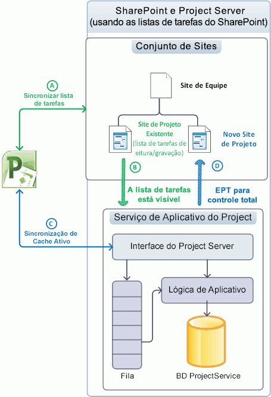
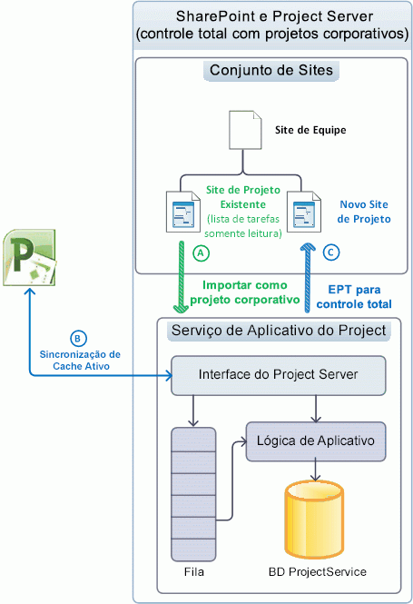
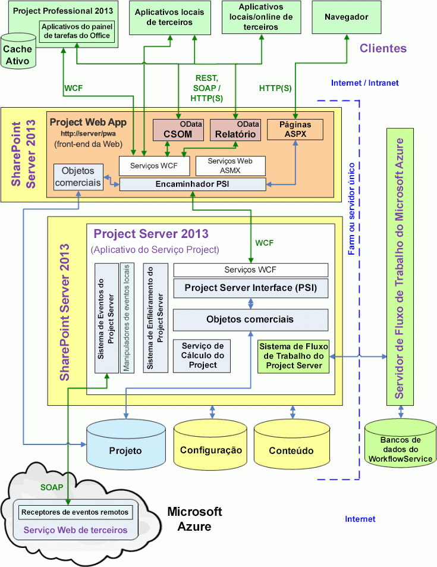
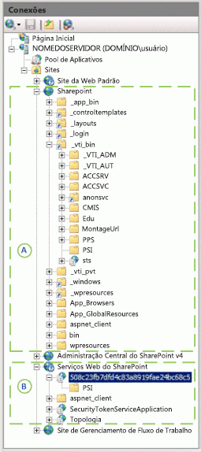

# Arquitetura do Project ServerProject Server architecture

O Project Server 2013 integra funcionalidade de gerenciamento de projetos em um farm do SharePoint e habilita o uso do Project Online com um modelo de objeto do lado cliente (CSOM) e uma interface OData para os dados de Relatórios.Project Server 2013 integrates project management functionality throughout a SharePoint farm and enables the use of Project Online with a client-side object model (CSOM) and an OData interface for the Reporting data.
   
O Project Server 2013 é um sistema multicamadas que estende a arquitetura introduzida no Office Project Server 2007.Project Server 2013 is a multitiered system that extends the architecture introduced in Office Project Server 2007. As alterações de arquitetura incluem a associação do Serviço do Aplicativo do Project com conjuntos de sites do SharePoint, a adição de alguns objetos comerciais ao front-end da Web (WFE), o modelo do objeto do lado cliente (CSOM) para acesso remoto, um único banco de dados do Project, uma interface OData para as tabelas e exibições de Relatórios, integração do Windows Workflow Foundation versão 4 (WF4) por meio do Workflow Manager Client 1.0 na nuvem ou em um servidor local e receptores de eventos remotos acessíveis por várias instalações do Project Server.Architectural changes include association of the Project Application Service with SharePoint site collections, the addition of some business objects on the web front-end (WFE), the client-side object model (CSOM) for remote access, a single Project database, an OData interface for the Reporting tables and views, integration of Windows Workflow Foundation version 4 (WF4) through Workflow Manager Client 1.0 in the cloud or on a local server, and remote event receivers that are accessible by multiple Project Server installations. Além de soluções personalizadas locais, você pode criar aplicativos que incluam receptores de eventos remotos e componentes que acessem as interfaces do CSOM e OData.In addition to on-premises custom solutions, you can create apps that include remote event receivers and components that access the CSOM and OData interfaces.
  
A camada de front-end inclui o Project Professional 2013, o Project Web App e aplicativos de terceiros.The front-end tier includes Project Professional 2013, Project Web App, and third-party apps. Os aplicativos clientes podem se comunicar com a camada do meio através da Project Server Interface (PSI) ou através dos pontos de extremidade do CSOM que, por sua vez, se comunicam com o PSI e a camada do objeto de negócios.Client applications communicate with the middle tier through the Project Server Interface (PSI) or through the CSOM endpoints, which in turn communicate with the PSI and the business object layer. O acesso ao banco de dados é integrado nos objetos de negócios.Database access is integrated in the business objects. O Project Server Eventing System pode acessar os manipuladores de eventos locais e os receptores de eventos remotos.The Project Server Eventing System can access both local event handlers and remote event receivers. O Serviço de Cálculo do Project implementa o mecanismo de agendamento do Project Professional no Project Server.The Project Calculation Service implements the Project Professional scheduling engine within Project Server. Os aplicativos clientes não têm (ou não devem ter) acesso direto ao banco de dados do Project. O Project Server oculta objetos de negócios dos clientes.Client applications do not (or should not) directly access the Project database; Project Server hides business objects from clients.
  
> [!NOTE]
> O Project Server é criado na arquitetura do SharePoint.Project Server is built on the SharePoint architecture. Para saber mais sobre a arquitetura do SharePoint Server 2013 e o modelo do aplicativo do SharePoint, confira a seção *Introdução ao desenvolvimento do SharePoint* na documentação do desenvolvedor do Office 2013.For information about SharePoint Server 2013 architecture and the SharePoint app model, see the  *Getting started with SharePoint development*  section in the Office 2013 developer documentation. 

## Integrando com conjuntos de sites do SharePointIntegrating with SharePoint site collections

O Serviço do Aplicativo do Project no Project Server 2013 pode ser associado a um conjunto de sites do SharePoint para ser usado com listas de tarefas do SharePoint. O Serviço do Aplicativo do Project também pode importar uma lista de tarefas do SharePoint como um projeto corporativo para controle total do Project Server.The Project Application Service in Project Server 2013 can be associated with a SharePoint site collection for use with SharePoint tasks lists, The Project Application Service can also import a SharePoint tasks list as an enterprise project for full Project Server control. Através de uma lista de tarefas do SharePoint, o SharePoint mantém o site do projeto em um conjunto de sites. O Project Professional pode sincronizar e atualizar a lista de tarefas.With a SharePoint tasks list, SharePoint maintains the project site in a site collection; Project Professional can synchronize with and update the tasks list. Um site de projeto pode ser uma lista de tarefas do SharePoint independente sincronizada com um arquivo .mpp. Esse arquivo pode ser armazenado localmente ou em uma biblioteca do SharePoint.A project site can be an independent SharePoint tasks list or a tasks list that is synchronized with an .mpp file; the .mpp file can be stored locally or in a SharePoint library. 
  
O Project Server mantém os projetos quando tem controle total. O Project Professional salva dados diretamente no Project Server.Project Server maintains the projects when it has full control; Project Professional saves data directly to Project Server. A Tabela 1 compara o comportamento de uma lista de tarefas, o Schedule Web Part e outras funcionalidades para o controle de listas de tarefas do SharePoint e para projetos importados quando o Project Server tem controle total.Table 1 compares the behavior of a tasks list, the Schedule web part, and other functionality for SharePoint control of tasks lists and for imported projects when Project Server has full control. O Schedule Web Part contém a grade na página do Project Web App onde é possível editar uma programação de projeto.The Schedule web part contains the grid on the Project Web App page where you can edit a project schedule. O modo associado é onde os dados de status são inseridos uma vez para as tarefas e quadros de horários. No modo de entrada única, os dados de status das tarefas são inseridos separadamente dos quadros de horários.The tied mode is where statusing data is entered once for both tasks and timesheets; in single entry mode, task statusing data is entered separately from timesheets.
  
**Tabela 1. Comparação de listas de tarefas do SharePoint e controle total****Table 1. Comparison of SharePoint task lists and full control**

| RecursoFeature | Lista de tarefasTask list | Controle totalFull-control |
|:-----|:-----|:-----|
|**Lista de tarefas no SharePoint****Task list in SharePoint**   |Leitura/gravaçãoRead/write    |Somente leituraRead-only    |
|**Schedule Web Part****Schedule web part**   |Somente leituraRead-only    |Leitura/gravaçãoRead/write    |
|**Relatórios****Reporting**   |Relatórios avançados pelo Project ServerRich reporting through Project Server    |Relatórios avançados pelo Project ServerRich reporting through Project Server    |
|**Outra funcionalidade do Project Server****Other Project Server functionality**   | Funcionalidade bloqueada:Blocked functionality:   - Edições do projeto no lado do servidor, com o Project Web App ou aplicativos cliente personalizados- Server-side project edits, with Project Web App or custom client applications   - Status- Statusing   - As tarefas não ficam visíveis no modo de ligação- Tasks are not visible in tied mode    |A funcionalidade completa está habilitadaFull functionality is enabled    |
   
### Como gerenciar projetos como listas de tarefas do SharePointManaging projects as SharePoint task lists

Quando o Project Server está associado a um conjunto de sites do SharePoint do qual o SharePoint mantém o controle, as listas de tarefas e arquivos do Project Professional 2013 (.mpp) em bibliotecas de documentos ficam visíveis para o Serviço do Aplicativo do Project. No entanto, o SharePoint mantém os dados mestres para sincronização (veja a Figura 1).When Project Server is associated with a SharePoint site collection where SharePoint maintains control, task lists and Project Professional 2013 (.mpp) files in document libraries are visible to the Project Application Service, but SharePoint maintains the master data for synchronization (see Figure 1). Não é possível realizar o agendamento do lado do servidor com o Schedule Web Part.Server-side scheduling with the Schedule web part cannot be done. Você pode usar o Project Professional para sincronizar e editar a lista de tarefas em um site de projeto.You can use Project Professional to synchronize with and edit the task list in a project site. Tendo as listas de tarefas do SharePoint como ponto de partida, as organizações podem evoluir gradualmente para usar a funcionalidade completa do Project Server.By starting with SharePoint task lists, organizations can gradually evolve to use the full functionality of Project Server.
  
A Figura 1 mostra os seguintes processos quando os projetos são mantidos nas listas de tarefas do SharePoint:Figure 1 shows the following processes when projects are maintained in SharePoint task lists: 
  
- (A) O Project Professional pode sincronizar com listas de tarefas e criar novos sites do projeto no conjunto de sites antes ou depois da associação ao Serviço do Aplicativo do Project.(A) Project Professional can synchronize with task lists and create new project sites in the site collection either before or after association with the Project Application Service.
    
- (B) O Project Server sincroniza com dados do site do projeto para fins de relatórios, mas o SharePoint mantém os dados mestres; as listas de tarefas permanecem de leitura/gravação.(B) Project Server synchronizes with project site data for reporting purposes, but SharePoint maintains the master data; task lists remain read/write.
    
- (C) Após a associação, o Project Professional pode criar novos projetos e salvá-lo ou publicá-lo no Project Server. O Cache Ativo no Project Professional mantém a sincronização de dados com o Project Server.(C) After association, Project Professional can create new projects and save or publish to Project Server. The Active Cache in Project Professional maintains data synchronization with Project Server.
    
- (D) Quando um novo projeto é publicado no Project Professional, o usuário tem a opção de criar um site de projeto para o projeto.(D) When a new project is published in Project Professional, the user has the option of creating a project site for the project. Um projeto também pode ser criado no Project Web App como um tipo de projeto de lista de tarefas do SharePoint ou como um tipo de projeto corporativo (EPT) de controle total.A project can also be created in Project Web App as a SharePoint task list project type or as a full-control enterprise project type (EPT). A Etapa (D) mostra o EPT de controle total.Step (D) shows the full-control EPT.
    
**Figura 1. Como usar sites do projeto como listas de tarefas do SharePoint****Figure 1. Using project sites as SharePoint task lists**

 

### Como gerenciar projetos com controle totalManaging projects with full control

Quando o Project Server está associado a um conjunto de sites e tem controle total, ele importa as listas de tarefas do SharePoint como projetos corporativos e pode excluir todos os arquivos .mpp relacionados.When Project Server is associated with a site collection and has full control, Project Server imports SharePoint task lists as enterprise projects, and can delete any related .mpp files. O Project Server mantém os dados mestres para a sincronização da lista de tarefas. As listas de tarefas no conjunto de sites tornam-se somente leitura (veja a Figura 2).Project Server maintains the master data for task list synchronization; task lists in the site collection become read-only (see Figure 2). Os projetos importados podem ser editados usando o Project Professional ou o Project Web App.Imported projects can be edited by using Project Professional or by using Project Web App.
  
> [!NOTE]
> Depois que o Project Server importar um projeto, o usuário escolherá excluir o projeto do site ou interromper a conexão antes da edição do projeto. Você pode fazer a escolha no Project Professional.After Project Server imports a project, the user chooses whether to delete the project from the site or break the connection before editing the project. You can make the choice in Project Professional. 
  
A Figura 2 mostra os processos a seguir quando o Project Server mantém projetos corporativos com controle total:Figure 2 shows the following processes when Project Server maintains enterprise projects with full control:
  
- (A) O usuário pode escolher quais sites do projeto serão importados. O Project Server importa os sites do projeto e, opcionalmente, exclui os arquivos .mpp associados. A lista de tarefas do SharePoint de um projeto importado se torna somente leitura.(A) The user can choose which project sites to import. Project Server imports the project sites, and optionally deletes associated .mpp files. The SharePoint task list of an imported project becomes read-only.
    
- (B) Após a associação, o Project Professional cria novos projetos e salva ou publica no Project Server.(B) After association, Project Professional creates new projects and saves or publishes to Project Server. O Cache Ativo no Project Professional mantém a sincronização de dados com o Project Server.The Active Cache in Project Professional maintains data synchronization with Project Server. A Schedule Web Part no Project Web App pode fazer o agendamento no lado do servidor.The Schedule web part in Project Web App can do server-side scheduling.
    
- (C) Quando um novo projeto é publicado no Project Professional, o usuário tem a opção de criar um site de projeto para o projeto.(C) When a new project is published in Project Professional, the user has the option of creating a project site for the project. Também é possível criar um projeto no Project Web App com o EPT de controle total e publicá-lo com uma lista de tarefas somente leitura em um site do projeto no conjunto de sites.A project can also be created in Project Web App with a full-control EPT and published with a read-only task list to a project site in the site collection.
    
**Figura 2. Como usar sites do projeto com controle total****Figure 2. Using project sites with full control**

  
## Arquitetura geralGeneral architecture

A Figura 3 mostra uma exibição generalizada da arquitetura do Project Server 2013, incluindo o Aplicativo do Serviço do Project, uma instância do Project Web App em um WFE e vários outros aplicativos clientes, incluindo o Project Professional 2013.Figure 3 shows a generalized view of the Project Server 2013 architecture, including the Project Service Application, one Project Web App instance on a WFE, and several other client applications including Project Professional 2013.
  
Pode haver várias instâncias do Project Web App que se comunicam com o Aplicativo do Serviço do Project de back-end.There can be multiple Project Web App instances that communicate with the back-end Project Service Application. Para uma instalação local, o WFE pode estar em um servidor separado em um farm do SharePoint ou pode estar no mesmo servidor do SharePoint com o Aplicativo do Serviço do Project.For an on-premises installation, the WFE can be on a separate server in a SharePoint farm, or it can be on the same SharePoint server with the Project Service Application. O Project Online inclui um WFE, o Aplicativo do Serviço do Project e um servidor local ou remoto do Workflow Manager Client 1.0.Project Online includes a WFE, the Project Service Application, and a local or remote Workflow Manager Client 1.0 server. 
  
**Figura 3. Arquitetura geral do Project Server 2013****Figure 3. General Project Server 2013 architecture**

 

Os comentários gerais à seguir aplicam-se à Figura 3:The following general comments apply to Figure 3:
  
- **Project Online:** você pode criar aplicativos que usam as interfaces CSOM, REST e OData.**Project Online:** You can create apps that use the CSOM, REST, and OData interfaces. Um pacote de aplicativos também pode instalar receptores de eventos remotos em um serviço da Web personalizado em um servidor local, em um servidor do Azure ou no Microsoft Azure.An app package can also install remote event receivers in a custom web service on a local server, on an Azure server, or on Microsoft Azure. O Project Online não oferece suporte a soluções locais de terceiros, à interface do WCF, à interface ASMX ou a manipuladores de eventos locais.Project Online does not support third-party on-premises solutions, the WCF interface, the ASMX interface, or local event handlers. 
    
- **Receptores de eventos:** os receptores de evento também podem ser chamados de manipuladores de eventos.**Event receivers:** Event receivers can also be called event handlers. O Project Online oferece suporte ao registro de receptores de eventos remotos do Project Server que podem ser usados por uma instância do Project Web App na nuvem ou por uma instalação do Project Server no local.Project Online supports registration of remote Project Server event receivers, which can be used by a Project Web App instance in the cloud or by an on-premises Project Server installation. Uma instalação do Project Server local oferece suporte a receptores de eventos remotos e manipuladores de eventos de confiança total locais.An on-premises Project Server installation supports remote event receivers and local full-trust event handlers. 
    
- **Navegadores:** não há limitações entre navegadores para visualizar algumas páginas do Project Web App como há no Project Server 2010.**Browsers:** There are no cross-browser limitations on viewing some Project Web App pages, as there are in Project Server 2010. Os navegadores da Web a seguir têm suporte para uso completo com o Project Web App:The following browsers are supported for full use with Project Web App: 
    
  - Internet Explorer 8.x (no Windows 7 e em versões anteriores do Microsoft Windows), Internet Explorer 9.x e Internet Explorer 10.xInternet Explorer 8.x (on Windows 7 and earlier versions of Microsoft Windows), Internet Explorer 9.x, and Internet Explorer 10.x 
  - Firefox 4.x (no Windows, Mac OS-X e Linux/Unix)Firefox 4.x (on Windows, Mac OS-X, and Linux/Unix)
  - Safari 5.x (no Windows e no Mac OS-X)Safari 5.x (on Windows and Mac OS-X)
  - ChromeChrome
    
- **Interfaces programáticas:** para aplicativos de terceiros, o Project Online expõe a interface HTTP/HTTPS (incluindo REST), a interface CSOM, um serviço OData para o CSOM e um serviço OData para relatórios.**Programmatic interfaces:** For third-party apps, Project Online exposes the HTTP/HTTPS interface (including REST), the CSOM interface, an OData service for the CSOM, and an OData service for reporting. Para aplicativos cliente de terceiros que estão no local (na Intranet), você pode usar a interface do WCF para PSI ou usar as interfaces CSOM, OData e REST por meio de HTTP.For third-party client applications that are on-premises (on the Intranet), you can use the WCF interface for the PSI, or you can use the CSOM, OData, and REST interfaces through HTTP. Os clientes do Project Web App e do Project Professional 2013 usam a interface do WCF.The Project Web App and Project Professional 2013 clients both use the WCF interface. Em uma instalação de servidor único, os serviços Web de front-end ASMX, CSOM e REST chamam internamente os serviços do WCF de back-end.In a single-server installation, the front-end ASMX web services, CSOM, and REST internally call the back-end WCF services. 
    
    > [!NOTE]
    > A interface do ASMX baseada em SOAP para serviços Web na PSI ainda está disponível no Project Server 2013, mas foi preterida.The SOAP-based ASMX interface for web services in the PSI is still available in Project Server 2013, but is deprecated. 
  
    O serviço OData para relatórios é implementado pelo serviço interno OData.svc do WCF.The OData service for reporting is implemented by the internal OData.svc WCF service. Você pode obter o Documento de metadados do serviço dos dados de relatório usando `https://ServerName/ProjectServerName/_api/ProjectData/$metadata`.You can get the Service Metadata Document for the reporting data by using  `https://ServerName/ProjectServerName/_api/ProjectData/$metadata`. 
    
    O serviço OData para o CSOM destina-se a plataformas como o Windows RT, o iOS e o Android, onde você pode usar a interface REST com o JavaScript em páginas HTML.The OData service for the CSOM is intended for platforms such as Windows RT, iOS, and Android, where you can use the REST interface with JavaScript in HTML pages. 
    
    > [!NOTE]
    > Embora a opção `$metadata` para o serviço de relatório **ProjectData** seja válido, a opção`$metadata` para o serviço **ProjectServer** do CSOM é removida na versão do Project Server 2013.Although the  `$metadata` option for the **ProjectData** reporting service is valid, the  `$metadata` option for the **ProjectServer** service of the CSOM is removed in the released version of Project Server 2013. Para saber mais sobre as consultas REST, confira [Modelo de objeto do cliente (CSOM) para o Project Server](client-side-object-model-csom-for-project-2013.md).For more information about REST queries for the CSOM, see [Client-side object model (CSOM) for Project Server](client-side-object-model-csom-for-project-2013.md). 
  
- **Encaminhador PSI:** o acesso programático à PSI em um WFE separado passa pelo Encaminhador PSI, que inclui um Encaminhador WCF e um Encaminhador Serviço Web.**PSI Forwarder:** Programmatic access to the PSI on a separate WFE goes through the PSI Forwarder, which includes a WCF Forwarder and a Web Service Forwarder. Clientes que usam a interface ASMX acessam a PSI pelo Encaminhador Serviço Web.Clients that use the ASMX interface access the PSI through the Web Service Forwarder. Clientes que usam a interface WCF acessam a PSI pelo Encaminhador WCF.Clients that use the WCF interface access the PSI through the WCF Forwarder. O acesso programático pelo CSOM, OData e REST é canalizado pelo Encaminhador WCF.Programmatic access through the CSOM, OData, and REST is piped through the WCF Forwarder. 
    
- **Fluxos de trabalho:** fluxos de trabalho declarativos (fluxos de trabalho definidos no SharePoint Designer 2013) são descarregados para o Workflow Manager Client 1.0 para processamento.**Workflows:** Declarative workflows (workflows that are defined in SharePoint Designer 2013) are offloaded to Workflow Manager Client 1.0 for processing. O Workflow Manager Client 1.0 pode ser executado em um servidor separado no farm do SharePoint, no Microsoft Azure em nuvem ou em um computador exclusivo do Project Server para teste e demonstrações.Workflow Manager Client 1.0 can run on a separate server in the SharePoint farm, on Microsoft Azure in the cloud, or on a single Project Server computer for testing or demonstrations. Os fluxos de trabalho codificados desenvolvidos com o Visual Studio 2012 são processados no tempo de execução do fluxo de trabalho dentro do SharePoint Server, como no Project Server 2010.Coded workflows that are developed with Visual Studio 2012 are processed in the workflow runtime within SharePoint, as in Project Server 2010. Para saber mais confira [Introdução ao desenvolvimento de fluxos de trabalho do Project Server](getting-started-developing-project-server-workflows.md).For more information, see [Getting started developing Project Server workflows](getting-started-developing-project-server-workflows.md).
    
- **Rede de perímetro (DMZ):**  a Figura 3 não mostra que um servidor WFE local pode ser isolado por um firewall adicional em uma rede de perímetro (também conhecida como "zona desmilitarizada" ou DMZ).**Perimeter network (DMZ):** Figure 3 does not show that an on-premises WFE server can be isolated by an additional firewall in a perimeter network (also known as a "demilitarized zone" or DMZ). Uma rede de perímetro pode permitir que clientes da Internet acessem o SharePoint e o Project Server passando por um firewall.A perimeter network can allow Internet clients to access SharePoint and Project Server across a firewall. 
    
- **SharePoint Web Services:**  a Figura 3 não mostra a infraestrutura do SharePoint, como o aplicativo de back-end SharePoint Web Services, que faz parte do SharePoint Server 2013.**SharePoint Web Services:** Figure 3 does not show the SharePoint infrastructure, such as the back-end SharePoint Web Services application, which is part of SharePoint Server 2013. Quando você instala o Project Server, o Aplicativo do Serviço do Project é adicionado ao SharePoint Web Services.When you install Project Server, the Project Service Application is added to the SharePoint Web Services. 
    
A camada de front-end inclui aplicativos de terceiros, o Project Professional e o Project Web App.The front-end tier includes third-party applications, Project Professional, and Project Web App. O navegador exibe páginas do ASP.NET 4.0 (páginas .aspx) no Project Web App.A browser displays ASP.NET 4.0 pages (.aspx pages) in Project Web App. As páginas do Project Web App usam Web Parts do Project Server que se comunicam com a PSI e também usam Web Parts do SharePoint padrão.The Project Web App pages use Project Server Web Parts that communicate with the PSI and also use standard SharePoint Web Parts. 
  
A camada intermediária inclui a PSI e a camada de objeto de negócios, que consiste em objetos lógicos que representam entidades comerciais do Project Server.The middle tier includes the PSI and the business object layer, which consists of logical objects that represent Project Server business entities. As entidades de negócios incluem Projeto, Tarefa, Recurso, Atribuição e assim por diante.Business entities include Project, Task, Resource, Assignment, and so on. A PSI e o nível do objeto de negócios estão fortemente acoplados e estão localizados no mesmo servidor.The PSI and the business object tier are tightly coupled and are located on the same server. Um aplicativo cliente chama a PSI por meio de uma das interfaces disponíveis e a PSI invoca objetos de negócios.A client application calls the PSI through one of the available interfaces, and the PSI invokes business objects. Para melhorar o desempenho, o WFE do Project Server 2013 inclui alguns objetos de negócios para solicitações que não usam o Sistema de Enfileiramento do Project Server ou exigem o Serviço de Cálculo do Project.For improved performance, the WFE of Project Server 2013 includes some business objects for requests that do not use the Project Server Queuing System or require the Project Calculation Service. Os objetos de negócios do WFE se comunicam diretamente com o banco de dados do Project.The WFE business objects communicate directly with the Project database.
  
Os componentes Project Web App do Project Server usam o banco de dados de configuração do SharePoint 2013 para configuração do site do projeto e o banco de dados de conteúdo para conteúdo do site do projeto, como listas de tarefas, páginas personalizadas, fluxos de trabalho, configurações de gerenciamento, documentos e listas de problemas, riscos e compromissos.The Project Web App components of Project Server use the SharePoint 2013 configuration database for project site setup and the content database for project site content such as task lists, custom pages, workflows, management settings, documents, and lists of issues, risks, and commitments. Os bancos de dados de configuração e de conteúdo do SharePoint dão suporte a recursos adicionais para gerenciamento de projetos, como modelos e espaços de trabalho de projeto, listas personalizadas para colaboração em equipe e relatórios.The SharePoint configuration and content databases support additional features for project management, such as project templates and workspaces, custom lists for team collaboration, and reports.
  
### Project Web App e o WFEProject Web App and the WFE

Você pode configurar várias instâncias do Project Web App em um WFE e vários servidores WFE em uma intranet corporativa para permitir a distribuição de carga para clientes de intranet.You can configure multiple Project Web App instances on a WFE and multiple WFE servers within a corporate intranet to enable load distribution for intranet clients. Quando um aplicativo cliente usa uma instância do Project Web App em um servidor WFE separado, as chamadas PSI são roteadas pelo Encaminhador PSI.When a client application uses a Project Web App instance on a separate WFE server, PSI calls are routed through the PSI Forwarder. O Encaminhador PSI (o Encaminhador WCF ou o Encaminhador Serviço Web) executa as seguintes funções:The PSI Forwarder (either the WCF Forwarder or the Web Service Forwarder) performs the following functions:
  
- Otimiza as chamadas de clientes remotos para a PSI.Optimizes calls to the PSI from remote clients.
    
- Distingue entre chamadas PSI que exigem o Serviço de Fila do Project Server e aquelas que não. Os nomes de método de PSI assíncrona começam com Queue, como **QueueCreateProject**.Distinguishes between PSI calls that require the Project Server Queue Service, and those that do not. Asynchronous PSI method names begin with Queue, such as **QueueCreateProject**.
    
- Identifica chamadas PSI que invocam manipuladores de eventos locais registrados.Identifies PSI calls that invoke registered local event handlers.
    
- Identifica chamadas à PSI que exigem o Serviço de Cálculo do Project.Identifies PSI calls that require the Project Calculation Service.
    
- Usa um cache baseado em servidor que funciona com o Cache Ativo do lado do cliente no Project Professional para reduzir as chamadas de ida e volta para o Project Server.Uses a server-based cache that works with the client-side Active Cache in Project Professional to reduce roundtrip calls to Project Server.
    
Depois que o SharePoint Server autentica um usuário do Project Server, o Encaminhador PSI envia, de forma transparente, solicitações que usam serviços de back-end para os serviços PSI no computador que executa o Project Server.After SharePoint Server authenticates a Project Server user, the PSI Forwarder transparently sends requests that use back-end services to the PSI services on the computer running Project Server. As solicitações que não exigem serviços de back-end são enviadas para os objetos de negócios na instância local do Project Web App.Requests that do not require back-end services are sent to the business objects in the local Project Web App instance. O Encaminhador PSI melhora a escalabilidade, o desempenho e a confiabilidade do processamento do Project Server na LAN, em uma WAN e no Project Online.The PSI Forwarder improves scalability, performance, and reliability for Project Server processing over the LAN, a WAN, and in Project Online.
  
O Project Web App é desenvolvido com o ASP.NET 4.0.Project Web App is developed with ASP.NET 4.0. Os elementos visuais em arquivos .aspx (HTML, controles de servidor e texto estático) são separados da lógica de programação em classes de código subjacente que estão em assemblies compilados (arquivos .dll).The visual elements in .aspx files (HTML, server controls, and static text) are separate from the programming logic in code-behind classes that are in compiled assemblies (.dll files). As páginas do site no Project Web App, como a página de nível superior, o Centro de Projeto e a Central de Relatórios, podem ser personalizadas com Web Parts.Site pages in Project Web App, such as the top-level page, Project Center, and Report Center, can be customized by using Web Parts. As páginas do aplicativo que não têm uma opção **Editar Página** no menu **Ações do Site** não podem ser editadas, como a página Configurações do Servidor e a página Revisar Quadro de Horários.Application pages that do not have an **Edit Page** option in the **Site Actions** menu cannot be edited, such as the Server Settings page and the Review Timesheet page. 
  
### O CSOM e a Interface do Project ServerThe CSOM and the Project Server Interface

A PSI é fatorada em 22 serviços públicos, como **Project**, **Resource**, **CustomField** e **Statusing**.The PSI is factored into 22 public services, such as **Project**, **Resource**, **CustomField**, and **Statusing**. A PSI também contém sete serviços particulares para uso interno.The PSI also contains seven private services for internal use. A PSI é a API fundamental do Project Server. Ela expõe a funcionalidade do Project Server ao CSOM e a aplicativos externos.The PSI is the fundamental API of Project Server; it exposes Project Server functionality to the CSOM and to external applications. O CSOM inclui classes que acessam as classes e os membros da PSI mais usados, utilizados para aplicativos de terceiros.The CSOM includes classes that access the most commonly used PSI classes and members that are used for third-party applications. No Project Server 2013, algumas funcionalidades do Project Server não estão disponíveis no CSOM, como os serviços **Admin**, **Calendar**, **PortfolioAnalyses** e **Security**.In Project Server 2013, some Project Server functionality is not available in the CSOM, such as the **Admin**, **Calendar**, **PortfolioAnalyses**, and **Security** services. 
  
O Project Professional 2013 e o Project Web App usam o PSI para acessar os dados do Project Server nas tabelas e exibições de rascunho, publicadas e arquivadas do banco de dados do Project.Project Professional 2013 and Project Web App use the PSI to access Project Server data in the draft, published, and archive tables and views of the Project database. Você pode acessar um serviço do PSI através de um arquivo de proxy ou de um assembly de proxy, tanto para os serviços do WCF ou para os serviços Web do ASMX.You can access a PSI service through a proxy file or a proxy assembly, for either the WCF services or the ASMX web services.
  
> [!NOTE]
> O CSOM é a interface preferencial para desenvolvedores do Project Server terceirizados; pode ser usado para aplicativos que acessam uma instalação local do Project Server e o Project Online.The CSOM is the preferred interface for third-party Project Server developers; it can be used for applications that access both an on-premises Project Server installation and Project Online. Recomendamos que você use o CSOM para o desenvolvimento de novos aplicativos, caso o CSOM inclua a funcionalidade exigida por seu aplicativo.We recommend that you use the CSOM for developing new applications, if the CSOM includes the functionality that your application requires. 
  
Alguns aplicativos de linha de negócios (LOB) e outros aplicativos de terceiros desenvolvidos para o Project Server 2010 exigem serviços do PSI que ainda estejam representados no CSOM.Some line-of-business (LOB) applications and other third-party applications that were developed for Project Server 2010 require PSI services that are not yet represented in the CSOM. Se eles se destinarem somente a uma instalação local do Project Server, os aplicativos poderão continuar a usar a interface do WCF ou a interface do ASMX da PSI.If they target only an on-premises installation of Project Server, applications can continue to use the WCF interface or the ASMX interface of the PSI.
  
Os aplicativos cliente chamam o PSI por meio de proxies de serviço.Client applications call the PSI through service proxies. Os clientes que usam a interface do WCF acessam todos os serviços do PSI pelo `https://ServerName/ProjectServerName/_vti_bin/psi/ProjectServer.svc`.Clients that use the WCF interface access all PSI services through  `https://ServerName/ProjectServerName/_vti_bin/psi/ProjectServer.svc`. Os clientes que usam uma interface de serviço Web ASMX usam a URL do Project Web App para o serviço específico.Clients that use an ASMX web service interface use the Project Web App URL for the specific service. Por exemplo, o serviço **Resource** está em `https://ServerName/ProjectServerName/_vti_bin/psi/resource.asmx?wsdl`.For example, the **Resource** service is at  `https://ServerName/ProjectServerName/_vti_bin/psi/resource.asmx?wsdl`. Se os aplicativos não tiverem acesso à intranet no Project Server, eles poderão usar um servidor do Project Web App em uma rede de perímetro (não mostrada na Figura 3).If applications do not have intranet access to Project Server, they can use a Project Web App server in a perimeter network (not shown in Figure 3).
  
A Figura 4 exibe o painel **Conexões** no **Gerenciador dos Serviços de Informações da Internet (IIS)** para uma instalação de servidor único do SharePoint Server 2013, Project Server 2013 e um site local de Gerenciamento de Fluxo de Trabalho para o Workflow Manager Client 1.0.Figure 4 shows the **Connections** pane in **Internet Information Services (IIS) Manager** for a single-server installation of SharePoint Server 2013, Project Server 2013, and a local Workflow Management site for Workflow Manager Client 1.0. O conjunto de sites do SharePoint (A) inclui os serviços do PSI de front-end no subdiretório virtual `_vti_bin\PSI`.The SharePoint site collection (A) includes the front-end PSI services in the  `_vti_bin\PSI` virtual subdirectory. O aplicativo SharePoint Web Services (B) inclui o Aplicativo do Serviço do Project, com os serviços de back-end do PSI no subdiretório virtual `508c23fb7dfd4c83a8919fae24bc68c5/PSI`.The SharePoint Web Services application (B) includes the Project Service Application, with the back-end PSI services in the  `508c23fb7dfd4c83a8919fae24bc68c5/PSI` virtual subdirectory. O GUID é o nome da instância do Aplicativo do Serviço do Project para essa instalação do Project Server.The GUID is the name of the Project Service Application instance for that Project Server installation. 
  
**Figura 4. Gerenciador do IIS mostrando o PSI de front-end (A) e o PSI de back-end (B)****Figure 4. IIS Manager showing the front-end PSI (A), and the back-end PSI (B)**

  
Os aplicativos cliente não podem acessar diretamente os serviços do WCF para o PSI no Aplicativo do Serviço do Project de back-end.Client applications cannot directly access the WCF services for the PSI in the back-end Project Service Application. Se eles não exigirem acesso ao Project Online, os aplicativos cliente e os componentes dos aplicativos LOB usarão proxies para o PSI.If they do not require access to Project Online, client applications and components of LOB applications use proxies for the PSI. Uma URL de back-end para a interface do WCF do serviço **Resource** na Figura 4, por exemplo, seria `https://ServerName:32843/508c23fb7dfd4c83a8919fae24bc68c5/psi/resource.svc`.A back-end URL for the WCF interface of the **Resource** service in Figure 4, for example, would be  `https://ServerName:32843/508c23fb7dfd4c83a8919fae24bc68c5/psi/resource.svc`. A porta 32843 é a porta HTTP padrão para o aplicativo SharePoint Web Services (32844 é a porta para comunicações HTTPS).Port 32843 is the default HTTP port for the SharePoint Web Services application (32844 is the port for HTTPS communications). No entanto, o arquivo web.config do Project Web App bloqueia o acesso direto aos serviços de back-end do PSI.However, the web.config file for Project Web App blocks direct access to back-end PSI services.
  
> [!NOTE]
> O download do SDK do Project 2013 inclui arquivos de proxy do PSI para os serviços do WCF e para os serviços do ASMX, além de instruções sobre como compilá-los para assemblies de proxy.The Project 2013 SDK download includes PSI proxy files for the WCF services and the ASMX services, and instructions for how to compile them into proxy assemblies. > Para criar arquivos de proxy da PSI atualizados que usam o interface do WCF, você terá de usar o utilitário svcutil.exe ou o Visual Studio diretamente no computador do Project Server.> To create updated PSI proxy files that use the WCF interface, you have to use the svcutil.exe utility or Visual Studio directly on the Project Server computer. 
  
Membros dos serviços PSI normalmente produzir ou consumir objetos **conjunto de dados** tipados como meio de troca de informações de objetos comerciais.Members of the PSI services typically produce or consume typed **DataSet** objects as the means to exchange information with the business objects. Existem também vários modelos diferentes para o desenvolvimento da PSI.There are also several different models for PSI development. Por exemplo, os serviços PSI **Resource**, **CustomFields** e **LookupTable** PSI usam objetos de filtro XML para manipulação **DataSet** e outros serviços não. Alguns métodos no serviço **Statusing** usam um parâmetro _changeXml_, enquanto outros métodos e serviços não.For example, the **Resource**, **CustomFields**, and **LookupTable** PSI services use XML filter objects for **DataSet** manipulation, and other services do not; some methods in the **Statusing** service use a  _changeXml_ parameter, while other methods and services do not. O CSOM não utiliza conjuntos de dados.The CSOM does not use datasets. Embora o CSOM tenha um modelo de programação diferente da PSI, e você possa usar assemblies do .NET ou JavaScript, o desenvolvimento com o CSOM é geralmente mais simples e mais consistente se comparado com o desenvolvimento com a PSI.Although the CSOM has a different programming model than the PSI, and you can use either .NET assemblies or JavaScript, development with the CSOM is generally simpler and more consistent than development with the PSI. 
  
Para obter mais informações sobre a PSI, confira [Visão geral da referência de PSI do Project](project-psi-reference-overview.md).For more information about the PSI, see [Project PSI reference overview](project-psi-reference-overview.md). Para saber mais sobre o CSOM, confira [Modelo de objeto do cliente (CSOM) para o Project 2013](client-side-object-model-csom-for-project-2013.md).For more information about the CSOM, see [Client-side object model (CSOM) for Project 2013](client-side-object-model-csom-for-project-2013.md).
  
### Objetos de negócios no WFE e no Aplicativo do Serviço do ProjectBusiness objects in the WFE and the Project Service Application

O modelo de objeto interno do Project Server inclui os objetos de negócios, que representam entidades lógicas, como Projeto e Recurso. Os aplicativos cliente só acessam objetos de negócios por meio do CSOM ou da PSI. Os objetos de negócios, por sua vez, acessam as tabelas e as exibições de rascunho, de publicação e de arquivo morto do banco de dados do Project.The internal object model of Project Server includes the business objects, which represent logical entities such as Project and Resource. Client applications access business objects only through the CSOM or the PSI. Business objects, in turn, access the draft, published, and archive tables and views in the Project database.
  
Os objetos de negócios não são expostos a desenvolvedores terceirizados. A PSI manipula o mapeamento da API para objetos de negócios, e o CSOM mapeia sua API para o PSI. As entidades lógicas dos objetos de negócios podem ser classificadas em três tipos:Business objects are not exposed to third-party developers. The PSI handles mapping of the API to business objects, and the CSOM maps its API to the PSI. The logical entities of business objects can be classified into three types:
  
- **Entidades fundamentais** são objetos como projetos, tarefas, atribuições, recursos e calendários. As entidades fundamentais incluem lógica comercial básica, como permissões e nomenclatura.**Core entities** are objects such as projects, tasks, assignments, resources, and calendars. The core entities include basic business logic such as permissions and naming rules. 
    
- **Entidades comerciais** são objetos como quadros de horários, portfólios de projeto e modelos. As entidades comerciais incluem lógica comercial adicional e normalmente são criadas de uma combinação das entidades fundamentais.**Business entities** are objects such as timesheets, project portfolios, and models. Business entities include additional business logic and usually are built from a combination of the core entities. 
    
- As **entidades de suporte** são objetos como segurança e validação.**Support entities** are objects such as security and validation. 
    
No Project Server 2010, todos os objetos de negócios são implementados no Aplicativo do Serviço do Project.In Project Server 2010, all business objects are implemented in the Project Service Application. No Project Server 2013, o WFE hospeda muitos dos objetos de negócios que processam métodos síncronos e não exigem o Serviço de Cálculo do Project.In Project Server 2013, the WFE hosts many of the business objects that process synchronous methods and do not require the Project Calculation Service. Os métodos de PSI síncrona, como **DeleteProject** e **ReadAssignments**, não usam o Serviço de Fila do Project Server.Synchronous PSI methods such as **DeleteProject** and **ReadAssignments** do not use the Project Server Queue Service. Os métodos assíncronos na PSI têm nomes que começam com `Queue`, como **QueueCreateProject** e **QueueUpdateTimesheet**.Asynchronous methods in the PSI have names that start with  `Queue`, such as **QueueCreateProject** and **QueueUpdateTimesheet**. Um método assíncrono envia uma mensagem ao Serviço de Fila do Project Server que agenda o processamento do método enquanto o controle é retornado ao usuário.An asynchronous method sends a message to the Project Server Queue Service, which schedules processing of the method while control is returned to the user.
  
O Encaminhador PSI determina quais solicitações são encaminhadas para o Aplicativo do Serviço do Project e quais podem ser processadas pelos objetos de negócios no WFE. Os objetos de negócios no WFE ignoram o Aplicativo do Serviço do Project e têm acesso direto ao banco de dados do Project, semelhante à maneira que outros processos do SharePoint em um WFE acessam diretamente os bancos de dados de Configuração e de Conteúdo. A execução de vários dos objetos de negócios no WFE aumenta a eficiência do Project Server, reduz a carga na camada do aplicativo e permite que o Project Server seja melhor dimensionado para cargas de trabalho maiores.The PSI Forwarder determines which requests are sent to the Project Service Application and which can be processed by the business objects in the WFE. The business objects in the WFE bypass the Project Service Application and have direct access to the Project database, similar to the way other SharePoint processes in a WFE directly access the Configuration and Content databases. Running many of the business objects on the WFE improves the efficiency of Project Server, reduces the load on the application tier, and enables Project Server to better scale up for increased workloads.
  
> [!NOTE]
> No Project Server 2013, os manipuladores de eventos locais devem ser implantados no WFE e no computador de back-end do Project Server.In Project Server 2013, local event handlers must be deployed to the WFE and to the back-end Project Server computer. 
  
### Banco de dados do Project ServerProject Server database

No Project Server 2013, os quatro bancos de dados do Project Server de versões anteriores são combinados em um banco de dados do Project no SQL Server.In Project Server 2013, the four Project Server databases of previous versions are combined into one Project database in SQL Server. O nome do banco de dados padrão do Project é ProjectService.The default Project database name is ProjectService. As tabelas e exibições de relatório mantêm seus nomes anteriores com o prefixo `dbo`, como dbo.MSP_EpmProject e dbo.MSP_EpmProject_UserView.The reporting tables and views retain their previous names with the  `dbo` prefix, such as dbo.MSP_EpmProject and dbo.MSP_EpmProject_UserView. As tabelas e as exibições que anteriormente estavam no banco de dados Rascunho têm o prefixo `draft`.Tables and views that were previously in the Draft database have the  `draft` prefix. As tabelas e as exibições do banco de dados Publicado têm o prefixo `pub`.Tables and views from the Published database have the  `pub` prefix. As tabelas e as exibições do banco de dados Arquivo morto têm o prefixo `ver`.Tables and views from the Archive database have the  `ver` prefix. 
  
> [!IMPORTANT]
> O acesso direto não é suportado pelas tabelas e visualizações de rascunho (prefixo `draft`), publicado (prefixo `pub`) e arquivo (prefixo `ver`).Direct access is not supported for the draft ( `draft` prefix), published (  `pub` prefix), and archive (  `ver` prefix) tables and views. Os relatórios devem usar apenas as tabelas e exibições de relatório que têm o prefixo `dbo`.Reports should use only the reporting tables and views, which have the  `dbo` prefix. 
  
Os dados do Project Server são particionados no banco de dados do Project da seguinte maneira:Project Server data is partitioned in the Project database as follows:
  
- As tabelas e exibições de rascunho contêm dados de projetos não publicados criados pelo Project Professional e outros aplicativos.The draft tables and views contain data from unpublished projects that were created by Project Professional and other applications. O Project Web App não exibe dados de projeto das tabelas e exibições de rascunho.Project Web App does not display project data from the draft tables and views.
    
- As tabelas e exibições publicadas contêm todos os projetos e recursos publicados da empresa, dados globais para tipos de projeto corporativo (EPTs) e outros modelos de projeto.The published tables and views contain all of the published projects and enterprise resources, global data for enterprise project types (EPTs), and other project templates. Projetos publicados são visíveis no Project Web App.Published projects are visible in Project Web App. Os dados publicados também incluem tabelas específicas do Project Web App (quadros de horários, modelos, visualizações e assim por diante) e tabelas de dados globais (campos personalizados, tabelas de consulta, permissões de autorização do Project Server e metadados).The published data also includes tables that are specific to Project Web App (timesheets, models, views, and so on), and global data tables (custom fields, lookup tables, Project Server authorization permissions, and metadata).
    
- Os dados de arquivamento salvam versões de backup de projetos, recursos, campos personalizados e outros dados.The archive data saves backup versions of projects, resources, custom fields, and other data.
    
- Os dados de relatório podem ser usados para acesso somente leitura em aplicativos de terceiros e para relatórios.The reporting data can be used for read-only access in third-party applications, and for reports. Os cubos OLAP do Project Server usam as exibições de relatório que possuem o sufixo `_OlapView`.Project Server OLAP cubes use the reporting views that have the  `_OlapView` suffix. Os cubos OLAP estão disponíveis em uma instalação local do Project Server, mas não estão disponíveis no Project Online.OLAP cubes are available in an on-premises Project Server installation, but are not available in Project Online. 
    
    Os dados de relatórios são abrangentes e são atualizados quase em tempo real. As tabelas e exibições de relatórios são otimizadas para geração de relatório somente leitura; por exemplo, as tabelas de relatórios são desordenados para oferecerem dados redundantes e reduzirem o número de tabelas relacionais.Reporting data is comprehensive and is updated nearly in real time. The reporting tables and views are optimized for read-only report generation; for example, the reporting tables are denormalized to provide redundant data and reduce the number of relational tables.
    
As entidades lógicas, como Recurso ou Projeto, podem se estender por várias tabelas, e todas as tabelas para uma entidade em particular têm a mesma chave primária. A chave primária é o GUID em uma única coluna que identifica exclusivamente uma instância de uma entidade em particular.Logical entities such as Resource or Project can span multiple tables, and all tables for a particular entity have the same primary key. The primary key is a GUID in a single column that uniquely identifies one instance of a particular entity.
  
Os dados do Project Server para cada instância do Project Web App são armazenados em um banco de dados separado do Project com um nome diferente.Project Server data for each instance of Project Web App is stored in a separate Project database with a different name. Aplicativos cliente que possuem acesso direto ao Project Server podem ler diretamente as tabelas e exibições de relatórios.Client applications that have direct access to Project Server can directly read the reporting tables and views. Para acesso remoto, os aplicativos cliente podem usar a interface OData e a interface REST para obter dados para relatórios.For remote access, client applications can use the OData interface and the REST interface to get data for reports. Os clientes devem usar apenas o CSOM ou a PSI para acessar as tabelas e exibições de rascunho, publicadas e arquivadas.Clients should use only the CSOM or the PSI to access the draft, published, and archive tables and views. O serviço de dados de relatório (RDS, que não é mostrado na Figura 3) atualiza os dados de relatório de dados publicados praticamente em tempo real.The Reporting Data Service (RDS, which is not shown in Figure 3) updates the reporting data from published data in nearly real time. O banco de dados do Project pode estar localizado em um servidor separado.The Project database can be located on a separate server.
  
Os esquemas são documentados apenas para as tabelas e exibições de relatórios.Schemas are documented only for the reporting tables and views. Para uma instalação local do Project Server, você pode adicionar tabelas e exibições de relatórios para entidades que não estão definidas no esquema de banco de dados do Project.For an on-premises Project Server installation, you can add reporting tables and views for entities that are not defined in the Project database schema. Você também pode criar bancos de dados separados para aplicativos locais personalizados.You can also create separate databases for custom on-premises applications. A modificação não é suportada pelas tabelas e exibições Rascunho, Publicado e Arquivo.Modification is not supported for the draft, published, and archive tables and views. Se o seu aplicativo ou relatório personalizado exigir objetos SQL personalizados (por exemplo, tabelas e exibições), é recomendável criá-los em um banco de dados personalizado.If your custom application or report requires custom SQL objects (for example, tables and views), we recommend that you create these in a custom database. Como o banco de dados do Project não está diretamente acessível no Project Online, as tabelas e exibições de relatório não podem ser modificadas.Because the Project database is not directly accessible in Project Online, reporting tables and views cannot be modified. No entanto, se você tiver uma conta do SQL Azure, poderá criar bancos de dados separados para uso personalizado com o Project Online.However, if you have a SQL Azure account, you can create separate databases for custom use with Project Online.
  
### Receptores de eventosEvent receivers

Os manipuladores de eventos locais e receptores de eventos remotos do Project Server permitem extensibilidade de terceiros em resposta a eventos do Project Server, como criar ou publicar um projeto.Local event handlers and remote event receivers for Project Server enable third-party extensibility in response to Project Server events such as creating or publishing a project. No Project Server 2010, todos os manipuladores de eventos são locais e são gravados em código de confiança total, implantados diretamente no computador que está executando o Project Server e nos WFEs e executados dentro do Project Server Eventing System.In Project Server 2010, all event handlers are local and are written in full-trust code, deployed directly on the computer running Project Server and to the WFEs, and run inside the Project Server Eventing System. Como o Project Online não pode usar manipuladores de eventos de confiança total, o Project Server 2013 implementa receptores de eventos remotos que são semelhantes aos receptores de eventos remotos no SharePoint Server 2013.Because Project Online cannot use full-trust event handlers, Project Server 2013 implements remote event receivers that are similar to the remote event receivers in SharePoint Server 2013. Uma instalação local do Project Server 2013 pode usar manipuladores de eventos de confiança total tradicionais e receptores de eventos remotos.An on-premises installation of Project Server 2013 can use traditional full-trust event handlers and remote event receivers.
  
Um receptor de eventos remotos do Project Server pode ser implementado em um serviço Web personalizado com um ponto de extremidade SOAP executado no Microsoft Azure ou em outros ambientes que deem suporte a serviços Web SOAP.A Project Server remote event receiver can be implemented in a custom web service with a SOAP endpoint that runs in Microsoft Azure or other environments that support SOAP web services. Um pacote de aplicativos do Project Server pode incluir receptores de eventos remotos instalados com o aplicativo.A Project Server app package can include remote event receivers that are installed with the app.
  
Os receptores de eventos remotos podem retornar a chamada para o Project Server usando os terminais CSOM (não mostrados na Figura 3).Remote event receivers can call back into Project Server by using the CSOM endpoints (not shown in Figure 3). A chamada para um receptor de eventos remoto inclui informações do Project Server Eventing System e da instância do Project Web App (ou o locatário do Project Web App no Project Online) que emite a chamada.The call to a remote event receiver includes information from the Project Server Event System and the Project Web App instance (or the Project Web App tenant in Project Online) that issues the call. Os receptores de eventos remotos permitem criar e hospedar um único serviço Web que pode ser usado por várias instalações do Project Server.Remote event receivers enable you to create and host a single web service that can be used by multiple Project Server installations. Por outro lado, os manipuladores de eventos de confiança total locais devem ser implantados para cada instalação do Project Server.By contrast, local full-trust event handlers must be deployed to each installation of Project Server.
  
### Publicação e agendamento do servidorPublishing and server-side scheduling

O Project Server 2013 suporta atualizações manuais e automatizadas do cronograma do projeto.Project Server 2013 supports both manual and automated project schedule updates. O processo padrão é uma atualização de programação manual.The default process is a manual schedule update. Ou seja, o gerente de projeto faz check-out e abre um projeto no Project Professional ou no Project Web App, aplica as alterações e, em seguida, salva e publica o projeto para disponibilizar as alterações para todas as pessoas.That is, the project manager checks out and opens a project in Project Professional or Project Web App, applies the changes, and then saves and publishes the project to make the changes available to everyone. O Project Professional possui um mecanismo de agendamento que calcula as alterações e salva as alterações no Project Server.Project Professional has a scheduling engine that calculates changes and then saves the changes to Project Server. No Project Server 2010, o mecanismo de agendamento do lado do servidor é uma implementação diferente do mecanismo de agendamento no Project Professional.In Project Server 2010, the server-side scheduling engine is a different implementation from the scheduling engine in Project Professional.
  
No Project Server 2013, o Serviço de Cálculo do Project implementa o mecanismo de agendamento do Project Professional 2013.In Project Server 2013, the Project Calculation Service implements the same scheduling engine that is in Project Professional 2013. O Serviço de Cálculo do Project é executado em um serviço do Windows chamado **Serviço de Cálculo do Microsoft Project Server**.The Project Calculation Service runs in a Windows service named **Microsoft Project Server Calculation Service**. A edição de um agendamento de projeto no Project Web App ou com aplicativos de terceiros que usam o CSOM resulta exatamente nas mesmas alterações de agendamento que o Project Professional faria.Editing a project schedule in Project Web App or with third-party applications that use the CSOM results in exactly the same schedule changes that Project Professional would make.
  
> [!NOTE]
> Os aplicativos de terceiros que usam a PSI podem apresentar algumas diferenças de agendamento de um agendamento calculado pelo Project Web App.Third-party applications that use the PSI may show some scheduling differences from a schedule that Project Web App calculates. Para compatibilidade com versões anteriores, os métodos PSI públicos que fazem o agendamento no servidor ainda usam o mecanismo de agendamento que foi introduzido no Project Server 2010.For backward-compatibility, the public PSI methods that do server-side scheduling still use the scheduling engine that was introduced in Project Server 2010. **QueueUpdateProject2** é uma exceção já que é um novo método PSI no Project Server 2013.An exception is **QueueUpdateProject2**, which is a new PSI method in Project Server 2013. Por exemplo, o mecanismo de agendamento mais antigo não agenda subprojetos ou links para outros projetos e não calcula campos de valor agregado.For example, the older scheduling engine does not schedule subprojects or links to other projects, and does not calculate earned value fields. Para evitar possíveis diferenças de agendamento entre aplicativos de terceiros e o Project Professional ou o Project Web App, você deve desenvolver aplicativos com o CSOM sempre que possível.To avoid potential scheduling differences between third-party applications and Project Professional or Project Web App, you should develop applications with the CSOM where possible. 
  
O Project Server permite que a versão publicada de um projeto seja atualizada enquanto um gerente de projeto estiver usando a versão de rascunho, por meio destas etapas:Project Server allows the published version of a project to be updated while a project manager is using the draft version, by the following steps:
  
1. O Project Server aplica atualizações e reagenda a versão publicada.Project Server applies updates and reschedules the published version.
    
2. O Project Server salva a atualização para aplicar à versão de rascunho quando um destes eventos ocorrer:Project Server saves the update to apply to the draft version when either of the following events occur:
    
   - O Project Professional abre o projeto.Project Professional opens the project.
    
   - O Project Professional tenta publicar o projeto.Project Professional tries to publish the project.
    
3. Se houver um conflito, o gerente de projeto será notificado e deverá resolver o conflito antes que a versão de rascunho seja publicada.If there is a conflict, the project manager is notified and must resolve the conflict before the draft version can be published.
    
## Confira tambémSee also

- [Visão geral do Project 2013 para desenvolvedoresProject 2013 overview for developers](https://msdn.microsoft.com/library/8da91ab0-af4f-429f-8241-490600e3f7bd%28Office.15%29.aspx)
- [Programabilidade do Project ServerProject Server programmability](project-server-programmability.md)  
- [Modelo de objeto do cliente (CSOM) para o Project 2013Client-side object model (CSOM) for Project 2013](client-side-object-model-csom-for-project-2013.md)  
- [O que a PSI faz e não fazWhat the PSI does and does not do](what-the-psi-does-and-does-not-do.md)  
- [Introdução ao desenvolvimento de fluxos de trabalho do Project ServerGetting started developing Project Server workflows](getting-started-developing-project-server-workflows.md)   
- [Visão geral da referência da PSI do ProjectProject PSI reference overview](project-psi-reference-overview.md)   
- [Protocolo Open DataOpen Data Protocol](https://www.odata.org/)
    

