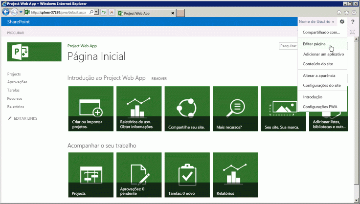
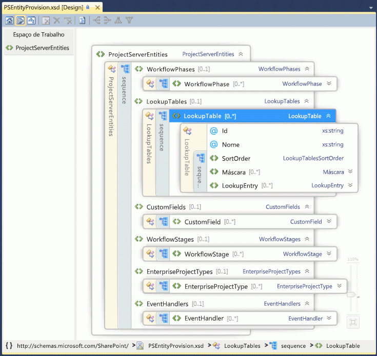

# Programabilidade do Project ServerProject Server programmability

Saiba mais sobre os principais recursos de programação do Project Server 2013.Learn about the major programmability features in Project Server 2013. Este artigo contém informações sobre a portabilidade de aplicativos que foram criados para versões anteriores do Project Server.This article includes information about porting applications that were built for previous versions of Project Server.

O Project Server 2013 foi projetado para suportar a maioria dos aplicativos desenvolvidos para o Project Server 2010 e novas soluções para várias plataformas, em que os aplicativos podem acessar as instalações on-line e no local do Project Server.Project Server 2013 is designed to support most applications that were developed for Project Server 2010 and new solutions for multiple platforms, where apps can access both online and on-premises Project Server installations. Aplicativos e extensões que foram desenvolvidas para o Project Server 2003 ou anterior devem ser reformuladas para usar o modelo de objeto do lado cliente (CSOM) ou Interface do servidor do projeto.Applications and extensions that were developed for Project Server 2003 or earlier must be redesigned to use the client-side object model (CSOM) or the Project Server Interface (PSI). Os aplicativos que foram desenvolvidos para o Project Server 2010 ou Office Project Server 2007 podem exigir algumas alterações e recompilar o uso do PSI; Para usar o CSOM, esses aplicativos exigem um novo design.Applications that were developed for Office Project Server 2007 or Project Server 2010 may require some changes and recompiling to use the PSI; to use the CSOM, those applications require a redesign.
  
A plataforma do Project Server permite altos níveis de produtividade do programador criando no SharePoint Server 2013, o .NET Framework 4 e no protocolo OData com o CSOM.The Project Server platform enables high levels of programmer productivity by building on SharePoint Server 2013, .NET Framework 4, and the OData protocol with the CSOM. Os desenvolvedores podem estender o Project Web App com aplicativos, partes de aplicativos e Web Parts, definir fluxos de trabalho usando o SharePoint Designer 2013 e aplicar regras de negócios usando receptores de eventos remotos para eventos do Project Server.Developers can extend Project Web App with apps, app parts, and Web Parts, define workflows by using SharePoint Designer 2013, and enforce business rules by using remote event receivers for Project Server events.
  
## Project Server e SharePoint ServerProject Server and SharePoint Server

O Project Web App foi criado a partir do SharePoint Server 2013 e usa Web Parts e páginas mestras para facilitar a criar aplicativos personalizados e soluções do Project Web App.Project Web App is built upon SharePoint Server 2013, and uses master pages and Web Parts to make it easier to build custom apps and Project Web App solutions. O Project Server 2013 integra-se profundamente ao SharePoint Server 2013 como a plataforma para colaboração de projetos, relatórios, administração de sites, segurança e gerenciamento de fluxo de trabalho.Project Server 2013 integrates deeply with SharePoint Server 2013 as the platform for project collaboration, reporting, site administration, security, and workflow management.
  
Os sites do projeto incluem mais opções de informações e colaboração para os membros da equipe, onde você pode adicionar aplicativos padrão que incluem um resumo do projeto, listas especializadas do SharePoint para tarefas com cronograma, rastreamento de problemas, riscos, entregas do projeto e o calendário da equipe. biblioteca de documentos e discussões em equipe.The project sites include more information and collaboration options for team members, where you can add default apps that include a project summary, specialized SharePoint lists for tasks with a timeline, tracking issues, risks, project deliverables, and the team calendar, along with the document library and team discussions. Aplicativos personalizados para o Project Server 2013 fornecem extensões e a flexibilidade de colaboração em equipe.Custom apps for Project Server 2013 provide extensions and flexibility for team collaboration. Você também pode adicionar partes do aplicativo para personalizar um aplicativo, usando o mesmo mecanismo para adicionar e editar Web Parts, quando você edita uma página.You can also add app parts to customize an app, by using the same mechanism to add and edit Web Parts when you edit a page. Você pode localizar os sites de projeto em qualquer lugar no farm do SharePoint onde o Project Server está instalado.You can locate project sites anywhere within the SharePoint farm where Project Server is installed. Para usar outros serviços básicos do SharePoint Server 2013, como os Serviços do Excel e o Enterprise Search, um administrador pode habilitar e configurar os serviços.To use other core services of SharePoint Server 2013, such as Excel Services and Enterprise Search, an administrator can enable and configure the services. 
  
Quando você instala o Project Server 2013, você pode configurar o Aplicativo do Serviço do Project é adicionado ao SharePoint Web Services.When you install Project Server, the Project Service Application is added to the SharePoint Web Services. O aplicativo de serviço do Project inclui serviços locais do Windows Communication Foundation (WCF) e serviços web ASMX para PSI.The Project Service Application includes the local Windows Communication Foundation (WCF) services and ASMX web services for the PSI. Outros exemplos de aplicativos de serviço incluem a Pesquisa do SharePoint e o Gerenciamento de documentos do SharePoint.Other examples of service applications include SharePoint Search and SharePoint Document Management. Para saber mais, confira a documentação de desenvolvedor do SharePoint Server 2013.For more information, see the SharePoint Server 2013 developer documentation.
  
O Aplicativo de Serviço do Project é um provedor de serviços lógico que pode gerenciar várias instâncias do Project Web App.The Project Service Application is a logical service provider that can manage multiple instances of Project Web App. A configuração do Project Server cria um site específico do Project Web App em um aplicativo da web do SharePoint.Project Server provisioning creates a specific Project Web App site within a SharePoint web application. A  página inicial do Project Web App contém links para a página da Central de projetos, a página da Central de recursos e a página de Central de Business Intelligence para relatórios, além de uma página que contém uma lista de outros aplicativos padrão.The Home page of Project Web App contains links to the Project Center page, Resource Center page, and the Business Intelligence Center page for reporting, plus a page that contains a list of additional standard apps. A figura 1 mostra o comando **Editar página** na lista suspensa de **configuração**na página inicial do Project Web App, que permite que você adicione ou edite Web Parts.Figure 1 shows the **Edit Page** command in the **Setttings** drop-down list on the Home page of Project Web App, which allows you to add or edit Web Parts. 
  
> [!NOTE]
> Algumas páginas administrativas do Project Web App, como a página de configurações do PWA, não são editáveis e não mostram o comando **Editar página**.Some administrative pages in Project Web App—such as the PWA Settings page—are not editable, and do not show the **Edit Page** command. O Project Web App não permite editar páginas usando o SharePoint Designer 2013.Project Web App does not allow you to edit pages by using SharePoint Designer 2013. Você pode editar as páginas do site do projeto com o SharePoint Designer 2013.You can edit project site pages with SharePoint Designer 2013. 
  
**Figura 1. Usando o menu Editar página no Project Web App****Figure 1. Using the Edit Page menu in Project Web App**

  
Para acessar a página de configurações do Site no Project Web App, escolha o ícone**configurações** no canto superior direito da página.To access the Site Settings page in Project Web App, choose the **Settings** icon in the top-right corner of the page. A página Configurações do Site ( `https://ServerName/ProjectServerName/_layouts/15/settings.aspx`) permite alterar a aparência e o tema do site, adicionar Web Parts personalizadas e modificar ou criar páginas mestras de sites de projetos.The Site Settings page (  `https://ServerName/ProjectServerName/_layouts/15/settings.aspx`) enables changing the look and feel and the site theme, adding custom Web Parts, and modifying or creating master pages for project sites.
  
A personalização do código em páginas ASPX ou a personalização de páginas mestras do Project Web App com o SharePoint Designer 2013 não são suportadas.Customization of the code in ASPX pages, or customization of Project Web App master pages with SharePoint Designer 2013, is not supported. A personalização do código nas páginas do Project Web App pode causar problemas com atualizações e service packs do Project Server.Customization of the code in Project Web App pages can cause problems with Project Server updates and service packs. 
  
### Personalização do Project Web App com pacotes do SharePointCustomization of Project Web App with SharePoint packages

Como o Project Web App é um aplicativo do SharePoint e sites de projeto são sites do SharePoint, você pode adicionar aplicativos personalizados, Web Parts, manipuladores de eventos, campos personalizados e outros recursos usando pacotes do SharePoint (arquivos .wsp) ou aplicativos do SharePoint (arquivos .spapp ).Because Project Web App is a SharePoint application, and project sites are SharePoint sites, you can add custom apps, Web Parts, event handlers, custom fields, and other features by using SharePoint packages (.wsp files) or SharePoint apps (.spapp files). Um pacote do SharePoint ou um pacote de aplicativos pode incluir várias entidades do Project Server, nas quais as definições de entidade são especificadas em um arquivo elements.xml no pacote.A SharePoint package or an app package can include multiple Project Server entities, where entity definitions are specified in an elements.xml file within the package.
  
No Project Online, você pode adicionar botões à faixa de opções do Project Web App, mas não pode remover ou renomear os botões existentes de produto e não pode criar novas guias da faixa de opções.For Project Online, you can add buttons to the Project Web App ribbon, but you can't remove or rename existing product buttons, and you can't create new ribbon tabs. Para saber mais, confira [Crie ações personalizadas para implantar com aplicativos para o SharePoint](https://msdn.microsoft.com/library/office/apps/jj163954%28v=office.15%29.aspx).For more information, see [Create custom actions to deploy with apps for SharePoint](https://msdn.microsoft.com/library/office/apps/jj163954%28v=office.15%29.aspx).
  
> [!CAUTION]
> Ao instalar um pacote do SharePoint ou um pacote de aplicativos, os tipos de entidades do Project Server devem aparecer na ordem que o esquema PSEntityProvision.xsd especifica ou a validação de esquema do pacote falha e a instalação não é concluída.When you install a SharePoint package or an app package, the types of Project Server entities must appear in the order that the PSEntityProvision.xsd schema specifies or schema validation of the package fails and installation is not completed. 
  
O arquivo de esquema PSEntityProvision.xsd está disponível no download SDK do Project 2013, na subpasta `Documentation\Schemas\AppProvisioning`.The PSEntityProvision.xsd schema file is available in the Project 2013 SDK download, in the  `Documentation\Schemas\AppProvisioning` subdirectory. A figura 2 mostra o modo de exibição do Explorer de esquema XML no Visual Studio do esquema **PSEntityProvision**, onde a sequência **LookupTable** é expandida.Figure 2 shows the XML Schema Explorer view in Visual Studio of the **PSEntityProvision** schema, where the **LookupTable** sequence is expanded. 
  
**Figura 2. Modo de exibição do Visual Studio do esquema de provisionamento de entidade do Project Server****Figure 2. Visual Studio view of the Project Server entity provisioning schema**

  
Os pacotes do SharePoint que instalam recursos para o Project Server podem conter um ou mais arquivos elements.xml que seguem o esquema**PSEntityProvision**.SharePoint packages that install features for Project Server can contain one or more elements.xml files that follow the **PSEntityProvision** schema. As entidades do Project Server em um único arquivo XML devem aparecer na seguinte ordem:The Project Server entities in a single XML file must appear in the following order: 
  
1. Fases do fluxo de trabalhoWorkflow Phases
    
2. Tabelas de pesquisaLookup tables
    
3. Campos personalizadosCustom Fields
    
4. Estágios do fluxo de trabalhoWorkflow Stages
    
5. Tipos de Projeto de EmpresaEnterprise Project Types
    
6. Manipuladores de eventosEvent handlers
    
Quando você cria um pacote do SharePoint que contém as entidades do Project Server, é possível colocar as definições de entidade em vários arquivos elements.xml.When you create a SharePoint package that contains Project Server entities, it is possible to put the entity definitions in multiple elements.xml files. Cada arquivo XML pode passar na validação de esquema, 
mas as entidades no pacote inteiro podem não estar na ordem correta.Each XML file could pass the schema validation, but the entities in the whole package might not be in the correct order. Por exemplo, uma entidade de campo personalizado no primeiro arquivo XML pode se referir a uma tabela de pesquisa no segundo arquivo XML.For example, a custom field entity in the first XML file could refer to a lookup table in the second XML file. Durante a instalação, o campo personalizado não pode ser criado porque a tabela de pesquisa ainda não foi criada.During installation, the custom field cannot be created because the lookup table has not yet been created.
  
Se uma instalação do pacote falhar, os objetos que foram criados permanecerão no Project Web App, mas o pacote de não instalará completamente.If a package installation fails, objects that have been created remain in Project Web App, but the package does not install completely. Reinstalar o pacote pode funcionar, mas isso não é uma boa experiência para os clientes.Reinstalling the package can work, but that is not a good experience for customers. Quando as definições de entidade abrangerem vários arquivos elements.xml, organize as entidades do Project Server em todo o pacote do SharePoint para garantir que a instalação siga a ordem correta.When the entity definitions span multiple elements.xml files, organize the Project Server entities in the entire SharePoint package to ensure that installation follows the correct order. Com o esquema PSEntityProvision.xsd no download do Project 2013 SDK, é possível desenvolver uma ferramenta que verifica a ordem prescrita de entidades nos arquivos XML.With the PSEntityProvision.xsd schema in the Project 2013 SDK download, it is possible to develop a tool that checks for the prescribed order of entities in the XML files.
  
## Atualizar aplicativos com as APIs do Project ServerUpgrading applications with the Project Server APIs

Quando você atualiza um aplicativo que foi desenvolvido para uma versão anterior do Project Server, você pode optar por usar o CSOM ou o PSI para uma interface programática que inclua métodos para criar, ler, atualizar e excluir entidades do projeto (as operações CRUD).When you upgrade an application that was developed for a previous version of Project Server, you can choose to use either the CSOM or the PSI for a programmatic interface that includes methods to create, read, update, and delete project entities (the CRUD operations). Embora o CSOM internamente chame o PSI, ele não substitui totalmente todos os métodos PSI.Although the CSOM internally calls the PSI, it does not fully replace all PSI methods. Para cenários e limitações de PSI e o CSOM, confira [O que o PSI faz e não faz](what-the-psi-does-and-does-not-do.md) e [O que o CSOM faz e não faz](what-the-csom-does-and-does-not-do.md).For scenarios and limitations of the PSI and of the CSOM, see [What the PSI does and does not do](what-the-psi-does-and-does-not-do.md) and [What the CSOM does and does not do](what-the-csom-does-and-does-not-do.md).
  
> [!NOTE]
> Se o CSOM incluir a funcionalidade necessária, recomendamos que você atualize os aplicativos para usar o CSOM.If the CSOM includes the functionality you plan to use, we recommend that you use the CSOM for new apps. O CSOM permite que os aplicativos sejam usados ​​para instalações locais e on-line do Project Server 2013.The CSOM enables applications to be used for both on-premises and online installations of Project Server 2013. 
  
Se o seu aplicativo ler principalmente dados do Project Server, você poderá usar as tabelas e exibições de relatórios no banco de dados do Project Server para um cenário local.If your application primarily reads data from Project Server, you can use the reporting tables and views in the Project Server database for an on-premises scenario. Se você pretende usar o aplicativo com o Project Online, você pode usar o protocolo OData para o serviço **ProjectData**, que fornece acesso local e on-line aos dados de relatório.If you intend to use the application with Project Online, you can use the OData protocol for the **ProjectData** service, which provides both on-premises and online access to the reporting data. Para obter mais informações, confira [ProjectData ‒  referência do serviço ProjectOData](https://msdn.microsoft.com/library/office/jj163015.aspx).For more information, see [ProjectData - Project OData service reference](https://msdn.microsoft.com/library/office/jj163015.aspx)
  
### Usando o PSIUsing the PSI reference

O PSI permite que aplicativos de confiança total do cliente, incluindo os aplicativos Project Professional 2013, Project Web App e LOB, acessem dados do Project Server em um farm do SharePoint.The PSI enables full-trust client applications, including Project Professional 2013, Project Web App, and LOB applications, to access Project Server data within a SharePoint farm. O PSI é criado e usado com o .NET Framework 4 e oferece vantagens, como um ambiente de desenvolvimento conhecido, com segurança interna, tratamento de erros e coleta de lixo.The PSI is built and used with .NET Framework 4 and provides advantages such as a well-known development environment with built-in security, error handling, and garbage collection.
  
O PSI é acessado por meio de serviços WCF ou serviços da web ASMX.The PSI is accessed through WCF services or ASMX web services. A interface ASMX se baseia no WCF.The ASMX interface is based on WCF. Cada serviço PSI normalmente contém uma classe base com métodos CRUD para itens dentro dessa classe.Each PSI service typically contains a base class with CRUD methods for items within that class. Os itens são especificados pelas classes relacionadas **Dataset**.Items are specified by related **DataSet** classes. Por exemplo, o serviço **CustomFields** serviço contém a classe **CustomFields** com métodos, como [CreateCustomFields2](https://msdn.microsoft.com/library/WebSvcCustomFields.CustomFields.CreateCustomFields2.aspx) .For example, the **CustomFields** service contains the **CustomFields** class with methods such as [CreateCustomFields2](https://msdn.microsoft.com/library/WebSvcCustomFields.CustomFields.CreateCustomFields2.aspx) . Os dados de um ou mais campos personalizados da empresa são especificados em **CustomFieldDataSet**.Data for one or more enterprise custom fields are specified in the **CustomFieldDataSet**.
  
> [!NOTE]
> A interface de serviço Web ASMX da PSI foi preterida no Project Server 2013.The ASMX web service interface of the PSI is deprecated in Project Server 2013, but is still supported. Embora a interface ASMX ainda esteja disponível, novos aplicativos que usam o PSI devem usar a interface do WCF ou, se possível, novos aplicativos devem usar o CSOM em vez do PSI.Although the ASMX interface is still available, new applications that use the PSI should use the WCF interface, or if possible, new applications should use the CSOM instead of the PSI. Versões futuras do Project Server exigirão uma atualização dos aplicativos baseados em ASMX existentes para usar a interface WCF do PSI ou para usar o CSOM.Future versions of Project Server will require an upgrade of existing ASMX-based applications to use the WCF interface of the PSI or to use the CSOM. 
  
Existem 22 serviços PSI documentados e públicos, que são duplicados na interface do WCF e na interface do ASMX.There are 22 public, documented PSI services, which are duplicated in the WCF interface and the ASMX interface. O PSI também inclui oito serviços privados não documentados.The PSI also includes eight private, undocumented services. O Project Web App e o Project Professional usam os serviços PSI públicos e os serviços PSI privados.Project Web App and Project Professional use the public PSI services and the private PSI services. O PSI geralmente é acrescentado para corresponder aos objetos de negócios.The PSI is generally factored to match the business objects. Ou seja, cada método PSI está associado a um objeto comercial, como **Calendário** ou **Recurso**.That is, each PSI method is associated with a business object such as **Calendar** or **Resource**. A PSI é a interface principal de objetos comerciais.The PSI is the primary interface to the business objects. Como a camada de negócios fornece componentes de lógica de negócios reutilizáveis, diferentes aplicativos que interagem com os dados do Project Server usam a mesma lógica de negócios.Because the business layer provides reusable business logic components, different applications that interact with Project Server data use the same business logic.
  
Os métodos PSI que interagem assincronamente com o Project Server têm nomes que começam com **Queue**.PSI methods that asynchronously interact with Project Server have names that begin with **Queue**. Cada método PSI é implementado com uma interface separada que usa dados fortemente digitados.Each PSI method is implemented with a separate interface that uses strongly typed data. Por exemplo, o método **QueueCreateProject** no serviço **projeto**aceita o parâmetro _dataset_ tipo **ProjectDataSet**.For example, the **QueueCreateProject** method in the **Project** service accepts the  _dataset_ parameter of type **ProjectDataSet**. A classe**ProjectDataSet**deriva o tipo **DataSet**.The **ProjectDataSet** class is derived from the **DataSet** type. A verificação de tipo no .NET Framework e a conclusão do IntelliSense no Visual Studio ajudam a reduzir erros no desenvolvimento com o PSI.Type checking in the .NET Framework and IntelliSense completion in Visual Studio help to reduce errors in development with the PSI. Para obter uma introdução à referência detalhada para namespaces, classes, métodos, propriedades, eventos e assemblies relacionados do PSI, consulte [Visão geral da referência da PSI do Project](project-psi-reference-overview.md).For an introduction to the detailed reference for PSI namespaces, classes, methods, properties, events, and related assemblies, see [Project PSI reference overview](project-psi-reference-overview.md).
  
O Project Server 2013 usa o tratamento de exceções do .NET Framework.Project Server 2013 uses the exception handling of the .NET Framework. Todos os erros são registrados no servidor, na parte superior da pilha PSI.All errors are logged in the server, at the top of the PSI stack. Alguns erros enviam um relatório simples para o cliente, como um objeto **SoapException** para a interface ASMX ou um objeto **FaultException** para a interface WCF.Some errors send a simple report to the client, such as a **SoapException** object for the ASMX interface or a **FaultException** object for the WCF interface. As exceções podem ser registradas no log de eventos do aplicativo e alguns erros também registram um relatório detalhado no servidor nos logs de rastreamento do ULS (Unified Logging Service).Exceptions can be recorded in the application event log, and some errors also record a detailed report on the server in the Unified Logging Service (ULS) trace logs. 
  
Para aplicativos locais de confiança total, o PSI também é extensível.For local full-trust applications, the PSI is also extensible. Você pode adicionar um assembly .NET a um serviço que forneça novas funcionalidades, usa a mesma infraestrutura de segurança do Project Server e chama outros métodos PSI ou herda classes PSI.You can add a .NET assembly with a service that provides new functionality, uses the same Project Server security infrastructure, and calls other PSI methods or inherits from PSI classes. Uma extensão PSI também pode fornecer a lógica de negócios e o acesso ao banco de dados necessários para a nova funcionalidade.A PSI extension can also provide the business logic and database access required for new functionality.
  
### Usando o CSOMUsing the CSOM

Com o CSOM, você pode desenvolver aplicativos que acessam o Project Online ou uma instalação do Project Server 2013 no local.With the CSOM, you can develop apps that access Project Online or an on-premises Project Server 2013 installation. Os aplicativos podem ser distribuídos em uma loja pública do Office ou em um catálogo de aplicativos particulares.Apps can be distributed in a public Office Store or a private app catalog. O CSOM foi projetado para ser uma API fácil de usar que consome diretamente ou fornece dados por nome com consultas LINQ, em vez de transmitir conjuntos de dados e construir parâmetros _changeXml_ ou parâmetros de _filtro_ XML.The CSOM is designed to be an easy-to-use API that directly consumes or provides data by name with LINQ queries, rather than by passing datasets and constructing  _changeXml_ parameters or XML  _filter_ parameters. O CSOM implementa a funcionalidade principal da interface do servidor do projeto (PSI) para as principais entidades, como**Projeto**, **Tarefa**, **EnterpriseResource**e **Atribuição**.The CSOM implements the main functionality of the Project Server Interface (PSI) for the primary entities such as **Project**, **Task**, **EnterpriseResource**, and **Assignment**. O CSOM inclui várias entidades adicionais, como **CustomField**, **LookupTable**, **WorkflowActivities**, **EventHandler**, e **QueueJob**, que oferecem suporte a outras funcionalidades comuns do Project Server.The CSOM includes many additional entities such as **CustomField**, **LookupTable**, **WorkflowActivities**, **EventHandler**, and **QueueJob**, which support other common Project Server functionality.
  
O CSOM pode ser usado copiando os seguintes recursos para o seu computador de desenvolvimento local:The CSOM can be used by copying the following resources to your local development computer:
  
- Para o desenvolvimento do .NET Framework 4, copie a assembly `%ProgramFiles%\Common Files\Microsoft Shared\Web Server Extensions\15\ISAPI\Microsoft.ProjectServer.Client.dll`.For .NET Framework 4 development, copy the  `%ProgramFiles%\Common Files\Microsoft Shared\Web Server Extensions\15\ISAPI\Microsoft.ProjectServer.Client.dll` assembly. 
    
  Para documentação de classes CSOM e membros, confira a namespace[Microsoft.ProjectServer.Client](https://msdn.microsoft.com/library/Microsoft.ProjectServer.Client.aspx).For more information about the CSOM assemblies, classes, and members, see the [Microsoft.ProjectServer.Client](https://msdn.microsoft.com/library/Microsoft.ProjectServer.Client.aspx) namespace reference. Para um exemplo de aplicativo, confira [Introdução ao CSOM e .NET](getting-started-with-the-project-server-csom-and-net.md).For an example application, see [Getting started with the CSOM and .NET](getting-started-with-the-project-server-csom-and-net.md).
    
- Para o desenvolvimento do Microsoft Silverlight, copie a assembly `%ProgramFiles%\Common Files\Microsoft Shared\Web Server Extensions\15\TEMPLATE\LAYOUTS\ClientBin\Microsoft.ProjectServer.Client.Silverlight.dll`.For Microsoft Silverlight development, copy the  `%ProgramFiles%\Common Files\Microsoft Shared\Web Server Extensions\15\TEMPLATE\LAYOUTS\ClientBin\Microsoft.ProjectServer.Client.Silverlight.dll` assembly. 
    
- Para esenvolver aplicativos para Windows Phone 8, copie a assembly `%ProgramFiles%\Common Files\Microsoft Shared\Web Server Extensions\15\TEMPLATE\LAYOUTS\ClientBin\Microsoft.ProjectServer.Client.Phone.dll`.To develop apps for Windows Phone 8, copy the  `%ProgramFiles%\Common Files\Microsoft Shared\Web Server Extensions\15\TEMPLATE\LAYOUTS\ClientBin\Microsoft.ProjectServer.Client.Phone.dll` assembly. 
    
- Para usar o JavaScript para desenvolver aplicativos para outros dispositivos e aplicativos da web, copie o arquivo `%ProgramFiles%\Common Files\Microsoft Shared\Web Server Extensions\15\TEMPLATE\LAYOUTS\PS.js` e o arquivo `PS.debug.js`.To use JavaScript for developing web apps and apps for other devices, copy the  `%ProgramFiles%\Common Files\Microsoft Shared\Web Server Extensions\15\TEMPLATE\LAYOUTS\PS.js` file and the  `PS.debug.js` file. Para um exemplo de web app, confira [Introdução ao modelo de objeto do JavaScript do Project Server 2013](getting-started-with-the-project-server-2013-javascript-object-model.md).For an example web app, see [Getting started with the Project Server 2013 JavaScript object model](getting-started-with-the-project-server-2013-javascript-object-model.md).
    
O CSOM chama internamente o PSI; portanto, se o PSI não puder fazer um trabalho, o CSOM também não poderá.The CSOM internally calls the PSI; therefore, if the PSI cannot do a job, neither can the CSOM. Para limitações do CSOM, confira [O que o CSOM faz e não faz](what-the-csom-does-and-does-not-do.md) e [O que o PSI faz e não faz](what-the-psi-does-and-does-not-do.md).For limitations of the CSOM, see [What the CSOM does and does not do](what-the-csom-does-and-does-not-do.md) and [What the PSI does and does not do](what-the-psi-does-and-does-not-do.md). Confira mais informações sobre o desenvolvimento do CSOM em [Atualizações para desenvolvedores no Project 2013](updates-for-developers-in-project-2013.md) e [Modelo de objeto do cliente (CSOM) para o Project 2013](client-side-object-model-csom-for-project-2013.md).For more information about the CSOM, see [Project Server 2013 architecture](updates-for-developers-in-project-2013.md) and [Client-side object model (CSOM) for Project 2013](client-side-object-model-csom-for-project-2013.md).
  
### Portabilidade de aplicativos criados do Project Server 2003Porting applications built for Project Server 2003

No Project Server 2003, muitos dados e funcionalidades estão disponíveis somente com o Project Professional 2003 ou pelo acesso direto ao banco de dados.In Project Server 2003, much data and functionality is available only with Project Professional 2003 or by direct database access. O PSI introduzido no Project Server 2007 remove muito essa restrição.The PSI, introduced in Project Server 2007, removes much of that restriction. Ao contrário do Project Data Service (PDS) no Project Server 2003, o PSI e o CSOM fornecem interfaces abrangentes para objetos comerciais no Project Server.Unlike the Project Data Service (PDS) in Project Server 2003, the PSI and the CSOM provide comprehensive interfaces to business objects in Project Server.
  
Os aplicativos desenvolvidos para o PDS não são compatíveis com versões mais recentes do Project Server.Applications developed for the PDS are not compatible with later versions of Project Server. O CSOM e o PSI fornecem paridade funcional para o PDS, mas são incompatíveis com métodos ou parâmetros PDS.The CSOM and the PSI provide functional parity for the PDS, but do not match PDS methods or parameters.
  
> [!NOTE]
> Como os aplicativos do PDS devem ser completamente reprojetados para o Project Server 2013, recomendamos que você use o CSOM.Because PDS applications must be completely redesigned for Project Server 2013, we recommend that you use the CSOM. 
  
Confira mais informações sobre compatibilidade PDS e  diretrizes de portabilidade de extensões PDS para o PSI em [Paridade PDS em serviços Web de PSI](https://msdn.microsoft.com/library/61a0b0c7-9b74-46d1-87ed-66ffdd8017f8%28Office.15%29.aspx).For more information about PDS compatibility and guidelines for porting PDS extensions to the PSI, see [PDS Parity in PSI Web Services](https://msdn.microsoft.com/library/61a0b0c7-9b74-46d1-87ed-66ffdd8017f8%28Office.15%29.aspx).
  
### Aplicativos de portabilidade criados do Project Server 2007 e no Project Server 2010Porting applications built for Project Server 2007 and Project Server 2010

O PSI no Project Server 2013 é um superconjunto do modelo de objeto PSI no Office Project Server 2007 e no Project Server 2010.The PSI in Project Server 2013 is a superset of the PSI object model in Office Project Server 2007 and Project Server 2010. Muitos aplicativos criados para as duas versões anteriores do Project Server continuam a funcionar em instalações locais de confiança total do Project Server 2013.Many applications built for the two previous versions of Project Server continue to work in local full-trust, on-premises installations of Project Server 2013. No entanto, os seguintes tipos de aplicativos exigem atualizações ou reformulação:However, the following kinds of applications require updates or redesign:
  
- Use o CSOM para aplicativos que são adaptados para uso com o Project Online.Use the CSOM for applications that are adapted for use with Project Online.
    
- Use o CSOM para aplicativos que são adaptados para uso em dispositivos móveis e computadores tablet.Use the CSOM for applications that are adapted for use on mobile devices and tablet computers.
    
- Use o CSOM para aplicativos que estão disponíveis como aplicativos na Office Store ou em um catálogo de aplicativos particulares.Use the CSOM for applications that are available as apps in the Office Store or a private app catalog.
    
- Para aplicativos que modificam o agendamento do projeto, use o CSOM ou altere o aplicativo para usar o método PSI o[QueueUpdateProject2](https://msdn.microsoft.com/library/WebSvcProject.Project.QueueUpdateProject2.aspx).For applications that modify project scheduling, use the CSOM, or change the application to use the [QueueUpdateProject2](https://msdn.microsoft.com/library/WebSvcProject.Project.QueueUpdateProject2.aspx) PSI method. 
    
- Aplicativos locais ou da web que fazem logon em usuários em diferentes instâncias do Project Web App devem usar configurações programáticas para pontos de extremidade do WCF do CSOM ou do PSI.Local or web applications that log on users to different instances of Project Web App should use programmatic settings for WCF endpoints of the CSOM or the PSI. Os métodos foram substituídos.The methods are deprecated. Os aplicativos devem usar a autenticação OAuth no lugar da autenticação Formas e para uso com o Project Online.Apps should use OAuth authentication in place of Forms authentication and for use with Project Online. Para saber mais, confira [Autorização e autenticação para os aplicativos no SharePoint 2013](https://msdn.microsoft.com/library/fp142384%28office.15%29.aspx#FileName_uniquekeyword1).For more information, see [Authorization and authentication for apps in SharePoint 2013](https://msdn.microsoft.com/library/fp142384%28office.15%29.aspx#FileName_uniquekeyword1).
    
- Aplicativos que dependem ou modificam configurações de segurança específicas do Project Server.Applications that rely on or modify specific Project Server security settings.
    
  > [!NOTE]
  > Uma instalação local padrão do Project Server 2013 usa o modo de permissão do SharePoint, no qual as configurações de segurança do Project Server não são acessíveis por meio do PSI.A default on-premises installation of Project Server 2013 uses the SharePoint permission mode, where Project Server security settings are not accessible through the PSI. Para alterar o modo de permissão do Project, confira a seção *Modo de permissão do SharePoint* em [Novidades para profissionais de TI no Project Server 2013](https://technet.microsoft.com/pt-BR/library/ff631142%28office.15%29.aspx#section13).To change to the Project permission mode, see the  *SharePoint Permission Mode*  section in [What's new for IT pros in Project Server 2013](https://technet.microsoft.com/pt-BR/library/ff631142%28office.15%29.aspx#section13). 
  
- Para muitos fluxos de trabalho personalizados do Project Server, você pode usar o SharePoint Designer 2013 para criar fluxos de trabalho declarativos.For many custom Project Server workflows, you can use SharePoint Designer 2013 to create declarative workflows. Para fluxos de trabalho personalizados que exigem mais programação, você *não* deve usar diretamente classes ou membros na namespace **Microsoft.Office.Project.Server.Workflow**.For custom workflows that require additional programming, you should  *not*  directly use classes or members in the **Microsoft.Office.Project.Server.Workflow** namespace. Nesse caso, use a classe [Microsoft.ProjectServer.Client.WorkflowActivities](https://msdn.microsoft.com/library/Microsoft.ProjectServer.Client.WorkflowActivities.aspx) no CSOM.Instead, use the [Microsoft.ProjectServer.Client.WorkflowActivities](https://msdn.microsoft.com/library/Microsoft.ProjectServer.Client.WorkflowActivities.aspx) class in the CSOM. 
    
- Em geral, aplicativos que usam representação devem ser reescritos para usar a interface do WCF do PSI.In general, applications that use impersonation should be rewritten to use the WCF interface of the PSI. Aplicativos que fazem atualizações de status simples para outros usuários não requerem representação.Applications that do simple status updates for other users do not require impersonation. Eles podem usar o método [StatusAssignment.SubmitStatusUpdates](https://msdn.microsoft.com/library/Microsoft.ProjectServer.Client.StatusAssignment.SubmitStatusUpdates.aspx) no CSOM ou o método[Statusing.SubmitStatusForResource](https://msdn.microsoft.com/library/WebSvcStatusing.Statusing.SubmitStatusForResource.aspx) no PSI.They can use the [StatusAssignment.SubmitStatusUpdates](https://msdn.microsoft.com/library/Microsoft.ProjectServer.Client.StatusAssignment.SubmitStatusUpdates.aspx) method in the CSOM or the [Statusing.SubmitStatusForResource](https://msdn.microsoft.com/library/WebSvcStatusing.Statusing.SubmitStatusForResource.aspx) method in the PSI. 
    
- Os componentes de middleware executados no computador do Project Server podem ser instalados apenas para uso local e devem usar a interface do WCF do PSI.Middleware components that run on the Project Server computer can be installed only for on-premises use, and must use the WCF interface of the PSI. Por exemplo, um componente de middleware que usa a interface ASMX para trocar dados entre o Project Web App no ​​local e um aplicativo de quadro de horários externo precisaria ser reescrito para usar a interface WCF do PSI.For example, a middleware component that uses the ASMX interface to exchange data between Project Web App on-premises and an external timesheet application would have to be rewritten to use the WCF interface of the PSI. Para trabalhar com o Project Online, o componente teria que ser reprojetado como um aplicativo e usar o CSOM.To work with Project Online, the component would have to be redesigned as an app and use the CSOM.
    
### Migração e compatibilidade de soluções personalizadasMigration and compatibility of custom solutions

Classes e membros nas interfaces públicas ASMX e WCF do PSI são idênticos.Classes and members in the public ASMX and WCF interfaces of the PSI are identical. No entanto, o número de colunas e o tamanho das tabelas de dados usadas ou retornadas pelos métodos PSI podem ser diferentes entre o Project Server 2013 e as duas versões anteriores do Project Server.But, the number of columns and size of datatables used or returned by PSI methods can be different between Project Server 2013 and the two previous Project Server versions. Também existem diferenças nas tabelas e exibições de relatórios, em comparação com o banco de dados de relatórios nas versões anteriores.There are also differences in the reporting tables and views, compared with the Reporting database in previous versions.
  
> [!IMPORTANT]
> É altamente recomendável testar completamente as soluções em uma instalação de não produção do Project Server 2013 antes de implantá-las em um servidor de produção.We strongly recommend that you thoroughly test solutions on a non-production installation of Project Server 2013 before deploying them to a production server. 
  
Quando você migrar uma solução para o Project Server 2013, ou se uma solução não funcionar conforme o esperado, você deve, pelo menos, fazer o seguinte:When you migrate a solution to Project Server 2013, or if a solution does not work as expected, you should at a minimum do the following:
  
- Atualizar a solução, abrindo-a no Visual Studio 2012.Update the solution by opening it in Visual Studio 2012. Algumas soluções também podem usar o Visual Studio 2010.Some solutions can also use Visual Studio 2010.
    
- Alterar o destino para .NET Framework 4.Change the target to .NET Framework 4.
    
- Alterar a montagem de referências para usar conjuntos do Project Server 2013, como Microsoft.Office.Project.Server.Library.dll e Microsoft.Office.Project.Server.Events.Receivers.dll.Change assembly references to use the Project Server 2013 assemblies, such as Microsoft.Office.Project.Server.Library.dll and Microsoft.Office.Project.Server.Events.Receivers.dll.
    
- Fazer uma lista das referências da Web do ASMX ou referências de serviço do WCF e nomes de espaço para nome e, em seguida, excluir as referências do Project Server.Make a list of the ASMX web references or the WCF service references and namespace names, and then delete the Project Server references.
    
- Adicionar a montagem de proxy ProjectServerServices.dll que você pode criar a partir dos arquivos de origem do proxy WCF no download do SDK do Project 2013 ou adicionar os arquivos de origem do proxy para os serviços WCF necessários.Add the ProjectServerServices.dll proxy assembly that you can build from the WCF proxy source files in the Project 2013 SDK download, or add the proxy source files for the required WCF services. Para serviços ASMX, inclua as referências de serviço da web do ASMX front-end novamente, usando os mesmos nomes de namespace; ou adicione o assembly de proxy ProjectServerServices.dll que você pode criar a partir das origens WSDL no download do Project 2013 SDK.For ASMX services, add the front-end ASMX web service references again, by using the same namespace names; or add the ProjectServerServices.dll proxy assembly that you can build from the WSDL sources in the Project 2013 SDK download.
    
  > [!NOTE]
  > No download do SDK do Project 2013, os namespaces nos arquivos de origem do proxy começam todos com*Svc* .In the Project 2013 SDK download, the namespaces in the proxy source files all start with  *Svc*  . Por exemplo, a namespace **Recurso**do serviço no arquivo de proxy WCF e no arquivo de proxy ASMX é **SvcResource**.For example, the namespace of the Resource service in the WCF-based proxy assembly and in the ASMX-based proxy assembly is SvcResource. > Se o seu aplicativo usar nomes de namespaces diferentes, você poderá recompilar o assembly do proxy para usar seus namespaces ou alterar os namespaces do PSI no seu aplicativo.> If your application uses different namespace names, you can either recompile the proxy assembly to use your namespaces, or change the PSI namespaces in your application. Por exemplo, você pode modificar o script CompileWCFProxyAssembly.cmd e recompilar ProjectServerServices.dll dos arquivos de origem do proxy no download do SDK.For example, you can modify the CompileWCFProxyAssembly.cmd script and recompile ProjectServerServices.dll from the proxy source files in the SDK download. 
  
- Se você mudar de usar a interface ASMX do PSI para a interface do WCF, poderá inicializar as classes de cliente de forma programática ou usando os pontos de extremidade do WCF no app.config. Use a inicialização programática quando você precisar alternar rapidamente para instâncias diferentes do Project Web App ou quando estiver desenvolvendo uma web part que use o PSI.If you change from using the ASMX interface of the PSI to the WCF interface, you can initialize the client classes either programmatically or by using WCF endpoints in app.config. Use programmatic initialization when you have to quickly switch to different instances of Project Web App, or when you are developing a web part that uses the PSI.
    
- Existem vários novos métodos e conjuntos de dados nos serviços PSI no Project Server 2013 e algumas classes **DataRow** contêm novas propriedades.There are several new methods and datasets in the PSI services in Project Server 2013 and some **DataRow** classes contain new properties. Por exemplo, o método [QueueUpdateProject2](https://msdn.microsoft.com/library/WebSvcProject.Project.QueueUpdateProject2.aspx) no PSI usa o mecanismo de agendamento do Project Server para reprogramar um projeto atualizado sem a necessidade de abrir o projeto no Project Professional 2013 e também permite adicionar ou excluir entidades do projeto na mesma chamada.For example, the [QueueUpdateProject2](https://msdn.microsoft.com/library/WebSvcProject.Project.QueueUpdateProject2.aspx) method in the PSI uses the Project Server scheduling engine to reschedule an updated project without you having to open the project in Project Professional 2013, and also allows adding or deleting project entities in the same call. 
    
- Compilar e testar a solução.Build and test the solution
    
## Agendamento do Project no servidorProject scheduling on the server

O Project Server 2013 tem dois mecanismos de agendamento.Project Server 2013 has two scheduling engines. O mecanismo de agendamento mais recente é o mesmo mecanismo de agendamento no Project Professional 2013.The newer scheduling engine is the same as the scheduling engine in Project Professional 2013. Quando você faz alterações no agendamento e publica as alterações usando a web part Scheduling (página Detalhes do Projeto) no Project Web App ou em um site de projeto ou usando o CSOM, o cálculo de datas, custos, duração, trabalho restante, linhas de base e outras alterações relacionadas ao agendamento são as mesmas caso você fizesse as alterações e publicasse o projeto usando o Project Professional 2013.When you make scheduling changes and publish the changes by using the Scheduling web part (Project Details page) in Project Web App or a project site, or by using the CSOM, the calculation of dates, costs, duration, remaining work, baselines, and other changes related to scheduling are the same as if you made the changes and published the project by using Project Professional 2013. No entanto, exceto para o [QueueUpdateProject2](https://msdn.microsoft.com/library/WebSvcProject.Project.QueueUpdateProject2.aspx) os métodos PSI usam o mecanismo de agendamento anterior migrado do Project Server 2010.However, except for the [QueueUpdateProject2](https://msdn.microsoft.com/library/WebSvcProject.Project.QueueUpdateProject2.aspx) method, PSI methods use the older scheduling engine that was migrated from Project Server 2010. O motivo é garantir que os aplicativos herdados se comportem da mesma maneira no Project Server 2013 como faziam anteriormente.The reason is to ensure that legacy applications behave the same in Project Server 2013 as they previously did. 
  
> [!NOTE]
> Para usar o mecanismo de agendamento atualizado no Project Server 2013, os aplicativos podem usar o CSOM.To use the updated scheduling engine in Project Server 2013, applications can use the CSOM. 
  
Os mecanismos de planejamento mais antigos e mais recentes têm as seguintes limitações:Both the older and the newer scheduling engines have the following limitations:
  
- \*\*Somente agendamento de projeto único \*\* O agendamento afeta apenas o projeto atual, quando as alterações são feitas por meio de atualizações de status da tarefa com o PSI ou o CSOM ou com o Project Web App.**Single project scheduling only** Scheduling affects only the current project, when changes are made through task status updates with the PSI or the CSOM, or with Project Web App. Se o projeto atual tem links para outros projetos, subprojetos ou projetos mestres, os projetos vinculados não são alterados.If the current project has links to other projects, subprojects, or master projects, the linked projects are not changed. 
    
- **Resumo de tarefas** Os resumos de tarefas geralmente são somente leitura no Project Server.**Summary tasks** Summary tasks are generally read-only on Project Server. Por exemplo, as atribuições para tarefas de resumo não podem ser criadas e a conclusão percentual não pode ser modificada.For example, assignments for summary tasks cannot be created, and percent completion cannot be modified. No entanto, o Project Server suporta a edição de datas e duração de tarefas de resumo agendadas manualmente.However, Project Server does support editing the dates and duration of manually scheduled summary tasks. 
    
    Os dados efetivos no Project Server não são adicionados automaticamente a uma atribuição de tarefa de resumo, porque isso ignoraria o processo de aprovação no Project Server.Actuals on Project Server are not added automatically to a summary task assignment, because that would bypass the approval process in Project Server. No Project Professional, quando você adiciona efetivos a uma sub tarefa, os efetivos também são adicionados para uma atribuição na tarefa de resumo.In Project Professional, when you add actuals to a subtask, the actuals are also added for an assignment on the summary task. A diferença de comportamento pode ser confusa para o usuário.The difference in behavior can be confusing for a user.
    
    O Project Server exclui os efetivos em uma atribuição de tarefa de resumo se a duração da sub tarefa diminuir ou a data de término for alterada.Project Server deletes actuals on a summary task assignment if the subtask duration shortens or the finish date is changed.
    
    > [!CAUTION]
    > Embora o Project Professional possa fazê-lo, recomendamos que você não faça atribuições em tarefas de resumo.Although Project Professional can do it, we recommend that you do not make assignments on summary tasks. 
  
A seguir estão os problemas e as limitações da programação PSI com o mecanismo de agendamento mais antigo do Project Server:Following are issues and limitations of PSI programming with the older Project Server scheduling engine:
  
- **Alterando o status ativo de uma tarefa** O mecanismo de agendamento mais antigo do Project Server pode mostrar horários de início ou término inconsistentes quando você usa o método [QueueUpdateProject](https://msdn.microsoft.com/library/WebSvcProject.Project.QueueUpdateProject.aspx) para alterar o status ativo de uma tarefa, se houver várias alterações no objeto **ProjectDataSet** para o parâmetro _dataset_.**Changing the active status of a task** The older Project Server scheduling engine can show inconsistent start or finish times when you use the [QueueUpdateProject](https://msdn.microsoft.com/library/WebSvcProject.Project.QueueUpdateProject.aspx) method to change the active status of a task, if there are multiple changes in the **ProjectDataSet** object for the  _dataset_ parameter. Se a propriedade **TASK_IS_ACTIVE** é a única alteração no parâmetro _conjunto de dados_ da **QueueUpdateProject**, você pode atualizar o projeto.If the **TASK_IS_ACTIVE** property is the only change in the  _dataset_ parameter of **QueueUpdateProject**, you can update the project.
    
    Para obter mais informações sobre tarefas inativas e o mecanismo de agendamento mais antigo, consulte os artigos do blog [Introduzindo tarefas inativas no Project 2010](https://blogs.msdn.com/b/project/archive/2010/06/10/introducing-inactive-tasks-in-project-2010.aspx) e [Project Server 2010: Agendando na Web, PSI e Project Professional](https://blogs.msdn.com/b/brismith/archive/2010/09/10/project-server-2010-scheduling-on-the-web-the-psi-and-project-professional.aspx?wa=wsignin1.0).For more information about inactive tasks and the older scheduling engine, see the blog articles [Introducing inactive tasks in Project 2010](https://blogs.msdn.com/b/project/archive/2010/06/10/introducing-inactive-tasks-in-project-2010.aspx) and [Project Server 2010: Scheduling on the web, the PSI and Project Professional](https://blogs.msdn.com/b/brismith/archive/2010/09/10/project-server-2010-scheduling-on-the-web-the-psi-and-project-professional.aspx?wa=wsignin1.0). Para obter uma comparação de agendamento no Project Professional 2010 e no Project Web App no ​​Project Server 2010, confira [Comparação de gerenciamento de cronograma baseado na Web](https://blogs.msdn.microsoft.com/brismith/2010/09/10/project-server-2010-scheduling-on-the-web-the-psi-and-project-professional/).For a comparison of scheduling in Project Professional 2010 and Project Web App in Project Server 2010, see [Web-based schedule management comparison](https://blogs.msdn.microsoft.com/brismith/2010/09/10/project-server-2010-scheduling-on-the-web-the-psi-and-project-professional/).
    
- **Valor acumulado não calculado** O mecanismo de programação mais antigo não calcula os campos de valor agregado: ACWP, BAC, BCWP, BCWS, CPI, CV, CV%, EAC, SPI, SV,% SV, TCPI, VAC, Variação de Duração, Variação Inicial, Concluir Variação, Desvio de Custos e Variação de Trabalho.**Earned value not calculated** The older scheduling engine does not calculate the earned value fields: ACWP, BAC, BCWP, BCWS, CPI, CV, CV%, EAC, SPI, SV, SV%, TCPI, VAC, Duration Variance, Start Variance, Finish Variance, Cost Variance, and Work Variance. Se um projeto tiver valores para esses campos e o projeto for atualizado usando o método **QueueUpdateProject**, os valores do campo não serão alterados.If a project has values for these fields and the project is updated by using the **QueueUpdateProject** method, the field values do not change. Para evitar o problema, use o método **QueueUpdateProject2**.To avoid the problem, use the **QueueUpdateProject2** method. 
    
Você pode lidar com as limitações de agendamento PSI das seguintes maneiras:You can handle the PSI scheduling limitations in the following ways:
  
- Se o CSOM tiver os métodos requeridos pelo aplicativo, use o CSOM em vez do PSI.If the CSOM has the methods the application requires, use the CSOM instead of the PSI.
    
- Abra projetos no Project Professional e salve-os para o Project Server.Open projects in Project Professional and save them back to Project Server.
    
- Nos relatórios, não inclua campos que o PSI não atualiza.In reports, do not include fields that the PSI does not update.
    
- Adicione uma anotação nos relatórios sobre dados que podem estar obsoletos.Add a note in reports about data that may be stale.
    
Há sinalizadores nas tabelas de relatórios e nos cubos que ajudam a detectar quando alguns dados do projeto não são atualizados.There are flags in the reporting tables and the cubes that help you detect when some project data is not updated. Os dados de relatório na tabela MSP_EpmProject e em MSP_EpmProject_UserView incluem os seguintes campos:The reporting data in the MSP_EpmProject table and in MSP_EpmProject_UserView includes the following fields: 
  
-  _ProjectWbsIsStale_ &ndash; Indica se a estrutura de divisão de trabalho (hierarquia de estrutura de tópicos de tarefa) é obsoleta._ProjectWbsIsStale_ &ndash; Indicates whether the work breakdown structure (task outline hierarchy) is stale. 
    
-  _ProjectEarnedValueIsStale_ &ndash;Indica que os campos de valor acumulado são obsoletos._ProjectEarnedValueIsStale_ &ndash; Indicates the earned value fields are stale. 
    
-  _ProjectRollupsAreStale_ &ndash; Indica que um subprojeto está atualizado no banco de dados de rascunho, mas o projeto mestre não está atualizado._ProjectRollupsAreStale_ &ndash; Indicates that a subproject is updated in the draft database, but the master project is not updated. Os valores acumulados do subprojeto são obsoletos.The rolled-up values from the subproject are stale. 
    
-  _ProjectHierarchyNotSynchronized_ &ndash; O projeto mestre não está sincronizado com seus filhos._ProjectHierarchyNotSynchronized_ &ndash; The master project is not synchronized with its children. Isso acontece quando os projetos filho são publicados explicitamente, não como parte da publicação do projeto principal.This happens when the child projects are published explicitly, not as part of the master project publishing. 
    
-  _ProjectCalculationsAreStale_ &ndash;O Project Professional salvou um projeto sem calcular o agendamento (ou seja, o modo de cálculo está definido como **Manual** na guia **Agendamento** na caixa de diálogo **Opções do Projeto**)._ProjectCalculationsAreStale_ &ndash; Project Professional saved a project without calculating the schedule (that is, the calculation mode is set to **Manual** on the **Schedule** tab in the **Project Options** dialog box). 
    
-  _ProjectGhostTaskAreStale_ &ndash;é  semelhante ao _ProjectHierarchyNotSynchronized_, mas avisa sobre dados de vínculos entre projetos._ProjectGhostTaskAreStale_ &ndash; Similar to  _ProjectHierarchyNotSynchronized_, but warns on cross-project link data. É possível que nenhum projeto mestre exista, mas os dados do projeto em um lado do link são mais recentes do que no outro lado.It is possible that no master project exists, but the project data on one side of the link is newer than on the other side.
    
## Como acessar o banco de dados do Project ServerAbout accessing the Project Server database

Se você tiver permissões no Microsoft SQL Server para acessar o banco de dados do Project Server, você pode ler as tabelas de relatórios e exibições.If you have permissions in Microsoft SQL Server to access the Project Server database, you can read the reporting tables and views. Se você tiver as permissões necessárias do Project Server, você também pode ler dados de tabelas de relatórios usando as consultas OData.If you have the necessary Project Server permissions, you can also read data from the reporting tables by using OData queries. Os desenvolvedores são fortemente desencorajados a acessar diretamente as tabelas de rascunho, publicadas ou arquivadas por meio de consultas do SQL Server no banco de dados do Project Server.Developers are strongly discouraged from directly accessing the draft, published, or archive tables through SQL Server queries in the Project Server database. Fazer alterações diretas em qualquer uma das tabelas no banco de dados do Project Server pode danificar a integridade referencial e interferir no acesso ao banco de dados por meio do serviço de enfileiramento do Project Server.Making direct changes in any of the tables in the Project Server database can damage referential integrity and interfere with database access through the Project Server Queuing Service.
  
> [!IMPORTANT]
> Não há nada que o impeça ativamente de usar o acesso direto ao banco de dados programático para atualizar os dados.There is nothing to actively prevent you from using direct programmatic database access to update data. Você deve estar ciente de que o cache do Project Professional, as tabelas publicadas e as tabelas de relatórios dependem de um protocolo de sincronização de cache que pode ser interrompido pela edição direta de dados.You should be aware that the Project Professional cache, the published tables, and the reporting tables all rely on a cache synchronization protocol that can be disrupted by direct data editing. Se você danificar o banco de dados do Project Server ou corromper os caches do lado do cliente do Project Professional usando o acesso direto a dados alterados, saiba que o suporte ao produto não poderá ajudar!If you damage your Project Server database or corrupt Project Professional client-side caches by using direct access to change data, be warned that product support won't be able to help! 
  
Os aplicativos que acessam diretamente as tabelas e exibições de rascunho, publicadas ou arquivadas também dependem dos esquemas do banco de dados, que podem ser alterados nos pacotes de serviços ou nas versões posteriores do Project Server 2013.Applications that directly access the draft, published, or archive tables and views are also dependent on the database schemas, which can change in service packs or later versions of Project Server 2013. Os aplicativos que acessam diretamente os bancos de dados também perdem a segurança integrada do Project Server, a lógica de negócios comum, o rastreamento, as auditorias, a verificação de erros, os relatórios, o fluxo de trabalho e outros recursos.Applications that directly access the databases also lose the built-in Project Server security, common business logic, tracking, audits, error checking, reporting, workflow, and other features. Você provavelmente teria que reescrever tal aplicativo após as atualizações do Project Server 2013.You would likely have to rewrite such an application after Project Server 2013 updates. 
  
Por todas essas razões, o Project Professional e o Project Web App não fazem chamadas diretas para as tabelas de rascunho, publicadas ou arquivadas; nem para qualquer outro aplicativo que se integre ao Project Server.For all of these reasons, Project Professional and Project Web App do not make direct calls to the draft, published, or archive tables; neither should any other application that integrates with Project Server.
  
Os esquemas para as tabelas de rascunhos, publicados e arquivados não são documentados.The schemas for the draft, published, and archive tables are not documented. Você pode usar as tabelas de relatórios para ajudar a gerar relatórios, e o esquema para as tabelas e exibições de relatórios está documentado no download do SDK do Project 2013.You can use the reporting tables to help generate reports, and the schema for the reporting tables and views is documented in the Project 2013 SDK download. Para esquema OData de dados de relatórios, confira [ProjectData - referência do serviço OData do Project](https://msdn.microsoft.com/library/office/jj163015.aspx).For the OData schema of the reporting data, see [ProjectData - Project OData service reference](https://msdn.microsoft.com/library/office/jj163015.aspx).
  
## Confira tambémSee also

- [Atualizações para desenvolvedores do Project 2013Updates for developers in Project 2013](updates-for-developers-in-project-2013.md)    
- [Arquitetura do Project Server 2013Project Server 2013 architecture](project-server-2013-architecture.md)    
- [O que a PSI faz e não fazWhat the PSI does and does not do](what-the-psi-does-and-does-not-do.md)   
- [O que o CSOM faz e não fazWhat the CSOM does and does not do](what-the-csom-does-and-does-not-do.md)    
- [Modelo de objeto do cliente (CSOM) para o Project 2013Client-side object model (CSOM) for Project 2013](client-side-object-model-csom-for-project-2013.md)    
- [Introdução ao desenvolvimento de fluxos de trabalho do Project ServerGetting started developing Project Server workflows](getting-started-developing-project-server-workflows.md)    
- [Referências de programação do Project 2013Project 2013 programming references](project-2013-programming-references.md)    
- [Visão geral da referência da PSI do ProjectProject PSI reference overview](project-psi-reference-overview.md)    
- [Criar ações personalizadas para implantação com aplicativos do SharePointCreate custom actions to deploy with SharePoint Add-ins](https://msdn.microsoft.com/library/office/apps/jj163954%28v=office.15%29.aspx)    
- [Apresentamos as tarefas inativas no Project 2010Introducing Inactive Tasks in Project 2010](https://blogs.msdn.com/b/project/archive/2010/06/10/introducing-inactive-tasks-in-project-2010.aspx)    
- [Project Server 2010: Agendamento na Web, PSI e Project ProfessionalProject Server 2010: Scheduling on the Web, the PSI and Project Professional](https://blogs.msdn.microsoft.com/brismith/2010/09/10/project-server-2010-scheduling-on-the-web-the-psi-and-project-professional/)

