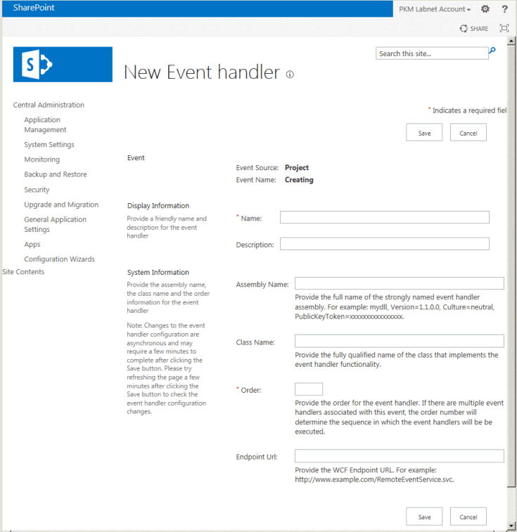

# <a name="updates-for-developers-in-project"></a><span data-ttu-id="03008-103">Atualizações para desenvolvedores no Project</span><span class="sxs-lookup"><span data-stu-id="03008-103">Updates for developers in Project</span></span>

<span data-ttu-id="03008-104">Recursos de extensibilidade do Project Server 2013 funcionam com suplementos para o Project Online e com instalações de local.</span><span class="sxs-lookup"><span data-stu-id="03008-104">Extensibility features in Project Server 2013 work with add-ins for Project Online and with on-premises installations.</span></span> <span data-ttu-id="03008-105">Novos recursos incluem um modelo de objeto do cliente (CSOM), interfaces do REST, um serviço OData para relatórios, receptores de evento remoto, fluxos de trabalho declarativos e suplementos de painel de tarefas para clientes do Project.</span><span class="sxs-lookup"><span data-stu-id="03008-105">New features include a client-side object model (CSOM), REST interfaces, an OData service for reporting, remote event receivers, declarative workflows, and task pane add-ins for Project clients.</span></span> <span data-ttu-id="03008-106">Saiba também recursos preteridos e não devem ser usados para o desenvolvimento de novos.</span><span class="sxs-lookup"><span data-stu-id="03008-106">Also learn about deprecated features that should not be used for new development.</span></span>
  
<span data-ttu-id="03008-107">Project Server 2013 amplia a estrutura introduzido com o Microsoft Office Project Server 2007 e estendida pelo Project Server 2010.</span><span class="sxs-lookup"><span data-stu-id="03008-107">Project Server 2013 builds on the framework introduced with Microsoft Office Project Server 2007 and extended by Project Server 2010.</span></span> <span data-ttu-id="03008-108">Project Server 2013 adiciona um modelo de objeto do cliente (CSOM) que é refatorado simplificado do Project Server Interface (PSI) e inclui uma biblioteca de JavaScript e .NET Framework 4 bibliotecas para aplicativos do Windows, Windows Phone 8 e Microsoft Silverlight.</span><span class="sxs-lookup"><span data-stu-id="03008-108">Project Server 2013 adds a client-side object model (CSOM) that is refactored and simplified from the Project Server Interface (PSI), and includes a JavaScript library and .NET Framework 4 libraries for Windows apps, Windows Phone 8, and Microsoft Silverlight.</span></span> <span data-ttu-id="03008-109">O CSOM foi projetado para desenvolvimento do Project Online e também opera com uma instalação do Project Server no local.</span><span class="sxs-lookup"><span data-stu-id="03008-109">The CSOM is designed for development for Project Online, and also works with an on-premises Project Server installation.</span></span> 

<span data-ttu-id="03008-110">Os bancos de dados do Project Server são combinados em um único banco de dados; Você pode acessar as exibições e tabelas de relatórios online por meio de um serviço OData.</span><span class="sxs-lookup"><span data-stu-id="03008-110">The Project Server databases are combined into a single database; you can access the online reporting tables and views through an OData service.</span></span> <span data-ttu-id="03008-111">O CSOM e o serviço OData incluem uma interface de transferência de estado representacional (REST).</span><span class="sxs-lookup"><span data-stu-id="03008-111">The CSOM and the OData service include a Representational State Transfer (REST) interface.</span></span> <span data-ttu-id="03008-112">Fluxos de trabalho do Project Server podem ser criados usando o SharePoint Designer 2013.</span><span class="sxs-lookup"><span data-stu-id="03008-112">Project Server workflows can be created by using SharePoint Designer 2013.</span></span> <span data-ttu-id="03008-113">Project Professional 2013 pode integrar com o relatório de dados, listas de tarefas do SharePoint e outro conteúdo externo usando o modelo de extensibilidade de suplementos do Office para painéis de tarefas do Project Server.</span><span class="sxs-lookup"><span data-stu-id="03008-113">Project Professional 2013 can integrate with Project Server reporting data, SharePoint task lists, and other external content by using the Office Add-ins extensibility model for task panes.</span></span> <span data-ttu-id="03008-114">Project Standard 2013 pode usar suplementos de painel de tarefas para integrar com conteúdo externo geral.</span><span class="sxs-lookup"><span data-stu-id="03008-114">Project Standard 2013 can use task pane add-ins to integrate with general external content.</span></span>
  
<span data-ttu-id="03008-115">Para obter mais informações sobre as principais alterações no Project Server 2013 e diagramas, consulte [arquitetura do Project Server 2013](project-server-2013-architecture.md).</span><span class="sxs-lookup"><span data-stu-id="03008-115">For diagrams and more information about major changes in Project Server 2013, see [Project Server 2013 architecture](project-server-2013-architecture.md).</span></span>
  
> [!NOTE]
> <span data-ttu-id="03008-116">Project Server 2013 é criado na plataforma do SharePoint Server 2013 e Project 2013 inclui muito da infraestrutura de mesmo como os outros aplicativos do Office 2013.</span><span class="sxs-lookup"><span data-stu-id="03008-116">Project Server 2013 is built on the SharePoint Server 2013 platform, and Project 2013 includes much of the same infrastructure as the other Office 2013 applications.</span></span> <span data-ttu-id="03008-117">Para obter a documentação do modelo para o SharePoint Add-ins, fluxos de trabalho baseados no SharePoint, Web Parts, desenvolvimento com outros recursos do SharePoint e documentação de suplementos do Office, consulte o [Office e SharePoint Add-ins](http://msdn.microsoft.com/library/fp161507%28office.15%29.aspx) e [desenvolvimento do SharePoint 2013 Visão geral do](http://msdn.microsoft.com/library/jj164084%28office.15%29.aspx).</span><span class="sxs-lookup"><span data-stu-id="03008-117">For documentation of the model for SharePoint Add-ins, SharePoint-based workflows, Web Parts, development with other SharePoint features, and documentation of Office Add-ins, see [Office and SharePoint Add-ins](http://msdn.microsoft.com/library/fp161507%28office.15%29.aspx) and [SharePoint 2013 development overview](http://msdn.microsoft.com/library/jj164084%28office.15%29.aspx).</span></span> 
  
## <a name="major-new-features-in-project-2013"></a><span data-ttu-id="03008-118">Principais novos recursos no Project 2013</span><span class="sxs-lookup"><span data-stu-id="03008-118">Major new features in Project 2013</span></span>
<span data-ttu-id="03008-119"><a name="pj15_WhatsNew_MajorNewFeatures"> </a></span><span class="sxs-lookup"><span data-stu-id="03008-119"></span></span>

<span data-ttu-id="03008-120">Novos recursos no Project Standard 2013 e Project Professional 2013 incluem uma interface de usuário aprimorada que corresponde a outros aplicativos do Office 2013 e oferece suporte à interface de usuário de estilo moderno no Windows 8, integração com objetos de arte do Office para relatórios de progresso relatórios e novos recursos de programação para relatórios.</span><span class="sxs-lookup"><span data-stu-id="03008-120">New features in Project Standard 2013 and Project Professional 2013 include an improved user interface that matches other Office 2013 applications and supports the modern style user interface in Windows 8, integration with Office Art objects for reports, burndown reports, and new programmability features for reports.</span></span> <span data-ttu-id="03008-121">Habilita o Project Professional 2013 mais abrangentes compartilhando e sincronizando projetos no SharePoint Server 2013, juntamente com os tarefa painel complementos que também são implementados em outros aplicativos do Office 2013, como Word, Excel e Outlook.</span><span class="sxs-lookup"><span data-stu-id="03008-121">Project Professional 2013 enables more extensive sharing and synchronizing projects on SharePoint Server 2013, along with the task pane add-ins that are also implemented in other Office 2013 applications such as Word, Excel, and Outlook.</span></span>
  
<span data-ttu-id="03008-122">Há vários novos recursos no Project Server 2013.</span><span class="sxs-lookup"><span data-stu-id="03008-122">There are many new features in Project Server 2013.</span></span> <span data-ttu-id="03008-123">Alguns não possuem uma história principais recursos de programação, como a nova linha do tempo no Project Web App.</span><span class="sxs-lookup"><span data-stu-id="03008-123">Some do not have a major programmability story, such as the new timeline in Project Web App.</span></span> <span data-ttu-id="03008-124">Esses recursos serão documentados na documentação de Ajuda e do usuário final do produto no Microsoft Office Online e nos tópicos destinados a administradores e profissionais de TI no Microsoft TechNet.</span><span class="sxs-lookup"><span data-stu-id="03008-124">Those features will be documented in the product help and end-user documentation on Microsoft Office Online and in topics targeted at administrators and IT professionals on Microsoft TechNet.</span></span> <span data-ttu-id="03008-125">Outros novos recursos, como quadros de horários aprimorados, tornam mais fácil para desenvolvedores de terceiros interagir com os quadros de horários e status através do Project Server Interface (PSI).</span><span class="sxs-lookup"><span data-stu-id="03008-125">Other new features, such as improved timesheets, make it easier for third-party developers to interact with timesheets and statusing through the Project Server Interface (PSI).</span></span>
  
<span data-ttu-id="03008-126">A adição do Project Online e Office Store (http://office.microsoft.com/store) para suplementos de projeto são alterações grandes, onde o Project Server é acessível através do Microsoft Azure.</span><span class="sxs-lookup"><span data-stu-id="03008-126">The addition of Project Online and the Office Store (http://office.microsoft.com/store) for Project add-ins are far-reaching changes, where Project Server is accessible through Microsoft Azure.</span></span> <span data-ttu-id="03008-127">Acesso baseado em nuvem ao Project Server usa um modelo de objeto do cliente (CSOM) para o desenvolvimento de suplementos com o Microsoft .NET Framework, Microsoft Silverlight, Windows Phone e aplicativos web que usam o JavaScript.</span><span class="sxs-lookup"><span data-stu-id="03008-127">Cloud-based access to Project Server uses a client-side object model (CSOM) for development of add-ins with the Microsoft .NET Framework, Microsoft Silverlight, Windows Phone, and web apps that use JavaScript.</span></span> <span data-ttu-id="03008-128">Um requisito do Project Online é que os quatro bancos de dados do Project Server de versões anteriores são mesclados em um banco de dados.</span><span class="sxs-lookup"><span data-stu-id="03008-128">A requirement of Project Online is that the four Project Server databases of previous versions are merged into one database.</span></span>
  
<span data-ttu-id="03008-129">Escalabilidade e desempenho do project Server 2013 é melhorado em muitas áreas como gerenciamento de projetos, quadros de horários e status da tarefa.</span><span class="sxs-lookup"><span data-stu-id="03008-129">Project Server 2013 performance and scalability is improved in many areas such as task status, timesheets, and project management.</span></span> <span data-ttu-id="03008-130">Fluxos de trabalho do Project Server são reprojetados com a versão 4 do Windows Workflow Foundation (WF4).</span><span class="sxs-lookup"><span data-stu-id="03008-130">Project Server workflows are redesigned with version 4 of Windows Workflow Foundation (WF4).</span></span> <span data-ttu-id="03008-131">O uso do .NET Framework 4 e Windows Communication Foundation (WCF) com a PSI melhora a segurança, desempenho e escalabilidade.</span><span class="sxs-lookup"><span data-stu-id="03008-131">Use of the .NET Framework 4 and Windows Communication Foundation (WCF) with the PSI improves security, performance, and scalability.</span></span> <span data-ttu-id="03008-132">Por exemplo, você pode alterar o protocolo de transporte de aplicativos baseados em WCF usando arquivos de configuração, sem alterar o código do aplicativo ou recompilação.</span><span class="sxs-lookup"><span data-stu-id="03008-132">For example, you can change the transport protocol of WCF-based applications by using configuration files, without changing the application code or recompiling.</span></span> <span data-ttu-id="03008-133">Muitas das chamadas PSI onde dados não alteram significativamente caches de Project Web App.</span><span class="sxs-lookup"><span data-stu-id="03008-133">Project Web App caches many of the PSI calls where data does not change significantly.</span></span>
  
> [!NOTE]
> <span data-ttu-id="03008-134">Para o desenvolvimento com o Project Server 2013, você pode usar o Visual Studio com as extensões de ferramentas Office e SharePoint, que nativamente podem criar suplementos para os produtos do Office 2013.</span><span class="sxs-lookup"><span data-stu-id="03008-134">For development with Project Server 2013, you can use Visual Studio with the Office and SharePoint tools extensions, which can natively create add-ins for the Office 2013 products.</span></span> <span data-ttu-id="03008-135">Project Server 2013 requer o Visual Studio para totalmente permitem o desenvolvimento de recursos, como páginas de detalhes do projeto e aplicativos baseados no WCF.</span><span class="sxs-lookup"><span data-stu-id="03008-135">Project Server 2013 requires Visual Studio to fully enable development of features such as project detail pages and WCF-based applications.</span></span> <span data-ttu-id="03008-136">As extensões de ferramentas do SharePoint no Visual Studio podem implantar Web Parts e outros recursos do SharePoint diretamente para o Project Web App e outros sites do SharePoint.</span><span class="sxs-lookup"><span data-stu-id="03008-136">The SharePoint tools extensions in Visual Studio can deploy Web Parts and other SharePoint features directly to Project Web App and other SharePoint sites.</span></span> 
>
> <span data-ttu-id="03008-137">Visual Studio não for mais necessária para desenvolver fluxos de trabalho do Project Server que usam os campos personalizados, estágios, fases e tipos de projeto corporativo que podem ser gerenciados no Project Web App.</span><span class="sxs-lookup"><span data-stu-id="03008-137">Visual Studio is no longer required to develop Project Server workflows that use custom fields, stages, phases, and enterprise project types that can be managed in Project Web App.</span></span> <span data-ttu-id="03008-138">Embora você possa usar o Visual Studio para desenvolver fluxos de trabalho, eles são geralmente mais fácil e rápido criar usando o SharePoint Designer.</span><span class="sxs-lookup"><span data-stu-id="03008-138">Although you can use Visual Studio to develop workflows, they are often easier and quicker to create by using SharePoint Designer.</span></span> <span data-ttu-id="03008-139">Visual Studio pode ser usado para fluxos de trabalho que precisam acessar o CSOM ou outros APIs externas.</span><span class="sxs-lookup"><span data-stu-id="03008-139">Visual Studio can be used for workflows that require access to the CSOM or other external APIs.</span></span> 
  
### <a name="project-add-ins"></a><span data-ttu-id="03008-140">Suplementos do projeto</span><span class="sxs-lookup"><span data-stu-id="03008-140">Project add-ins</span></span>
<span data-ttu-id="03008-141"><a name="pj15_WhatsNew_Apps"> </a></span><span class="sxs-lookup"><span data-stu-id="03008-141"></span></span>

<span data-ttu-id="03008-142">Distribuição e marketing do software foi revolucionou com o conceito de um suplemento.</span><span class="sxs-lookup"><span data-stu-id="03008-142">Distribution and marketing of software has been revolutionized with the concept of an add-in.</span></span> <span data-ttu-id="03008-143">Para o Project 2013, suplementos podem ser disponibilizados para compra e o download da Office Store pública ou distribuídos dentro de um catálogo particular no SharePoint.</span><span class="sxs-lookup"><span data-stu-id="03008-143">For Project 2013, add-ins can be made available for purchase and download from the public Office Store or distributed within a private catalog on SharePoint.</span></span> <span data-ttu-id="03008-144">Um suplemento é normalmente um programa interativo, independente, que executa um pequeno número de tarefas relacionadas.</span><span class="sxs-lookup"><span data-stu-id="03008-144">An add-in is typically a self-contained, interactive program that performs a small number of related tasks.</span></span> <span data-ttu-id="03008-145">Um suplemento do Project pode ser um add-in de painel de tarefas para o Project Standard 2013 ou Project Standard 2013 clientes ou um suplemento para o Project Server 2013 ou Project Online.</span><span class="sxs-lookup"><span data-stu-id="03008-145">A Project add-in can be a task pane add-in for the Project Standard 2013 or Project Standard 2013 clients, or an add-in for Project Server 2013 or Project Online.</span></span>
  
<span data-ttu-id="03008-146">Para obter informações sobre suplementos para os clientes de área de trabalho do projeto, consulte [tarefa painel complementos no projeto](#pj15_WhatsNew_Agave).</span><span class="sxs-lookup"><span data-stu-id="03008-146">For information about add-ins for the Project desktop clients, see [Task pane add-ins in Project](#pj15_WhatsNew_Agave).</span></span> <span data-ttu-id="03008-147">Para obter um exemplo do Project Server 2013, consulte o [suplemento do Project Server de criar um hospedado no SharePoint](create-a-sharepoint-hosted-project-server-add-in.md).</span><span class="sxs-lookup"><span data-stu-id="03008-147">For a Project Server 2013 example, see [Create a SharePoint-hosted Project Server add-in](create-a-sharepoint-hosted-project-server-add-in.md).</span></span> <span data-ttu-id="03008-148">Além dos artigos no [Office e SharePoint suplementos SDK](http://msdn.microsoft.com/library/fp161507.aspx), o [Blog do Office](https://blogs.office.com/dev/) tem muitas postagens que também são relevantes para o Project 2013 e Project Online.</span><span class="sxs-lookup"><span data-stu-id="03008-148">In addition to articles in the [Office and SharePoint Add-ins SDK](http://msdn.microsoft.com/library/fp161507.aspx), the [Office Blog](https://blogs.office.com/dev/) has many posts that are also relevant to Project 2013 and Project Online.</span></span> 
  
<span data-ttu-id="03008-149">Um suplemento do Project Server 2013 pode trabalhar com uma instalação local e Project Online.</span><span class="sxs-lookup"><span data-stu-id="03008-149">An add-in for Project Server 2013 can work with both an on-premises installation and Project Online.</span></span> <span data-ttu-id="03008-150">Suplementos de servidor de projeto podem incluir Web Parts, receptores de evento remoto e a lógica de negócios.</span><span class="sxs-lookup"><span data-stu-id="03008-150">Project Server add-ins can include Web Parts, remote event receivers, and business logic.</span></span> <span data-ttu-id="03008-151">Acesso ao modelo de objeto do Project Server em um suplemento é por meio de CSOM, não a PSI.</span><span class="sxs-lookup"><span data-stu-id="03008-151">Access to the Project Server object model in an add-in is through the CSOM, not the PSI.</span></span> <span data-ttu-id="03008-152">Armazenamento de dados pode ser baseado em nuvem, como com o SQL Azure, externos, como a Microsoft Business Connectivity Services (BCS), interno com um banco de dados local, ou mista.</span><span class="sxs-lookup"><span data-stu-id="03008-152">Data storage can be cloud-based such as with SQL Azure, external such as through Microsoft Business Connectivity Services (BCS), internal with a local database, or mixed.</span></span>
  
#### <a name="add-in-security"></a><span data-ttu-id="03008-153">Segurança de suplementos</span><span class="sxs-lookup"><span data-stu-id="03008-153">Add-in security</span></span>

<span data-ttu-id="03008-154">Em geral, as ações que um suplemento leva são realizadas em nome do usuário que executa o suplemento; Você não explicitamente utilizam a representação ou especificar quem pode executar o suplemento.</span><span class="sxs-lookup"><span data-stu-id="03008-154">In general, actions that an add-in takes are performed on behalf of the user who runs the add-in; you do not explicitly use impersonation or specify who can run the add-in.</span></span> <span data-ttu-id="03008-155">Ações não podem exceder o nível de permissão do usuário que executa o suplemento.</span><span class="sxs-lookup"><span data-stu-id="03008-155">Actions cannot exceed the permission level of the user who runs the add-in.</span></span> 
  
<span data-ttu-id="03008-156">No Office Developer Tools para Visual Studio 2012, o arquivo AppManifext.xml tem um editor de gráfico, onde você pode definir o escopo de solicitação de permissão.</span><span class="sxs-lookup"><span data-stu-id="03008-156">In Office Developer Tools for Visual Studio 2012, the AppManifext.xml file has a graphical editor where you can set the permission request scope.</span></span> <span data-ttu-id="03008-157">Por exemplo, para criar um suplemento que permite que os gerentes de projeto atualizar seus projetos, na guia **permissões** do painel designer **AppManifest.xml** , selecione **Vários projetos** para o escopo e a **gravação** para que a permissão.</span><span class="sxs-lookup"><span data-stu-id="03008-157">For example, to create an add-in that enables project managers to update their projects, on the **Permissions** tab of the **AppManifest.xml** designer pane, select **Multiple Projects** for the scope and **Write** for the permission.</span></span> <span data-ttu-id="03008-158">Se o usuário suplemento tem permissões de gerente de projeto, ela pode executar o add-in para projetos que gerencia a ela.</span><span class="sxs-lookup"><span data-stu-id="03008-158">If the add-in user has project manager permissions, she can run the add-in for projects that she manages.</span></span> <span data-ttu-id="03008-159">O código no arquivo AppManifest.xml seria incluem o seguinte:</span><span class="sxs-lookup"><span data-stu-id="03008-159">The code in the AppManifest.xml file would include the following:</span></span> 
  
```XML
  <AppPermissionRequests>
    <AppPermissionRequest Scope="http://sharepoint/projectserver/projects" Right="Write" />
  </AppPermissionRequests>
```

<span data-ttu-id="03008-160">**Tabela 1. Escopos de solicitação de permissão para suplementos do Project Server**</span><span class="sxs-lookup"><span data-stu-id="03008-160">**Table 1. Permission request scopes for Project Server add-ins**</span></span>

|<span data-ttu-id="03008-161">Escopo</span><span class="sxs-lookup"><span data-stu-id="03008-161">Scope</span></span>|<span data-ttu-id="03008-162">Permissions</span><span class="sxs-lookup"><span data-stu-id="03008-162">Permissions</span></span>|
|:-----|:-----|
|<span data-ttu-id="03008-163">**Project Server**</span><span class="sxs-lookup"><span data-stu-id="03008-163">**Project Server**</span></span> <br/> |<span data-ttu-id="03008-164">**Gerenciar** (Exige permissões de administrador do Project Server).</span><span class="sxs-lookup"><span data-stu-id="03008-164">**Manage** (Requires Project Server administrator permissions.)</span></span>  <br/> |
|<span data-ttu-id="03008-165">**Vários projetos**</span><span class="sxs-lookup"><span data-stu-id="03008-165">**Multiple Projects**</span></span> <br/> |<span data-ttu-id="03008-166">**Leitura**, **gravação** (exige permissões de gerente de projeto para algumas operações; permissões de membro da equipe de projeto para basic leia operações, como atribuições de tarefa.)</span><span class="sxs-lookup"><span data-stu-id="03008-166">**Read**, **Write** (Requires project manager permissions for some operations; project team member permissions for basic read operations, such as task assignments.)</span></span>  <br/> |
|<span data-ttu-id="03008-167">**Único projeto**</span><span class="sxs-lookup"><span data-stu-id="03008-167">**Single Project**</span></span> <br/> |<span data-ttu-id="03008-168">**Leitura**, **gravação** (requer ao menos permissões de membro da equipe de projeto; o acesso a alguns dados em um projeto depende de outros níveis de permissão.)</span><span class="sxs-lookup"><span data-stu-id="03008-168">**Read**, **Write** (Requires at least project team member permissions; access to some data in a project depends on other permission levels.)</span></span>  <br/> |
|<span data-ttu-id="03008-169">**Recursos da empresa**</span><span class="sxs-lookup"><span data-stu-id="03008-169">**Enterprise Resources**</span></span> <br/> |<span data-ttu-id="03008-170">**Leitura**, **gravação** (requer permissões de gerente de recursos).</span><span class="sxs-lookup"><span data-stu-id="03008-170">**Read**, **Write** (Requires resource manager permissions.)</span></span>  <br/> |
|<span data-ttu-id="03008-171">**Status**</span><span class="sxs-lookup"><span data-stu-id="03008-171">**Statusing**</span></span> <br/> |<span data-ttu-id="03008-172">**SubmitStatus** (Requer a permissão para enviar o status dos seus projetos.)</span><span class="sxs-lookup"><span data-stu-id="03008-172">**SubmitStatus** (Requires permission to submit status for your projects.)</span></span>  <br/> |
|<span data-ttu-id="03008-173">**Emissão de relatórios**</span><span class="sxs-lookup"><span data-stu-id="03008-173">**Reporting**</span></span> <br/> |<span data-ttu-id="03008-174">**Leitura** (Requer a permissão para fazer logon no Project Server).</span><span class="sxs-lookup"><span data-stu-id="03008-174">**Read** (Requires permission to log on Project Server.)</span></span>  <br/> |
|<span data-ttu-id="03008-175">**Fluxo de trabalho**</span><span class="sxs-lookup"><span data-stu-id="03008-175">**Workflow**</span></span> <br/> |<span data-ttu-id="03008-176">**Elevar** (Requer a permissão para executar fluxos de trabalho.</span><span class="sxs-lookup"><span data-stu-id="03008-176">**Elevate** (Requires permission to run workflows.</span></span> <span data-ttu-id="03008-177">O suplemento é executado com permissões elevadas, para habilitar o estágio a outro transições em um fluxo de trabalho.</span><span class="sxs-lookup"><span data-stu-id="03008-177">The add-in runs with elevated permissions, to enable transitions from stage to stage in a workflow.</span></span> <span data-ttu-id="03008-178">A lógica de negócios do add-in controla transições estágio).</span><span class="sxs-lookup"><span data-stu-id="03008-178">Business logic in the add-in controls stage transitions.)</span></span>  <br/> |
   
> [!NOTE]
> <span data-ttu-id="03008-179">Project Server 2013 e Project Online não use o modelo de autenticação do aplicativo somente no SharePoint 2013 (consulte o [suplemento de tipos de diretiva de autorização no SharePoint 2013](http://msdn.microsoft.com/library/124879c7-a746-4c10-96a7-da76ad5327f0%28Office.15%29.aspx)).</span><span class="sxs-lookup"><span data-stu-id="03008-179">Project Server 2013 and Project Online do not use the app-only authentication model in SharePoint 2013 (see [Add-in authorization policy types in SharePoint 2013](http://msdn.microsoft.com/library/124879c7-a746-4c10-96a7-da76ad5327f0%28Office.15%29.aspx)).</span></span> 
  
<span data-ttu-id="03008-180">Para obter informações sobre como desenvolver, distribuir, hospedar e gerenciar suplementos, consulte Tópicos relacionados na documentação de desenvolvedor do SharePoint Server 2013 e Office 2013 e [suplementos do Office](http://msdn.microsoft.com/library/1e123201-6e70-45c1-a48c-d5b955896ddb%28Office.15%29.aspx)e [SharePoint suplementos](http://msdn.microsoft.com/library/cd1eda9e-8e54-4223-93a9-a6ea0d18df70%28Office.15%29.aspx) .</span><span class="sxs-lookup"><span data-stu-id="03008-180">For information about developing, distributing, hosting, and managing add-ins, see [SharePoint Add-ins](http://msdn.microsoft.com/library/cd1eda9e-8e54-4223-93a9-a6ea0d18df70%28Office.15%29.aspx) and [Office Add-ins](http://msdn.microsoft.com/library/1e123201-6e70-45c1-a48c-d5b955896ddb%28Office.15%29.aspx), and related topics in the SharePoint Server 2013 and Office 2013 developer documentation.</span></span> <span data-ttu-id="03008-181">Para obter informações sobre o escopo de solicitação de permissão para outros suplementos do SharePoint, consulte [Add-in permissões no SharePoint 2013](http://msdn.microsoft.com/library/5f7a8440-3c09-4cf8-83ec-c236bfa2d6c4%28Office.15%29.aspx).</span><span class="sxs-lookup"><span data-stu-id="03008-181">For information about permission request scope for other SharePoint add-ins, see [Add-in permissions in SharePoint 2013](http://msdn.microsoft.com/library/5f7a8440-3c09-4cf8-83ec-c236bfa2d6c4%28Office.15%29.aspx).</span></span>
  
### <a name="integrating-with-sharepoint-server"></a><span data-ttu-id="03008-182">Integrando com o SharePoint Server</span><span class="sxs-lookup"><span data-stu-id="03008-182">Integrating with SharePoint Server</span></span>
<span data-ttu-id="03008-183"><a name="pj15_WhatsNew_IntegrationWSS"> </a></span><span class="sxs-lookup"><span data-stu-id="03008-183"></span></span>

<span data-ttu-id="03008-184">Muitos recursos no Project Web App exigem a infraestrutura de nova no SharePoint Server 2013 como OAuth e a autenticação baseada em declarações, autorização do Project Server e permissões por meio de grupos do SharePoint, sincronização de projetos com tarefas do SharePoint listas e fluxos de trabalho declarativos do Project Server.</span><span class="sxs-lookup"><span data-stu-id="03008-184">Many features in Project Web App require the new infrastructure in SharePoint Server 2013 such as OAuth and claims-based authentication, Project Server authorization and permissions through SharePoint groups, synchronization of projects with SharePoint task lists, and Project Server declarative workflows.</span></span> <span data-ttu-id="03008-185">O aplicativo de serviço Project pode ser associado a qualquer conjunto de sites em um farm do SharePoint.</span><span class="sxs-lookup"><span data-stu-id="03008-185">The Project Service Application can be associated with any site collection in a SharePoint farm.</span></span> <span data-ttu-id="03008-186">Sincronização de projeto pode ser com uma lista de tarefas do SharePoint, onde o SharePoint mantém o projeto.</span><span class="sxs-lookup"><span data-stu-id="03008-186">Project synchronization can be with a SharePoint task list, where SharePoint maintains the project.</span></span> <span data-ttu-id="03008-187">Um projeto da empresa também pode ser sincronizado com uma lista de tarefas do SharePoint, onde o Project Server mantém controle total.</span><span class="sxs-lookup"><span data-stu-id="03008-187">An enterprise project can also be synchronized with a SharePoint task list, where Project Server maintains full control.</span></span> <span data-ttu-id="03008-188">Para obter uma explicação da sincronização do projeto e diagramas de arquitetura, consulte [arquitetura do Project Server 2013](project-server-2013-architecture.md).</span><span class="sxs-lookup"><span data-stu-id="03008-188">For architectural diagrams and an explanation of project synchronization, see [Project Server 2013 architecture](project-server-2013-architecture.md).</span></span>
  
<span data-ttu-id="03008-189">Há vários novos recursos no SharePoint Server 2013.</span><span class="sxs-lookup"><span data-stu-id="03008-189">There are many new features in SharePoint Server 2013.</span></span> <span data-ttu-id="03008-190">Para obter mais informações, consulte [SharePoint para desenvolvedores](http://msdn.microsoft.com/en-US/sharepoint).</span><span class="sxs-lookup"><span data-stu-id="03008-190">For more information, see [SharePoint for developers](http://msdn.microsoft.com/en-US/sharepoint).</span></span>
  
### <a name="integrating-with-workflows"></a><span data-ttu-id="03008-191">Integrando com fluxos de trabalho</span><span class="sxs-lookup"><span data-stu-id="03008-191">Integrating with workflows</span></span>
<span data-ttu-id="03008-192"><a name="pj15_WhatsNew_Workflow"> </a></span><span class="sxs-lookup"><span data-stu-id="03008-192"></span></span>

<span data-ttu-id="03008-193">Fluxos de trabalho são dos principais recursos de gerenciamento de portfólio de projetos.</span><span class="sxs-lookup"><span data-stu-id="03008-193">Workflows are a core feature of project portfolio management.</span></span> <span data-ttu-id="03008-194">Um ciclo de vida de projeto pode incluir os processos de execução longa que abrangem várias fases.</span><span class="sxs-lookup"><span data-stu-id="03008-194">A project life cycle can include long-running processes that span many phases.</span></span> <span data-ttu-id="03008-195">Fases de governança incluem propostas de projeto, análise do impacto nos negócios e selecionando, criando, planejamento, gerenciamento e acompanhamento de projetos.</span><span class="sxs-lookup"><span data-stu-id="03008-195">Governance phases include project proposals, analyses of business impact, and selecting, creating, planning, managing, and tracking projects.</span></span>
  
<span data-ttu-id="03008-196">Fluxos de trabalho do Project Server 2013 são compilados em plataforma de fluxo de trabalho do SharePoint 2013, que utilizará WF4.</span><span class="sxs-lookup"><span data-stu-id="03008-196">Project Server 2013 workflows are built on the SharePoint 2013 workflow platform, which uses WF4.</span></span> <span data-ttu-id="03008-197">Ao contrário nas versões anteriores, fluxos de trabalho declarativos do Project Server 2013 podem ser criados usando o SharePoint Designer 2013 em estão acessíveis para o local e o uso online.</span><span class="sxs-lookup"><span data-stu-id="03008-197">Unlike in previous versions, declarative workflows for Project Server 2013 can be created by using SharePoint Designer 2013 and are accessible for both on-premises and online use.</span></span> <span data-ttu-id="03008-198">Usam o modelo de segurança do fluxo de trabalho do SharePoint com OAuth fluxos de trabalho do Project Server e podem ser instalados em um site do Project Web App.</span><span class="sxs-lookup"><span data-stu-id="03008-198">Project Server workflows use the SharePoint workflow security model with OAuth, and can be installed on a Project Web App site.</span></span> <span data-ttu-id="03008-199">A Figura 1 mostra que o SharePoint Designer 2013 pode adicionar estágios para um fluxo de trabalho de site para o gerenciamento de demanda, onde os estágios são definidos no Project Web App.</span><span class="sxs-lookup"><span data-stu-id="03008-199">Figure 1 shows that SharePoint Designer 2013 can add stages to a site workflow for Demand Management, where the stages are defined in Project Web App.</span></span>
  
<span data-ttu-id="03008-200">**Figura 1. Usando o SharePoint Designer para adicionar um estágio a um fluxo de trabalho do Project Web App**</span><span class="sxs-lookup"><span data-stu-id="03008-200">**Figure 1. Using SharePoint Designer to add a stage to a workflow for Project Web App**</span></span>

<span data-ttu-id="03008-201">![Adicionando um estágio para um fluxo de trabalho no SPD] (media/pj15_CreateWorkflowSPD_AddStageInSPD.gif "Adicionando um estágio para um fluxo de trabalho no SPD")</span><span class="sxs-lookup"><span data-stu-id="03008-201"></span></span>

<br/>

<span data-ttu-id="03008-202">Você pode criar um fluxo de trabalho declarativo por meio da adição de outros elementos, ações, condições e estágios do fluxo de trabalho em uma ferramenta de design, que pode ser o SharePoint Designer 2013 ou o Visual Studio 2012.</span><span class="sxs-lookup"><span data-stu-id="03008-202">You build a declarative workflow by adding workflow stages, actions, conditions, and other elements in a design tool, which can be either SharePoint Designer 2013 or Visual Studio 2012.</span></span> <span data-ttu-id="03008-203">A ferramenta de design, em seguida, salva o fluxo de trabalho como código XAML, que será interpretado em tempo de execução.</span><span class="sxs-lookup"><span data-stu-id="03008-203">The design tool then saves the workflow as XAML code, which is interpreted at runtime.</span></span> <span data-ttu-id="03008-204">Fluxos de trabalho declarativos podem executar no Project Server 2013 no local ou no Project Online.</span><span class="sxs-lookup"><span data-stu-id="03008-204">Declarative workflows can run either in Project Server 2013 on-premises or in Project Online.</span></span> <span data-ttu-id="03008-205">Usando o Visual Studio 2012, você também pode criar ações personalizadas e formulários para o controle adicional e salvar modelos de fluxo de trabalho para reutilização com várias instâncias do Project Web App.</span><span class="sxs-lookup"><span data-stu-id="03008-205">By using Visual Studio 2012, you can also build custom actions and forms for additional control, and save workflow templates for reuse with multiple Project Web App instances.</span></span> <span data-ttu-id="03008-206">SharePoint Designer 2013 podem consumir ações personalizadas que são criadas no Visual Studio 2012.</span><span class="sxs-lookup"><span data-stu-id="03008-206">SharePoint Designer 2013 can consume custom actions that are created in Visual Studio 2012.</span></span>
  
<span data-ttu-id="03008-207">Um fluxo de trabalho do Project Server 2013 atua como um aplicativo, onde um administrador — quem possui permissões de design para o Project Web App — pode publicar um fluxo de trabalho declarativo e associá-lo a um tipo de projeto corporativo (EPT).</span><span class="sxs-lookup"><span data-stu-id="03008-207">A Project Server 2013 workflow acts as an app, where an administrator—who has design permissions for Project Web App—can publish a declarative workflow and associate it with an enterprise project type (EPT).</span></span> <span data-ttu-id="03008-208">O EPT deve ser para um projeto da empresa, onde o Project Server mantém controle total.</span><span class="sxs-lookup"><span data-stu-id="03008-208">The EPT must be for an enterprise project, where Project Server maintains full control.</span></span> <span data-ttu-id="03008-209">Uma lista de tarefas do SharePoint não pode usar um fluxo de trabalho do Project Server.</span><span class="sxs-lookup"><span data-stu-id="03008-209">A SharePoint task list cannot use a Project Server workflow.</span></span> 
  
<span data-ttu-id="03008-210">OAuth permite que os gerentes de projeto que possuem permissões de criação de projeto para chamar o fluxo de trabalho sem usar representação.</span><span class="sxs-lookup"><span data-stu-id="03008-210">OAuth enables project managers who have project creation permissions to invoke the workflow without using impersonation.</span></span> <span data-ttu-id="03008-211">Chamadas de fluxo de trabalho no Project Server, por exemplo ler um valor de campo personalizado para decidir qual ramificação a serem seguidas, são feitas em nome do gerente de projeto.</span><span class="sxs-lookup"><span data-stu-id="03008-211">Workflow calls to Project Server, for example to read a custom field value to decide which branch to follow, are made on behalf of the project manager.</span></span> <span data-ttu-id="03008-212">Para impedir que o gerente de projeto criando um fluxo de trabalho que avança automaticamente para a próxima etapa, a chamada para mover para o próximo estágio de fluxo de trabalho é executado como o autor do fluxo de trabalho (o administrador).</span><span class="sxs-lookup"><span data-stu-id="03008-212">To prevent the project manager from creating a workflow that automatically advances to the next stage, the call for moving to the next workflow stage runs as the workflow author (the administrator).</span></span> <span data-ttu-id="03008-213">Por outro lado, os usuários de legado fluxos de trabalho do Project Server 2010 fazer chamadas de representada por meio da conta de usuário Proxy de fluxo de trabalho para ter acesso de administrador em todo o fluxo de trabalho inteiro.</span><span class="sxs-lookup"><span data-stu-id="03008-213">In contrast, users of legacy Project Server 2010 workflows make impersonated calls through the Workflow Proxy User account to gain administrator access throughout the entire workflow.</span></span>
  
<span data-ttu-id="03008-214">Embora possa usar o Project Server 2013 local compilados fluxos de trabalho baseados em WF3.5, é recomendável atualizar fluxos de trabalho herdados para fluxos de trabalho declarativos com base em WF4.</span><span class="sxs-lookup"><span data-stu-id="03008-214">Although Project Server 2013 on-premises can use compiled WF3.5-based workflows, we recommend that you upgrade legacy workflows to declarative workflows based on WF4.</span></span> <span data-ttu-id="03008-215">A tecnologia mais recente é mais escalonável e robusto.</span><span class="sxs-lookup"><span data-stu-id="03008-215">The newer technology is more scalable and robust.</span></span> <span data-ttu-id="03008-216">Analistas de negócios e equipe PMO pode criar ou atualizar designs do fluxo de trabalho usando o Visio 2013 e implementar fluxos de trabalho do Project Server sem codificação usando o SharePoint Designer 2013.</span><span class="sxs-lookup"><span data-stu-id="03008-216">Business analysts and PMO staff can create or update workflow designs by using Visio 2013 and implement Project Server workflows without coding by using SharePoint Designer 2013.</span></span>
  
<span data-ttu-id="03008-217">Para obter informações sobre como criar um fluxo de trabalho declarativo para o Project Web App, consulte [Introdução ao desenvolvimento de fluxos de trabalho do Project Server](getting-started-developing-project-server-workflows.md).</span><span class="sxs-lookup"><span data-stu-id="03008-217">For information about creating a declarative workflow for Project Web App, see [Getting started developing Project Server workflows](getting-started-developing-project-server-workflows.md).</span></span> <span data-ttu-id="03008-218">Para obter uma comparação do SharePoint Designer e recursos do Visual Studio para fluxos de trabalho, consulte [fluxos de trabalho de desenvolvimento do SharePoint 2013 usando o Visual Studio](http://msdn.microsoft.com/en-us/library/office/jj163199.aspx).</span><span class="sxs-lookup"><span data-stu-id="03008-218">For a comparison of SharePoint Designer and Visual Studio capabilities for workflows, see [Develop SharePoint 2013 workflows using Visual Studio](http://msdn.microsoft.com/en-us/library/office/jj163199.aspx).</span></span>
  
### <a name="client-side-object-model"></a><span data-ttu-id="03008-219">Modelo de objeto do cliente</span><span class="sxs-lookup"><span data-stu-id="03008-219">Client-side object model</span></span>
<span data-ttu-id="03008-220"><a name="pj15_WhatsNew_CSOM"> </a></span><span class="sxs-lookup"><span data-stu-id="03008-220"></span></span>

<span data-ttu-id="03008-221">Acesso programático ao Project Online requer um CSOM que se baseia em CSOM do SharePoint.</span><span class="sxs-lookup"><span data-stu-id="03008-221">Programmatic access to Project Online requires a CSOM that is built on the SharePoint CSOM.</span></span> <span data-ttu-id="03008-222">Autenticação do Project Online será com OAuth usando um Windows Live ID, não a autenticação de formulários do Project Server ou a autenticação do Windows.</span><span class="sxs-lookup"><span data-stu-id="03008-222">Project Online authentication will be with OAuth using a Windows Live ID, not Project Server Forms authentication or Windows authentication.</span></span>
  
<span data-ttu-id="03008-223">A seguir estão os princípios e os recursos do CSOM no Project Server 2013:</span><span class="sxs-lookup"><span data-stu-id="03008-223">Following are the principles and features of the CSOM in Project Server 2013:</span></span>
  
- <span data-ttu-id="03008-224">O CSOM se destina a facilidade de uso.</span><span class="sxs-lookup"><span data-stu-id="03008-224">The CSOM is designed for ease of use.</span></span> <span data-ttu-id="03008-225">Por exemplo, métodos e propriedades diretamente usam ou fornecem dados pelo nome, em vez de exigir que os GUIDs de muitas, _changeXml_ parâmetros ou passando em torno de conjuntos de dados.</span><span class="sxs-lookup"><span data-stu-id="03008-225">For example, methods and properties directly use or provide data by name, rather than requiring many GUIDs,  _changeXml_ parameters, or passing around datasets.</span></span> 
    
- <span data-ttu-id="03008-226">O Project Server CSOM implementa um subconjunto da funcionalidade PSI, com base nos requisitos mais comuns para soluções de terceiros.</span><span class="sxs-lookup"><span data-stu-id="03008-226">The Project Server CSOM implements a subset of the PSI functionality, based on the most common requirements for third-party solutions.</span></span>
    
- <span data-ttu-id="03008-227">O CSOM internamente chama a PSI, mas é acrescentado de forma diferente.</span><span class="sxs-lookup"><span data-stu-id="03008-227">The CSOM internally calls the PSI, but is factored differently.</span></span> <span data-ttu-id="03008-228">Por exemplo, as atualizações para todas as alterações de status são feitas por meio do método **StatusAssignmentCollection.SubmitAllStatusUpdates** , não pelo método PSI **Statusing.SubmitStatus** para o usuário ou o método **SubmitStatusForResource** para outros recursos.</span><span class="sxs-lookup"><span data-stu-id="03008-228">For example, updates for all statusing changes are done through the **StatusAssignmentCollection.SubmitAllStatusUpdates** method, not by the **Statusing.SubmitStatus** PSI method for the user or the **SubmitStatusForResource** method for other resources.</span></span> 
    
- <span data-ttu-id="03008-229">O CSOM pode ser acessada por meio de um serviço WCF (Client.svc), em vez de 22 serviços públicos de PSI.</span><span class="sxs-lookup"><span data-stu-id="03008-229">The CSOM is accessible through one WCF service (Client.svc), rather than through the 22 public services of the PSI.</span></span>
    
- <span data-ttu-id="03008-230">Inicialização do Project Server CSOM diretamente através da classe [ProjectContext](https://msdn.microsoft.com/library/Microsoft.ProjectServer.Client.ProjectContext.aspx) com a URL do Project Web App, não está usando um assembly de referência ou proxy WCF.</span><span class="sxs-lookup"><span data-stu-id="03008-230">Initialization of the Project Server CSOM is directly through the [ProjectContext](https://msdn.microsoft.com/library/Microsoft.ProjectServer.Client.ProjectContext.aspx) class with the Project Web App URL, not by using a WCF reference or proxy assembly.</span></span> 
    
- <span data-ttu-id="03008-231">O CSOM implementa várias bibliotecas de cliente e interfaces, que são compatíveis com a infraestrutura interna do SharePoint CSOM.</span><span class="sxs-lookup"><span data-stu-id="03008-231">The CSOM implements multiple client libraries and interfaces, which are supported by the internal SharePoint CSOM infrastructure.</span></span> <span data-ttu-id="03008-232">As bibliotecas de cliente e interfaces incluem o seguinte:</span><span class="sxs-lookup"><span data-stu-id="03008-232">The client libraries and interfaces include the following:</span></span>
    
  - <span data-ttu-id="03008-233">Biblioteca do cliente do Microsoft .NET no assembly Microsoft.ProjectServer.Client.dll</span><span class="sxs-lookup"><span data-stu-id="03008-233">Microsoft .NET client library in the Microsoft.ProjectServer.Client.dll assembly</span></span>
    
  - <span data-ttu-id="03008-234">Biblioteca do Silverlight no assembly Microsoft.ProjectServer.Client.Silverlight.dll</span><span class="sxs-lookup"><span data-stu-id="03008-234">Silverlight library in the Microsoft.ProjectServer.Client.Silverlight.dll assembly</span></span>
    
  - <span data-ttu-id="03008-235">Biblioteca do Windows Phone 8 no assembly Microsoft.ProjectServer.Client.Phone.dll</span><span class="sxs-lookup"><span data-stu-id="03008-235">Windows Phone 8 library in the Microsoft.ProjectServer.Client.Phone.dll assembly</span></span>
    
  - <span data-ttu-id="03008-236">Biblioteca de JavaScript para aplicativos web no arquivo PS.js ou PS.debug.js</span><span class="sxs-lookup"><span data-stu-id="03008-236">JavaScript library for web applications in the PS.js file or PS.debug.js file</span></span>
    
  - <span data-ttu-id="03008-237">Pontos de extremidade do REST para acesso com o protocolo OData</span><span class="sxs-lookup"><span data-stu-id="03008-237">REST endpoints, for access with the OData protocol</span></span>
    
  - <span data-ttu-id="03008-238">Suporte nativo para consultas LINQ com a filtragem, para limitar a quantidade de dados que são retornados</span><span class="sxs-lookup"><span data-stu-id="03008-238">Native support for LINQ queries with filtering, to limit the amount of data that is returned</span></span>
    
- <span data-ttu-id="03008-239">O CSOM pode ser usado tanto para soluções do Project Online para soluções locais, independentemente da PSI e outros assemblies do Project Server, como Microsoft.Office.Project.Server.Library.dll.</span><span class="sxs-lookup"><span data-stu-id="03008-239">The CSOM can be used both for Project Online solutions and for on-premises solutions, independently of the PSI and other Project Server assemblies such as Microsoft.Office.Project.Server.Library.dll.</span></span>
    
- <span data-ttu-id="03008-240">Funcionalidade adicional para o Project Server 2013 CSOM poderá ser considerada para atualizações cumulativas e service packs, com base em solicitações por parceiros do Project Server e da comunidade do desenvolvedor.</span><span class="sxs-lookup"><span data-stu-id="03008-240">Additional functionality of the Project Server 2013 CSOM may be considered for cumulative updates and service packs, based on requests by Project Server partners and the developer community.</span></span>
    
> [!NOTE]
> <span data-ttu-id="03008-241">O CSOM é a interface preferida para desenvolvedores do Project Server de terceiros.</span><span class="sxs-lookup"><span data-stu-id="03008-241">The CSOM is the preferred interface for third-party Project Server developers.</span></span> <span data-ttu-id="03008-242">Recomendamos que você use o CSOM para o desenvolvimento de novos aplicativos, se o CSOM inclui a funcionalidade que requer o seu aplicativo.</span><span class="sxs-lookup"><span data-stu-id="03008-242">We recommend that you use the CSOM for developing new applications, if the CSOM includes the functionality that your application requires.</span></span> 
  
<span data-ttu-id="03008-243">Para obter informações sobre desenvolvimento com o CSOM, consulte [o modelo de objeto do lado do cliente (CSOM) para o Project 2013](client-side-object-model-csom-for-project-2013.md).</span><span class="sxs-lookup"><span data-stu-id="03008-243">For information about developing with the CSOM, see [Client-side object model (CSOM) for Project 2013](client-side-object-model-csom-for-project-2013.md).</span></span> <span data-ttu-id="03008-244">Para obter informações sobre a interface REST em aplicativos do SharePoint, consulte *usando o serviço REST do SharePoint de programação* na documentação do desenvolvedor do SharePoint 2013.</span><span class="sxs-lookup"><span data-stu-id="03008-244">For information about the REST interface in SharePoint applications, see  *Programming using the SharePoint REST service*  in the SharePoint 2013 developer documentation.</span></span> 
  
### <a name="changes-in-the-reporting-database"></a><span data-ttu-id="03008-245">Alterações no banco de dados de relatórios</span><span class="sxs-lookup"><span data-stu-id="03008-245">Changes in the Reporting database</span></span>
<span data-ttu-id="03008-246"><a name="pj15_WhatsNew_RDBChanges"> </a></span><span class="sxs-lookup"><span data-stu-id="03008-246"></span></span>

<span data-ttu-id="03008-247">Os quatro bancos de dados no Project Server 2010 são combinados em um único banco de dados de projeto no Project Server 2013.</span><span class="sxs-lookup"><span data-stu-id="03008-247">The four databases in Project Server 2010 are combined into a single Project database in Project Server 2013.</span></span> <span data-ttu-id="03008-248">O nome padrão do banco de dados de projeto é ProjectService.</span><span class="sxs-lookup"><span data-stu-id="03008-248">The default name of the Project database is ProjectService.</span></span> <span data-ttu-id="03008-249">Relatórios de tabelas e exibições mantêm seus nomes anteriores e tabelas e modos de exibição dos bancos de dados de rascunho, publicado e arquivamento tem os prefixos `draft`, `pub`, e `ver` no banco de dados ProjectService.</span><span class="sxs-lookup"><span data-stu-id="03008-249">Reporting tables and views retain their previous names, and tables and views from the Draft, Published, and Archive databases have the prefixes  `draft`,  `pub`, and  `ver` in the ProjectService database.</span></span> <span data-ttu-id="03008-250">Por exemplo, a tabela de projetos publicados é pub. MSP_PROJECTS.</span><span class="sxs-lookup"><span data-stu-id="03008-250">For example, the published projects table is pub.MSP_PROJECTS.</span></span> 
  
> [!IMPORTANT]
> <span data-ttu-id="03008-251">Direcionar o access não é suportado para o rascunho (`draft` prefixo), publicados (`pub`) e o arquivo morto (`ver`) tabelas e exibições.</span><span class="sxs-lookup"><span data-stu-id="03008-251">Direct access is not supported for the draft (`draft` prefix), published (`pub`), and archive (`ver`) tables and views.</span></span> <span data-ttu-id="03008-252">Relatórios devem usar somente as tabelas e modos de exibição, que possuem relatórios a `dbo` prefixo.</span><span class="sxs-lookup"><span data-stu-id="03008-252">Reports should use only the reporting tables and views, which have the `dbo` prefix.</span></span> <span data-ttu-id="03008-253">Por exemplo, o dbo. Tabela de MSP_EpmProject inclui a lista de projetos na instância do Project Web App.</span><span class="sxs-lookup"><span data-stu-id="03008-253">For example, the dbo.MSP_EpmProject table includes the list of projects in the Project Web App instance.</span></span> 
>
> <span data-ttu-id="03008-254">Não há nada a ativamente impedir o uso de acesso direto programático banco de dados para atualizar dados em qualquer uma das tabelas e modos de exibição no banco de dados do projeto.</span><span class="sxs-lookup"><span data-stu-id="03008-254">There is nothing to actively prevent you from using direct programmatic database access to update data in any of the tables and views in the Project database.</span></span> <span data-ttu-id="03008-255">Você deve estar ciente de que o cache do Project Professional, as tabelas de dados publicados e de rascunho e as tabelas de relatório todos contam com um protocolo de sincronização do cache que pode ser interrompido por direcionam a edição de dados.</span><span class="sxs-lookup"><span data-stu-id="03008-255">You should be aware that the Project Professional cache, the tables for draft and published data, and the reporting tables all rely on a cache synchronization protocol that can be disrupted by direct data editing.</span></span> <span data-ttu-id="03008-256">Se você danificar seus bancos de dados do Project Server ou corromper o Project Professional do cliente armazena em cache usando o acesso direto para alterar os dados, ser avisado que suporte ao produto não poderão ajudar!</span><span class="sxs-lookup"><span data-stu-id="03008-256">If you damage your Project Server databases or corrupt Project Professional client-side caches by using direct access to change data, be warned that product support won't be able to help!</span></span> 
  
<span data-ttu-id="03008-257">Project Server 2013 introduz um serviço OData para online e acesso local.</span><span class="sxs-lookup"><span data-stu-id="03008-257">Project Server 2013 introduces an OData service for online and on-premises access.</span></span> <span data-ttu-id="03008-258">As tabelas de relatórios online e visualizações são expostas apenas pela interface OData; para uso no local, pode usar a interface do OData ou acessar diretamente o relatório tabelas e modos de exibição no banco de dados ProjectService no farm do SharePoint.</span><span class="sxs-lookup"><span data-stu-id="03008-258">The online reporting tables and views are exposed only by the OData interface; for on-premises use, you can use the OData interface or directly access the reporting tables and views in the ProjectService database in the SharePoint farm.</span></span> <span data-ttu-id="03008-259">Project Online não oferece suporte a um banco de dados multilocatário.</span><span class="sxs-lookup"><span data-stu-id="03008-259">Project Online does not support a multitenant database.</span></span> <span data-ttu-id="03008-260">Ou seja, várias instâncias do Project Web App cada tem seu próprio banco de dados do Project.</span><span class="sxs-lookup"><span data-stu-id="03008-260">That is, multiple instances of Project Web App each have their own Project database.</span></span> <span data-ttu-id="03008-261">O serviço OData internamente executa consultas SQL nas tabelas e modos de exibição de relatórios e fornece uma carga XML ou JSON.</span><span class="sxs-lookup"><span data-stu-id="03008-261">The OData service internally runs SQL queries on the reporting tables and views, and delivers an XML or JSON payload.</span></span> <span data-ttu-id="03008-262">Para obter uma introdução ao serviço OData para relatórios no Project Server 2013 e para a referência do esquema **ProjectData** , consulte [ProjectData - Referência de serviço OData do projeto](https://msdn.microsoft.com/en-us/library/office/jj163015.aspx).</span><span class="sxs-lookup"><span data-stu-id="03008-262">For an introduction to the OData service for reporting in Project Server 2013, and for the **ProjectData** schema reference, see [ProjectData - Project OData service reference](https://msdn.microsoft.com/en-us/library/office/jj163015.aspx).</span></span>
  
<span data-ttu-id="03008-263">Para obter informações gerais sobre consultas de OData, consulte [OData: convenções URI](http://www.odata.org/developers/protocols/uri-conventions#FilterSystemQueryOption).</span><span class="sxs-lookup"><span data-stu-id="03008-263">For general information about OData queries, see [OData: URI conventions](http://www.odata.org/developers/protocols/uri-conventions#FilterSystemQueryOption).</span></span> <span data-ttu-id="03008-264">Por exemplo, você pode ver todos os projetos em uma instância local do Project Web App, onde o nome do projeto começa com "Test" usando a seguinte consulta em um navegador.</span><span class="sxs-lookup"><span data-stu-id="03008-264">For example, you can see all of the projects in an on-premises instance of Project Web App where the project name starts with "Test" by using the following query in a browser.</span></span> <span data-ttu-id="03008-265">Com o botão direito na página do navegador e, em seguida, clique em **Exibir código-fonte**.</span><span class="sxs-lookup"><span data-stu-id="03008-265">Right-click in the browser page, and then click **View source**.</span></span>
  
```html
http://ServerName /ProjectServerName /_api/ProjectData/Projects?$filter=startswith(ProjectName, 'Test') eq true
```

<span data-ttu-id="03008-266">Para importar dados do projeto para o PowerPivot no Excel 2013, na faixa de opções dados, selecione o **feed do OData de dados** no menu suspenso **De outras fontes** .</span><span class="sxs-lookup"><span data-stu-id="03008-266">To import project data into PowerPivot in Excel 2013, on the DATA ribbon, select **From OData data feed** in the **From Other Sources** drop-down menu.</span></span> <span data-ttu-id="03008-267">Na caixa de diálogo **Assistente para Conexão de dados** , digite http://ServerName/ProjectServerName/_api/ProjectData/ nos dados de local de feed, escolha **Avançar**e, em seguida, selecione a tabela de **projetos** na página **Selecione tabelas** do assistente.</span><span class="sxs-lookup"><span data-stu-id="03008-267">In the **Data Connection Wizard** dialog box, type http://ServerName/ProjectServerName/_api/ProjectData/ in the data feed location, choose **Next**, and then select the **Projects** table in the **Select Tables** page of the wizard.</span></span> <span data-ttu-id="03008-268">Nome e salve o arquivo. odc e, em seguida, escolha **Concluir**.</span><span class="sxs-lookup"><span data-stu-id="03008-268">Name and save the .odc file, and then choose **Finish**.</span></span> <span data-ttu-id="03008-269">Na caixa de diálogo **Importar dados** , escolha o **Relatório de tabela dinâmica**.</span><span class="sxs-lookup"><span data-stu-id="03008-269">In the **Import Data** dialog box, choose **PivotTable Report**.</span></span> <span data-ttu-id="03008-270">Na planilha do Excel, escolha campos para as linhas de tabela dinâmica e colunas que você deseja mostrar.</span><span class="sxs-lookup"><span data-stu-id="03008-270">On the Excel worksheet, choose fields for the pivot table rows and columns that you want to show.</span></span>
  
<span data-ttu-id="03008-271">Os usuários do Project Server no local, que tem as permissões corretas, podem acessar diretamente as tabelas e modos de exibição de relatórios por meio do Microsoft SQL Server para criar relatórios, como faziam no Project Server 2010.</span><span class="sxs-lookup"><span data-stu-id="03008-271">On-premises Project Server users, who have the correct permissions, can directly access the reporting tables and views through Microsoft SQL Server to create reports, as they do in Project Server 2010.</span></span> <span data-ttu-id="03008-272">No Project Server 2013, os usuários também podem tabelas de relatório do local de acesso por meio da interface de OData.</span><span class="sxs-lookup"><span data-stu-id="03008-272">In Project Server 2013, users can also access the on-premises reporting tables through the OData interface.</span></span> <span data-ttu-id="03008-273">É possível recuperar dados do Project Server online ou local por meio de pontos de extremidade do REST para o serviço OData.</span><span class="sxs-lookup"><span data-stu-id="03008-273">You can retrieve Project Server data online or on-premises through REST endpoints for the OData service.</span></span> <span data-ttu-id="03008-274">Por exemplo, o dbo. Tabela MSP_PROJECT e o dbo. Modo de exibição MSP_EpmProject_UserView pode ser usado para relatórios.</span><span class="sxs-lookup"><span data-stu-id="03008-274">For example, the dbo.MSP_PROJECT table and the dbo.MSP_EpmProject_UserView view can be used for reports.</span></span> <span data-ttu-id="03008-275">Qualquer tabelas ou modos de exibição que têm um `draft`, `pub`, ou `ver` prefixo são apenas para uso interno pelo Project Server e não são para relatórios de uso.</span><span class="sxs-lookup"><span data-stu-id="03008-275">Any tables or views that have a  `draft`,  `pub`, or  `ver` prefix are for internal use by Project Server only, and are not for reporting use.</span></span> <span data-ttu-id="03008-276">Por exemplo, o rascunho. Tabela MSP_TASKS e a publicação. Modo de exibição MSP_PROJECTS_WORKING_VIEW não estão documentadas e são somente para uso interno.</span><span class="sxs-lookup"><span data-stu-id="03008-276">For example, the draft.MSP_TASKS table and the pub.MSP_PROJECTS_WORKING_VIEW view are not documented and are for internal use only.</span></span> 
  
> [!NOTE]
> <span data-ttu-id="03008-277">Você pode estender a emissão de relatórios por meio da adição de tabelas, exibições, campos e procedimentos armazenados em um banco de dados separado no local.</span><span class="sxs-lookup"><span data-stu-id="03008-277">You can extend on-premises reporting by adding tables, views, fields, and stored procedures in a separate database.</span></span> <span data-ttu-id="03008-278">Você não deve modificar o relatório de tabelas existentes e modos de exibição no banco de dados do Project Server.</span><span class="sxs-lookup"><span data-stu-id="03008-278">You should not modify the existing reporting tables and views in the Project Server database.</span></span> 
  
<span data-ttu-id="03008-279">O relatório tabelas, exibições e campos no banco de dados de projeto serão documentados em um arquivo de Ajuda em HTML em uma atualização mais recente do download do SDK do Project 2013.</span><span class="sxs-lookup"><span data-stu-id="03008-279">The reporting tables, views, and fields in the Project database will be documented in an HTML Help file in a later update of the Project 2013 SDK download.</span></span> <span data-ttu-id="03008-280">Para obter a documentação do esquema XML de OData para o serviço **ProjectData** , consulte [ProjectData - Referência de serviço OData do projeto](https://msdn.microsoft.com/en-us/library/office/jj163015.aspx).</span><span class="sxs-lookup"><span data-stu-id="03008-280">For documentation of the OData XML schema for the **ProjectData** service, see [ProjectData - Project OData service reference](https://msdn.microsoft.com/en-us/library/office/jj163015.aspx).</span></span> <span data-ttu-id="03008-281">Consultas de relatórios tabelas e modos de exibição que foram criados para o Project Server 2010, na maioria dos casos, funcionará com o banco de dados de projeto no Project Server 2013.</span><span class="sxs-lookup"><span data-stu-id="03008-281">Queries of the reporting tables and views that were created for Project Server 2010 will, in most cases, work with the Project database in Project Server 2013.</span></span> <span data-ttu-id="03008-282">Usuários locais podem acessar os cubos OLAP do Project Server no SQL Server Analysis Services, como faziam no momento.</span><span class="sxs-lookup"><span data-stu-id="03008-282">On-premises users can access the Project Server OLAP cubes in SQL Server Analysis Services, as they currently do.</span></span> <span data-ttu-id="03008-283">Cubos OLAP no Project Online, não estão disponíveis.</span><span class="sxs-lookup"><span data-stu-id="03008-283">In Project Online, OLAP cubes are not available.</span></span>
  
### <a name="task-pane-add-ins-in-project"></a><span data-ttu-id="03008-284">Suplementos do tarefa painel no Project</span><span class="sxs-lookup"><span data-stu-id="03008-284">Task pane add-ins in Project</span></span>
<span data-ttu-id="03008-285"><a name="pj15_WhatsNew_Agave"> </a></span><span class="sxs-lookup"><span data-stu-id="03008-285"></span></span>

<span data-ttu-id="03008-286">Project Standard 2013 e o Project Professional 2013 suportam a tarefa painel suplementos, que podem ser usados para integrar com e exibir o conteúdo externo em uma página da Web.</span><span class="sxs-lookup"><span data-stu-id="03008-286">Both Project Standard 2013 and Project Professional 2013 support task pane add-ins, which can be used to integrate with and display external content in a webpage.</span></span> <span data-ttu-id="03008-287">O painel de tarefas mostra o conteúdo de página da Web que tenha acesso por meio do JavaScript para tarefas, recursos, modos de exibição e dados gerais do projeto.</span><span class="sxs-lookup"><span data-stu-id="03008-287">The task pane shows webpage content that has access through JavaScript to tasks, resources, views, and general project data.</span></span> <span data-ttu-id="03008-288">O modelo de objeto JavaScript para o Project pode obter informações sobre um recurso ou tarefa selecionada e obter dados em uma célula selecionada na grade para modos de exibição, como gráfico de Gantt.</span><span class="sxs-lookup"><span data-stu-id="03008-288">The JavaScript object model for Project can get information about a selected task or resource, and can get data in a selected cell in the grid for views such as the Gantt chart.</span></span> <span data-ttu-id="03008-289">Tarefa painel suplementos para o Project também podem implementar manipuladores de eventos para a tarefa, recurso ou exibir eventos de seleção alterado.</span><span class="sxs-lookup"><span data-stu-id="03008-289">Task pane add-ins for Project can also implement event handlers for task, resource, or view selection changed events.</span></span> 
  
<span data-ttu-id="03008-290">A Figura 2 mostra o **Olá ProjectData** tarefa painel suplemento que consulta o serviço **ProjectData** e então compara os dados do projeto atual com as médias para todos os projetos.</span><span class="sxs-lookup"><span data-stu-id="03008-290">Figure 2 shows the **Hello ProjectData** task pane add-in that queries the **ProjectData** service, and then compares data in the current project with the averages for all projects.</span></span> <span data-ttu-id="03008-291">O download do SDK do Project 2013 inclui o código fonte completo para o suplemento.</span><span class="sxs-lookup"><span data-stu-id="03008-291">The Project 2013 SDK download includes the complete source code for the add-in.</span></span> 
  
<span data-ttu-id="03008-292">**Figura 2. Um tarefa painel suplemento no Project Professional pode acessar os dados no Project Server**</span><span class="sxs-lookup"><span data-stu-id="03008-292">**Figure 2. A task pane add-in in Project Professional can access data in Project Server**</span></span>

<span data-ttu-id="03008-293">![Comparando o projeto atual com todos os projetos] (media/pj15_RestQueryApp_CompareProject.gif "Comparando o projeto atual com todos os projetos")</span><span class="sxs-lookup"><span data-stu-id="03008-293"></span></span>
  
> [!NOTE]
> <span data-ttu-id="03008-294">Project Standard 2013 não é possível integrar diretamente com o Project Server 2013 por meio de suplementos de painel de tarefas.</span><span class="sxs-lookup"><span data-stu-id="03008-294">Project Standard 2013 cannot directly integrate with Project Server 2013 through task pane add-ins.</span></span> 
  
<span data-ttu-id="03008-295">Suplementos do tarefa painel no Project Professional podem oferecer suporte a Web Parts que são compiladas do Project Server 2013, portanto, os desenvolvedores podem criar uma extensão, uma vez que é executado com o Project Web App e o Project Professional.</span><span class="sxs-lookup"><span data-stu-id="03008-295">Task pane add-ins in Project Professional can support Web Parts that are built for Project Server 2013, so developers can build an extension once that runs with both Project Web App and Project Professional.</span></span> <span data-ttu-id="03008-296">Tarefas gerais painel suplementos que são desenvolvidos para outros produtos do Office 2013 também podem ser usados com o Project Standard 2013 e Project Professional 2013.</span><span class="sxs-lookup"><span data-stu-id="03008-296">General task pane add-ins that are developed for other Office 2013 products can also be used with Project Standard 2013 and Project Professional 2013.</span></span> <span data-ttu-id="03008-297">Para obter mais informações, consulte [tarefa painel suplementos para o Project](task-pane-add-ins-for-project.md).</span><span class="sxs-lookup"><span data-stu-id="03008-297">For more information, see [Task pane add-ins for Project](task-pane-add-ins-for-project.md).</span></span>
  
### <a name="project-server-event-receivers"></a><span data-ttu-id="03008-298">Receptores de eventos do Project Server</span><span class="sxs-lookup"><span data-stu-id="03008-298">Project Server event receivers</span></span>
<span data-ttu-id="03008-299"><a name="pj15_WhatsNew_Events"> </a></span><span class="sxs-lookup"><span data-stu-id="03008-299"></span></span>

<span data-ttu-id="03008-300">Pode haver vários servidores do Project Web App (também chamados de servidores de front-end da web ou WFEs) em um farm do SharePoint que inclui o aplicativo de serviço do projeto de back-end.</span><span class="sxs-lookup"><span data-stu-id="03008-300">There can be multiple Project Web App servers (also called web front end servers, or WFEs) in a SharePoint farm that includes the back-end Project Service Application.</span></span> <span data-ttu-id="03008-301">Receptores de evento também podem ser chamados manipuladores de eventos.</span><span class="sxs-lookup"><span data-stu-id="03008-301">Event receivers can also be called event handlers.</span></span> <span data-ttu-id="03008-302">Manipuladores de evento local podem ser implementados com o código de confiança total e implantados em todos os WFEs para uma instalação local do Project Server.</span><span class="sxs-lookup"><span data-stu-id="03008-302">Local event handlers can be implemented with full-trust code and deployed on all of the WFEs for a local Project Server installation.</span></span> <span data-ttu-id="03008-303">Receptores de evento remoto podem ser implementados nos serviços da web em servidores locais ou remotos e podem ser acessados por vários WFEs e várias instalações do Project Server.</span><span class="sxs-lookup"><span data-stu-id="03008-303">Remote event receivers can be implemented in web services on local or remote servers and accessed by multiple WFEs and multiple Project Server installations.</span></span> <span data-ttu-id="03008-304">Project Online pode usar somente os receptores de evento remoto.</span><span class="sxs-lookup"><span data-stu-id="03008-304">Project Online can use only remote event receivers.</span></span>
  
<span data-ttu-id="03008-305">Manipuladores de eventos do Project Server são gerenciados pelo SharePoint para cada instância do Project Web App, em vez de uma página específica de configurações do Project Web App.</span><span class="sxs-lookup"><span data-stu-id="03008-305">Project Server event handlers are managed by SharePoint for each Project Web App instance, rather than by a specific Project Web App Settings page.</span></span> <span data-ttu-id="03008-306">No aplicativo Administração Central do SharePoint, escolha **Configurações gerais de aplicativos**, escolha **Gerenciar** em **Configurações do PWA**e, em seguida, escolha a instância na lista suspensa **A instância do Project Web App** nas configurações do PWA página.</span><span class="sxs-lookup"><span data-stu-id="03008-306">In the SharePoint Central Administration application, choose **General Application Settings**, choose **Manage** under **PWA Settings**, and then choose the instance in the **Project Web App Instance** drop-down list on the PWA Settings page.</span></span> <span data-ttu-id="03008-307">Para adicionar um manipulador de eventos local ou um receptor de evento remoto, escolha **Manipuladores de eventos no servidor**.</span><span class="sxs-lookup"><span data-stu-id="03008-307">To add a local event handler or a remote event receiver, choose **Server Side Event Handlers**.</span></span>
  
<span data-ttu-id="03008-308">Para uma instalação local do Project Server, você pode criar um receptor de evento remoto como um recurso do SharePoint que usa a classe [Microsoft.ProjectServer.Client.EventHandlerCreationInformation](https://msdn.microsoft.com/library/Microsoft.ProjectServer.Client.EventHandlerCreationInformation.aspx) no CSOM do e gerenciar programaticamente a receptor de evento usando os métodos da classe [EventHandlerCollection](https://msdn.microsoft.com/library/Microsoft.ProjectServer.Client.EventHandlerCollection.aspx) .</span><span class="sxs-lookup"><span data-stu-id="03008-308">For an on-premises installation of Project Server, you can create a remote event receiver as a SharePoint feature that uses the [Microsoft.ProjectServer.Client.EventHandlerCreationInformation](https://msdn.microsoft.com/library/Microsoft.ProjectServer.Client.EventHandlerCreationInformation.aspx) class in the CSOM, and then programmatically manage the event receiver by using methods in the [EventHandlerCollection](https://msdn.microsoft.com/library/Microsoft.ProjectServer.Client.EventHandlerCollection.aspx) class.</span></span> <span data-ttu-id="03008-309">Para receptores de evento remoto, pré-eventos são síncronas, pós-eventos são assíncronas e há um tempo limite para casos onde o receptor de evento remoto não retorna.</span><span class="sxs-lookup"><span data-stu-id="03008-309">For remote event receivers, pre-events are synchronous, post-events are asynchronous, and there is a timeout for cases where the remote event receiver does not return.</span></span> 
  
> [!NOTE]
> <span data-ttu-id="03008-310">Administração Central do SharePoint está disponível somente para instalações locais.</span><span class="sxs-lookup"><span data-stu-id="03008-310">SharePoint Central Administration is available only for on-premises installations.</span></span> <span data-ttu-id="03008-311">Para o Project Online e SharePoint Online, você pode adicionar ou remover os receptores de evento remoto usando um pacote de aplicativos baseados em CSOM.</span><span class="sxs-lookup"><span data-stu-id="03008-311">For Project Online and SharePoint Online, you can add or remove remote event receivers by using a CSOM-based app package.</span></span> 
  
<span data-ttu-id="03008-312">Na página manipuladores de eventos no servidor, o processo para adicionar um manipulador de evento local para uma instalação do Project Server no local é quase o mesmo que o processo descrito no tópico [criar um manipulador de eventos do Project Server e registrar um evento](http://msdn.microsoft.com/en-us/library/gg615466.aspx) do Project Server 2010.</span><span class="sxs-lookup"><span data-stu-id="03008-312">On the Server Side Event Handlers page, the process to add a local event handler for an on-premises Project Server installation is nearly the same as the process described in the [Create a Project Server event handler and log an event](http://msdn.microsoft.com/en-us/library/gg615466.aspx) topic for Project Server 2010.</span></span> <span data-ttu-id="03008-313">A diferença é que a página novo manipulador de eventos possui opções adicionais.</span><span class="sxs-lookup"><span data-stu-id="03008-313">The difference is that the New Event Handler page has additional options.</span></span> <span data-ttu-id="03008-314">Por exemplo, escolha a **Criação do projeto** na lista de **eventos** e, em seguida, escolha **Novo MANIPULADOR de eventos**.</span><span class="sxs-lookup"><span data-stu-id="03008-314">For example, choose **Project Creating** in the **Events** list, and then choose **NEW EVENT HANDLER**.</span></span> <span data-ttu-id="03008-315">Na página de manipulador de evento New, os únicos dois necessário campos são **nome** e a **ordem** (consulte a Figura 3).</span><span class="sxs-lookup"><span data-stu-id="03008-315">On the New Event handler page, the only two required fields are **Name** and **Order** (see Figure 3).</span></span> <span data-ttu-id="03008-316">Se você estiver adicionando um manipulador de eventos de confiança total local, adicione os campos **Nome do Assembly** e o **Nome de classe** ; Deixe a **Url do ponto de extremidade** vazio.</span><span class="sxs-lookup"><span data-stu-id="03008-316">If you are adding a local full-trust event handler, add the **Assembly Name** field and the **Class Name** field; leave **Endpoint Url** empty.</span></span> <span data-ttu-id="03008-317">Se você estiver adicionando um receptor de evento remoto, adicione a **Url de ponto de extremidade**e deixar vazio o **Nome do Assembly** e o **Nome de classe** .</span><span class="sxs-lookup"><span data-stu-id="03008-317">If you are adding a remote event receiver, add **Endpoint Url**, and leave **Assembly Name** and **Class Name** empty.</span></span> 
  
> [!CAUTION]
> <span data-ttu-id="03008-318">Se você especificar *tanto* o nome de classe de nome/assembly e a URL do ponto de extremidade, Project Server chama somente o local (no local) manipulador de eventos.</span><span class="sxs-lookup"><span data-stu-id="03008-318">If you specify  *both*  the assembly name/class name, and the endpoint URL, Project Server calls only the local (on-premises) event handler.</span></span> <span data-ttu-id="03008-319">O receptor de evento remoto será ignorado.</span><span class="sxs-lookup"><span data-stu-id="03008-319">The remote event receiver is ignored.</span></span> 
> 
> <span data-ttu-id="03008-320">Se você criar dois manipuladores de eventos para o mesmo evento, onde um manipulador de eventos é local e um é um receptor de evento remoto e o valor da **ordem** é o mesmo para ambos, o Project Server ignora o receptor de evento remoto.</span><span class="sxs-lookup"><span data-stu-id="03008-320">If you create two event handlers for the same event, where one event handler is local and one is a remote event receiver, and the **Order** value is the same for both, Project Server ignores the remote event receiver.</span></span> 
  
<span data-ttu-id="03008-321">**Figura 3. Adicionando um manipulador de evento local ou um receptor de evento remoto**</span><span class="sxs-lookup"><span data-stu-id="03008-321">**Figure 3. Adding a local event handler or a remote event receiver**</span></span>

<span data-ttu-id="03008-322">![Configurando um manipulador de eventos ou o receptor de evento] (media/pj15_EventHandlers_NewEventHandler.gif "Configurando um manipulador de eventos ou o receptor de evento")</span><span class="sxs-lookup"><span data-stu-id="03008-322"></span></span>
    
<span data-ttu-id="03008-323">Se precisar de acesso ao PSI conjuntos de dados para um manipulador de eventos de local, você pode copiar o assembly Microsoft.Office.Project.Schema.dll a partir do [Windows]\Microsoft.NET\assembly\GAC\_MSIL\Microsoft.Office.Project.Schema\v4.0_15.0.0.0__ diretório de 71e9bce111e9429c.</span><span class="sxs-lookup"><span data-stu-id="03008-323">If you require access to PSI datasets for a local event handler, you can copy the Microsoft.Office.Project.Schema.dll assembly from the [Windows]\Microsoft.NET\assembly\GAC\_MSIL\Microsoft.Office.Project.Schema\v4.0_15.0.0.0__71e9bce111e9429c directory.</span></span> 

<span data-ttu-id="03008-324">Em vez da PSI, recomendamos que você use as classes de evento no namespace **Microsoft.ProjectServer.Client** ; desenvolvimento com o CSOM não exige a manipulação de conjuntos de dados.</span><span class="sxs-lookup"><span data-stu-id="03008-324">Instead of the PSI, we recommend that you use the event classes in the **Microsoft.ProjectServer.Client** namespace; development with the CSOM does not require manipulation of datasets.</span></span> <span data-ttu-id="03008-325">Para desenvolver receptores de evento remoto para o Project Online, você deve usar a classe de [evento](https://msdn.microsoft.com/library/Microsoft.ProjectServer.Client.Event.aspx) e a classe [EventHandlerCreationInformation](https://msdn.microsoft.com/library/Microsoft.ProjectServer.Client.EventHandlerCreationInformation.aspx) o CSOM.</span><span class="sxs-lookup"><span data-stu-id="03008-325">To develop remote event receivers for Project Online, you must use the [Event](https://msdn.microsoft.com/library/Microsoft.ProjectServer.Client.Event.aspx) class and the [EventHandlerCreationInformation](https://msdn.microsoft.com/library/Microsoft.ProjectServer.Client.EventHandlerCreationInformation.aspx) class in the CSOM.</span></span> 
  
<span data-ttu-id="03008-326">Antes de implantar um manipulador de eventos do Project Server, instalar e testar o manipulador de eventos completamente em uma instalação de teste do Project Server.</span><span class="sxs-lookup"><span data-stu-id="03008-326">Before you deploy a Project Server event handler, install and test the event handler thoroughly on a test installation of Project Server.</span></span> <span data-ttu-id="03008-327">Para uma instalação do Project Server no local, se o manipulador de eventos de local que você adicionar ficar inoperante, o serviço de eventos do Project Server 2013 Falha ao carregar os outros manipuladores de evento personalizado válido.</span><span class="sxs-lookup"><span data-stu-id="03008-327">For an on-premises Project Server installation, if the local event handler that you add becomes inoperative, the Project Server 2013 Events Service fails to load the other valid custom event handlers.</span></span> <span data-ttu-id="03008-328">Nesse caso, você deve remover o manipulador de eventos do problema e reiniciar o serviço de eventos.</span><span class="sxs-lookup"><span data-stu-id="03008-328">In that case, you must remove the problem event handler and restart the Events service.</span></span>
  
> [!NOTE]
> <span data-ttu-id="03008-329">Para uma instalação do Project Server no local, é recomendável que você migre para receptores de evento remoto usando o CSOM para desenvolver receptores de evento.</span><span class="sxs-lookup"><span data-stu-id="03008-329">For an on-premises Project Server installation, we recommend that you migrate to remote event receivers by using the CSOM to develop event receivers.</span></span> <span data-ttu-id="03008-330">Porque os receptores de evento remoto não tiver código de terceiros em execução dentro do serviço de eventos do Project Server, os receptores de evento remoto são mais estáveis.</span><span class="sxs-lookup"><span data-stu-id="03008-330">Because remote event receivers do not have third-party code running within the Project Server Events Service, remote event receivers are more stable.</span></span> <span data-ttu-id="03008-331">Administradores locais são aliviados da responsabilidade para manter o serviço de eventos do Project Server.</span><span class="sxs-lookup"><span data-stu-id="03008-331">Local administrators are relieved of the responsibility for maintaining the Project Server Events Service.</span></span> 
  
<span data-ttu-id="03008-332">Para obter informações gerais sobre eventos, consulte [manipulação de eventos de aplicativos do SharePoint](http://msdn.microsoft.com/en-us/library/jj220048%28office.15%29.aspx).</span><span class="sxs-lookup"><span data-stu-id="03008-332">For general information about events, see [Handling events in apps for SharePoint](http://msdn.microsoft.com/en-us/library/jj220048%28office.15%29.aspx).</span></span> 
  
## <a name="deprecated-features"></a><span data-ttu-id="03008-333">Recursos preteridos</span><span class="sxs-lookup"><span data-stu-id="03008-333">Deprecated features</span></span>
<span data-ttu-id="03008-334"><a name="pj15_WhatsNew_Deprecated"> </a></span><span class="sxs-lookup"><span data-stu-id="03008-334"></span></span>

> [!NOTE]
> <span data-ttu-id="03008-335">Para obter informações sobre recursos e APIs que são substituídos ou removidos no Project Server 2016 Preview, consulte [o que foi preterido ou removidos no Project Server 2016 Preview](https://technet.microsoft.com/library/mt422816%28v=office.16%29.aspx).</span><span class="sxs-lookup"><span data-stu-id="03008-335">For information about features and APIs that are deprecated or removed in Project Server 2016 Preview, see [What's deprecated or removed in Project Server 2016 Preview](https://technet.microsoft.com/library/mt422816%28v=office.16%29.aspx).</span></span> 
  
<span data-ttu-id="03008-336">Recursos preteridos ainda estão disponíveis no Project 2013 para algumas soluções, mas não devem ser usados para o desenvolvimento de novos.</span><span class="sxs-lookup"><span data-stu-id="03008-336">Deprecated features are still available in Project 2013 for some solutions, but should not be used for new development.</span></span> <span data-ttu-id="03008-337">A maioria das seguintes práticas recomendadas e recursos não funcionam com o Project Online ou com a instalação do local padrão do Project Server 2013 no modo de permissão do SharePoint.</span><span class="sxs-lookup"><span data-stu-id="03008-337">Most of the following features and practices do not work with Project Online, or with the default on-premises installation of Project Server 2013 in SharePoint permission mode.</span></span> <span data-ttu-id="03008-338">As soluções existentes que usam esses recursos podem não funcionar para uma atualização do Project Server 2010 para o Project Server 2013.</span><span class="sxs-lookup"><span data-stu-id="03008-338">Existing solutions that use these features may not work for an upgrade of Project Server 2010 to Project Server 2013.</span></span> <span data-ttu-id="03008-339">Embora não preterido soluções que usam recursos podem continuar a funcionar em alguns casos, eles não são suportados totalmente para todas as instalações do Project 2013.</span><span class="sxs-lookup"><span data-stu-id="03008-339">Although solutions that use deprecated features may continue to work in some cases, they are not fully supported for all Project 2013 installations.</span></span>
  
<span data-ttu-id="03008-340">Se suas soluções usam recursos preteridos, deve ser testadas amplamente antes da implantação, e você deve modificá-los para suporte de usar recursos tão logo que for possível.</span><span class="sxs-lookup"><span data-stu-id="03008-340">If your solutions use deprecated features, they should be tested thoroughly before deployment, and you should modify them to use supported features as soon as is practical.</span></span> <span data-ttu-id="03008-341">Para obter informações sobre como configurar a segurança do Project Server 2013 local para o modo de permissão do Project, consulte a seção de *Modo de permissão do SharePoint* no [que há de novo para profissionais de TI no Project Server 2013](http://technet.microsoft.com/en-us/library/ff631142%28office.15%29.aspx).</span><span class="sxs-lookup"><span data-stu-id="03008-341">For information about configuring on-premises Project Server 2013 security for Project permission mode, see the  *SharePoint Permission Mode*  section in [What's new for IT pros in Project Server 2013](http://technet.microsoft.com/en-us/library/ff631142%28office.15%29.aspx).</span></span>
  
- <span data-ttu-id="03008-342">**Extensões** [Cenários de extensão do PSI](https://msdn.microsoft.com/library/office/ff843378%28v=office.14%29.aspx) são preteridos e não será suportada em versões futuras.</span><span class="sxs-lookup"><span data-stu-id="03008-342">**Extensions** [PSI extension scenarios](https://msdn.microsoft.com/library/office/ff843378%28v=office.14%29.aspx) are deprecated, and will not be supported in future releases.</span></span> <span data-ttu-id="03008-343">Esses cenários do Project Server 2013 local habilitado integração usando serviços personalizados do Windows Communication Foundation (WCF).</span><span class="sxs-lookup"><span data-stu-id="03008-343">These on-premises Project Server 2013 scenarios enabled integration by using custom Windows Communication Foundation (WCF) services.</span></span> 
  
- <span data-ttu-id="03008-344">**Project PSI** A [classe do projeto](https://msdn.microsoft.com/library/office/websvcproject.project_di_pj14mref.aspx%28Office.15%29.aspx) do PSI foi preterida.</span><span class="sxs-lookup"><span data-stu-id="03008-344">**Project PSI** The [Project class](https://msdn.microsoft.com/library/office/websvcproject.project_di_pj14mref.aspx%28Office.15%29.aspx) of the PSI is deprecated.</span></span> <span data-ttu-id="03008-345">Para todo o desenvolvimento de novo, use o [CSOM do projeto](https://msdn.microsoft.com/library/office/microsoft.projectserver.client_di_pj14mref.aspx%28Office.15%29.aspx).</span><span class="sxs-lookup"><span data-stu-id="03008-345">For all new development, use the [Project CSOM](https://msdn.microsoft.com/library/office/microsoft.projectserver.client_di_pj14mref.aspx%28Office.15%29.aspx).</span></span> <span data-ttu-id="03008-346">Project Server 2013 aplicativos que usam o Project PSI continuarão a funcionar, mas o Project Online aplicativos precisará Substitua quaisquer métodos da classe do projeto PSI seus métodos CSOM equivalentes.</span><span class="sxs-lookup"><span data-stu-id="03008-346">Project Server 2013 apps that use the Project PSI will continue to work, but Project Online apps will need to replace any Project-class PSI methods with their equivalent CSOM methods.</span></span>
  
- <span data-ttu-id="03008-347">**Planejamento de recursos PSI** O [Recurso planejar PSI](https://msdn.microsoft.com/library/office/websvcresourceplan_di_pj14mref.aspx) foi preterida.</span><span class="sxs-lookup"><span data-stu-id="03008-347">**Resource Plan PSI** The [Resource Plan PSI](https://msdn.microsoft.com/library/office/websvcresourceplan_di_pj14mref.aspx) is deprecated.</span></span> <span data-ttu-id="03008-348">Ele continuará a ter suporte para o desenvolvimento do Project 2013, mas não será suportado em versões futuras.</span><span class="sxs-lookup"><span data-stu-id="03008-348">It will continue to be supported for Project 2013 development, but will not be supported in future releases.</span></span> 
  
- <span data-ttu-id="03008-349">**Interface ASMX para a PSI** A PSI inclui interfaces duplicados para o desenvolvimento de extensões do Project Server no local.</span><span class="sxs-lookup"><span data-stu-id="03008-349">**ASMX interface for the PSI** The PSI includes duplicate interfaces for developing on-premises Project Server extensions.</span></span> <span data-ttu-id="03008-350">A interface de serviços web ASMX foi introduzida com a primeira implementação da PSI no Office Project Server 2007.</span><span class="sxs-lookup"><span data-stu-id="03008-350">The ASMX web services interface was introduced with the first implementation of the PSI in Office Project Server 2007.</span></span> <span data-ttu-id="03008-351">Project Server 2010 adicionada a interface de serviços WCF, onde o modelo de objeto essencialmente duplica os serviços da web ASMX.</span><span class="sxs-lookup"><span data-stu-id="03008-351">Project Server 2010 added the WCF services interface, where the object model essentially duplicates the ASMX web services.</span></span> <span data-ttu-id="03008-352">Embora o Project Server 2013 continua a suportar ASMX e WCF, novas soluções que exigem a PSI devem usar os serviços WCF.</span><span class="sxs-lookup"><span data-stu-id="03008-352">Although Project Server 2013 continues to support both ASMX and WCF, new solutions that require the PSI should use the WCF services.</span></span> <span data-ttu-id="03008-353">Se possível, devem ser escritas novas soluções usando o CSOM.</span><span class="sxs-lookup"><span data-stu-id="03008-353">If possible, new solutions should be written using the CSOM.</span></span> 
  
  <span data-ttu-id="03008-354">Os serviços da web ASMX da PSI são reduzidos no Project Server 2013.</span><span class="sxs-lookup"><span data-stu-id="03008-354">The ASMX web services of the PSI are deprecated in Project Server 2013.</span></span> <span data-ttu-id="03008-355">Para trabalhar em futuras versões do Project Server, soluções que usam os serviços da web ASMX devem ser reescritas para usar os serviços WCF ou o CSOM.</span><span class="sxs-lookup"><span data-stu-id="03008-355">To work in future Project Server versions, solutions that use the ASMX web services must be rewritten to use either the WCF services or the CSOM.</span></span> <span data-ttu-id="03008-356">Para obter mais informações, consulte a seção de *Atualizando aplicativos com as APIs do Project Server* na [programação do Project Server](project-server-programmability.md).</span><span class="sxs-lookup"><span data-stu-id="03008-356">For more information, see the  *Upgrading applications with the Project Server APIs*  section in [Project Server programmability](project-server-programmability.md).</span></span>
  
- <span data-ttu-id="03008-357">**Provedor de vínculo de objeto (OLP)** Nas versões anteriores do Project Server, o serviço **ObjectLinkProvider** a PSI (consulte [WebSvcObjectLinkProvider](https://msdn.microsoft.com/library/WebSvcObjectLinkProvider.aspx) ) fornece uma maneira de gerenciar links de objeto da web entre tarefas de projetos da empresa e especializadas listas do SharePoint no site do projeto para problemas, riscos, produtos e documentos.</span><span class="sxs-lookup"><span data-stu-id="03008-357">**Object Link Provider (OLP)** In previous versions of Project Server, the **ObjectLinkProvider** service in the PSI (see [WebSvcObjectLinkProvider](https://msdn.microsoft.com/library/WebSvcObjectLinkProvider.aspx) ) provides a way to manage web object links between enterprise project tasks and specialized SharePoint lists in the project site for issues, risks, deliverables, and documents.</span></span> <span data-ttu-id="03008-358">No Project Server 2013, o OLP foi preterido.</span><span class="sxs-lookup"><span data-stu-id="03008-358">In Project Server 2013, the OLP is deprecated.</span></span> 
  
  <span data-ttu-id="03008-359">Você pode usar a classe de **[RelatedItemManager](http://msdn.microsoft.com/en-us/library/microsoft.sharepoint.client.relateditemmanager.aspx)** em CSOM do SharePoint para criar, ler e excluir links de objeto da web entre itens da lista de tarefas e as outras listas em um site de projeto.</span><span class="sxs-lookup"><span data-stu-id="03008-359">You can use the **[RelatedItemManager](http://msdn.microsoft.com/en-us/library/microsoft.sharepoint.client.relateditemmanager.aspx)** class in the SharePoint CSOM to create, read, and delete web object links between items in the tasks list and the other lists in a project site.</span></span> <span data-ttu-id="03008-360">Por exemplo, para adicionar um link de um item de tarefa para um problema, você pode usar o método **[AddSingleLink](http://msdn.microsoft.com/en-us/library/office/microsoft.sharepoint.client.relateditemmanager.addsinglelink.aspx)** ou um dos dois métodos semelhantes, **AddSingleLinkFromUrl** ou **AddSingleLinkToUrl**.</span><span class="sxs-lookup"><span data-stu-id="03008-360">For example, to add a link from a task item to an issue, you can use the **[AddSingleLink](http://msdn.microsoft.com/en-us/library/office/microsoft.sharepoint.client.relateditemmanager.addsinglelink.aspx)** method or either of two similar methods, **AddSingleLinkFromUrl** or **AddSingleLinkToUrl**.</span></span> <span data-ttu-id="03008-361">A classe **RelatedItemManager** também inclui métodos para excluir um link de objeto da web e ler itens relacionados.</span><span class="sxs-lookup"><span data-stu-id="03008-361">The **RelatedItemManager** class also includes methods for deleting a web object link and reading related items.</span></span> <span data-ttu-id="03008-362">Para a classe equivalente a JSOM (modelo de objeto JavaScript), consulte [SP. Objeto RelatedItemManager (sp.js)](http://msdn.microsoft.com/en-us/library/jj838582.aspx).</span><span class="sxs-lookup"><span data-stu-id="03008-362">For the equivalent class in the JSOM (the JavaScript object model), see [SP.RelatedItemManager object (sp.js)](http://msdn.microsoft.com/en-us/library/jj838582.aspx).</span></span>
  
  <span data-ttu-id="03008-363">Recomendamos que você use o CSOM do SharePoint para criar aplicativos de tipo de OLP para uma instalação local do Project Server 2013 e Project Online.</span><span class="sxs-lookup"><span data-stu-id="03008-363">We recommend that you use the SharePoint CSOM to create OLP-type apps for an on-premises installation of Project Server 2013 and for Project Online.</span></span> <span data-ttu-id="03008-364">O namespace [Microsoft. SharePoint](http://msdn.microsoft.com/en-us/library/microsoft.sharepoint.aspx) não inclui um **RelatedItemManager** \* \* \* classe.</span><span class="sxs-lookup"><span data-stu-id="03008-364">The [Microsoft.SharePoint](http://msdn.microsoft.com/en-us/library/microsoft.sharepoint.aspx) namespace does not include a **RelatedItemManager** **** class.</span></span> 
  
- <span data-ttu-id="03008-365">**Permissões personalizadas** Permissões de segurança personalizada para acessar recursos específicos do Project Server ou extensões eram suportadas no Office Project Server 2007, onde um artigo SDK explicado como criá-las modificando diretamente o banco de dados publicado.</span><span class="sxs-lookup"><span data-stu-id="03008-365">**Custom permissions** Custom security permissions to access specific Project Server features or extensions were supported in Office Project Server 2007, where an SDK article explained how to create them by directly modifying the Published database.</span></span> <span data-ttu-id="03008-366">No Project Server 2010, permissões personalizadas ainda funcionam mas são reduzidas.</span><span class="sxs-lookup"><span data-stu-id="03008-366">In Project Server 2010, custom permissions still work but are deprecated.</span></span> <span data-ttu-id="03008-367">No Project Server 2013, permissões personalizadas não funcionam com o modo de permissão do SharePoint padrão para instalações locais.</span><span class="sxs-lookup"><span data-stu-id="03008-367">In Project Server 2013, custom permissions do not work with the default SharePoint permission mode for on-premises installations.</span></span> <span data-ttu-id="03008-368">Para o modo de permissão do Project, permissões personalizadas são aceitos.</span><span class="sxs-lookup"><span data-stu-id="03008-368">For the Project permission mode, custom permissions are supported.</span></span> <span data-ttu-id="03008-369">Com o Project Online, o acesso direto do banco de dados não é possível.</span><span class="sxs-lookup"><span data-stu-id="03008-369">With Project Online, direct database access is not possible.</span></span> 
  
- <span data-ttu-id="03008-370">**Representação** Representação em aplicativos baseados no PSI, onde o usuário de um aplicativo pode assumir as permissões de segurança de um usuário diferente do Project Server, foi preterida no Project Server 2013.</span><span class="sxs-lookup"><span data-stu-id="03008-370">**Impersonation** Impersonation in PSI-based apps, where the user of an app can assume the security permissions of a different Project Server user, is deprecated in Project Server 2013.</span></span> <span data-ttu-id="03008-371">Como anteriormente indicado, um padrão local instalação do Project Server 2013 usa o modo de permissão do SharePoint, que não permitem a representação em grupos de segurança do Project Server.</span><span class="sxs-lookup"><span data-stu-id="03008-371">As previously indicated, a default on-premises Project Server 2013 installation uses SharePoint permission mode, which does not allow impersonation in the Project Server security groups.</span></span> <span data-ttu-id="03008-372">Para obter mais informações, consulte [autenticação, autorização e segurança no SharePoint 2013](http://msdn.microsoft.com/en-us/library/ms457529%28office.15%29.aspx).</span><span class="sxs-lookup"><span data-stu-id="03008-372">For more information, see [Authentication, authorization, and security in SharePoint 2013](http://msdn.microsoft.com/en-us/library/ms457529%28office.15%29.aspx).</span></span>
  
  <span data-ttu-id="03008-373">Os aplicativos de status são extensões típicas que possam ter usado representação nas versões anteriores do Project Server.</span><span class="sxs-lookup"><span data-stu-id="03008-373">Statusing applications are typical extensions that might have used impersonation in previous versions of Project Server.</span></span> <span data-ttu-id="03008-374">Project Server 2010 introduziu o método **ReadStatusForResource** e o método **SubmitStatusForResource** a PSI, juntamente com a permissão global **StatusBrokerPermission** , eliminava a necessidade de representação ler e atualizar o status em nome de outro usuário.</span><span class="sxs-lookup"><span data-stu-id="03008-374">Project Server 2010 introduced the **ReadStatusForResource** method and the **SubmitStatusForResource** method in the PSI, along with the **StatusBrokerPermission** global permission, which eliminated the need for impersonation to read and update status on behalf of another user.</span></span> <span data-ttu-id="03008-375">O CSOM no Project Server 2013 usa a PSI subjacente transparente habilitar extensões de status e pode ser usada para instalações locais ou Project Online.</span><span class="sxs-lookup"><span data-stu-id="03008-375">The CSOM in Project Server 2013 uses the underlying PSI to transparently enable statusing extensions, and can be used for either Project Online or on-premises installations.</span></span> 
  
- <span data-ttu-id="03008-376">**Extensões do banco de dados de relatório** Adicionar tabelas personalizadas e modos de exibição no banco de dados de relatórios é uma prática comum com versões anteriores do Project Server.</span><span class="sxs-lookup"><span data-stu-id="03008-376">**Reporting database extensions** Adding custom tables and views to the Reporting database is a common practice with previous versions of Project Server.</span></span> <span data-ttu-id="03008-377">Porque o Project Server 2013 combina os quatro bancos de dados de versões anteriores em um banco de dados, upgrades não transferir personalizadas tabelas, exibições ou SPROCs para as tabelas de relatório no banco de dados do Project Server 2013.</span><span class="sxs-lookup"><span data-stu-id="03008-377">Because Project Server 2013 combines the four databases of previous versions into one database, upgrades do not transfer custom tables, views, or SPROCs to the reporting tables in the Project Server 2013 database.</span></span> 
  
  <span data-ttu-id="03008-378">Recomendamos que você use o SQL Azure ou um banco de dados do SQL Server separado para tabelas de relatório personalizadas e modos de exibição, onde é possível gerenciar backups de banco de dados e atualizações.</span><span class="sxs-lookup"><span data-stu-id="03008-378">We recommend that you use either SQL Azure or a separate SQL Server database for custom reporting tables and views, where you can manage database backups and updates.</span></span> <span data-ttu-id="03008-379">Para o Project Online, isso é necessário.</span><span class="sxs-lookup"><span data-stu-id="03008-379">For Project Online, this is required.</span></span>
  
- <span data-ttu-id="03008-380">**Emissão de relatórios** O relatório de tabelas locais e modos de exibição no banco de dados do Project Server e os cubos OLAP, são *não* preterido e permanecem totalmente suportado.</span><span class="sxs-lookup"><span data-stu-id="03008-380">**Reporting** The local reporting tables and views in the Project Server database, and the OLAP cubes, are  *not*  deprecated, and remain fully supported.</span></span> <span data-ttu-id="03008-381">No entanto, as tabelas e modos de exibição (o banco de dados relatórios nas versões anteriores do Project Server) os relatórios não são acessíveis no Project Online.</span><span class="sxs-lookup"><span data-stu-id="03008-381">However, the reporting tables and views (the Reporting database in previous Project Server versions) are not accessible in Project Online.</span></span> <span data-ttu-id="03008-382">Da mesma forma, os cubos OLAP estão disponíveis apenas com as instalações do local do Project Server 2013.</span><span class="sxs-lookup"><span data-stu-id="03008-382">Similarly, OLAP cubes are available only with on-premises installations of Project Server 2013.</span></span> <span data-ttu-id="03008-383">Para relatórios de aplicativos com o Project Online, você pode usar o serviço **ProjectData** , por meio de consultas do REST com o protocolo OData.</span><span class="sxs-lookup"><span data-stu-id="03008-383">For reporting applications with Project Online, you can use the **ProjectData** service, through REST queries with the OData protocol.</span></span> 
  
- <span data-ttu-id="03008-384">**Guia do projeto** Guia do projeto é um recurso padrão em aplicativos de desktop Office Project 2007, onde o conteúdo HTML e JavaScript em um painel de tarefas fornece orientação interativa para Criando e gerenciando projetos.</span><span class="sxs-lookup"><span data-stu-id="03008-384">**Project Guide** The Project Guide is a standard feature in the Office Project 2007 desktop applications, where HTML and JavaScript content in a task pane provides interactive guidance for creating and managing projects.</span></span> <span data-ttu-id="03008-385">No Project 2010, o guia do projeto não está disponível em uma instalação padrão, mas pode ser habilitado por meio de VBA ou um suplemento do VSTO.</span><span class="sxs-lookup"><span data-stu-id="03008-385">In Project 2010, the Project Guide is not available in a default installation, but can be enabled through VBA or a VSTO add-in.</span></span> <span data-ttu-id="03008-386">O download do SDK do Project 2010 inclui os arquivos modificados do guia do projeto.</span><span class="sxs-lookup"><span data-stu-id="03008-386">The Project 2010 SDK download includes the modified Project Guide files.</span></span> 
  
  <span data-ttu-id="03008-387">O modelo de objeto do VBA e o modelo de objeto **Microsoft.Office.Interop.MSProject** no Project 2013 ainda incluem os 22 membros da classe **Application** e a classe do **projeto** que pode gerenciar o guia do projeto.</span><span class="sxs-lookup"><span data-stu-id="03008-387">The VBA object model and the **Microsoft.Office.Interop.MSProject** object model in Project 2013 still include the 22 members of the **Application** class and the **Project** class that can manage the Project Guide.</span></span> <span data-ttu-id="03008-388">No entanto, Project 2013, aplicativos de painel de tarefas podem entrar em conflito com as ações em um painel de tarefas do guia do projeto e o conteúdo do guia do projeto não pode ser distribuído facilmente ou vendidos no Office Store.</span><span class="sxs-lookup"><span data-stu-id="03008-388">However, Project 2013 task pane apps may conflict with actions in a Project Guide task pane and Project Guide contents cannot be easily distributed or sold in the Office Store.</span></span> <span data-ttu-id="03008-389">É altamente recomendável que você desenvolva soluções do painel de tarefa de projeto com suplementos do Office, o conteúdo não personalizado do guia do projeto.</span><span class="sxs-lookup"><span data-stu-id="03008-389">We strongly recommend that you develop Project task pane solutions with Office Add-ins, not custom Project Guide content.</span></span> <span data-ttu-id="03008-390">Para obter mais informações sobre o guia do projeto, consulte a [Documentação do SDK do Project 2010](http://msdn.microsoft.com/en-us/library/ms512767.aspx).</span><span class="sxs-lookup"><span data-stu-id="03008-390">For more information about the Project Guide, see the [Project 2010 SDK Documentation](http://msdn.microsoft.com/en-us/library/ms512767.aspx).</span></span>
  
## <a name="comparing-project-server-on-premises-with-project-online"></a><span data-ttu-id="03008-391">Comparando o Project Server local com o Project Online</span><span class="sxs-lookup"><span data-stu-id="03008-391">Comparing Project Server on-premises with Project Online</span></span>
<span data-ttu-id="03008-392"><a name="pj15_WhatsNew_Comparing"> </a></span><span class="sxs-lookup"><span data-stu-id="03008-392"></span></span>

<span data-ttu-id="03008-393">Para ajudá-lo a decidir se deseja usar o Project Server no local ou Project Online e quais tipos de extensões, você pode desenvolver em ambos os casos, a tabela 2 compara os recursos extensíveis de uma instalação local do Project Server 2013 com o Project Online.</span><span class="sxs-lookup"><span data-stu-id="03008-393">To help you decide whether to use Project Server on-premises or Project Online, and what kinds of extensions you can develop in either case, Table 2 compares the extensible features of an on-premises installation of Project Server 2013 with Project Online.</span></span> <span data-ttu-id="03008-394">Tabela 2 não inclui diferenças na implantação, administração e uso.</span><span class="sxs-lookup"><span data-stu-id="03008-394">Table 2 does not include differences in deployment, administration, or usage.</span></span> <span data-ttu-id="03008-395">Para obter mais informações sobre o Project Online e Project Server 2013, consulte [Project 2013 para desenvolvedores](http://msdn.microsoft.com/en-US/office/fp161502) e [Project Online](http://www.microsoft.com/project/).</span><span class="sxs-lookup"><span data-stu-id="03008-395">For more information about Project Online and Project Server 2013, see [Project 2013 for developers](http://msdn.microsoft.com/en-US/office/fp161502) and [Project Online](http://www.microsoft.com/project/).</span></span>
  
<span data-ttu-id="03008-396">**Tabela 2. Local de extensibilidade do Project Server e Project Online**</span><span class="sxs-lookup"><span data-stu-id="03008-396">**Table 2. Extensibility of Project Server on-premises and Project Online**</span></span>

| <span data-ttu-id="03008-397">Recurso</span><span class="sxs-lookup"><span data-stu-id="03008-397">Feature</span></span> |<span data-ttu-id="03008-398">Project Server no local</span><span class="sxs-lookup"><span data-stu-id="03008-398">Project Server on-premises</span></span> | <span data-ttu-id="03008-399">Project Online</span><span class="sxs-lookup"><span data-stu-id="03008-399">Project Online</span></span> |
|:-----|:-----|:-----|
|<span data-ttu-id="03008-400">**Recursos de programação**</span><span class="sxs-lookup"><span data-stu-id="03008-400">**Programmability**</span></span> <br/> |<span data-ttu-id="03008-401">Aplicativos baseados no CSOM; modelo de programação consistente</span><span class="sxs-lookup"><span data-stu-id="03008-401">CSOM-based apps; consistent programming model</span></span>  <br/><span data-ttu-id="03008-402">-.NET, Silverlight, bibliotecas de cliente do Windows Phone</span><span class="sxs-lookup"><span data-stu-id="03008-402">- .NET, Silverlight, Windows Phone client libraries</span></span>  <br/><span data-ttu-id="03008-403">-Biblioteca de JavaScript para extensões da faixa de opções, Web Parts e páginas personalizadas</span><span class="sxs-lookup"><span data-stu-id="03008-403">- JavaScript library for custom pages, Web Parts, and ribbon extensions</span></span>  <br/><span data-ttu-id="03008-404">-Protocolos OData e REST</span><span class="sxs-lookup"><span data-stu-id="03008-404">- OData and REST protocols</span></span><br/><br/> <span data-ttu-id="03008-405">Aplicativos baseados no PSI; modelo de programação complexo, também pode criar aplicativos para administração, análise de portfólio, notificações, modo de segurança do Project, o sistema de fila e outras áreas</span><span class="sxs-lookup"><span data-stu-id="03008-405">PSI-based apps; complex programming model, can also create apps for administration, portfolio analysis, notifications, Project mode security, queue system, and other areas</span></span><br/><br/><span data-ttu-id="03008-406">Extensões PSI</span><span class="sxs-lookup"><span data-stu-id="03008-406">PSI extensions</span></span>  <br/><br/><span data-ttu-id="03008-407">Permissões personalizadas com segurança em modo Project (obsoleto)</span><span class="sxs-lookup"><span data-stu-id="03008-407">Custom permissions with Project mode security (deprecated)</span></span>  <br/><br/><span data-ttu-id="03008-408">Representação com a PSI (obsoleto)</span><span class="sxs-lookup"><span data-stu-id="03008-408">Impersonation with the PSI (deprecated)</span></span>  <br/><br/><span data-ttu-id="03008-409">Código de confiança total; instalar extensões no farm do SharePoint</span><span class="sxs-lookup"><span data-stu-id="03008-409">Full-trust code; install extensions in SharePoint farm</span></span>  <br/> |<span data-ttu-id="03008-410">Aplicativos baseados no CSOM; modelo de programação consistente</span><span class="sxs-lookup"><span data-stu-id="03008-410">CSOM-based apps; consistent programming model</span></span>  <br/><span data-ttu-id="03008-411">-.NET, Silverlight, bibliotecas de cliente do Windows Phone</span><span class="sxs-lookup"><span data-stu-id="03008-411">- .NET, Silverlight, Windows Phone client libraries</span></span><br/><span data-ttu-id="03008-412">-Biblioteca de JavaScript para extensões da faixa de opções, Web Parts e páginas personalizadas</span><span class="sxs-lookup"><span data-stu-id="03008-412">- JavaScript library for custom pages, Web Parts, and ribbon extensions</span></span><br/><span data-ttu-id="03008-413">-Protocolos OData e REST</span><span class="sxs-lookup"><span data-stu-id="03008-413">- OData and REST protocols</span></span><br/><br/><span data-ttu-id="03008-414">Pode usar a PSI, mas não suportado: nenhuma OAuth e nenhuma conexão de serviço para</span><span class="sxs-lookup"><span data-stu-id="03008-414">Can use the PSI, but not supported: no OAuth and no service-to-service connections</span></span><br/><br/><span data-ttu-id="03008-415">Não há extensões da API do CSOM</span><span class="sxs-lookup"><span data-stu-id="03008-415">No extensions of the CSOM API</span></span><br/><br/><span data-ttu-id="03008-416">Não há permissões personalizadas</span><span class="sxs-lookup"><span data-stu-id="03008-416">No custom permissions</span></span><br/><br/><span data-ttu-id="03008-417">Sem representação</span><span class="sxs-lookup"><span data-stu-id="03008-417">No impersonation</span></span><br/><br/><span data-ttu-id="03008-418">Nenhum código de confiança total</span><span class="sxs-lookup"><span data-stu-id="03008-418">No full-trust code</span></span>  <br/> |
|<span data-ttu-id="03008-419">**Bancos de dados personalizados**</span><span class="sxs-lookup"><span data-stu-id="03008-419">**Custom databases**</span></span> <br/> |<span data-ttu-id="03008-420">-SQL Azure</span><span class="sxs-lookup"><span data-stu-id="03008-420">- SQL Azure</span></span>  <br/><span data-ttu-id="03008-421">-SQL Server (modificação de tabelas e modos de exibição no Project Server não há suporte para o banco de dados de relatório)</span><span class="sxs-lookup"><span data-stu-id="03008-421">- SQL Server (modification of reporting tables and views in the Project Server database is not supported)</span></span>  <br/> |<span data-ttu-id="03008-422">-SQL Azure</span><span class="sxs-lookup"><span data-stu-id="03008-422">- SQL Azure</span></span>  <br/><span data-ttu-id="03008-423">-SQL Server (modificação de tabelas e modos de exibição no Project Server não há suporte para o banco de dados de relatório)</span><span class="sxs-lookup"><span data-stu-id="03008-423">- SQL Server (modification of reporting tables and views in the Project Server database is not supported)</span></span>  <br/> |
|<span data-ttu-id="03008-424">**Emissão de relatórios**</span><span class="sxs-lookup"><span data-stu-id="03008-424">**Reporting**</span></span> <br/> |<span data-ttu-id="03008-425">- Serviço **ProjectData** ; Protocolos OData e REST</span><span class="sxs-lookup"><span data-stu-id="03008-425">- **ProjectData** service; OData and REST protocols</span></span>  <br/><span data-ttu-id="03008-426">-Relatório de tabelas e modos de exibição no banco de dados do Project Server</span><span class="sxs-lookup"><span data-stu-id="03008-426">- Reporting tables and views in the Project Server database</span></span><br/><span data-ttu-id="03008-427">-Banco de dados OLAP</span><span class="sxs-lookup"><span data-stu-id="03008-427">- OLAP database</span></span>  <br/> |<span data-ttu-id="03008-428">- Serviço **ProjectData** ; Protocolos OData e REST</span><span class="sxs-lookup"><span data-stu-id="03008-428">- **ProjectData** service; OData and REST protocols</span></span>  <br/> |
|<span data-ttu-id="03008-429">**Manipuladores de eventos**</span><span class="sxs-lookup"><span data-stu-id="03008-429">**Event handlers**</span></span> <br/> |<span data-ttu-id="03008-430">-Receptores de evento remoto, acessíveis através de pontos de extremidade do WCF</span><span class="sxs-lookup"><span data-stu-id="03008-430">- Remote event receivers, accessible through WCF endpoints</span></span><br/><span data-ttu-id="03008-431">-Manipuladores de eventos confiança total, instalados no farm do SharePoint</span><span class="sxs-lookup"><span data-stu-id="03008-431">- Full-trust event handlers, installed in SharePoint farm</span></span>  <br/> | <span data-ttu-id="03008-432">-Receptores de evento remoto, acessíveis através de pontos de extremidade do WCF</span><span class="sxs-lookup"><span data-stu-id="03008-432">- Remote event receivers, accessible through WCF endpoints</span></span>  <br/> |
|<span data-ttu-id="03008-433">**Fluxos de trabalho**</span><span class="sxs-lookup"><span data-stu-id="03008-433">**Workflows**</span></span> <br/> |<span data-ttu-id="03008-434">Fluxos de trabalho declarativos, criados com o SharePoint Designer 2013</span><span class="sxs-lookup"><span data-stu-id="03008-434">Declarative workflows, created with SharePoint Designer 2013</span></span><br/><span data-ttu-id="03008-435">-Use apenas em uma instância específica do Project Web App</span><span class="sxs-lookup"><span data-stu-id="03008-435">- Use only on a specific Project Web App instance</span></span><br/><span data-ttu-id="03008-436">-Pode importar um design de fluxo de trabalho do Visio 2013</span><span class="sxs-lookup"><span data-stu-id="03008-436">- Can import a workflow design from Visio 2013</span></span><br/><span data-ttu-id="03008-437">-Pode importar e usar de ações personalizadas</span><span class="sxs-lookup"><span data-stu-id="03008-437">- Can import and use custom actions</span></span><br/><br/> <span data-ttu-id="03008-438">Fluxos de trabalho declarativos, criados com o Visual Studio 2012</span><span class="sxs-lookup"><span data-stu-id="03008-438">Declarative workflows, created with Visual Studio 2012</span></span><br/><span data-ttu-id="03008-439">-Criar um aplicativo que pode incluir fluxos de trabalho</span><span class="sxs-lookup"><span data-stu-id="03008-439">- Create an app that can include workflows</span></span><br/><span data-ttu-id="03008-440">-Criar um pacote de solução do SharePoint (. wsp) que pode incluir fluxos de trabalho</span><span class="sxs-lookup"><span data-stu-id="03008-440">- Create a SharePoint solution package (.wsp) that can include workflows</span></span><br/><span data-ttu-id="03008-441">-Criar modelos de fluxo de trabalho para reutilização</span><span class="sxs-lookup"><span data-stu-id="03008-441">- Create workflow templates for reuse</span></span><br/><span data-ttu-id="03008-442">-Criar e usar de ações personalizadas</span><span class="sxs-lookup"><span data-stu-id="03008-442">- Create and use custom actions</span></span>  <br/><br/><span data-ttu-id="03008-443">Pode usar herdados fluxos de trabalho compilados, criados com WF3.5 (recomendável atualizar para o declarativos WF4 fluxo de trabalho)</span><span class="sxs-lookup"><span data-stu-id="03008-443">Can use legacy compiled workflows, created with WF3.5 (recommend upgrade to declarative WF4 workflow)</span></span>  <br/> |<span data-ttu-id="03008-444">Fluxos de trabalho declarativos, criados com o SharePoint Designer 2013</span><span class="sxs-lookup"><span data-stu-id="03008-444">Declarative workflows, created with SharePoint Designer 2013</span></span><br/><span data-ttu-id="03008-445">-Use apenas em uma instância específica do Project Web App</span><span class="sxs-lookup"><span data-stu-id="03008-445">- Use only on a specific Project Web App instance</span></span><br/><span data-ttu-id="03008-446">-Pode importar um design de fluxo de trabalho do Visio 2013</span><span class="sxs-lookup"><span data-stu-id="03008-446">- Can import a workflow design from Visio 2013</span></span><br/><span data-ttu-id="03008-447">-Pode importar e usar de ações personalizadas</span><span class="sxs-lookup"><span data-stu-id="03008-447">- Can import and use custom actions</span></span>  <br/><br/><span data-ttu-id="03008-448">Fluxos de trabalho declarativos, criados com o Visual Studio 2012</span><span class="sxs-lookup"><span data-stu-id="03008-448">Declarative workflows, created with Visual Studio 2012</span></span><br/><span data-ttu-id="03008-449">-Criar um aplicativo que pode incluir fluxos de trabalho</span><span class="sxs-lookup"><span data-stu-id="03008-449">- Create an app that can include workflows</span></span>  <br/><span data-ttu-id="03008-450">-Criar um pacote de solução do SharePoint (. wsp) que pode incluir fluxos de trabalho</span><span class="sxs-lookup"><span data-stu-id="03008-450">- Create a SharePoint solution package (.wsp) that can include workflows</span></span><br/><span data-ttu-id="03008-451">-Criar modelos de fluxo de trabalho para reutilização</span><span class="sxs-lookup"><span data-stu-id="03008-451">- Create workflow templates for reuse</span></span> <br/><span data-ttu-id="03008-452">-Criar e usar de ações personalizadas</span><span class="sxs-lookup"><span data-stu-id="03008-452">- Create and use custom actions</span></span>  <br/> |
|<span data-ttu-id="03008-453">**Distribuição**</span><span class="sxs-lookup"><span data-stu-id="03008-453">**Distribution**</span></span> <br/> |<span data-ttu-id="03008-454">-Office Store (para aplicativos baseados em CSOM)</span><span class="sxs-lookup"><span data-stu-id="03008-454">- Office Store (for CSOM-based apps)</span></span><br/><span data-ttu-id="03008-455">-Catálogo de aplicativos privado no SharePoint</span><span class="sxs-lookup"><span data-stu-id="03008-455">- Private app catalog on SharePoint</span></span><br/><span data-ttu-id="03008-456">-Compartilhamento de arquivo intranet</span><span class="sxs-lookup"><span data-stu-id="03008-456">- Intranet file share</span></span>  <br/> |<span data-ttu-id="03008-457">-Office Store</span><span class="sxs-lookup"><span data-stu-id="03008-457">- Office Store</span></span><br/><span data-ttu-id="03008-458">-Catálogo de aplicativos privado no SharePoint</span><span class="sxs-lookup"><span data-stu-id="03008-458">- Private app catalog on SharePoint</span></span>  <br/> |

   
## <a name="conclusion"></a><span data-ttu-id="03008-459">Conclusão</span><span class="sxs-lookup"><span data-stu-id="03008-459">Conclusion</span></span>
<span data-ttu-id="03008-460"><a name="pj15_WhatsNew_Conclusion"> </a></span><span class="sxs-lookup"><span data-stu-id="03008-460"></span></span>

<span data-ttu-id="03008-461">Project Server 2013 fornece uma ampla gama de novos recursos de desenvolvimento e cenários em que os parceiros e clientes podem usar para se adaptar e estender os recursos e a eficácia do Project Server em empresas de grandes porte e em organizações de pequenas porte.</span><span class="sxs-lookup"><span data-stu-id="03008-461">Project Server 2013 provides a wealth of new development capabilities and scenarios that partners and customers can use to adapt and extend the capabilities and usefulness of Project Server in large enterprises and in small organizations.</span></span> <span data-ttu-id="03008-462">Você pode usar a infraestrutura para Office 2013 e SharePoint 2013 para ajudar a criar e distribuir aplicativos para o Project 2013 que pode estender significativamente a COMERCIABILIDADE e o uso de aplicativos personalizados.</span><span class="sxs-lookup"><span data-stu-id="03008-462">You can use the infrastructure for Office 2013 and SharePoint 2013 to help create and distribute apps for Project 2013 that can greatly extend the marketability and use of custom applications.</span></span> <span data-ttu-id="03008-463">Alguns recursos de extensibilidade e práticas de versões anteriores foram eliminadas no Project 2013, particularmente os serviços de web ASMX do PSI e recursos que envolvem representação ou alterações de banco de dados direta, que não podem ser usadas com o Project Online.</span><span class="sxs-lookup"><span data-stu-id="03008-463">Some extensibility features and practices of previous versions are deprecated in Project 2013, particularly the ASMX web services of the PSI and features that involve impersonation or direct database changes, which cannot be used with Project Online.</span></span>
  
<span data-ttu-id="03008-464">A introdução das CSOM do permite acesso programático ao Project Online para uma ampla variedade de dispositivos e usando o JavaScript nos aplicativos da web.</span><span class="sxs-lookup"><span data-stu-id="03008-464">The introduction of the CSOM enables programmatic access to Project Online for a wide variety of devices and by using JavaScript in web applications.</span></span> <span data-ttu-id="03008-465">O CSOM fornece um modelo de programação mais consistente em comparação com a PSI.</span><span class="sxs-lookup"><span data-stu-id="03008-465">The CSOM provides a more consistent programming model compared to the PSI.</span></span> <span data-ttu-id="03008-466">Dados do Project Server podem ser acessados de várias maneiras que nas versões anteriores, incluindo através do serviço OData online e pontos de extremidade do REST para relatórios de dados do banco de dados do projeto.</span><span class="sxs-lookup"><span data-stu-id="03008-466">Project Server data can be accessed in many more ways than in previous versions, including through the online OData service and through REST endpoints for reporting data in the Project database.</span></span> <span data-ttu-id="03008-467">Relatórios existentes ainda funcionam da mesma maneira para uso local; novos relatórios tem mais flexibilidade.</span><span class="sxs-lookup"><span data-stu-id="03008-467">Existing reports still work in the same way for on-premises use; new reports have more flexibility.</span></span>
  
<span data-ttu-id="03008-468">Suplementos do Office fornecem um novo canal para venda de soluções e integrar o Project Standard 2013 com o conteúdo da web e outros produtos do Office 2013.</span><span class="sxs-lookup"><span data-stu-id="03008-468">Office Add-ins provide a new avenue for selling solutions and integrating Project Standard 2013 with web content and other Office 2013 products.</span></span> <span data-ttu-id="03008-469">Também é possível criar novas maneiras de integrar o Project Professional 2013 com dados do Project Server e listas do SharePoint por meio do painel de tarefas suplementos do Office.</span><span class="sxs-lookup"><span data-stu-id="03008-469">You can also create new ways to integrate Project Professional 2013 with Project Server data and SharePoint lists through task pane Office Add-ins.</span></span>
  
<span data-ttu-id="03008-470">Para obter mais informações sobre como desenvolver aplicativos e usar os recursos de programação e o CSOM do SharePoint Server 2013, consulte [SharePoint para desenvolvedores](http://msdn.microsoft.com/en-US/sharepoint) e do [Office para desenvolvedores](http://msdn.microsoft.com/en-US/office).</span><span class="sxs-lookup"><span data-stu-id="03008-470">For more information about developing apps, and using the programmability features and the CSOM of SharePoint Server 2013, see [SharePoint for developers](http://msdn.microsoft.com/en-US/sharepoint) and [Office for developers](http://msdn.microsoft.com/en-US/office).</span></span>
  
## <a name="see-also"></a><span data-ttu-id="03008-471">Confira também</span><span class="sxs-lookup"><span data-stu-id="03008-471">See also</span></span>

- [<span data-ttu-id="03008-472">Arquitetura do Project Server 2013</span><span class="sxs-lookup"><span data-stu-id="03008-472">Project Server 2013 architecture</span></span>](project-server-2013-architecture.md)  
- [<span data-ttu-id="03008-473">Tarefas de programação do Project</span><span class="sxs-lookup"><span data-stu-id="03008-473">Project programming tasks</span></span>](project-programming-tasks.md) 
- [<span data-ttu-id="03008-474">Modelo de objeto do cliente (CSOM) para o Project 2013</span><span class="sxs-lookup"><span data-stu-id="03008-474">Client-side object model (CSOM) for Project 2013</span></span>](client-side-object-model-csom-for-project-2013.md) 
- [<span data-ttu-id="03008-475">ProjectData - referência do serviço OData do Project</span><span class="sxs-lookup"><span data-stu-id="03008-475">ProjectData - Project OData service reference</span></span>](https://msdn.microsoft.com/en-us/library/office/jj163015.aspx)  
- [<span data-ttu-id="03008-476">Suplementos do painel de tarefas para Project</span><span class="sxs-lookup"><span data-stu-id="03008-476">Task pane add-ins for Project</span></span>](task-pane-add-ins-for-project.md)   
- [<span data-ttu-id="03008-477">OData: Convenções URI</span><span class="sxs-lookup"><span data-stu-id="03008-477">OData: URI conventions</span></span>](http://www.odata.org/documentation/uri-conventions#FilterSystemQueryOption)    
- [<span data-ttu-id="03008-478">SharePoint para desenvolvedores</span><span class="sxs-lookup"><span data-stu-id="03008-478">SharePoint for developers</span></span>](http://msdn.microsoft.com/en-US/sharepoint)    
- [<span data-ttu-id="03008-479">Office para desenvolvedores</span><span class="sxs-lookup"><span data-stu-id="03008-479">Office for developers</span></span>](http://msdn.microsoft.com/en-US/office)   
- [<span data-ttu-id="03008-480">Manipulação de eventos em aplicativos do SharePoint</span><span class="sxs-lookup"><span data-stu-id="03008-480">Handling events in apps for SharePoint</span></span>](http://msdn.microsoft.com/en-us/library/jj220048%28office.15%29.aspx)   
- [<span data-ttu-id="03008-481">Office Store</span><span class="sxs-lookup"><span data-stu-id="03008-481">Office Store</span></span>](http://office.microsoft.com/en-us/store/)   
- [<span data-ttu-id="03008-482">Project Online</span><span class="sxs-lookup"><span data-stu-id="03008-482">Project Online</span></span>](http://www.microsoft.com/project/)
    

