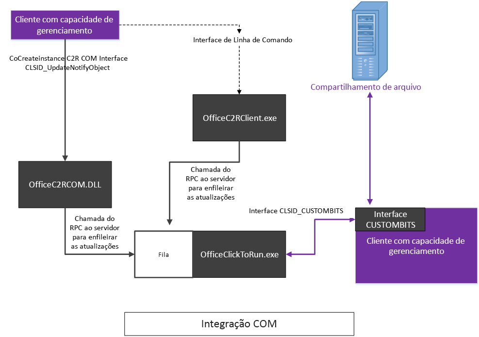
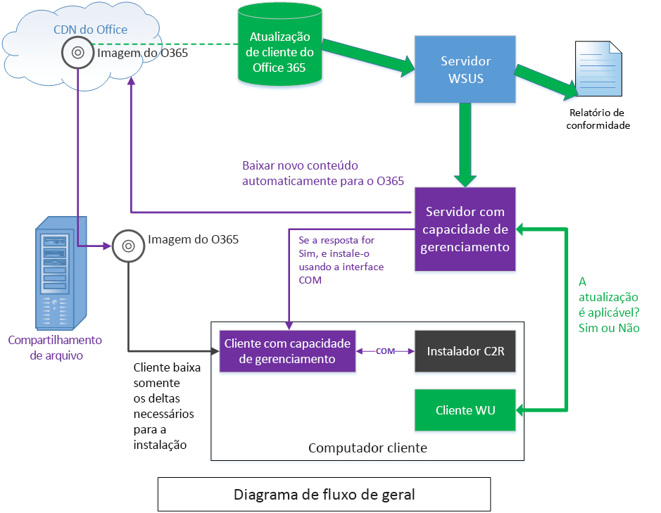

# <a name="integrating-manageability-applications-with-office-365-click-to-run-installer"></a>Como integrar aplicativos de capacidade de gerenciamento ao instalador clique para executar do Office 365

Aprenda a integrar o instalador Clique para Executar do Office 365 a uma solução de gerenciamento de software.
  
O instalador Clique para Executar do Office 365 fornece uma interface COM que permite aos Profissionais de TI e soluções de gerenciamento de software controle programático sobre o gerenciamento de atualizações. Essa interface tem recursos adicionais de gerenciamento além do que é fornecido pela Ferramenta de Implantação do Office.
  
> [!NOTE]
> Este artigo aplica-se ao Office 2016 e posterior, bem como ao Office 365. 
  
## <a name="integrating-with-the-click-to-run"></a>Integração ao Clique para Executar

Para usar essa interface, um aplicativo de capacidade de gerenciamento invoca a interface COM e chama APIs expostas que se comunicam diretamente com o serviço de instalação Clique para Executar. 
  
> [!NOTE]
> O instalador Clique para Executar do Office pode ser executado na linha de comando com parâmetros que podem controlar o comportamento, conforme documentado em [Ferramenta de Implantação do Office para Clique para Executar](https://www.microsoft.com/en-us/download/details.aspx?id=49117). 
  
**Veja a seguir um diagrama conceitual da interface COM**


  
O instalador Clique para Executar do Office 365 implementa uma interface baseada em COM, **IUpdateNotify**, registrada na CLSID **CLSID_UpdateNotifyObject**.
  
Essa interface pode ser invocada da seguinte maneira:
  
```cpp
hr = CoCreateInstance(CLSID_UpdateNotifyObject, NULL, CLSCTX_ALL,
       IID_IUpdateNotify, 
      (void **)&p); 
```

A chamada será bem-sucedida se o autor da chamada estiver em execução sob privilégios elevados, pois o programa de instalação Clique para Executar deve ser executado com privilégios elevados.
  
A interface COM **IUpdateNotify** expõe três funções assíncronas responsáveis por validar os comandos e parâmetros, bem como agendar a execução com o serviço de instalação Clique para Executar. 
  
```cpp
HRESULT Download([in] LPWSTR pcwszParameters) // Download update content.
HRESULT Apply([in] LPWSTR pcwszParameters) // Apply update content.
HRESULT Cancel() // Cancel the download action.

```

Um quarto método, **Status**, pode ser usado para obter informações sobre o status do último comando executado ou o status do comando em execução no momento (isto é, êxito, falha, códigos de erro detalhados).
  
```cpp
HRESULT status([out] _UPDATE_STATUS_REPORT* pUpdateStatusReport) // Get status of current action. 
typedef struct _UPDATE_STATUS_REPORT  
{  
UPDATE_STATUS status;  
UINT error; 
BSTR contentid;  
} UPDATE_STATUS_REPORT;

```

Há quatro estados em que o serviço de instalação Clique para Executar pode estar durante o seu ciclo de vida, durante o qual os métodos **IUpdateNotify** podem ser chamados; Reinicializando, Ocioso, Baixando e Aplicando. 
  
**Veja a seguir o diagrama de Máquina de Estado da interface COM**


  
> [!NOTE]
> **Reinicializando**: quando o computador está sendo inicializado, há um período em que o serviço instalador Clique para Executar fica indisponível. Uma chamada bem-sucedida ao método Status após uma reinicialização retornará eUPDATE_UNKNOWN. 
  
**Ocioso:** quando o instalador Clique para Executar estiver no estado ocioso, você poderá chamar: 
  
- **Aplicar**: instala o conteúdo anteriormente baixado.
    
- **Cancelar**: retorna `0x800000e`, "Um método foi chamado em um momento inesperado".
    
- **Baixar**: baixa novo conteúdo no cliente para instalação posterior.
    
- **Status**: retorna o resultado da última ação concluída ou uma mensagem de erro se a ação terminou em falha. Se não houver ação anterior, **Status** retornará `eUPDATE_UNKNOWN`.
    
**Baixando:** quando o instalador Clique para Executar estiver no estado baixando, você poderá chamar: 
  
- **Aplicar**: retorna **HRESULT** com o valor `0x800000e`, "Um método foi chamado em um momento inesperado".
    
- **Cancelar**: interrompe o download e remove o conteúdo parcialmente baixado.
    
- **Baixar**: retorna **HRESULT** com o valor `0x800000e`, "Um método foi chamado em um momento inesperado". 
    
- **Status**: retorna **DOWNLOAD_WIP** para indicar que o trabalho de download está em andamento. 
    
**Aplicando:** quando o instalador Clique para Executar estiver no processo de instalação do conteúdo anteriormente baixado: 
  
- **Aplicar**: retorna **HRESULT** com o valor `0x800000e`, "Um método foi chamado em um momento inesperado".
    
- **Cancelar**: retorna `0x800000e`, a ação Aplicar não pode ser cancelada.
    
- **Baixar**: retorna **HRESULT** com o valor `0x800000e`, "Um método foi chamado em um momento inesperado". 
    
- **Status**: retorna **APPLY_WIP** para indicar que o trabalho de aplicação está em andamento. 
    
> [!NOTE]
> Uma vez que OfficeC2RCOM é um serviço COM+ e foi dinamicamente carregado, é preciso chamar **CoCreateInstance** toda vez que você chama um método nessa classe, a fim de garantir a obtenção do resultado esperado. O serviço COM+ tratará de criar uma nova instância, se necessário. Quando um dos métodos é chamado pela primeira vez, COM+ carregará o objeto **IUpdateNotify** e o executará em uma das instâncias de dllhost.exe. O novo objeto permanecerá ativo por aproximadamente 3 minutos em estado ocioso. Se uma chamada subsequente for feita dentro de três minutos, a contar da última chamada, o objeto **IUpdateNotify** permanecerá carregado e não será criada uma nova instância. Se nenhuma chamada for feita em três minutos, o objeto IUpdateNotify será descarregado e um novo objeto **IUpdateNotify** será criado quando a próxima chamada for feita. 
  
## <a name="click-to-run-installer-com-api-reference-guide"></a>Guia de referência da API COM do instalador Clique para Executar

Na seguinte documentação de referência de API:
  
- Os parâmetros estão em um formato de par chave/valor separados por um espaço.
    
- Os parâmetros não diferenciam maiúsculas de minúsculas.
    
- Há uma [lista de parâmetros](https://blogs.technet.microsoft.com/odsupport/2014/03/03/the-new-update-now-feature-for-office-2013-click-to-run-for-office365-and-its-associated-command-line-and-switches/) com documentação disponível. 
    
- Agora, o resumo da interface IUpdateNotify2 está incluído.
    
### <a name="apply"></a>Aplicar

```cpp
HRESULT Apply([in] LPWSTR pcwszParameters) // Apply update content.
```

#### <a name="parameters"></a>Parâmetros

-  _displaylevel_: **true** para mostrar o status da instalação, incluindo erros, durante o processo de atualização; **false** para ocultar o status da instalação, incluindo erros, durante o processo de atualização. O padrão é **false**.
    
-  _forceappshutdown_: **true** para forçar os aplicativos do Office a desligarem imediatamente quando a ação **Aplicar** for disparada; **false** para falha, se algum aplicativo do Office estiver em execução. O padrão é **false**. Veja [Comentários](#bk_ApplyRemark) para saber mais. 
    
  Se algum aplicativo do Office estiver em execução quando a ação **Aplicar** for disparada, a ação **Aplicar** normalmente falha. Passar `forceappshutdown=true` ao método **Aplicar** fará com que o serviço **OfficeClickToRun** desligue imediatamente os aplicativos e aplique a atualização. O usuário poderá enfrentar perda de dados nesse caso. 
    
#### <a name="return-results"></a>Retornar resultados

|||
|:-----|:-----|
|**S_OK** <br/> |A ação foi enviada com êxito ao serviço Clique para Executar para execução.  <br/> |
|**E_ACCESSDENIED** <br/> |O autor da chamada não está em execução com privilégios elevados.  <br/> |
|**E_INVALIDARG** <br/> |Parâmetros inválidos foram passados.  <br/> |
|**E_ILLEGAL_METHOD_CALL** <br/> |A ação não é permitida neste momento. Veja [Comentários](#bk_ApplyRemark) para saber mais.  <br/> |

<a name="bk_ApplyRemark"></a>

#### <a name="remarks"></a>Comentários

- Se algum aplicativo do Office estiver em execução quando a ação **Aplicar** for disparada, a ação **Aplicar** falhará. Passar `forceappshutdown=true` ao método **Aplicar** fará com que o serviço **OfficeClickToRun** desligue imediatamente qualquer aplicativo do Office que esteja em execução e aplique a atualização. O usuário pode sofrer perda de dados, uma vez que não é solicitado que salve as alterações em documentos abertos. 
    
- Essa ação poderá ser disparada somente quando o status COM for um dos seguintes: 
    
  - **eUPDATE_UNKNOWN**
    
  - **eDOWNLOAD_CANCELLED**
    
  - **eDOWNLOAD_FAILED**
    
  - **eDOWNLOAD_SUCCEEDED**
    
  - **eAPPLY_SUCCEEDED**
    
  - **eAPPLY_FAILED**
    
- Se você chamar o método **Apply** sem baixar o conteúdo antes, o método **Apply** indicará **Êxito**, pois ele não detectou nada a ser aplicado e concluiu o processo **Apply** com êxito. 
    
### <a name="cancel"></a>Cancelar

```cpp
HRESULT Cancel() // Cancel the download action.
```

#### <a name="return-results"></a>Retornar resultados

|||
|:-----|:-----|
|S_OK  <br/> |A ação foi enviada com êxito ao serviço Clique para Executar para execução.  <br/> |
|E_ILLEGAL_METHOD_CALL  <br/> |A ação não é permitida neste momento. Consulte a seção [Comentários](#bk_CancelRemarks) para obter mais informações  <br/> |

<a name="bk_CancelRemarks"></a>

#### <a name="remarks"></a>Comentários

- Esse método poderá ser disparado somente quando o status COM for **eDOWNLOAD_WIP**. Ele tentará cancelar a ação de download atual. O status COM será alterado para **eDOWNLOAD_CANCELLING** e, por fim, para **eDOWNLOAD_CANCELED**. O status COM retornará **E_ILLEGAL_METHOD_CALL** se disparado em qualquer outro momento. 
    
### <a name="download"></a>Baixar

```cpp
HRESULT Download([in] LPWSTR pcwszParameters) // Download update content.
```

#### <a name="parameters"></a>Parâmetros

-  _displaylevel_: **true** para mostrar o status da instalação, incluindo erros, durante o processo de atualização; **false** para ocultar o status da instalação, incluindo erros, durante o processo de atualização. O padrão é **false**.
    
-  _updatebaseurl_: URL para a fonte alternativa de download.
    
-  _updatetoversion_: a versão para a qual atualizar o Office. Defina esse parâmetro se desejar atualizar para um versão mais antiga do que a versão que está atualmente instalada.
    
-  _downloadsource_: CLSID da implementação **IBackgroundCopyManager** personalizada (gerenciador do BITS). 
    
-  _contentid_: identifica o conteúdo a ser baixado do servidor de conteúdo por meio do gerenciador do BITS personalizado. Esse valor é passado pela interface do BITS para interpretação.
    
#### <a name="return-results"></a>Retornar resultados

|||
|:-----|:-----|
|**S_OK** <br/> |A ação foi enviada com êxito ao serviço Clique para Executar para execução.  <br/> |
|**E_ACCESSDENIED** <br/> |O autor da chamada não está em execução com privilégios elevados.  <br/> |
|**E_INVALIDARG** <br/> |Parâmetros inválidos foram passados.  <br/> |
|**E_ILLEGAL_METHOD_CALL** <br/> |A ação não é permitida neste momento. Veja [Comentários](#bk_DownloadRemark) para saber mais.  <br/> |

<a name="bk_DownloadRemark"></a>

#### <a name="remarks"></a>Comentários

- Você deve especificar _downloadsource_ e _contentid_ como um par. Caso contrário, o método **Baixar** retornará um erro **E_INVALIDARG**. 
    
- Se _downloadsource_, _contentid_ e _updatebaseurl_ forem fornecidos, _updatebaseurl_ será ignorado. 
    
- Essa ação poderá ser disparada somente quando o status COM for um dos seguintes: 
    
  - **eUPDATE_UNKNOWN**
    
  - **eDOWNLOAD_CANCELLED**
    
  - **eDOWNLOAD_FAILED**
    
  - **eDOWNLOAD_SUCCEEDED**
    
  - **eAPPLY_SUCCEEDED**
    
  - **eAPPLY_FAILED**
    
- Se você chamar o método **Apply** sem o conteúdo baixado anteriormente, o método **Apply** indicará **Êxito**, pois ele não detectou nada a ser aplicado e concluiu o processo **Apply** com êxito. 
    
#### <a name="examples"></a>Exemplos

- Para baixar o conteúdo do gerenciador do BITS personalizado: chame a função **download()** passando os seguintes parâmetros: 
    
  ```cpp
  "downloadsource=CLSIDofBITSInterface contentid=BITSServerContentIdentifier"
  ```

- Para baixar o conteúdo CDN da Microsoft: chame a função **download()** sem especificar os parâmetros _downloadsource_, _contentid_ ou _ updatebaseurl_. 
    
- Para baixar o conteúdo de um local personalizado: chame a função **download()** passando o seguinte parâmetro: 
    
  ```cpp
  "updatebaseurl=yourcontentserverurl"
  ```

### <a name="status"></a>Status

```cpp
typdef struct _UPDATE_STATUS_REPORT
{
    UPDATE_STATUS status;
    UINT error;
    LPCWSTR contentid;
}UPDATE_STATUS_REPORT;
HRESULT status([out] _UPDATE_STATUS_REPORT& pUpdateStatusReport) // Get status of current action
```

#### <a name="parameters"></a>Parâmetros

|||
|:-----|:-----|
| _pUpdateStatusReport_ <br/> |Ponteiro para uma estrutura UPDATE_STATUS_REPORT.  <br/> |
   
#### <a name="return-results"></a>Retornar resultados

|||
|:-----|:-----|
|**S_OK** <br/> |O método **Status** sempre retorna esse resultado. Inspecione a estrutura `UPDATE_STATUS_RESULT` para ver o status atual ação.  <br/> |
   
#### <a name="remarks"></a>Comentários

- O campo de status de `UPDATE_STATUS_REPORT` contém o status de ação atual. Um dos seguintes valores de status é retornado: 
    
  ```cpp
  typedef enum _UPDATE_STATUS
  {
  eUPDATE_UNKNOWN = 0,
  eDOWNLOAD_PENDING,
  eDOWNLOAD_WIP,
  eDOWNLOAD_CANCELLING,
  eDOWNLOAD_CANCELLED,
  eDOWNLOAD_FAILED,
  eDOWNLOAD_SUCCEEDED,
  eAPPLY_PENDING,
  eAPPLY_WIP,
  eAPPLY_SUCCEEDED,
  eAPPLY_FAILED,
  } UPDATE_STATUS;
  
  ```

- Se o último comando resultou em um erro, o campo de erro de `UPDATE_STATUS_REPORT` conterá informações detalhadas sobre o erro. Dois tipos de código de erro são retornados do método **Status**. 
    
- Se o erro for inferior a `UPDATE_ERROR_CODE::eUNKNOWN`, o erro será um dos seguintes códigos de erro predefinidos:
    
  ```cpp
  typedef enum _UPDATE_ERROR_CODE
  {
  eOK = 0,
  eFAILED_UNEXPECTED,
  eTRIGGER_DISABLED,
  ePIPELINE_IN_USE,
  eFAILED_STOP_C2RSERVICE,
  eFAILED_GET_CLIENTUPDATEFOLDER,
  eFAILED_LOCK_PACKAGE_TO_UPDATE,
  eFAILED_CREATE_STREAM_SESSION,
  eFAILED_PUBLISH_WORKING_CONFIGURATION,
  eFAILED_DOWNLOAD_UPGRADE_PACKAGE,
  eFAILED_APPLY_UPGRADE_PACKAGE,
  eFAILED_INITIALIZE_RSOD,
  eFAILED_PUBLISH_RSOD,
  // Keep this one as the last
  eUNKNOWN
  } UPDATE_ERROR_CODE;
  
  ```

  Se um código de erro de retorno for superior a `UPDATE_ERROR_CODE::eUNKNOWN`, trata-se do **HRESULT** de uma chamada de função com falha. Para extrair o HRESULT, subtraia `UPDATE_ERROR_CODE::eUNKNOWN` do valor retornado no campo de erro de `UPDATE_STATUS_REPORT`.
    
  A lista completa de valores de status e erro pode ser exibida inspecionando a biblioteca de tipos **IUpdateNotify** inserida em OfficeC2RCom.dll. 
    
- O campo contentid é usado para chamadas a **Status** depois que **Baixar** tiver sido iniciado e retornar o contentid que foi passado à chamada **Baixar**. É uma prática recomendada inicializar esse campo como **nulo** antes chamar o método **Status** e, em seguida, verificar o valor depois que **Status** tiver sido retornado. Se o valor ainda for **null**, isso significa que não há contentid a ser retornado. Se o valor não for **null**, você precisará liberá-lo com um chamada a **SysFreeString()**. Veja um trecho de código de como chamar **Status** após **Baixar**.
    
  ```cpp
  std::wstring contentID;
  UPDATE_STATUS_REPORT statusReport;
  statusReport.status = eUPDATE_UNKNOWN;
  statusReport.error = eOK;
  statusReport.contentid = NULL;
  hr = p->Status(&statusReport);
  if (statusReport.contentid != NULL)
  {
  contentID = statusReport.contentid;
  SysFreeString(statusReport.contentid);
  }
  wprintf(L"ContentID: %s, Status: %d, LastError: %d", contentID.c_str(), statusReport.status, statusReport.error);
  
  ```

### <a name="summary-of-iupdatenotify2-interface"></a>Resumo da interface IUpdateNotify2

> [!NOTE]
> Esse resumo é fornecido como informações complementares de [Integrando aplicativos de capacidade de gerenciamento ao instalador Clique para Executar do Office 365](https://msdn.microsoft.com/EN-US/library/office/mt608768.aspx). Assim que o documento público for atualizado, esse documento poderá ser considerado obsoleto. 
  
No C2RTenant [16.0.8208.6352](https://oloop/BuildGroup/Details/tenantc2rclient#3519/1255278) (Primeiro build publicamente disponível deve ser o build fork de junho-- 8326.*), adicionamos uma nova interface **IUpdateNotify2**. Veja algumas informações básicas sobre essa interface: 
  
- CLSID_UpdateNotifyObject2, {52C2F9C2-F1AC-4021-BF50-756A5FA8DDFE}
    
- Essa interface também hospedava a interface IUpdateNotify original para fornecer compatibilidade com versões anteriores. Isso significa que, ao usar essa interface, você terá acesso a todos os métodos fornecidos na interface **UpdateNotifyObject**. 
    
- Novos métodos adicionados a IUpdateNotify2:
    
  - **HRESULT** GetBlockingApps([out] BSTR \* AppsList). Obtenha a lista de aplicativos de bloqueio de atualizações. Essa chamada retornará os aplicativos do Office em execução que impedirão o processo de atualização de prosseguir. 
    
  - **HRESULT** GetOfficeDeploymentData([in] int dataType, [in] **LPCWSTR** pcwszName, [out] BSTR * OfficeData). Obtenha os dados de implantação do Office. 
    
- Se desejar usar os novos métodos, você precisará garantir:
    
  - Que a sua versão C2R seja mais nova do que o build acima (\> = build fork de junho).
    
  - O uso de UpdateNotifyObject2, em vez de **UpdateNotifyObject** para chamar **CoCreateInstance**.
    
Se você não usar qualquer um dos métodos novos, não será necessário alterar nada. Todos os métodos existentes funcionarão exatamente da mesma maneira que antes.
  
## <a name="implementing-the-bits-interface"></a>Como implantar a interface do BITS

O BITS ([Serviço de Transferência Inteligente em Segundo Plano](https://msdn.microsoft.com/library/bb968799(v=vs.85).aspx)) é um serviço fornecido pela Microsoft para transferir arquivos entre um cliente e um servidor. O BITS é um dos canais que o instalador Clique para Executar do Office pode usar para baixar conteúdo. Por padrão, o instalador Clique para Executar do Office usa a implementação interna do BITS do Windows para baixar o conteúdo da CDN. 
  
Ao fornecer uma implementação do BITS personalizado ao método **download()** da interface **IUpdateNotify**, seu software de capacidade de gerenciamento pode controlar onde e como o cliente baixa o conteúdo. Uma interface do BITS personalizado é útil ao fornecer um canal de distribuição de conteúdo personalizado diferente dos canais internos de Clique para Executar, como CDN do Office, servidores IIS ou compartilhamentos de arquivo. 
  
O requisito mínimo para uma interface do BITS personalizado trabalhar com o serviço C2R do Office é:
  
- Para **IBackgroundCopyManager**:
    
  ```cpp
  HRESULT _stdcall CreateJob(
                      [in] LPWSTR DisplayName, 
                      [in] BG_JOB_TYPE Type, 
                      [out] GUID* pJobId, 
                      [out] IBackgroundCopyJob** ppJob)
  HRESULT _stdcall GetJob(
                      [in] GUID* jobID, 
                      [out] IBackgroundCopyJob** ppJob)
  HRESULT _stdcall EnumJobs(
                      [in] unsigned long dwFlags, 
                      [out] IEnumBackgroundCopyJobs** ppenum)
  
  ```

- Para **IBackgroundCopyJob**:
    
  ```cpp
  HRESULT _stdcall AddFile(
                      [in] LPWSTR RemoteUrl, 
                      [in] LPWSTR LocalName)
  HRESULT _stdcall Resume()
  HRESULT _stdcall Complete()
  HRESULT _stdcall Cancel();
  HRESULT _stdcall GetState([out] BG_JOB_STATE* pVal);
  HRESULT GetProgress( [out] BG_JOB_PROGRESS *pProgress);
  
  ```

- Para **IBackgroundCopyJob3**:
    
  ```cpp
  HRESULT _stdcall AddFileWithRanges(
                      [in] LPWSTR RemoteUrl, 
                      [in] LPWSTR LocalName,
                      [in] DWORD RangeCount,
                      [in] BG_FILE_RANGE Ranges[])
  
  ```

- Para as funções `Addfile` e `AddFileWithRanges`, a URL remota está no seguinte formato: 
    
  ```cpp
  cmbits://<contentid>/<relative path to target file>
  ```

  - cmbits é embutido em código e significa o BITS personalizado.
    
  -  _\<contentid\>_ é o parâmetro _contentid_ para o método **Download()**. 
    
  -  _\<caminho relativo para arquivo de destino\>_ fornece o local e o nome do arquivo para download. 
    
    Por exemplo, se você tiver fornecido um _contentid_ de `f732af58-5d86-4299-abe9-7595c35136ef` ao método **Download()** e o C2R do Office quiser baixar o arquivo cab da versão, como o arquivo `v32.cab`, ele chamará **AddFile()** com o seguinte `RemoteUrl`:
    
  ```cpp
  cmbits://f732af58-5d86-4299-abe9-7595c35136ef/Office/Data/V32.cab
  ```

- Para **IBackgroundCopyError**:
    
  ```cpp
  HRESULT _stdcall GetErrorDescription(
        [in]  DWORD  LanguageId,
        [out] LPWSTR *ppErrorDescription);
  
  ```

- Para **IBackgroundCopyFile**:
    
  ```cpp
  HRESULT _stdcall GetLocalName([out] LPWSTR *ppName); 
  HRESULT _stdcall GetRemoteName([out] LPWSTR *ppName);
  
  ```

<!--## Automating content staging

IT administrators can choose to have desktop clients enabled to automatically receive updates when they are available directly from the Microsoft Content Delivery Network (CDN) or they can choose to control the deployment of updates available from the [update channels](https://support.office.com/en-us/article/Overview-of-update-channels-for-Office-365-ProPlus-9ccf0f13-28ff-4975-9bd2-7e4ea2fefef4?ui=en-US&rs=en-US&ad=US) using the [Office 2016 Deployment Tool](https://www.microsoft.com/en-us/download/details.aspx?id=49117) or [System Center Configuration Manager](https://support.office.com/en-us/article/Manage-updates-to-Office-365-ProPlus-with-System-Center-Configuration-Manager-b4a17328-fcfe-40bf-9202-58d7cbf1cede).
  
The service supports the ability for management tools to recognize and automate the download of the content when updates are made available.
  
**Following is a diagram showing the overview of downloading a custom image**


  
In the above diagram you see that a new Office 365 ProPlus image is available on the Office Content Distribution Network (CDN). Along with the Office 365 ProPlus image, an XML-formatted file list is also available which has the information needed to enable manageability software to directly create customized images replacing the need for using the Office Deployment Tool.
  
An enterprise configures their WSUS to sync the Office 365 Client Updates. These updates do not contain the actual image payload but does allow the manageability software to recognize when new content is available. The manageability software can then read the Client Update metadata to understand what version of Office the update applies to.
  
If the update is applicable, the manageability software can use the CDN content and the file list to create the custom image and store it onto the file share location that it is configured to use.
  
### Format of the XML file list

There are two file lists available in a cab file on the CDN. One lists the files for the 32-bit version of Office and one for the 64-bit version of Office. The URL of the location of the Office File List (OFL.CAB) file is [https://officecdn.microsoft.com/pr/wsus/ofl.cab](https://officecdn.microsoft.com/pr/wsus/ofl.cab). The two file lists are called:
  
- O365Client_32bit.xml
    
- O365Client_64bit.xml
    
Within the XML for each of the file lists is an  `UpdateFiles` node which contains a version attribute.  `UpdateFiles version="1.4"`.
  
This version is incremented if changes are made to the file lists.
  
There are two parameters that need to be combined with the XML to make a custom image: 
  
- Replace  _%version%_ with the build version of Office. This can be derived from the Client Update metadata  `MoreInfoURL` field, see below. 
    
- Define  _baseURL_ by using the URL value associated with the branch the image is being created for. This can be derived from the Client Update metadata, see below. 
    
The steps for creating an image are:
  
1. Open the XML file list.
    
2. Replace occurrences of  _%version%_ with the applicable Office build version. The build version can be acquired from releasehistory.xml as described later in this article. 
    
3. Read the URL attribute for the target branch.
    
4. Remove language nodes for any languages not required in the custom image.
    
   > [!NOTE]
   > Nodes with language='0' are language neutral and must be included in the image. 
  
5. Construct a local image of the CDN by iterating through the XML file list and copying the CDN files, while creating the folder structure as needed. 
    
   - If the  _rename_ attribute is provided, then rename the copied file to the value provided in the  _rename_ attribute. This used to create the top-level default v64.cab and v32.cab files. These are the renamed versions of the top-level build cab file and are used as the default installation version if the version is not specified. 
    
   - Use URL + relativePath + filename to construct the CDN location.
    
The following examples use the Monthly channel (as defined by the  `baseURL` node) and build version 16.0.4229.1004 from releasehistory.xml. 
  
```cpp
baseURL branch="Monthly" URL="https://officecdn.microsoft.com/pr/492350f6-3a01-4f97-b9c0-c7c6ddf67d60" /
```

- The following is a language neutral file needed for all languages. The name of the file is v64_16.0.4229.1004.cab and it should be copied from https://officecdn.microsoft.com/pr/492350f6-3a01-4f97-b9c0-c7c6ddf67d60/office/data/v64_16.0.4229.1004.cab and renamed to …/office/data/v64.cab.
    
  ```cpp
  baseURL branch="Business" URL="https://officecdn.microsoft.com/pr/7ffbc6bf-bc32-4f92-8982-f9dd17fd3114" /
  File name="v64_%version%.cab" rename="v64.cab" relativePath="/office/data/" language="0"/
  
  ```

- The following is a file to be included in the en-US image as designated by the language LCID=1033. The name of the file is s641033.cab and it should be copied from https://officecdn.microsoft.com/pr/492350f6-3a01-4f97-b9c0-c7c6ddf67d60/office/data/16.0.4229.1004/s641033.cab and not renamed.
    
  ```cpp
  File name="s641033.cab" relativePath="/office/data/%version%/" language="1033" /
  ```

### Hash verification of data files

Image creation tools may verify the integrity of the downloaded .dat files by comparing a computed HASH value with the supplied HASH value associated with each of the .dat files. Below is an example of a .dat file from the Monthly channel with build version 16.0.4229.1004 and language set to Bulgarian.
  
```cpp
File name="stream.x64.bg-bg.dat" hashLocation="s641026.cab/stream.x64.bg-bg.hash" hashAlgo="Sha256" relativePath="/office/data/%version%/" language="1026"
```

- The  _hashLocation_ attribute specifies the relative path location of the stream.x64.bg-bg.hash for the stream.x64.bg-bg.dat file. Construct the hash file location by concatenating URL + relativePath + hashLocation. In this example the stream.x64.bg-bg.hash location would be https://officecdn.microsoft.com/pr/492350f6-3a01-4f97-b9c0-c7c6ddf67d60/office/data/16.0.4229.1004/s641026.cab/stream.x64.bg-bg.hash 
    
- The  _hashAlgo_ attribute specifies what hashing algorithm was used. In this case the Sha256 algorithm was used. 
    
To validate the integrity of the stream.x64.bg-bg.dat file, open the stream.x64.bg-bg.hash and read the hash value from the first line of text in the hash file. Compare this to the has value that you computed using the specified hashing algorithm to verify that the values match. Use the following C# code to read the hash.
  
```cs
string[] readHashes = System.IO.File.ReadAllLines(tmpFile, Encoding.Unicode);
string readHash = readHashes.First();

```

### Office 365 Client Updates

Office 365 Client Updates enable manageability software to treat the Office 365 Client Updates in a manner very similar to any other WU update with one exception; the client updates do not contain an actual payload. The Office 365 Client Updates should not be installed on any clients but rather used to trigger the workflows with the manageability software replacing the installation command with the COM based installation mechanism shown above.
  
**Office 365 Client Update workflow**


  
Each Office 365 Client Update that is published includes metadata about the update. This metadata includes a parameter called  _MoreInfoUrl_ which can be used to derive the following information: 
  
-  _Ver_: Identifies the Office version associated with this update. For example 16.0.4229.1004.
    
-  _Branch_: Identifies the Update Channel for this update. Values include InsiderFast, Insiders, Monthly, Targeted, Broad. Additional values may be added in the future.
    
-  _Arch_: Identifies the processor architecture associated with this update.
    
-  _xmlVer_: Identifies the version of the XML file lists to use to construct the base image for this update.
    
-  _xmlPath_: Path to the OFL.CAB file that contains the XML file lists.
    
-  _xmlFile_: The name of the file list that should be used for this update. The value will be  `O365Client_32bit` or  `O365Client_64bit` and will match the value in  _Arch_.
    
The following is an example of the  _MoreInfoURL_ parameter which refers to the Office 365 Client Update for the 32-bit version of Office with build version of 16.0.2342.2343 on the Current channel. 
  
```http
https://officecdn.microsoft.com/pr/wsus/ofl.cab is the location of the XML file lists for this update, specifically the O365Client_32bit.xml from within the OFL.CAB.
https://go.microsoft.com/fwlink/?LinkId=626090&Ver=16.0.8326.2096&Branch=Current&Arch=64&XMLVer=1.4&xmlPath=https://officecdn.microsoft.com/pr/wsus/ofl.cab&xmlFile=O365Client_64bit.xml 

```
THE ABOVE SECTION APPEARS TO BE A DUPLICATE OF THE FOLLOWING SECTION; TEMPORARILY COMMENTING IT OUT.-->

## <a name="automating-content-staging"></a>Como automatizar o preparo do conteúdo

Os administradores podem optar por terem clientes de desktop habilitados a receber automaticamente atualizações quando estiverem disponíveis diretamente da CDN (Rede de Distribuição de Conteúdo) da Microsoft ou eles podem optar por controlar a implantação de atualizações disponíveis nos canais de atualização usando a Ferramenta de Implantação do Office ou o System Center Configuration Manager.
  
O serviço dá suporte à capacidade das ferramentas de gerenciamento de reconhecer e automatizar o download do conteúdo quando as atualizações são disponibilizadas.
  
**A imagem a seguir é uma visão geral de como baixar uma imagem personalizada**


  
### <a name="overview-of-downloading-a-custom-image"></a>Visão geral de como baixar uma imagem personalizada
  
No diagrama anterior, você vê que uma nova imagem do Office 365 ProPlus está disponível na CDN (Rede de Distribuição de Conteúdo) do Office. Com a imagem do Office 365 ProPlus, também está disponível uma lista de arquivos formatados em XML, que têm as informações necessárias para habilitar o software de capacidade de gerenciamento para criar diretamente imagens personalizadas, substituindo a necessidade de usar a Ferramenta de Implantação do Office.
  
Uma empresa configura o seu WSUS para sincronizar as Atualizações de Cliente do Office 365. Essas atualizações não contêm a carga real da imagem, mas permitem que o software de capacidade de gerenciamento reconheça quando conteúdo novo está disponível. O software de capacidade de gerenciamento pode ler os metadados da Atualização do Cliente para entender à qual versão do Office a atualização se aplica.
  
Se a atualização for aplicável, o software de capacidade de gerenciamento pode usar o conteúdo da CDN e a lista de arquivos para criar a imagem personalizada e armazená-la no local do compartilhamento de arquivos que ele está configurado para usar.
  
### <a name="format-of-the-xml-file-list"></a>Formato da lista de arquivos XML

Há duas listas de arquivos disponíveis em um arquivo cab na CDN. Uma relaciona os arquivos para a versão de 32 bits do Office e a outra para a versão de 64 bits do Office. A URL do local do arquivo Lista de Arquivos do Office (OFL.CAB) é [https://officecdn.microsoft.com/pr/wsus/ofl.cab](https://officecdn.microsoft.com/pr/wsus/ofl.cab). As duas listas de arquivos são chamadas de:
  
- O365Client_32bit.xml
    
- O365Client_64bit.xml
    
No XML para cada uma das listas de arquivos, há um nó <UpdateFiles> que contém um atributo de versão.  `<UpdateFiles version="1.4">`. Essa versão será incrementada se alterações forem feitas nas listas de arquivos.
  
Há dois parâmetros que precisam ser combinados com o XML para criar uma imagem personalizada: 
  
- Substitua *%version%* pela versão do build do Office. Esse valor pode ser derivado dos metadados da Atualização do Cliente (explicado na próxima seção). 
    
- Defina *baseURL* usando o valor de URL associado à ramificação para a qual a imagem está sendo criada. Esse valor é derivado dos metadados da Atualização do Cliente, explicado na seção a seguir. 
    
As etapas para criar uma imagem são:
  
1. Abra a lista de arquivos XML.
    
2. Substitua as ocorrências de *%version%* pela versão aplicável do build do Office. A versão do build pode ser adquirida em releasehistory.xml, conforme descrito mais adiante neste artigo. 
    
3. Leia o atributo URL para a ramificação de destino.
    
4. Remova os nós de idioma de todos os idiomas desnecessários na imagem personalizada.
    
   > [!NOTE]
   > Os nós com idioma='0' têm neutralidade de idioma e devem ser incluídos na imagem. 
  
5. Crie uma imagem local da CDN iterando pela lista de arquivos XML e copiando os arquivos da CDN, enquanto cria a estrutura de pasta conforme a necessidade. 
    
   - Se o atributo *rename* for fornecido, isso significa que *rename* copiou o arquivo para o valor fornecido no atributo rename. Isso é usado para criar os arquivos padrão de nível superior v64.cab e v32.cab. Essas são as versões renomeadas do arquivo cab do build de nível superior e serão usadas como a versão de instalação padrão se a versão não for especificada. 
    
   - Use URL + relativePath + nome do arquivo para criar o local da CDN.
    
Veja a seguir os exemplos que usam o canal Monthly (conforme definido pelo nó `<baseURL>`) e versão do build 16.0.4229.1004 em releasehistory.xml. 
  
```xml
<baseURL branch="Monthly" URL="https://officecdn.microsoft.com/pr/492350f6-3a01-4f97-b9c0-c7c6ddf67d60" />
```

- Veja a seguir um arquivo com neutralidade de idioma necessário para todos os idiomas. O nome do arquivo é v64_16.0.4229.1004.cab e ele deve ser copiado de `https://officecdn.microsoft.com/pr/492350f6-3a01-4f97-b9c0-c7c6ddf67d60/office/data/v64_16.0.4229.1004.cab` e renomeado para `…/office/data/v64.cab`. 
    
  ```xml
  <File name="v64_%version%.cab" rename="v64.cab" relativePath="/office/data/" language="0"/>
  
  ```

- Veja a seguir um arquivo a ser incluído na imagem en-US como designado pela LCID = 1033 do idioma. O nome do arquivo é s641033.cab e ele deve ser copiado de `https://officecdn.microsoft.com/pr/492350f6-3a01-4f97-b9c0-c7c6ddf67d60/office/data/16.0.4229.1004/s641033.cab` e não deve ser renomeado.
    
  ```xml
  <File name="s641033.cab" relativePath="/office/data/%version%/" language="1033" />
  ```

### <a name="hash-verification-of-dat-files"></a>Verificação de hash de arquivos .dat

As ferramentas de criação de imagens podem verificar a integridade dos arquivos .dat baixados comparando um valor de HASH calculado com o valor de HASH fornecido associado a cada um dos arquivos .dat. Veja a seguir um exemplo de arquivo .dat do canal Monthly com o build versão 16.0.4229.1004 e idioma definido como búlgaro:
  
```xml
<File name="stream.x64.bg-bg.dat" hashLocation="s641026.cab/stream.x64.bg-bg.hash" hashAlgo="Sha256" relativePath="/office/data/%version%/" language="1026"/>
```

- O atributo **hashLocation** especifica o local do caminho relativo de stream.x64.bg-bg.hash para o arquivo stream.x64.bg-bg.dat. Crie o local do arquivo hash concatenando a URL + relativePath + hashLocation. No seguinte exemplo, o local stream.x64.bg-bg.hash seria: 
    
  ```http
  https://officecdn.microsoft.com/pr/492350f6-3a01-4f97-b9c0-c7c6ddf67d60/office/data/16.0.4229.1004/s641026.cab/stream.x64.bg-bg.hash 
  ```

- O atributo **hashAlgo** especifica qual algoritmo de hash foi usado. Nesse caso, foi usado Sha256. 
    
  Para validar a integridade do arquivo stream.x64.bg-bg.dat, abra o stream.x64.bg-bg.hash e leia o valor do HASH, que é a primeira linha do texto no arquivo de hash. Compare-o com o valor do hash calculado (usando o algoritmo de hash especificado) para verificar a integridade do arquivo .dat baixado.
    
  O exemplo a seguir mostra o código C# para leitura do hash.
    
  ```cs
    string[] readHashes = System.IO.File.ReadAllLines(tmpFile, Encoding.Unicode);
    string readHash = readHashes.First();
  ```

### <a name="office-365-client-updates"></a>Atualizações de cliente do Office 365

Todas as Atualizações de Cliente do Office 365 são publicadas no [Catálogo do Microsoft Update](https://www.catalog.update.microsoft.com/Search.aspx?q=office+365+client).
  
As Atualizações de Cliente do Office 365 permitem que o software de capacidade de gerenciamento trate as Atualizações de Cliente do Office 365 de maneira muito semelhante a qualquer outra atualização do WU, com uma única exceção: as atualizações de cliente não contêm uma carga real. As Atualizações de Cliente do Office 365 não devem ser instaladas em qualquer cliente, mas usadas para disparar os fluxos de trabalho com o software de capacidade de gerenciamento substituindo o comando de instalação pelo mecanismo de instalação baseado em COM mostrado acima. 
  
**A figura a seguir mostra um diagrama do fluxo de trabalho da Atualização de Cliente do Office 365.**


  
Cada Atualização de Cliente do Office 365 que é publicada inclui metadados sobre a atualização. Esses metadados incluem um parâmetro chamado *MoreInfoUrl*, que pode ser usado para derivar as seguintes informações: 
  
-  *Ver*: identifica a versão do Office associada a essa atualização. 
    
-  *Branch*: identifica o Canal de Atualizações para essa atualização. Os valores incluem InsiderFast, Insiders, Monthly, Targeted, Broad. Outros valores podem ser adicionados no futuro. 
    
-  *Arch*: identifica a arquitetura do processador associada a essa atualização. 
    
-  *xmlVer*: a versão das listas de arquivos XML que deve ser usada para criar a imagem base dessa atualização. 
    
-  *xmlPath*: caminho para o arquivo OFL.CAB, que contém as listas de arquivos XML. 
    
-  *mlFile*: o nome da lista de arquivos que deve ser usada para essa atualização. O valor será O365Client_32bit ou O365Client_64bit e corresponderá ao valor de Arch. 
    
A URL a seguir é um exemplo do parâmetro *MoreInfoURL* que se refere às liberações de atualização de cliente do Office 365 para a versão de 32 bits do Office com a versão de build 16.0.2342.2343 no Canal Atual. 
  
https://officecdn.microsoft.com/pr/wsus/ofl.cab é o local das listas de arquivos XML para essa atualização, especificamente o O365Client_32bit.xml de dentro de OFL.CAB.
  
[Lançamentos do canal de atualização de cliente do Office 365](https://go.microsoft.com/fwlink/?LinkId=626090&Ver=16.0.8326.2096&Branch=Current&Arch=64&XMLVer=1.4&xmlPath=https://officecdn.microsoft.com/pr/wsus/ofl.cab&xmlFile=O365Client_64bit.xml)
  
### <a name="additional-metadata-for-automating-content-staging"></a>Metadados adicionais para automatização do preparo de conteúdo

Além dos metadados que são publicados, também há arquivos XML adicionais publicados na CDN que podem ajudar a fornecer informações adicionais sobre os clientes do Office 365 que estão disponível na CDN do Office.
  
**SKUS.XML**
  
Esse arquivo XML está contido em um CAB assinado e é publicado na CDN do Office na seguinte URL: [https://officecdn.microsoft.com/pr/wsus/skus.cab](https://officecdn.microsoft.com/pr/wsus/skus.cab).
  
Os metadados publicados nesse arquivo XML são úteis para determinar quais produtos estão disponíveis para implantação e manutenção na CDN do Office com várias opções para cada um. 
  
```XML
<?xml version="1.0" encoding="utf-8"?>
<ReleaseInfo PublishedDate="08/07/2017 16:34">
  <!-- Suite / App catalog -->
  <Suite>
    <SKU Name="Office 365 ProPlus" ProductID="O365ProPlusRetail" Default="True">
      <Apps>
        <App Name="Access" AppID="Access" />
        <App Name="Excel" AppID="Excel" />
        <App Name="OneDrive for Business (Groove)" AppID="Groove" />
        <App Name="OneDrive for Business (Next Gen Sync Client)" AppID="OneDrive" />
        <App Name="OneNote" AppID="OneNote" />
        <App Name="Outlook" AppID="Outlook" />
        <App Name="PowerPoint" AppID="PowerPoint" />
        <App Name="Publisher" AppID="Publisher" />
        <App Name="Skype for Business" AppID="Lync" />
        <App Name="Word" AppID="Word" />
      </Apps>
      <Channels>
        <Channel ID="Monthly"/>
        <Channel ID="Insiders"/>
        <Channel ID="Targeted"/>
        <Channel ID="Broad"/>
      </Channels>
    </SKU>
```

O nó raiz **\<ReleaseInfo\>** contém o atributo PublishedDate que identifica a data em que esse arquivo foi publicado. 
  
O nó **\<SKU\>** identifica um SKU individual. 
  
- O atributo *ProductID* identifica a ID que é passada como o atributo ID no arquivo configuration.xml no caso de uso do ODT. Por exemplo, `<Product ID="O365ProPlusRetail">`. 
    
- O atributo *Default*, se definido como True, identifica o SKU recomendado. 
    
Os nós **\<App\>** são usados para definir os aplicativos individuais do Office aos quais cada SKU dá suporte. 
  
- O atributo *Name* é o nome do aplicativo exibido. 
    
- O atributo *AppID* é o atributo ID passado no arquivo configuration.xml para o nó **\<ExcludeApp\>** no caso de uso do ODT. Por exemplo, `<ExcludeApp ID="Publisher" />`. 
    
**RELEASEHISTORY.XML**
  
Esse arquivo XML está contido em um CAB assinado e é publicado na CDN do Office no seguinte local: [https://officecdn.microsoft.com/pr/wsus/releasehistory.cab](https://officecdn.microsoft.com/pr/wsus/releasehistory.cab). 
  
Os metadados publicados nesse arquivo XML são úteis para determinar quais canais têm suporte para atualizações de manutenção da CDN do Office com informações sobre o histórico do build para cada um dos canais com suporte.
  
```XML
<?xml version="1.0" encoding="utf-8"?>
<ReleaseHistory PublishedDate="10/22/2017 00:48">
  <UpdateChannel Name="Current" ID="Monthly" DisplayName="Monthly Channel">
    <Update Latest="True" Version="1709" LegacyVersion="16.0.8528.2139" Build="8528.2139" PubTime="2017-10-16T19:45:50.743Z" />
    <Update Latest="False" Version="1708" LegacyVersion="16.0.8431.2107" Build="8431.2107" PubTime="2017-10-11T01:52:33.793Z" />
    <Update Latest="False" Version="1708" LegacyVersion="16.0.8431.2079" Build="8431.2079" PubTime="2017-09-18T22:26:13.673Z" />
    <Update Latest="False" Version="1707" LegacyVersion="16.0.8326.2107" Build="8326.2107" PubTime="2017-09-12T18:56:53.657Z" />
    <Update Latest="False" Version="1707" LegacyVersion="16.0.8326.2096" Build="8326.2096" PubTime="2017-08-30T00:10:25.253Z" />
    <Update Latest="False" Version="1707" LegacyVersion="16.0.8326.2076" Build="8326.2076" PubTime="2017-08-19T00:13:01.787Z" />
    <Update Latest="False" Version="1707" LegacyVersion="16.0.8326.2073" Build="8326.2073" PubTime="2017-08-11T19:35:42.173Z" />
  </UpdateChannel>
```

O nó raiz **\<ReleaseHistory\>** contém o atributo PublishedDate, que identifica a data em que esse arquivo foi publicado. 
  
O nó **\<UpdateChannel\>** define um canal com suporte. 
  
- O atributo *Name* define a ID do canal que é usada na passagem para o ODT no arquivo configuration.xml como o atributo Channel. 
    
  Exemplo: `<Add SourcePath="\\Server\Share" OfficeClientEdition="32" Channel="Current">` 
    
  > [!NOTE] 
  > Esse atributo foi preterido e é usado apenas para compatibilidade com versões anteriores. Use o atributo ID no lugar do atributo Name. 
    
- O atributo *ID* define a ID do canal que é usada na passagem para o ODT no arquivo configuration.xml como o atributo Channel. 
    
  Exemplo: `<Add SourcePath="\\Server\Share" OfficeClientEdition="32" Channel="Deferred">` 
    
- O atributo **DisplayName** é usado como o nome de exibição. 
    
O nó **\<Update\>** é usado para definir cada atualização que foi publicada para esse canal particular. 
  
- O atributo **Latest**, se definido como True, determina o lançamento mais recente para esse canal. 
    
- O atributo **Version** define o número de versão para essa atualização específica. 
    
- O atributo **LegacyVersion** define o número da versão completa para essa atualização específica. 
    
- O atributo **Build** define o número do build para essa atualização específica. 
    
- O atributo **PubTime** define a data e a hora em que essa atualização foi publicada na CDN do Office. 
    

