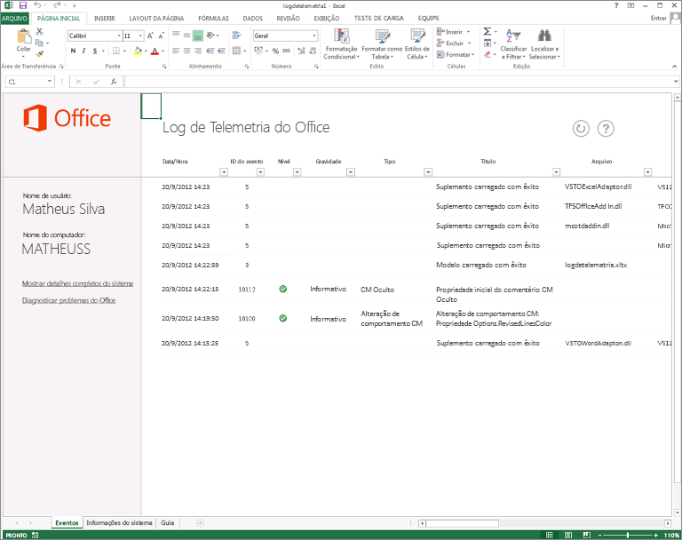

# Solucionando problemas de arquivos e de soluções personalizadas do Office com o log de telemetria

Use o Telemetry Log for Office 2013 para determinar problemas de compatibilidade com o Office 2013 e as soluções criadas para versões anteriores do Office.
  
O artigo a seguir descreve o Telemetry Log e como usá-lo. Para saber mais sobre os resultados específicos exibidos no Telemetry Log, consulte [Compatibility issues in Office 2013](compatibility-issues-in-office.md).

Em várias versões, a Microsoft forneceu ferramentas e estruturas para personalizar, automatizar e estender o Office. Isso permitiu que empresas e usuários criassem soluções ou suplementos para aplicativos do Office e aprimorassem sua produtividade e eficiência. Essas soluções podem variar em complexidade, desde simples macros do Visual Basic for Applications (VBA) até robustas personalizações do .NET Framework. Vários usuários com essas soluções dependem delas para concluir tarefas críticas para os negócios e podem até não saber que estão usando uma personalização adicionada aos aplicativos do Office.
  
Com tal proliferação de soluções do Office, a atualização de versões do Office pode ser complexa. As empresas e os usuários não sabem se suas soluções importantes e valiosas são totalmente compatíveis com a nova versão. As soluções podem usar recursos e código de computador disponível em versões anteriores do Office que foram preteridos em versões posteriores. Se uma solução que use um recurso preterido for carregada no aplicativo "host", a solução poderá se comportar de maneira diferente, causar um erro, falhar ao carregar ou causar uma falha no aplicativo host.
  
O Telemetry Log for Office 2013, uma ferramenta criada no Excel 2013, ajuda desenvolvedores e usuários experientes a diagnosticar problemas de compatibilidade exibindo eventos que ocorrem em aplicativos do Office 2013 selecionados. Usando essa ferramenta, os usuários poderão determinar potenciais problemas com suplementos usados no ambiente de trabalho, oferecendo aos tomadores de decisão da empresa as informações de que precisam para decidir se atualizam para o Office 2013. O Telemetry Log também oferece comentários detalhados sobre alterações ou substituições nos modelos de objeto para os aplicativos do Office 2013, o que ajuda os desenvolvedores a identificar e a refatorar rapidamente código ou controles com problemas. Os profissionais de TI podem exibir tendências em integridade de solução em vários clientes usando o Telemetry Dashboard for Office 2013, uma ferramenta complementar do Telemetry Log.
  
Para saber mais, consulte [Implantar o Painel de Telemetria do Office](https://technet.microsoft.com/library/f69cde72-689d-421f-99b8-c51676c77717).
  
## Como funciona o Telemetry Log

Quando um arquivo ou uma solução do Office é carregado, usado, fechado ou gera um erro em um dos aplicativos selecionados do Office 2013, o aplicativo adiciona um registro a um armazenamento de dados local (um banco de dados no mesmo computador) que inclui informações sobre o evento. O registro inclui um título para o evento, o aplicativo que registro o evento em log, a hora, o nome do arquivo ou da solução, a gravidade e uma breve descrição de quaisquer erros que possam ter ocorrido. Quando atualizada, a pasta de trabalho do Telemetry Log exibe uma lista dos registros contidos no armazenamento de dados local.
  
> [!NOTE]
> O local padrão do armazenamento de dados é %Users%\[Usuário atual]\AppData\Local\Microsoft\Office\15.0\Telemetry. O tamanho máximo padrão do armazenamento de dados é de 5 MB (5.120 KB). 
  
Os aplicativos do Office 2013 selecionados têm uma API de log de tempo de execução que cria um registro no armazenamento de dados local sempre que um arquivo ou uma solução gera um dos seguintes eventos:
  
- **OnLoad**: um registro é criado no log no armazenamento de dados local quando um arquivo ou uma solução é carregado em aplicativos do Office 2013 específicos. O erro em tempo de execução registra o nome do arquivo, o local e outras informações no armazenamento de dados local quando um evento **OnLoad** é gerado. 
    
- **OnClose**: um registro é criado no log quando um arquivo ou uma solução é fechado no aplicativo. O registro inclui o nome da solução ou do arquivo, o local e o aplicativo que registrou o evento em log.
    
- **OnError**: um registro é criado no log quando um erro é encontrado em uma solução para determinados aplicativos do Office 2013. O registro inclui o nome da solução ou do arquivo e a falha em tempo de execução ou o problema de compatibilidade encontrado pelo usuário. Quando possível, os erros são mapeados para problemas de compatibilidade conhecidos e são exibidos como tais no Telemetry Log.
    
O Telemetry Log exibe informações sobre uma grande lista de tipos de arquivo e de solução para uma seleção de aplicativos do Office 2013. Os tipos de arquivo e de solução monitorados pelas APIs de log em tempo de execução variam por aplicativo. Consulte a Tabela 1 para saber mais sobre quais tipos de solução são monitorados.
  
### Tabela 1. Tipos de arquivos e de soluções do Office rastreados no Telemetry Log

|**Tipo de solução**|**Aplicativos**|**Descrição**|
|:-----|:-----|:-----|
|Aplicativos do painel de tarefas    |Excel 2013, Word 2013, Project 2013    |São Suplementos do Office hospedados em um painel de tarefas no aplicativo cliente.    |
|Aplicativos de conteúdo    |Excel 2013    |São Suplementos do Office integrados ao conteúdo do arquivo do Office.    |
|Aplicativos de email    |Outlook 2013    |São aplicativos que aparecem no Outlook 2013 quando determinadas condições são atendidas (o corpo ou o assunto do email inclui determinadas palavras ou frases).    |
|Documentos ativos    |Word 2013    PowerPoint 2013    Excel 2013    | Os documentos ativos são quaisquer arquivos de documento do Office diferentes dos tipos de solução listados nesta tabela. Podem incluir o seguinte:     Arquivos de formato binário do Office (.doc, .ppt, .pps, .xls).     Arquivos do formato OpenXML do Office (.docx, .pptx, .ppsx, .xlsx).     Os arquivos habilitados para macro que contêm código VBA (.docm, .dotm, .pptm, .potm, .xlsm, .xltm).     Arquivos que contêm controles ActiveX.     Arquivos com Conexões de Dados Externos.    |
|Suplementos COM    |Word 2013    PowerPoint 2013    Excel 2013    Outlook 2013    |Os suplementos COM incluem os suplementos do Office development tools in Visual Studio 2010 no nível de aplicativo.    |
|Suplementos de Automação do Excel    |Excel 2013    |Este tipo de solução inclui versões anteriores de Suplementos de Automação com suporte do Excel, criados com suplementos COM. As funções dos suplementos da Automação podem ser chamadas de fórmulas em planilhas do Excel.    |
|Suplementos XLL do Excel    |Excel 2013    |Os suplementos XLL (.xll) são específicos do Excel e criados em qualquer compilador que dê suporte à criação de DLLs (bibliotecas de vínculo dinâmico). Eles não precisam ser instalados ou registrados. Os suplementos XLL também incluem DLLs com comandos e funções definidos pelo usuário.    |
|Suplementos RTD XLS do Excel    |Excel 2013    |Os suplementos de dados em tempo real (RTD) XLS são planilhas do Excel que usam a função de planilha **RealTimeData** para chamar um servidor de Automação para recuperar dados em tempo real.    |
|Suplementos WLL do Word    |Word 2013    |Os suplementos WLL (.wll) específicos para o Word e compilados com qualquer compilador que dá suporte a DLLs de compilação.    |
|Suplementos de aplicativo    |Word 2013    PowerPoint 2013    Excel 2013    |Os suplementos de aplicativo são arquivos específicos de aplicativo que contêm código VBA. Eles incluem modelos do Word habilitados para macro (.dotm), suplementos do Excel (.xla, .xlam) e suplementos do PowerPoint (.ppa, .ppam).    |
|Modelos    |Word 2013    PowerPoint 2013    Excel 2013    |Eles incluem modelos de documento (.dot, .dotx), de planilha (.xlt, .xltx) ou de apresentação (.pot, .potx) anexados a um arquivo do Office.    |
   
## Usando o Log de Telemetria do Office

Quando você instala o Office 2013, o Telemetry Log é instalado, o armazenamento de dados local é criado no mesmo computador e as APIs de log em tempo de execução são habilitadas nos aplicativos Office 2013 listados anteriormente. No entanto, uma solução ou um arquivo deverá ser carregado ou aberto no aplicativo antes que o Telemetry Log possa começar a monitorá-lo.
  
Use o procedimento a seguir para exibir os problemas do Office registrados no Telemetry Log. 
  
### Para usar o Telemetry Log

1. Para abrir o Telemetry Log, siga um destes procedimentos:
    
   - **No Windows 7:** no menu **Iniciar**, escolha **Todos os Programas**. Em seguida, na lista de programas, expanda **Microsoft Office 2013**, expanda **Ferramentas do Office 2013** e clique em **Log de Telemetria do Office 2013**.
    
     Uma nova pasta de trabalho do Excel 2013 é aberta. A pasta de trabalho tem três planilhas chamadas **Eventos**, **Informações do sistema** e **Guia**.
    
   - **No Windows 8:** deslize o dedo para cima para exibir a AppBar, escolha **Todos os Aplicativos** e escolha **Log de Telemetria do Office 2013**.
    
     Uma nova pasta de trabalho do Excel 2013 é aberta. A pasta de trabalho tem três planilhas chamadas **Eventos**, **Informações do sistema** e **Guia**.
    
2. Para exibir uma lista de eventos atualizada, na planilha **Eventos**, na parte superior da planilha, escolha **Atualizar**.
    
3. Para exibir os dados de evento coletados de aplicativos do Office 2013, examine a tabela exibida na planilha **Eventos**. 
    
4. Para examinar as informações sobre o computador no qual o Office 2013 e o Telemetry Log estão instalados, examine as informações exibidas na planilha **Informações do Sistema**. 
    
> [!NOTE]
> Não é necessário salvar a pasta de trabalho do Telemetry Log no Excel 2013 para manter um registro dos resultados, já que as informações são armazenadas no armazenamento de dados local (que é separado do Telemetry Log). No entanto, salvar a pasta de trabalho não prejudica o Telemetry Log. 
  
O Telemetry Log exibe algumas informações simples sobre os eventos registrados. Cada registro exibido no Telemetry Log contém um título e lista a gravidade do evento exibido. Para erros, os registros também incluem uma descrição do erro, além de etapas para o tratamento do problema. Tenha em mente que nem todos os registros exibidos representam erros causados por soluções do Office; o Telemetry Log também mostra quando soluções e arquivos são carregados ou fechados com êxito. 
  
Por exemplo, o problema chamado "OM Oculto: Propriedade Comment.Initial" aparecerá se uma solução ou um arquivo habilitado para macro aberto no Word 2013 tentar obter as iniciais do comentarista associado a um comentário. O Word 2013 contém um recurso que aprimorou a experiência de comentar e que por padrão não exibe as iniciais do comentarista. As APIs associadas ao modelo antigo de comentários foram ocultadas no modelo de objeto do Word 2013 mas permanecem disponíveis para compatibilidade com versões anteriores. O problema "OM Oculto: Comment.Initial" no indica o arquivo que tentou usar a API, o aplicativo que gerou o evento (Word 2013), a hora e a data do evento e uma breve descrição sobre o erro e como corrigi-lo.
  
**Figura 1. Log de Telemetria do Office**
  

  
> [!NOTE]
>  A planilha de **Informações do Sistema** no Log de Telemetria contém informações sobre o computador em que o Office 2013 está instalado. A planilha exibe as seguintes informações: 
> - Nome de usuário.
> - Nome completo do computador.
> - Arquitetura do sistema operacional (x64/64 bits ou x86/32 bits).
> - Versão do Windows instalada no computador.
> - Fuso horário do relógio interno do computador.
> - Versão do Log de Telemetria.
> - Versão do Office instalada no computador.
> 
> Essas informações podem ser úteis quando você está interpretando os problemas e eventos listados na planilha **Eventos**. 
  
No Telemetry Log, um nível de gravidade é exibido junto aos problemas conhecidos. No exemplo anterior, um problema no qual uma parte do modelo de objeto foi ocultada com frequência tem um nível de gravidade "Informativo". Por outro lado, outros problemas conhecidos podem ser mais sérios e exigir uma ação mais imediata. A gravidade dos problemas exibidos do Telemetry Log pode ser uma das seguintes:
  
- **Informação** O problema pode não ter um efeito imediato sobre a compatibilidade do aplicativo, mas o usuário pode ter que tomar uma ação posteriormente. Vários problemas do tipo "OM oculto" têm esse nível de gravidade. 
    
- **Aviso** O problema pode causar perda de dados ou resultar em fidelidade visual reduzida. 
    
- **Crítico** O problema pode causar perda significativa de funcionalidade ou fazer o aplicativo falhar. 
    
### Tabela 2. Tipos de eventos exibidos no Telemetry Log

Use a tabela a seguir (Tabela 2) para interpretar os registros exibidos no Telemetry Log.
  
|**ID do Evento**|**Título**|**Severidade**|**Descrição**|
|:-----|:-----|:-----|:-----|
|1    |Documento carregado com êxito    ||O arquivo listado na coluna **Arquivo** foi aberto no aplicativo do Office sem problemas.    |
|2    |Falha ao carregar o documento    |Aviso    | O aplicativo não conseguiu carregar o arquivo. Pode haver algum problema de compatibilidade subjacente.    Confira mais informações sobre como reparar uma pasta de trabalho corrompida no Excel 2013 em [Reparar uma pasta de trabalho corrompida](https://office.microsoft.com/pt-BR/excel-help/repairing-a-corrupted-workbook-HA102749554.aspx).  Confira mais informações sobre como reparar um documento corrompido no Word 2013 em [Salvar e recuperar uma cópia de backup de um documento](https://office.microsoft.com/pt-BR/word-help/save-and-recover-a-backup-copy-of-a-document-HA010121250.aspx).   |
|3    |Modelo carregado com êxito    ||O arquivo de modelo listado na coluna **Arquivo** foi aberto no aplicativo do Office sem problemas.    |
|4    |Falha do modelo ao carregar    |Aviso    | O aplicativo não conseguiu carregar o arquivo de modelo. Pode haver algum problema de compatibilidade subjacente ou a disponibilidade do modelo pode ter sido alterada.    Confira mais informações sobre como reparar uma pasta de trabalho corrompida no Excel 2013 em [Reparar uma pasta de trabalho corrompida](https://office.microsoft.com/pt-BR/excel-help/repairing-a-corrupted-workbook-HA102749554.aspx).  Confira mais informações sobre como reparar um documento corrompido no Word 2013 em [Salvar e recuperar uma cópia de backup de um documento](https://office.microsoft.com/pt-BR/word-help/save-and-recover-a-backup-copy-of-a-document-HA010121250.aspx).   |
|5    |Suplemento carregado com êxito    ||O suplemento carregado na coluna **Arquivo** foi carregado no aplicativo do Office com êxito. Nenhum problema de compatibilidade foi detectado.    |
|6    |Falha ao carregar o suplemento    |Crítico    | O aplicativo não conseguiu carregar o suplemento listado na coluna **Arquivo**.    Confira mais informações sobre como reparar uma pasta de trabalho corrompida no Excel 2013 em [Reparar uma pasta de trabalho corrompida](https://office.microsoft.com/pt-BR/excel-help/repairing-a-corrupted-workbook-HA102749554.aspx).     Confira mais informações sobre como reparar um documento corrompido no Word 2013 em [Salvar e recuperar uma cópia de backup de um documento](https://office.microsoft.com/pt-BR/word-help/save-and-recover-a-backup-copy-of-a-document-HA010121250.aspx).   |
|7    |Manifesto de suplemento baixado com êxito    ||O aplicativo host carregou o manifesto no Suplemento do Office com êxito.    |
|8    |Manifesto de suplemento não baixado    |Crítico    |O aplicativo host não pôde carregar o arquivo de manifesto do suplemento do Office do catálogo do SharePoint, do catálogo corporativo ou da Office Store.    |
|9    |Não foi possível analisar o manifesto de suplemento    |Crítico    |O aplicativo host carregou o manifesto do Suplemento do Office no suplemento, mas não conseguiu ler o XML.    |
|10    |O suplemento usou CPU em excesso    |Crítico    |O suplemento do Office usou mais de 90% dos recursos da CPU em um período de tempo finito.    |
|11    |O aplicativo falhou ao carregar    |Crítico    |O aplicativo do Office tentou carregar um documento ou uma solução ao ser iniciado, mas problemas com o documento ou a solução impediram a inicialização do aplicativo.    |
|12    |O aplicativo foi fechado devido a um problema    |Crítico    |Algo causou um erro crítico no aplicativo e foi necessário fechá-lo.    |
|13    |Documento fechado com êxito    ||O arquivo listado na coluna **Arquivo** foi fechado com êxito.    |
|14    |Sessão de aplicativo estendida    ||As sessões do aplicativo com um documento ou uma solução em particular devem durar apenas 24 horas. Se uma sessão passar de 24 horas, o aplicativo host criará uma nova sessão.    |
|15    |Suplemento desabilitado porque esgotou o tempo limite na pesquisa de cadeia de caracteres    ||O suplemento de email pesquisa a linha de assunto e a mensagem de um email para determinar se eles devem ser exibidos usando uma expressão regular. O aplicativo de email listado na coluna **Arquivo** foi desabilitado pelo Outlook 2013 porque esgotou o tempo limite repetidamente enquanto tentava corresponder a uma expressão regular.    |
|16    |O documento estava aberto quando o aplicativo parou de responder    |Crítico    |O arquivo listado na coluna **Arquivo** foi aberto quando o aplicativo (listado na coluna de aplicativos) parou de responder. O arquivo pode ou não ter sido responsável pela falha do **Aplicativo**.    |
|17    |Suplemento fechado com êxito    |Informativo    |O aplicativo conseguiu desligar o suplemento com êxito.    |
|18    |Aplicativo fechado com êxito    ||O aplicativo host conseguiu fechar o suplemento do Office com êxito.    |
|19    |O suplemento encontrou um erro de tempo de execução    |Crítico    |O Suplemento do Office teve um problema que causou sua falha. Para obter mais detalhes, examine o log de Alertas do Microsoft Office usando o Visualizador de Eventos do Windows no computador que encontrou o erro.    |
|20    |Falha ao verificar a licença do suplemento    |Crítico    |As informações de licenciamento para o Suplemento do Office não puderam ser verificadas e podem ter expirado. Para obter mais detalhes, examine o log de Alertas do Microsoft Office usando o Visualizador de Eventos do Windows no computador que encontrou o erro.    |
|21  |A macro encontrou um erro de compilação  |Aviso  | O arquivo contém uma macro que falhou ao compilar e não pôde ser executada. Para obter mais detalhes, confira a mensagem de erro apresentada ao tentar compilar a macro no editor de macro. | 
|22  |A macro encontrou um erro de tempo de execução | Aviso  | O arquivo contém uma macro que encontrou um erro de tempo de execução. Para obter mais detalhes, confira a mensagem de erro apresentada ao tentar executar a macro no editor de macro e confira a [Referência do Visual Basic for Applications](https://docs.microsoft.com/previous-versions/visualstudio/visual-basic-6/aa264975%28v=vs.60%29). |
|Vários    |"Alteração de Comportamento de OM: ..."    |Informativo    |O código do suplemento ou do documento habilitado para macro usa um objeto, um membro, uma coleção, uma enumeração ou uma constante que se comporta de forma diferente das versões anteriores do Office.   Para saber mais, consulte [Compatibility issues in Office 2013](compatibility-issues-in-office.md).    |
|Vários    |"OM Removido: …"    |Crítico    |O código do suplemento ou do documento habilitado para macro usa um objeto, um membro, uma coleção, uma enumeração ou uma constante removido do modelo de objeto.  Para saber mais, consulte [Compatibility issues in Office 2013](compatibility-issues-in-office.md).    |
|Vários    |"OM Oculto: …"    |Informativo    |O código do suplemento ou do documento habilitado para macro usa um objeto, um membro, uma coleção, uma enumeração ou uma constante ocultado no modelo de objeto.  Para saber mais, consulte [Compatibility issues in Office 2013](compatibility-issues-in-office.md).    |
|Vários    |"Controle: …"    ||O arquivo contém um controle que pode não ter suporte no Office 2013 ou no sistema operacional do computador.  Para saber mais, consulte [Compatibility issues in Office 2013](compatibility-issues-in-office.md).    |
   
## Conclusão

O Telemetry Log oferece às grandes empresas, aos usuários individuais e aos desenvolvedores uma ferramenta simples para o monitoramento das soluções críticas do Office. Ao identificar soluções do Office com problemas antes de uma atualização em larga escala, as empresas poderão prever de forma mais racional o custo da adoção do Office 2013.
  
## Confira também

- [Central de Desenvolvedores do Office](https://msdn.microsoft.com/office/aa905340.aspx)
- [Compatibility issues in Office 2013](compatibility-issues-in-office.md)
- [Implantar o Painel de Telemetria do Office](https://technet.microsoft.com/library/f69cde72-689d-421f-99b8-c51676c77717)
- [Central de desenvolvedores do Office](https://msdn.microsoft.com/office/aa905340)
    

