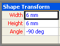

# Sobre a janela Rastreamento de FórmulaAbout the Formula Tracing Window

A janela **Rastreamento de Fórmula** tem como objetivo fornecer aos desenvolvedores de formas informações sobre interdependências entre células — que incluem tanto as células dependentes (células que dependem de uma determinada célula) como as células precedentes (células das quais uma determinada célula depende).The **Formula Tracing** window is designed to provide shape developers with information about cell interdependencies—both dependent cells (cells that have a dependency on a given cell), and precedent cells (cells that a given cell depends on). 
  
As células em um Microsoft Visio ShapeSheet contêm valores e fórmulas.The cells in a Microsoft Visio ShapeSheet contain values and formulas. As fórmulas, por sua vez, podem fazer referências a outras células, permitindo que seja calculado o valor de uma célula com base no valor de outra.Formulas can, in turn, have references to other cells, giving you the power to calculate a value in one cell based on another cell's value. No entanto, quando você cria ou mantém formas complexas, a identificação de todas essas interdependências pode se tornar difícil porque uma fórmula pode fazer referência a qualquer célula do desenho, seja ela uma célula do mesmo ShapeSheet ou pertencente a outro objeto do desenho, como uma página, um estilo, um mestre ou outra forma.When creating or maintaining complex shapes, however, it can be difficult to identify all these interdependencies because a formula can reference any cell in the drawing, whether it's a cell in the same ShapeSheet, or a cell belonging to another object in the drawing, for example, a page, style, master, or another shape. 
  
A janela **Rastreamento de Fórmula** fornece informações que o ajudam a entender as implicações das alterações que você faz nas células.The **Formula Tracing** window provides information to help you understand the implications of changes you make to cells. 
  
## Mostrar a janela Rastreamento de FórmulaDisplaying the Formula Tracing Window

Para exibir a janela **Rastreamento de Fórmula** com a janela ShapeSheet ativa, em **Ferramentas de ShapeSheet** na guia **Design**, no grupo **Rastreamento de Fórmula**, clique em \*\* Mostrar Janela\*\*.To view the **Formula Tracing** window, with the ShapeSheet window active, under **ShapeSheet Tools** on the \*\* Design \*\* tab, in the **Formula Tracing** group, click **Show Window**. A janela **Rastreamento de Fórmula** aparece encaixada na janela ShapeSheet por padrão, mas é uma janela ancorada que pode ser encaixada, flutuada ou mesclada com as outras janelas ShapeSheet ancoradas disponíveis, por exemplo, a janela **Explorador de Estilo**.The **Formula Tracing** window appears docked in the ShapeSheet window by default, but is an anchored window that can be docked, floated or merged with other available anchored ShapeSheet windows, for example, the **Style Explorer** window. 
  
## Rastreando células dependentesTracing dependent cells

Para obter uma lista das células dependentes de uma determinada célula, selecione a célula na janela ShapeSheet. Neste exemplo, a célula Width está selecionada.To see a list of cells that are dependent on a particular cell, select that cell in the ShapeSheet window. In this example, the Width cell is selected. 
  

  
Para exibir as células dependentes, no grupo **Rastreamento de Fórmula**, clique em **Rastrear Dependentes**.To view its dependent cells, in the **Formula Tracing**group, click **Trace Dependents**.
  
Uma lista de todas as células com uma dependência na célula Width é exibida na janela **Rastreamento de Fórmula**. É possível navegar para qualquer célula da lista clicando duas vezes em sua entrada na janela **Rastreamento de Fórmula**.A list of all the cells with a dependency on the Width cell appears in the **Formula Tracing** window. You can navigate to any cell in the list by double-clicking its entry in the **Formula Tracing** window. 
  

  
## Rastreando células precedentesTracing precendent cells

Para obter uma lista das células das quais uma determinada célula é dependente, primeiro selecione a célula na janela ShapeSheet. Neste exemplo, a célula Geometry1.X2 está selecionada.To see a list of cells that a particular cell is dependent upon, first select the cell in the ShapeSheet window. In this example, the Geometry1.X2 cell is selected. 
  

  
Para exibir suas células precedentes, no grupo **Rastreamento de Fórmula**, clique em **Rastrear Precedentes**.To view its precedent cells, in the **Formula Tracing**group, click **Trace Precedents**.
  
Uma lista de todas as células das quais a célula Geometry1.X2 é dependente aparece na janela **Rastreamento de Fórmula**.A list of all the cells that the Geometry1.X2 cell is dependent upon appears in the **Formula Tracing** window. Você pode navegar para qualquer célula na lista clicando em sua entrada na janela **Rastreamento de Fórmula**.You can navigate to any cell in the list by double-clicking its entry in the **Formula Tracing** window. 
  

  

