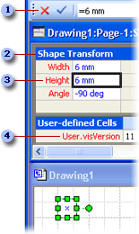

# Sobre a planilha ShapeSheet

Todos os elementos do Microsoft Visio, cada documento, página, estilo, forma, grupo, forma ou objeto em um grupo, mestre, objeto de outro programa, guia e ponto de guia têm uma planilha ShapeSheet na qual as informações sobre esse objeto são armazenadas. Essa planilha contém informações como altura, largura, ângulo, cor e outros atributos que determinam a aparência e o comportamento da forma.
  
Como desenvolvedor de formas, você precisa ter um controle preciso sobre a aparência e o comportamento das formas criadas. É possível alterar o comportamento padrão de uma forma e aprimorá-la editando-a em sua planilha ShapeSheet, que pode ser acessada em uma janela do ShapeSheet ou programaticamente.
  
## Exibindo um objeto em uma janela ShapeSheet

A janela de desenho Visio e a janela ShapeSheet são simplesmente diferentes visualizações da mesma forma.
  
- Ao exibir uma forma em uma janela de desenho, é possível visualizá-la processada graficamente e se comportando de acordo com as fórmulas de sua ShapeSheet.
    
- Quando uma forma é visualizada em uma janela ShapeSheet, é possível ver as fórmulas subjacentes que determinam como será a aparência e o comportamento da forma na página de desenho.
    
É possível exibir uma janela ShapeSheet e uma janela de desenho ao mesmo tempo e ver a alteração da forma na janela de desenho à medida que você manipula as células na janela ShapeSheet ou vice-versa. Por exemplo, quando você move a forma com o ponteiro, as fórmulas PinX e PinY da forma na seção Shape Transform mudam para refletir sua nova posição na página de desenho.
  
## Estrutura da janela ShapeSheet

Uma ShapeSheet é dividida em *seções* que controlam um aspecto específico do comportamento de uma forma ou aparência, por exemplo, sua geometria ou sua formatação. Cada seção contém uma ou mais *linhas* que contenham *células* . Cada célula pode conter uma fórmula, seu resultado (normalmente chamado o valor da célula) e informações de erro opcionais. Uma fórmula pode ser obrigatórias ou opcionais, dependendo de cada célula. Dados de uma célula (por exemplo, sua fórmula ou valor) podem ser definidos localmente ou, mais comumente, herdados da célula equivalente no mestre da forma ou estilo. 
  
O exemplo a seguir mostra a barra de fórmulas , uma seção , uma célula e uma linha  na janela ShapeSheet. 
  

  
Quando você desenha uma forma, o Visio grava a forma como uma coleção de locais horizontais e verticais conectados com segmentos de linha. Desses locais (chamados de vértices) são gravados nas células X e Y da seção de **geometria** da forma. Conforme mostrado no exemplo a seguir, quando você clica em células X e Y na seção **Geometry** da janela ShapeSheet de uma forma, você verá uma caixa preto com uma realce de vértice da forma na janela de desenho. 
  

  
## Editando um objeto na janela ShapeSheet

Quando uma janela do ShapeSheet está ativa, a faixa de opções é alterada para exibir opções específicas ao trabalho nessa janela. Ao selecionar uma célula do ShapeSheet, é exibida uma barra de fórmulas, a qual é utilizada para inserir e editar as fórmulas de um objeto. Uma outra alternativa é trabalhar diretamente na célula.
  
Em uma janela ShapeSheet, você pode adicionar seções à folha de uma forma para adicionar novas características à forma na página de desenho. Por exemplo, você pode adicionar uma seção de **Pontos de Conexão** para criar uma conexão. Quando não precisar mais uma seção, você pode excluí-lo. 
  
Você também pode adicionar linhas às seções para abrigar fórmulas adicionais ou alterar a aparência de uma forma. Por exemplo, você pode adicionar uma linha a uma seção **Geometry** para adicionar um segmento a uma forma. Da mesma forma, você pode excluir linhas que desnecessária. 
  
Tanto fórmulas como valores podem ser exibidos nas células. Exiba as fórmulas quando estiver inserindo novas fórmulas, editando fórmulas existentes ou para visualizar como as fórmulas se relacionam entre si nas células. Um valor é o resultado obtido quando o Visio avalia a fórmula de uma célula. É possível exibir os valores nas células para ver o resultado de uma avaliação.
  
## Referências adicionais da ShapeSheet

Para obter detalhes sobre uma determinada seção, linha ou célula na ShapeSheet, veja o artigo de correspondente nesta [Referência da ShapeSheet](reference-visio-shapesheet.md).
  
Para obter detalhes sobre como acessar programaticamente a planilha ShapeSheet, consulte a Referência de automação do Microsoft Visio.
  

