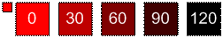

# Função SHADESHADE Function

Modifica a cor reduzindo a luminosidade pelo valor (positivo ou negativo) especificado no parâmetro _int_ .Modifies the color by decreasing its luminosity by the amount (positive or negative) specified in the  _int_ parameter. 
  
## SintaxeSyntax

SOMBREAMENTO (\* \* *cor* \* \*, \* \* *int* \* \*)SHADE(\*\* *color* \*\*, \*\* *int* \*\* ) 
  
### ParâmetrosParameters

|**Name****Name**|**Obrigatório/Opcional****Required/Optional**|**Tipo de dados****Data Type**|**Descrição****Description**|
|:-----|:-----|:-----|:-----|
| _color__color_   |ObrigatórioRequired    |**Numeric****Numeric**   |O índice de cores do Microsoft Visio ou o valor RGB da cor.The Microsoft Visio color index or RGB value of the color.    |
| _int__int_   |ObrigatórioRequired    |**Integer****Integer**   |O valor pelo qual a luminosidade da cor será reduzida. Pode ser positivo ou negativo.The amount by which to decrease the luminosity of the color. Can be positive or negative.    |
   
### Valor de retornoReturn value

 **RGB****RGB**
  
## ComentáriosRemarks

Os limites superiores e inferiores de luminosidade são 0 e 240, respectivamente.The upper and lower limits of luminosity are 0 and 240 respectively. Não há nenhum limite do tamanho do inteiro, que você pode passar para o parâmetro _int_ , mas luminosidade nunca excede esses limites.There is no limit on the size of the integer you can pass for the  _int_ parameter, but luminosity never exceeds these limits. 
  

  

